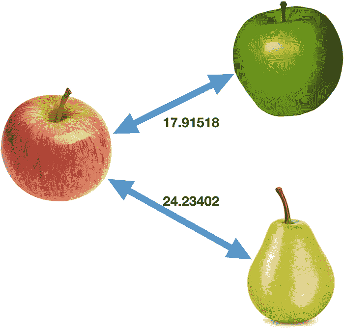
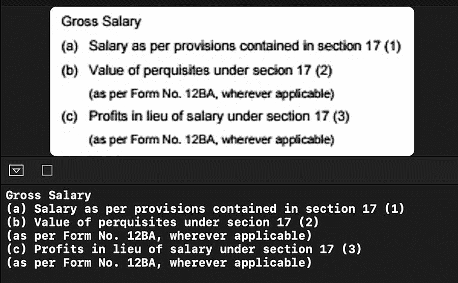
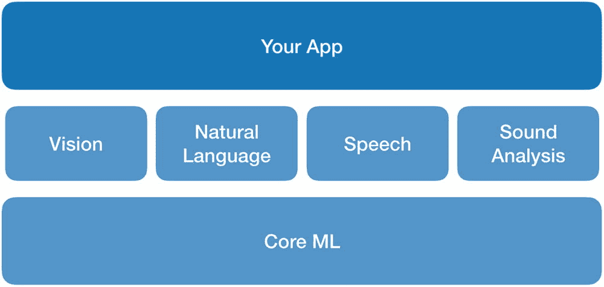
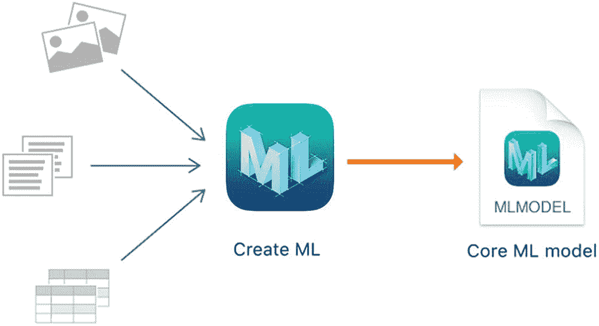

# 2. Apple ML 工具简介

在软件和机器学习领域，学习并尝试最新的工具至关重要。如果你不知道如何使用这些高效工具，可能会浪费大量时间。本章将介绍 Apple 为 iOS 开发者提供的、用于轻松构建机器学习应用的工具。本章中介绍的框架和工具包括 `Vision`、`VisionKit`、`Natural Language`、`Speech`、`Core ML`、`Create ML` 以及 `Turi Create`。我们将学习这些工具具备哪些能力，以及我们可以利用它们构建哪些类型的应用。

## Vision

`Vision` 框架用于处理图像和视频。它提供了多种计算机视觉和机器学习能力，适用于视觉数据。`Vision` 框架的一些功能包括：人脸检测、身体检测、动物检测、文本检测与识别、条形码识别、物体追踪、图像对齐等。我将提及一些主要功能和方法，同时会涉及一些你可能未曾听说的 iOS 隐藏特性。鉴于本书专注于文本处理，将不涉及图像处理的细节。如果你需要了解更多与计算机视觉算法相关的信息，可以在 Apple 开发者网站上找到详细资料和示例项目。

### 人脸与身体检测

Vision 提供了多种用于在图像中检测人脸和人类的请求类型。这里我将提及其中一些请求，以回顾 Apple 通过内置 API 提供了哪些功能。`VNDetectFaceRectanglesRequest` 用于人脸检测，它会返回给定图像中检测到的人脸矩形区域以及偏航角。该请求还会提供人脸的偏航角和滚动角。`VNDetectFaceLandmarksRequest` 能够提供嘴部、眼睛、面部轮廓、眉毛、鼻子和嘴唇的位置。`VNDetectFaceCaptureQualityRequest` 用于捕获图像中人脸的质量，可用于自拍编辑应用。有一个名为“根据捕获质量选择自拍”的示例项目，演示了如何比较不同图像中的人脸质量。

`VNDetectHumanRectanglesRequest` 用于检测人类，并返回定位图像中人类位置的矩形区域。

要使用这些请求，你需要创建一个 `ImageRequestHandler` 和一个特定类型的请求。通过 `perform` 方法将该请求传递给处理器，如代码清单 `2-1` 所示。这将在图像缓冲区上执行请求并返回结果。示例展示了在给定图像上进行人脸检测的代码。

```
let handler = VNImageRequestHandler(cvPixelBuffer:
pixelBuffer, orientation: .leftMirrored, options:
requestOptions)
let faceDetectionRequest =
VNDetectFaceCaptureQualityRequest()
do {
try
handler.perform([faceDetectionRequest])
guard let faceObservations =
faceDetectionRequest.results as? [VNFaceObservation]
else {return}
}
} catch {
print("Vision error: \
(error.localizedDescription)")
}
```

**代码清单 2-1** 人脸检测请求


### 图像分析

借助内置的图像分析功能，您可以创建能够理解图像内容的应用程序。可以使用 `Vision` 框架来检测和定位图像中的矩形、人脸、条形码和文本。如果您想深入了解，Apple 还提供了一个示例项目，展示了如何检测图像中的文本和二维码。

Apple 还提供了一个内置的机器学习模型，能够对 1303 个类别进行分类，涵盖从车辆到动物和物体的众多类别。例如：杂技演员、飞机、饼干、熊、床、厨房水槽、金枪鱼、火山、斑马等。

您可以通过调用 `knownClassifications` 方法获取这些类别的列表，如代码清单 2-2 所示。

```
let handler = VNImageRequestHandler(cgImage:
image.cgImage!, options: [:])
let classes = try VNClassifyImageRequest.knownClassifications(forRevision:
VNDetectFaceLandmarksRequestRevision1)
let classIdentifiers = classes.map({$0.identifier})
代码清单 2-2
内置图像类别
```

我创建了一个 Swift playground 来演示如何使用内置分类器。¹ Apple 让图像分类变得超级简单。代码清单 2-3 中的示例代码就是你所需要的一切。

```
import Vision
let handler = VNImageRequestHandler(cgImage: image,
options: [:])
let request = VNClassifyImageRequest()
try? handler.perform([request])
let observations = request.results as?
[VNClassificationObservation]
代码清单 2-3
图像分类
```

`Vision` 框架的另一个功能是图像相似度检测。这可以通过使用 `VNGenerateImageFeaturePrintRequest` 来实现。该请求会创建图像的特征指纹，然后您可以使用 `computeDistance` 方法来比较这些特征指纹。代码清单 2-4 中的代码示例展示了如何使用该方法。同样，我们创建 `ImageRequestHandler` 和一个请求，然后调用 `perform` 来执行这个请求。

```
func featureprintObservationForImage(atURL url: URL)
-> VNFeaturePrintObservation? {
let requestHandler =
VNImageRequestHandler(url: url, options: [:])
let request =
VNGenerateImageFeaturePrintRequest()
do {
try requestHandler.perform([request])
return request.results?.first as?
VNFeaturePrintObservation
} catch {
print("Vision error: \(error)")
return nil
}
}
代码清单 2-4
创建图像特征指纹
```

这个函数用于创建图像的特征指纹。它是图像的一种数学表示，我们可以用它来与其他图像进行比较。代码清单 2-5 展示了如何使用此特征指纹来比较图像。

```
let apple1 = featureprintObservationForImage(atURL:
Bundle.main.url(forResource:"apple1", withExtension:
"jpg")!)
let apple2 = featureprintObservationForImage(atURL:
Bundle.main.url(forResource:"apple2", withExtension:
"jpg")!)
let pear = featureprintObservationForImage(atURL:
Bundle.main.url(forResource:"pear", withExtension:
"jpg")!)
var distance = Float(0)
try apple1!.computeDistance(&distance, to: apple2!)
var distance2 = Float(0)
try apple1!.computeDistance(&distance2, to: pear!)
代码清单 2-5
特征指纹
```

在这里，我正在将梨子图像与苹果图像进行比较。图像距离结果如图 2-1 所示。



图 2-1

比较图像距离

*您可以在相应脚注的链接中找到 Swift playground 的完整代码示例。*²

### 文本检测与识别

要检测和识别图像中的文本，您不需要任何第三方框架。Apple 通过 `Vision` 框架提供了这些功能。

您可以使用 `VNDetectTextRectanglesRequest` 来检测图像中的文本区域。它会返回带有原点和尺寸的矩形边界框。如果您想分别检测每个字符框，应将 `reportCharacterBoxes` 变量设置为 `true`。

`Vision` 框架还提供了文本识别（光学字符识别）功能，您可以使用它来处理扫描文档或名片中的文本。

图 2-2 展示了在 playground 上运行的文本识别。



图 2-2

文本识别结果

与其它 `Vision` 功能类似，为了处理图像中的文本，我们创建 `VNRecognizeTextRequest`，如代码清单 2-6 所示，并使用 `VNImageRequestHandler` 执行此请求。文本请求包含一个闭包，该闭包在处理完成时被调用。它返回为检测到的每个文本矩形生成的观察结果。

```
let textRecognitionRequest = VNRecognizeTextRequest {
(request, error) in
guard let observations = request.results as?
[VNRecognizedTextObservation] else {
print("The observations are of an unexpected type.")
return
}
let maximumCandidates = 1
for observation in observations {
guard let candidate =
observation.topCandidates(maximumCandidates).first
else { continue }
textResults += candidate.string + "\n"
}
}
}
let requestHandler = VNImageRequestHandler(cgImage:
image, options: [:])
do {
try
requestHandler.perform([textRecognitionRequest])
} catch {
print(error)
}
代码清单 2-6
文本识别
```

文本识别请求有一个 `recognitionLevel` 属性，用于在准确率和速度之间进行权衡。您可以将其设置为 `accurate`（精确）或 `fast`（快速）。

### Vision 的其他功能

`Vision` 框架还提供了其他功能，如图像显著性分析、水平线检测和物体识别。通过图像显著性分析，iOS 可以检测图像的哪些部分能吸引人们的注意力。它还提供了基于物体的注意力显著性分析，用于检测前景物体。您可以使用这些功能来自动裁剪图像或生成热力图。这两种请求类型分别是 `VNGenerateAttentionBasedSaliencyImageRequest`（基于注意力）和 `VNGenerateObjectnessBasedSaliencyImageRequest`（基于物体）。与其他 `Vision` API 类似，您创建一个请求，然后使用图像请求处理器来执行它，如代码清单 2-7 所示。

```
let request =
VNGenerateAttentionBasedSaliencyImageRequest()
try? requestHandler.perform([request])
代码清单 2-7
图像显著性
```

水平线检测可以让我们确定图像中的地平线角度。通过此请求（`VNDetectHorizonRequest`），您可以获取图像角度以及修复图像方向所需的 `CGAffineTransform`。您还可以使用 `VNHomographicImageRegistrationRequest` 来确定对齐两张图像所需的透视扭曲矩阵。

`Vision` 的另一个功能是物体识别。您可以使用内置的 `VNClassifyImageRequest` 来检测物体，或者如果您想使用自己的图像数据集进行训练，也可以使用 `Create ML` 或 `Turi Create` 创建自定义模型。


## VisionKit

如果你曾经在 iOS 上使用过备忘录应用，你可能用过图 2-3 中显示的内置文档扫描仪。`VisionKit` 让我们可以在自己的应用中使用这个强大的文档扫描仪。实现起来非常简单：

1.  如图 2-8 所示，展示文档相机。
2.  实现 `VNDocumentCameraViewControllerDelegate` 以接收回调，如图 2-9 所示。它会通过以下函数返回每一页的图像。

```
let vc = VNDocumentCameraViewController()
vc.delegate = self
present(vc, animated: true)
```

**代码清单 2-8**：实例化文档相机

```
func documentCameraViewController(_ controller: VNDocumentCameraViewController, didFinishWith scan: VNDocumentCameraScan) {
    var scannedImageList = []
    for pageNumber in 0 ..< scan.pageCount {
        let image = scan.imageOfPage(at: pageNumber)
        self.scannedImageList.append(image)
    }
}
```

**代码清单 2-9**：捕获扫描的文档图像

**图 2-3**：内置文档扫描仪

## 自然语言处理

自然语言处理框架让你能够分析文本数据并提取知识。它提供了语言识别、分词（枚举字符串中的单词）、词形还原、词性标注以及命名实体识别等功能。

### 语言识别

语言识别功能让你能够确定文本的语言。我们可以通过使用 `NLLanguageRecognizer` 类来检测给定文本的语言。它支持 57 种语言。查看清单 2-10 中的代码来检测给定字符串的语言。

```
import NaturalLanguage
let recognizer = NLLanguageRecognizer()
recognizer.processString("hello")
let lang = recognizer.dominantLanguage
```

**代码清单 2-10**：语言识别

### 分词

在对文本执行自然语言处理之前，我们需要进行一些预处理，使数据更易于计算机理解。通常，我们需要拆分单词以处理文本，并移除所有标点符号。Apple 提供了 `NLTokenizer` 来枚举单词，因此无需手动解析单词之间的空格。此外，一些语言（如中文和日文）不使用空格来分隔单词；幸运的是，`NLTokenizer` 会为你处理这些边界情况。清单 2-11 中的代码示例展示了如何枚举给定字符串中的单词。

```
import NaturalLanguage
let text = "A colourful image of blood vessel cells has won this year's Reflections of Research competition, run by the British Heart Foundation"
let tokenizer = NLTokenizer(unit: .word)
tokenizer.string = text
tokenizer.enumerateTokens(in: text.startIndex..<text.endIndex) { tokenRange, _ in
    print(text[tokenRange])
    return true
}
```

**代码清单 2-11**：枚举单词

如你所见，我们导入了 `NaturalLanguage` 框架并通过指定单元类型创建了 `NLTokenizer`。这让我们能够确定枚举类型；在这里，我们可以枚举文档、单词、段落或句子。`enumerateTokens` 函数会枚举选定的标记类型（此处为单词），并为每个单词返回一个闭包。在闭包中，我们打印出每个枚举到的单词，结果如图 2-4 所示。

**图 2-4**：分词

### 词性标注

为了更好地理解语言，我们需要识别单词及其在给定句子中的功能。词性标注允许我们对字符串中的名词、动词、形容词和其他词性进行分类。Apple 提供了一个名为 `NLTagger` 的语言学标记器，用于分析自然语言文本。

清单 2-12 中的代码示例展示了如何使用 `NLTagger` 检测单词的标签。词汇类别（`lexicalClass`）是一种方案，根据类别对标记进行分类：词性、标点类型或空白。我们使用此方案并打印每个单词的类型。

```
import NaturalLanguage
let text = "The ripe taste of cheese improves with age."
let tagger = NLTagger(tagSchemes: [.lexicalClass])
tagger.string = text
let options: NLTagger.Options = [.omitPunctuation, .omitWhitespace]
tagger.enumerateTags(in: text.startIndex..<text.endIndex, unit: .word, scheme: .lexicalClass, options: options) { tag, tokenRange in
    if let tag = tag {
        print("\(text[tokenRange]):  \(tag.rawValue)")
    }
    return true
}
```

**代码清单 2-12**：单词标记

如图 2-5 所示，它成功确定了单词的类型。

**图 2-5**：确定单词类型

在使用 `NLTagger` 时，你可以根据想要检测的类型，指定一个或多个标记方案（`NLTagScheme`）作为参数。例如，`tokenType` 方案可以对单词、标点和空格进行分类；而 `lexicalClass` 方案可以对词类型、标点类型和空格进行分类。

在枚举标记时，你可以跳过特定的类型（例如，通过设置 `options` 参数）。在上述代码中，标点和空格的选项被设置为 `[.omitPunctuation, .omitWhitespace]`。

`NLTagger` 可以检测所有以下词汇类别：`noun`（名词）、`verb`（动词）、`adjective`（形容词）、`adverb`（副词）、`pronoun`（代词）、`determiner`（限定词）、`particle`（小品词）、`preposition`（介词）、`number`（数词）、`conjunction`（连词）、`interjection`（感叹词）、`classifier`（量词）、`idiom`（习语）、`otherWord`（其他词）、`sentenceTerminator`（句子终止符）、`openQuote`（左引号）、`closeQuote`（右引号）、`openParenthesis`（左括号）、`closeParenthesis`（右括号）、`wordJoiner`（单词连接符）、`dash`（破折号）、`otherPunctuation`（其他标点）、`paragraphBreak`（段落分隔符）和 `otherWhitespace`（其他空白）。

### 识别人物、地点和组织

`NLTagger` 也让检测给定文本中的人名、地名和组织名称变得非常简单。

在基于文本的应用中找到这类数据，为向用户传递信息开辟了新的途径。例如，你可以创建一个应用，能够通过显示这些名称（人物、地点和组织）在文本中（通过博客、新闻文章等）被提及的次数来自动总结文本。

查看清单 2-13，了解我们如何在一个示例句子中检测这些名称。

```
import NaturalLanguage
let text = "Prime Minister Boris Johnson has urged the EU to re-open the withdrawal deal reached with Theresa May, and to make key changes that would allow it to be passed by Parliament."
let tagger = NLTagger(tagSchemes: [.nameType])
tagger.string = text
let options: NLTagger.Options = [.omitPunctuation, .omitWhitespace, .joinNames]
let tags: [NLTag] = [.personalName, .placeName, .organizationName]
tagger.enumerateTags(in: text.startIndex..<text.endIndex, unit: .word, scheme: .nameType, options: options) { tag, tokenRange in
    if let tag = tag, tags.contains(tag) {
        print("\(text[tokenRange]):  \(tag.rawValue)")
    }
    return true
}
```

**代码清单 2-13**：识别人物和地点

这里我们再次使用 `NLTagger`，但这次我们设置了另一个名为 `joinNames` 的选项，它会将名和姓连接起来。为了过滤人名、地名和组织，我们创建了一个 `NLTag` 数组。

`NLTagger` 可以找到的单词标签如图 2-6 所示。

**图 2-6**：识别人物和地点

如你所见，我们可以利用 iOS 的自然语言处理框架从文本中推断出特定的知识。


## NLEmbedding

机器学习中的嵌入（Embedding）用于对给定数据进行数学表示。在自然语言处理中，它用于将单词进行向量化表示。将单词转换为向量后，就可以对其进行算术运算。例如，可以计算单词之间的距离或对它们求和。计算单词之间的距离能够找到相似的单词。

`NLEmbedding` 让我们能够计算两个字符串之间的距离，或在一个单词集合中查找某个字符串的最近邻。任意两个单词的相似度越高，它们之间的距离就越小。清单 2-14 中的代码示例展示了如何计算单词之间的距离。

```
import NaturalLanguage
//计算单词之间的距离
let embedding =
NLEmbedding.wordEmbedding(for:  .english)
let distance1 = embedding?.distance(between: "movie",
and: "film")
let distance2 = embedding?.distance(between: "movie",
and: "car")
清单 2-14
测量单词之间的距离
```

在上述代码中，我们使用了 `wordEmbedding` 并指定了其语言。距离计算通过 `distance` 函数完成。“movie”和“film”之间的距离是 0.64，“movie”和“car”之间的距离是 1.21。如你所见，相似的单词之间的距离更小。利用这种距离计算，你可以创建根据相似度对单词进行聚类的应用，或者创建能够检测相似文本或标题的推荐应用。你甚至可以针对任意类型的字符串创建自定义嵌入。例如，你可以创建新闻标题的嵌入，并根据用户之前的兴趣推荐新文章。要创建自定义嵌入，你可以使用 Create ML 的 `MLWordEmbedding`，并将其导出为文件，以便在你的 Xcode 项目中使用。这将在本书后续学习 Create ML 后详细讲解。

## 语音

语音框架（Speech framework）可对实时或预录的音频数据进行语音识别。使用该框架，你可以在应用中创建口语单词的转录文本。iOS 内置的听写支持功能也使用语音识别将音频数据转换为文本。

借助该框架，你可以创建能够理解像 Siri 或 Alexa 这样的语音命令的应用。Apple 表示，某些语言支持设备端语音识别，但务必注意，执行语音识别通常需要网络连接，因为该框架依赖 Apple 的服务器进行语音识别。

要转录音频，你应该为每种要支持的语言创建一个 `SFSpeechRecognizer` 实例。创建 `SFSpeechRecognizer` 和 `SFSpeechAudioBufferRecognitionRequest` 来调用 `recognitionTask` 函数，该函数会启动语音识别过程并返回结果。在此，我们通过 `result.bestTranscription.formattedString` 获取转录结果，如清单 2-15 的代码示例所示。

```
let recognitionRequest =
SFSpeechAudioBufferRecognitionRequest()
let recognitionTask =
speechRecognizer.recognitionTask(with:
recognitionRequest) { result, error in
if let result = result {
self.textView.text =
result.bestTranscription.formattedString
}
}
清单 2-15
语音识别
```

如果你希望结果块在接收到部分转录结果时就被调用，可以将 `recognitionRequest.shouldReportPartialResults` 设置为 true。

## Core ML

Apple 在 WWDC 2017 上宣布了 Core ML 框架。该框架是 Apple 对快速发展的机器学习世界的响应。通过 Core ML，开发者可以将第三方机器学习模型集成到他们的应用中。Core ML API 让我们能够在用户设备上训练、微调 ML 模型并进行预测。



图 2-7

Core ML

如图 2-7 所示，Core ML 是为 Vision、Natural Language、Speech 和 Sound Analysis 框架提供底层支持的框架。

一个名为 `coremltools` 的 Python 框架也被推出，用于将来自 Keras、Caffe 和 scikit-learn 等流行框架的深度学习模型转换为 Core ML 格式。

要使用 `coremltools`，需要了解 Python。这对 iOS 开发者构成了学习障碍。为了降低这一障碍，Apple 在 WWDC 2018 上宣布了一个更简单的机器学习工具——Create ML。

## Create ML

Create ML 是一个类似 Xcode 的独立开发者应用程序。它让我们能够轻松创建 ML 模型，无论是图像分类、文本分类还是声音分类模型。多亏了这个工具，iOS 开发者现在没有借口不开发智能的 iOS 应用了。Create ML 和 Xcode 提供了一个端到端的机器学习解决方案，使得开发者可以在 Apple 的生态系统中创建自己的解决方案。

Create ML 使得使用图像、文本或声音数据集训练模型，然后再测试这些模型变得很简单。当你完成训练和测试后，可以将训练好的模型从 Create ML 拖放到你的 Xcode 项目中。



图 2-8

Create ML

Create ML 提供了现成的模板，使得训练自定义模型更加容易。这些模板包括图像分类器、物体检测器、声音分类器、活动分类器（运动分类器）、文本分类器、词性标注器、表格回归器、表格分类器和推荐器。你可以将 Create ML 作为一个独立的应用程序使用，也可以将其作为框架在 Swift Playgrounds 中使用。


## Turi Create

为了简化开发者的机器学习模型训练过程，`Create ML` 在后台替你完成了许多决策。机器学习模型拥有可调整的参数，你可以通过微调来获得更高的准确率。如果你对 `Create ML` 所提供的选项不满意，希望对自己的机器学习模型拥有更多掌控力，那么可以使用 `Turi Create`。

2016 年 8 月，苹果收购了机器学习软件初创公司 Turi，并将其库 `Turi Create` 开源并持续开发。`Turi Create` 是一个 Python 框架，用于简化自定义机器学习模型的开发过程。你可以从 `Turi Create` 中导出模型，用于 iOS、macOS、watchOS 和 tvOS 的应用程序。

它支持多种数据类型：文本、图像、音频、视频和传感器数据。你可以使用 `Turi Create` 创建多种不同类型的自定义机器学习模型，包括文本分类、图像分类、目标检测、回归（数值预测）、聚类、活动分类、风格迁移等。

在进行文本分类时，它提供了一些预处理方法，用于在训练前清洗文本数据。例如，你可以移除出现频率较低的词语，或者移除常见的词语，比如“and”、“the”等（在机器学习领域通常称为停用词）。

说到文本分类，人们通常会想到情感分析，但它的应用场景远不止于此。例如，你可以在 App Store 的应用评论上训练一个模型，将评论分类为功能请求、投诉、称赞等。或者，你可以通过用某位作者的作品集训练模型，来判定一段文字的作者。任何你能想象到的、并且有足够多文本样本的场景，你都可以训练一个分类器。

`Turi Create` 的另一个文本处理能力是文本分析，它能让我们理解大量的文档集合。我们可以创建“主题模型”，这是一种用于文本数据的统计模型。它们用一组数量较少的主题来表示文档，并且可以计算出任何一个词语在特定“主题”中出现的概率。这样，我们就可以用五到十个词来表示大型文档，或者找出那些可能经常一起出现的词语。在下一章中，我们将学习如何使用 `Turi Create` 训练文本分类模型，或者创建主题模型。

在本章中，我们介绍了苹果为机器学习提供的工具和框架。我们了解了如何使用 `Vision` 框架识别文本，`VisionKit` 扫描文档，`Natural Language` 理解文本，`Core ML` 和 `Create ML` 训练自定义模型，最后介绍了如何使用 `Turi Create` 以更高级的技术训练模型。在接下来的章节中，我们将深入探讨，并使用 `Natural Language` 创建智能应用程序。

脚注 1 2

