# 3. 文本分类

文本分类是一种自然语言处理方法，它能让我们将文本归类到预定义的类别中。这是一种非常流行的技术，拥有多种多样的应用场景。一个著名的用途是将文本分类为情感类别（正面、负面等），这被称为情感分析。这种方法可以应用于任何已被分类的文本数据。文本分类让我们能够找出一段文字的作者，对 GitHub 问题进行分类，发现 App Store 评论中的投诉，或检测文本的语言。在本章中，我们将学习如何使用 `Create ML` 和 `Turi Create` 来创建文本分类应用程序。我们将通过制作示例应用程序来学习。我们将首先使用 `Create ML`，然后使用 `Turi Create`，开发一个垃圾短信分类器应用。

## 使用 Create ML 框架进行垃圾短信分类

苹果在 iOS 上以多种方式使用了自然语言处理技术。得益于自然语言处理（NLP），iOS 可以自动修正拼写错误，Siri 也能理解我们说的话。在 WWDC 2018 上，苹果通过一个名为 `Create ML` 的工具将这些能力带给了开发者。这个工具使开发者能够轻松地创建文本分类模型（以及其他多种类型的模型）。`Create ML` 从 macOS 10.14 起在 Swift Playgrounds 中可用。

要使用 `Create ML` 创建分类模型，我们唯一需要的就是带标签的文本数据。这为开发者打开了许多扇门。我们可以检测文章的作者，找出公司评价最好和最差的产品，甚至在给定的文本中检测各种实体（人名、地名、组织名等）。这仅仅受限于你的想象力和数据收集技巧。换句话说，一切皆有可能。

在本节中，我们将深入研究这些框架，在 `Create ML` 中训练一个机器学习模型，并开发一个垃圾短信分类器应用，如图 3-1 所示。

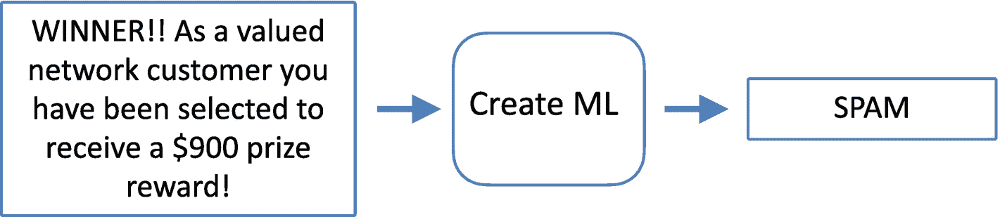

图 3-1

使用 Create ML 进行文本分类

我们可以通过两种方式使用 `Create ML`：作为一个独立的应用程序（可以在 Xcode 菜单栏中选择“打开开发者工具”打开），或者作为 macOS Playgrounds 中的一个框架。在 Playgrounds 中，我们可以将 CSV/JSON 文件或文件夹中的数据导入到 `Create ML` 应用中。数据应分类存放于不同的文件夹中。因此在 Playgrounds 中，我们有更多的选项。

在本项目中，我们将使用 Kaggle 上的短信垃圾邮件收集数据集。Kaggle 是寻找数据集的一个极好来源。

从 [`www.kaggle.com/uciml/sms-spam-collection-dataset`](http://www.kaggle.com/uciml/sms-spam-collection-dataset%2520) 下载短信垃圾邮件收集数据集以开始项目。这是一个简单的 CSV 文件，包含两列，如图 3-2 所示。第一列是短信的标签，第二列是短信内容。我们有两种类别：正常短信和垃圾短信。该数据集包含一组 5,574 条英文短信，根据其是否为正常短信（合法）或垃圾短信进行了标记。

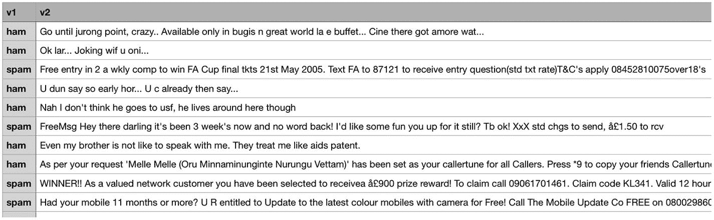

图 3-2

短信垃圾邮件收集数据集


### 在 macOS Playgrounds 中训练模型

打开 Xcode 并创建一个空白的 **macOS playground**，如图 3-3 所示。

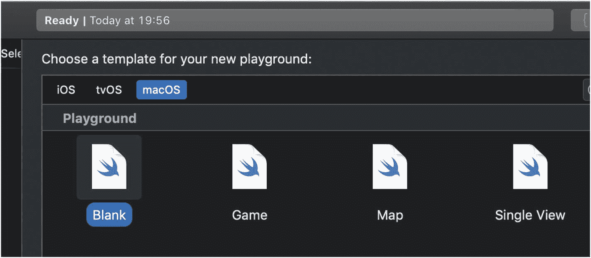

图 3-3：Playgrounds 中的模板

导入所需的框架（`CreateML` 和 `Foundation`），如图 3-4 所示。

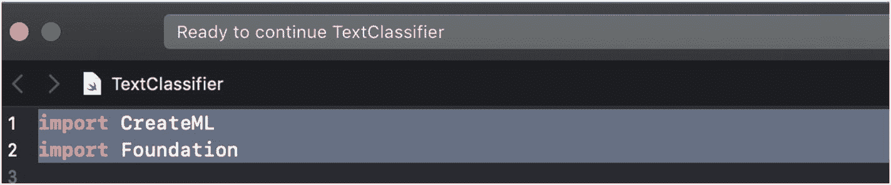

图 3-4：在 Playgrounds 中导入框架

如果收到 `CreateML` 不可用的错误，请确保在 Playgrounds 设置中已将 **macOS** 选为平台，如图 3-5 所示。

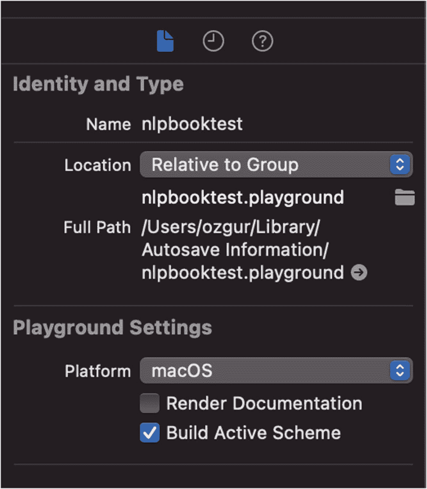

图 3-5：Playgrounds 设置

下载文本文件后，将文件路径作为参数传递给 `URL` 对象。除了手动编写这段代码，你也可以直接将文件拖放到 Playgrounds 中，系统会自动生成文件路径。

`Create ML` 可以通过两种方式读取数据：当文件按文件夹分类时，使用文件夹名作为标签；或者从单个文件（CSV、JSON）中读取数据。

首先，我们需要将 CSV 文件读取为 `MLDataTable`。`MLDataTable` 是 `Create ML` 中的一个结构体，用于简化文本和表格数据的加载与处理。`Create ML` 中大部分内置的机器学习模型（如 `MLTextClassifier`、`MLRegressor`、`MLClassifier` 等）都以 `MLDataTable` 格式读取数据，因此要训练这些模型，我们需要将原始训练数据转换为这种格式。

```
let datasetURL = URL(fileURLWithPath: "/Users/ozgur/Desktop/dataset/spam.csv")
var table = try MLDataTable(contentsOf: datasetURL)
```

代码清单 3-1：创建 `URL` 对象

在上述代码中，我们创建了一个指向 CSV 文件的 `URL` 对象，并将其作为参数传递给 `MLDataTable`。

**提示**：如果不想手动输入，你可以将 CSV 文件拖放到 Playgrounds 中，它会自动生成文件路径。

你还可以像代码清单 3-2 中那样，通过 `parsingOptions` 来指导 `MLDataTable` 的解析行为，但由于我们已经手动清理了数据集，这里不需要这样做。使用这些选项，我们可以通过分隔符、行结束符（`lineTerminator`）等设置来指导解析，或者通过 `containsHeader` 指定数据是否包含表头。我们甚至可以通过将列名赋值给 `selectColumns` 参数来选择要解析的列。

```
let parsingOptions =
MLDataTable.ParsingOptions(containsHeader: true,
delimiter: ",", comment: "", escape: "\\",
doubleQuote: true, quote: "\"", skipInitialSpaces:
true, missingValues: ["NA"], lineTerminator: "\n",
selectColumns: ["v1","v2"], maxRows: nil, skipRows: 0)
var table2 = try MLDataTable(contentsOf:
datasetURL,options: parsingOptions)
```

代码清单 3-2：解析选项

接下来，我们使用 `MLTextClassifier` 创建一个模型，用于对自然语言文本进行分类。通过指定文本列和标签列（垃圾邮件或正常邮件），我们为 `MLTextClassifier` 提供指导。

```
let classifier = try MLTextClassifier(trainingData:
table, textColumn: "v2", labelColumn: "v1")
```

代码清单 3-3：训练文本分类器

由于我们的列名是 `"v1"` 和 `"v2"`，我们在上面的代码中进行了相应指定。该模型学习将标签与输入文本（可以是句子、段落甚至整个文档）的特征关联起来。

Apple 提供了一个名为 `MLTextClassifier` 的模型训练器。它支持 57 种语言。该模型以监督方式工作，这意味着你的训练数据需要有标签（在本例中，即短信文本及其垃圾邮件分类）。

当你点击播放按钮（如图 3-6 所示）运行 `Create ML` 时，模型开始训练。

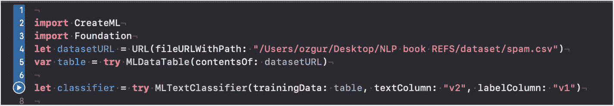

图 3-6：使用 `MLTextClassifier` 训练文本分类器


在训练过程中，它会解析文本数据、对文本进行分词并提取特征。如果你尝试训练此模型，控制台会输出如图 3-7 所示的错误信息。

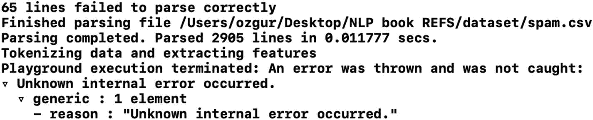

**图 3-7** 包含错误的训练结果

该错误信息并不详细，但问题出在我们的训练数据中存在某些标点符号。

要解决这个问题，只需在 `TextEdit` 或其他文本应用中打开 CSV 文件，并清理以下标点符号：`\`、`/` 和 `”`（全部替换为空字符串）。

该文件有五列；我们只需要使用前两列。在 `Numbers` 中打开 CSV 文件，并删除最后三列。

清理文本后，再次运行。你会看到如图 3-8 所示的消息。

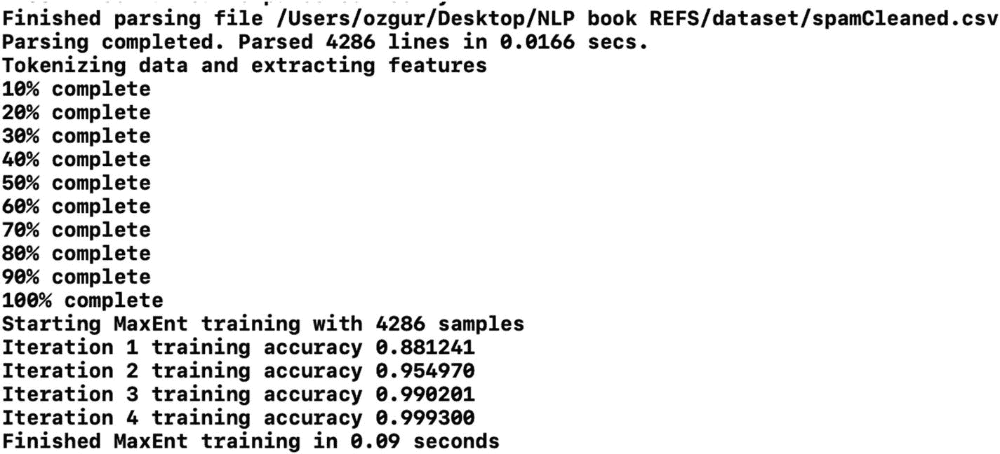

**图 3-8** 控制台中的训练输出

不同 Mac 上的训练时长会有所不同，但在我的 2015 款 MacBook Pro 上，训练此模型仅需 0.09 秒。

训练模型更好的方法是将数据拆分为训练集和测试集。这样我们就可以评估训练好的模型，并查看它在未见过的数据上表现如何。

清单 3-4 中的代码将数据按 0.8 的比例拆分为 `trainingData`（0.8）和 `testData`（0.2）。

```
let (trainingData, testingData) =
table.randomSplit(by: 0.8)
let spamClassifier = try
MLTextClassifier(trainingData: trainingData,
textColumn:
"v2",
labelColumn: "v1")
```

**清单 3-4** 使用拆分数据进行训练

训练分类器后，你可以通过调用 `trainingMetrics` 来检查训练指标，如清单 3-5 所示。它会显示模型的准确率，如图 3-9 所示。

```
spamClassifier.trainingMetrics
```

**清单 3-5** 检查训练指标

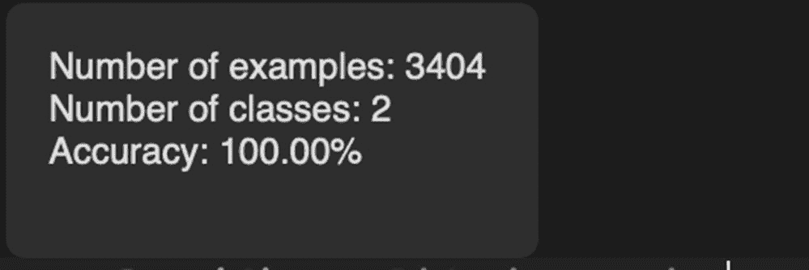

**图 3-9** 训练准确率

要评估模型在测试数据上的表现，请运行清单 3-6 中的代码。它会显示模型在未见过的数据上的表现如何。这能体现模型实际的成功率。图 3-10 展示了评估指标。

```
let evaluationMetrics = spamClassifier.evaluation(on:
testingData, textColumn: "v2", labelColumn: "v1")
```

**清单 3-6** 评估模型

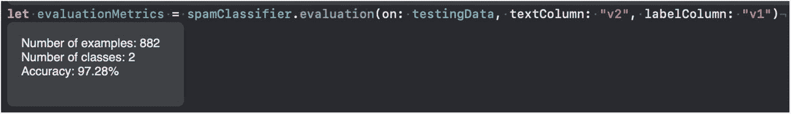

**图 3-10** 评估模型

这里我们看到，模型在测试数据上的准确率为 97%。这表明模型运行良好，不仅记住了训练数据，还具备了泛化能力，因为它在测试数据上同样表现出色。

你还可以在 Playgrounds 中使用任意文本测试训练好的模型。

```
try spamClassifier.prediction(from: "We are trying to
contact you. Last weekends draw shows that you won a
£1000 prize GUARANTEED. Call 09064012160.")
//spam
try spamClassifier.prediction(from: "We are trying to
contact you. Have you arrived to your house?")
//ham
```

**清单 3-7** 使用模型进行预测

这里我们用一些句子运行垃圾短信分类器模型，它正确地对这些文本进行了分类。

如果这个模型对我们有效，我们就可以保存它，并在 iOS 应用中使用。为了提供模型详情，我们创建了模型元数据。当我们在 Xcode 中打开模型时，会显示这些说明。

```
let metadata = MLModelMetadata(author: "Ozgur Sahin",
shortDescription: "Spam Classifier", license: "MIT",
version: "1.0")
try? classifier.write(to: URL(fileURLWithPath:
"users/ozgur/Desktop/SpamClassifier.mlmodel"))
```

**清单 3-8** 导出 Core ML 模型

我们通过向 `write` 函数提供路径来保存模型。请务必根据你的文件夹结构设置路径。Core ML 模型文件以 `.mlmodel` 扩展名保存，因此我们将文件名设置为 `SpamClassifier.mlmodel`。

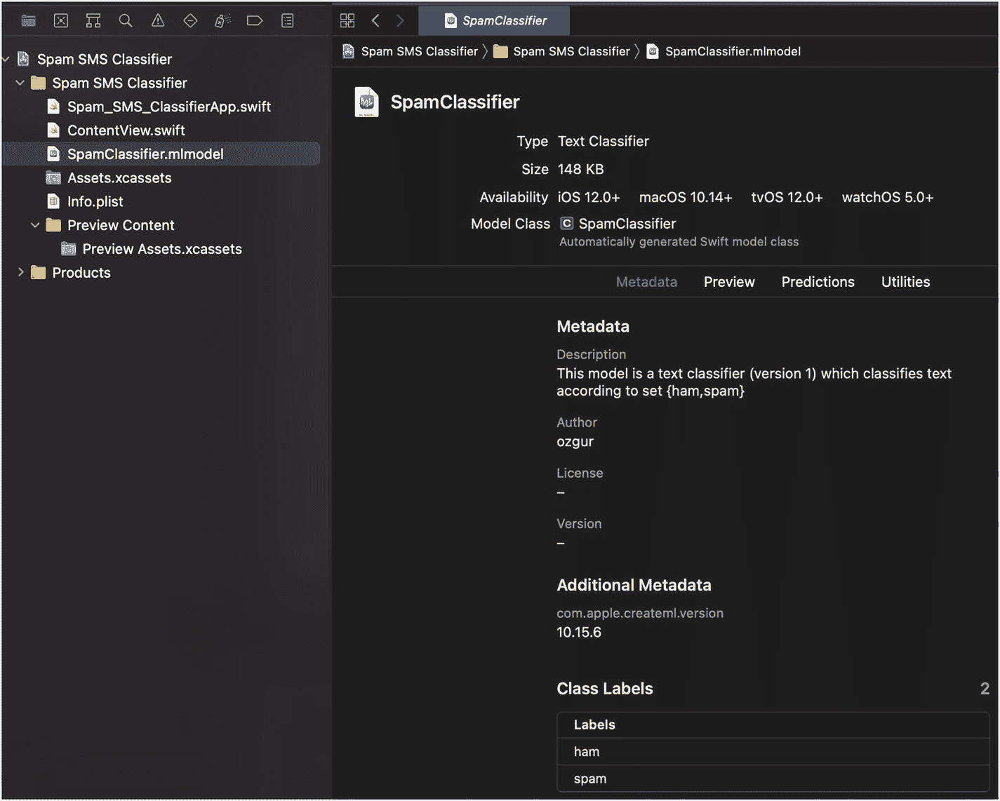

**图 3-11** 项目中的 MLModel

由于我们已经导出了模型，现在可以在 iOS 应用中使用它了。打开 Xcode，使用 App 模板创建一个新项目。确保界面选择 SwiftUI，生命周期选择 SwiftUI App。创建项目后，将 Core ML 模型拖放到项目中。

你也可以使用 Storyboard 作为用户界面，但这里我将使用 SwiftUI，因为它更容易展示结果。

点击模型并检查其详细信息。模型只有 148 kb，如图 3-11 所示。

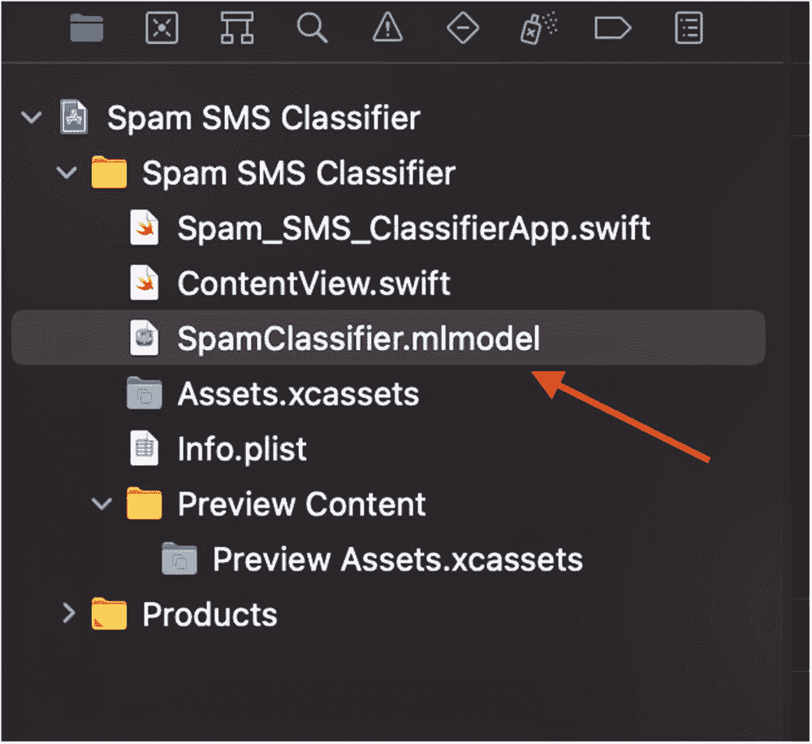

**图 3-12** 模型详情

在 Xcode 中，我们检查模型的详细信息以及导出模型时提供的元数据。它还显示了模型的输入和输出类型。

当我们把模型拖放到项目时，Xcode 会自动为模型生成一个类，如图 3-13 所示。如果你想查看生成的代码，请点击图 3-13 中的类图标。

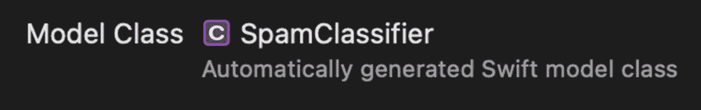

**图 3-13** Xcode 生成的 `SpamClassifier` 类

该类如图 3-14 所示。此类包含加载模型和进行预测所需的函数。

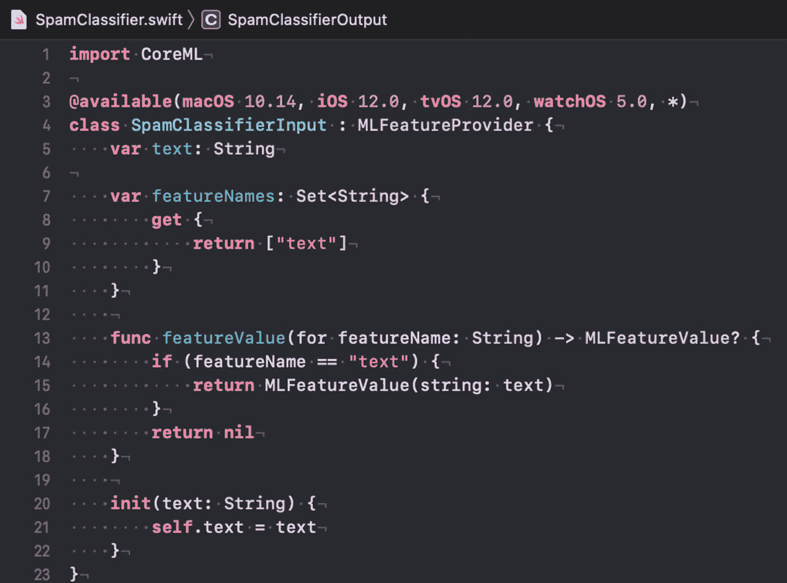

**图 3-14** 模型自动生成的类代码

> **注意**：不应编辑此类。

我创建了一个名为 `Classifier` 的类和一个使用模型的简单函数。

```
class Classifier
{
static let shared = Classifier()
func predict(text:String)->String?
{
let spamClassifier = try?
SpamClassifier(configuration: MLModelConfiguration())
let result = try?
spamClassifier?.prediction(text: text)
return result?.label
}
}
```

**清单 3-9** 在项目中使用分类器模型

如上述代码所示，我创建了模型的实例，并对其调用了 `prediction` 方法。预测可能会抛出错误，因此我们需要使用 `try` 来调用它。理想情况下，你可以将其包装在 `do-catch` 块中并处理错误。

在项目的 `ContentView` 中，添加清单 3-10 中的代码来调用我们之前创建的预测方法。

```
@State var textInput:String = ""
@State var classificationResult:String?
var body: some View {
VStack{
Text("Spam SMS
Classifier!").font(.title).foregroundColor(.blue)
Spacer()
TextField("Enter SMS Message", text:
$textInput).multilineTextAlignment(.center).font(.tit
le).textFieldStyle(RoundedBorderTextFieldStyle())
Button(action: {
self.classificationResult =
Classifier.shared.predict(text: self.textInput)
}) {
Text("Classify").font(.title)
}.frame(width:120,
height:40).foregroundColor(.white).background(Color.b
lue).cornerRadius(10)
Text("Result:\(classificationResult ??
"")").foregroundColor(.red).font(.title)
Spacer()
}
}
```

**清单 3-10** 在 SwiftUI 中调用分类器

在上述代码中，我们创建了一个文本字段和一个按钮。当用户点击按钮时，我们从文本字段中获取输入，并将其发送给垃圾短信分类器模型。模型的分类结果显示在第二个文本字段中。

添加代码后，只需点击播放按钮即可运行应用程序。

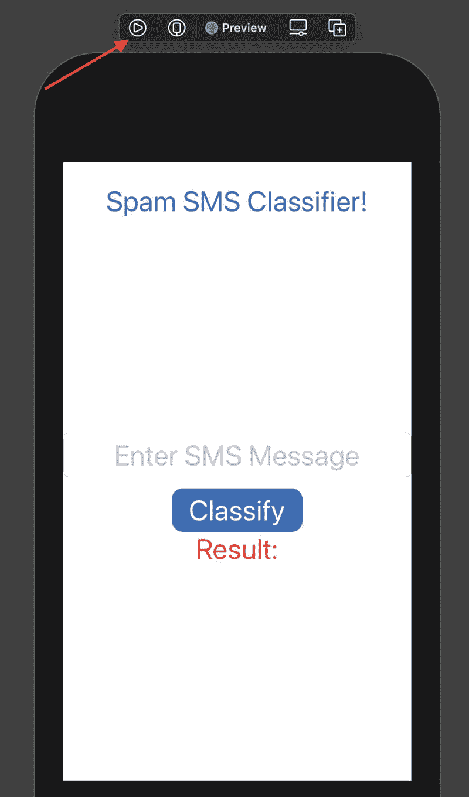

**图 3-15** 运行垃圾短信分类器应用


此应用在 SwiftUI 预览中运行，如图 3-15 所示。在这里，你可以像使用模拟器一样使用应用并测试垃圾邮件分类器。在文本字段中输入一些文本，然后点击`分类`按钮来试用你的智能应用。一些示例见图 3-16。

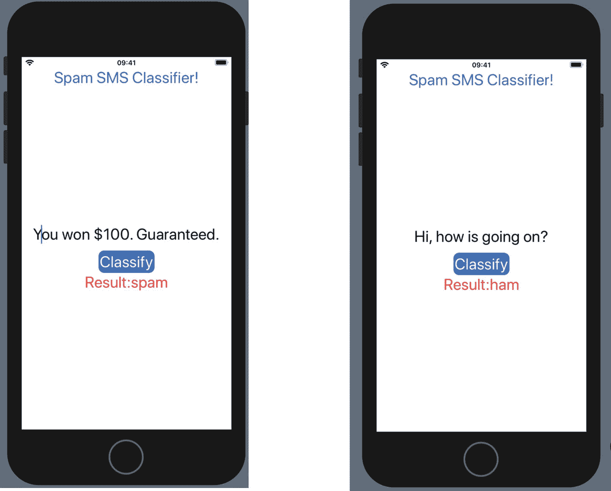

**图 3-16** 垃圾短信分类器应用

恭喜！你刚刚创建了一个能够检测垃圾短信的智能应用。

## 使用 Create ML 应用进行垃圾邮件分类

我们之前使用`Create ML`框架训练了文本分类模型。现在，我们将使用`Create ML`应用（v1.0）来训练相同的模型。`Create ML`为不同类型的数据（图像、文本、声音）提供了多个项目模板。对于本项目，请选择文本分类器，如图 3-17 所示。

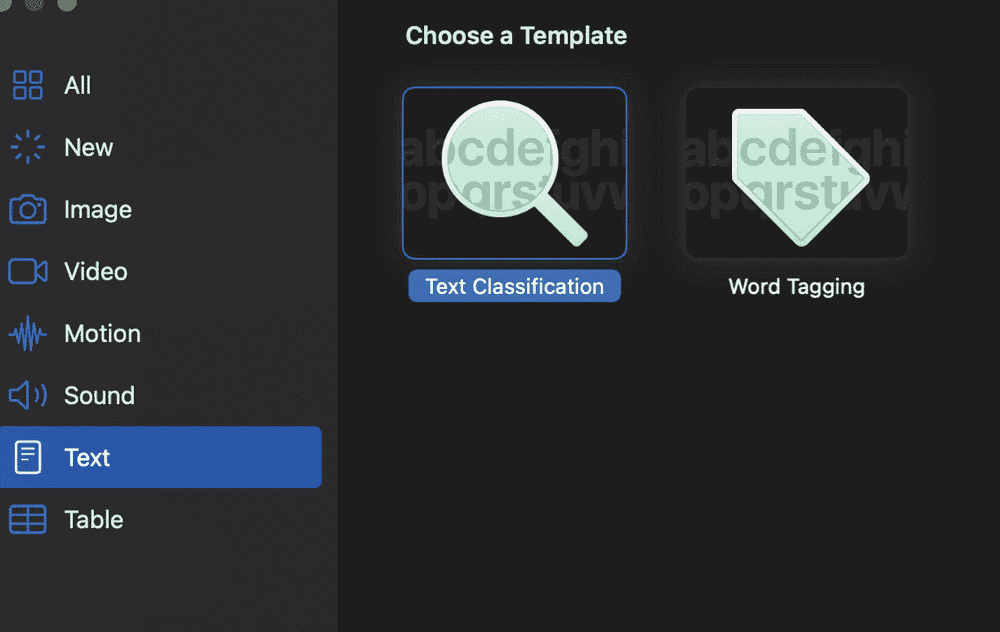

**图 3-17** `Create ML`应用中的文本分类器模板

首先，我们需要提供训练数据。`Create ML` v1 中的文本分类器只接受文件夹中的文本数据。`Create ML` 1.1 版本仍处于测试阶段，它将支持从`CSV`和`JSON`文件中读取。

对于 v1 版本，我们需要解析我们的`CSV`文件，并为`ham`或`spam`文件夹中的每一行创建一个文本文件。我编写了一个简单的函数来解析`CSV`并创建文件。

```
import Cocoa
import CreateML
let datasetURL = URL(fileURLWithPath: "/Users/ozgur/
Desktop/NLP book REFS/dataset/spamCleaned.csv")
var table = try MLDataTable(contentsOf: datasetURL)
func createFiles(from rows:MLDataTable.Rows) {
for (index,row) in rows.enumerated() {
if let text = row["v2"]?.debugDescription,
let label = row["v1"]?.debugDescription
{
do {
var folder = "spam"
if label == "ham"
{
folder = "ham"
}
let fileURL = URL(fileURLWithPath: "/
Users/ozgur/Desktop/NLP book REFS/dataset/
spamsetInFolders/\(folder)/\(index).csv")
try text.write(to: fileURL,
atomically: true, encoding: .utf8)
} catch {
print("error creating file")
}
}
}
}
createFiles(from: table.rows)
```

**代码清单 3-11** 读取`CSV`并创建文本文件

你可以根据电脑情况更改文件路径，并在 macOS Playgrounds 中运行这段代码。它将创建如图 3-18 所示的文本文件。

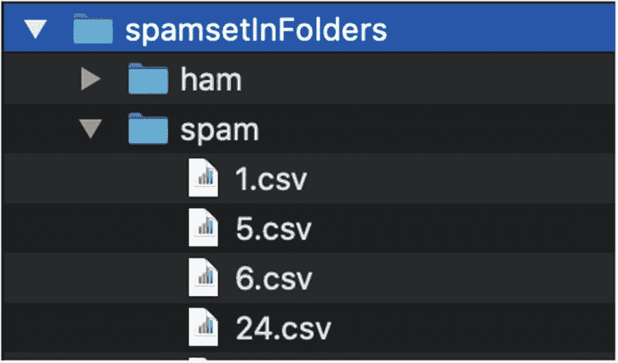

**图 3-18** 为`Create ML`应用准备的文本文件

现在，我们可以将父文件夹（`spamsetInFolders`）拖放到`Create ML`应用的“训练数据”面板中。或者，你也可以在访达中选择一个文件夹，方法是点击“训练数据”面板中的`选择文件`。

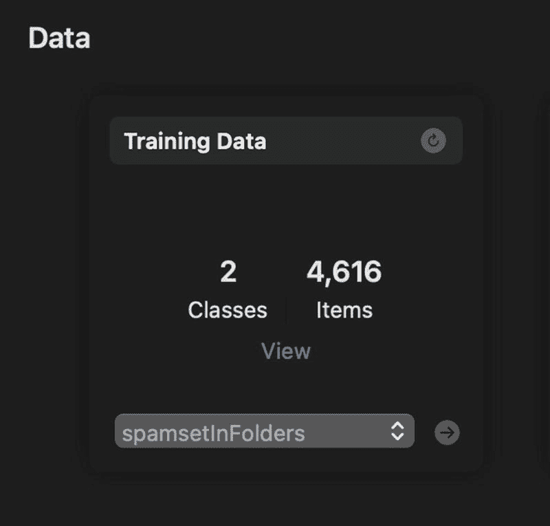

**图 3-19** `Create ML`应用训练数据面板

`Create ML`应用将读取文件并显示类别数量和文件数量。`Create ML`还提供了一些不同的算法来训练你的文本分类模型。目前，提供的算法有最大熵、条件随机场和迁移学习。在迁移学习中，有两个选项：静态嵌入和动态嵌入。静态嵌入为单词使用静态向量表示，不考虑单词的上下文。动态嵌入则考虑单词的上下文。因此，对于“思想食粮”和“我需要食物”这两个样本中的单词“食物”，动态嵌入会创建不同的向量。而静态嵌入则会创建相同的向量。

选择你的算法并点击`训练`按钮，开始训练文本分类器模型。`Create ML`会在一个简单的图表中显示当前训练状态和每次迭代的准确率，如图 3-20 所示。

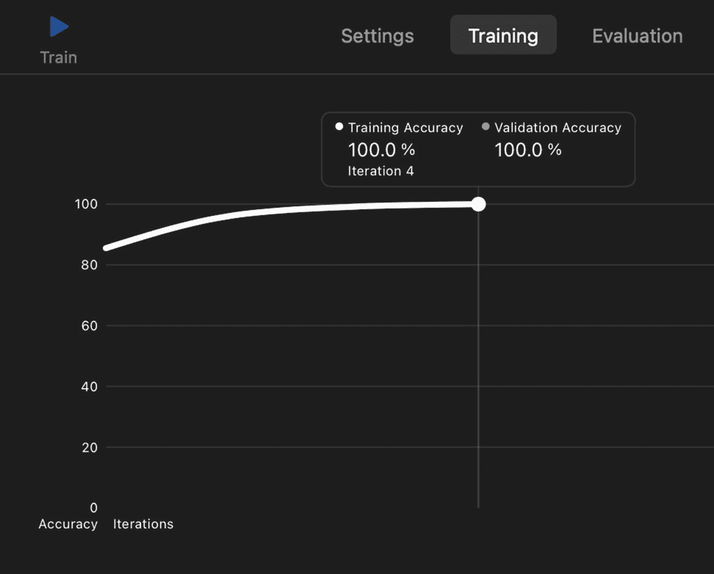

**图 3-20** 在`Create ML`应用中训练

你可以通过点击标签来查看训练和验证的结果。对于验证，`Create ML`会留出一小部分训练数据，用于验证模型的进度。这能提升模型在未见过的示例上的性能。验证准确率让`Create ML`知道何时停止训练。验证数据的分割是随机进行的，因此每次训练可能会看到不同的结果。

如果你有测试数据，可以在“测试”标签中测试你的模型。了解模型在未见过的数据上的表现非常重要。你也可以在“输出”标签中输入任意文本来测试模型。如果你对模型的准确率满意，只需将模型从“输出”面板拖放到一个文件夹或 Xcode 项目中即可。你刚刚使用`Create ML`应用训练了你的第一个模型，现在它就可以在你的项目中使用了。

## 使用 Turi Create 进行垃圾邮件分类

在前面的章节中，我们学习了如何通过分别使用`Create ML`框架和`Create ML`应用来创建垃圾邮件分类器。在本节中，我们将使用`Turi Create`来训练垃圾邮件分类器。`Turi Create`是一个用于创建 Core ML 模型的开源 Python 库。它支持多种任务，如图像分类、对象检测、风格迁移、推荐、文本分类等。与`Create ML`相比，`Turi Create`提供了更多参数来训练 ML 模型。

由于这是一个 Python 库，我们无法直接开始编码；我们需要先设置好 Python 环境才能开始使用`Turi Create`。

### Turi Create 环境设置

`Turi Create`支持 Python 2.7、3.5、3.6 和 3.7 版本。处理 Python 项目时，建议使用虚拟环境。虚拟环境通过为不同项目创建隔离的 Python 虚拟环境，来分离它们各自所需的依赖项。代码清单 3-12 中的代码安装了`virtualenv`包并创建了你的虚拟环境。在终端中运行并激活你的环境。

```
pip install virtualenv
#### 创建一个 Python 虚拟环境
cd ~
virtualenv venv
# 激活你的虚拟环境 source ~/venv/bin/activate
```

**代码清单 3-12** 创建虚拟环境

激活环境后，使用代码清单 3-13 中的代码安装`Turi Create`。如果你在环境中，应该在终端行首看到`venv`。使用代码清单 3-13 中的代码安装`Turi Create`和`iPython`。`iPython`让我们可以使用交互式 Python 笔记本。

```
pip install -U turicreate
pip install ipython
ipython notebook
```

**代码清单 3-13** 安装`Turi Create`和`iPython`

这段代码将在你的浏览器中打开 Jupyter。点击`新建`并创建一个 Python 笔记本。在笔记本中，你可以运行单元格并立即看到结果。这对于进行实验并以交互方式查看结果非常有用。


### 使用 Turi Create 训练文本分类器

查看清单 3-14 中的代码，了解在 Turi Create 中训练模型有多么简单。

```
import turicreate as tc
#### 读取 CSV 文件
data = tc.SFrame.read_csv('/Users/ozgur/Desktop/
dataset/spamCleaned.csv', header=True, delimiter=',',
quote_char='\0')
#### 重命名列
data = data.rename({'v1': 'label', 'v2': 'text'})
#### 分割数据
training_data, test_data = data.random_split(0.8)
#### 创建文本分类器模型
model = tc.text_classifier.create(training_data,
'label', features=['text'], max_iterations=100)
#### 评估模型
metrics = model.evaluate(test_data)
print(metrics['accuracy'])
#### 导出至 Core ML 使用
model.export_coreml(‘SpamClassifierWithTuri.mlmodel')
清单 3-14
使用 Turi Create 训练垃圾邮件分类器
```

使用这段代码，我们读取了 CSV 文件并将列重命名为 `label` 和 `text` 以便理解。我们将数据分割为训练集（80%）和测试集（20%）。我们创建了一个迭代 100 次的文本分类器模型；默认迭代次数为 10。这允许对数据进行更多次遍历，从而可能训练出更准确的模型。这里，我们还可以指定 `drop_stop_words` 来忽略像“the”、“a”和“is”这样非常常见的单词，指定 `word_count_threshold` 来忽略较少出现的单词，或者指定 `method` 来使用词袋模型或词袋逻辑回归（逻辑分类器）。训练模型后，我们使用测试数据对其进行评估。这显示了模型在未见过的数据上的准确度。最后，我们导出 Core ML 模型，以便在 Xcode 项目中使用。

现在，打开你导出的 MLModel 文件查看模型详细信息，如图 3-21 所示。它的输入与我们用 Create ML 训练的模型不同。

该模型接收文本的词袋表示。词袋表示显示了单词在文本中出现的次数。

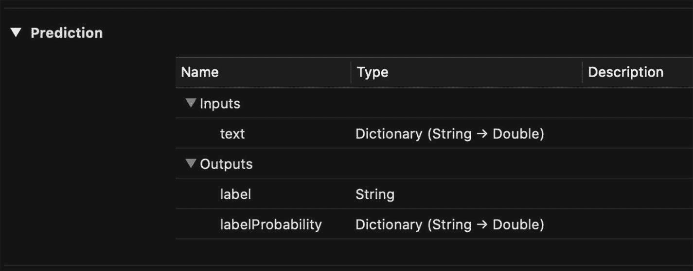

图 3-21

使用 Turi Create 训练的垃圾邮件分类器

为了创建文本的词袋表示，我们可以使用 `NSLinguisticTagger`。清单 3-15 中的代码取自 Apple 在 Turi Create 文档中的示例代码。

```
func bow(text: String) -> [String: Double] {
var bagOfWords = [String: Double]()
let tagger = NSLinguisticTagger(tagSchemes:
[.tokenType], options: 0)
let range = NSRange(location: 0, length:
text.utf16.count)
let options: NSLinguisticTagger.Options =
[.omitPunctuation, .omitWhitespace]
tagger.string = text.lowercased()
tagger.enumerateTags(in: range, unit: .word,
scheme: .tokenType, options: options) { _,
tokenRange, _ in
let word = (text as NSString).substring(with:
tokenRange)
if bagOfWords[word] != nil {
bagOfWords[word]! += 1
} else {
bagOfWords[word] = 1
}
}
return bagOfWords
}
let bagOfWords = bow(text: text)
let prediction = try?
SpamClassifierWithTuri().prediction(text: bagOfWords)
清单 3-15
词袋表示
```

在上述代码中，`bow` 函数接收一个字符串并返回一个字典。该字典显示了每个单词在给定文本中出现的次数。在使用从 Turi Create 导出的模型之前，我们先创建文本的词袋表示，并将其作为输入提供给模型。

## 本章小结

在本章中，我们通过编写一个能够自动检测垃圾短信的垃圾短信分类器应用，亲自动手实践。我们学习了如何使用 Apple 的机器学习工具。通过在 Create ML 框架、Create ML 应用和 Turi Create 中训练文本分类器模型，我们了解了它们的优缺点。本章旨在让您熟悉这些工具。在后续章节中，我们将训练更复杂的模型，以构建更智能的应用。

