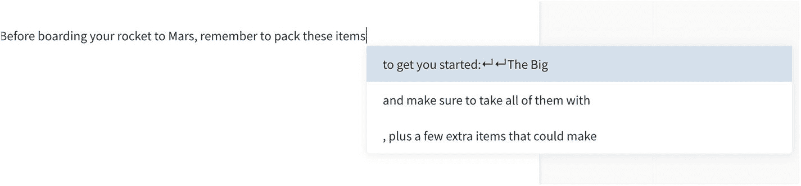
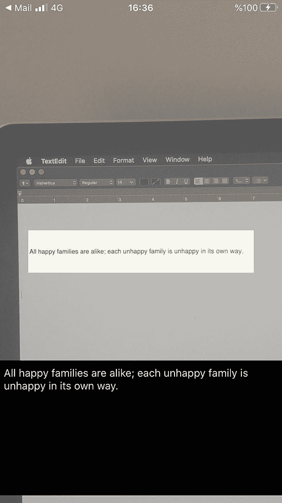
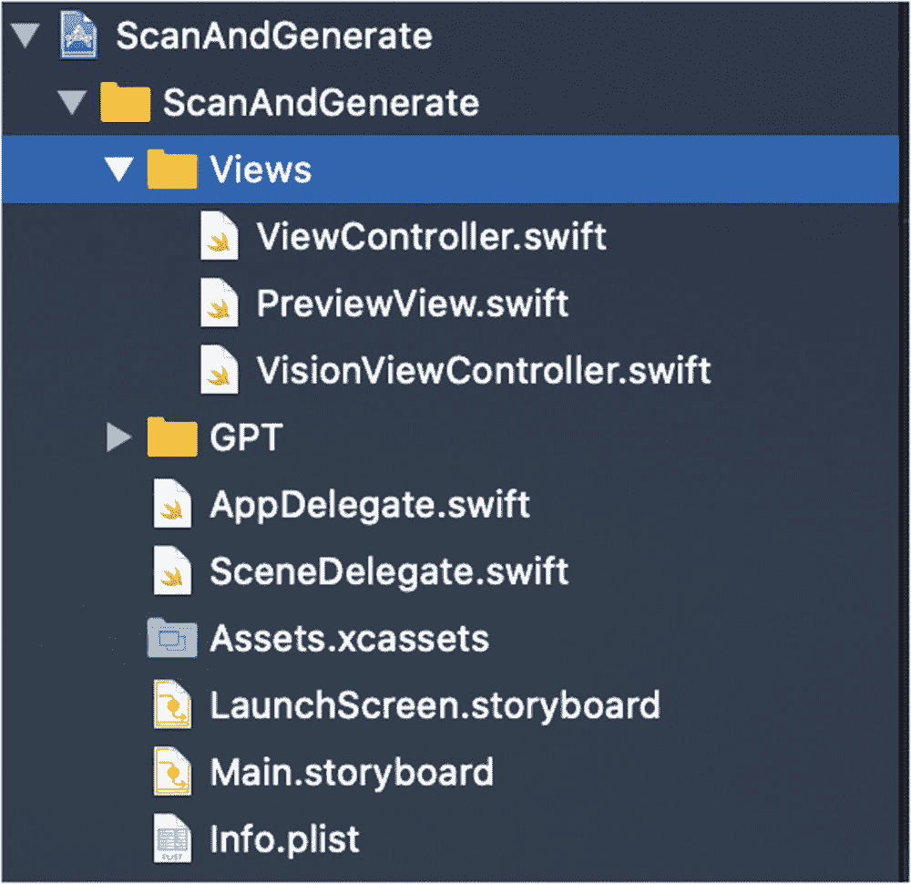
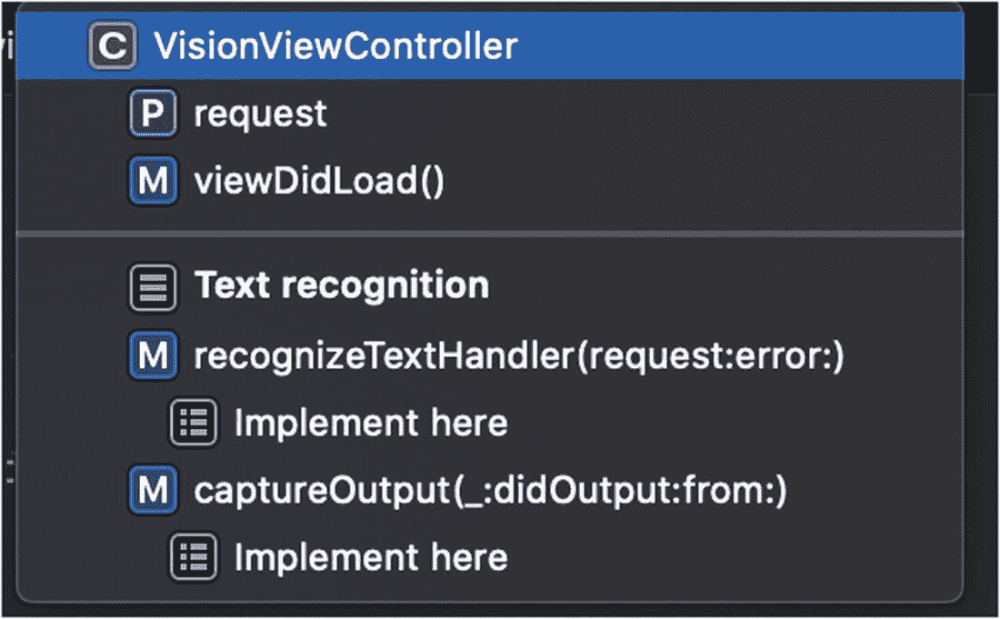
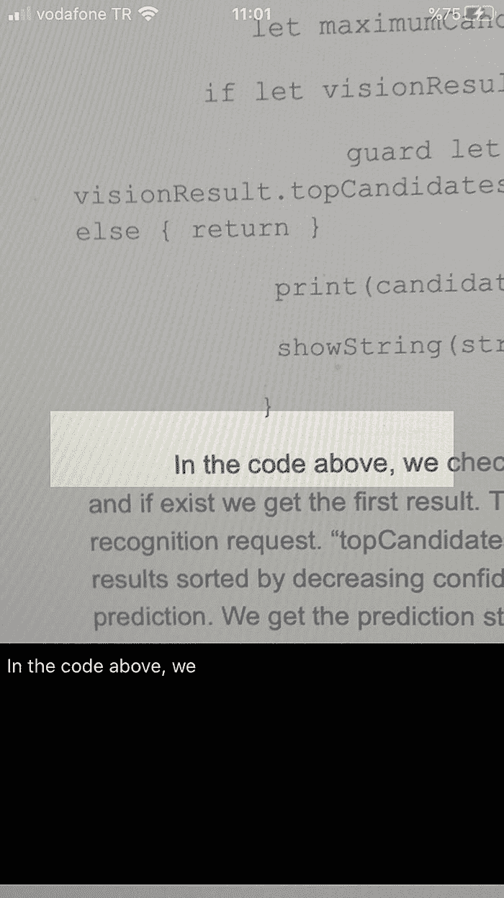
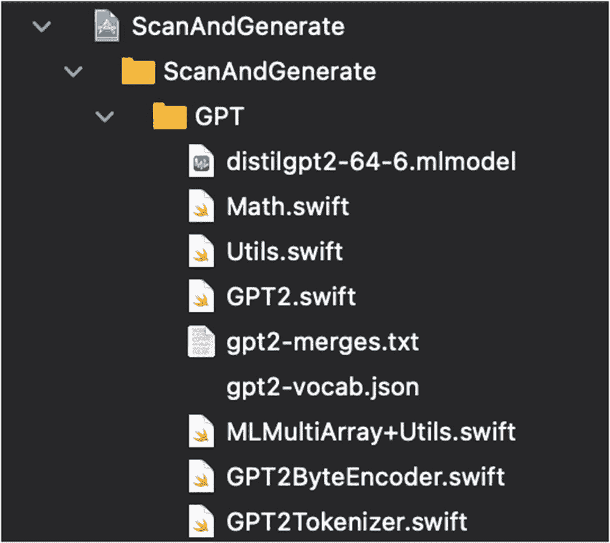
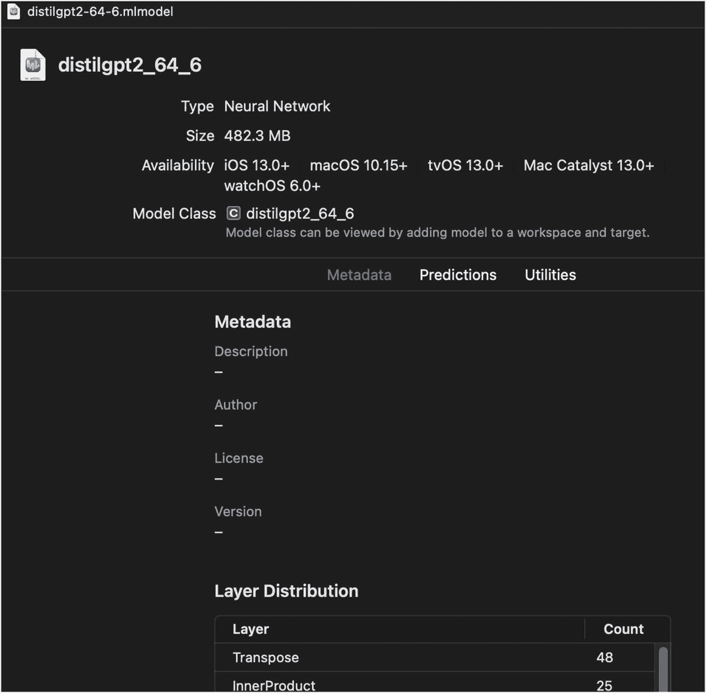
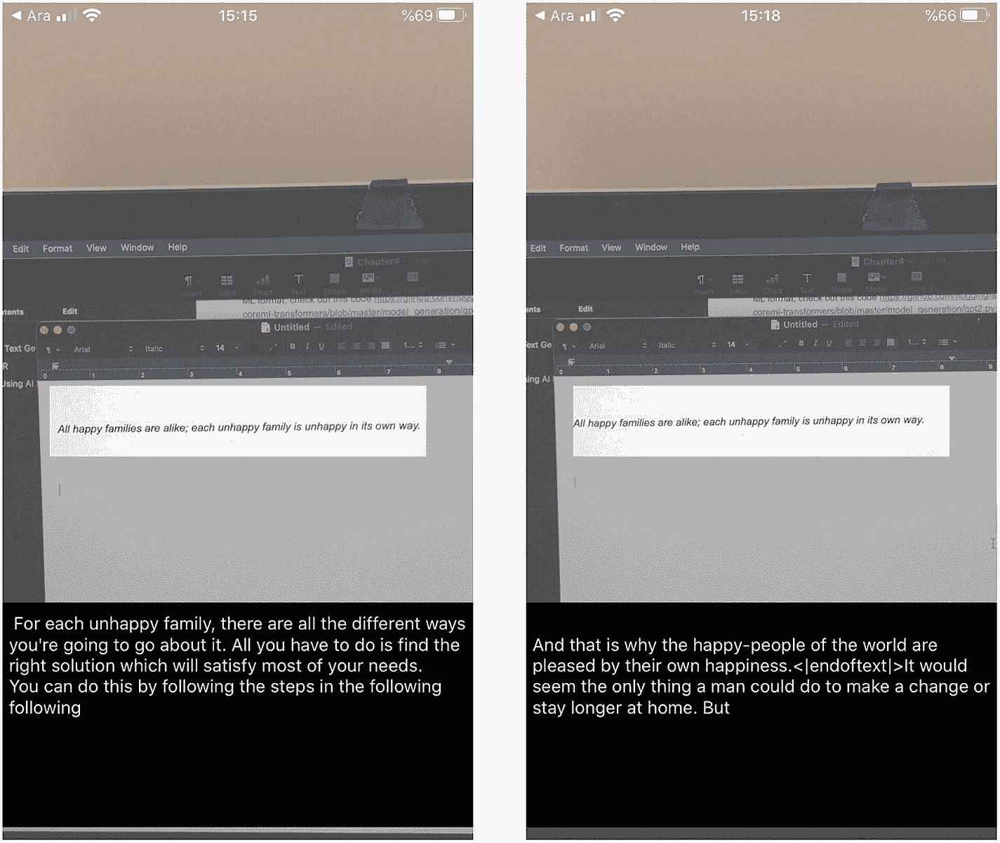

# 4. 文本生成

文本生成允许我们使用合适的单词或短语自动补全句子。近年来，基于神经网络模型的文本生成技术得到了显著提升。这些模型通常受益于循环神经网络或 Transformer。在本章中，我们将学习如何使用最佳文本生成模型之一（GPT-2），并基于该模型构建一个 iOS 应用。我们的应用将利用内置的 OCR 功能从摄像头捕获文本，并根据扫描到的句子生成文本。


## GPT-2

`GPT-2` 是 `OpenAI`（一家位于旧金山的人工智能研究与部署公司）发布的 `GPT`（生成式预训练 Transformer）的后续模型。Transformer 是该模型以及许多其他语言模型背后的架构。Transformer 主要由编码器和解码器组成，还包含注意力层，能让模型聚焦于输入序列的特定部分。由于这超出了本书的范畴，我们不会深入探讨 Transformer 的细节。如果你只是打算用这个模型开发一个移动应用，那么了解其浅层知识就足够了。

原始的 `GPT-2` 模型是在 40 GB 的互联网文本（`GPT-2 WebText`）上训练的。`GPT-2` 是一个基于 Transformer 的大型语言模型，拥有 15 亿个参数，在一个数据集上训练而成。语言模型通过训练来根据前文预测下一个单词。

出于对该技术可能被恶意应用的担忧，`OpenAI` 并未公开分享其训练好的模型。他们分享了一个较小的模型版本供研究人员实验。该模型的补全效果非常好，有时甚至能产生令人惊叹的结果。你可以通过以下网址，用任意文本输入来尝试这个模型：[`https://transformer.huggingface.co/doc/gpt2-large`](https://transformer.huggingface.co/doc/gpt2-large)。图 4-1 中的图片展示了给定句子后的预测结果。



图 4-1
GPT-2 文本预测

要在 iOS 中使用这类模型，你需要将其转换为 Core ML 模型格式（扩展名为 `.mlmodel` 的模型）。通常使用 `coremltools` 库来完成模型的转换。这个 Python 包由 Apple 开发，支持从 `TensorFlow` 和 `PyTorch` 进行转换。

如果模型中有 `coremltools` 不支持的层，这种模型的转换有时可能会出现问题。幸运的是，Hugging Face 开源了他们的模型实现、转换脚本，甚至还有 Core ML 模型本身。Hugging Face 是一家专注于自然语言处理的公司，以其开源框架 `transformers` 而闻名，该框架在 GitHub 上拥有超过 30000 颗星。他们有一个独立的仓库（`swift-coreml-transformers`），用于存放已转换为 Core ML 格式以便在 iOS 设备上运行的 Transformer 模型。目前，该仓库包含 `GPT-2`、`DistilGPT-2`、`BERT`（来自 Transformer 的双向编码器表示）和 `DistilBERT` 模型。名称以“Distil”开头的模型都是经过压缩的模型，通常速度更快，参数更少。例如，`DistilBERT` 的参数比 `bert-base-uncased` 少 40%，运行速度快 60%，同时根据 GLUE 基准测试，保留了 `BERT` 97% 的性能。

我们将使用 `DistilGPT-2` 模型，以便在移动设备上实现更快的预测。如果你对将 `DistilGPT-2` 转换为 Core ML 格式的代码感到好奇，请查阅 [`https://github.com/huggingface/swift-coreml-transformers/blob/master/model_generation/gpt2.py`](https://github.com/huggingface/swift-coreml-transformers/blob/master/model_generation/gpt2.py) 的代码。我们在示例项目中将使用转换后的模型。转换后的模型可以从此处下载：[`https://github.com/huggingface/swift-coreml-transformers/blob/master/Resources/distilgpt2-64-6.mlmodel`](https://github.com/huggingface/swift-coreml-transformers/blob/master/Resources/distilgpt2-64-6.mlmodel)。

我们将要开发的应用，将通过摄像头扫描文本，并使用内置的 OCR 进行识别。结果将显示在底部的文本视图中。如果用户对识别的文本满意，他们可以点击中央的扫描区域矩形，应用便会以此文本为基础开始预测。



图 4-2
OCR 应用

我们将探索，当 AI 在续写《安娜·卡列尼娜》中的一句名言时，会如何发展。

> *幸福的家庭都是相似的，不幸的家庭各有各的不幸。*
> 
> —列夫·托尔斯泰

## 让我们构建 OCR 和文本生成应用

首先，我们将构建应用的 OCR 功能。它会扫描摄像头流，并聚焦于感兴趣的区域，如图 4-2 所示。扫描较小的区域可以让我们更经济地使用计算资源。

对于扫描部分，我们将使用 Apple 的示例项目“实时读取电话号码”（[`https://developer.apple.com/documentation/vision/reading_phone_numbers_in_real_time`](https://developer.apple.com/documentation/vision/reading_phone_numbers_in_real_time)）作为基础项目。它展示了处理实时视频流并识别特定区域文本的最佳实践。

请从这里下载初始项目：[`https://github.com/ozgurshn/Chapter3-ScanAndGenerate/tree/master/starter`](https://github.com/ozgurshn/Chapter3-ScanAndGenerate/tree/master/starter)。这是一个模板项目，我们为你设置好了，以便让你更轻松地开始。你也可以在此处找到完成的项目：[`https://github.com/ozgurshn/Chapter3-ScanAndGenerate/tree/master/final`](https://github.com/ozgurshn/Chapter3-ScanAndGenerate/tree/master/final)。我建议你从初始项目开始，并按照练习来理解实现过程。

让我们打开并检查我们的初始项目。



图 4-3
初始 OCR 和文本生成项目

如图 4-3 所示，我们的示例项目包含 `Views` 和 `GPT` 文件夹。`Views` 包含与 `ViewController` 相关的文件。`GPT` 包含与文本生成相关的类。为了让你专注于特定任务，许多像摄像头设置和视图定位这样的琐碎工作已经为你完成了。你只需要负责 OCR 和文本生成部分。我们将以初始项目为基础，一起进行开发。

首先，让我们从 [`https://github.com/huggingface/swift-coreml-transformers/blob/master/Resources/distilgpt2-64-6.mlmodel`](https://github.com/huggingface/swift-coreml-transformers/blob/master/Resources/distilgpt2-64-6.mlmodel) 下载 `GPT-2` 的 Core ML 模型，然后将其拖放到 Xcode 项目中的 `GPT` 文件夹中。

初始项目有一个视图控制器，名为 `ViewController.swift`；而 `VisionViewController` 是这个视图控制器的一个扩展，专注于 Vision 框架相关的任务（例如，文本识别）。`PreviewView` 管理视频预览层，以正确显示摄像头流。

你需要编写实现代码的部分已用“TODO”标记，如图 4-4 所示。只需点击 `VisionViewController` 并查看待办事项列表。



图 4-4
VisionViewController 函数


### 使用内置 OCR

在 `VisionViewController` 中找到 `captureOutput` 函数；每当相机捕获到一帧画面时，都会调用此函数。我们将在该函数中处理这一帧画面并对其执行文本识别。将代码清单 4-1 中的代码复制到 `captureOutput` 函数中。

```
if let pixelBuffer =
CMSampleBufferGetImageBuffer(sampleBuffer) {
// 配置为实时运行。
request.recognitionLevel = .fast
request.usesLanguageCorrection = true
// 仅对感兴趣区域运行以最大化速度。
request.regionOfInterest = regionOfInterest
let requestHandler =
VNImageRequestHandler(cvPixelBuffer: pixelBuffer,
orientation: textOrientation, options: [:])
do {
try
requestHandler.perform([request])
} catch {
print(error)
}
}
```
*代码清单 4-1* – 执行文本识别请求

通过上述代码，我们从样本缓冲区创建了 `CVPixelBuffer`。Vision 请求更偏好 `CVPixelBuffer` 类型而非 `CMPixelBuffer`。`VNRecognizeTextRequest` 是在 `viewDidLoad` 函数中创建的；这样可以避免在每帧捕获时重复创建。`VNRecognizeTextRequest` 有两种识别级别选项：准确（accurate）或快速（fast）。我们在此作出权衡，选择快速以便更适应实时场景。此请求的另一个属性是 `usesLanguageCorrection`；它在文本识别过程中应用语言校正。为追求最大速度，我们指定了 `regionOfInterest` 来引导识别过程关注帧中的特定区域。与所有 Vision 请求类似，我们使用像素缓冲区和方向创建一个图像请求处理器，并执行 Vision 请求。

我们编写了对捕获帧执行文本识别请求的部分。接下来，编写处理文本识别结果的部分。

在同一文件中找到 `recognizeTextHandler` 函数。每次文本识别过程完成后都会调用此函数。它是在 `viewDidLoad` 函数中创建 Vision 请求时设定的。将代码清单 4-2 中的代码复制到 `recognizeTextHandler` 函数中。

```
guard let results = request.results as?
[VNRecognizedTextObservation] else {
return
}
let maximumCandidates = 1
if let visionResult = results.first {
guard let candidate =
visionResult.topCandidates(maximumCandidates).first
else { return }
print(candidate.string)
showString(string: candidate.string)
}
```
*代码清单 4-2* – 文本识别过程结果

在上述代码中，我们检查请求结果中是否存在结果，如果存在，则获取第一个结果。这是文本识别请求的预测结果。`topCandidates` 函数返回按置信度分数降序排列的预测结果，因此第一个结果是最佳预测。我们获取第一个候选对象的预测字符串并将其显示在屏幕上。`showString` 方法接收该字符串并将其显示在文本视图中。它通过调用 `DispatchQueue.main.async` 将此调用分发到主线程，以确保 UI 更新正确执行。

我们的 OCR 应用已准备就绪。现在你可以运行应用并在你的 iPhone 上尝试。如果将相机对准任何文本，你将会看到如图 4-5 所示的 OCR 结果。你无法在模拟器上使用此应用，因为它不支持相机捕获。


*图 4-5* – 文本识别应用

既然我们已经完成了文本识别部分，接下来将继续构建我们的应用，以使用 AI 模型生成文本。

### 使用 AI 模型生成文本

在这部分，我们将把文本生成模型（DistilGPT-2）集成到我们的项目中。起始项目已包含你所需的文件，如图 4-6 所示。打开 `GPT` 文件夹并查看这些文件。在该文件夹中看到的第一个文件是 `DistilGPT-2` 的 Core ML 模型版本。我们将使用此模型基于输入生成文本。


*图 4-6* – 项目中的 GPT 文件

让我们通过在 Xcode 中选择此模型来检查它。第一个标签页，即“元数据”（`Metadata`），如图 4-7 所示，显示了模型的元数据，如名称、类型和大小。第二个标签页，即“预测”（`Predictions`），显示了模型的输入和输出类型。最后一个标签页，即“工具”（`Utilities`），提供了一些用于模型加密或在 CloudKit 上托管模型的功能。


*图 4-7* – Xcode 中的 DistilGPT-2 模型

模型名称是 `distilgpt2_64_6`。名称中的 64 表示模型作为输入的序列长度（token 数量）。

此屏幕的中间部分显示了 Xcode 自动生成的 Swift 文件。下方部分显示了模型的输入和输出类型。我们需要将输入文本转换为模型输入格式。如上图所示，模型接收两个包含 64 个双精度值的 `MultiArray`。

幸运的是，将文本转换为模型输入格式的代码由 Hugging Face 的 Julien Chaumond 编写。`GPT` 文件夹下的文件来自其代码库。打开 `GPT2.swift` 文件来检查此代码。

它有三种解码策略：贪婪（greedy，每一步选择最可能的下一个 token）、topK（仅从概率最高的前 k 个 token 中采样）和 topP（累积概率超过阈值的前缀 token）。这些解码策略决定了如何选择预测结果。

预测通过此类中的 `predict` 函数完成，如代码清单 4-3 所示。该函数使用 `DistilGPT-2` 模型从先前 token 数组中预测下一个 token。Token 以 `GPT2ByteEncoder.swift` 文件中映射的相应数字表示。由于 AI 模型在数字上比在文本上工作得更好，我们将文本数据转换为数字。

```
func predict(tokens: [Int]) -> Int {
let maxTokens = (tokens.count > seqLen)
? Array(tokens[..<seqLen])
: tokens
/// 在右侧填充 input_ids，直到 `seqLen`：
let input_ids = MLMultiArray.from(
maxTokens + Array(repeating: 0, count:
seqLen - maxTokens.count)
)
let position_ids = MLMultiArray.from(
Array(0..<seqLen)
)
let output = try! model.prediction(input_ids: input_ids, position_ids:
position_ids)
let outputLogits = MLMultiArray.slice(
output.output_logits,
indexing:
[.select(0), .select(maxTokens.count
- 1), .slice, .select(0), .select(0)]
)
switch strategy {
case .greedy:
let nextToken = Math.argmax(outputLogits)
return nextToken.0
case .topK(let k):
let logits =
MLMultiArray.toDoubleArray(outputLogits)
let topk = Math.topK(arr: logits, k: k)
let sampleIndex = Math.sample(indexes:
topk.indexes, probs: topk.probs)
return sampleIndex
case .topP(_):
fatalError("topP is not implemented yet")
}
}
```
*代码清单 4-3* – 文本预测函数

该类中的另一个函数是 `generate` 函数，如代码清单 4-4 所示。它接收文本和要生成的 token 数量作为输入。它对输入文本进行编码，调用预测函数，并返回预测结果。它将每个预测结果追加到输入 token 中，以便对文本的最新版本进行预测。

最后，它将结果解码为文本格式而非数字形式进行呈现。


```swift
func generate(text: String, nTokens: Int = 10,
              callback: ((String, Double) -> Void)?) -> String {
    var tokens = tokenizer.encode(text: text)
    var newTokens: [Int] = []
    for i in 0..<nTokens {
        let (nextToken, time) = Utils.time {
            return predict(tokens: tokens)
        }
        tokens.append(nextToken)
        newTokens.append(nextToken)
        print(" <\(time)s>", i, nextToken, tokens.count)
        callback?(
            tokenizer.decode(tokens: newTokens),
            time)
    }
    return tokenizer.decode(tokens: newTokens)
}
```

我们实现了使用 `DistilGPT-2` 模型所需的函数。现在，只需在用户点击屏幕上的裁剪矩形时调用 `generate` 函数即可。要实现此功能，请在 `ViewController.swift` 文件中找到 `handleTap` 方法，并按照代码清单 4-5 所示实现该函数和 `generateText` 函数。

```swift
@IBAction func handleTap(_ sender: UITapGestureRecognizer) {
    captureSessionQueue.async {
        self.captureSession.stopRunning()
        self.generateText(input: self.recognizedText)
    }
}

func generateText(input: String) {
    DispatchQueue.global(qos: .userInitiated).async {
        _ = self.gpt2Model.generate(text: input,
                                    nTokens: 50) { completion, time in
            DispatchQueue.main.async {
                self.textView.text = completion
            }
        }
    }
}
```

在 `handleTap` 函数中，我们停止摄像头会话，并用识别到的文本调用 `generateText` 函数。

在 `generateText` 函数中，我们调用 `gpt2Model` 的 `generate` 函数，生成 50 个 token，并将生成的文本显示在文本视图中。我们在主线程中执行 UI 更新。

恭喜！你刚刚构建了一个智能应用，它可以识别文本，并利用 AI 模型补全识别到的文本。现在，让我们在设备上运行这个应用，看看它如何补全 *安娜·卡列尼娜* 的名言。我的模型结果如图 4-8 所示。



**图 4-8** AI 模型补全《安娜·卡列尼娜》引文

## 总结

在本章中，我们学习了如何利用 `Vision` 框架内置的文本识别能力，构建一个能够从手机摄像头读取文字的 OCR 应用。我们还使用了最优秀的文本生成模型之一（`DistilGPT-2`），根据识别到的文本生成句子。

