# 5. 在文本文档中寻找答案

你是否曾想通过查看纸质文件来寻找答案？如今，我们可以利用最新的 AI 模型来实现这一点。NLP 技术在过去几年取得了巨大进步。借助最新的 Transformer 模型，我们甚至能在文本文档中找出问题的答案。在本章中，我们将学习如何开发一款搭载此技术的 iOS 应用。这款智能应用能够在一份给定文档中找出答案并高亮显示，还能使用文本转语音功能朗读答案。你将了解 2018 年最先进的 NLP 模型——`BERT`。我们将开发一个问答应用，学习如何在 iOS 中使用该模型。

## BERT

`BERT`（来自 Transformer 的双向编码器表示）由 Google AI 语言团队于 2018 年底发布。它在包括问答、命名实体识别以及其他与通用语言理解相关的任务在内的十一个自然语言处理任务上取得了新的最优结果。

`BERT` 的主要创新在于 Transformer 的双向训练。包括 `GPT` 在内的许多先前模型都采用从左到右的架构，其中每个 token 只能关注之前的 token。相比之下，`BERT` 模型一次性读取输入序列，而不是从左到右顺序读取；这使我们不仅能够考虑之前的 token，还能考虑后面的 token。`BERT` 模型表明，与单向模型相比，双向训练能更深入地理解单词的上下文。

在训练过程中，`BERT` 模型使用两种训练策略：遮蔽语言模型（Masked LM）和下一句预测（`NSP`）。

遮蔽语言模型是一种技术，通过在每个序列中随机遮蔽 15% 的单词，并强制模型预测这些词。这使模型学会如何利用整个句子的信息来推断缺失的单词。

在训练过程中，模型还被强制根据上一句猜测下一句。该任务的输入由 50% 的连续句子对和 50% 的不相关句子组成。通过用这些数据进行训练，模型学会了根据前一句预测下一句。

`BERT` 模型的架构基于 Transformer。它由编码器层组成。由于 `BERT` 的目标是生成语言模型，因此它仅使用编码器。本章介绍了两种架构：`BERT Base` 和 `BERT Large`。基础模型的大小与 OpenAI Transformer 相当，以便进行性能比较。大型模型则更大，取得了最优结果。基础版本有 12 个编码器层；大型版本有 24 个层，如图 5-1 所示。

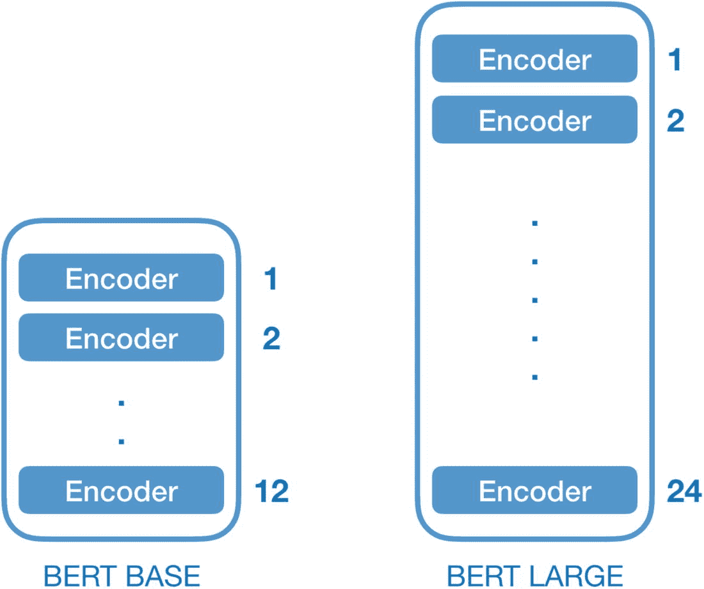

**图 5-1** BERT 模型架构

与 `word2vec` 不同，`BERT` 模型根据单词的周围上下文来创建单词的向量表示。它能够更深入地理解单词所使用的上下文。

`BERT` 模型的知识可以轻松迁移到各种 NLP 任务中（迁移学习）。这使得它非常有用。你可以根据具体用例添加一个小型网络层。例如，你可以添加一个分类层用于分类，如图 5-2 所示，或者标记答案的起始和结束位置，训练一个用于问答的模型。

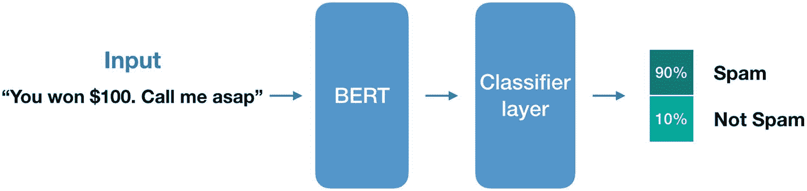

**图 5-2** 使用 BERT 作为分类器

如前所述，`BERT` 的训练策略之一是下一句预测。给定一对句子，它预测第二个句子是否是第一个句子的实际下一句。这可用于问答，因为它能建立对两个句子之间关系的理解。

`BERT` 使用特殊 token 来标识输入序列的开头（`[CLS]`），使用 token（`[SEP]`）分隔句子，并使用 token（`[MASK]`）随机遮蔽单词。

通过添加单层网络，我们可以微调一个用于下一句预测的模型，如图 5-3 所示。在将数据输入模型之前，我们对输入文本进行分词，并使用 token 来引导模型。基于用 `[SEP]` token 分隔的两个句子，它可以预测下一句是否是第一个句子的实际下一句。

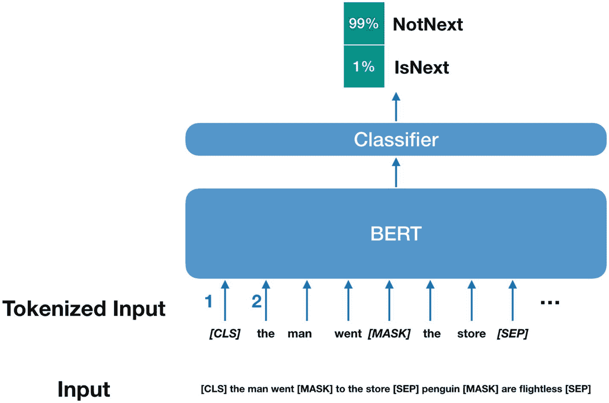

**图 5-3** 下一句预测


问答也被构建为一种预测任务。我们向模型提供一个问题和一段上下文段落，模型会预测段落中能最可能回答该问题的起始和结束标记，如图 5-4 所示。你可以使用标记来引导模型，指示文本中你需要的信息，并且模型会针对该特定任务（在此例中为问答任务）进行微调。

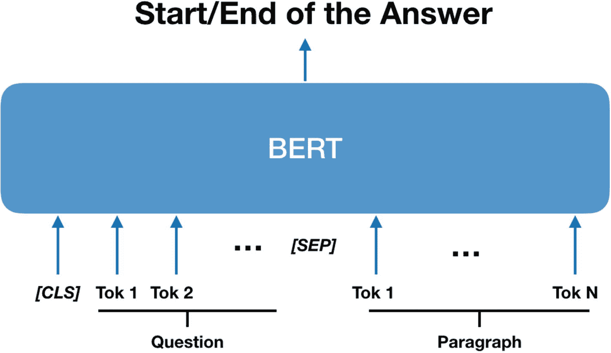

图 5-4：使用 BERT 进行问答

通过句子和词语进行演示可能有助于你更好地理解。图 5-5 中的示例文本来自 WWDC 2019 的一张幻灯片。我们将经过分词处理的问题和段落输入到微调后的模型中，模型会在段落中定位出答案。

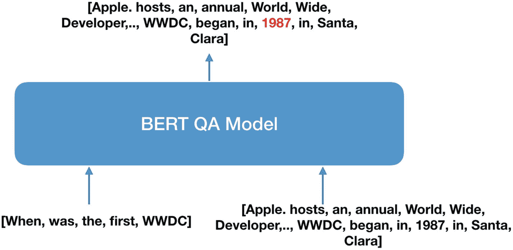

图 5-5：BERT 问答模型

我们已经学习了`BERT`模型的工作原理。现在，我们将使用该模型构建一个问答应用。

### 构建问答应用

我们将使用 SwiftUI 构建一个包含两个文本视图的应用。一个用于显示段落，另一个用于输入问题。用户复制段落，写下问题，然后点击一个按钮。我们将使用`BERT`问答模型在给定的文本中找出答案，并将其高亮显示给用户。让我们通过动手实践来构建这个应用并学习。

## BERT-SQuAD

`SQuAD`（斯坦福问答数据集）是一个基于维基百科文章的问答数据集，其中每个问题都包含答案。`SQuAD 2.0`包含 10 万个可回答问题和 5 万个不可回答问题。这有助于机器学习模型不仅能够找到答案，还能检测出给定文本中是否没有答案。

`BERT-SQuAD`模型就是使用该数据集针对问答任务进行微调的。它知道如何根据问题定位答案。幸运的是，苹果公司在其网站上以 Core ML 格式发布了这个模型（[`https://ml-assets.apple.com/coreml/models/Text/QuestionAnswering/BERT_SQUAD/BERTSQUADFP16.mlmodel`](https://ml-assets.apple.com/coreml/models/Text/QuestionAnswering/BERT_SQUAD/BERTSQUADFP16.mlmodel)）。请通过此链接下载`BERT-SQuAD`模型。模型的名称为`BERTSQUADFP16.mlmodel`。`FP16`表示模型权重使用半精度（16 位）浮点数存储。这有助于将模型压缩到更小的尺寸。

## 检查 Core ML 模型

使用 Xcode 打开模型进行查看。通过这种方式，我们可以查看模型的输入、输出、大小以及许可证、模型来源等详细信息，如图 5-6 所示。Model 类显示了模型自动生成的类。该类由 Xcode 生成，用于使用该模型。

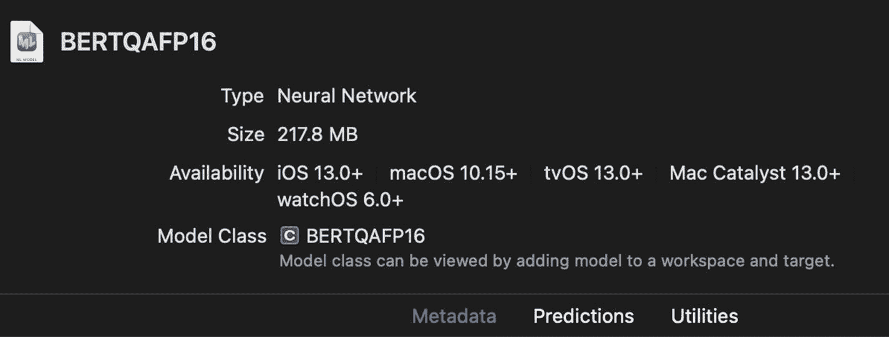

图 5-6：Xcode 中的 BERTQA 模型元数据

Xcode 中的 Metadata 部分显示了模型的通用信息，如描述、作者和许可证，如图 5-7 所示。

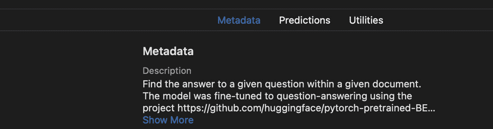

图 5-7：Xcode 中的 BERTQA 模型元数据（2）

Predictions 部分显示了模型的输入和输出，如图 5-8 所示。

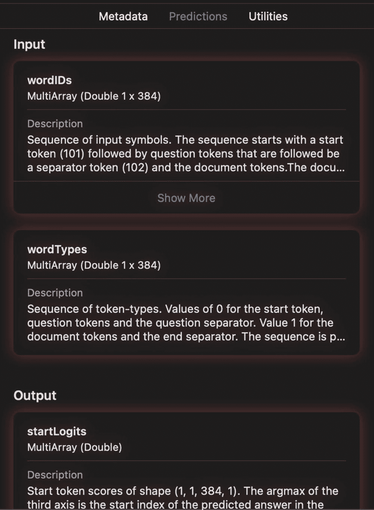

图 5-8：模型的输入和输出

这里，我们看到模型接受两个`MultiArray`，即`wordIDs`和`wordTypes`。这两个数组的长度均为 384。

`wordIDs`是词元索引，是构成序列的词元的数值表示，这些序列将作为模型的输入。图 5-9 显示了这些单词的示例索引。

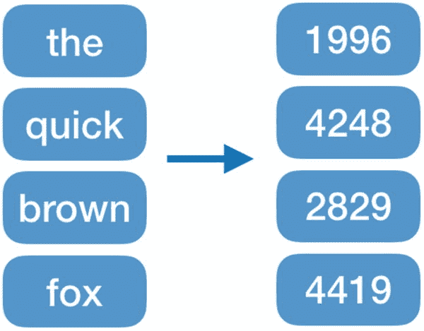

图 5-9：对单词进行分词

`wordTypes`是模型的另一个输入，代表词元类型。`wordTypes`告诉`BERT`模型`wordIDs`中的哪些元素来自文档。

模型的第一和第二个输入均使用`0`值填充至长度 384，以确保它们的长度都为 384。

模型的输出是两个`MultiArray`：`startLogits`和`endLogits`。它们的形状为`(1, 1, 384, 1)`。第三个轴包含 384 个数字，该轴上的最大值表示索引。对于`startLogits`，它表示预测的答案在输入序列中的起始索引；`endLogits`则表示预测的答案结束索引。

因此，简而言之，该模型接收包含问题和段落的 384 个词元，并返回段落中答案的起始和结束索引。

另一种检查 Core ML 模型的方法是使用 Netron 应用。它是一个神经网络模型查看器。你可以从这里下载：[`www.electronjs.org/apps/netron`](http://www.electronjs.org/apps/netron)。

通过显示神经网络的每一层，它提供了更详细的视图。如果你在 Netron 中打开`BERT-SQuAD`模型，你会看到如图 5-10 所示的模型。

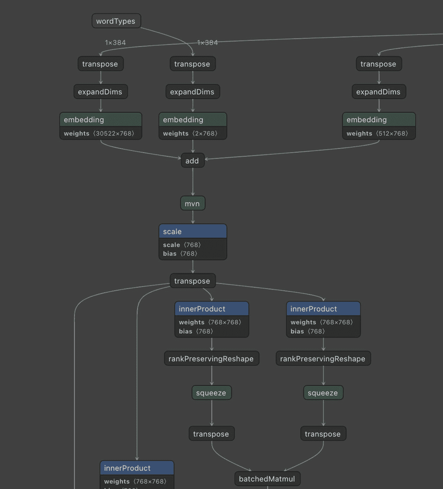

图 5-10：Netron 中的 BERT-SQuAD 模型

使用这个应用，你可以更深入地查看模型的架构，并检查层类型和参数。

## 让我们构建应用

我们将构建一个单视图的 SwiftUI 应用，其中包含一个用于粘贴段落的文本视图和一个用于输入问题的文本字段。当用户点击“查找”按钮时，我们将使用`BERT-SQuAD`模型在给定的段落中找出问题的答案。

最终的应用将如图 5-11 所示。

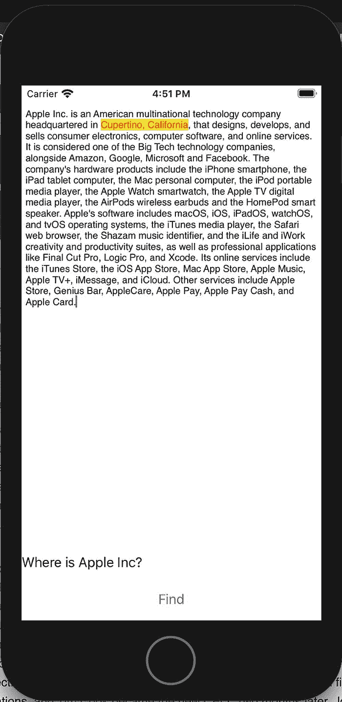

图 5-11：问答应用的最终效果

从这里下载初始项目：[`https://github.com/ozgurshn/Chapter5-QuestionAnswering/tree/master/Starter`](https://github.com/ozgurshn/Chapter5-QuestionAnswering/tree/master/Starter)。在 Xcode 中打开该项目开始编码。在这个项目中，许多繁琐的任务已经为你完成，以便你可以专注于核心部分。你可以在这里找到项目的完成版本：[`https://github.com/ozgurshn/Chapter5-QuestionAnswering/tree/master/Final`](https://github.com/ozgurshn/Chapter5-QuestionAnswering/tree/master/Final)。

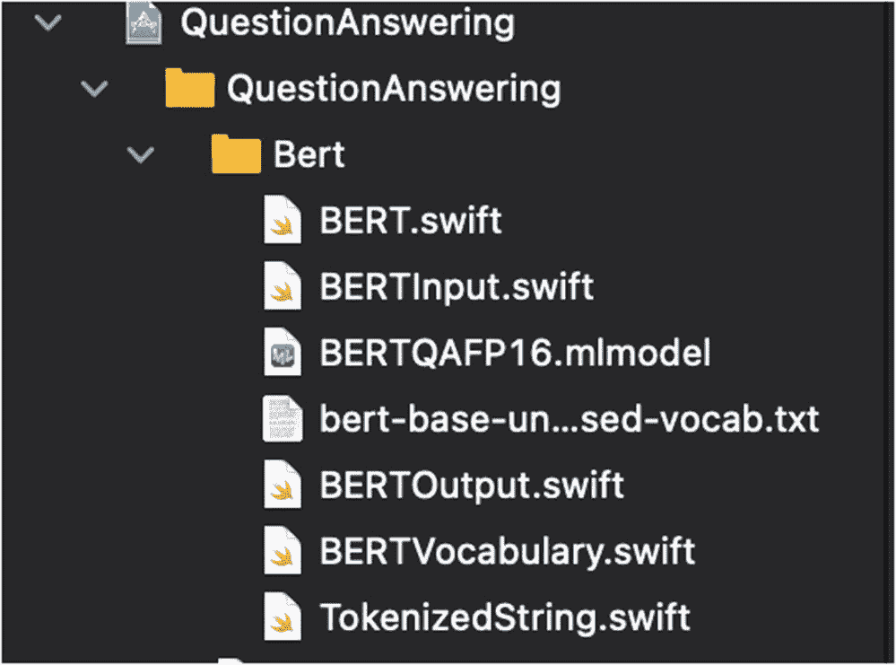

图 5-12：项目中的 BERT 文件


### 在 iOS 中使用 BERT 模型

您会在入门项目中看到 `Bert` 文件夹，如图 5-12 所示。其中的文件是在 iOS 中运行此模型所需的必要文件。这些文件取自 Apple 的示例项目（[`https://developer.apple.com/documentation/coreml/finding_answers_to_questions_in_a_text_document`](https://developer.apple.com/documentation/coreml/finding_answers_to_questions_in_a_text_document)）。我们将在项目中使用这些类，我会逐一解释所有文件。将您之前下载的 `BERTQA` 模型拖放到 `Bert` 文件夹中。

`BERTQAFP16.mlmodel` 文件是我们之前检查过的 Core ML 格式的 BERT 模型。

`BERTInput` 类将输入数据转换为模型输入格式。打开 `BERTInput.swift` 文件，查看其 `init` 函数。

它接收两个字符串参数：`documentString` 和 `questionString`，如代码清单 5-1 所示。

```
init(documentString: String, questionString:
String) {
document = TokenizedString(documentString)
question = TokenizedString(questionString)
代码清单 5-1
BERTInput 类的初始化函数
```

其主要功能是将这两个字符串参数转换为模型输入格式（`wordIDs` 和 `wordTypes`）。首先，它使用 `NLTagger` 将文本分割成单词。它将字符串分解为单词标记，每个标记都是原始字符串的一个子串，如代码清单 5-2 所示。

```
private static func wordTokens(from
rawString: String) -> [Substring] {
// 将分词后的子串存储到数组中。
var wordTokens = [Substring]()
// 使用 Natural Language 的 NLTagger 按单词对输入进行分词。
let tagger = NLTagger(tagSchemes:
[.tokenType])
tagger.string = rawString
// 查找字符串中的所有标记并追加到数组中。
tagger.enumerateTags(in:
rawString.startIndex..<rawString.endIndex,
unit: .word, scheme: .tokenType,
options: []) { _, tokenRange in
wordTokens.append(rawString[tokenRange])
return true
}
return wordTokens
}
代码清单 5-2
分词
```

然后，它使用 `TokenizedString` 类中的 `tokenize` 函数为每个标记找到对应的 `tokenId`。`TokenIds` 是在一个基于 `bert-base-uncased-vocab.txt` 文件（图 5-13）中的列表构建的字典中搜索的。该文件为每个单词和分隔符都分配了一个索引号。

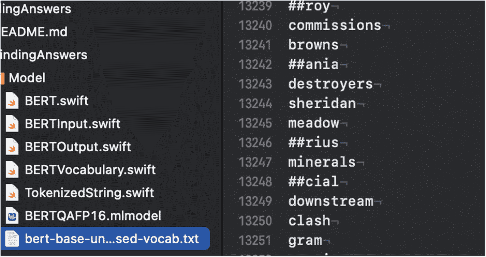

图 5-13  
Bert-Base 的单词列表

*创建 `wordID` 数组时，需按以下顺序排列标记 ID：*

1.  起始标记 ID，其值为 101，在 `bert-base` 单词列表文件中显示为 `[CLS]`
2.  问题文本的标记 ID
3.  分隔符标记 ID，其值为 102，在单词列表文件中显示为 `[SEP]`
4.  文本字符串的标记 ID
5.  另一个分隔符标记 ID（`[SEP]`）
6.  如果生成的 `tokenID` 数组长度小于 384，则填充标记 ID 以补足 384 个标记

此指令的代码如代码清单 5-3 所示。

```
// 以 `分类起始` 标记开始 wordID 数组。
var wordIDs = [BERTVocabulary.classifyStartTokenID]
// 添加问题标记和一个分隔符。
wordIDs += question.tokenIDs
wordIDs += [BERTVocabulary.separatorTokenID]
// 添加文档标记和一个分隔符。
wordIDs += document.tokenIDs
wordIDs += [BERTVocabulary.separatorTokenID]
// 用填充标记填充剩余的标记槽位。
let tokenIDPadding = BERTInput.maxTokens –
wordIDs.count
wordIDs += Array(repeating:
BERTVocabulary.paddingTokenID, count: tokenIDPadding)
guard wordIDs.count == BERTInput.maxTokens else {
fatalError("`wordIDs` 数组大小不正确。")
}
代码清单 5-3
创建 WordID 数组
```

我们已经将输入（段落、问题）转换为模型所需的格式。现在，我们需要将这些输入馈送给模型，并利用这些数据进行预测。打开 `BERT.swift` 文件检查具体实现。它使用代码清单 5-4 中的代码创建了一个 BERT-SQuAD 模型的实例。

```
let bertModel = try?
BERTQAFP16(configuration: MLModelConfiguration())
代码清单 5-4
创建模型实例
```

查看 `findAnswer` 函数。该函数以段落和问题作为输入，并返回答案。它将这两个参数（段落、问题）转换为我们之前分析过的 `BERTInput` 格式。创建所需输入后，我们使用代码清单 5-5 中的代码对 BERT 模型进行预测。

```
guard let prediction = try?
bertModel?.prediction(input: modelInput) else {
return "BERT 模型无法进行预测。"
}
// 分析 BERT 模型的输出。
guard let bestLogitIndices = bestLogitsIndices(from:
prediction,
in:
bertInput.documentRange) else {
return "找不到有效答案。请重试。"
}
// 找到原始字符串中的索引。
let documentTokens = bertInput.document.tokens
let answerStart =
documentTokens[bestLogitIndices.start].startIndex
let answerEnd =
documentTokens[bestLogitIndices.end].endIndex
// 返回原始字符串中对应部分作为答案。
let originalText = bertInput.document.original
return originalText[answerStart..<answerEnd]
代码清单 5-5
在 BERT 模型上进行预测
```

模型会返回给定 384 个标记中起始和结束索引预测的置信度分数。它返回 `startLogits` 和 `endLogits` 分别用于起始和结束索引的预测。我们需要在每张列表中找到最高值。`bestLogitsIndices` 函数会找到置信度最高的起始和结束索引对，这便指示了答案的位置。此过程的示意图如图 5-14 所示。

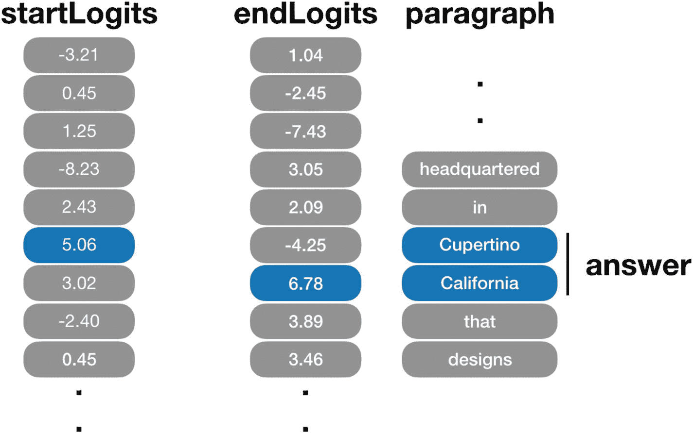

图 5-14  
寻找答案位置

我们在 `startLogits` 列表中找到最高置信度分数，该分数表示答案的起始位置；在 `endLogits` 列表中找到最高置信度分数，该分数表示答案的结束位置。我们从段落中截取这一部分，并将其作为答案返回。


### 构建应用的 UI

我们已经学习了如何在 iOS 中使用 `BERT-SQuAD` 模型。现在，我们将创建应用的用户界面，并使用问答模型。

打开 `ContentView.swift` 文件。这是我们 SwiftUI 应用的主视图。我们将添加三个 UI 元素：一个用于展示段落的文本视图、一个用于输入问题的文本字段，以及一个用于开始搜索答案的按钮。如果有答案存在，我们将用黄色背景在段落中高亮显示该答案。

对于 iOS 14，SwiftUI 内置了 `TextEditor`，但它不支持富文本。我们希望通过富文本来高亮文本中的答案，因此我们将使用 UIKit 的 `TextView`，并为它创建一个 SwiftUI 封装。打开 `TextView.swift` 文件，并复制清单 5-6 中的代码。

```swift
import SwiftUI
struct TextView: UIViewRepresentable {
    @Binding var attributedText: NSMutableAttributedString
    func makeUIView(context: Context) -> UITextView {
        let textView = UITextView()
        return textView
    }
    func updateUIView(_ uiView: UITextView, context: Context) {
        uiView.attributedText = attributedText
    }
}
```

`UIViewRepresentable` 允许我们封装 UIKit 视图并在 SwiftUI 中使用它们。需要填充两个函数：`makeUIView`（用于创建视图）和 `updateUIView`（用于告知 SwiftUI 哪些元素需要更新）。在这里，我们将 `attributedText` 变量绑定到 `TextView` 的 `attributedText` 属性，这样它就能自动在 UI 中反映变化。

打开 `ContentView.swift` 文件。首先在 `ContentView` 类中声明将与 UI 元素绑定的状态变量。我们将为段落创建一个富文本；这样我们可以在富字符串的某些部分更改字体，从而能够高亮答案。

我们为问题创建一个带有默认值的变量，但用户也可以输入任何问题。最后，我们创建 `BERT` 模型实例来使用我们的问答模型，如清单 5-7 所示。

```swift
@State var attributedText = NSMutableAttributedString(string: "Apple Inc. is an American multinational technology company headquartered in Cupertino, California, that designs, develops, and sells consumer electronics, computer software, and online services. It is considered one of the Big Tech technology companies, alongside Amazon, Google, Microsoft and Facebook. The company's hardware products include the iPhone smartphone, the iPad tablet computer, the Mac personal computer, the iPod portable media player, the Apple Watch smartwatch, the Apple TV digital media player, the AirPods wireless earbuds and the HomePod smart speaker. Apple's software includes macOS, iOS, iPadOS, watchOS, and tvOS operating systems, the iTunes media player, the Safari web browser, the Shazam music identifier, and the iLife and iWork creativity and productivity suites, as well as professional applications like Final Cut Pro, Logic Pro, and Xcode. Its online services include the iTunes Store, the iOS App Store, Mac App Store, Apple Music, Apple TV+, iMessage, and iCloud. Other services include Apple Store, Genius Bar, AppleCare, Apple Pay, Apple Pay Cash, and Apple Card.")
@State var question = "Where is Apple Inc?"
let bert = BERT()
```

在 `ContentView` 类的 `body` 部分，我们将放置要显示在屏幕上的 UI 元素。我们首先创建 `VStack`，以垂直顺序排列元素。然后，我们添加之前创建的 `TextView`，并将其绑定到 `attributedText` 状态变量。当我们更新 `attributedText` 时，`TextView` 将自动更新 UI 并显示文本。用户将使用这个文本视图来粘贴他们想要搜索的文章。我们使用文本视图而不是文本字段，因为它支持多行文本，更适合文章等长文本。我们添加的另一个元素是一个文本字段，用户可以在其中输入问题，并将其文本绑定到 `question` 变量，如清单 5-8 所示。

```swift
var body: some View {
    VStack {
        TextView(attributedText: $attributedText)
        TextField("Enter your question", text: $question)
    }
}
```

现在，我们有两个 UI 元素：一个用于文章内容的文本视图和一个用于输入问题的文本字段。

在文本字段下方，我们将添加一个用于开始搜索的按钮。将清单 5-9 中的按钮代码复制到文本字段下方。

```swift
Button(action: {
    // 在后台运行搜索，以保持 UI 响应。
    DispatchQueue.global(qos: .userInitiated).async {
        // 使用 BERT 模型搜索答案。
        let answer = self.bert.findAnswer(for: self.question, in: self.attributedText.string)
        // 在主队列上更新 UI。
        DispatchQueue.main.async {
            let mutableAttributedText = NSMutableAttributedString(string: self.attributedText.string)
            let location = answer.startIndex.utf16Offset(in: self.attributedText.string)
            let length = answer.endIndex.utf16Offset(in: self.attributedText.string) - location
            let answerRange = NSRange(location: location, length: length)
            let fullTextColor = UIColor.red
            mutableAttributedText.addAttributes([.foregroundColor: fullTextColor, .backgroundColor: UIColor.yellow], range: answerRange)
            self.attributedText = mutableAttributedText
        }
        print(String(answer))
        self.speechToText(text: String(answer))
    }
}){ Text("Find") }.padding()
```

我们创建了一个带有“Find”标签的按钮。当用户点击该按钮时，会调用其操作。在该操作中，我们调用 `BERT` 类的 `findAnswer` 函数，传入段落和问题作为参数。该调用在一个单独的队列（`userInitiated`）中进行，以免阻塞主 UI 线程。模型返回结果后，我们通过调用 `DispatchQueue.main.async` 在主线程中更新 UI。这确保了 UI 更新能够正确处理。在这个主线程调用中，我们根据段落文本创建一个新的富字符串，并找到答案在该段落文本中的起始和结束索引。我们使用起始和结束索引创建一个范围（`NSRange`），并使用该索引来为段落中的答案背景着色。我们将答案文字颜色设为红色，背景颜色设为黄色。

您现在可以在模拟器或设备上运行项目来测试您的应用程序。由于我们为段落和问题填充了文本，它们会自动显示。点击“Find”按钮在段落中查找答案。如图 5-15 所示，它会在段落中将“Cupertino, California”高亮显示，作为对“Where is Apple Inc.?”问题的回答。

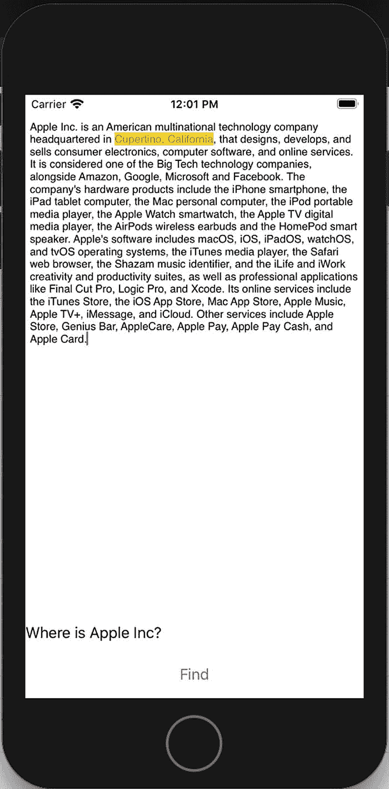

**图 5-15** 问答应用

恭喜！您刚刚构建了一个智能应用，它能在几秒钟内从文本中找到答案，并且您学会了如何在 iOS 应用中使用最先进的自然语言模型。

接下来，我们将添加语音转文字功能，允许我们通过语音提问，然后使用文字转语音功能让 Siri 朗读答案。


### 使用 Speech 框架进行语音识别

你需要在 `Info.plist` 文件中添加两个键（`NSSpeechRecognitionUsageDescription`、`NSMicrophoneUsageDescription`）及其描述。当 iOS 请求用户允许使用麦克风和语音识别时，这些描述会显示给用户。我们将在视图出现时请求转录权限。请在 `ContentView` 类中添加此函数以请求权限。

```
func requestTranscribePermissions() {
    SFSpeechRecognizer.requestAuthorization { authStatus in
        DispatchQueue.main.async {
            if authStatus == .authorized {
                print("Authorized for transcription")
            } else {
                print("Transcription permission was declined.")
            }
        }
    }
}
```

我们将在主 `VStack` 出现时调用此函数。在 `VStack` 调用的末尾，此函数如代码清单 5-11 所示。

```
.onAppear {
    self.requestTranscribePermissions()
}
```

我们将使用 `SFSpeech` 框架将音频转录为文本。请在 `ContentView` 结构体的开头添加以下声明：

```
private var recognitionTask: SFSpeechRecognitionTask?
private let audioEngine = AVAudioEngine()
private let speechRecognizer = SFSpeechRecognizer(locale: Locale(identifier: "en-US"))!
```

在上述代码中，我们创建了 `recognitionTask` 变量，并在此声明它，以便在不同的说话会话之间存储它。这样，当我们开始新的说话会话时，可以取消之前的任务。我们还声明了 `AVAudioEngine` 来处理麦克风音频流，并为英语创建了 `SFSpeechRecognizer` 以执行语音识别。

现在，我们将创建实际的转录函数。请将代码清单 5-12 中的代码添加到 `ContentView` 结构体中。

```
func transcribe(completionHandler: @escaping (String) -> ()) {
    // Cancel the previous task if it's running.
    recognitionTask?.cancel()
    recognitionTask = nil

    // Configure the audio session for the app.
    let audioSession = AVAudioSession.sharedInstance()
    try? audioSession.setCategory(.record, mode: .measurement, options: .duckOthers)
    try? audioSession.setActive(true, options: .notifyOthersOnDeactivation)
    let inputNode = audioEngine.inputNode

    // Create and configure the speech recognition request.
    let recognitionRequest = SFSpeechAudioBufferRecognitionRequest()
    recognitionRequest.shouldReportPartialResults = true

    // Create a recognition task for the speech recognition session.
    // Keep a reference to the task so that it can be canceled.
    recognitionTask = speechRecognizer.recognitionTask(with: recognitionRequest) { result, error in
        if let result = result {
            print("Text \(result.bestTranscription.formattedString)")
            completionHandler(result.bestTranscription.formattedString)
        }
    }

    // Configure the microphone input.
    let recordingFormat = inputNode.outputFormat(forBus: 0)
    inputNode.installTap(onBus: 0, bufferSize: 1024, format: recordingFormat) { (buffer: AVAudioPCMBuffer, when: AVAudioTime) in
        recognitionRequest.append(buffer)
    }

    audioEngine.prepare()
    try? audioEngine.start()
    print("Ready to transcribe")
}
```

在上述代码中，我们取消了之前的识别任务并启动了一个新的任务。我们创建一个音频会话来处理麦克风输入，并创建一个 `SFSpeechAudioBufferRecognitionRequest` 实例来转录音频。我们将此请求的 `shouldReportPartialResults` 参数设置为 `true`，以接收每次发音的部分结果。这让我们可以用部分结果更新文本字段，并让用户实时了解情况。我们通过 `result.bestTranscription.formattedString` 返回所有发音的完整转录文本。

为了简化代码，此代码示例中忽略了许多异常。在生产应用中，我们应该使用 `do-try-catch` 块正确地捕获和处理异常。

为了调用此 `transcribe` 函数，我们将添加另一个标签为“Speak”的按钮。当用户点击此按钮时，我们将处理语音并更改问题字符串。请将代码清单 5-13 中的按钮代码添加至上一按钮下方，并将这些按钮包裹在 `HStack` 中以使它们并排显示。

```
Button(action: {
    self.transcribe { (speechText) in
        self.question = speechText
    }
}) { Text("Speak") }
```

此按钮在点击时调用 `transcribe` 函数，当方法返回完成处理器时，它会用此文本更新 `question`。现在，运行项目并在设备上测试。它应首先请求使用麦克风和转录的权限。点击“Speak”按钮并提出您的问题。您所说的内容应出现在问题字段中。结果应如图 5-16 所示。

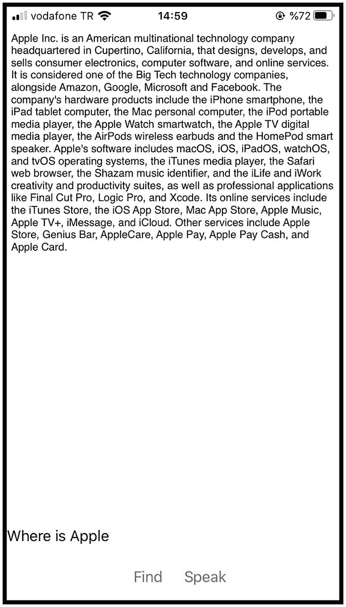

**图 5-16** 语音处理应用

我们要添加的最后一项功能是文本转语音。这将用语音读出在段落中找到的答案。请在 `ContentView` 结构体中添加代码清单 5-14 中的代码。

```
func speechToText(text: String) {
    let utterance = AVSpeechUtterance(string: text)
    utterance.voice = AVSpeechSynthesisVoice(language: "en-GB")
    let synthesizer = AVSpeechSynthesizer()
    synthesizer.speak(utterance)
}
```

在上述代码中，我们使用文本创建了一个 `AVSpeechUtterance` 实例。使用这个类，我们可以改变语音的口音或语速。最后，我们创建 `AVSpeechSynthesizer` 来朗读答案。这就是为您的应用添加文本转语音功能的全部步骤。

我们将在代码清单 5-15 所示的位置调用此函数，即在“Find”按钮的操作中处理 `findAnswer` 方法结果的地方。

```
print(String(answer))
self.speechToText(text: String(answer))
```

我们的应用已准备好朗读。在设备上测试它，点击“Speak”按钮，提出您的问题，然后点击“Find”按钮。它将在文章中查找并高亮显示答案，同时朗读该答案。

## 总结

在本章中，我们研究了 BERT 模型；学习了它的工作原理、输入和输出是什么，以及它如何对字符串进行分词。本章还介绍了 BERT-SQuAD 模型及其使用的数据集（SQuAD 2.0）。我们还学习了如何使用 Xcode 或 Netron 应用程序检查 Core ML 模型。我们使用 SwiftUI 和 BERT-SQuAD 模型构建了问答应用，并学习了如何将 NLP 模型集成到我们的 iOS 应用中。此外，我们还使用 Speech 框架添加了语音识别和文本转语音功能，使我们的应用更加智能。

