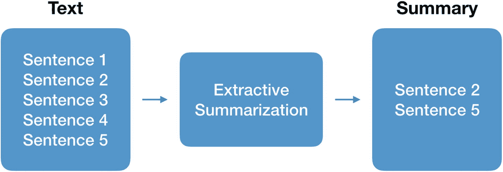
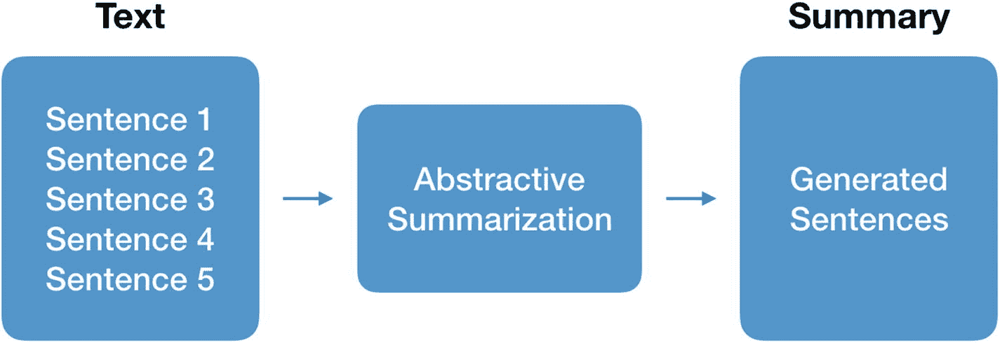
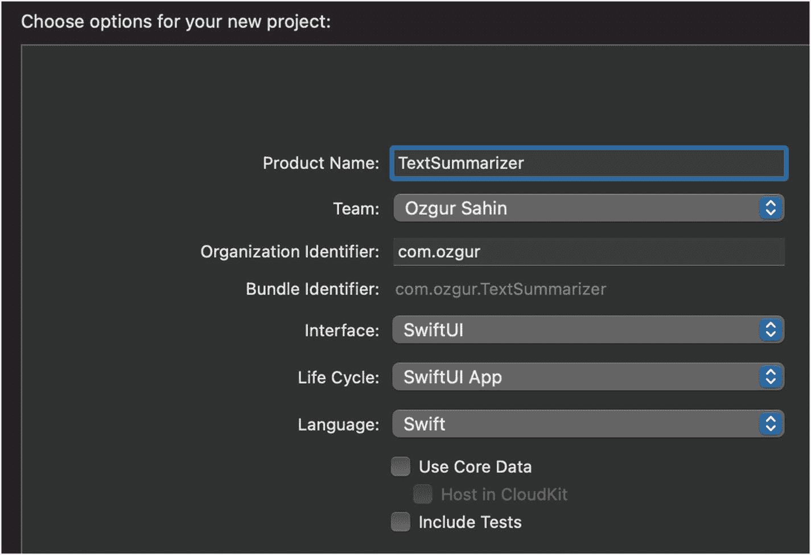
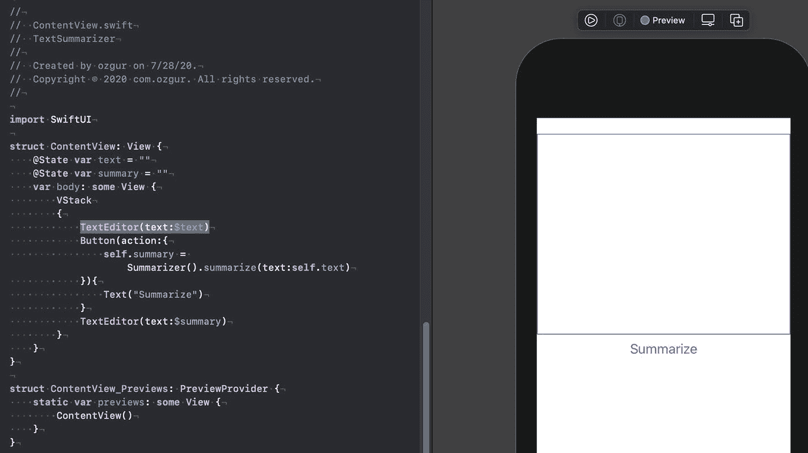
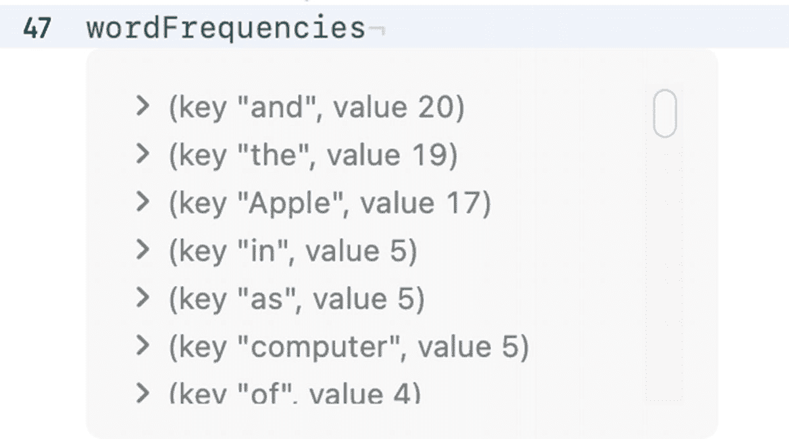
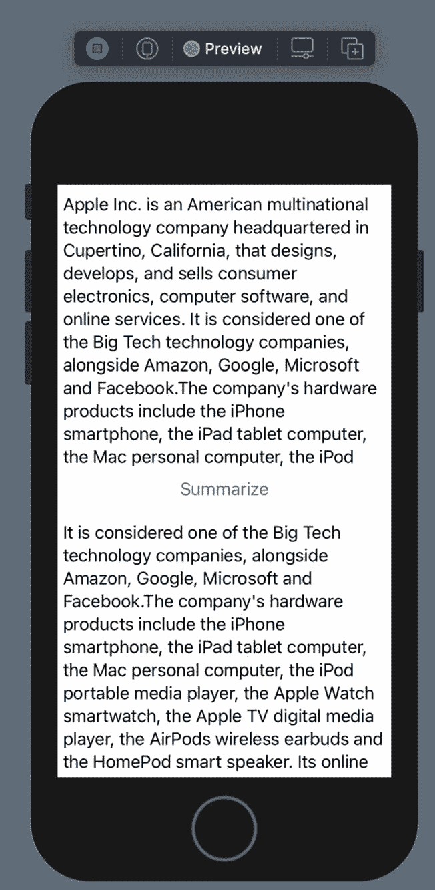

# 6. 文本摘要

本章将介绍使用自然语言处理技术进行文本摘要。将通过示例介绍不同类型的文本摘要技术。您将深入了解摘要的原理，并能够将其应用到您的 iOS 项目中。在掌握主要知识后，我们将使用 iOS 内置的 NLP 功能开发一个智能 iOS 应用，该应用能够对给定的文章进行摘要。


## 什么是文本摘要？

文本摘要是指通过计算方式缩短文本，生成一个代表原始内容中最重要信息的子集的过程。文本摘要试图找出文章中最具信息量的句子并提取这些信息。文本摘要通常分为两种技术：抽取式摘要和生成式摘要。

抽取式摘要是通过从文本中找出最重要的句子并提取这些句子来完成的，如图 6-1 所示。在这种技术中，句子根据其重要性进行评分，然后将排名前`k`个最重要的句子拼接在一起生成摘要。摘要中直接使用原始句子，不做任何改写。



图 6-1 抽取式摘要

生成式文本摘要利用自然语言技术解释文本，并生成一段新的、更短的文本，如图 6-2 所示。这是一种更复杂的方法，因为它需要对内容有全面的理解，并用更短的文本改写关键信息。使用这种技术生成的摘要更接近人类可能表达的摘要形式。近年来，生成式方法开始利用深度学习领域的发展成果。



图 6-2 生成式摘要

本章将要开发的应用使用抽取式摘要技术。我们将找出得分高的句子，并用这些句子来代表文本。

本章我们不会开发生成式摘要的示例，但你可以使用序列到序列（`Seq2Seq`）模型，通过在其中一个深度学习框架（`Keras`、`PyTorch` 等）上对摘要数据集进行训练来开发它，然后使用 `coremltools` 将其转换为 Core ML 格式。

让我们动手实践，使用抽取式摘要方法构建文本摘要应用。我建议你亲自完成它，但如果你觉得有点懒，可以在这里找到本章的完整项目：[`https://github.com/ozgurshn/Chapter6-TextSummarizer`](https://github.com/ozgurshn/Chapter6-TextSummarizer)。

## 构建文本摘要应用

首先，在 Xcode 中创建一个空的 SwiftUI 项目。选择“App”模板，并确保用户界面设置为 SwiftUI，如图 6-3 所示。



图 6-3 新建项目

首先，我们将创建一个文本视图来显示要摘要的文章。SwiftUI 提供了 `TextEditor` 来代替 UIKit 的 `TextView`。创建一个名为“`TextView.swift`”的 Swift 文件，并复制代码清单 6-1 中的代码。

`ContentView` 是我们的主视图。让我们打开它并设计屏幕。将代码清单 6-1 中的代码复制到 `ContentView` 文件中。

```
struct ContentView: View {
@State var text = ""
@State var summary = ""
var body: some View {
VStack
{
TextEditor(text:$text)
Button(action:{
self.summary =
Summarizer().summarize(text:self.text)
}){
Text("Summarize")
}
TextEditor(text:$summary)
}
}
}
```

代码清单 6-1 `ContentView`

在 `ContentView` 中，我们创建了两个状态属性来保存 `text` 和 `summary`。它们被创建为状态，因为我们希望它们绑定到 UI 并反映更改。在 `body` 中，我们使用的主要元素是 `VStack`，它垂直组织 UI 元素。在它内部，我们放置了一个用于文章文本的编辑器、一个用于生成摘要的按钮，以及一个用于显示摘要的编辑器。我们暂时将按钮操作留空，稍后在我们编写完文本摘要类后再填充它。

让我们检查一下应用，看看一切是否正常。除非预览可见，否则请打开画布查看预览，如图 6-4 所示。从菜单中点击 **Editor** ➤ **Canvas**，或使用快捷键 `option+command+enter`。



图 6-4 SwiftUI 预览测试

创建一个名为“`Summarizer.swift`”的 Swift 文件。在这个类中，我们将通过对文章中的句子进行评分，并根据得分高的句子创建摘要来处理文本摘要过程。

导入自然语言框架，如代码清单 6-2 所示，我们将使用它对文章进行分词。

```
import NaturalLanguage
```

代码清单 6-2 导入自然语言框架

然后，我们创建一个结构体来保存句子及其排名和索引，如代码清单 6-3 所示。`Rank` 表示句子的重要性，`index` 表示句子在文章中的位置。

```
struct SentenceAndRank
{
var sentence:String
var rank:Int
var index:Int
}
```

代码清单 6-3 `SentenceAndRank`

接下来，让我们创建一个名为 `Summarizer` 的类，并声明我们的停用词，如代码清单 6-4 所示。


```swift
class Summarizer
{
let stopWords = ["a", "about", "above", "across",
"after", "afterwards", "again", "against", "all",
"almost", "alone", "along", "already", "also",
"although", "always", "am", "among", "amongst",
"amoungst", "amount", "an", "and", "another", "any",
"anyhow", "anyone", "anything", "anyway",
"anywhere", "are", "around", "as", "at", "back",
"be", "became", "because", "become", "becomes",
"becoming", "been", "before", "beforehand", "behind",
"being", "below", "beside", "besides", "between",
"beyond", "bill", "both", "bottom", "but", "by",
"call", "can", "cannot", "cant", "co", "con",
"could", "couldnt", "cry", "de", "describe",
"detail", "do", "done", "down", "due", "during",
"each", "eg", "eight", "either", "eleven", "else",
"elsewhere", "empty", "enough", "etc", "even",
"ever", "every", "everyone", "everything",
"everywhere", "except", "few", "fifteen", "fify",
"fill", "find", "fire", "first", "five", "for",
"former", "formerly", "forty", "found", "four",
"from", "front", "full", "further", "get", "give",
"go", "had", "has", "hasnt", "have", "he", "hence",
"her", "here", "hereafter", "hereby", "herein",
"hereupon", "hers", "herself", "him", "himself",
"his", "how", "however", "hundred", "ie", "if", "in",
"inc", "indeed", "interest", "into", "is", "it",
"its", "itself", "keep", "last", "latter",
"latterly", "least", "less", "ltd", "made", "many",
"may", "me", "meanwhile", "might", "mill", "mine",
"more", "moreover", "most", "mostly", "move", "much",
"must", "my", "myself", "name", "namely", "neither",
"never", "nevertheless", "next", "nine", "no",
"nobody", "none", "noone", "nor", "not", "nothing",
"now", "nowhere", "of", "off", "often", "on", "once",
"one", "only", "onto", "or", "other", "others",
"otherwise", "our", "ours", "ourselves", "out",
"over", "own", "part", "per", "perhaps", "please",
"put", "rather", "re", "same", "see", "seem",
"seemed", "seeming", "seems", "serious", "several",
"she", "should", "show", "side", "since", "sincere",
"six", "sixty", "so", "some", "somehow", "someone",
"something", "sometime", "sometimes", "somewhere",
"still", "such", "system", "take", "ten", "than",
"that", "the", "their", "them", "themselves", "then",
"thence", "there", "thereafter", "thereby",
"therefore", "therein", "thereupon", "these", "they",
"thickv", "thin", "third", "this", "those", "though",
"three", "through", "throughout", "thru", "thus",
"to", "together", "too", "top", "toward", "towards",
"twelve", "twenty", "two", "un", "under", "until",
"up", "upon", "us", "very", "via", "was", "we",
"well", "were", "what", "whatever", "when", "whence",
"whenever", "where", "whereafter", "whereas",
"whereby", "wherein", "whereupon", "wherever",
"whether", "which", "while", "whither", "who",
"whoever", "whole", "whom", "whose", "why", "will",
"with", "within", "without", "would", "yet", "you",
"your", "yours", "yourself", "yourselves"]
}
```
**列表 6-4** — 停用词

停用词是语言中最常见的词汇。通常，我们会在处理文本之前先过滤掉这些词。由于我们将根据词频来衡量句子重要性，这些词可能会产生负面影响，因为它们是最频繁出现的词。

然后，我们创建一个文本拆分函数，将给定的文本拆分成句子或单词。我们使用 `Natural Language` 框架中的 `NLTokenizer` 来枚举标记（单词、句子等），如列表 6-5 所示。创建一个这些标记的列表并返回该列表。

```swift
private func splitTo(text:String,
unit:NLTokenUnit) -> [String]
{
let tokenizer = NLTokenizer(unit: unit)
tokenizer.string = text
var tokens = [String]()
tokenizer.enumerateTokens(in:
text.startIndex..<text.endIndex) { range, _ in
tokens.append(String(text[range]))
return true
}
return tokens
}
```
**列表 6-5** — 文本拆分函数



**图 6-5** — 词频

接下来，我们将创建一个函数，用于计算给定文本中单词的频率（出现次数），如列表 6-6 所示。我们使用 `NSLinguisticTagger` 来枚举文本中的单词。通过指定 `NSLinguisticTagger.Options`，我们可以忽略标点符号和空白。我们使用单词的小写版本来标准化列表中的词汇。枚举通过 `NSLinguisticTagger` 的 `enumerate` 函数执行。单词计数被放入一个字典中并返回。

```swift
private func calculateWordFrequencies(text: String)
-> [String: Int] {
var frequencyList = [String: Int]()
let tagger = NSLinguisticTagger(tagSchemes:
[.tokenType], options: 0)
let range = NSRange(location: 0, length:
text.utf16.count)
let options: NSLinguisticTagger.Options =
[.omitPunctuation, .omitWhitespace]
tagger.string = text.lowercased()
tagger.enumerateTags(in: range, unit: .word,
scheme: .tokenType, options: options) { _,
tokenRange, _ in
let word = (text as NSString).substring(with:
tokenRange)
if frequencyList[word] != nil {
frequencyList[word]! += 1
} else {
frequencyList[word] = 1
}
}
return frequencyList
}
```
**列表 6-6** — 计算词频

例如，如果我们计算维基百科上关于苹果的那篇文章的词频，可以看到最频繁出现的词是像 "and" 和 "the" 这样的停用词，如图 6-5 所示。

现在，我们需要计算给定句子中所有单词的频率总和。这将显示句子重要性。这里，我们假设最具信息量的单词往往会在一篇文章中反复出现，但我们忽略那些非常频繁的停用词。列表 6-7 展示了如何创建这个函数。

```swift
private func getWordFrequencySum(sentence:String,
frequencies:[String:Int])->Int
{
let wordList = splitTo(text: sentence,
unit: .word)
var rank = 0
for word in wordList
{
if !stopWords.contains(word)
{
rank += frequencies[word, default: 0]
}
}
return rank
}
```
**列表 6-7** — 计算句子的词频总和

我们要编写的最后一个函数是摘要生成函数。如列表 6-8 所示，我们计算给定文本中每个单词的频率，然后将文章拆分成句子。我们遍历这些句子，计算每个句子的词频总和。然后，根据句子的评分对列表进行降序排序。我们选择评分最高的前三句，并根据它们在原文中的索引将它们拼接在一起。

```swift
func summarize(text:String)->String
{
let wordFrequencies =
calculateWordFrequencies(text: text)
let sentences = splitTo(text: text,
unit: .sentence)
var sentenceAndRank:[SentenceAndRank] = []
for (index, sentence) in sentences.enumerated()
{
let rank = getWordFrequencySum(sentence: sentence,frequencies: wordFrequencies)
sentenceAndRank.append(SentenceAndRank(sentence:
sentence, rank: rank, index:index))
}
// 按评分对句子排序
let sentencesByRanking = sentenceAndRank.sorted {
$0.rank > $1.rank }
// 选择最重要的 3 个句子
let keySentences = sentencesByRanking.prefix(3)
// 按句子顺序返回，并将所有句子合并成一个句子
return keySentences.sorted {$0.index <
$1.index }.map{$0.sentence}.joined()
}
```
**列表 6-8** — 摘要生成函数

摘要类已经准备好生成文本摘要了。最后要做的事情是从 `ContentView` 中调用这个函数。打开 `ContentView` 并在按钮的操作中调用 "summarize" 函数，如列表 6-9 所示。

```swift
Button(action:{
self.summary =
Summarizer().summarize(text:self.text)
})
```
**列表 6-9** — 摘要生成按钮的操作

在模拟器或 SwiftUI 实时预览中运行你的应用。将一段长文本复制到你的第一个文本编辑器中，然后点击 "Summarize" 按钮。摘要将显示在按钮下方的文本编辑器中，如图 6-6 所示。




**图 6-6** 文本摘要应用

## 总结

在本章中，我们介绍了使用自然语言处理进行文本摘要的核心技术。分别讲解了抽象式和抽取式摘要方法。在掌握理论知识后，我们利用 iOS 内置的 NLP 能力和抽取式摘要技术，构建了一个文本摘要应用。在开发过程中，我们学会了如何过滤常见词或停用词，以及如何使用`NSLinguisticTagger`计算词频。

