# 7. 集成 Keras 模型

本章将介绍一些高级用例，包括集成在第三方深度学习框架（如 Keras）中训练的模型。虽然使用 Create ML 可以轻松训练模型，但有时你可能需要使用 Create ML 中不存在的新型深度学习架构。针对这些场景，我们将学习如何将 Keras 模型集成到应用中。在本章中，我们还将利用`coremltools`库将 Keras 模型转换为 Core ML 格式，并通过开发一个示例文本分类应用来实践学习。此外，你还会学到如何使用 Google Colab 服务——一个在线且免费的 Python 环境。

## 将 Keras 模型转换为 Core ML 格式

Keras 是对 TensorFlow 或 Theano 等更复杂深度学习库的封装。它的代码编写风格比所封装的库更简单直观，支持快速原型开发，并兼容多种神经网络架构。

本节中，我们将在 Google Colab 上训练模型。这是一个免费的在线平台，可用于训练神经网络和运行实验，同时还提供免费的高性能 GPU 以加速训练。如果你希望在本地 PC 上训练，也可以使用之前章节创建的本地虚拟环境运行这些示例——但我建议使用 Colab。Colab 同样采用 Jupyter 笔记本，但这些笔记本由 Google 托管。通过它们，我们可以逐单元执行代码并实时查看结果。

访问[`https://colab.research.google.com/`](https://colab.research.google.com/)并创建一个新笔记本（文件 ➤ 新建笔记本）。复制粘贴并运行代码清单 7-1 中的代码，以安装所需的库。通常 TensorFlow 和 Keras 都已预装在 Colab 中，但我们需要重新安装，因为它们的版本与`coremltools`不兼容。如果直接使用 Colab 当前安装的版本，会遇到一些问题。


**图 7-1** Google Colab 单元

### 在 Keras 中训练文本分类模型

将代码清单 7-1 中的代码复制到 Colab 的一个代码单元中。

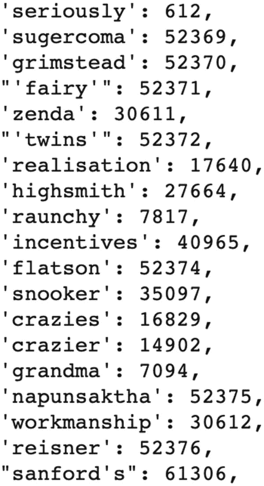

**图 7-2** IMDB 数据集中的词表示

```
!pip install tensorflow==1.14
!pip install keras==2.2.4
!pip install coremltools==3.4
```

**代码清单 7-1** 安装库

要运行代码单元，只需点击左侧的播放按钮，如图 7-1 所示。执行过程中，你会看到一个旋转的循环图标。

运行完上述单元后，我们执行代码清单 7-2 中的代码来导入库。将代码复制到新代码单元并运行。

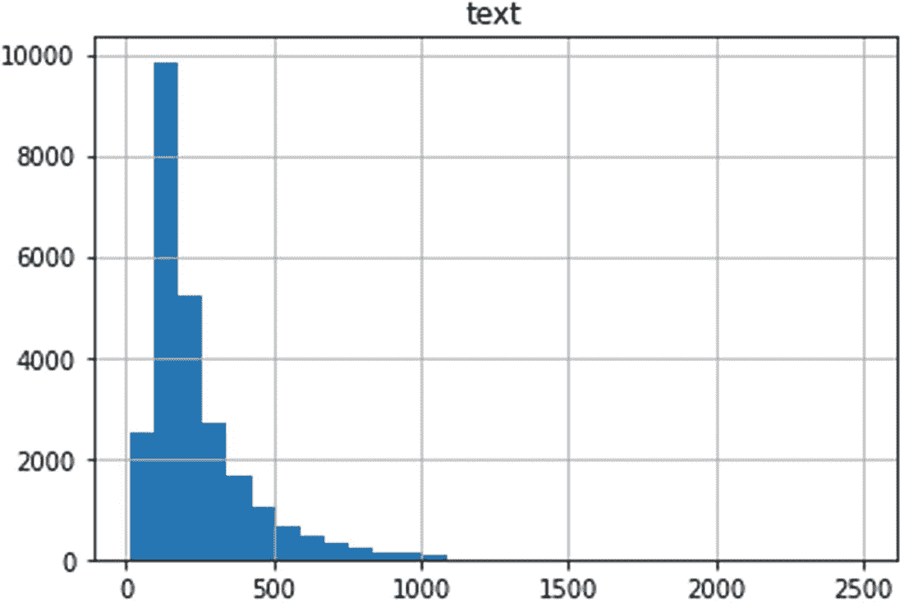

**图 7-3** 词频分布

```
import numpy as np
from keras.preprocessing.text import Tokenizer
from keras.preprocessing.sequence import
pad_sequences
from keras.models import Sequential, Model
from keras.layers import Dense, Input, Bidirectional,
GRU, TimeDistributed, Activation, Flatten, Embedding
from keras.optimizers import Adam
from keras.datasets import imdb
```

**代码清单 7-2** 导入库

在这里，我们导入了 NumPy 以使用其数组功能，同时还导入了文本分词器和 Keras 库中的特定层。最后，我们从 Keras 数据集中导入了 IMDB 数据集。`Keras.datasets`（[`https://keras.io/api/datasets/`](https://keras.io/api/datasets/)）模块提供了一些小型数据集（已向量化，采用 NumPy 格式），因此你无需自行处理数据下载、解压和预处理。

我们将使用 IMDB 电影评论情感分类数据集来训练一个分类模型。根据 Keras 文档，该数据集包含来自 IMDB 的 25,000 条电影评论，并标注了情感（正面/负面）。

评论已经过预处理，每条评论被编码为一个词索引（整数）列表，如图 7-2 所示。为方便起见，单词按在数据集中出现的总频率进行索引，例如整数“3”表示数据集中第三高频的词。这使得快速过滤操作成为可能，例如“仅考虑最常见的 10,000 个词，但排除最常用的 20 个词”。

我们将从该数据集中选取最常见的 10,000 个词，并基于这些数据训练模型。代码清单 7-3 展示了如何从 Keras 数据集中加载这些数据。将代码复制到新单元并运行。

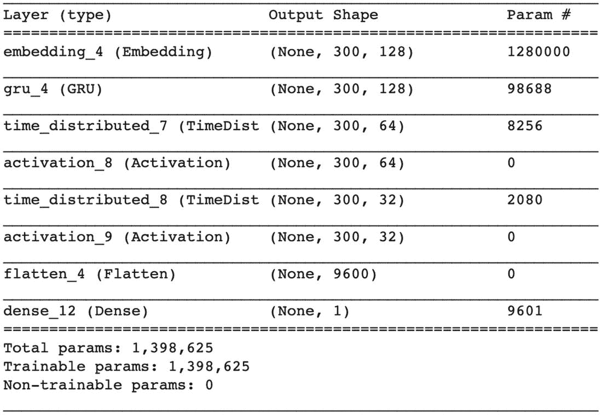

**图 7-4** 模型概要

```
# 选取 imdb 数据集中最常见的 10000 个词
maxNumberOfWords = 10000
## 解决 imdb.load_data 在该版本中无法直接加载的问题：https://
stackoverflow.com/a/56243777/4156490
## 错误提示为：'ValueError: Object arrays cannot be
loaded when allow_pickle=False'
# 保存 np.load
np_load_old = np.load
# 修改 np.load 的默认参数
np.load = lambda *a,**k: np_load_old(*a,
allow_pickle=True)
# 以隐式设置 allow_pickle=True 的方式调用 load_data
(x_train, y_train), (x_test, y_test) =
imdb.load_data(num_words=maxNumberOfWords)
# 恢复 np.load 以供后续正常使用
np.load = np_load_old
```

**代码清单 7-3** 加载 IMDB 数据集


#### 基于 RNN 的 IMDB 评论情感分析

##### 加载数据集

通常，`imdb.load_data` 函数足以加载数据集，但对于本版本的 TensorFlow，我们需要实现一种变通方案。方案实现后，我们加载数据并将其分为训练集和测试集。默认分割比例为 0.5，因此我们将数据集对半分成训练集和测试集。测试集不会用于训练，它将用于测试，以检验我们训练好的模型在未见过的数据上表现如何。以 `x` 开头的参数表示 IMDB 评论，`y` 表示该评论的情感。

##### 检查单词分布

现在我们已经加载了数据，接下来将检查单词数量的分布。我们将创建一个包含每条评论单词数量的 Pandas 数据框，并绘制图表。复制粘贴清单 7-4 中的代码并运行，即可创建如图 7-3 所示的图表。

```python
import matplotlib.pyplot as plt
import pandas as pd
text_word_count = []
##### 填充单词计数的列表
for i in x_train:
    text_word_count.append(len(i))
length_df = pd.DataFrame({'text':text_word_count})
length_df.hist(bins = 30)
plt.show()
```

从图表中我们看到，大多数评论的单词数量少于 500 个。我们需要尽可能将单词表示为少量 token，以缩短训练时间。在本教程中，我选择 300。我们将用 300 个 token 来表示评论，并训练一个以 300 个 token 作为输入的神经网络模型。

##### 序列填充

由于我们的模型接受固定大小的输入，因此需要将序列填充到固定长度。对于少于 300 个单词的电影评论，我们将用零填充其余部分，如清单 7-5 所示。

```python
maxlen = 300
x_train = pad_sequences(x_train, maxlen=maxlen, padding='post')
x_test = pad_sequences(x_test, maxlen=maxlen, padding='post')
```

在上述代码中，我们指定将序列填充到长度 300，并且在序列之后填充零。该方法的默认行为是在序列之前填充零，因此我们通过 `padding` 参数显式指定。

##### 创建 Keras 模型

我们已经准备好了输入数据。现在可以创建 Keras 模型了。对于模型结构，我参考了 Jacopo Mangiavacchi 实现的基础代码。这里，我们将创建一个基于简单循环神经网络（RNN）的文本分类模型。

RNN 模型在反向传播过程中存在梯度消失问题。在每次迭代中，神经网络权重被更新；对于较早的层，梯度更新幅度很小，从而停止学习。长短期记忆网络（LSTM）和门控循环单元（GRU）旨在解决这个问题。

我们将使用门控循环单元（GRU）。这是一种 RNN 架构，它使用门控机制来控制神经网络中细胞之间的信息流。这些门是两个向量，用于决定哪些信息应该传递到输出。

```python
model = Sequential([
    Embedding(maxNumberOfWords, 128, input_length=maxlen),
    GRU(128, batch_size=1, return_sequences=True),
    TimeDistributed(Dense(64)),
    Activation('relu'),
    TimeDistributed(Dense(32)),
    Activation('relu'),
    Flatten(),
    Dense(1, activation="sigmoid")
])
model.summary()
```

如清单 7-6 所示，我们使用 `Sequential` 类来堆叠模型层。嵌入层接收来自 IMDB 数据集的整数表示的单词，并将它们转换为固定大小的密集向量。我们将嵌入层的输入维度设置为最大单词数（词汇量），密集嵌入维度设置为 128。其输入长度设置为 `maxlen`，本次训练中为 300。这意味着输入序列长度将为 300。

在嵌入层之后，我们放置一个具有 128 个单元的 GRU 层，这将其输出大小设置为 128。`return_sequences` 参数如果设置为 `true`，则返回最后一个输出；如果设置为 `false`，则返回完整序列。

`TimeDistributed` 层允许将某一层应用于输入的每个时间片。我们使用 `relu` 作为激活函数，并在层末尾添加一个具有 `sigmoid` 激活函数的单单元密集层。输出将介于 0 和 1 之间。最后，我们打印模型的摘要。在 Jupyter Notebook 中不需要添加 `print` 语句；它会默认打印输出。

打印模型摘要有助于检查模型的输入、输出、参数和数据流。图 7-4 显示了模型的摘要。

##### 编译并训练模型

我们的模型已经准备好了。我们可以编译并训练模型。编译操作用损失函数和评估指标配置模型，使其准备好进行训练。复制粘贴清单 7-7 中的代码来编译并训练你的模型。

```python
model.compile(loss='binary_crossentropy', optimizer='adam', metrics=['accuracy'])
model.fit(x_train, y_train, epochs=50, validation_split=0.2)
```

在 `compile` 方法中，我们将损失函数设置为 `binary_crossentropy`，因为我们只有两个类别（正面/负面）。我们使用 Adam 优化器，并将准确率作为评估指标。评估指标是用于评估模型性能的函数。

我们使用 `fit` 方法来训练模型。在这里提供验证数据是可选的，但如果你设置了，就可以跟踪训练过程中的验证指标。

通常，我们会使用 `x_test` 和 `y_test` 进行验证；但为了使训练时间更短，我将 `validation_split` 设置为 `0.2`，从训练数据中分离出 20% 用于验证。模型不会用验证数据进行训练；它仅用于在每个 epoch 结束时评估模型。在模型训练过程中，我们可以像图 7-5 所示那样跟踪训练结果。

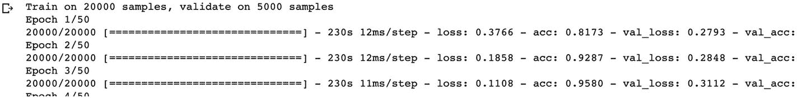

经过 50 个 epoch 的训练后，我们的训练准确率 (acc) 达到了 1.0，验证准确率 (val_acc) 达到了 0.8816。这意味着模型正确预测了 88% 的验证数据（它之前未见过的数据）。

##### 导出模型

训练完成后，我们的模型就可以使用了。我们将把它转换为 Core ML 格式，并使用清单 7-8 中的代码导出模型。

```python
import coremltools
coreml_model = coremltools.converters.keras.convert(model, input_names="input", output_names="output")
coreml_model.save('imdbGRU.mlmodel')
```

此代码将 mlmodel 保存到 Colab 环境中。点击左侧的文件夹图标查看并下载该文件。


### 测试 Core ML 模型

为了确保转换过程顺利，我们需要验证转换后的模型能否预测出与 Keras 模型相同的数值。由于 Core ML 模型仅在 macOS 上运行，我们无法在 Colab 环境中对其进行测试。使用 Core ML 模型进行预测有两种方式：通过 Xcode 运行，或者在 macOS 上使用 Python 环境和 `coremltools` 来运行。我将向你展示这两种方法。

首先，我们需要一个参考值来测试模型。为此，我将使用 Keras 模型来预测一段任意文本的情感倾向。然后我会将这个值与 Core ML 的预测结果进行比较，并期望它们保持一致。如果结果不一致，则表明模型没有正确转换。

让我们用一些任意文本数据进行尝试。首先，我们需要获取 IMDB 数据集中单词的整数表示。清单 7-9 中的代码会以 JSON 格式下载这些数据，并将其加载到一个字典中。

```
wordDictionary = imdb.get_word_index(
path='imdb_word_index.json'
)
清单 7-9
加载单词的整数表示
```

包含单词及其整数表示的字典如图 7-6 所示。

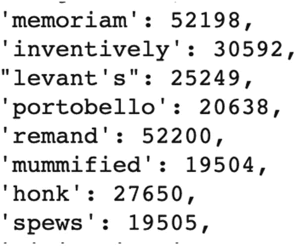

图 7-6

词嵌入

清单 7-10 中的代码用于预测这段任意文本“super cool”的情感倾向。我们从字典中找到其整数表示，然后用零填充至长度 300，因为我们的模型就是按照这种方式训练的。

```
paddedText = pad_sequences(
np.array([[wordDictionary["super"],wordDictionary["cool"]]]), maxlen=300,padding='post'
)
model.predict(paddedText)
清单 7-10
Keras 模型预测
```

运行上述代码会得到结果 `[[0.6204907]]`。接下来，让我们检查转换后的 Core ML 模型对于相同的文本输入是否也会产生相同的输出。

### 在 Jupyter Notebook 中测试 Core ML 模型

激活你在之前章节中创建的虚拟环境，并启动一个 Jupyter notebook。清单 7-11 中的代码使用了我的虚拟环境路径；请记得将其修改为你自己的路径。

```
cd environment/coremlenv/
source bin/activate
ipython notebook
清单 7-11
激活虚拟环境并运行 Jupyter Notebook
```

这将打开 Jupyter 仪表盘。在其中创建一个新的 Python 3 notebook。将清单 7-12 中的代码复制粘贴进去，以加载你之前转换好的 Core ML 模型。

```
import coremltools as ct
#### 加载模型
model = ct.models.MLModel('/Users/ozgur/Downloads/imdbGRU.mlmodel')
清单 7-12
加载 Core ML 模型
```

如果你想查看模型的规格说明，可以运行清单 7-13 中的代码。这会打印出模型的输入和输出类型。

```
#### 从模型中获取规格说明
spec = model.get_spec()
#### 打印模型的输入/输出描述
print(spec.description)
清单 7-13
打印模型规格说明
```

模型的输入和输出描述如图 7-7 所示。模型接受两个输入：`input` 和 `gru_2_h_in`，其形状分别为 1 和 128。它的输出是 `output` 和 `gr_2_h_out`，形状也分别为 1 和 128。

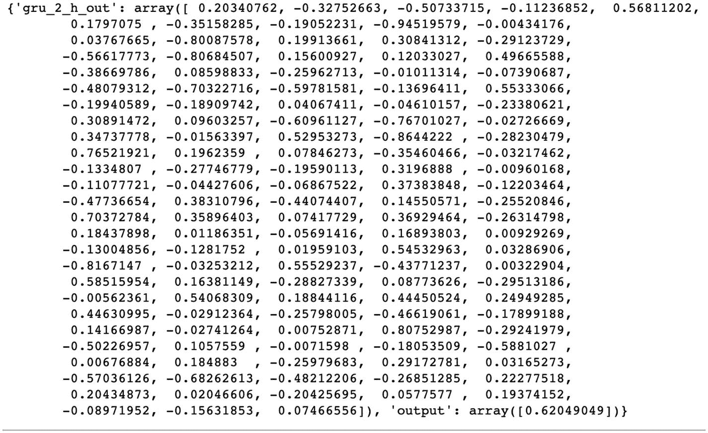

图 7-8

模型的输出

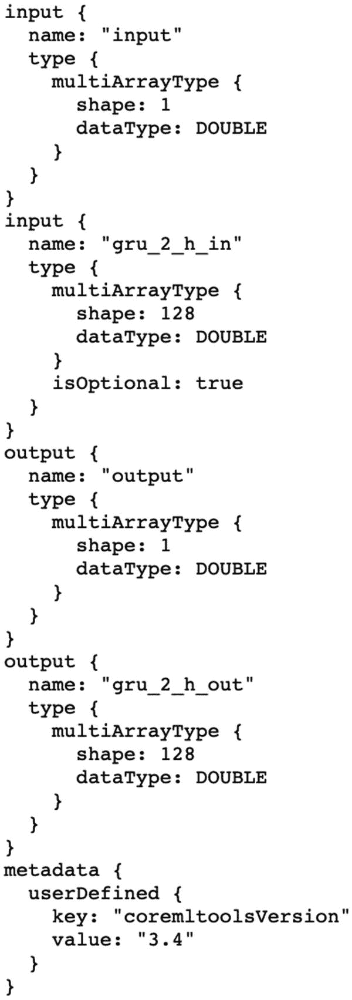

图 7-7

模型规格说明

通过检查这个规格说明，我们就能了解模型的预期行为、需要输入什么以及会输出什么。现在，我们可以使用 Core ML 模型进行预测了。

```
from keras.preprocessing.sequence import pad_sequences
import numpy as np
wordArray = np.array([[1162,643]])
paddedArray = pad_sequences(wordArray,maxlen=300,padding='post')
reshapedArray = paddedArray.reshape(300,1,1)
print(model.predict({'input':reshapedArray}))
清单 7-14
在 Core ML 模型上进行预测
```

如清单 7-14 所示，我们使用了 IMDB 数据集中单词“super”（1162）和“cool”（643）的整数表示。利用 `pad_sequences` 函数，我们添加零直到列表长度为 300。然后，我们将数组重塑为 (300,1,1) 维度。如果不重塑数组，而是使用形状为 (300) 的数组，则会抛出清单 7-15 中所示的错误，提示输入大小不符合预期。

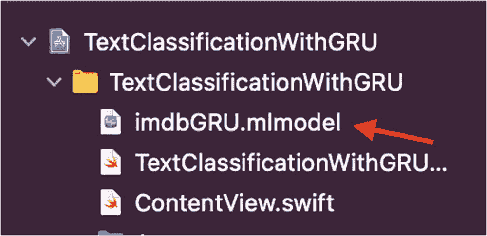

图 7-9

拖放模型

```
{
NSLocalizedDescription = "For input feature 'input', the provided shape (1 \U00d7 300) is not compatible with the model's feature description.";
NSUnderlyingError = "Error Domain=com.apple.CoreML Code=1 \"Neural Network (<=version 3) inputs can only be of size 1, 3, or 5.\" UserInfo={NSLocalizedDescription=Neural Network (<=version 3) inputs can only be of size 1, 3, or 5.}";
}
清单 7-15
输入大小错误
```

我们使用重塑后的数组进行预测，并打印输出结果，如图 7-8 所示。

注意最后一个名为 `output` 的元素及其数值。这个结果与我们使用 Keras 模型进行预测时得到的结果相同。因此，我们可以确认转换成功，并且转换后的模型运行正常。

你可以在此处找到该 Colab notebook 的完整代码：[`https://colab.research.google.com/drive/1p4ArC9yN-mXp1D4YXWZHuKbfXKnJvk7O?usp=sharing`](https://colab.research.google.com/drive/1p4ArC9yN-mXp1D4YXWZHuKbfXKnJvk7O?usp=sharing)。


### 在 Xcode 中测试 Core ML 模型

使用 App 模板创建一个新的 SwiftUI 项目。将 Core ML 模型拖放到项目中，如图 7-9 所示。通常，这类测试会使用单元测试包进行，但即使 `mlmodel` 的类在 Xcode 11 中可以正常使用，在 Xcode 12 的测试项目中却无法使用。因此，我将在 Xcode 12 中通过调试来进行测试。

创建一个名为 `GRUModel` 的类，并将代码清单 7-16 中的代码复制到该类中。

```
func testModel()
{
let model = try? imdbGRU(configuration:
MLModelConfiguration())
let maxLength = 300
guard let input_data = try?
MLMultiArray(shape:[NSNumber(value: maxLength),1,1],
dataType:.double) else {
fatalError("Unexpected runtime error:
input_data")
}
input_data[0] = NSNumber(value: 1162)
input_data[1] = NSNumber(value: 643)
//padding rest with 0s
for i in 2..<maxLength {
input_data[i] = NSNumber(value: 0.0)
}
let input = imdbGRUInput(input: input_data,
gru_2_h_in: nil)
//prediction
guard let prediction = try?
model?.prediction(input: input) else {
fatalError("Unexpected runtime error:
prediction")
}
print(prediction)
//~0.6204907
print(prediction.output[0])
}
代码清单 7-16 测试 Core ML 模型
```

在上述代码中，我们创建了一个模型实例，并将输入数据构建为形状为 `[300,1,1]` 的 `MLMultiArray`。Core ML 模型通常使用这种名为 `MLMultiArray` 的数组类型。我们用单词 "super" 和 "cool" 的整数表示填充该输入数组。数组的其余部分用零填充（即补零）。这个输入数组通过 `prediction` 函数输入到模型中。我们打印模型的预测结果，查看是否符合预期。

打开 `ContentView` 文件。我们将像代码清单 7-17 所示，在 `VStack` 的 `onAppear` 回调中调用此方法。当 `VStack` 出现在屏幕上时，该方法将被调用。

```
var body: some View {
VStack{
Text("")
}.onAppear{
GRUModel().testModel()
}
}
代码清单 7-17 调用模型测试函数
```

现在，通过选择 Xcode 菜单栏中的 Product ➤ Run，或使用快捷键 `cmd+R`，在模拟器上运行应用。我们的预期值是 0.6204907。调试时，应看到如图 7-10 所示的调试器输出。

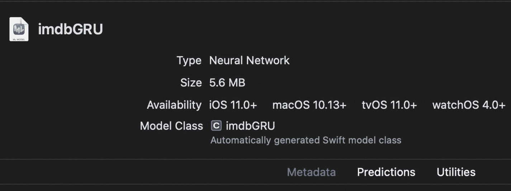

图 7-11 Xcode 中的 imdbGRU 模型

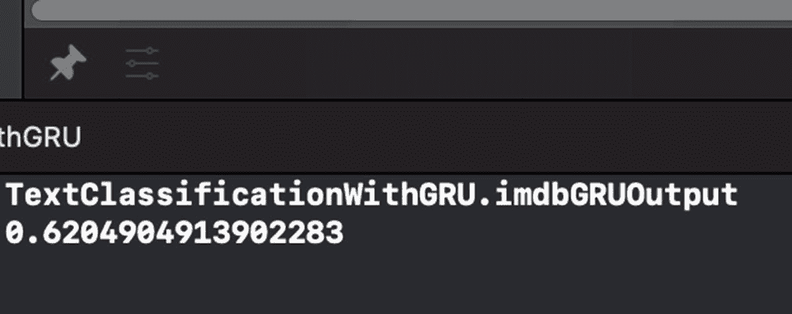

图 7-10 调试器输出

既然我们已经检查了模型并确认其工作正常，那么就可以在 Xcode 项目中使用我们的模型了。

## 在 Xcode 中使用 Core ML 模型

我们已经测试了 Core ML 模型，并确认其运行正确。通过在 Xcode 中选择该模型，可以查看其他详细信息。

如图 7-11 所示，我们看到 Xcode 自动生成了 `imdbGRU` 类，用于使用该模型。我们将使用这个类对模型进行预测。本章将逐步实现整个项目。我建议跟随示例并编写代码，你也可以在这里找到完成的项目：[`github.com/ozgurshn/Chapter7-TextClassificationWithGRUModel`](https://github.com/ozgurshn/Chapter7-TextClassificationWithGRUModel)。

创建一个名为 `GRUModel.swift` 的新文件。在此文件中，我们将对输入进行预处理，并使用 Core ML 模型进行预测。

我们将从 IMDB 数据集中加载单词列表到数组中。你可以从此链接下载 JSON 文件：[`storage.googleapis.com/tensorflow/tf-keras-datasets/imdb_word_index.json`](https://storage.googleapis.com/tensorflow/tf-keras-datasets/imdb_word_index.json)。将该 JSON 文件拖放到 Xcode 项目中，然后复制粘贴代码清单 7-18 中的代码。

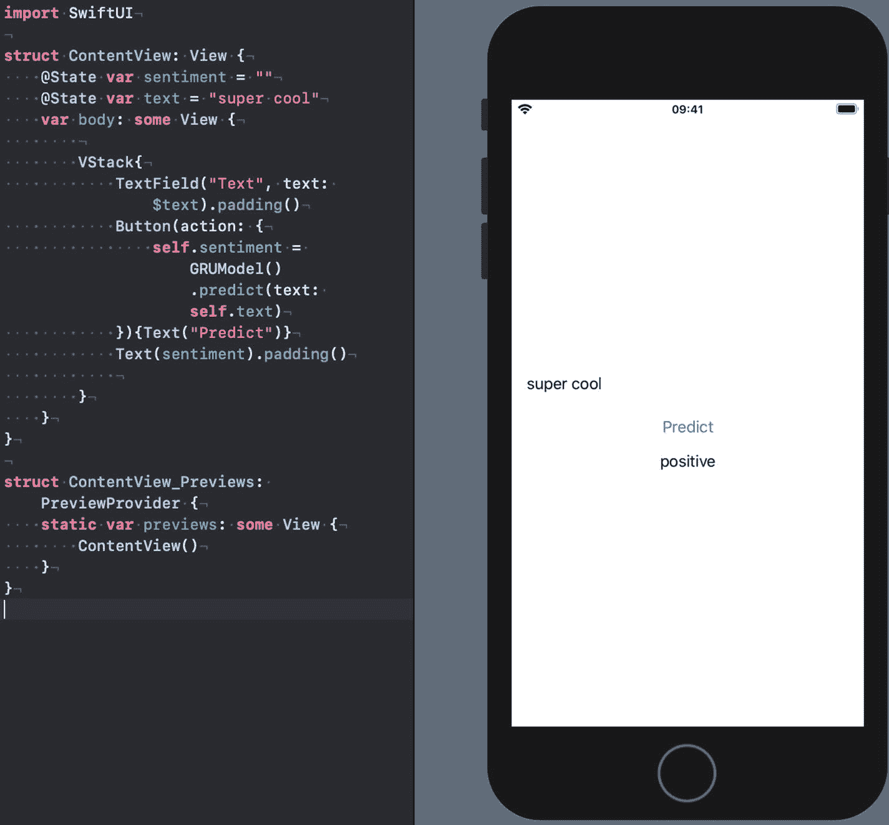

图 7-12 在实时预览中运行转换后的 Keras 模型

```
var wordDictionary: [String: Int] = {
return try!
JSONDecoder().decode(Dictionary.self,
from: Data(contentsOf:
Bundle.main.url(forResource:"imdb_word_index",
withExtension: "json")!))
}()
代码清单 7-18 加载单词列表
```

我们将创建的第一个函数是 `splitToWords` 函数，它从字符串中生成单词列表，如代码清单 7-19 所示。记得在此类中导入 `NaturalLanguage`。

```
private func splitToWords(text:String) -> [String]
{
let lowerCasedText = text.lowercased()
let tokenizer = NLTokenizer(unit: .word)
tokenizer.string = lowerCasedText
var tokens = [String]()
tokenizer.enumerateTokens(in:
lowerCasedText.startIndex..<lowerCasedText.endIndex)
{ range, _ in
tokens.append(String(lowerCasedText[range]))
return true
}
return tokens
}
代码清单 7-19 分词
```

在上述代码中，我们将文本转换为小写，因为我们的 IMDB 文本表示文件包含小写单词。然后，我们使用 Natural Language 框架中的 `NLTokenizer` 来枚举给定字符串中的单词。我们将这些单词添加到一个数组中并返回该数组。

下一步是创建预测函数。将代码清单 7-20 中的代码复制粘贴到 `GRUModel` 类中。

```
func predict(text:String)->String {
let words = splitToWords(text: text)
var embedding = [Int]()
for word in words {
embedding.append(wordDictionary[word] ?? 0)
}
let model = try? imdbGRU(configuration:
MLModelConfiguration())
let maxLength = 300
let maxLengthNumber = NSNumber(value:
maxLength)
guard let input_data = try?
MLMultiArray(shape:[maxLengthNumber,1,1],
dataType:.double) else {
fatalError("MLMultiArray error:
input_data")
}
for (index,element) in embedding.enumerated()
{
input_data[index] = NSNumber(value:
element)
}
//padding rest with 0s
for i in embedding.count..<maxLength {
input_data[i] = NSNumber(value: 0.0)
}
let input = imdbGRUInput(input: input_data,
gru_2_h_in: nil)
guard let prediction = try?
model?.prediction(input: input) else {
fatalError("Unexpected runtime error:
prediction")
}
//prediction.output[0] is an array of
//doubles of size 1
//prediction.output[0][0] is a double
//value representing the probability
if prediction.output[0][0].doubleValue > 0.5
{return "positive"}
else
{return "negative"}
}
代码清单 7-20 预测
```

代码的工作原理如下：

1. 从输入字符串创建单词列表，然后将这些单词转换为 `wordDictionary` 中的整数表示。
2. 创建模型实例。
3. 创建大小为 `[300,1,1]` 的 `MLMultiArray`。我们将其设置为 300，是因为模型训练时输入尺寸为 300。
4. 将输入数据用零填充至 300 个元素，以保证固定大小。
5. 创建模型输入。当您将模型拖放到 Xcode 中时，Xcode 会自动生成这个类。
6. 使用输入数据进行预测，并返回结果。如果结果高于 0.5，则判定为正面情绪；如果低于 0.5，则判定为负面情绪。


接下来，我们将设置应用程序的用户界面。打开`ContentView.swift`文件。复制粘贴清单 7-21 中的代码。

```swift
struct ContentView: View {
@State var sentiment = ""
@State var text = "super cool"
var body: some View {
VStack{
TextField("Text", text: $text)
Button(action: {
self.sentiment =
GRUModel().predict(text: self.text)
}){Text("Predict")}
Text(sentiment)
}
}
}
```

在上述代码中，我们创建了两个字符串状态来保存预测结果（`sentiment`）和输入文本。我们使用`@State`，因为我们希望这些变量中的变化能够反映在 UI 中。

在`ContentView`的`body`中，我们将元素放入`VStack`中以垂直组织它们。我们放置了一个文本字段用于接收用户输入，一个文本视图用于显示结果，以及一个按钮用于执行预测。当按钮被点击时，我们会在机器学习模型上执行预测。

在模拟器或实时预览模式下运行应用程序，如图 7-12 所示。

点击“Predict”按钮并检查结果。恭喜！你已经使用`Keras`训练了一个循环神经网络模型（`GRU`），将其转换为`Core ML`格式，并在`Xcode`项目中使用了它。

## 总结

在本章中，你学习了如何在没有本地`Python`环境或良好`GPU`来训练模型的情况下，使用免费的`Google Colab`服务在线训练深度学习模型。我们了解了如何使用`Keras`数据集，并利用`Keras`框架训练了一个自定义文本分类模型。通过利用`coremltools`库，我们将训练好的模型从`Keras`转换为`Core ML`格式，并将其集成到`Xcode`项目中。你学习了使用`Jupyter Notebook`或`Xcode`测试`Core ML`模型的不同方法。通过使用`SwiftUI`构建示例应用程序，我们能够轻松地向用户展示预测结果。

## 结论

恭喜！你已经完成了使用机器学习构建智能应用的旅程。你已经掌握了相关的技术知识，希望这些知识能帮助你在未来的所有移动端`NLP`项目中取得成功。

`NLP`领域在不断发展。我们希望本书能作为你使用`NLP`技术构建首个理解语言的智能应用程序的指南，并对你有所帮助。

## 索引

A
- 抽象文本摘要
- AlexNet
- 算法
- Apple 开发者网站
- Core ML 框架
  - ML 和 Xcode 创建
  - 自然语言
  - 语音识别
  - Turi 创建
  - 视觉
- VisionKit

B
- BERT
  - 架构
  - 分类层
  - Core ML 模型
  - 输入/输出
  - 元数据部分
  - Netron
  - 分词
  - Xcode
- 掩码语言模型
- 下一句预测
- 操作系统（iOS）
- BERTInput 类
- bestLogitsIndices 函数
- 模型实例
- 预测
- 项目文件
- 分词
- WordID 数组
- 词表
- 主要创新
- 问答模型
- SQuAD
- SwiftUI 应用程序
- 训练策略
- 用户界面（UI）
  - attributedText
  - question-answering App
  - 搜索按钮
  - 状态变量
  - SwiftUI App
  - TextView 创建
  - UI 元素

C
- Core ML 框架

D
- 深度学习（DL）
- DistilGPT-2 模型
- 文档模型
- BERT

E, F
- 误差函数
- 抽取式摘要

G, H
- 门控循环单元（GRU）
- 生成式预训练 Transformer（GPT）
  - 内置 OCR 模型
  - coremltools
  - DistilGPT-2 模型
  - 文本预测
  - 转换

I
- ImageNet 数据集
- 迭代/周期
- 数据

J
- Jupyter notebook
  - Core ML 模型输入尺寸
  - 错误
  - 模型规范
  - 输出预测
  - 打印模型规格
  - 虚拟环境

K, L
- Keras 模型
  - 分类模型
  - Colab 单元格
  - 编译方法
  - Core ML 格式
  - 分布图
  - IMDB 数据集
  - 库
  - 模型摘要
  - 填充序列
  - Sequential 类
  - 训练结果
  - 词频分布
  - 词表示
- Colab 深度学习库
- 测试 Core ML 模型
- Xcode 模型

M
- 机器学习（ML）
  - AI 模型
  - 类别
  - 前沿工具
  - DL
  - 历史
  - 正面/负面邮件预测
  - 智能应用
  - 监督学习
  - 训练模型
  - 无监督学习
- macOS playground
  - 准确率
  - 自动生成类代码
  - 检查训练指标
  - 分类器模型
  - Core ML 模型
  - CreateML/Foundation
  - 错误处理
  - 评估
  - MLModel 项目
  - MLTextClassifier 模型详情
  - 解析选项
  - Playground 设置
  - 预测
  - SpamClassifier 类
  - 垃圾短信分类器应用
  - 拆分数据
  - SwiftUI
  - 模板
  - 文本分类
  - 训练输出
  - URL 对象

N, O, P, Q
- 自然语言处理（NLP）
  - 优势
  - 框架模型
    - 枚举单词
    - 语言识别
    - NLEmbedding
    - 词性标注
    - 人物、地点/组织
    - 分词
    - 词标注
  - 语言建模
  - 数学计算
  - 基于神经网络的方法
  - N-grams
  - 目标
  - 预训练语言模型
  - 序列到序列（Seq2Seq）
  - 词嵌入
- 下一句预测（NSP）
- NLEmbedding
- NLTagger

R
- 循环神经网络（RNN）

S
- 垃圾邮件分类
  - Create ML
  - Create ML 应用
  - CSV/文本文件
  - 创建项目模板
  - 静态和动态嵌入
  - 文本文件
  - 训练数据面板
  - 训练状态/准确率
  - 实体
  - SMS 收集数据集
  - 文本分类
  - Turi 创建
  - 词袋表示
  - iPython
  - 含义
  - 设置文本分类器
  - 虚拟环境
- 语音框架
  - 语音识别/框架
  - 音频转录
  - ContentView 结构体
  - 描述
  - 权限请求
  - 处理应用
  - 说话按钮
  - 文本转语音函数
  - 转录权限
- 斯坦福问答数据集（SQuAD）
- 摘要技术
  - 抽象式
  - 按钮操作
  - ContentView 文件
  - 抽取式
  - 自然语言框架
  - 项目创建
  - 句子排序与评分
  - 拆分函数
  - 停用词声明
  - SwiftUI 预览
  - 测试
  - 文本编辑器
  - 词频
- 监督学习

T
- 测试 Core ML 模型
  - Colab 环境
  - 整数表示
  - Jupyter notebook
  - 预测
  - 词嵌入
  - Xcode
- 文本分类
  - macOS playground
  - 情感分析
  - 垃圾邮件
- 文本生成模型
  - AI 模型
  - Anna Karenina
  - 解码策略
  - 生成函数
  - GPT 文件
  - 处理点击手势
  - 元数据
  - 预测函数
  - 生成式预训练 Transformer
  - OCR 函数
  - captureOutput 函数
  - recognizeTextHandler 函数
  - 扫描资源
  - showString 方法
  - 起始项目
  - 文本识别请求
  - viewDidLoad 函数
  - 视图和 GPT 文件夹
  - VisionViewController 函数
- 文本转语音函数

U
- 无监督学习

V, W
- Vision 框架
  - 面部/身体检测
  - 水平线检测
  - 图像分析能力
  - 分类
  - 比较
  - ImageRequestHandler
  - knownClassifications 方法
  - 数学表示
  - 意义
  - ML 能力
  - 物体识别
  - 显著度分析
  - 文本检测与识别
- VisionKit

X, Y, Z
- Xcode 模型
  - ContentView 文件
  - 调试器输出
  - 拖放模型
  - imdbGRU 模型
  - MLMultiArray
  - 模型测试函数
  - 预测函数
  - 预览模式
  - 拆分单词
  - 测试词表加载
  - 工作流程
