# 释放 iPhone 相机的强大潜力

虽然相机本身并不能造就摄影师，但一台好相机无疑能将你的创意拍摄提升到全新维度，并拓展你应用不同技巧的能力——尤其是在与数码摄影相机相关的技术不断演进的今天。这一规律同样适用于手机摄影。iPhone 上出色的相机让你无需携带沉重的摄影装备，即可满足专业及个人用途的拍摄需求。Apple iPhone 的相机正是其超越竞争对手的亮点功能之一。

为了充分利用你的 iPhone 相机，关键是要了解相机的功能以及各种特色，这些特色能帮助你在默认及第三方摄影应用中拍出好照片。在这一章中，你将探索默认相机和`照片`应用的功能，然后在后续章节中继续学习不同的摄影技巧。

## 掌握你的 iPhone 相机

你的 iPhone 相机拥有隐藏功能，可以帮助你快速打开`相机`应用。你还可以通过应用网格系统来对齐画面，从而改善照片的构图。

### 轻松访问相机

iPhone 的优势之一在于能够随时随地快速拍照。你只需从口袋或包里掏出手机，打开`相机`应用，然后按下快门即可。然而，你需要知道如何快速访问`相机`应用，才能捕捉那些特殊时刻，比如孩子玩耍或你最喜欢的球队赢得比赛。iPhone 为你提供了三种快速打开`相机`应用的主要方法。

#### 滑动操作打开

第一种方法是滑动屏幕。这允许你在手机锁定的状态下打开`相机`应用，这被认为是访问相机最快的方式。请按照以下步骤操作：

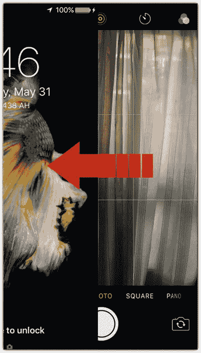

图 1-1

从屏幕右侧向左滑动，以打开`相机`应用

1. 如果 iPhone 处于休眠状态，按一次主屏幕按钮唤醒屏幕。
2. 在锁屏界面上，从屏幕右侧向左滑动，即可打开`相机`应用，如图 1-1 所示。

#### 使用手机控制中心

第二种方法可在手机锁定或解锁状态下使用；只需通过手机的`控制中心`即可。

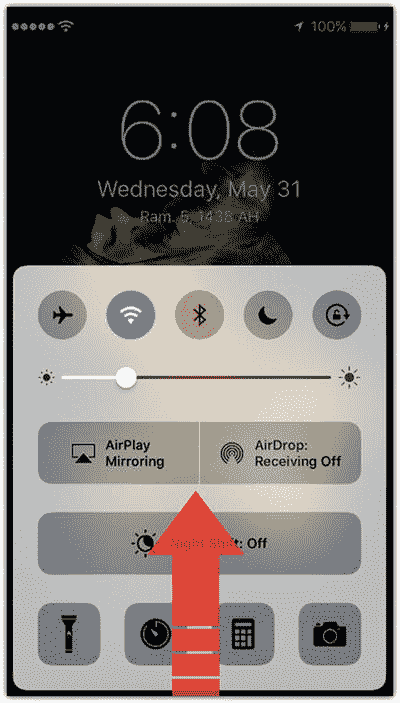

图 1-2

从屏幕底部向上滑动，以打开`控制中心`

1. 如果 iPhone 处于休眠状态，按一次主屏幕按钮唤醒屏幕。
2. 用手指从主屏幕按钮处向手机顶部滑动，如图 1-2 所示。
3. 在`控制中心`中轻点`相机`应用。

这两种方法在手机锁定时需要轻松访问相机时非常实用，而下一种方法则允许你在手机上使用其他应用时快速访问相机。

#### 将相机应用添加到程序坞

第三种方法是将`相机`应用添加到手机的程序坞。这有助于你轻松在移动设备上安装的其他应用中找到相机。你可以按如下方式将相机添加到程序坞：

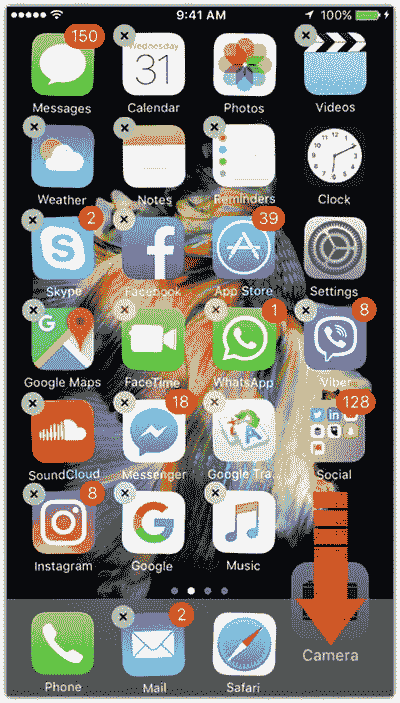

图 1-3

将`相机`应用拖到屏幕程序坞

1. 按两次手机的主屏幕按钮以进入主屏幕（如有需要，可使用指纹或密码）。
2. 轻轻长按`相机`应用图标；你会看到它开始抖动，表示其位置可调，如图 1-3 所示。
3. 将其拖到屏幕程序坞中，放在你最常用的应用（如`邮件`应用和`Safari`浏览器）旁边。如果程序坞已满，你可以通过移除其中使用频率最低的应用来添加它。

### 多种方式完成拍摄

iPhone 能根据不同的情况，通过三种不同的方法帮助你完成拍照。默认方法是轻点相机按钮一次以拍摄，如图 1-4 所示。

你也可以按上调或下调音量按钮来拍照，同样如图 1-4 所示。这个选项有助于你在拍照时稳定地握住手机。如果你的手机处于横屏模式，它的作用类似于数码相机上的快门按钮。最后，如果你使用的是有线耳机，你可以使用耳机上的音量按钮来拍照。这有助于你隐秘地拍摄照片。例如，你可以在不被注意的情况下捕捉孩子玩耍的自然瞬间，从而得到充满活力的照片。使用耳机按钮还可以帮助你在拍摄照片时避免手机抖动。

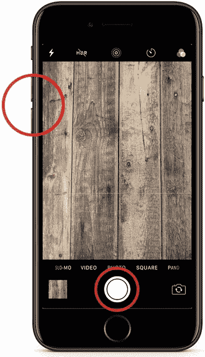

图 1-4

轻点相机按钮或按下音量按钮来拍照

### 启用网格参考线

你可能知道，照片的构图对于拍出精彩的照片起着至关重要的作用。`相机`应用提供了网格线，可以在你拍摄时提供引导，确保构图在视觉上令人赏心悦目。`网格`选项将屏幕分为三列三行。这可以帮助你将画面元素精确地放置在你想要的位置。请按照以下步骤启用`网格`功能：

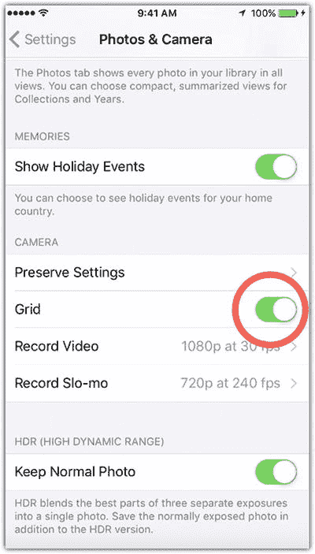

图 1-5

从`照片与相机`设置中激活`网格`设置

1. 轻点手机上的`设置`图标。
2. 向下滚动并轻点`照片与相机`。
3. 在`相机`部分激活`网格`功能，如图 1-5 所示。

### 使用连拍模式

对于体育赛事或孩子玩耍等快速移动的场景，你可能需要拍摄多张同一场景的照片，以便稍后选出最佳的一张。虽然反复轻点相机按钮太慢，但 iPhone 的连拍模式可以帮上忙。它允许你只需按住相机按钮，即可几乎瞬间拍摄多张照片。按住按钮的时间越长，连拍模式拍摄的照片就越多。

松开按钮后，照片会保存在`相机胶卷`中一个名为`连拍`的特殊文件夹里。要查看`连拍`文件夹中的照片，可以按照以下步骤操作：

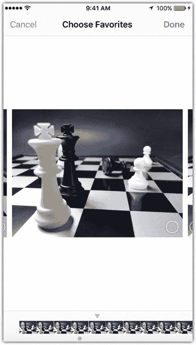

图 1-6

选择连拍照片组中的不同图像

1. 在`照片`应用中，轻点`连拍`文件夹以选中它。
2. 在中间底部的工具栏中轻点`选择`。
3. 浏览连拍照片组中的不同照片，如图 1-6 所示。

要选择文件夹中的一张照片，可以执行以下操作：

1. 选择该图像，然后轻点屏幕右上角的`完成`，如图 1-6 所示。
2. 要么轻点`保留全部`以保留文件夹并将选中的一张（或多张）图像另存为单独的照片，要么轻点`只保留一张收藏`以只保留选中的图像并删除其余部分。

选择其中任一选项后，选中的图像（或图像组）就会从`连拍`文件夹中分离出来，作为普通照片添加到你的相册中。

### 设置手动对焦与曝光

默认情况下，iPhone 相机会自动将焦点对准画面中最近的物体。但在某些情况下，例如当你想对焦于画面中远处的物体时，可能需要更改这一设置。iPhone 允许你通过点击想要对焦的物体来手动设置照片的对焦和曝光；相机将对焦于所选物体，如图 1-7 所示。

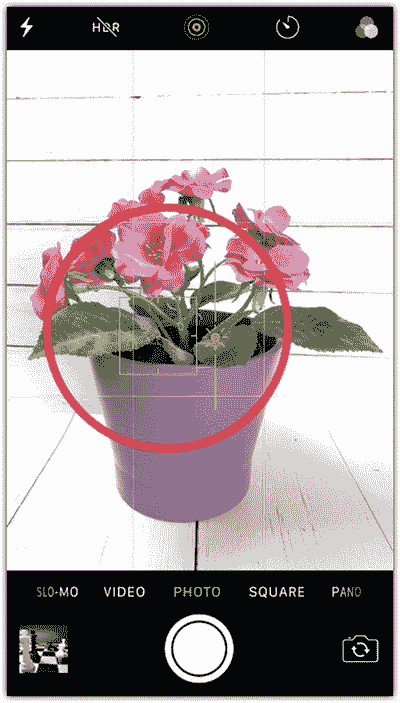

图 1-7

点击物体以手动设置对焦和曝光

将对焦设定到所选元素后，照片的曝光可能会根据图像中的光照条件而变化。如果你想修改曝光，点击并上下拖动以打开曝光滑块，从而可以增加或减少照片的曝光度。

### 锁定曝光与对焦

尽管 iPhone 允许你灵活地在拍摄中设置曝光和对焦，但它也有一个缺点，尤其是在拍摄场景中元素可能会移动时。或者，你可能想要拍摄同一场景的多张照片，而不希望在每次拍摄时都重新设置对焦。

要锁定对焦和曝光，请执行以下操作：

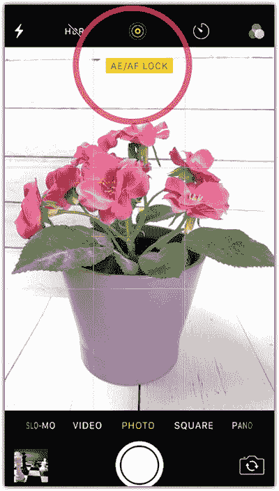

图 1-8

黄色标签表示曝光和对焦已锁定

1.  等待相机优化照片的曝光和画面。
2.  长按屏幕，直到屏幕顶部出现黄色的 `AE/AF Lock` 标签，如图 1-8 所示。
3.  点击屏幕并上下拖动以改变画面亮度。

请注意，如果您关闭“相机”应用并重新打开，则需要在新拍摄中重新设置锁定。

### 拍摄 HDR 照片

高动态范围（HDR）照片是使用不同曝光值拍摄的同一场景的多张照片的组合。将这些照片合并在一起，可以在照片中产生一种称为 HDR 照片效果的戏剧性效果。与普通图像不同，HDR 照片包含更多对比鲜明的颜色以及明暗和光影变化。

您只需点击屏幕顶部的 `HDR` 图标即可激活 HDR 照片效果，如图 1-9 所示。请注意，使用此技术拍摄移动主体可能会导致图像失真，因为该功能允许您拍摄三张不同曝光的图像并将它们合并在一起。因此，最好将此效果用于静态主体。

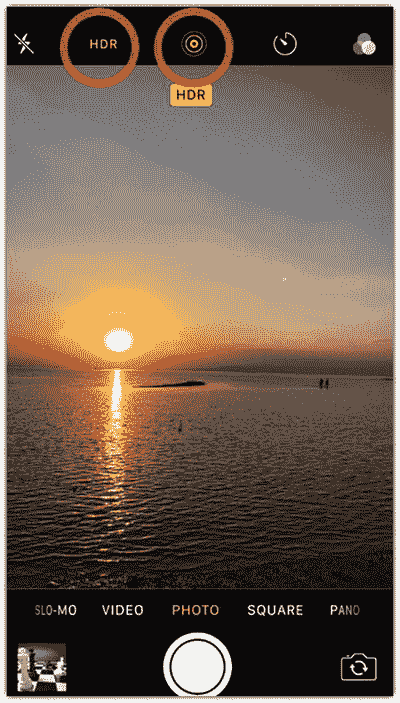

图 1-9

点击屏幕顶部的 `HDR` 图标

在拍摄 `HDR` 照片时，您可能希望保留普通照片以供后续处理。为此，您需要更改 `HDR` 设置。

1.  选择 `设置` ➤ `照片与相机`。
2.  在 `HDR` 部分，打开 `保留正常曝光的照片` 选项。

#### 拍摄实况照片

从 iPhone 6s/6s Plus 开始，iPhone 相机新增了一项功能——实况照片。在拍照时，实况照片功能会录制与图像关联的一小段视频。当您长按图像时，图像会开始动起来，显示拍摄时画面中物体的运动情况。实况照片还支持音频，就像一张图片附带了一段小视频。

要激活实况照片功能，请在拍摄前点击相机屏幕顶部的实况照片图标。当您按下快门按钮时，iPhone 会记录拍摄前后各 1.5 秒的画面，从而生成一段总共 3 秒的带音频视频。

要播放视频，您需要打开照片，然后长按以启动视频。此类照片在桌面端查看器（例如 Apple 电脑上的“照片”应用）中得到支持。

### 快速访问不同的照片类型

iPhone 相机允许您拍摄多种类型的照片，包括常规、正方形、全景、视频、慢动作和延时摄影。在这些模式之间切换的默认方法是打开“相机”应用，然后在任一快门按钮上方滑动以选择您要拍摄的照片或视频类型。访问这些类型的最快方式是通过 3D Touch（适用于 iPhone 6s、6s Plus 及更新机型）。用力长按手机上的“相机”应用图标；快捷操作菜单出现，您可以选择要拍摄的照片类型，如图 1-10 所示。

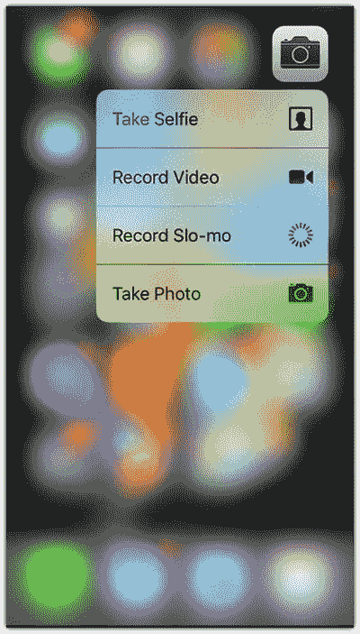

图 1-10

用力长按“相机”应用以打开快捷操作菜单

## 充分利用“照片”应用

在 iPhone 和 Mac 电脑上用于管理照片的默认应用程序是“照片”应用。它可以帮助您保存、导入和管理使用 iPhone 拍摄的照片。它还允许您将照片整理到相簿中、分享照片，并将其保存到 Apple iCloud、Dropbox 等云服务中。

虽然许多 iPhone 摄影应用程序允许您将照片存储在应用程序本身中，但将照片保存在“照片”应用中可以让您轻松地在不同应用之间切换以应用不同的照片效果。因此，学习如何有效使用“照片”应用非常重要。

### 使用“时刻”和“年度”视图

默认情况下，当您打开“照片”应用时，它会显示最近的照片，但您也可以使用“年度”视图根据拍摄时间线来查看照片。

当您处于“时刻”视图（默认视图）时，请点击屏幕左上角的“年度”，如图 1-11 所示。这将以月份和拍摄地点为基础显示照片。您可以点按月份以缩放回“时刻”视图。当“年度”视图激活时，点击“年份”视图可以根据拍摄年份显示照片。然后，您可以点击每一年以进入“年度”视图。

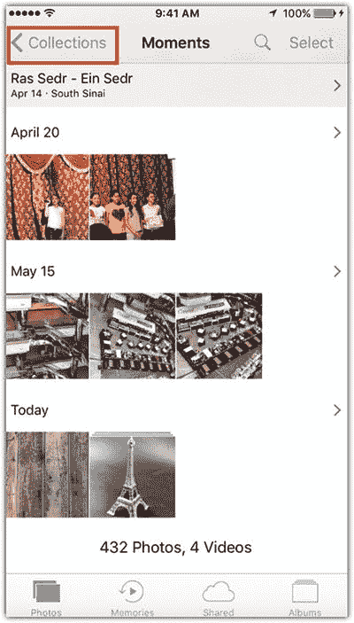

图 1-11

点击“年度”以根据时间线查看照片

### 在移动设备上查找照片

当您的手机里存满了照片时，您需要一种方法来查找特定照片，而不是在它们之间滚动浏览。“照片”应用中的搜索功能提供了一种智能方式，可以使用不同的关键词来搜索照片，包括以下内容：

- 照片的拍摄时间，例如年份或月份。
- 照片的拍摄地点。可以是城市、国家或特定地点。
- 照片中可被命名的元素，例如狗、汽车、海滩等。
- 照片中人物的姓名，基于保存在“人物”文件夹中的人物，您将在下一条技巧中看到。

### 保存人物面部信息

默认情况下，当你拍照并将其保存在`照片`应用中时，该应用会尝试识别照片中的人物，并将面部信息保存到`人物`文件夹中。要利用`照片`应用的人脸识别功能，你需要按以下步骤为`人物`文件夹中的每个已识别人物指定姓名：

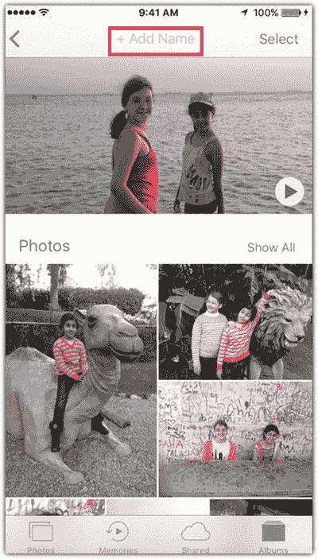

图 1-12  
在姓名字段中添加人物姓名

1.  打开`照片`应用的`相簿`文件夹中的`人物`文件夹。
2.  选择一个已识别的人脸并轻点它；该人脸将连同包含它的照片一起显示。
3.  在屏幕顶部的姓名字段中，添加此人的姓名，如图 1-12 所示。此时会显示一个联系人列表中的姓名下拉菜单。从列表中选择一个姓名。

如果某个人的照片显示了多次，这意味着应用未能识别出这些照片实际上是同一个人。因此，你可以对同一个人的第二张人脸照片应用相同的步骤，并输入相同的姓名。应用会询问你是否合并两组数据，以统一选定人物的所有图像。

完成这些步骤后，使用之前提到的搜索功能搜索该人物的姓名；你会发现该人物的所有照片都显示在搜索结果中。

### 将照片添加到个人收藏并创建相簿

有时，你会对同一场景拍摄多张照片，并希望“收藏”其中一张，以便日后筛选或在照片编辑中使用。你可以通过以下步骤将照片添加到`个人收藏`文件夹：

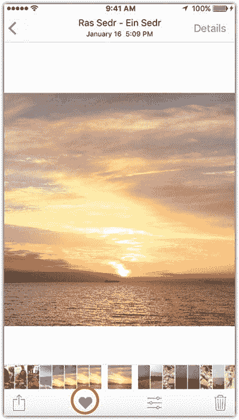

图 1-13  
轻点`收藏`图标可将图像保存为个人收藏

1.  轻点照片将其打开。请注意，你无需将其全屏打开。
2.  轻点底部工具栏中的`收藏`图标，如图 1-13 所示。

你也可以通过将照片添加到新相簿来整理照片；你可以按照以下步骤创建新相簿：

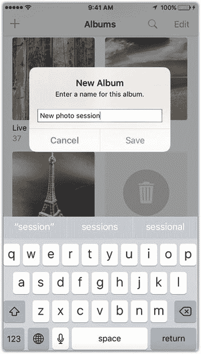

图 1-14  
在姓名字段中输入新相簿的名称

1.  轻点屏幕右下角的`相簿`图标。
2.  轻点屏幕右上角的加号图标。
3.  添加新相簿名称并轻点`存储`，如图 1-14 所示。

要将照片添加到某个相簿或刚刚创建的相簿，你可以执行以下操作：

1.  进入`相机胶卷`或任何文件夹。
2.  轻点屏幕右上角的`选择`图标。
3.  选择一张或多张照片。
4.  轻点屏幕底部的`添加到`。

选择你想要添加照片的相簿，或轻点`新建相簿`来创建新相簿并将照片添加进去，如图 1-15 所示。

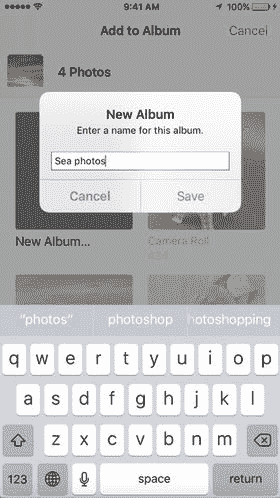

图 1-15  
你可以将选定的照片添加到现有相簿，或创建新相簿

## 本章小结

你的 iPhone 具备先进的摄影功能，可帮助你拍摄专业级照片。`相机`和`照片`应用都包含一些实用功能，可以提升你的 iPhone 摄影技巧。`相机`应用包含隐藏功能，即使不轻点快门按钮也能快速拍照。此外，它还允许你创建不同的效果，例如`实况照片`视频和`HDR`照片。更进一步，它为你提供了自动或手动调整照片曝光和对焦的选项。`照片`应用扩展了你将照片整理到相簿和个人收藏的能力，并且你可以使用搜索功能根据照片中的人物、物体和日期来查找照片。下一步是在进入后续章节更高级的选项之前，开始练习这些基本功能。

## 实践练习

在这个实践练习中，探索你 iPhone 上的不同功能。拍摄一些你最喜欢地点的照片，整理这些照片，并将它们添加到`照片`应用中的某个相簿里。在本书的 Facebook 小组中分享，并对他人的照片进行评论。

