# 2. 照片润饰技巧

在上一章中，你学会了如何高效使用 iPhone 上的`照片`应用和`相机`应用来拍照并将它们整理到相簿中。在许多情况下，使用 iPhone 拍照是即兴的：你注意到一个有趣的场景或动作，于是拿起手机就拍了下来。不幸的是，使用移动设备拍照的这种即兴性质，增加了出现与色彩、光线和构图相关问题的可能性。这些问题可能会令人沮丧，但你可以使用默认的`照片`应用或从`Apple App Store`下载的（免费或付费）各种应用来解决它们。本章的技巧将带你了解对图像进行此类基本修改的步骤。

## 修复照片的色彩

使用工具：`照片`应用、`Adobe Lightroom` 应用

拍照时一个常见问题是光照不足，这会导致糟糕的色彩状况。用手机拍照时，这个问题不容易克服，因为你需要携带外部光源和工具来解决。因此，当你使用手机拍照时，可能需要对色彩进行调整。你可以通过更改照片的属性，如色相、饱和度、对比度、色温等来实现。

许多照片编辑应用可以帮助你修改照片的色彩设置。在这里，你将探索如何使用移动设备上的`照片`应用以及可以从`App Store`免费下载的`Adobe Lightroom`应用来修改图像色彩。

### 使用照片应用修改色彩

随着 iPhone iOS 系统的近期更新，`照片`应用提供了基本的照片修改工具，可以帮助你修改照片，而无需安装任何第三方应用。这些工具效果不错，而且你不必在手机里塞满许多应用，特别是如果你的手机存储容量有限。要使用`照片`应用编辑照片的色彩，请按照以下步骤操作：

1.  打开`照片`应用并轻点你想要编辑的照片，使其全尺寸显示。
2.  轻点屏幕底部的调整图标（在旧版本中为`编辑`）。这将使你进入照片编辑模式，如图 2-1 所示。

    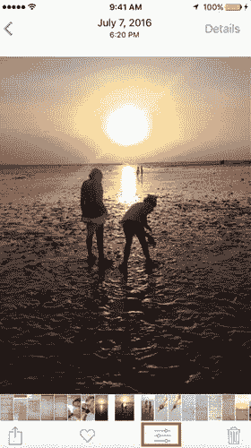

    图 2-1  
    在`照片`应用中进入照片编辑模式
3.  轻点编辑图标，如图 2-2 所示，以访问`光效`、`颜色`和`黑白`的编辑选项。`光效`选项允许你修改图像中的光线，`颜色`让你修改色彩属性，`黑白`则允许你将照片转换为黑白。

    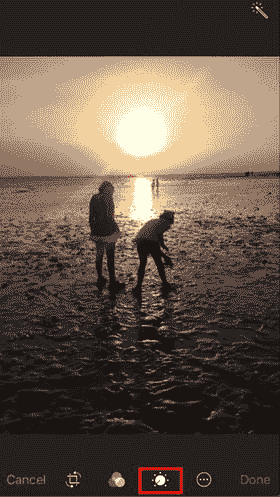

    图 2-2  
    编辑图标允许你访问`光效`、`颜色`和`黑白`设置
4.  轻点`颜色`条目以将其展开。
5.  向左拖动`饱和度`滑块（将饱和度红线向右移动）以增加色彩的饱和度。
6.  轻点滑块右上角的图标，然后在`颜色`部分选择`对比度`，如图 2-3 所示。
7.  向左拖动`对比度`滑块（将对比度红线向右移动）以增加色彩的对比度。

    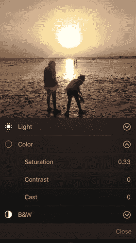

    图 2-3  
    `颜色`调整选项

### 移除偏色

有时在特定光线条件下拍照，例如阴天、荧光灯或暖光环境中，照片的颜色会受到周围光线的影响，从而产生偏色效果。这种效果可能会破坏图像中的自然色彩。在其他情况下，你可能希望添加偏色来为图像创造特殊效果，例如为图像增添更温暖的效果。要移除或添加偏色，请按照以下步骤操作：

1.  轻点编辑图标，然后选择`颜色`部分。
2.  轻点颜色滑块右上角的图标。
3.  在`颜色`部分中轻点`色偏`，如图 2-4 所示。

   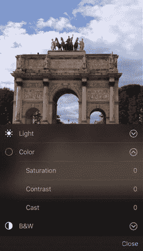

   **图 2-4**  
   `颜色`调整下的`色偏`选项
4.  向左拖动滑块可营造更暖的效果，向右拖动则营造更冷的效果，如图 2-5 所示。

   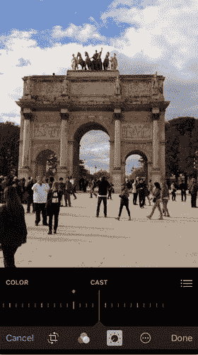

   **图 2-5**  
   将滑块向右或向左拖动以控制照片中的偏色效果

### 使用 Adobe Lightroom 进行颜色调整

Adobe Lightroom 是用于照片管理和编辑的最强大的应用程序。它为你提供了修改照片及其细节的高级功能。专业摄影师和照片编辑人员经常使用它。该应用程序的“精简版”可从苹果 App Store 下载到你的 iPhone 上。要使用该应用程序，你需要创建一个免费的 Adobe ID。免费版本允许你从移动设备上拍摄、整理和分享照片。如果你拥有 Adobe Creative Cloud 会员资格，则可以访问该应用程序的扩展功能；你可以保存源格式并在移动端和桌面端应用程序之间进行集成。如果你注册的是免费 Adobe 帐户，则只能使用 Lightroom 移动应用中的基本主要调整功能。

在本技巧中，你将使用 Lightroom 移动应用来编辑照片的颜色。你可以使用类似的步骤在“照片”应用中调整光线。

1.  从苹果 App Store 安装 Adobe Lightroom，安装后打开应用。
2.  从现有的 Lightroom 图库中选择一张照片，或轻点`相机胶卷`按钮以打开手机现有相册中的图像。你也可以轻点屏幕右下角的相机图标，使用手机相机拍照并将其添加到 Lightroom 图库中。照片会显示在屏幕上，如图 2-6 所示。

   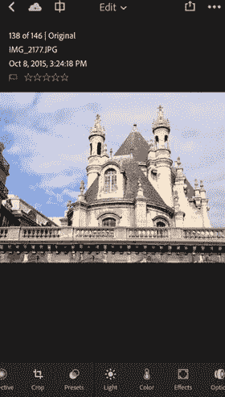

   **图 2-6**  
   轻点照片以在其中打开
3.  轻点屏幕底部的`颜色`图标以打开`颜色`调整选项。
4.  使用`白平衡`下拉列表可根据周围颜色更改照片中的色调，如图 2-7 所示。你可以从现有选项中选择，也可以使用`色温`和`色调`值选择自定义白平衡。

   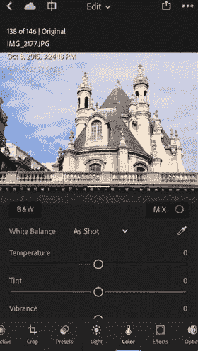

   **图 2-7**  
   在`颜色`设置中调整白平衡
5.  使用`自然饱和度`和`饱和度`滑块来影响照片中的色彩强度和鲜艳度。增加`自然饱和度`值可产生更鲜艳的色彩。`饱和度`用于设置照片中的颜色量；例如，将`饱和度`降低至`-100`会吸收照片中的所有光线，从而产生黑白照片效果，如图 2-8 所示。

   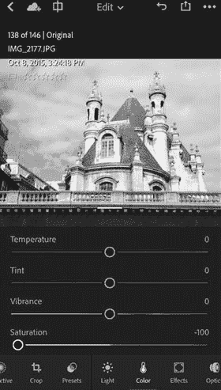

   **图 2-8**  
   将`饱和度`降低至`-100`以产生黑白效果

你也可以通过轻点颜色调整面板左上角的`黑白`按钮，直接将照片转换为黑白。此选项允许你在将照片转换为黑白后，仅修改照片的色温和色调。

### 执行高级颜色修改

Adobe Lightroom 中的颜色调整面板提供了更多高级功能来修改图像的颜色。你可以根据照片中的特定区域更改颜色，或通过选择要修改的颜色范围，同时不影响照片中的其他颜色。

要根据照片中的特定点修改图像颜色，请按照以下步骤操作：

1.  在 Adobe Lightroom 应用中，轻点屏幕底部的`颜色`图标。
2.  轻点面板中颜色调整值右上角的吸管图标。照片上会出现放大镜，如图 2-9 所示。

   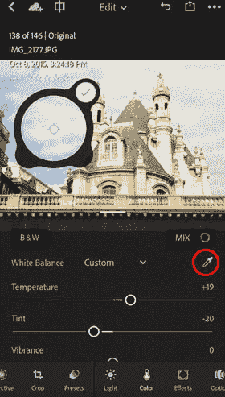

   **图 2-9**  
   出现放大镜，以便你选择要调整的颜色
3.  将放大镜拖动到你想要更改色调的区域。你会注意到，照片中的颜色会基于此样本发生变化。
4.  你可以使用面板中的滑块修改颜色，并自定义你的色调。

在此示例中，你将基于一个特定区域修改图像颜色，该区域可能包含多种颜色。此外，你还可以基于特定的选定颜色或多种颜色来修改图像，可以按如下方式单独选择和修改：

1.  在颜色调整面板中，轻点面板右上角的`混合`图标。
2.  照片中包含的颜色将以色样形式出现在面板顶部。在此颜色范围内，选择你想要修改的颜色；你可以更改其属性，例如`色相`、`饱和度`和`明度`，如图 2-10 所示。

   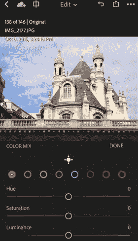

   **图 2-10**  
   `混合`图标允许你编辑照片中的特定颜色
3.  你也可以轻点取色器图标。
4.  在面板底部，选择你想更改的数值：`色相`、`饱和度`或`明度`。
5.  轻点图像中的颜色进行修改，并拖动以更改其属性。请注意，所选颜色将出现在面板的颜色列表中，以显示哪个颜色已被更改，如图 2-11 所示。

   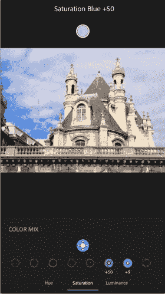

   **图 2-11**  
   调整照片中特定颜色的饱和度

## 裁剪与调整照片尺寸

使用工具：`照片`应用

有时你拍了一张照片，想通过裁剪来聚焦于画面中的主要元素，或去除不需要的部分。你可能还需要旋转或翻转照片。新的 iOS 系统提供了使用`照片`应用裁剪图像的简便方法。请按以下步骤操作：

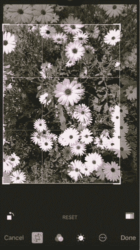

图 2-12 – 使用裁剪图标裁剪图像

1. 在`照片`应用中，以全屏视图打开你要裁剪的照片。
2. 点击底部栏的`编辑`图标，启用编辑模式。
3. 点击左侧的`裁剪`图标。
4. 拖拽矩形边缘，调整图像周围的矩形框大小。
5. 点击`完成`以应用更改并完成裁剪，如图 2-12 所示。

如果你希望将图像裁剪为标准文档比例，可以在裁剪前点击右下角的比例图标进行选择。

你还可以旋转并裁剪图像。为此，请拖拽角度区域，将图像旋转至特定角度；图像将被裁剪并旋转至所需角度，如图 2-13 所示。

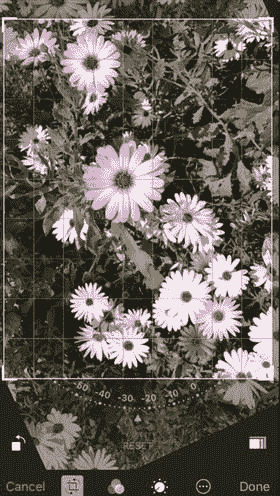

图 2-13 – 使用裁剪图标旋转图像

如果你想将图像翻转至四个方向中的任意一个，可以点击屏幕左下角的翻转图标。

## 移除背景

使用工具：`Photoshop Mix`应用

为了合成多张照片，你可能需要移除图像的背景，使其变为透明，以便将其添加到另一张图像中。有许多应用可以移除背景，例如 `TouchRetouch`、`Eraser` 和 `Photoshop Mix`。如果你熟悉桌面版 Adobe Photoshop，你会发现`Photoshop Mix`应用的大部分功能都很熟悉。在本节中，你将探索如何从一张照片中移除背景，并将其放置到另一个背景前。

1. 打开 Adobe `Photoshop Mix`。
2. 使用你的 Adobe ID（免费或付费订阅）登录。点击屏幕右上角的加号图标，如图 2-14 所示。

   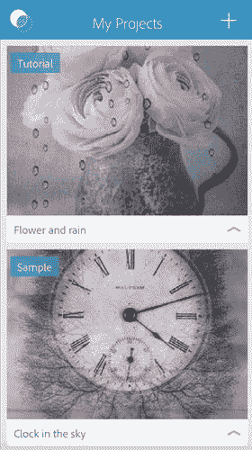

   图 2-14 – Adobe Photoshop Mix 项目

3. 点击`图像`，从相机胶卷中打开一张图片，如图 2-15 所示。然后点击`在我的 iPhone 上选择`。

   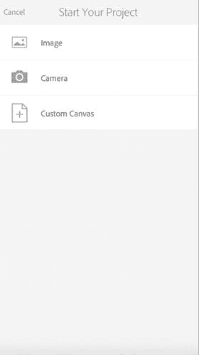

   图 2-15 – 向 Photoshop Mix 项目中添加图像

4. 在底部栏中，点击`抠图`以打开选择工具，如图 2-16 所示。

   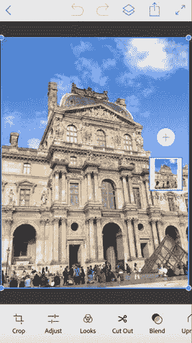

   图 2-16 – 从应用栏中点击`抠图`图标

5. 点击底部的`智能`工具。
6. 点击左侧的设置图标。将其设置为`减去`，如图 2-17 所示。

   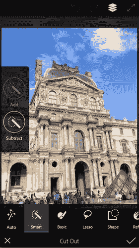

   图 2-17 – 将`智能`工具设置为`减去`

7. 在天空或你想要移除的背景上拖拽，如图 2-18 所示。
8. 放大并在小区域上拖拽以将其移除。
9. 点击右下角的`校正`图标以应用更改。

   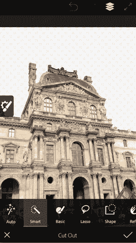

   图 2-18 – 移除背景后的图像

移除背景后，你将给原始图像添加一个新背景，操作如下：

1. 点击`图层`图标以在屏幕右侧显示图层。
2. 点击加号图标添加一个新图层，并选择添加一个新的图像图层，如图 2-19 所示。

   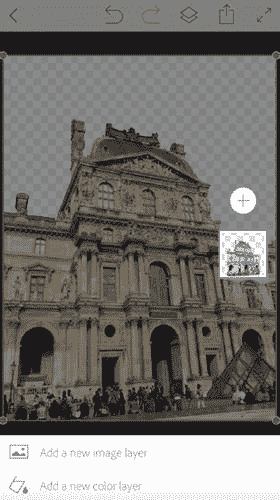

   图 2-19 – 将图像添加为新图层

3. 从相机胶卷中选择新的背景图像。
4. 长按顶部的背景图层，并将其拖到基础图层下方，如图 2-20 所示。

   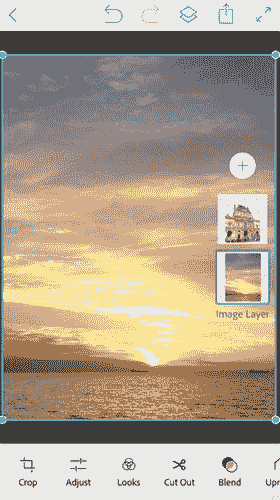

   图 2-20 – 调整项目中的图层顺序

5. 使用图像周围的矩形框调整其大小，以使其适应背景，如图 2-21 所示。

   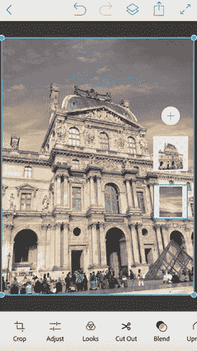

   图 2-21 – 调整背景图像大小，使其放置在顶层图像之后

有时由于两张图像间的投影，会出现颜色差异。因此，下一步是调整顶层图像的颜色以匹配背景图像的颜色。

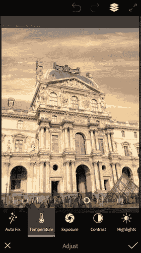

图 2-22 – 使用`色温`图标调整照片的色温

1. 从右侧的`图层`面板中选择顶层图层。
2. 点击左下角的`调整`图标。
3. 点击`色温`以打开滑块。
4. 向右拖拽滑块，为图像增加暖色调，如图 2-22 所示。

## 精通选区

工具：`Photoshop Mix`

Adobe `Photoshop Mix` 提供了多种工具，帮助你在 iPhone 上选择对象。这些工具试图模仿桌面版 Adobe Photoshop 应用中的选择方法，如图 2-23 所示。

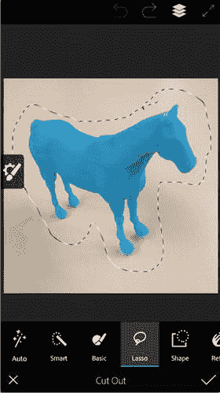

图 2-23 – 使用套索选择工具

当你选择一张图像进行编辑时，可以点击屏幕底部的`抠图`图标，并选择以下任一工具：

- 点击`自动`图标，自动检测背景并将其移除。请注意，此功能要求背景与图像中的元素之间具有高对比度。
- 点击`智能`图标，在你想选择的元素上拖拽。该工具可帮助你在拖拽想要选择的区域时进行智能选择。它利用颜色相似性作为选择与移除部分的指南。
- `基础`图标让你通过拖拽来选择图像中的区域。与`智能`选择不同，该图标让你手动定义需要移除的区域。
- `套索`工具让你在照片中创建特定区域的选区，你可以用手指或触控笔在想要选择的区域周围绘制。
- `形状`选择功能让你根据矩形、圆形、三角形或正方形等形状进行选择。
- 使用`优化`图标来调整所选区域的平滑度及其与背景的融合程度。你也可以点击`重置`图标以恢复到原始版本。

## 从照片中移除元素

工具：Photoshop Fix

Adobe Photoshop Mix 可让你处理图像，但 Photoshop Fix 包含的工具能帮你修复照片中可能出现的问题。在本节中，你将探索如何使用 Photoshop Fix 从图像中移除不需要的部分。请按照以下步骤操作：

1. 打开 Photoshop Fix 应用，并使用你的 Adobe ID 登录。
2. 点击右上角的加号图标。
3. 选择获取照片的来源，并选择该照片，如图 2-24 所示。

   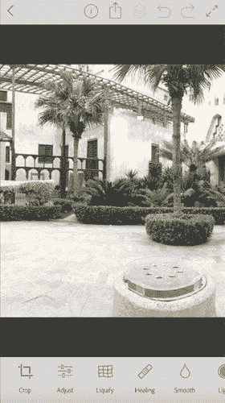

   图 2-24
   在 Photoshop Fix 中向项目添加照片
4. 点击屏幕底部的“修复”图标。
5. 从底部工具栏点击“污点修复”图标。
6. 在你想要移除的区域上进行涂抹。你也可以使用其他工具，如“修补”和“仿制图章”工具，如图 2-25 所示。

   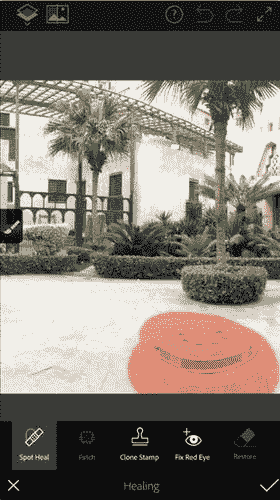

   图 2-25
   涂抹需要移除的元素
7. 点击“校正”图标以确认更改。最终结果应如图 2-26 所示。

   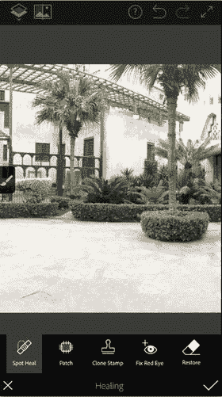

   图 2-26
   移除元素后照片的最终效果

## 摘要

有许多应用可以帮助你在 iPhone 上编辑和修改照片。这些应用的功能各不相同。Adobe 应用的移动版本提供了大量应用，可让你在类似于桌面应用的环境中进行照片编辑。你可以使用 Adobe Lightroom 调整照片的颜色和光线，以获得专业效果。你可以使用 Photoshop Mix 合并不同的照片，并选择照片中的特定部分。要修复照片，例如移除图像中不需要的部分，你可以使用 Photoshop Fix。

## 练习

在本练习中，用你的 iPhone 拍摄一张照片，并使用 Photoshop Fix 从照片中移除一个物体。保存照片，然后使用 Photoshop Mix 将其与另一张照片融合，最后调整最终合成的颜色。

