# 3. 处理摄影项目

最新的数码单反相机让你比以往更轻松地实现不同的摄影技巧。你可以直接在单反相机中应用诸如浅景深和多重曝光等效果，而无需使用 Photoshop 或 Lightroom 等电脑应用。虽然 iPhone 相机没有提供与单反相机相同的工具，但好消息是，有大量应用可以帮助你实现类似的效果。

在本章中，你将了解一些你可能在专业数码相机上使用过的摄影技巧。你将尝试使用不同的 iPhone 应用来创建类似的效果。请记住先通读步骤，然后用自己的照片进行尝试。

## 创建高级 HDR 照片

工具：Snapseed

图 3-1 显示了我用于此示例的原始照片。你可以使用自己的照片按照相同步骤操作。

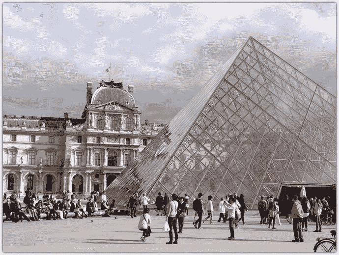

图 3-1
原始照片（© Rafiq Elmansy）

图 3-2 显示了我的最终结果。

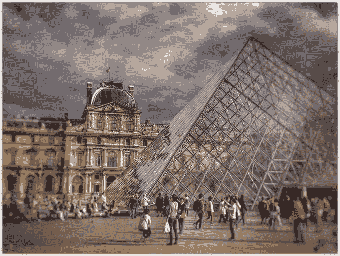

图 3-2
最终结果

高动态范围（HDR）效果通过呈现比传统图像更广的亮度级别范围，来增加照片中亮部与阴影之间的对比度。这使你能够创作出具有戏剧性效果的照片。正如你之前在本书中学到的，你可以在拍照时直接从“相机”应用创建 HDR 照片。然而，iPhone 的这项功能仍较为基础，无法让你完全控制效果。例如，你无法控制所应用 HDR 效果的强度或风格。

HDR 照片通常通过合并多张不同曝光级别的照片来产生，以在场景中呈现更广的亮度范围。同时，要获得良好的 HDR 效果，照片需要包含色彩丰富且具有高对比度亮部与阴影的元素。几年前我参观巴黎卢浮宫时拍摄了本技巧中的这张照片；我想让它的色彩更具深度和戏剧性。因此，我使用了 Snapseed 应用中的 HDR 功能。

### 步骤 1：准备照片

在应用 HDR 效果之前，你需要确保照片的色彩足够鲜艳、对比度足够高，以获得更好的最终效果。要增加照片的亮度、对比度和饱和度，请按以下步骤操作：

1. 打开 Snapseed 应用。点击 `Open` 并在你的 iPhone 上打开一张图像。
2. 点击右下角的 `Tools` 按钮，选择 `Tune Image`。点击 `Adjustment` 图标，选择 `Brightness`。将顶部的滑块拖至 +20 以增加照片的亮度（见图 3-3）。

   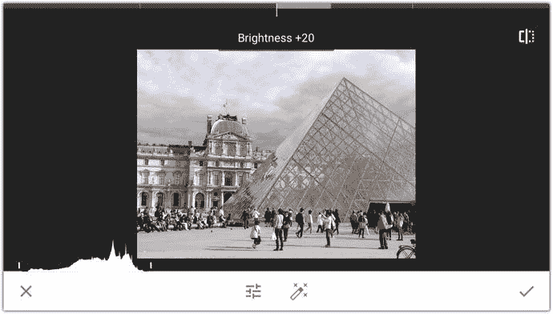

   图 3-3
   在 Snapseed 应用中增加照片亮度
3. 点击 `Adjustment` 图标，选择 `Contrast`，并将值设为 +50。
4. 点击 `Adjustment` 图标，选择 `Saturation`，并将其增加到 +30。将 `Ambiance` 设为 +30（见图 3-4）。

   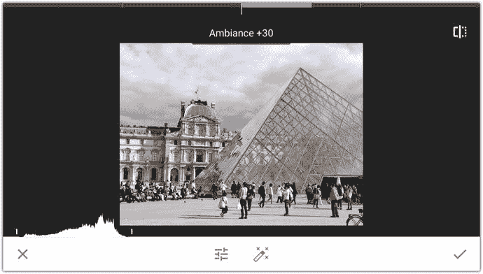

   图 3-4
   增加饱和度和氛围值
5. 点击右下角的 `Apply` 图标以应用效果。
6. 点击右下角的 `Tools` 按钮，选择 `White Balance`。你将给照片中的色彩增添更暖的效果（见图 3-5）。

   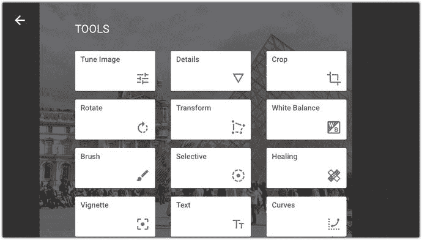

   图 3-5
   点击白平衡设置
7. 点击 `Adjustment` 图标，选择 `Temperature`。将其设置为更暖的级别，例如 +10。点击 `Apply` 图标（见图 3-6）。

   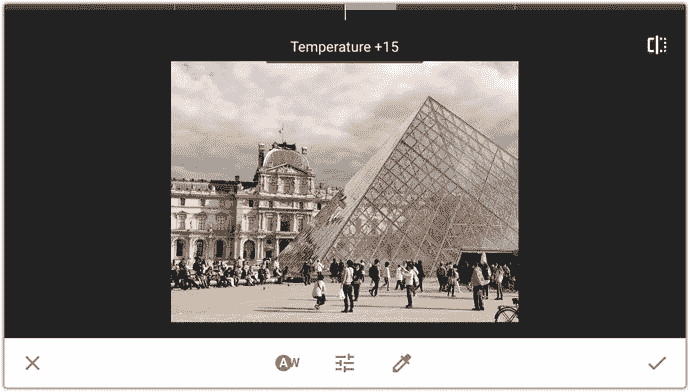

   图 3-6
   通过增加色温设置添加暖调效果

### 步骤 2：应用 HDR 效果

你应该选择适合你照片的 HDR 效果。请按以下步骤操作：

1. 点击 `Tools` 图标，并从滤镜中选择 `HDR Scape`。
2. 选择 `Strong` 模式，并将其强度增加到 +50（见图 3-7）。

   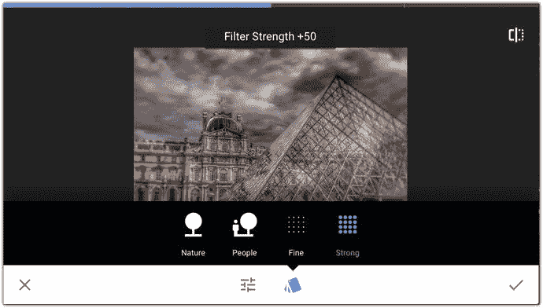

   图 3-7
   应用 HDR 范围效果
3. 点击 `Adjustment` 图标，选择 `Brightness`，并通过将滑块拖至 +10 使其变得更亮一点。
4. 点击 `Apply` 图标。

### 步骤 3：应用暗角效果

为了将更多焦点集中在照片中心和玻璃金字塔上，我将添加暗角效果，为照片创建更暗的边缘。你可以使用自己的照片创建类似效果。请按以下步骤操作：

1. 在工具列表中，选择 `Vignette`。将滑块向左拖动，以在照片中创建更暗的边缘（见图 3-8）。

   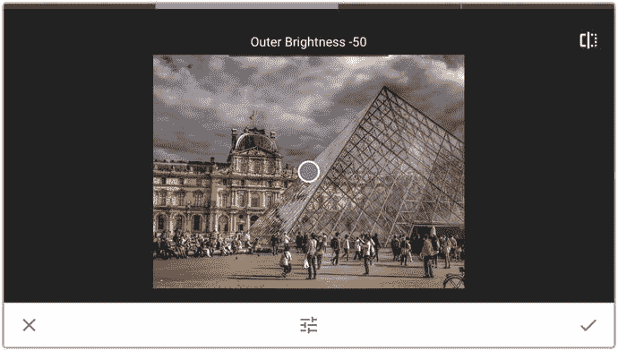

   图 3-8
   对照片应用暗角效果
2. 点击 `Apply` 图标。

### 第 4 步：添加模糊效果

除了暗角效果之外，你还需要添加一个模糊效果，以增强对照片中心的聚焦。请按照以下步骤操作：

1.  在`滤镜`列表中，选择`镜头模糊`。增加模糊强度，例如设置为`+30`。
2.  用双指拖拽，调整应用于照片的模糊区域的大小和形状。尽量让模糊只出现在边缘，使照片的中心点保持清晰。
3.  点击`应用`图标（见图 3-9）。
   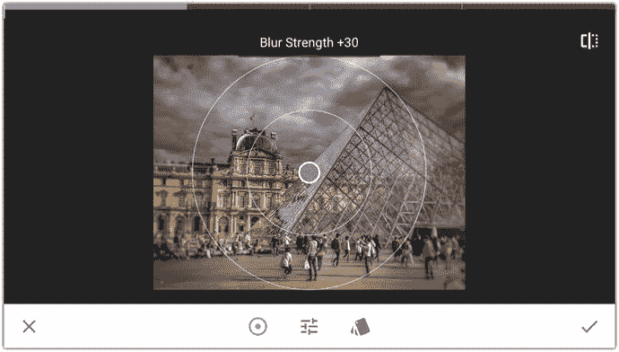
   图 3-9：应用模糊效果
4.  点击`保存`以保存更改。然后选择保存副本以保留原始照片不变。保存照片后，您可以再次打开并编辑修改。如果选择`导出`，照片将被导出，但更改将无法编辑。

### 创建浅景深

使用的工具: `Tadaa`

图 3-10 显示了本示例中使用的原始照片。
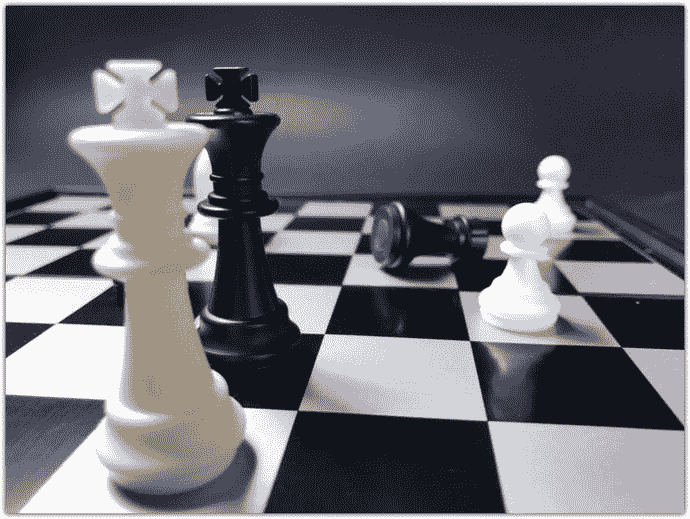
图 3-10：原始图像（© Radwa Khalil）

图 3-11 显示了最终结果。
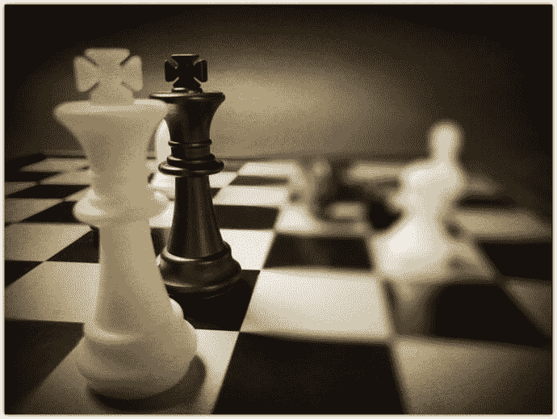
图 3-11：最终结果

术语*景深*是指拍摄中的焦点范围。如果照片的清晰区域仅限于较近的物体，而较远的元素显得模糊，则称为**浅景深**。另一方面，如果清晰区域包含照片的大部分区域，则称为**深景深**。单反相机中的景深受相机光圈（`f-stop`）控制，这与镜头开口的直径有关，并表示为分数（`1/F`）。因此，如果镜头开口大，这个数值就会变小，从而导致浅景深。

在 iPhone 上，拍照时光圈的控制是有限的，因为你只能点击你想要聚焦的物体。有时你需要对拍摄的景深进行更多控制。在下面的示例中，照片已经拍好，但我后来决定调整景深。有许多应用程序可以帮助你手动在照片上应用浅景深，例如`Camera+`和`Tadaa`。

在下面的示例中，我想让更近的棋子更清晰，同时模糊远处的物体。另外，我还想给照片应用更暗的边缘，以聚焦拍摄中的主要物体。找一张类似的照片来跟随本示例操作。

### 第 1 步：保护主要物体

在应用模糊效果之前，你应该保护拍摄中的主要物体，使其保持清晰。可以按如下方式使用蒙版效果：

1.  在`Tadaa`应用中打开一张照片，点击底部工具栏中的`模糊`图标。
2.  点击顶部的`编辑蒙版`图标。
3.  放大物体，并开始在上面绘制蒙版。在这里，我绘制了靠近相机的棋子（见图 3-12）。
4.  点击右上角的`应用`图标。
   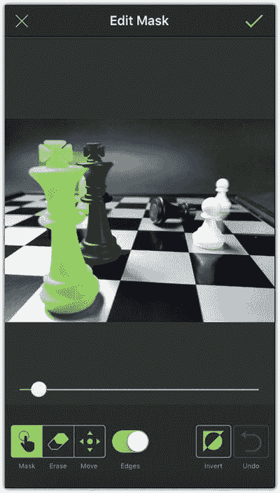
   图 3-12：在靠近相机的元素上应用蒙版

### 第 2 步：应用模糊效果

现在，对拍摄中远处的物体应用模糊效果。你可以用自己的照片跟随操作。

1.  点击`模糊`图标。您可能需要向左或向右拖拽工具栏以显示其余工具（见图 3-13）。
   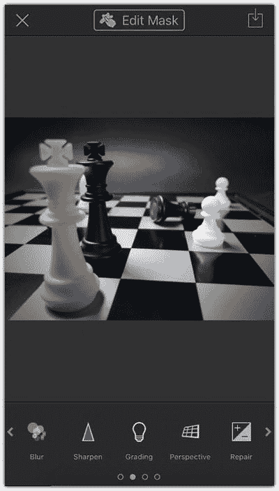
   图 3-13：拖拽工具栏以显示`模糊`图标
2.  将模糊类型设置为`圆形`。
3.  用手指拖拽以调整受保护区域的大小和位置，使其位于照片中近处物体的上方。
4.  拖拽`模糊`滑块以增加远处物体的模糊效果。模糊程度取决于近处物体与远处物体之间的视觉距离。
5.  减小`范围`值，以使模糊效果从距清晰物体适当距离处开始（见图 3-14）。
   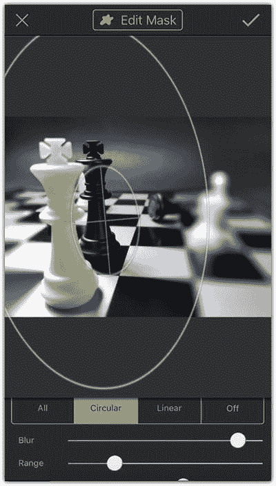
   图 3-14：对照片中的远处物体应用模糊效果
6.  点击`应用`图标。

### 第 3 步：应用暗角效果

现在，按如下方式使照片边缘变暗以聚焦主要物体：

1.  点击底部工具栏中的`暗角`图标。
2.  将`强度`拖向左侧，以在照片周围创建合适的边框。
3.  将`范围`滑块拖到中间点（见图 3-15）。
4.  点击右上角的`应用`图标。
   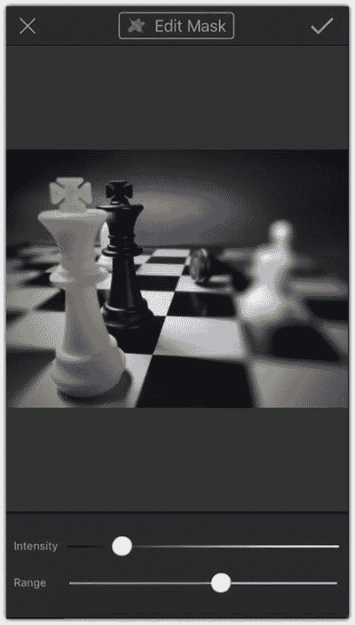
   图 3-15：应用暗角效果

### 第 4 步：应用最终滤镜

添加暗角效果后，为照片添加一个滤镜，使其呈现戏剧性的单色效果，步骤如下：

1.  点击`滤镜`图标，选择`查尔斯顿`滤镜。
2.  将滤镜下方的滑块拖到中间点，以柔化滤镜效果（见图 3-16）。
3.  点击`应用`图标，然后点击`共享`图标将照片保存到你的`相机胶卷`。
   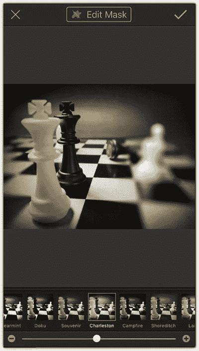
   图 3-16：应用滤镜效果

### 创建弱光黑白照片

工具：`Adobe Lightroom` 应用, `Adobe Photoshop Mix`

图 3-17 显示了本示例中使用的原始照片。选择一张类似的照片来跟随本示例操作。
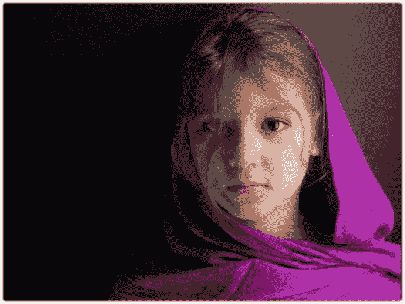
图 3-17：原始照片（© Radwa Khalil）

图 3-18 显示了最终结果。
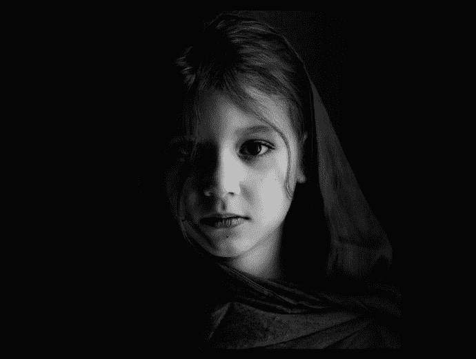
图 3-18：最终结果

弱光效果让你可以通过让观看者聚焦于照片中被照亮的部分来创造戏剧性的效果。通常，它在人像摄影中效果很好，因为它能强调面部表情。为了确保弱光照片的高对比度，请考虑以下提示：

-   在深色背景下拍照，例如纯黑色。你可以在拍摄对象的背景中使用黑色墙壁或纸张。
-   将照片中的物体数量限制为一个物体或一个人，以确保精确对焦，并在编辑时能够控制照片的亮部和暗部区域。
-   尽量使用柔和的弱光源，使其朝向拍摄中的人物或物体。
-   尽量使用三脚架，以确保用 iPhone 拍摄时画面稳定。

在下面的示例中，照片是在黑色背景下使用柔和光线拍摄的，这使其适合制作弱光效果。我使用`Photoshop Mix`通过图层和混合模式来改善白色区域。

### 步骤 1：将照片转换为黑白

首先，将照片导入 Lightroom 应用中，将其转换为黑白，然后调整整体的曝光度、对比度、光线和阴影。

1. 在 Adobe Lightroom 应用中打开一张照片。
2. 点击 `颜色` 图标。点击菜单左上角的 `黑白` 图标。这会将图像转换为黑白。
3. 将色温设置为 `+40`，色调设置为 `+45`（见图 3-19）。

   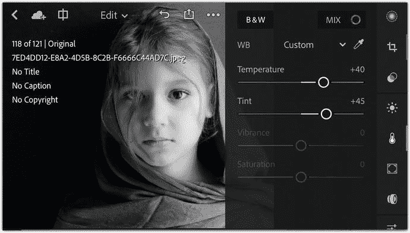

   **图 3-19** 将照片转换为黑白，并提高色温和色调设置

4. 点击 `光线` 图标，然后将 `曝光度` 设置为 `-1`， `对比度` 设置为 `+100`， `高光` 设置为 `+5`， `阴影` 设置为 `-85`， `白色色阶` 设置为 `+55`， `黑色色阶` 设置为 `-55`（图 3-20）。

   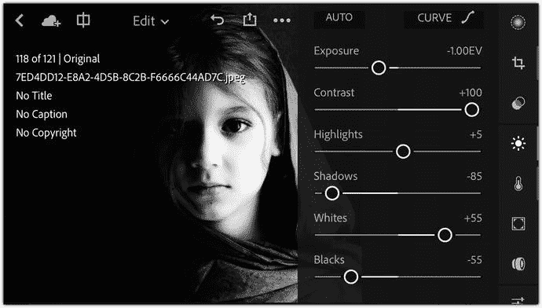

   **图 3-20** 调整光线设置以营造更具戏剧性的光影效果

5. 点击 `效果` 图标，将 `清晰度` 设置为 `-45`，以在面部细节上产生平滑效果。
6. 将 `暗角数量` 设置为 `-50`，以增加拍摄对象边缘周围的黑色（见图 3-21）。

   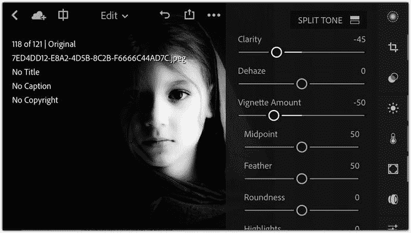

   **图 3-21** 降低清晰度以创造柔和效果，并在边缘应用暗角效果

### 步骤 2：聚焦于面部

你可以使用选择性调整来修改照片的某些部分，而不会影响面部。请按照以下步骤操作：

1. 点击 `选择性` 图标，对照片的右侧进行局部调整。
2. 从左侧工具中点击 `线性渐变` 图标，拖动创建一个从照片右侧到左侧、在面部起始处结束的蒙版（见图 3-22）。

   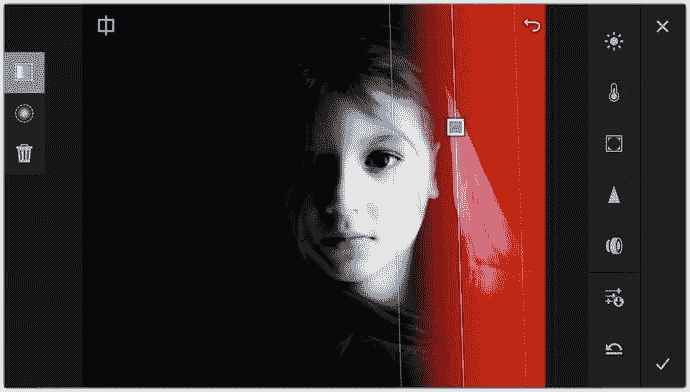

   **图 3-22** 对照片的右侧部分应用选择性调整

3. 点击 `亮度` 图标，将曝光度设置为 `-1.60`，以减少对左侧面部的破坏（见图 3-23）。
4. 点击右下角的 `应用` 图标。
5. 点击 `分享` 图标，然后点击 `存储到相机胶卷`。
6. 将质量设置为最高可用选项。

   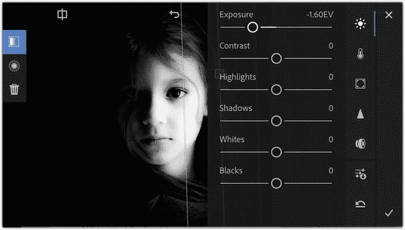

   **图 3-23** 降低图像右侧部分的曝光度

### 步骤 3：改善高光

你可能希望增强照片中的高光部分，以增加对面部的强调效果。为此，你可以使用 Photoshop Mix 来设置混合模式，如下所示：

1. 在 Photoshop Mix 中点击 `+` 图标。选择 `图像`，然后导航到 `相机胶卷` 找到你刚刚保存的照片。
2. 双击左侧的图层以打开其 `属性` 面板。如果看不到图层，请点击右上角的图标以显示应用工具。
3. 点击 `混合` 图标，将混合模式设置为 `滤色`。点击 `应用` 图标。
4. 点击 `外观` 图标以应用滤镜。选择 `肖像`，然后点击 `应用` 图标。

## 创建高调照片

工具： Adobe Lightroom 应用、Photoshop Mix 应用、Blur 应用

图 3-24 显示了我的原始照片。

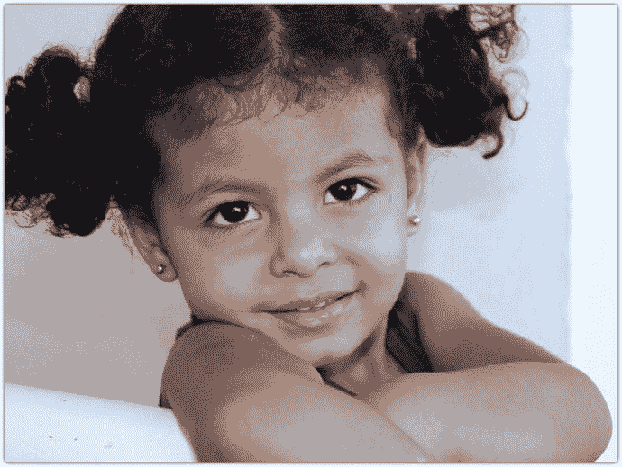

**图 3-24** 原始照片（© Radwa Khalil）

图 3-25 显示了我的最终结果。

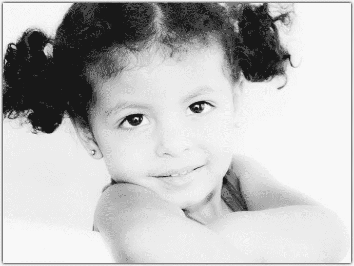

**图 3-25** 最终结果

与低调照片相比，高调照片降低了照片中的照明比率和对比度水平，以创造更自然的光线。该技术最初是为无法显示对比度范围的屏幕开发的，但现在被用来在照片上创造出简约时尚的效果。

要拍出好的高调照片，画面中的物体数量应尽量少，以便你可以使用不同的应用程序轻松修改它们。尽量在自然环境中、背景明亮处拍摄，以尽量减少照片中的阴影。

### 步骤 1：转换为黑白

首先，你可以使用 Lightroom 应用将照片转换为黑白，并使用曲线增加画面中的白色区域。

1. 在 Lightroom 应用中打开图像。点击 `颜色` 图标。然后，点击 `黑白` 图标将照片转换为黑白。将 `色温` 滑块向右拖动（见图 3-26）。

   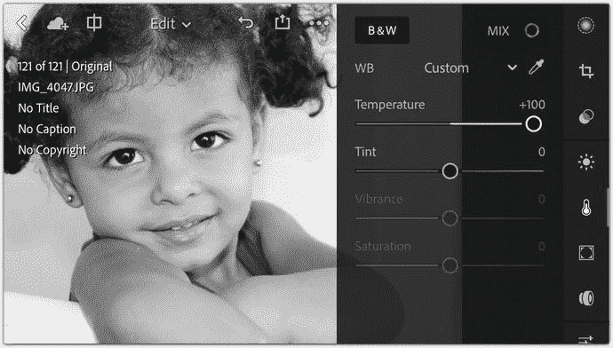

   **图 3-26** 将照片转换为黑白

2. 点击 `光线` 图标。点击 `曲线` 图标来设置曲线，增加明亮区域并增强黑色的强度，同时保持两者之间的平滑过渡。然后点击 `完成`（见图 3-27）。

   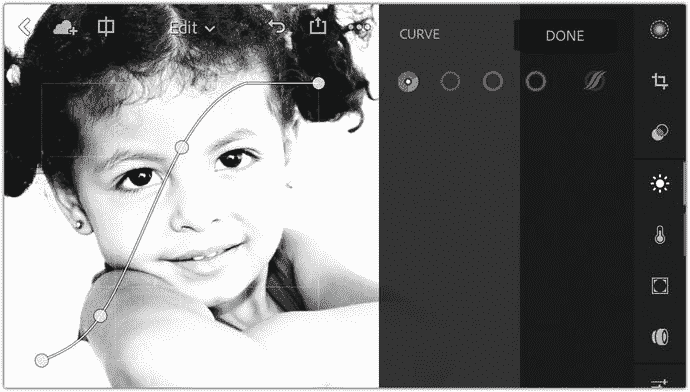

   **图 3-27** 使用曲线工具增加照片的对比度

3. 将 `高光` 滑块拖到最右边。稍微增加阴影、白色色阶和黑色色阶（图 3-28）。

   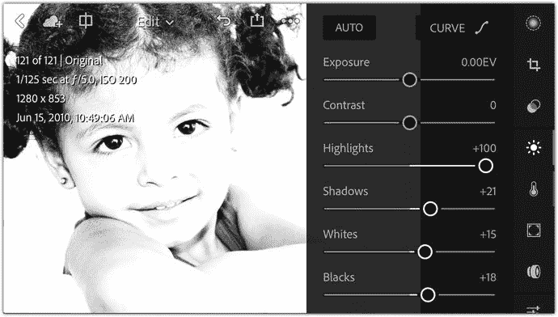

   **图 3-28** 增加照片中的高光、阴影、白色色阶和黑色色阶设置

4. 点击 `效果` 图标，将 `清晰度` 降低到 `-65`，以在照片上创建平滑的边缘（见图 3-29）。

   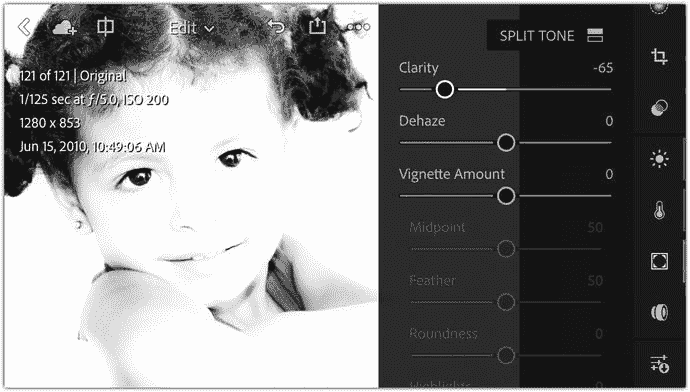

   **图 3-29** 降低清晰度以创造平滑效果

5. 点击 `分享` 图标，然后将图像保存到你的 `相机胶卷`。

### 步骤 2：创建模糊版本

为了给照片添加柔和效果，你可以为你刚刚修改过的照片创建一个模糊版本。请按照以下步骤操作：

1. 在 Blur 应用中打开图像。点击工具栏右侧的 `调整` 图标。设置一个低值，例如 `10`。
2. 点击 `模糊` 图标，涂抹照片中的明亮区域（见图 3-30）。
3. 点击 `保存` 图标，将照片保存到你的 `相机胶卷`。

   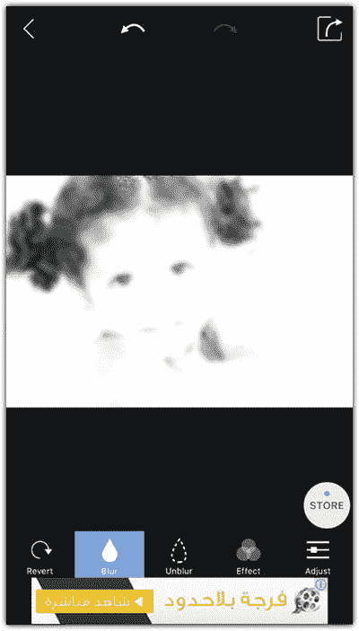

   **图 3-30** 使用 Blur 应用画笔涂抹，以增强照片的模糊效果

### 步骤 3：完成高调照片

现在，你可以在 Photoshop Mix 中添加这两张照片，并使用图层不透明度和混合模式来混合照片的清晰版和模糊版。请按照以下步骤操作：

1. 打开 Photoshop Mix 应用。点击右上角的 `+` 图标来创建一个项目。从 `相机胶卷` 中添加第一张图像。
2. 点击 `+` 图标添加一个新图层。选择添加图像，然后导航到模糊照片并将其添加进去（见图 3-31）。

   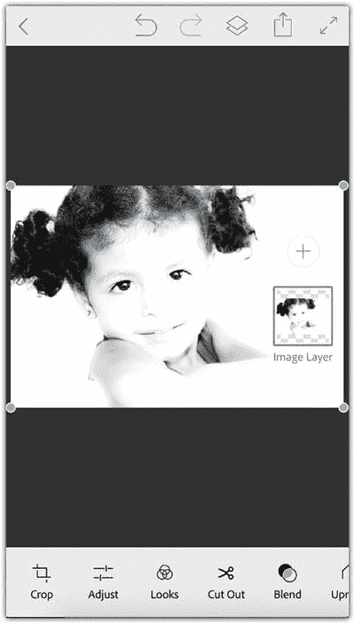

   **图 3-31** 将照片的模糊版本添加到第一张照片上

3. 双击顶部图层以打开其属性。将 `不透明度` 设置为 `65%`，并将混合模式设置为 `叠加`（见图 3-32）。
4. 点击 `分享` 图标，保存照片。

   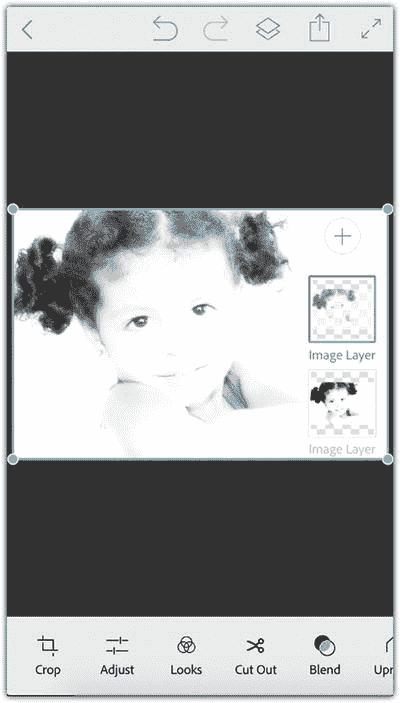

   **图 3-32** 更改模糊图层的不透明度和混合模式

## 创建双重曝光照片

使用工具：`Pic Blender`

图 3-33 展示的是我的原始照片。

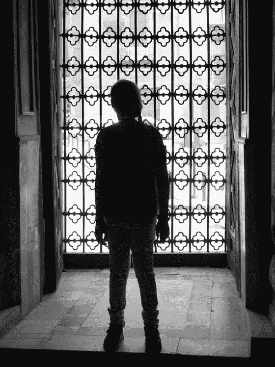

图 3-33 - 原始照片 (© Radwa Khalil)

图 3-34 展示的是我的最终效果。

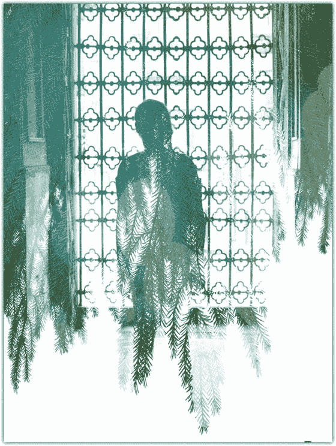

图 3-34 - 最终效果

双重曝光，也称为多重曝光效果，允许你将两张或更多照片合成一张经过处理的图片。它让你能够融合照片，以显示每张照片的细节，即利用一张照片来遮罩另一张照片。基本上，是一张图像中的明暗部分被用来显示另一张（或更多）图像中的细节。随着数码相机功能的迅猛发展，摄影师可以直接在单反相机中创建双重曝光效果，这项技术在过去几年中变得流行。

双重曝光技术也可以在拍摄后使用诸如 Adobe Photoshop 之类的照片编辑应用程序来创建，其效果能与相机直接拍摄的相媲美。此外，它还能让你对最终效果中使用的效果和风格有更多的控制。

此外，还有许多 iPhone 应用可以帮助你拍摄双重曝光照片，例如 `Union`、`MultiExpo`、`Superimpose`、`Pic Blender`、`Pixlr`、`Fused` 和 `Snapseed`。在本技巧中，你将使用 `Pic Blender` 应用来合并两张照片以构建双重曝光效果。为了获得良好的效果，请确保选择一张对比度强、细节较少的照片作为基础照片，再选取第二张包含树木、建筑物等细节的照片。

### 第 1 步：准备基础照片

在直接应用双重曝光效果之前，你需要先调整照片，以增强照片中明暗之间的对比度。

1. 打开 `Pic Bender` 应用，并选择一张高对比度的照片作为基础照片。
2. 点击“调整”图标，然后点击“对比度”图标。将滑块向右拖动以增加对比度。这将增加照片中的阴影和高光区域，并减少中间色调（见图 3-35）。

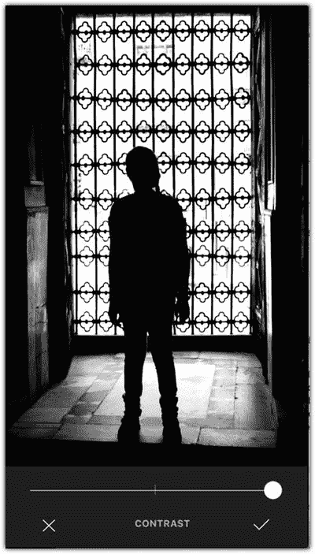

图 3-35 - 调整黑白照片的对比度

### 第 2 步：合并照片

现在，你将使用应用中的一张照片作为第二张图像，与基础照片进行混合。然后，你将修改第二张图像以使其与原始图像匹配。

1. 点击工具栏左侧的“照片”图标以添加第二张照片。
2. 你可以点击“相机”图标拍摄一张新照片，或者从现有照片中选择一张。浏览并选出一张树木照片，然后选择第三张（见图 3-36）。

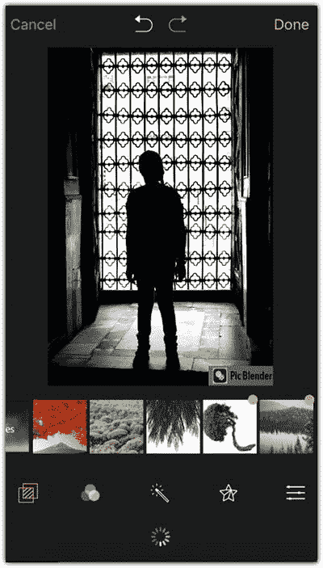

图 3-36 - 选择一张树木照片作为与原始照片混合的第二张照片
3. 用两根手指翻转你的树木照片，并将其放大以填满画布。
4. 将混合模式设置为“滤色”。将滑块拖到最右侧（见图 3-37）。
5. 点击“应用”图标。

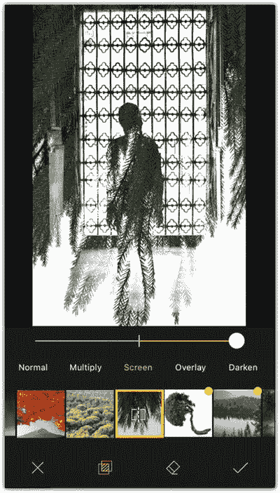

图 3-37 - 对树木照片应用混合模式

### 第 3 步：增强双重曝光效果

应用双重曝光效果后，你将给照片添加一个散景效果，为画面增添艺术感。

1. 点击“效果”图标。选择第四张名为“Bokeh”的图像。
2. 将混合模式设置为“滤色”，并将滑块稍微向左拖动以增加图像透明度（见图 3-38）。

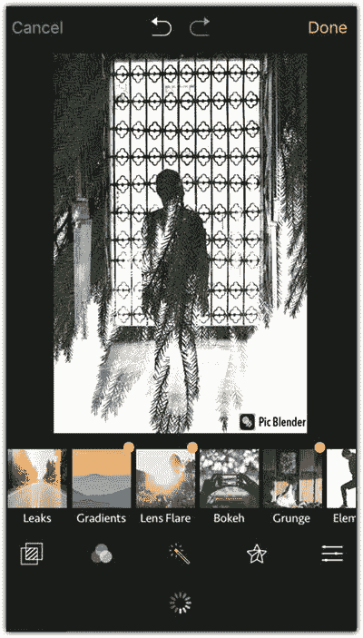

图 3-38 - 为照片添加散景效果
3. 点击“应用”图标。
4. 点击“滤镜”图标，点击“胶片感光”图标，然后选择第一个效果。
5. 将滑块向左拖动以稍微减弱效果（见图 3-39）。
6. 点击“应用”图标。
7. 点击“完成”。
8. 选择所需的分辨率，然后点击“保存”。

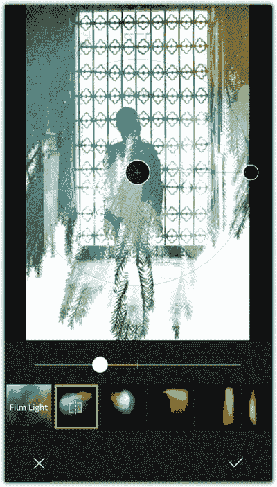

图 3-39 - 应用胶片感光滤镜效果

## 总结

尽管 iPhone 相机不像专业单反相机那样包含弱光、强光、`HDR` 和双重曝光效果等高级功能，但你仍然可以通过使用从 App Store 下载的各种免费和付费应用来实现这些技术。你还可以通过使用多个应用程序来扩展这些功能以改善最终效果。本章中的技巧涵盖了你可以使用 iPhone 应用的一些摄影效果。

## 练习实践

首先，拍摄可用于本章技巧的照片。你也可以使用 iPhone 照片库中的照片。从应用这些效果开始，并练习不同的设置和风格。

