# 掌握照片编辑与应用效果

在上一章中，你学习了如何创建诸如 `HDR` 照片和浅景深等效果。这些技巧仅仅是开始。你可以使用 Apple App Store 中的应用为你的照片添加滤镜、边框和风格。你还可以处理多张照片以创建特定的场景。本章中的每个技巧都列出了我所使用的应用；你可以使用相同的应用，也可以选择类似的应用。

## 制作诱人的美食照片拼贴

使用工具：`Adobe Lightroom` 应用、`Moldiv` 应用

在本技巧中，你将学习以下内容：

- 如何修改照片的颜色和光线
- 如何创建多张照片的照片网格或拼贴画
- 如何为照片添加纹理

图 4-1、图 4-2 和图 4-3 展示了我使用的原始照片。请尝试寻找类似的内容，以便你能跟着操作。

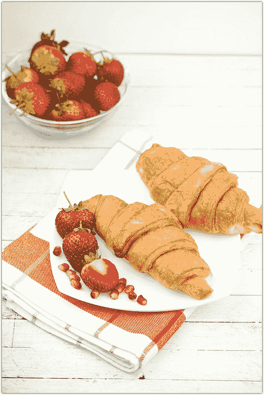

图 4-3 - 第三张照片 (© Radwa Khalil)

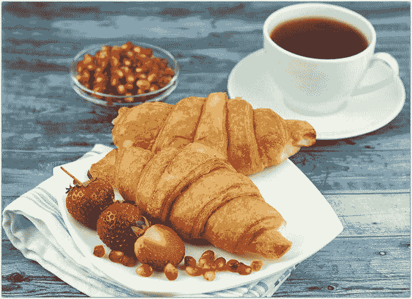

图 4-2 - 第二张照片 (© Radwa Khalil)

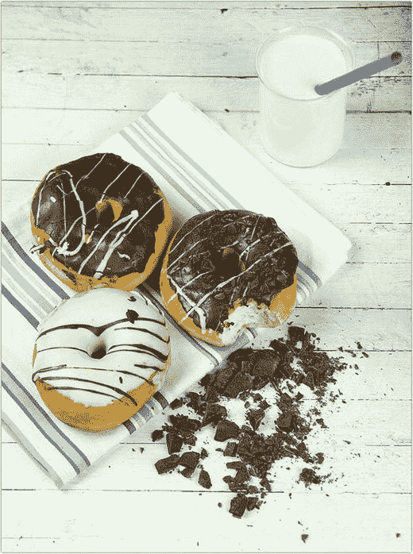

图 4-1 - 第一张照片 (© Radwa Khalil)

图 4-4 展示的是我的最终效果。

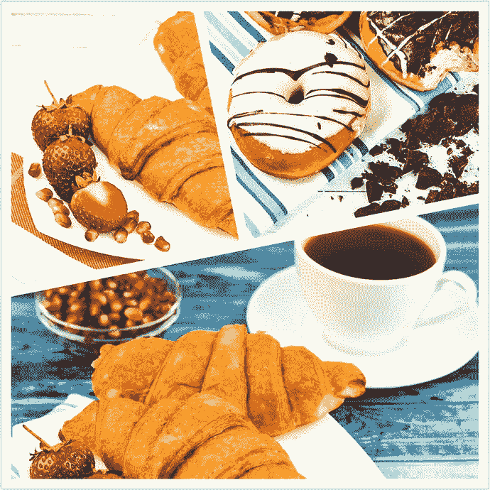

图 4-4 - 最终效果

常言道，一图胜千言。而一张照片拼贴画能传达的信息更多。将照片排列成拼贴画或网格，可以让你讲述一个故事；这是一种展示同一主题不同照片以强调你观点的绝佳方式。虽然有众多应用可以帮助你创建照片拼贴画，但即使在拍摄之前，为你的项目做好准备也很重要。每个拼贴画都应该有一个主题；换句话说，照片应该在特定方面有所关联。以下是一些示例：

- **色彩主题拼贴**：在此主题中，照片的主题和地点可能各不相同，但它们通过相同的颜色（例如蓝色的大海、蓝色的天空和蓝色的石头）统一起来。
- **物体主题拼贴**：此类拼贴中的所有照片都展示相同或相关的物体，例如水果、树叶、花朵或人物。
- **叙事性拼贴**：这种拼贴用于讲述一个故事或展示同一场景的连续照片。例如，它可以包括孩子们玩特定游戏，并展示他们玩耍时的四个或更多反应镜头。

在这个例子中，我将展示如何将一系列美食摄影照片组织成拼贴风格。你将首先学习在 `Adobe Lightroom` 应用中修改照片的颜色，然后转到 `Moldiv` 应用创建最终的拼贴效果。

### 第一步：修改照片颜色

在 Lightroom 应用中，你将提高照片的鲜艳度并增强其清晰度，以使所有拍摄照片的颜色水平保持一致。

1.  在 Adobe Lightroom 应用中，点击 `Camera Roll` 图标，然后选择你想要使用的照片（见图 4-5）。

    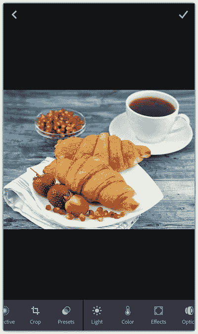

    图 4-5：在 Adobe Lightroom 应用中打开一张照片

2.  点击 `Color` 图标，并将 `Vibrance` 滑块向右拖动，以增加色彩的鲜艳度（见图 4-6）。

    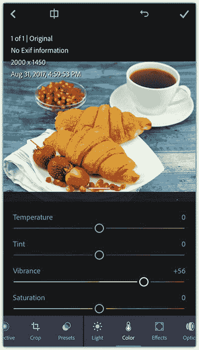

    图 4-6：增加照片的 `Vibrance` 值

3.  点击 `Effects` 图标，并将 `Clarity` 滑块稍微向右拖动，以增加照片的清晰度（见图 4-7）。

    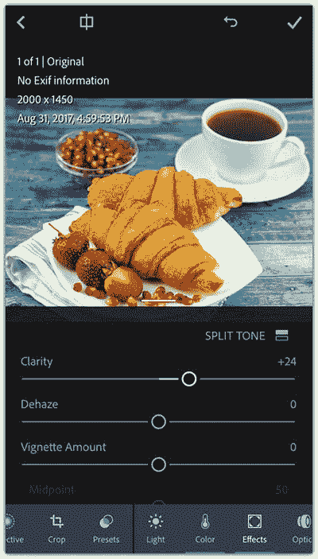

    图 4-7：增加 `Clarity` 值

4.  照片颜色修改完成后，点击 `Share` 图标，然后选择 `Save to Camera Roll`。对于 `Image Size`，选择 `Maximum Available`。

### 第二步：构建照片拼贴

按照以下步骤构建照片拼贴：

1.  打开 Moldiv 应用，选择 `Collage`，然后挑选一种照片拼贴布局。在本示例中，选择第二行第三个布局（见图 4-8）。

    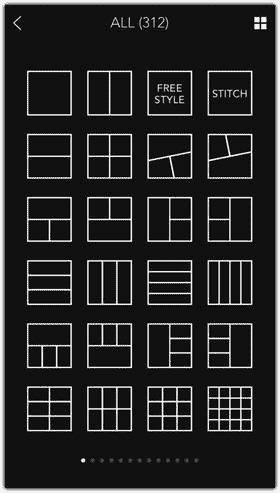

    图 4-8：选择一种拼贴样式

2.  点击其中一个网格，然后选择 `Albums`。浏览到第一张照片并将其添加进来（见图 4-9）。

    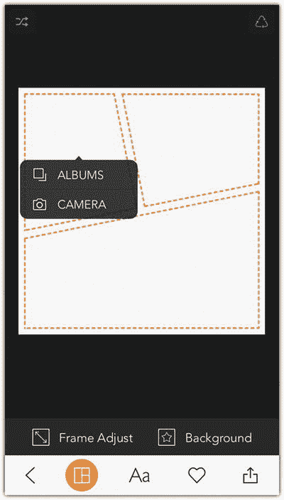

    图 4-9：从手机相册将照片添加到拼贴部分

3.  重复这些步骤，将另外两张照片添加到网格的其他区域中（见图 4-10）。

    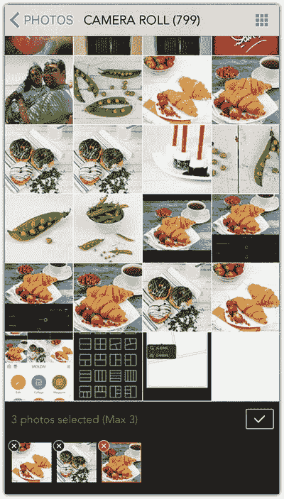

    图 4-10：选择要添加到拼贴网格的照片

4.  用两根手指拖拽来调整每张图像的大小和焦点。尽量将焦点放在照片的主要主体上，使网格看起来更有趣（见图 4-11）。

    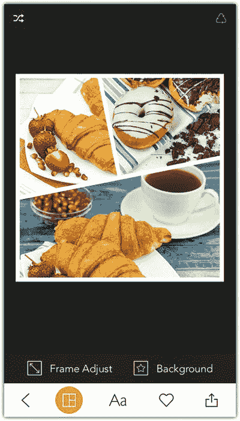

    图 4-11：添加了三张照片后的拼贴

### 第三步：保存照片拼贴

按照以下步骤保存你的照片拼贴：

1.  点击工具栏右下角的 `Share` 图标。
2.  将尺寸设置为 `Maximum`。拼贴图将以其全尺寸保存到你的相机胶卷中（见图 4-12）。

    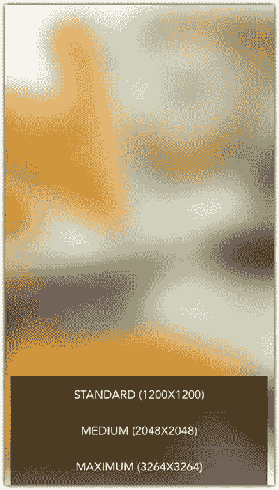

    图 4-12：以最大尺寸保存拼贴

3.  点击 `Share` 图标，然后点击 `Edit` 继续下一步。

### 第四步：添加纹理效果

按照以下步骤添加纹理效果：

1.  在共享菜单中点击 `Edit` 图标。如果你关闭了它，可以从应用首页点击 `Edit` 图标，然后找到照片拼贴（见图 4-13）。

    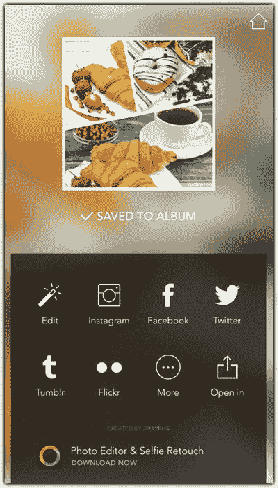

    图 4-13：在共享菜单中点击 `Edit` 图标

2.  点击 `Filters` 图标打开应用滤镜。点击 `Basic` 滤镜，然后选择 `Joker`（见图 4-14）。

    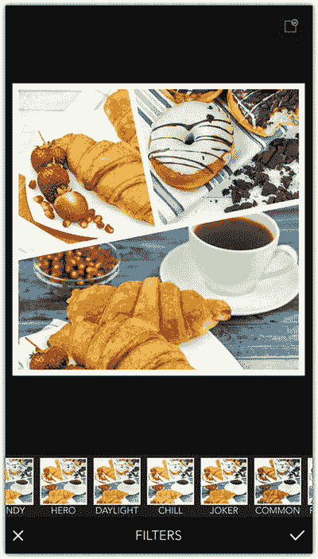

    图 4-14：选择 `Joker` 滤镜应用于拼贴

3.  点击右下角的 `Apply` 图标。

## 为你的照片添加复古风格

**使用的工具：** Snapseed、PicsArt 和 Photofox

在本章中，你将了解以下内容：

-   如何创建复古效果，然后对其进行优化
-   如何添加诸如镜头光晕等滤镜

图 4-15 显示了我使用的原始照片。

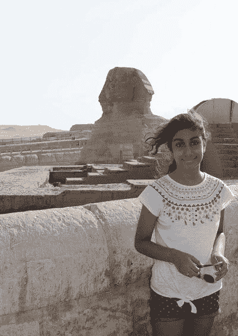

图 4-15：原始照片（© Rafiq Elmansy）

图 4-16 显示的是最终结果。

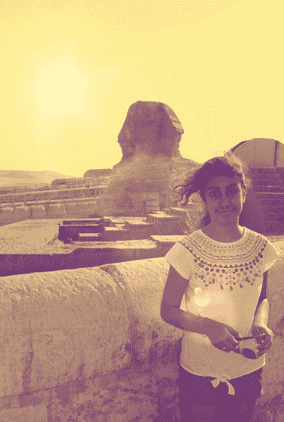

图 4-16：最终结果

复古照片是唤起怀旧感的好方法。虽然你无法直接在数码单反相机上创建复古效果，但可以在台式电脑上使用 Adobe Photoshop 等照片编辑应用程序来创建。在 iPhone 上，你可以使用各种应用程序创建复古效果。例如，Instagram 允许你在拍照后、与粉丝分享之前应用复古滤镜。

在本技巧中，你将探索如何利用各种应用程序将照片转换为复古风格。我使用了女儿的照片，这张照片是在我们上次去吉萨金字塔旅行时拍摄的。

### 第一步：应用复古效果

按照以下步骤应用复古效果：

1.  在 Photofox 应用中打开照片。点击底部工具栏中的 `Image` 图标。
2.  点击底部工具栏中的 `Tone` 图标，然后在 `Filters` 列表中选择 `E58` 滤镜，以创建温暖的复古效果（见图 4-17）。

    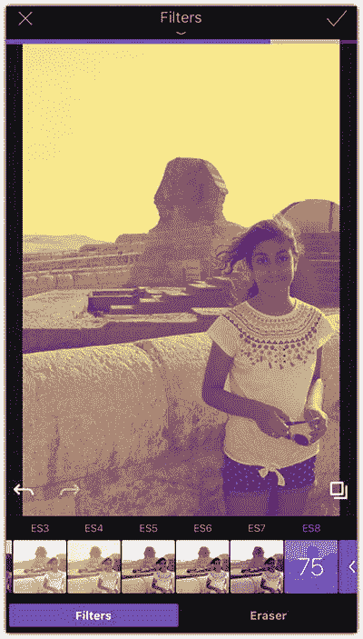

    图 4-17：应用 Photofox 的 `E58` 滤镜

3.  点击 `Share` 图标，然后将照片保存到你的相机胶卷。

### 第二步：添加镜头光晕

按照以下步骤添加一些镜头光晕：

1.  在 PicsArt 应用中打开照片。然后点击加号图标添加图像，并选择 `Edit`。
2.  将工具栏向左拖动，然后选择 `Lens Flare`（见图 4-18）。

    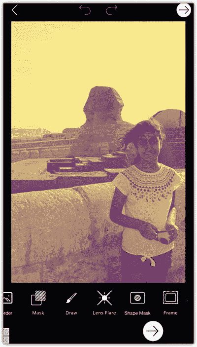

    图 4-18：添加 `Lens Flare` 效果

3.  从列表中选择一个合适的镜头光晕效果。
4.  将 `Hue` 设置为 `0`，`Opacity` 设置为 `48`，`Blend` 设置为 `Add`（见图 4-19）。

    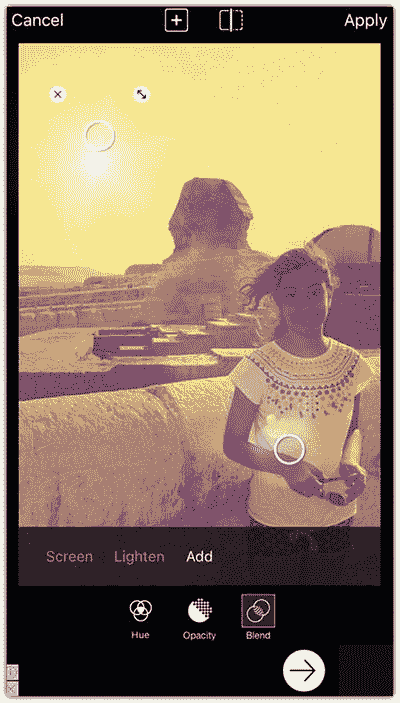

    图 4-19：调整镜头光晕的位置和强度

5.  点击右上角的 `Next` 图标，然后将照片保存到你的相机胶卷。

### 第三步：优化复古效果

按照以下步骤优化复古效果：

1.  在 Snapseed 应用中打开照片，然后从工具中选择 `Vintage` 滤镜。
2.  选择照片底部的滤镜编号 6，以添加蓝色渐变（见图 4-20）。

    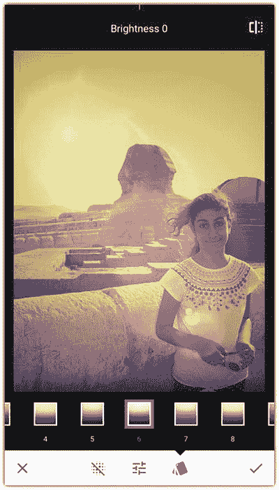

    图 4-20：在 Snapseed 中添加复古滤镜

3.  点击 `Apply` 图标。
4.  从 `Tools` 中选择 `Grunge` 滤镜。选择第五个磨损效果。
5.  点击 `Adjustment` 图标，然后选择 `Texture Strength`。将该值设置为 `15`（见图 4-21）。

    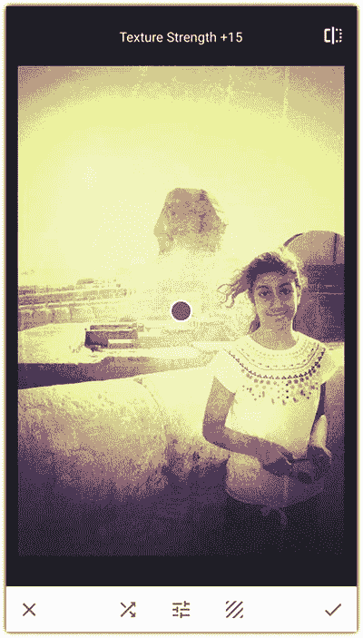

    图 4-21：添加磨损效果并进行调整

6.  点击 `Apply` 图标。
7.  点击 `Share` 图标并选择 `Save a Copy`，以在不替换原始照片的情况下保存照片。

## 创建相框

使用工具：`Tadaa`、`Laminar Pro` 和 `Photoshop Mix`

在本节中，您将学习以下内容：

- 如何将照片转换为复古风格
- 如何为照片应用不同类型的相框
- 如何将两张或更多照片合成处理

有很多应用程序可以为您的照片创建相框。在这个技巧中，我使用了一张几年前在黎巴嫩旅行时拍摄的照片。我想用我妻子拍摄的一张树干照片为它制作一个定制相框。但首先，在应用相框之前，我会先添加一个复古色彩效果。

图 4-22 和图 4-23 展示了原始照片。

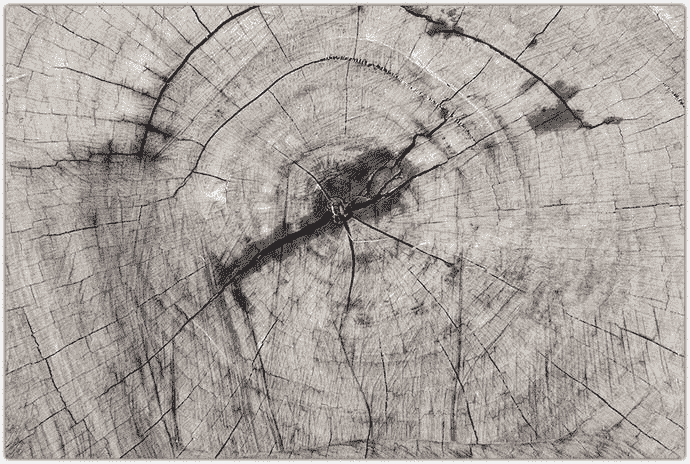

图 4-23

原始纹理照片（© Radwa Khalil）

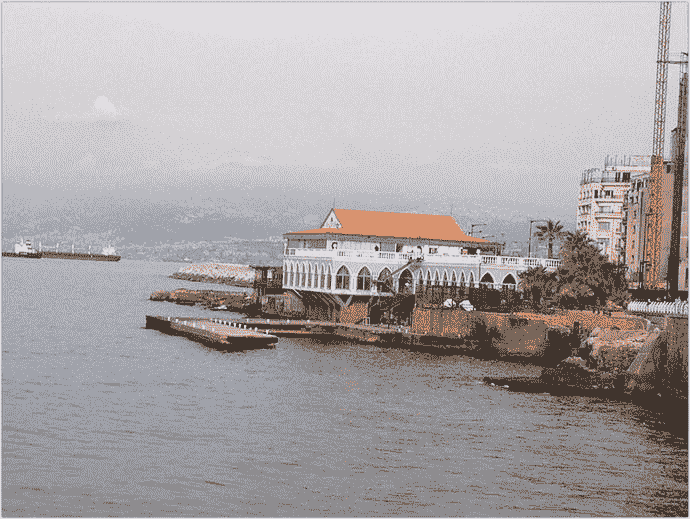

图 4-22

原始照片（© Rafiq Elmansy）

图 4-24 展示了最终结果。

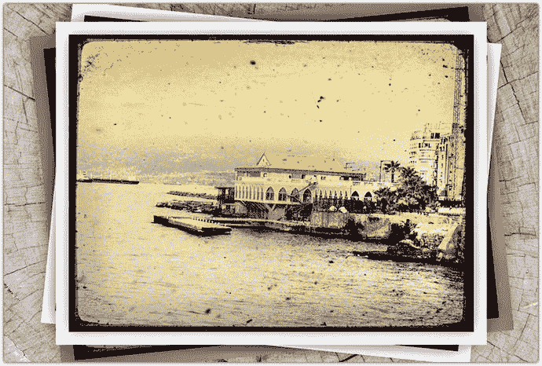

图 4-24

最终结果

### 步骤 1：为照片添加复古效果

按照以下步骤为照片添加复古效果：

1.  在 `Tadaa` 应用中打开一张照片。
2.  点击滤镜图标，选择 Shoreditch 滤镜。然后点击应用图标（见图 4-25）。

    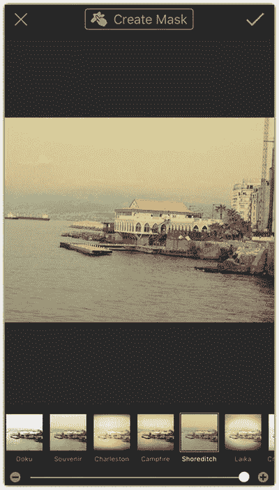

    图 4-25

    在 `Tadaa` 应用中应用 Shoreditch 滤镜
3.  点击相框图标，选择一个脏污风格相框，然后点击应用图标（见图 4-26）。
4.  将照片保存到相机胶卷文件夹中。

    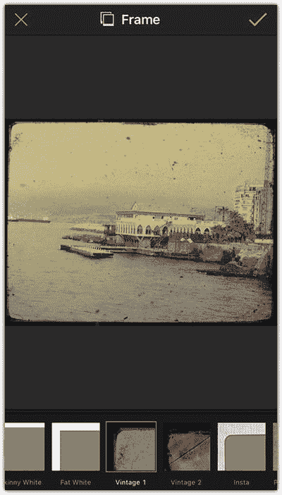

    图 4-26

    在 `Tadaa` 应用中应用复古相框

### 步骤 2：应用更多相框

按照以下步骤应用更多相框：

1.  在 `Laminar` 应用中，打开上一步保存的照片。
2.  点击效果图标，然后选择边框。
3.  选择 Snap and Stack 边框，然后点击应用图标（见图 4-27）。

    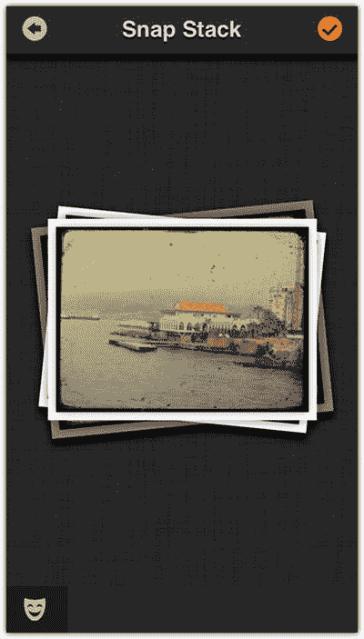

    图 4-27

    在 `Laminar` 应用中应用 Snap and Stack 边框。
4.  点击分享和导出图标。将输出格式设置为 `PNG`（这将创建一张透明照片），然后从保存到菜单中选择图库。

### 步骤 3：添加相框背景纹理

要添加相框背景纹理，请按以下步骤操作：

1.  在 `Photoshop Mix` 中打开树干纹理图片。
2.  点击加号图标添加一个新图层。选择相框图像添加到新图层。
3.  用手指调整上层图像的大小，使其与画布尺寸匹配（见图 4-28）。

    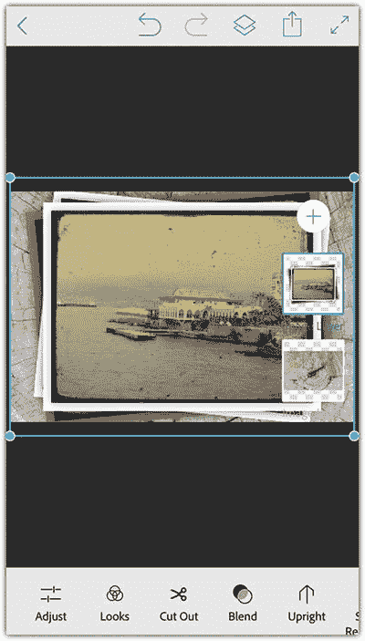

    图 4-28

    在 `Photoshop Mix` 中将照片添加到树干纹理上
4.  点击外观，然后选择 Punch 滤镜。
5.  点击屏幕右侧的编辑工具，然后选择智能选取。
6.  点击羽化图标，并向右拖动以增加羽化值。
7.  涂抹照片的中间部分，使效果保留在照片中部，并从边缘去除效果（见图 4-29）。

    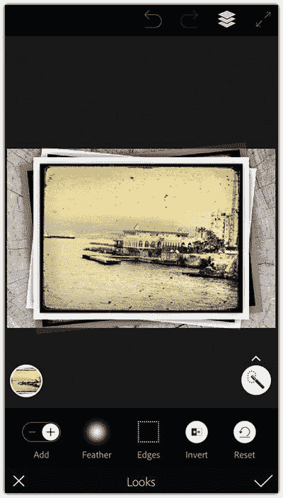

    图 4-29

    使用智能选取优化相框外观

## 创建胶片条纹效果

使用工具：`Snapseed`、`Camera Awesome`

在这个技巧中，您将学习以下内容：

- 如何将照片转换为黑白
- 如何将照片转换为单色
- 如何裁剪照片并添加纹理
- 如何为照片添加胶片条纹效果

图 4-30 展示了我使用的原始照片。

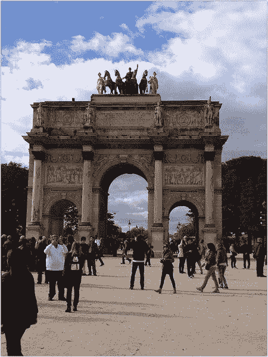

图 4-30

原始照片

图 4-31 展示了最终结果。

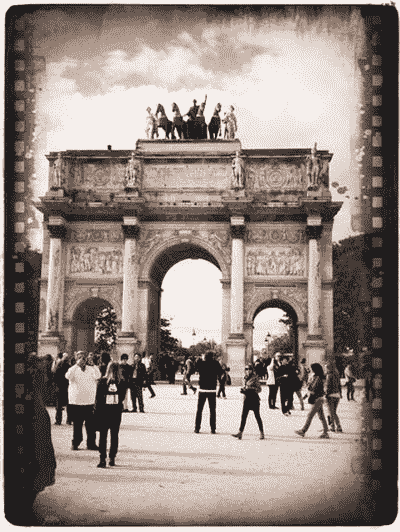

图 4-31

最终结果

照片编辑中的一个流行技巧是将照片变成老式风格，并将其更改为胶片条形状。要做到这一点，首先使用 `Snapseed` 应用将照片转换为黑白并赋予其单色效果，使其适合最终效果。然后，您可以使用 `Camera Awesome` 应用，在其中裁剪照片以适应胶片条内部。在同一个应用中，您可以为照片应用棕褐色滤镜，然后是纹理，最后是胶片条。

### 步骤 1：将照片转换为单色

按照以下步骤将照片转换为单色：

1.  在 `Snapseed` 应用中打开照片。
2.  点击工具图标，选择黑白。选择一个能确保照片中所有元素清晰且对比分明的色调（见图 4-32）。

    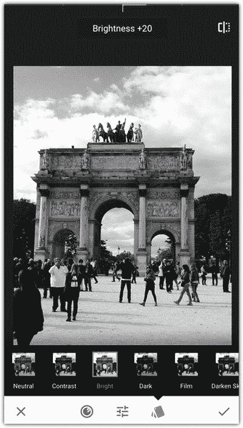

    图 4-32

    将照片转换为黑白
3.  点击应用图标。
4.  在工具列表中，选择复古滤镜，并选择一个棕色调的滤镜。点击应用图标（见图 4-33）。

    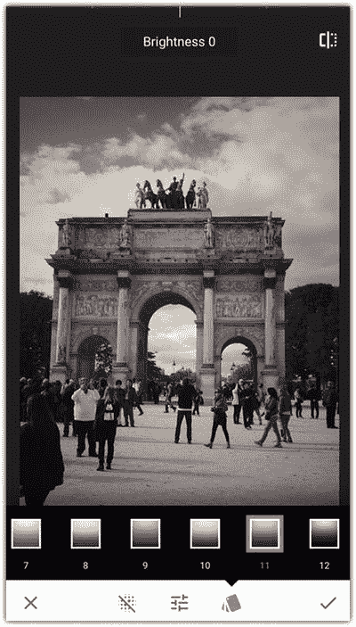

    图 4-33

    为照片添加复古色彩

### 步骤 2：优化照片并添加相框

按照以下步骤优化照片并添加相框：

1.  在 `Camera Awesome` 应用中，点击相机按钮左侧的照片图标。点击加号图标，从您的图库中添加照片。
2.  点击以从图库中打开图像，然后点击照片进行编辑。
3.  点击变换图标，将裁剪尺寸设置为正方形。然后点击完成。
4.  点击滤镜，应用棕褐色滤镜，然后点击完成（见图 4-34）。

    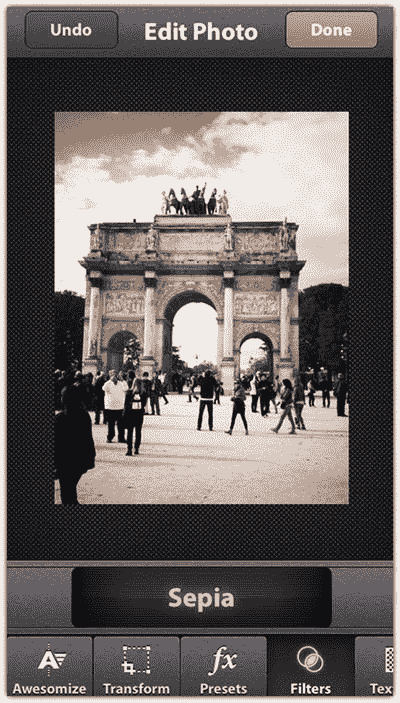

    图 4-34

    在 `Camera Awesome` 中应用棕褐色滤镜
5.  在纹理部分，选择家庭相册滤镜，然后点击完成应用。
6.  点击相框图标，选择 Sprockets 相框。您也可以应用其他类似胶片的相框。然后点击完成（见图 4-35）。
7.  在底部工具栏中，点击导出到相机胶卷图标。

    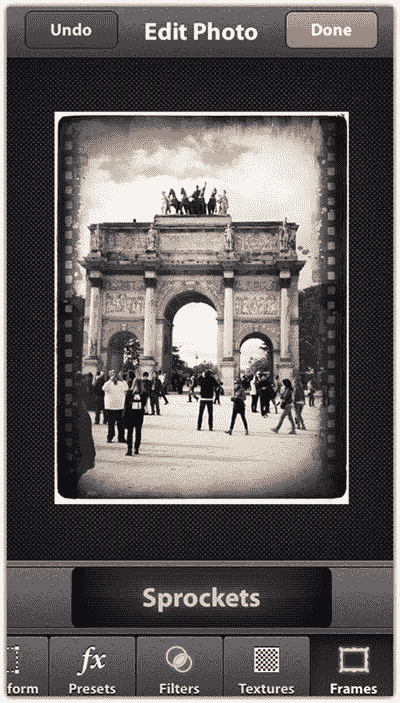

    图 4-35

    为照片添加胶片相框

## 使用色彩突出元素

使用工具：`Photoshop Mix` 和 `Photo Splash`

在这个技巧中，您将学习以下内容：

- 如何使用图层修复照片中的问题
- 如何将照片转换为黑白
- 如何给照片的一部分上色或去色

图 4-36 展示了我使用的原始照片。

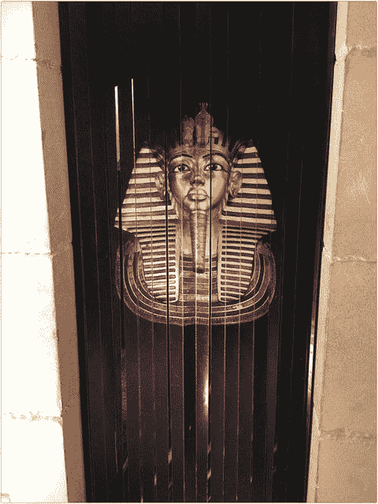

图 4-36

原始照片

图 4-37 展示了最终结果。

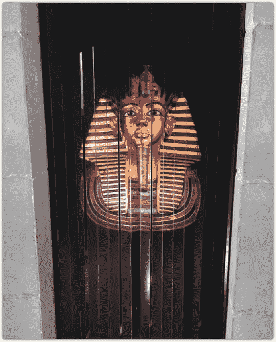

图 4-37

最终结果

有时您需要根据照片的构图来强调某个对象。这可以通过不同的方法实现，例如使用色彩。一种有助于将焦点集中在画面中特定元素上的效果是，将某个对象着色，同时将照片的其余部分转换为黑白。在这个技巧中，我有一张图坦卡蒙面具的海报照片，我想突出画面中的面具。

不幸的是，照片中左侧墙壁的光线相比右侧非常曝光过度。因此，我将演示如何使用 `Photoshop Mix` 将左侧墙壁替换为右侧的副本。然后，我将在

### 步骤 1：修复照片问题

请按照以下步骤修复照片问题：

1. 在`Photoshop Mix`中打开照片。你需要将墙壁的左侧替换为右侧的副本。
2. 点击图层以打开其属性菜单。然后，点击`复制`（见图 4-38）。

   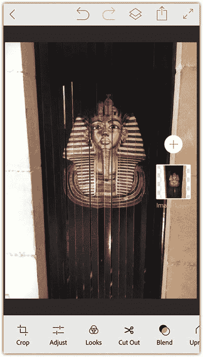

   **图 4-38** 在`Photoshop Mix`中打开照片
3. 选择顶层。点击`抠图`。
4. 选择`智能`工具，然后在左侧设置中点击`减去`。在照片上拖动以移除所有内容，只保留右侧墙壁的正面（见图 4-39）。

   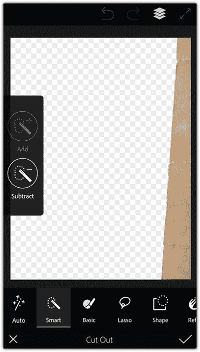

   **图 4-39** 使用`智能`工具移除图层元素并保留右侧墙壁
5. 在底部工具栏中，点击`优化`。在左侧设置中，拖动`羽化`值将其设为`15`。
6. 点击`应用`图标。
7. 点击右侧墙壁图层以打开其属性，然后点击`水平翻转`。
8. 拖动以将右侧墙壁放置在左侧，并根据需要修改其大小和位置（见图 4-40）。

   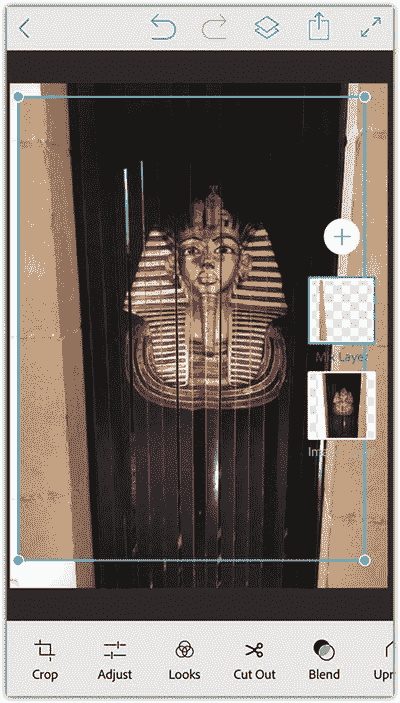

   **图 4-40** 镜像并定位墙壁至左侧
9. 点击`调整`图标，将`高光`增加至`5%`，然后点击`应用`图标。
10. 使用`裁剪`图标裁剪修复区域周围仍然可见的照片边缘，然后点击`应用`图标（见图 4-41）。

    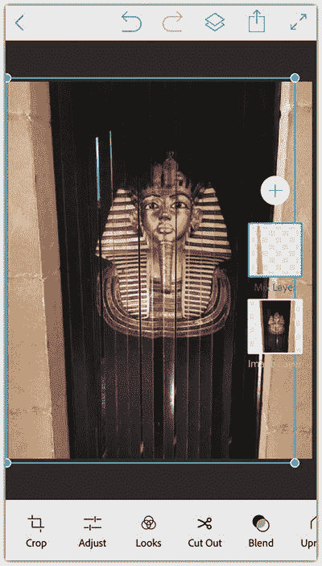

    **图 4-41** 裁剪图像周围不需要的区域

### 步骤 2：将照片转换为黑白

请按照以下步骤将照片转换为黑白：

1. 点击`共享`图标，将照片保存到`相机胶卷`。
2. 点击加号图标添加一个图层。添加你刚刚保存的照片，以获得一个合并的照片副本。
3. 点击`调整`图标，将`饱和度`值向左拖动，将照片转换为黑白（见图 4-42）。
4. 点击`应用`图标。

   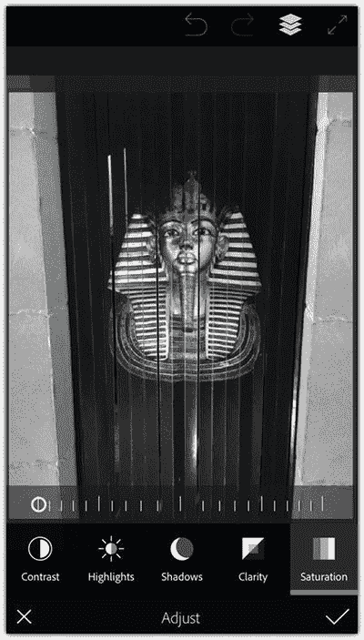

   **图 4-42** 降低图层饱和度以转换为黑白

### 步骤 3：为国王的面具添加颜色

请按照以下步骤操作：

1. 选中黑白图层后，点击`抠图`图标。
2. 点击`基础`图标，然后在左侧设置中点击`橡皮擦`。
3. 在面具上涂抹，以移除黑白版本并显示其下方的彩色版本。然后点击`应用`图标（见图 4-43）。
4. 点击`共享`图标，将最终结果保存到你的`相机胶卷`。

   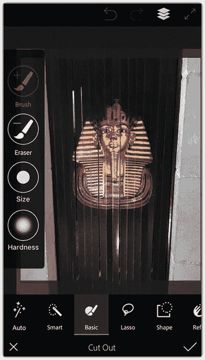

   **图 4-43** 移除黑白面具以显示彩色面具

## 本章小结

在本章中，你探索了如何进一步进行照片编辑。所提供的技巧通过多个示例展示了如何使用应用程序来应用滤镜、添加边框以及为同一个项目处理多张照片。你可以使用提到的应用程序，用自己的照片尝试练习，并根据照片的特性调整设置。

## 练习

首先思考一张可以用来营造神秘或戏剧效果的照片。然后，根据你的想法对照片进行准备。例如，移除背景并调整颜色。完成后，你可以在基于图层的应用程序（如`Photoshop Mix`和`Photofox`）中构建构图。

