# 5. 与桌面版 Adobe Lightroom 集成

为了扩展 iPhone 的摄影功能，你可以将手机上编辑过的照片与`Adobe Lightroom`桌面版应用程序集成。使用`Adobe Lightroom`移动应用程序的优势之一在于，它允许你从手机端切换到同一应用程序的桌面版。这样你就可以在更大的屏幕上继续修改照片，从而帮助你看到照片中更多的细节。

在本章中，你将探索如何通过`Adobe Lightroom`移动应用程序与桌面版应用程序的集成，来扩展 iPhone 的摄影功能。你将使用`Camera Raw`技术拍摄照片。

## 为照片评分、标记并整理

在开始将文件从手机集成到`Adobe Lightroom`桌面版之前，你需要整理和筛选图像，以便轻松识别出最适合在后续照片编辑步骤中使用的优质照片。

`Lightroom`应用程序提供了一种全面的方式来整理和排列照片。在手机上的`Lightroom`应用程序中，你可以查看照片并为其评分，以便在照片编辑项目中轻松识别它们。你可以按以下方式在`Lightroom`中查看照片并评分：

1. 打开`Lightroom`应用程序。
2. 从图库或`相机胶卷`中选择一张图像。
3. 在顶部菜单中，将模式设置为`评分与审核`。
4. 在屏幕左侧上下滑动以显示评级星标。你可以通过上下拖动来为选定的图像评分。你也可以使用图像底部的星标进行评分，如图 5-1 所示。

   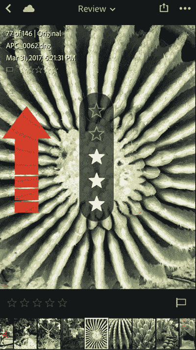

   **图 5-1** 在照片左侧上下滑动以添加评分
5. 在屏幕右侧上下滑动以打开标记选项。这允许你在已标记、未标记或已拒绝之间进行选择。上下拖动以在三个选项中选择。你也可以使用图像右下角的标记图标来标记图像，如图 5-2 所示。

   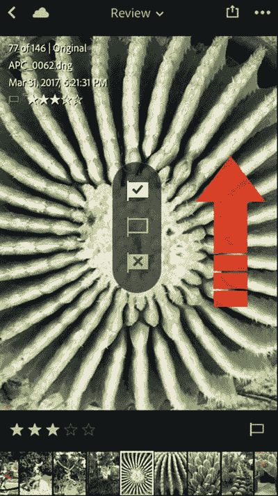

   **图 5-2** 在照片右侧上下滑动以添加评分

此外，你可以使用`信息`部分为照片添加标题、说明文字和版权信息，以便进行整理。

照片评分完成后，你可以在`Lightroom`应用程序图库中按评分排序显示它们。请按照以下步骤操作：

1. 打开`Lightroom`应用程序图库。
2. 点击`Lightroom 照片`下拉列表。
3. 选择`分段`标签。这允许你根据评分、标记、点赞和评论来筛选照片，如图 5-3 所示。

   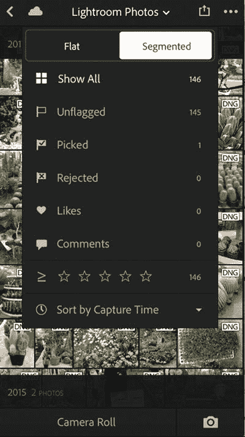

   **图 5-3** 点击`Lightroom 照片`以访问筛选选项
4. 将标记设置为`已选`，仅显示被评为五星的照片，如图 5-4 所示。

   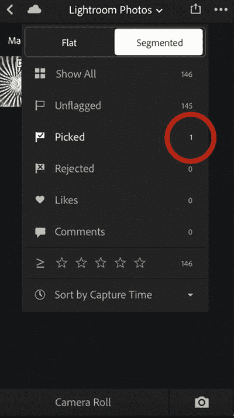

   **图 5-4** 点击筛选选项仅显示符合该条件的图像
5. 移除评分筛选器以再次显示所有照片。

### 管理集合

Adobe Lightroom 还允许你将照片整理到集合中。例如，你可以将所有相关的照片分组到一个易于访问的集合中。当你打开 Lightroom 应用时，可以查看所有集合或特定集合。如果你看不到所有集合，只需点击屏幕顶部的`返回`箭头即可回到`集合`视图。

你可以通过点击屏幕右上角的加号图标来创建新集合。输入集合名称并点击`确定`，如图 5-5 所示。

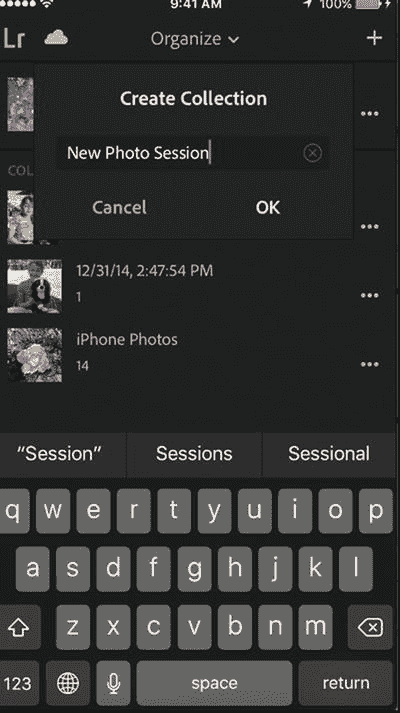
图 5-5  
在 Lightroom 应用中创建新集合

此外，你可以按照以下步骤向集合中添加照片或对集合应用不同选项：

1. 点击集合右侧的图标以选中它。  
2. 点击`添加照片`，如图 5-6 所示。

   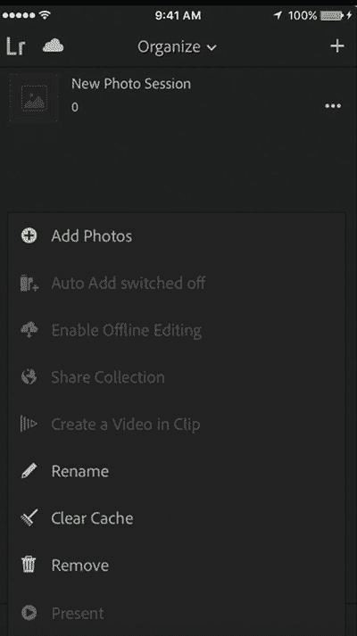  
   图 5-6  
   点击`添加照片`将照片添加到选定的集合  
3. 选择要添加到集合的照片。从右上角的菜单中，您可以按类型筛选照片：`照片`、`视频`或`原始`。  
4. 点击`添加照片`将这些照片添加到集合中，如图 5-7 所示。

   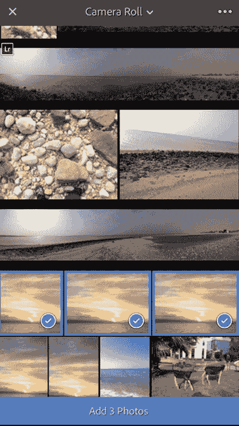  
   图 5-7  
   选择多张图像将其添加到集合

## 在 Lightroom 中拍摄原始照片

你日常可能经常使用的常见照片格式，例如`JPG`、`PNG`和`GIF`，被称为已处理格式，这意味着相机处理器会将与照片相关的信息（如颜色、曝光和白平衡）与照片的灰度数据结合起来生成最终图像。虽然有多种应用程序和工具可以帮助你编辑已处理的照片，但由于图像上已经发生的处理过程，其编辑能力是有限的。

与这些格式不同，`Camera Raw` 技术保持照片未经处理的状态，这意味着当你使用相机或 iPhone 拍摄照片时，图像的灰度信息与图像信息分开保存。这些信息被称为元数据`XML`文件。这项技术扩展了你的编辑能力，因为你只需更改图像的元数据，而无需更改图像本身。这意味着你可以多次修改一张图像。

`Camera Raw` 技术在许多相机中都可使用，每个品牌都有自己的`Camera Raw`格式。然而，`DNG`是一种通用格式，可在多种设备上使用，并与`Camera Raw`插件兼容。iPhone 通过`Lightroom`应用支持`Camera Raw`格式。

请注意，`Camera Raw`图像的体积非常大；它们可能会占满你手机的存储空间。因此，请谨慎使用此功能，并只对选定的少数图像使用。你可以在需要时才激活此选项。在`Lightroom`应用中，你可以按照以下步骤以`DNG Camera Raw`格式拍摄照片：

1. 打开`Lightroom`应用。  
2. 使用你的`Adobe ID`登录。  
3. 点击屏幕右下角的相机图标，如图 5-8 所示。

   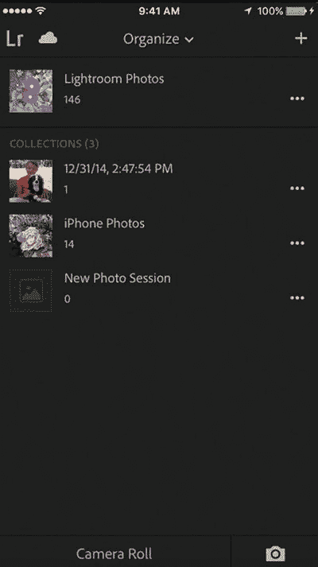  
   图 5-8  
   点击相机图标进入`相机`应用  
4. 点击屏幕顶部中央的`文件格式`。  
5. 拖动滑块在`JPG`和`DNG`格式之间选择，如图 5-9 所示。

   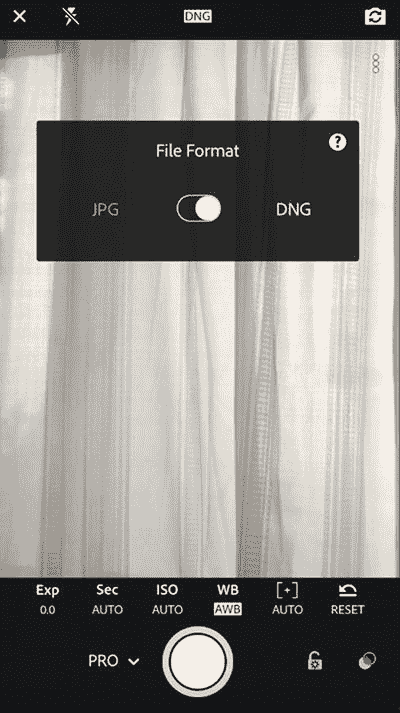  
   图 5-9  
   拖动滑块在`JPG`和`DNG`（`Camera Raw`）之间切换

设置好照片格式后，`Lightroom`会提供三种拍照模式，分别是`自动`、`专业`和`高动态范围`，如图 5-10 所示。`自动`模式允许你快速拍摄`Camera Raw`照片，无需担心不同的相机设置。`专业`模式让你可以控制图像属性，包括快门速度、`ISO`和光圈。选择第三种方法`高动态范围`（`HDR`）时，你可以按住不放，让手机拍摄多张不同曝光值的照片。然后，手机会自动处理所有照片以创建`HDR`照片效果。

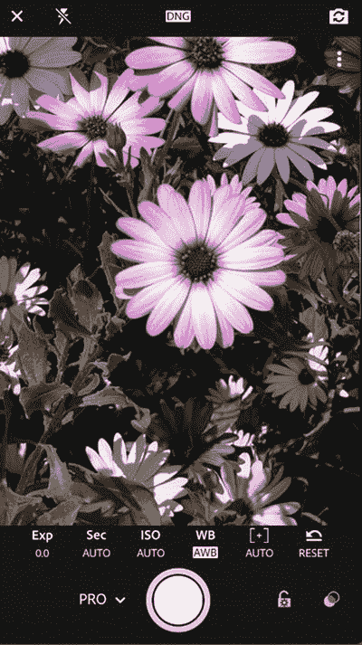  
图 5-10  
`Lightroom`应用中的`专业`摄影模式

在以下步骤中，你将探索如何使用`专业`模式拍摄`Camera Raw`照片：

1. 从快门按钮左侧的选项中，将模式设置为`专业`。  
2. 使用`曝光`值来改变照片对光的曝光程度。更高的曝光值意味着照片中光线更多，而更低的值则意味着照片光线较暗。  
3. 快门速度（`Sec`）让你决定相机快门打开和关闭的速度。高速快门意味着光线更少，画面更稳定；适合拍摄动态场景，比如玩耍的孩子。低速快门意味着光线更多，稳定性较差；适合拍摄静态照片或自然风光。不过，建议你使用三脚架以确保画面稳定。如果你不确定最适合自己的快门速度，只需将滑块拖到最左侧，将其设置为`自动`。  
4. `ISO`值决定了感光度。高`ISO`意味着对光高度敏感；但是，它可能会导致图像中出现“噪点”。因此，建议不要使用非常高的`ISO`值。  
5. 白平衡（`WB`）让你可以在不同的白平衡模式之间进行选择，例如`钨丝灯`、`荧光灯`、`日光`和`阴天`。  
6. `对焦`值让你决定照片中的焦点区域。较低的值代表浅景深，它会使得近处的物体清晰而对焦，而远处的物体看起来模糊。较高的值会创建清晰的场景，没有任何模糊效果。

## 与桌面版 Lightroom 集成文件

在 iPhone 上使用`Lightroom`应用拍摄和编辑照片的主要优势之一，是能够将你的照片与该应用的桌面版本进行集成。通过这种集成，你可以用手机拍摄照片、进行编辑，然后将其传输到桌面应用，以进行更高级的修改和利用更丰富的编辑功能。在 iPhone 上的`Lightroom`应用与桌面版之间集成照片主要有两种方法：使用云存储，以及从移动应用导入照片。

### 通过云端整合照片

此方法允许你通过 Adobe Creative Cloud 会员资格，在手机上的 `Lightroom` 应用与桌面应用之间进行同步。如果你正在进行摄影项目或照片编辑，可以注册摄影版 Creative Cloud 会员，该会员资格除了移动应用外，还允许你使用诸如 `Lightroom` 和 `Photoshop` 等桌面照片编辑应用。

一旦手机上的照片完成同步，它们便可在桌面的 Adobe `Lightroom` 中获取，包括应用于图像的所有修改。

1. 打开手机上的 `Lightroom` 应用，并使用你的 Adobe ID 登录。
2. 在 `Lightroom` 图库中，点击左上角的云图标。这将通过云端同步所有照片。
3. 点击其中一张照片，并使用不同的 `Lightroom` 功能进行编辑。修改照片后，点击左上角的云图标，将更改同步到云端，如图 5-11 所示。

   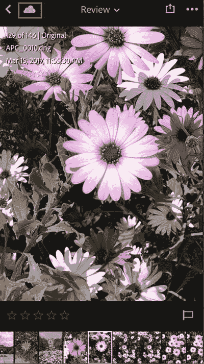

   **图 5-11** 点击云图标同步图像修改

4. 现在，转到电脑上的 `Lightroom` 应用程序。
5. 在左侧，点击 `iPhone`。点击 `导入的照片` 以显示同步的照片。
6. 选择你在手机上编辑过的照片，如图 5-12 所示。

   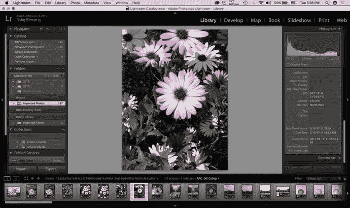

   **图 5-12** 你可以在电脑上的 Adobe `Lightroom` 中显示同步的照片

7. 点击屏幕右上角的 `修改照片` 选项卡进入编辑模式。
8. 在右侧面板中，选择 `径向滤镜` 图标，如图 5-13 所示。

   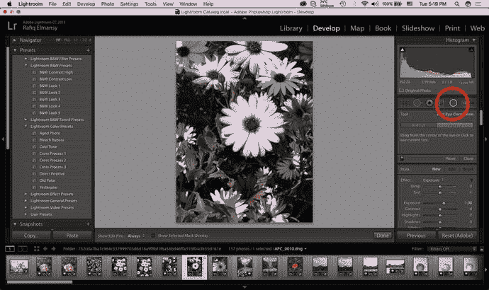

   **图 5-13** 在电脑上的 `Lightroom` 中选择 `径向滤镜` 图标

9. 拖拽在图像上创建一个径向滤镜。
10. 将 `饱和度` 设置为 `-100`，以去除照片边缘的颜色，如图 5-14 所示。

    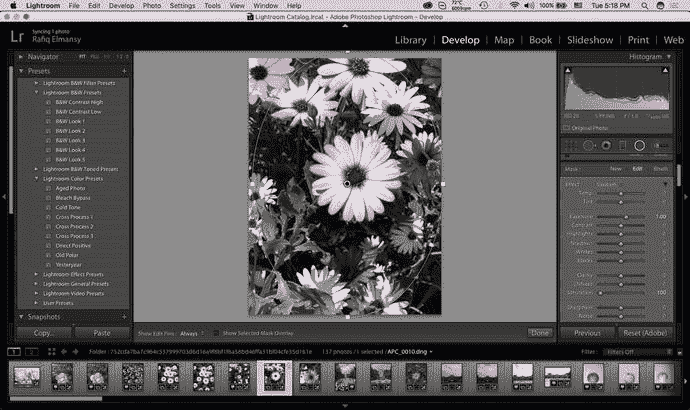

    **图 5-14** 在降低图像边缘饱和度的同时应用径向滤镜

> **注意**  
> 要使用同步功能，你需要确保电脑上安装了 Adobe `Lightroom CC` 或更高版本。

### 从你的 iPhone 导入照片

有时候，你的照片是保存在手机相册中，而非 `Lightroom` 应用本身。这些照片可能是使用其他移动应用拍摄或修改的。在这种情况下，你可以通过使用 USB 数据线连接手机和电脑，将照片直接导入到电脑上的 `Lightroom` 应用程序中。如果你没有订阅任何 Adobe Creative Cloud 会员，此方法也很有用，因为此功能可以配合免费的 Adobe ID 使用，无需支付任何会员费用。

1. 在电脑上的 Adobe `Lightroom` 应用程序中，选择 `文件` ➤ `导入照片和视频`。
2. 将 `来源` 设置为 `iPhone`，如图 5-15 所示。

   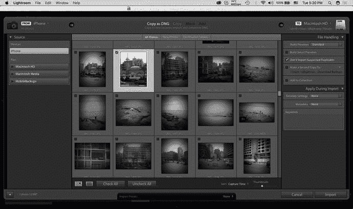

   **图 5-15** 从 iPhone 照片图库导入图像

3. 点击 `所有照片` 取消全选。
4. 选择你想要导入的照片。

照片将被导入并显示在图库中。它们也会被保存在你电脑上的默认位置。你可以从 `首选项` 对话框（macOS 上为 `Lightroom` ➤ `首选项`，Windows 上为 `编辑` ➤ `首选项`）更改导入照片在电脑上的保存位置，如图 5-16 所示。

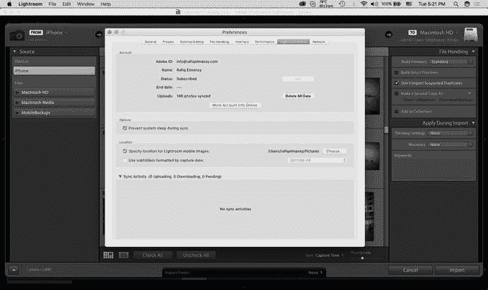

**图 5-16** 在 `首选项` 对话框中更改导入文件夹

## 使用其他 Raw 照片应用

Adobe `Lightroom` 并非唯一一个允许你拍摄 Camera Raw 照片的移动应用。500px 推出的 `RAW` 应用是一个免费应用，你可以下载并使用它来拍摄 Raw 照片；你还可以修改这些照片并将其上传到你在 [`www.500px.com`](http://www.500px.com) 的个人资料中，这是一个供摄影师展示其摄影作品的社交网络。你可以将照片保存在 iPhone 的“相机胶卷”中以供进一步修改。要使用 `RAW` 应用拍摄 Raw 照片，可以遵循以下步骤：

1. 从 App Store 安装 `RAW` 应用。
2. 使用你的 500px 免费账户登录。
3. 将快门按钮旁边的左侧滑块向右拖动以激活高级模式。在此模式下，你可以使用左侧滑块控制照片的景深。右侧滑块允许你修改照片的曝光，如图 5-17 所示。

   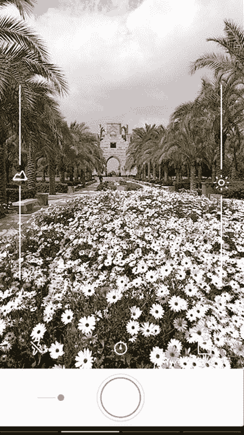

   **图 5-17** 使用 `RAW` 应用拍摄照片

4. 拍摄照片后，从右向左拖动以进入照片库，如图 5-18 所示。

   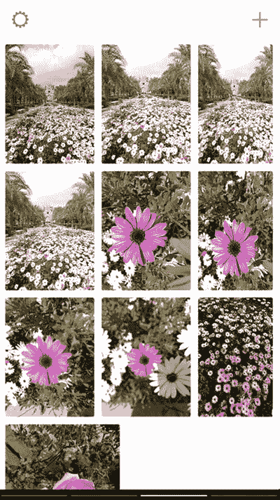

   **图 5-18** 从 `RAW` 应用图库中选择照片

5. 选择照片进行修改，并使用底部的图标进行裁剪、调整或应用预设，如图 5-19 所示。

   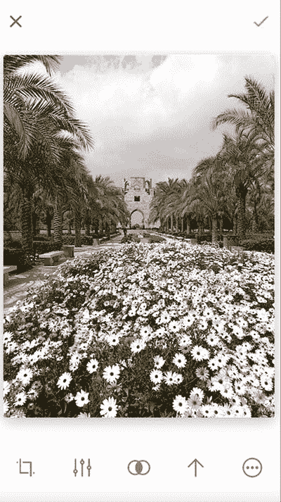

   **图 5-19** 在 `RAW` 应用中编辑 Raw 照片

6. 修改完成后，点击右上角的图标以应用更改。

## 总结

你可以通过拍摄 Camera Raw 照片来扩展你的 iPhone 摄影技能，这些照片是未经处理的图像，能最大限度地提高你在拍摄后修改照片的能力。即使你拍摄照片时的环境不太理想（例如光线条件不佳），这也能帮助你创作出专业的照片。你还可以通过将移动应用与其桌面摄影版本集成，以使用更高级的功能，从而扩展你的摄影技能。

Adobe `Lightroom` 是摄影师最顶级的摄影和照片编辑应用之一。它可以帮助你使用 iPhone 拍摄照片，然后与桌面版集成，以便应用更精确、更深入的图像编辑技术。这可以帮助你制作出专业水准的照片成果。

除了 `Lightroom` 应用之外，还有其他应用可以帮助你拍摄 Camera Raw 图像，例如 500px 提供的 `RAW` 应用。它允许你拍摄 Raw 照片，进行修改，并以 Camera Raw 格式保存在 iPhone 上。你还可以通过你在 500px 网站上的个人资料分享这些照片。

## 实践练习

对于本次练习，请通过 `Lightroom` 应用或任何支持 Raw 格式的应用，使用 Camera Raw 技术拍摄一些照片。然后使用此应用修改你的照片，将它们分享到 Facebook 群组，并与你的同伴讨论结果。

