# 6. 在桌面上将你的照片与 Adobe Photoshop 集成

正如你在前一章所学到的，将 iPhone 与电脑之间的照片编辑任务进行整合，有助于你创作出更出色的照片。你可以利用电脑上功能完备的照片编辑应用（如 `Photoshop` 和 `Lightroom`）来增强和处理你的照片。当你将照片从 Adobe 移动应用发送到桌面应用时，可以保留图层、效果和调整。

## 准备将 iPhone 集成

为了在 iPhone 上的 Adobe 应用与桌面版本之间进行集成，你需要从应用内登录 Creative Cloud。这样你就能通过 Creative Cloud 与电脑共享文件。实际上，你可以通过 Creative Cloud 集成所有 Adobe 移动应用。以下步骤演示如何从 Lightroom 应用连接到云：

1.  打开 Adobe Lightroom 应用。如果你尚未登录，你会看到一个`登录`按钮；点击它。
2.  在`登录`屏幕上，输入你的 Adobe ID 用户名和密码，然后点击`登录`（见图 6-1）。

    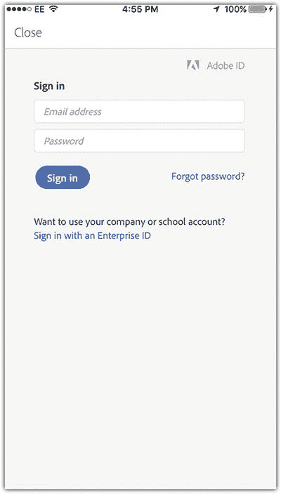

    图 6-1 登录进入 Creative Cloud

3.  点击左上角的 Lightroom 徽标图标以打开应用菜单（见图 6-2）。
4.  激活`仅通过 Wi-Fi 同步`，以避免消耗你的移动数据流量，并确保仅在连接 Wi-Fi 时进行同步。
5.  停用`阻止休眠`，允许手机在同步时进入休眠状态，这样可以节省电量。
6.  激活`加载全分辨率`，以便为照片使用最高分辨率。
7.  激活`自动添加照片`以自动同步照片。
8.  停用`自动添加视频`以避免同步视频。

    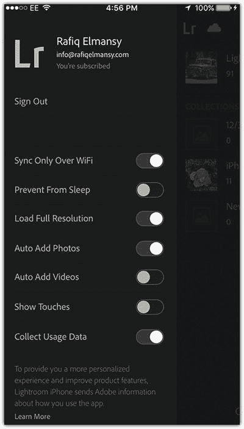

    图 6-2 Creative Cloud 同步设置

要查看已同步的文档，你需要在 iPhone 和电脑上都安装 Adobe Creative Cloud 应用。当你在 iPhone 上登录云应用后，就能根据文档类型查看已同步的文档（见图 6-3）。

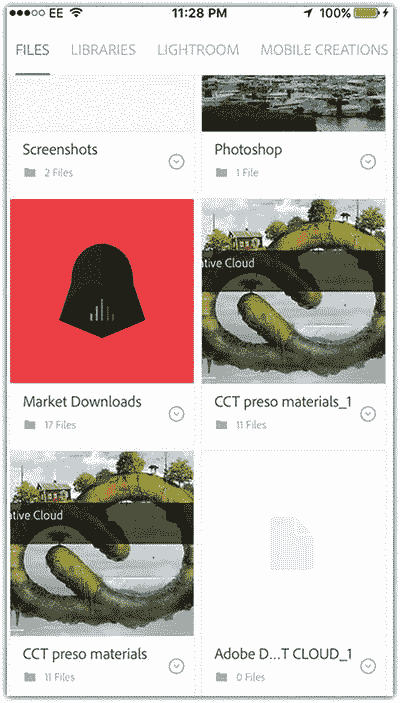

图 6-3 从 Creative Cloud 控制台查看已同步的文档

在你的桌面电脑上，Creative Cloud 控制台允许你查看云文档、查找可下载的应用、查找字体以及查看关注者的更新（社区）。你还可以按以下方式访问从 iPhone 保存到云存储的文档：

1.  打开 Creative Cloud 控制台。如果尚未下载，你可以从 Adobe.com 下载。
2.  点击`资源`标签，然后选择`文件`。在这里，你可以了解存储空间、订阅类型（免费或付费）以及文件更新状态。
3.  点击`打开文件夹`以打开本地文件夹，你可以在其中找到从 iPhone 同步的文件（见图 6-4）。

    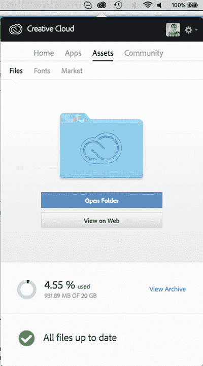

    图 6-4 从主菜单设置 Lightroom 选项

## 与桌面版 Photoshop 集成文件

一旦你登录 iPhone 的 Adobe 应用并准备在应用与桌面应用之间同步照片，你就可以将这些应用中的文件发送到桌面版本，文件将在云端同步。然后文件会在关联的应用中自动打开。在以下示例中，你将把 Photoshop Fix 应用中的文档发送到桌面版 Photoshop，并探究发送的文件如何保留其结构：

1.  确保桌面电脑上已安装 Creative Cloud 控制台应用，并且电脑和 iPhone 都已连接互联网。
2.  在 iPhone 上打开 Photoshop Fix 应用。
3.  选择一个现有项目或创建一个新项目。确保文件已优化且没有不需要的图层，以避免应用与桌面版 Photoshop 之间的同步速度变慢（见图 6-5）。

    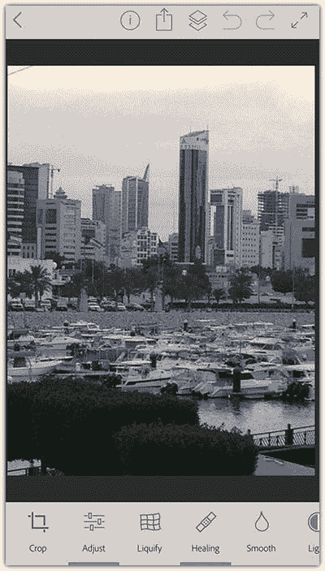

    图 6-5 Photoshop Fix 中的一张照片

4.  点击共享图标。你可以选择将文档发送到 Photoshop CC、保存到 Lightroom 应用，或仅保存到云存储。选择`发送到 Photoshop CC`（见图 6-6）。

    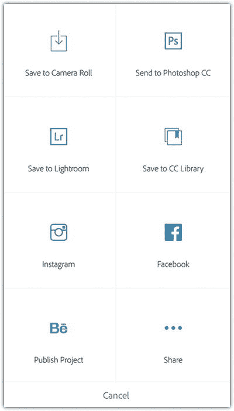

    图 6-6 与 Photoshop CC 共享项目

请注意，桌面版 Photoshop 会打开并显示该文档。在`图层`面板中，你可以查看应用于照片的效果和调整。例如，如果你应用了任何修复效果，它们会显示在原始照片上方的新图层中。这种非破坏性修改有助于你在桌面版 Photoshop CC 中打开后，仍能编辑和修改这些效果（见图 6-7）。

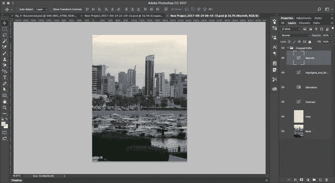

图 6-7 Photoshop CC 中的照片

## 在电脑上完成 iPhone 照片编辑

所用工具：Photoshop Fix 应用、Photoshop CC 桌面版

图 6-8 显示了我在本例中使用的原始照片。

图 6-8 原始照片

图 6-9 显示了最终结果。

图 6-9 最终结果

为了练习 iPhone 与电脑之间的集成，我用 iPhone 拍摄了一张英国纽卡斯尔市的照片。我将使用 Photoshop Fix 应用编辑这张照片。然后将其发送到 Photoshop CC，通过添加噪点来完成项目，以营造复古风格效果；接着在照片边缘应用暗角效果。要继续操作，请继续阅读。

### 步骤 1：在 iPhone 上修复照片

具体步骤如下：

1.  打开 Photoshop Fix。点击加号图标以创建新项目。
2.  点击`我的照片`，然后导航到“相机胶卷”中的照片。
3.  点击裁剪图标以裁剪照片的底部区域。
4.  在裁剪选项中点击`原始`以保持照片的原始比例。拖拽左下边缘以移除镜头下半部分，并将焦点集中在建筑物上（见图 6-10）。

    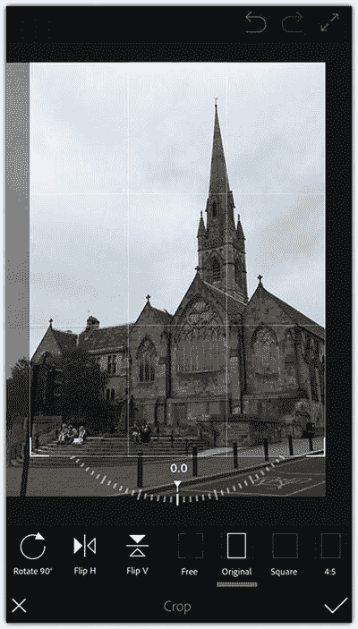

    图 6-10 裁剪照片以聚焦主体并去除干扰

5.  点击修复图标以移除镜头中建筑物上方的交通信号灯和电线。
6.  选择`仿制图章`工具。点击交通信号灯顶部旁边树木的区域（见图 6-11）。

    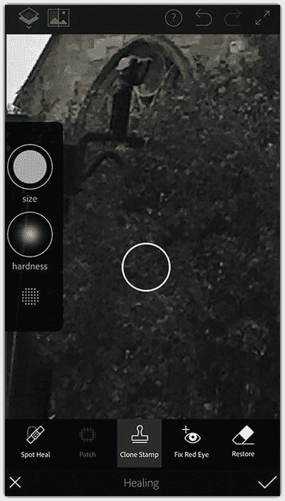

    图 6-11 使用仿制图章修复照片

7.  点击`污点修复`工具，涂抹建筑物上方的电线以将其移除；然后点击`应用`（见图 6-12）。

    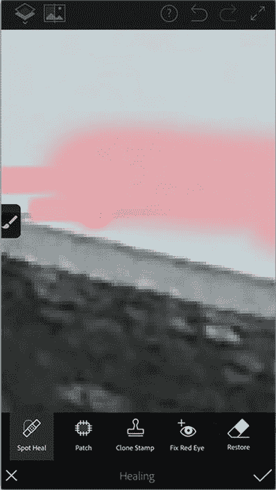

    图 6-12 使用污点修复工具

### 步骤 2：将文档发送到 Photoshop CC

要将文档发送到 Photoshop CC，请按以下步骤操作：

1.  在 Photoshop Fix 中点击共享图标。
2.  点击`发送到 Photoshop CC`（见图 6-13）。

文档将通过 Creative Cloud 更新并发送到 Photoshop CC。

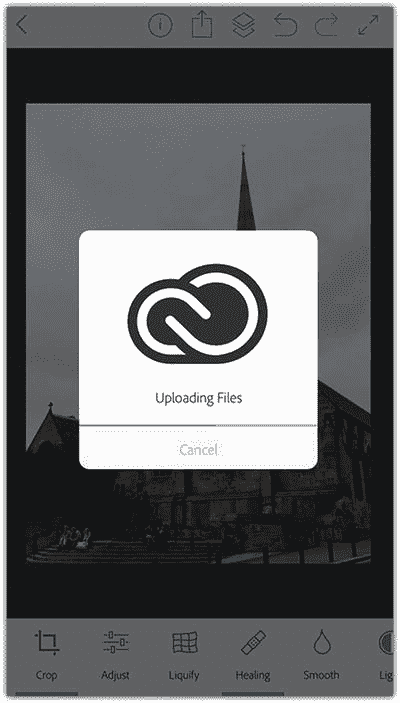

图 6-13 将照片发送到 Photoshop CC

### 第 3 步：在 Photoshop CC 中应用效果

以下是在 Photoshop CC 中应用一些效果的步骤：

1. 如果文档没有在 Photoshop CC 中自动打开，请单击 Creative Cloud 控制台，选择 `Assets` ➤ `Files`，然后单击 `Open Folder`。
2. 在 Photoshop CC 中打开照片。
3. 我想对所有文档应用效果，因此将图层组转换为智能图层。要跟随操作，请单击图层面板顶部的图层组，然后选择 `Filter` ➤ `Convert to Smart Filters`（见图 6-14）。

   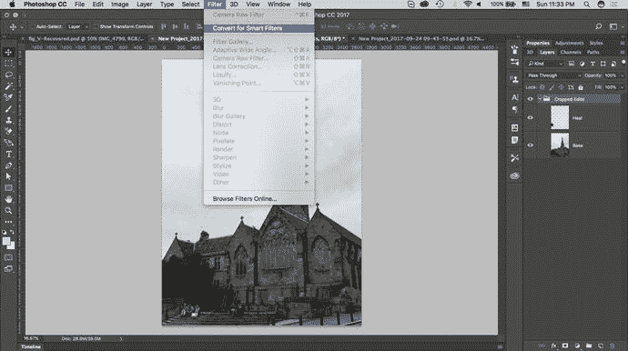

   图 6-14 将图层转换为智能对象
4. 单击 `OK` 将图层转换为智能对象。
5. 在滤镜列表中，选择 `Camera Raw Filter`（见图 6-15）。

   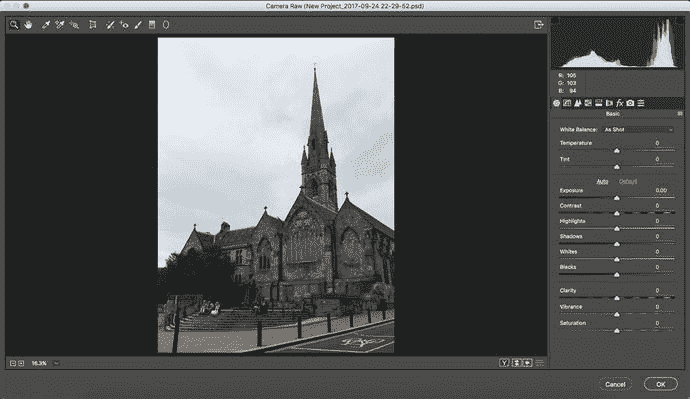

   图 6-15 在 Camera Raw 中打开图像
6. 单击右侧的 `FX` 图标。
7. 将颗粒数量设置为 `100`，大小设置为 `70`，粗糙度设置为 `70`。
8. 将裁剪后暗角的数值设置为 `-50`（见图 6-16）。
9. 点击 `OK`。

   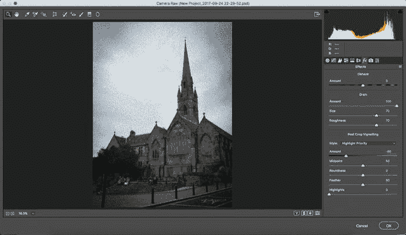

   图 6-16 在照片上应用颗粒和暗角效果

## 总结

通过将 iPhone 的修图工作与 Photoshop 和 Lightroom 等桌面应用程序集成，您可以扩展修图能力。这有助于您为作品添加更多效果和样式。此外，它还能让您在更大的屏幕上查看编辑工作的精细细节。如果您使用 Adobe 移动应用，可以通过 Creative Cloud 轻松地将工作与桌面应用程序集成。您只需将在 iPhone 上的 Adobe 应用（如 Photoshop Mix）中完成的作品发送到桌面。该文件将在桌面端的相应应用程序中打开，并且图层将得以保留。

## 练习

启动一个照片编辑项目，包括拍摄一张照片，然后在 Lightroom 或 Photoshop Fix 等 Adobe 移动应用中编辑它。接着，将文档发送到 Photoshop CC 并在其中完成后续工作。

