# 7. 将照片变成艺术品

摄影和美术都属于艺术范畴。摄影依赖相机来创作视觉艺术品，而美术则使用不同的工具，例如画笔、绘图笔、粉彩等。数字应用程序可以帮助您模拟美术工具的效果，并将其应用到照片上，从而创作出类似绘画或素描的作品。有许多应用可以帮助您在 iPhone 上创建美术效果，您甚至可以组合使用多个应用来改善艺术作品的最终效果。

本章中的技巧将展示如何将 iPhone 中的一些照片转化为美术作品。

## 创作波普艺术作品

使用的工具：Prisma 应用、Lightroom 应用

图 7-1 展示了我在本例中使用的原始照片。您可以使用类似的照片来跟随练习。

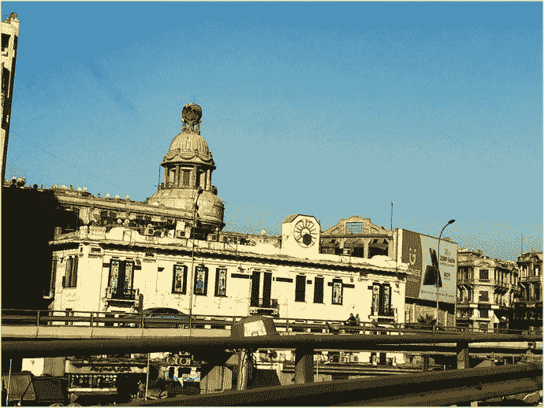

图 7-1 原始照片

图 7-2 展示了最终效果。

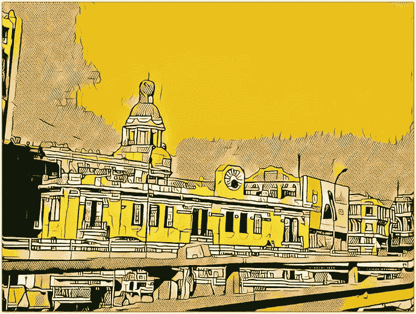

图 7-2 最终效果

在本例中，我有一张城市建筑的照片，想将其转换成“波普”艺术作品。为此，首先在 Lightroom 应用中打开照片，调整其颜色，使其更加鲜艳并具有更高的对比度。然后，在 Prisma 应用中打开它，应用艺术效果。由于 Prisma 应用对颜色的控制有限，您可以将艺术作品带回 Lightroom 以调整颜色组合。

### 步骤 1：修改照片的光线和对比度

要修改照片的光线和对比度，请按照以下步骤操作：

1. 在 Lightroom 中打开一张照片。
2. 点击裁剪图标，裁剪图像，聚焦于画面中的主要元素（见图 7-3）。

   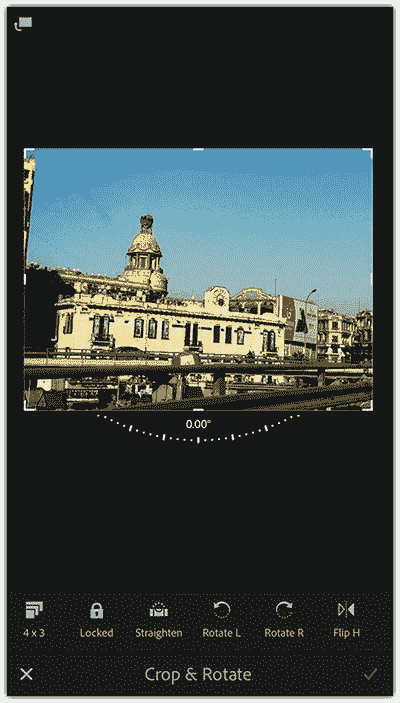

   图 7-3 在 Lightroom 应用中裁剪照片
3. 点击光线图标，增加图像的对比度。
4. 点击颜色图标，向右拖动滑块以增加鲜艳度设置（见图 7-4）。
5. 点击共享图标，选择 `Save to Camera Roll`，然后选择 `Maximum` 大小。

   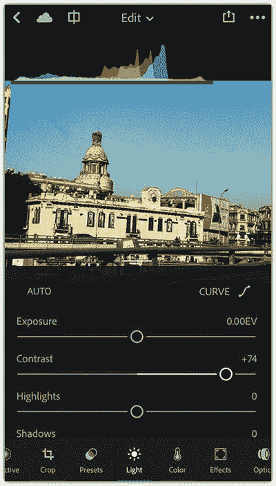

   图 7-4 增加画面的色彩鲜艳度

### 步骤 2：应用波普艺术效果

要应用波普艺术效果，请按照以下步骤操作：

1. 打开 Prisma 应用，用手指向上滑动以访问相机胶卷，然后选择您刚刚在 Lightroom 应用中修改过的照片。
2. 在底部，拖动以找到 Roy 效果；该效果可以帮助您将照片转换为波普艺术。如果您需要其他效果，可以使用任何现有效果，或点击 Store 图标购买更多艺术效果（见图 7-5）。
3. 点击共享图标，您可以通过它将照片分享到不同的社交网络或保存到 iPhone。
4. 点击底部的保存图标，将其保存到相机胶卷。

   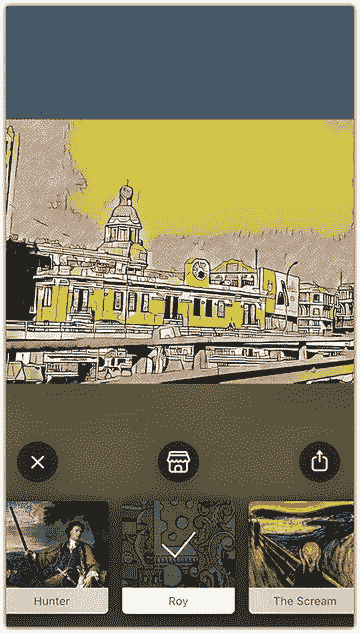

   图 7-5 在 Prisma 中应用波普艺术效果（Roy）

### 步骤 3：更改波普艺术颜色

要更改波普艺术颜色，请按照以下步骤操作：

1. 在 Lightroom 应用中打开编辑后的图像。
2. 点击预设图标，然后选择 `Cross Process 1`（见图 7-6）。
3. 点击应用图标。
4. 点击共享图标，选择 `Save to Camera Roll`，然后选择 `Maximum` 大小。

   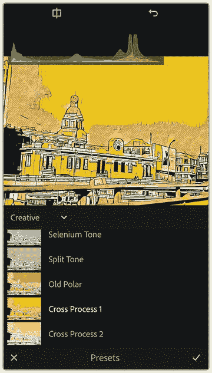

   图 7-6 在 Lightroom 应用中应用 Cross Process 1 预设

## 将照片转化为马赛克艺术作品

使用的工具：Photoshop Fix、Deep Art Effect、Photo Splash

图 7-7 展示了我在本例中使用的原始照片。

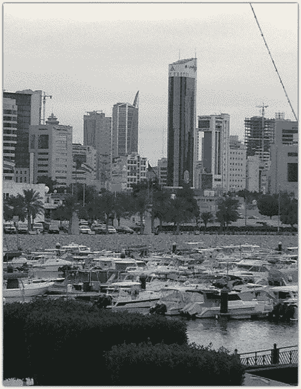

图 7-7 原始照片

图 7-8 展示了最终效果。

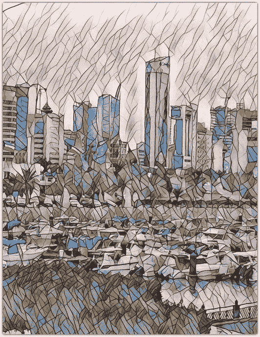

图 7-8 最终效果

在本技巧中，您将学习如何将照片转化为马赛克或立体派艺术作品。这里，我使用了一张在访问科威特期间拍摄的照片。照片展示了码头的美景，背景是摩天大楼。但是在 Deep Art Effect 应用中打开照片以创建马赛克效果之前，我想先修复照片中的一些问题，特别是横穿照片右上角的那条电线。应用效果后，我将使用 Photo Splash 应用来改善最终效果的颜色。请使用类似的照片来跟随练习。

### 步骤 1：修复基础照片

要修复基础照片，请按照以下步骤操作：

1. 在 Photoshop Fix 中打开照片。
2. 点击修复图标，然后在底部工具栏中点击 `Spot Heal`（见图 7-9）。

   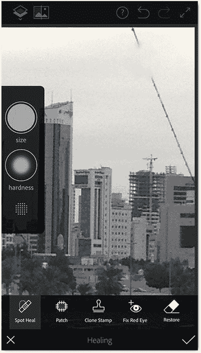

   图 7-9 使用污点修复画笔工具移除照片中不需要的元素
3. 在左侧菜单中，设置画笔的大小。
4. 在您想要移除的区域上涂抹。在这张照片中，我将在天空中的电线上涂抹（见图 7-10）。
5. 点击确定图标。
6. 点击共享图标，然后选择 `Save to Camera Roll`。

   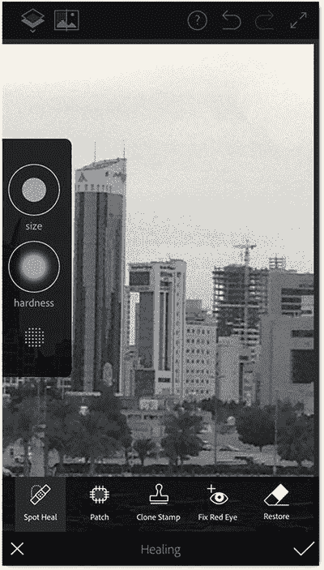

   图 7-10 涂覆您想要移除的元素

好的，作为高级文档工程师和翻译员，我将严格按照您的要求，将给定的英文文本翻译成中文，并保留所有格式和标记。

### 步骤 2：应用马赛克效果

要应用马赛克效果，请遵循以下步骤：

1.  在 `Deep Art Effect` 中打开已保存的图像。
2.  在底部效果中，选择 `Mosaic 1` 效果。该效果将需要几秒钟应用到照片上。
3.  点击 `Effect` 图标 (`Mosaic`)，然后将滑块向左拖动一点，以略微降低效果的强度（见图 7-11）。
4.  点击 `Save` 图标，将照片保存到相机胶卷。

    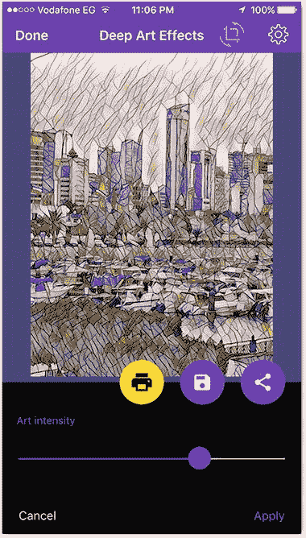

    图 7-11

    为照片应用马赛克效果

### 步骤 3：改善马赛克艺术作品的颜色

要改善马赛克艺术作品的颜色，请遵循以下步骤：

1.  在 `Photo Splash` 中打开上一步中保存的照片。
2.  点击工具栏左侧的第一个图标。使用画笔在照片上涂抹以创建蒙版（见图 7-12）。

    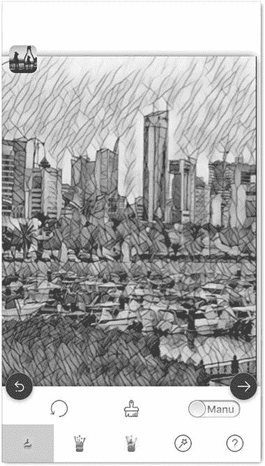

    图 7-12

    创建一个蒙版以在其上应用效果
3.  点击 `Effects` 图标，然后从左侧选择第三个效果（见图 7-13）。
4.  点击 `Next` 图标，然后点击 `Save` 图标将其保存到相机胶卷。
5.  选择你想要保存的图像尺寸。

    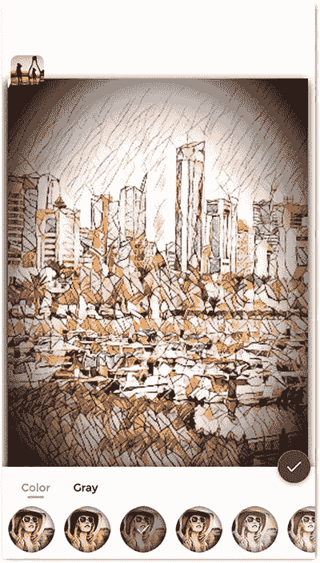

    图 7-13

    应用该效果以改善马赛克艺术作品

## 将你的照片变成一幅油画

使用的工具：`Lightroom app`， `Glaze app`

图 7-14 展示了我原始的照片。

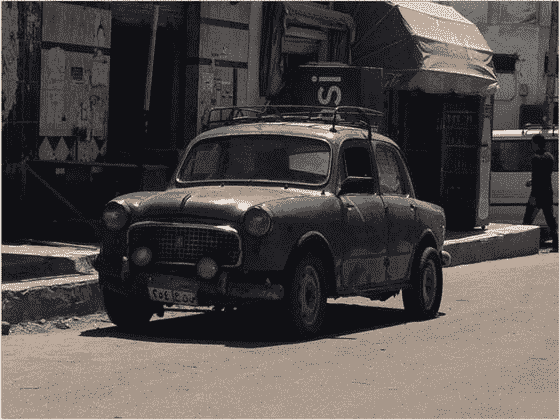

图 7-14

原始照片 (© Radwa Khali)

图 7-15 展示了本技巧的最终效果。

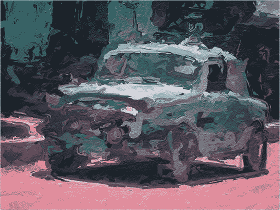

图 7-15

最终效果

油画具有惊人的艺术效果，尤其是画笔在画布上添加“颜料”以构成整个画面的方式。实际上，有许多应用程序可以帮助你创造类似油画的 artistic 效果。在本技巧中，你将学习如何为一辆旧车的照片应用油画效果。然后，你将在照片上应用颜色渐变，使其更具印象派风格。

具体来说，我将展示如何在 `Lightroom` 中修改照片，使其颜色更鲜艳，以便应用的绘画效果能利用照片中的明亮色彩。然后，我将展示如何使用 `Glaze` 应用程序将效果应用到照片上。应用效果后，照片将返回到 `Lightroom` 应用程序，以对照片的某些部分应用选择性蒙版效果，使其更具艺术色彩。

### 步骤 1：改善照片的颜色和对比度

要改善照片的颜色和对比度，请遵循以下步骤：

1.  在 `Lightroom` 应用程序中打开照片。
2.  点击 `Color` 图标，增加照片的 `Vibrance`（鲜艳度）设置。然后，点击右上角的 `Apply`。
3.  点击 `Light` 图标，稍微降低对比度。这将显示出镜头中更多的细节（见图 7-16）。

    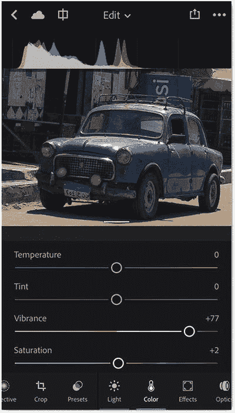

    图 7-16

    增加照片鲜艳度并降低其对比度
4.  将曝光度稍微增加到 `+0.27`，将高光减少到 `-13`，并将阴影增加到 `+25`（见图 7-17）。
5.  点击 `Apply` 图标。
6.  点击 `Share` 图标，并以最大尺寸将其保存到相机胶卷。

    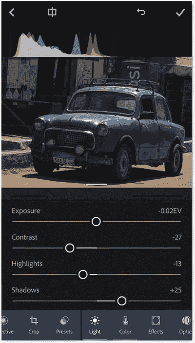

    图 7-17

    增加照片的曝光度，减少高光，增加阴影

### 步骤 2：应用油画效果

要应用油画效果，请遵循以下步骤：

1.  在 `Glaze` 应用程序中打开上一步编辑过的照片。
2.  选择一个要应用的油画效果。我使用了一个具有逼真笔触效果的效果（见图 7-18）。
3.  点击 `Share` 图标，然后选择 `Gallery` 将其保存到你的照片文件夹。

    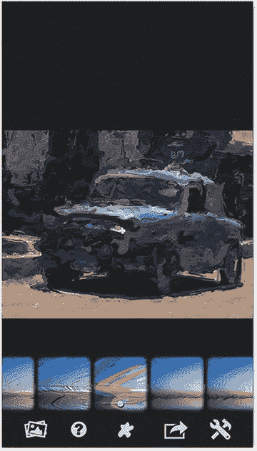

    图 7-18

    在图像上应用油画效果

### 步骤 3：改善绘画颜色

要改善绘画颜色，请遵循以下步骤：

1.  在 `Lightroom` 应用程序中再次打开上一步应用编辑过的照片。
2.  点击 `Selective` 图标，然后从屏幕左侧选择 `Linear mask`（线性蒙版）。
3.  拖动鼠标在照片的下半部分创建一个蒙版。你可以使用蒙版中间的方形来改变其位置（见图 7-19）。

    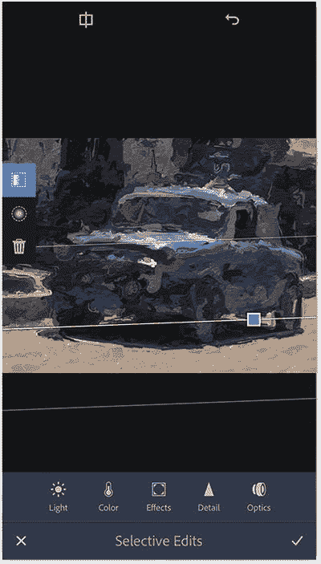

    图 7-19

    对照片下半部分应用选择性调整
4.  点击 `Color spectrum`（颜色光谱）并将点拖向红色一侧，为照片的被遮罩部分添加红色色调（见图 7-20）。

    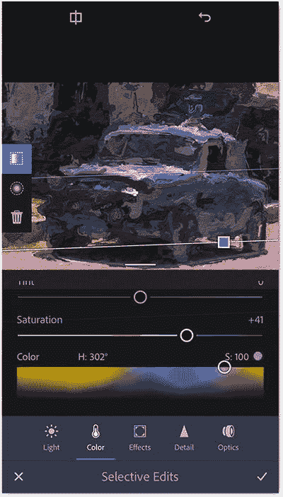

    图 7-20

    使用 `Color spectrum`（颜色光谱）为照片下半部分应用红色色调
5.  将 `Saturation`（饱和度）增加到 `+41`，然后点击 `Apply` 图标。
6.  再次点击 `Selective` 图标，以在照片的上半部分应用另一个调整蒙版。
7.  点击左侧的 `Linear` 图标。
8.  拖动鼠标在照片的顶部创建一个线性蒙版。
9.  点击 `Color` 图标，并使用 `Color spectrum`（颜色光谱）为镜头顶部添加绿色（见图 7-21）。

    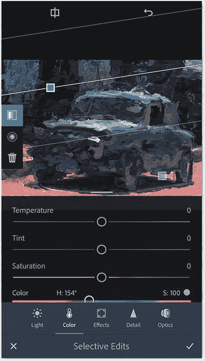

    图 7-21

    为照片上半部分应用绿色色调
10. 点击 `Apply` 图标。
11. 再次点击 `Selective` 图标，这次在照片中心应用一个 `Radial mask`（径向蒙版）。
12. 点击 `Light` 图标，并将曝光度增加到 `+1.12`（见图 7-22）。

    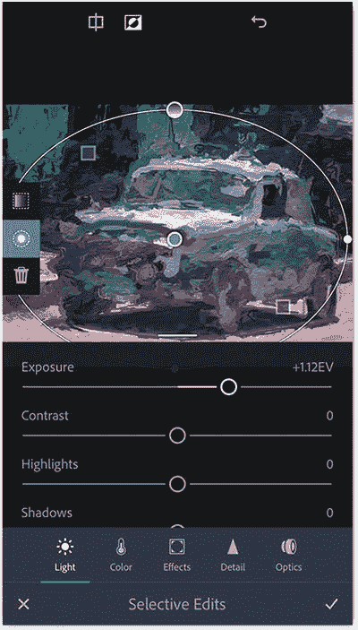

    图 7-22

    应用 `Radial mask`（径向蒙版），并增加图像中心区域的曝光度
13. 点击 `Apply` 图标。然后点击屏幕右上角的 `Apply` 图标，将图像添加到图库。
14. 再次打开它，点击 `Share` 图标，然后选择 `Save to Camera Roll`。将尺寸设置为 `Maximum` 以将艺术作品保存到你的照片图库。

## 为你的照片添加雾冬效果

使用的工具：`Tadaa app`， `Repix app`

在这个例子中，我想将一张照片转换成超现实的绘画。所以，我选择了一张几年前在巴黎用我的 iPhone 拍摄的照片，并将展示如何为其添加雾状效果。我使用了 `Tadaa` 应用程序或任何可以创建模糊效果的应用程序来为窗户添加雾气。然后，我使用了 `Repix` 应用程序在窗户上添加小水滴。最终的效果应该会让你感觉仿佛是透过一扇被雾气和薄雾水珠覆盖的窗户看向一栋建筑。

图 7-23 展示了我开始使用的原始照片。

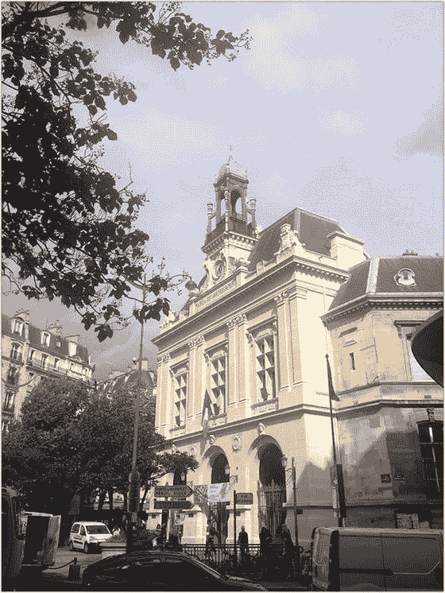

图 7-23

原始照片 (© Rafiq Elmansy)

图 7-24 展示了最终的照片。

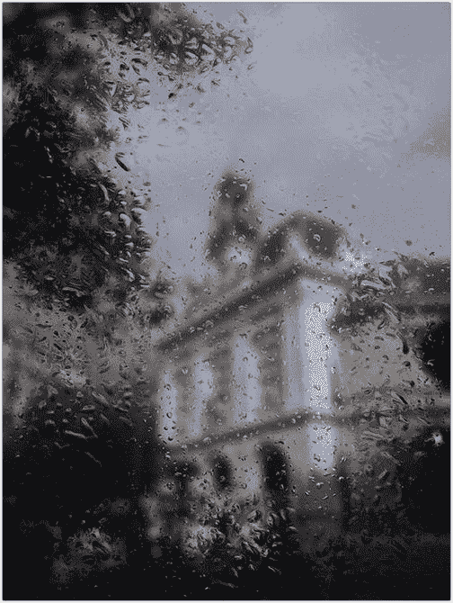

图 7-24

最终效果

### 步骤 1：为窗户添加雾气

要为窗户添加雾气，请遵循以下步骤：

1.  在 `Tadaa` 应用程序中打开照片。
2.  将工具栏向左滑动以显示 `Blur` 图标；点击它。
3.  将模糊类型设置为 `All`，并将模糊值设置为 `30`（见图 7-25）。
4.  点击 `Apply` 图标，并将照片保存到相机胶卷。

    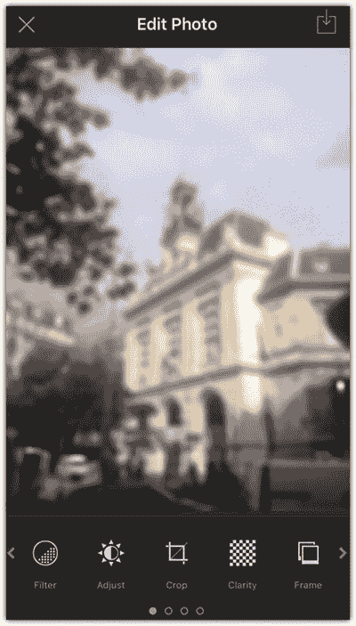

    图 7-25

    为照片应用模糊效果

### 第二步：应用水滴效果

要应用水滴效果，请按以下步骤操作：

1.  在`Repix`应用中打开照片。
2.  在工具中，轻点`雨滴`画笔一次以激活中等效果。在整个照片上涂抹，添加细微的薄雾状水滴。
3.  再次轻点画笔以切换到较大的水滴。在照片边缘涂抹，为边缘添加大水珠，同时保持中间区域清晰，以便部分展示建筑物（参见图 7-26）。

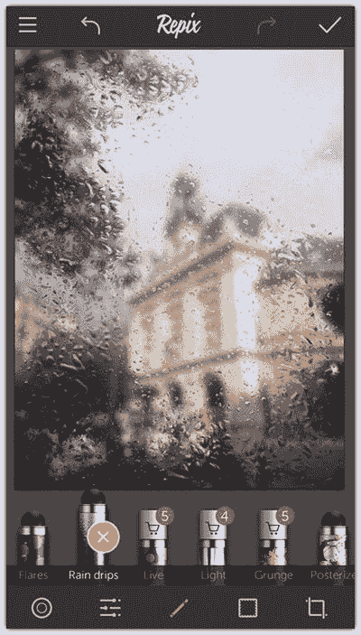

图 7-26 — 应用雨滴效果

### 第三步：改善照片的光线与色彩

要改善照片的光线与色彩，请按以下步骤操作：

1.  轻点`调整`图标。将`亮度`和`对比度`设置为`-40`，`饱和度`设置为`-25`，`自然饱和度`设置为`-10`，`色温`设置为`-15`。这样可以降低照片亮度，营造更冷的冬日效果（参见图 7-27）。
2.  轻点`应用`图标，将照片保存到`相机胶卷`中。

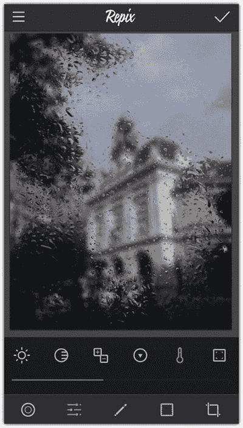

图 7-27 — 通过调整色彩、光线和色温来改善效果

## 本章小结

美术作品具有独特的外观，尤其是在笔触和表现力丰富的色彩方面。通过应用不同的效果，您可以轻松地将照片转换为一件艺术品，使其看起来像油画、水彩画等。您需要做的就是找到合适的应用，帮助模拟您想要的笔触或效果。诸如`Deep Art Effect`、`Photo Splash`和`Glaze`之类的应用可以帮助您将照片变成美术作品。结合使用多个应用的技巧可以产生更有趣的效果。在这些技巧中，在应用任何效果之前，我依靠`Lightroom`应用来调整照片的色彩和光线，并使用`Photoshop Fix`来移除镜头中不需要的元素。

## 实践练习

要练习本章的技巧，您可以使用任何您选择并希望将其转换为美术作品的照片。然后，决定要应用哪种效果。以本章的技巧为指导，达到相同的效果，并探索您还能创造出哪些其他美术作品。

