# 8. 照片后期合成项目

除了在 iPhone 上编辑照片之外，您还可以创建涉及多个应用的更大型项目。最具挑战性的部分是构思，并将在 iPhone 上创作的创意艺术品形象化。然后，您需要选择其他可以与原始照片合并以形成最终合成的照片。您使用的应用数量取决于要创建的效果。我喜欢在诸如`Photoshop Mix`之类的应用中构建合成，并使用其他应用在照片上应用滤镜和效果。

在本章中，您将探索合并照片以创建神秘场景的工作流程。您将从不同的照片中提取元素，并使用混合模式混合颜色，从而创建您的数字艺术作品。

## 创建一个幻想场景

使用的工具：???

图 8-1、8-2 和 8-3 展示了我示例中使用的原始照片。

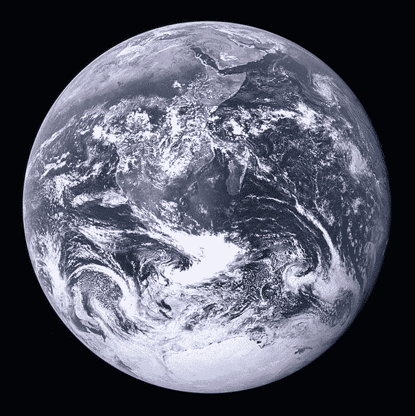

图 8-3 — 要添加的地球原始照片（来源：维基百科）

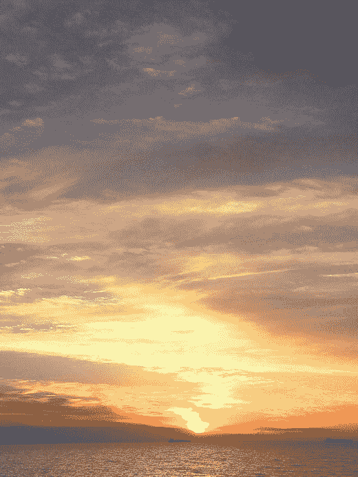

图 8-2 — 要添加的日落原始照片（© Rafiq Elmansy）

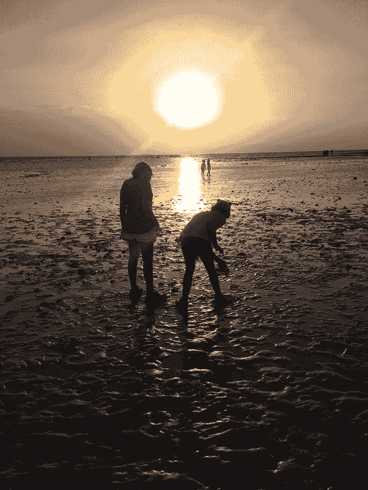

图 8-1 — 孩子们的原始照片（© Rafiq Elmansy）

图 8-4 展示了最终结果。

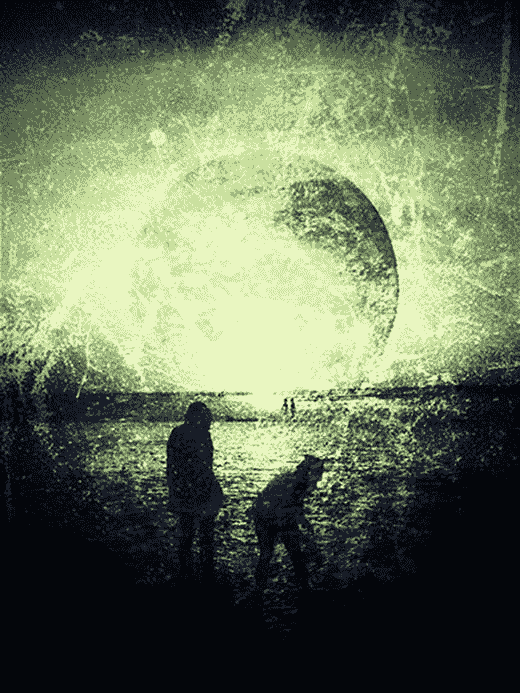

图 8-4 — 最终结果

在这个项目中，我将展示如何合并多张照片，创建一个孩子们在奇异星球上玩耍的幻想场景。因此，我将从我 iPhone 上拍摄的孩子们在海滩上的照片、一张日落照片开始，并将它们与我从互联网保存到 iPhone 的地球照片合并。由于我想要创建的照片的特殊性，这是我唯一一次使用非 iPhone 拍摄的照片。这张照片取自维基百科，属于公共领域版权。

### 第一步：准备基础场景

要准备基础场景，请按以下步骤操作：

1.  在`Photoshop Mix`中打开照片。
2.  轻点加号图标创建一个新项目，并将第一张照片添加到项目中。目前，镜头中的主要元素（孩子们）充满了屏幕。我想把他们移到照片底部，这样我就可以把太阳添加到顶部。
3.  轻点右侧图层部分的加号图标，添加一个新图层。
4.  轻点`添加新图像图层`，然后在您的`相机胶卷`中导航找到天空延伸的照片（图 8-5）。

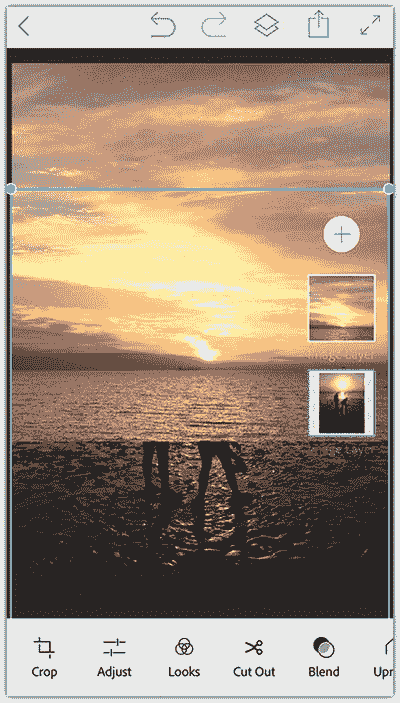

图 8-5 — 将天空添加到当前照片中

5.  使用两根手指调整顶部照片的大小，使其看起来太阳延伸到了第一张图像的上方。
6.  轻点`混合`图标，选择`变暗`混合选项。然后，轻点右上角的图标应用混合（图 8-6）。
7.  轻点`共享`图标，并将结果保存到您的 iPhone 上。

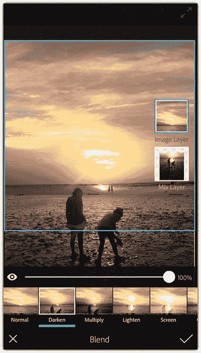

图 8-6 — 对照片应用`变暗`混合

### 第二步：去除地球背景

要去除地球背景，请按以下步骤操作：

1.  在`Eraser`应用中打开下载的地球照片。
2.  轻点底部的`擦除`图标。
3.  轻点`擦除`图标。
4.  轻点`目标`图标，然后轻点照片中的黑色背景色。然后轻点`完成`（图 8-7）。

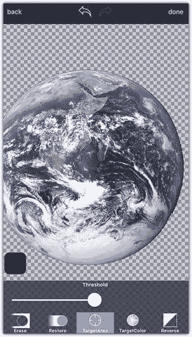

图 8-7 — 使用`目标`图标去除背景

5.  轻点`调整`图标，然后选择`平滑`工具。
6.  向右拖动滑块以增加地球边缘的平滑度（图 8-8）。
7.  轻点`共享`图标。将格式设置为`PNG`以生成透明背景的照片，并使用最大尺寸保存照片。然后轻点`保存`将其添加到`相机胶卷`中。

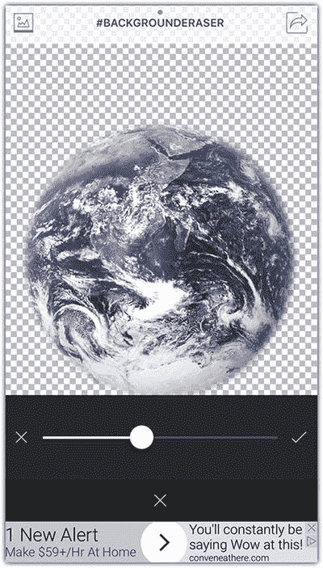

图 8-8 — 增加地球边缘的平滑度

### 第三步：将地球添加到合成中

要将地球添加到合成中，请按以下步骤操作：

1.  打开`Photofox`应用，并将本章早些时候创建的基础照片添加到其中。
2.  轻点右侧的加号图标以添加另一个图层。然后，轻点`地球`照片。
3.  使用两根手指拖动并调整地球的大小，使其位于太阳的位置（图 8-9）。

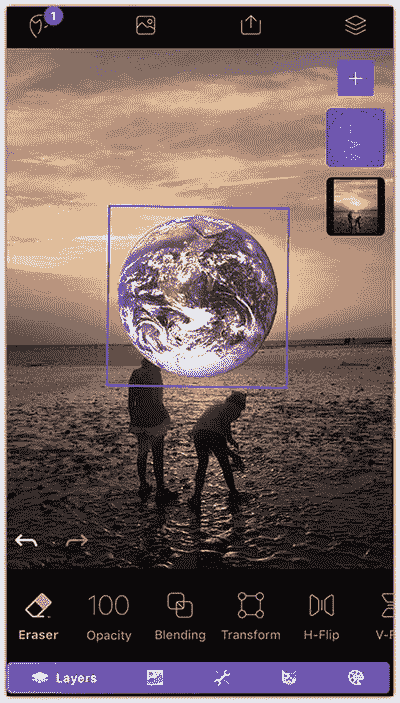

图 8-9 — 在合成中调整`地球`照片的大小和位置

4.  从底部按钮的`图层`选项卡中，轻点`混合`模式。
5.  轻点`地球`图层，将混合模式设置为`颜色加深`（图 8-10）。

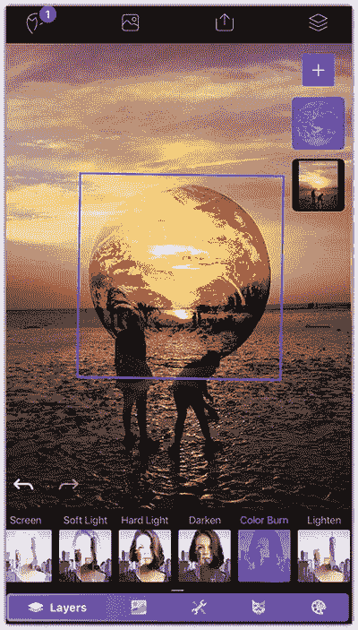

图 8-10 — 对地球应用`颜色加深`混合模式

6.  现在，我想降低地球颜色的强度。因此，我将轻点`图像`选项卡并选择`饱和度`。向左拖动顶部滑块以降低饱和度（图 8-11）。
7.  轻点右上角的`应用`图标。
8.  轻点`共享`图标，然后选择`保存到相机胶卷`。

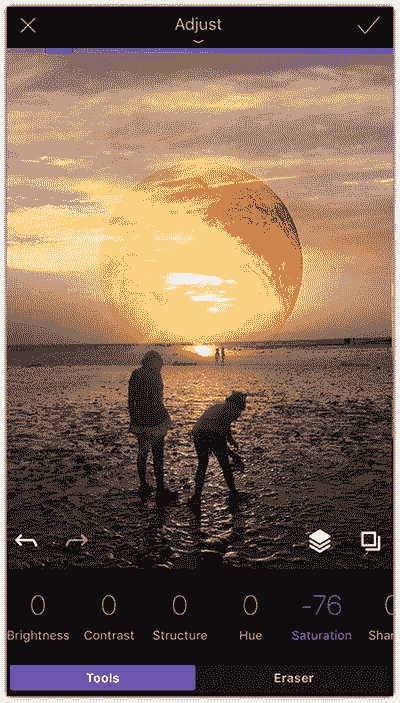

图 8-11 — 通过降低饱和度来减弱地球颜色的强度

好的，作为一名高级文档工程师和翻译员，我将严格遵循您的注意事项和示例格式，将给定的英文文本翻译成中文。

### 第 4 步：为天空增添更多效果

为了更好地营造氛围，让我们对天空稍作修改。我将展示如何使用`Fused`应用，借助一张树的照片，为天空添加闪电效果。请遵循以下步骤：

1. 打开`Fused`应用。在位于左下方的第一张照片处，点击添加来自上一步骤的照片作为第一张混合照片。
2. 点击右侧，然后选择艺术家合集。我选择了自然合集并挑选了一张树的剪影照片。
3. 在选中右侧照片的情况下，点击工具栏左侧的变换图标。
4. 用两根手指翻转树的照片并将其调整到屏幕大小。然后，点击应用图标（图 8-12）。

   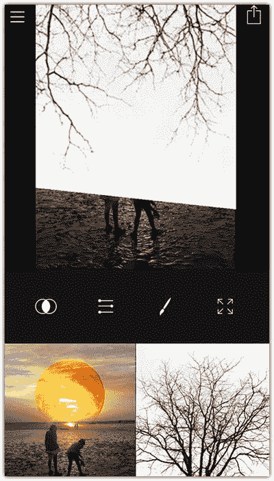

   图 8-12：为天空添加树木效果

5. 点击工具栏右侧的混合图标，选择划分模式。然后点击应用图标（图 8-13）。
6. 点击分享图标，将照片保存到相机胶卷。

   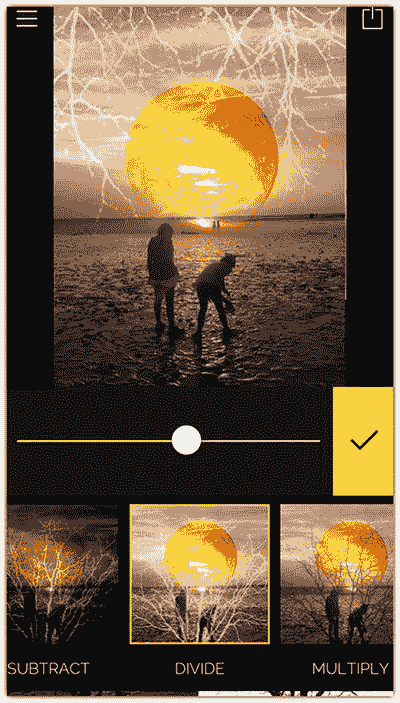

   图 8-13：为照片添加混合模式

### 第 5 步：添加垃圾摇滚效果

现在，我将切换到`Snapseed`应用，为照片添加垃圾摇滚效果，步骤如下：

1. 在`Snapseed`应用中打开照片。
2. 点击工具图标，然后选择垃圾摇滚滤镜。
3. 点击垃圾摇滚风格图标，选择效果 5。然后点击应用图标（图 8-14）。

   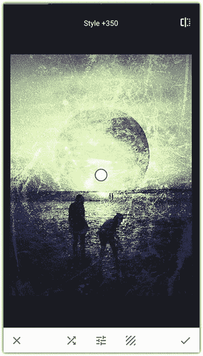

   图 8-14：为照片添加垃圾摇滚效果

4. 在工具中选择晕影工具，向左拖动滑块，然后点击应用图标（图 8-15）。
5. 点击分享图标，将最终结果保存到您的相机胶卷。

   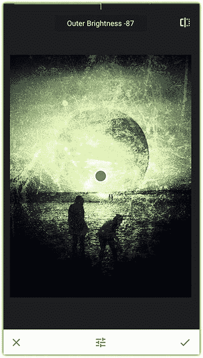

   图 8-15：添加晕影效果以创建最终结果

## 构建法老风格合成图

使用的工具：`Adobe Lightroom`应用、`Photoshop Fix`、`Photoshop Mix`、`Eraser`和`Photofox`

图 8-16、8-17、8-18 和 8-19 展示了我在本例中使用的原始照片。

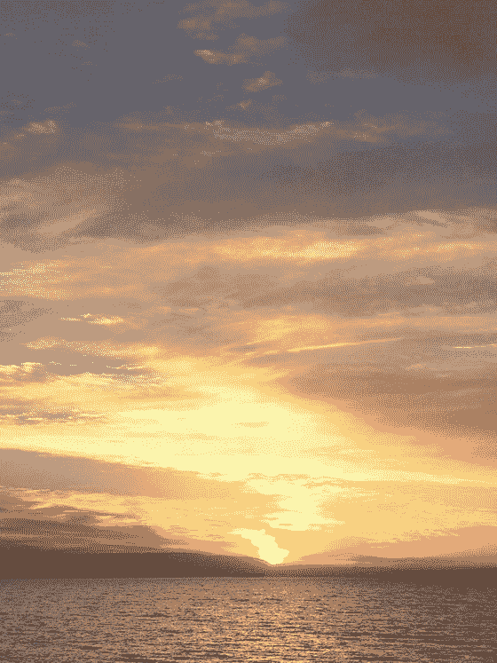

图 8-19：原始日落照片（© Rafiq Elmansy）

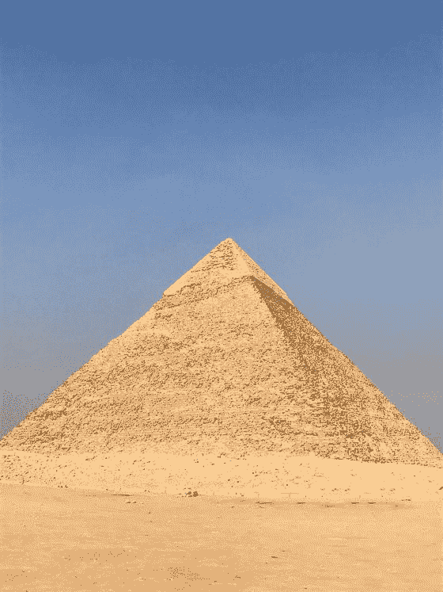

图 8-18：另一张金字塔的原始照片（© Rafiq Elmansy）

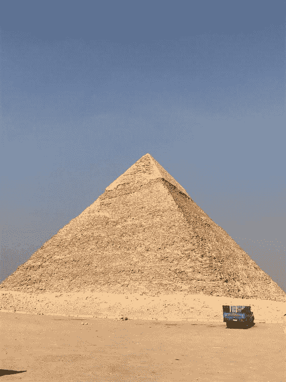

图 8-17：金字塔的原始照片（© Rafiq Elmansy）

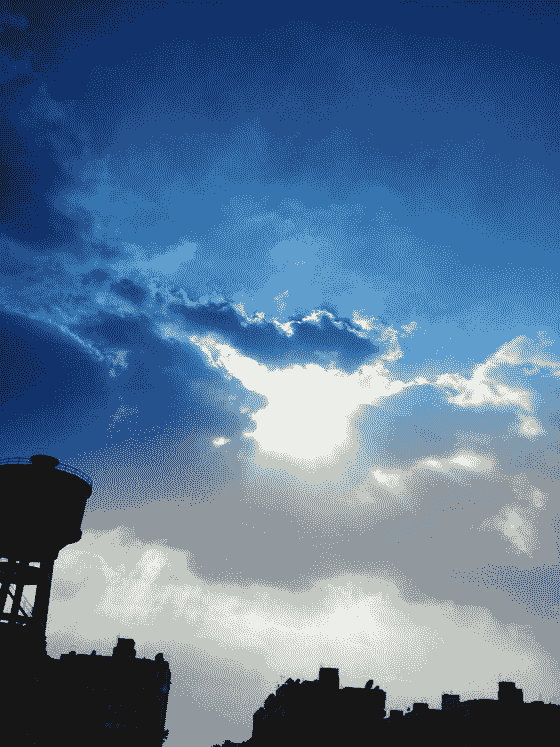

图 8-16：天空的原始照片（© Radwa Khalil）

图 8-20 展示了最终结果。

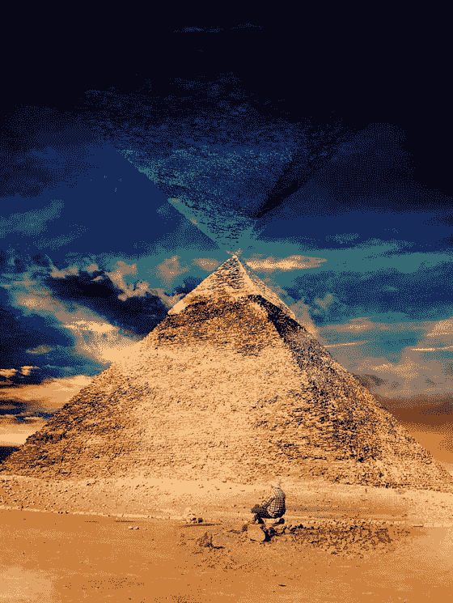

图 8-20：最终结果

您可以组合多张照片来创建神秘且超自然的合成图。虽然在电脑上处理照片可能使用像 Adobe Photoshop 这样的单个应用，但在 iPhone 上，您可能需要使用多个应用来创建所需的效果。

在我去金字塔的旅途中，我拍了一些胡夫大金字塔的照片。为了创建一幅神秘的合成图，我使用了三张照片来构建。我首先改善了照片的颜色和光线，然后创建了一个具有透明背景的副本，以呈现金字塔在天空中的倒影。接着，我添加了一片神秘的蓝色天空来覆盖照片。

### 第 1 步：优化照片颜色和光线

要优化照片颜色和光线，请遵循以下步骤：

1. 在 Adobe Lightroom 中打开金字塔照片。
2. 点击分享图标，选择编辑方式，然后选择最高可用。在 Photoshop Fix 中选择修复，以移除照片中的汽车（见图 8-21）。

   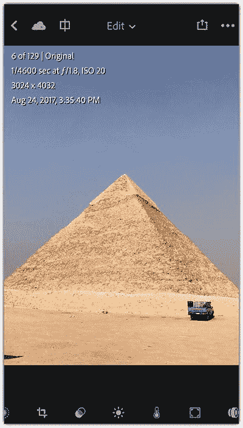

   图 8-21：在 Lightroom 应用中打开基础照片

3. 在 Photoshop Mix 中，点击污点修复图标。点击汽车和不需要的对象以将其移除。您可以使用仿制图章工具，通过复制图像的另一部分来进行更具选择性的修复（见图 8-22）。

   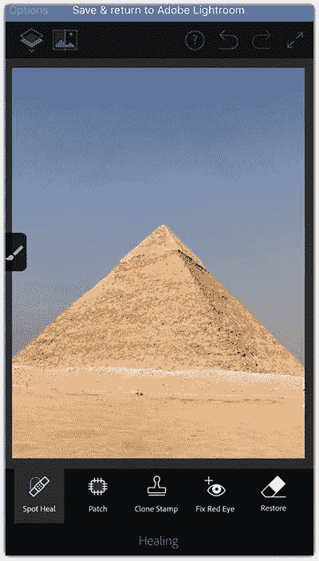

   图 8-22：使用污点修复移除不需要的元素

4. 点击顶部的蓝色条以保存并返回到 Adobe Lightroom 应用。
5. 点击灯光图标。增加照片的对比度，并减少高光和阴影。
6. 点击颜色图标，增加照片的自然饱和度设置（见图 8-23）。
7. 点击分享图标，将图像保存到您的相机胶卷。

   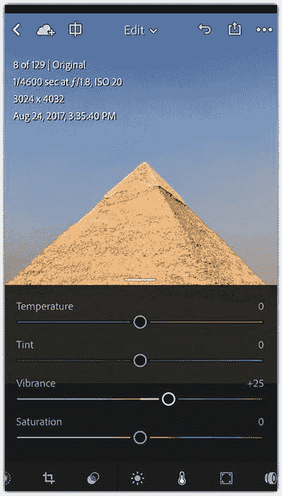

   图 8-23：改善照片的颜色、光线和色温

### 第 2 步：移除天空

我想为合成图使用更具戏剧性的天空，因此我将使用`Eraser`应用移除当前的天空，步骤如下：

1. 在`Eraser`应用中打开修改后的照片。
2. 点击擦除图标，然后选择目标区域。将阈值设置为 75，然后点击天空将其移除。接着点击完成（见图 8-24）。
3. 点击分享图标，选择最大尺寸和 PNG 格式。点击保存，将图像保存到相机胶卷。

   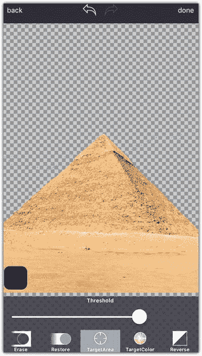

   图 8-24：从照片中移除天空背景

### 第 3 步：构建合成图

现在，我将使用 Photoshop Mix 来构建合成图，步骤如下：

1. 在 Photoshop Mix 中打开一张色彩多样的天空照片。
2. 点击加号图标添加一个新图层。选择添加新的图像图层。然后导航到透明背景的金字塔照片。
3. 点击金字塔图层打开其属性面板，选择复制。
4. 用两根手指旋转复制的图层，使其位于第一个图层的上方。您也可以点击该图层打开图层选项，选择垂直翻转（见图 8-25）。

   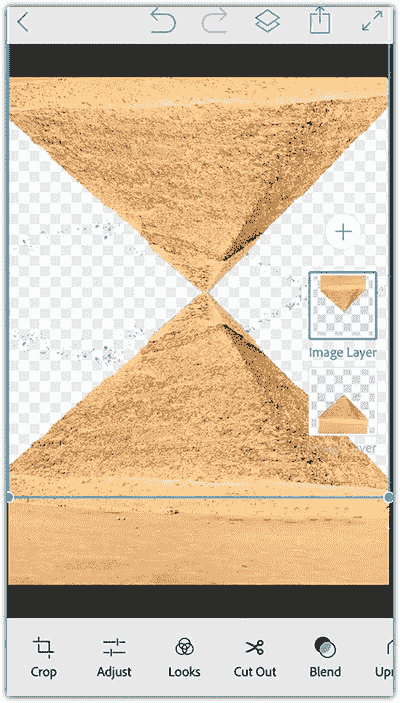

   图 8-25：复制金字塔图层并翻转

5. 点击加号图标，为第一层天空选择一张照片。
6. 在图层中，将天空图层重新排列到金字塔后面。
7. 点击顶部的金字塔图层打开其属性面板，将不透明度设置为 50%，并将混合模式设置为叠加。
8. 点击加号图标，为人物剪影选择一张照片。
9. 点击剪切图标。选择基础进行普通删除，确保点击左侧的设置图标，选择擦除。
10. 移除照片中不需要的区域，保留人物剪影。通过羽化图标，设置图像边缘的平滑度（见图 8-26）。
11. 点击应用图标。
12. 点击分享图标，选择相机胶卷。

    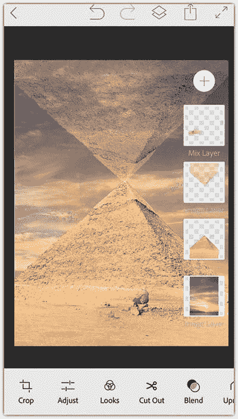

    图 8-26：添加天空背景

### 第 4 步：添加戏剧性的天空效果

现在，您将看到如何添加第二层天空并使用混合模式使其看起来更具戏剧性，步骤如下：

1. 在`Photofox`应用中打开上一步骤保存的照片。
2. 点击加号图标，选择添加图像。
3. 在底部的图层选项卡中，选择混合，并将添加的天空的混合模式设置为颜色加深（见图 8-27）。

   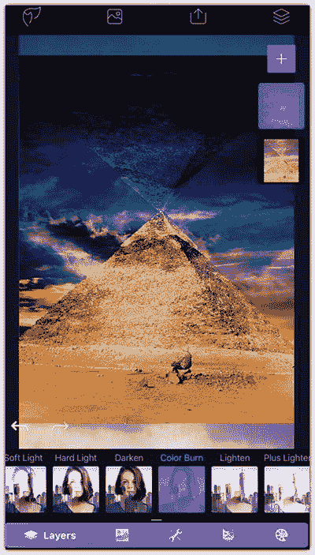

   图 8-27：在合成图上叠加戏剧性的天空

## 总结

在本章中，你学习了如何合成照片以创作出奇幻的场景。这些技巧提供了大量实例，展示如何运用应用程序来添加滤镜、画框以及在照片之间进行合成操作。你可以使用不同的应用，将本章的步骤应用到自己的照片上，并根据拍摄画面的特性调整设置。

## 练习

首先，构思一张可以用来营造神秘或戏剧效果的照片。然后，准备与之搭配的照片。例如，移除背景并调整颜色。完成后，你就可以在如`Photoshop Mix`和`Photofox`这类基于图层的应用程序中构建合成画面了。

