# 9. 拍摄与剪辑视频

当你想记录动态和声音时，可以使用你的 iPhone 来捕捉视频画面。借助合适的工具，你甚至还能扩展这项功能。与摄影和照片编辑类似，有众多应用程序可以帮你拍摄、编辑和添加视频特效。这些应用让你能够进行基本的视频修改（高级视频特效则需要特殊的软硬件配置）。

## 拍摄与修剪视频

使用的工具：`相机`应用、`照片`应用

在本节中，你将了解以下内容：

*   使用`相机`应用进行不同类型的视频拍摄
*   在拍摄视频的同时拍摄静态照片
*   使用`照片`应用修剪视频

`相机`应用允许你通过不同模式拍摄不同类型的视频，包括普通视频（`视频`）、慢动作（`慢动作`）和高速视频（`延时摄影`）。拍摄视频后，你可以使用`照片`应用的编辑功能，裁剪掉位于开头或结尾的任何多余片段。

### 设置视频质量

默认情况下，iPhone 并未设置为拍摄最高质量（4K）的视频，因为这会极大地消耗你的存储空间。每分钟的 4K 视频大约会占用 350MB 的存储空间，而 1080p 高清视频（60 帧/秒）也是如此。此外，与编辑低画质视频相比，高画质视频可能会降低你的剪辑速度，因此你需要选择最符合需求的分辨率。

1.  打开`设置` ➤ `照片与相机`。
2.  在`相机`部分，你可以设置`录制视频`和`录制慢动作`功能的质量。在每个部分中，你都可以看到每录制一分钟视频所消耗存储空间的参考指南（见图 9-1）。

    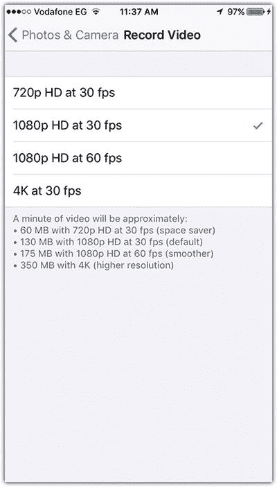

    图 9-1

    在`照片与相机`设置中配置视频录制质量

### 在拍摄视频的同时拍摄静态照片

有时你希望在拍摄视频画面时，也能同时拍下一张静态照片。此功能在两种模式下可用：`视频`模式和`慢动作`模式。

1.  打开`相机`应用，并选择`视频`模式。
2.  按下主屏幕按钮或音量键之一开始录制视频。
3.  点击屏幕左上角的白色按钮，即可在拍摄视频的同时拍下静态照片（见图 9-2）。
4.  再次按下主屏幕按钮停止录制。
5.  点击主屏幕按钮旁边的预览图标，预览视频和静态照片。

    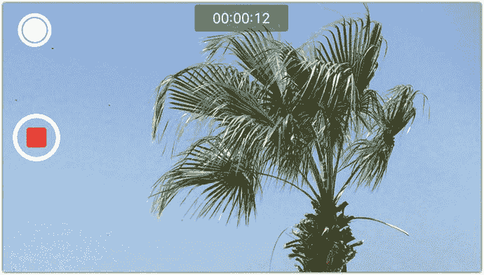

    图 9-2

    你可以通过点击屏幕左上角的白色按钮，在拍摄视频的同时拍摄静态照片

### 在照片应用中编辑素材

你的视频保存在`照片`应用中的`视频`相册里。你可以点击视频进行播放，并按下述步骤修剪视频的开头或结尾：

1.  在`照片`应用中打开该视频。
2.  点击`调整`图标进入视频编辑模式。
3.  拖动左右箭头来修剪视频。
4.  点击`完成`，并选择是将修改应用到原始视频，还是以此创建一个新视频（见图 9-3）。

    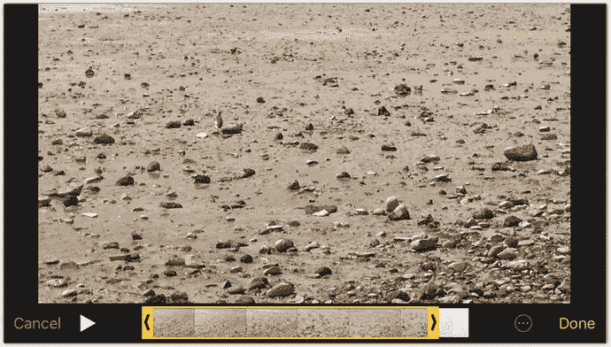

    图 9-3

    使用`照片`应用修剪视频

## 创建超延时视频

使用的工具：`OSnap`

在本节中，你将了解以下内容：

*   创建超延时项目
*   拍摄超延时视频
*   为视频添加配乐

超延时是一种延时摄影技术，它通过拍摄单张照片并将它们组织在一起来创建视频帧，从而形成动态序列。虽然你可以通过切换到`相机`应用的`延时摄影`模式来创建延时视频，但无法控制其中的动态速度或帧数。使用如`OSnap`等超延时应用，你可以将一系列照片转换为超延时或延时视频。随后，你就可以控制视频的速度和包含的帧数了。

### 第 1 步：创建超延时项目

要创建一个超延时项目，请遵循以下步骤：

1.  打开`Osnap`应用，点击加号图标，然后选择`新建项目`。
2.  在`新建项目`对话框中，设置项目名称、方向以及相机。然后点击`创建`（见图 9-4）。

    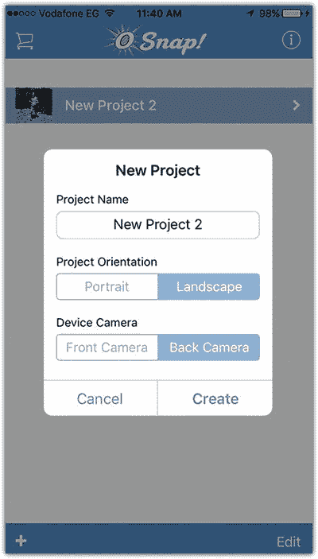

    图 9-4

    在`OSnap`应用中创建新的超延时项目
3.  点击`开始拍摄`或选择`调整设置`来设置更多项目选项。一旦`相机`应用打开，你可以多次点击快门按钮，以拍摄将用于视频中的照片（见图 9-5）。

    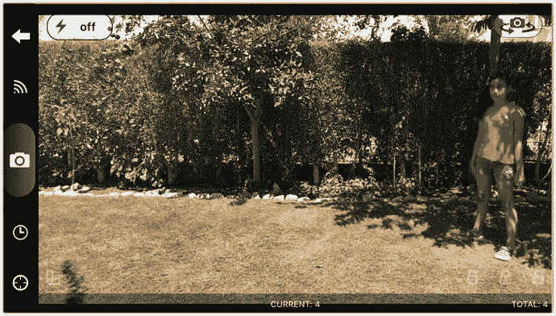

    图 9-5

    多次点击快门按钮以拍摄一系列照片，用于实现超延时效果
4.  完成拍摄后，点击`返回`按钮回到`项目`页面。然后点击该项目。
5.  点击`播放`预览视频，或点击`拍摄`为其添加更多帧画面（见图 9-6）。

    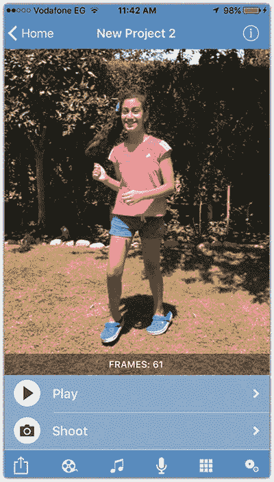

    图 9-6

    点击`返回`按钮回到项目页面

### 第 2 步：为视频添加音乐

要为视频添加音乐，请遵循以下步骤：

1.  点击`音乐`图标以打开 iPhone 音乐库（见图 9-7）。
2.  在 iPhone 音乐库中，选择视频并点击加号图标来添加视频。你也可以选择麦克风图标来录制自定义语音。

    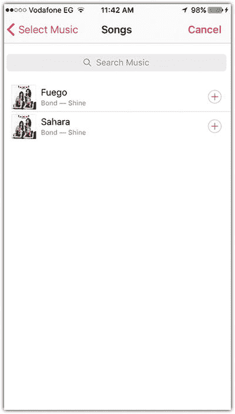

    图 9-7

    从本地音乐库为项目添加音频

### 第 3 步：修改动画帧

要修改动画帧，请遵循以下步骤：

1.  点击`帧`图标以显示视频中的帧（见图 9-8）。

    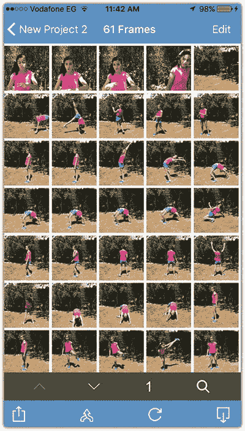

    图 9-8

    显示超延时动画中使用的帧
2.  点击右上角的`编辑`图标。
3.  选择要从素材中移除的帧。
4.  点击`删除`图标将它们移除（见图 9-9）。
5.  点击左上角的`返回`按钮回到项目。

    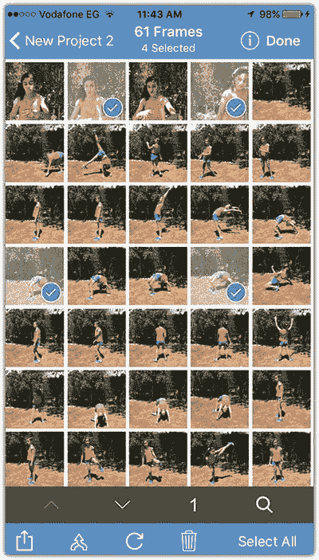

    图 9-9

    从序列中删除不需要的帧

### 第 4 步：导出视频

要导出视频，请遵循以下步骤：

1.  点击`共享`图标。
2.  点击`创建视频`将其保存为视频文件（你也可以选择`将所有照片保存到相机胶卷`，以序列照片的形式保存这些图片）。
3.  点击`渲染视频`（或点击`调整视频渲染选项`）。
4.  点击`共享视频`，然后选择`相机胶卷`（见图 9-10）。

    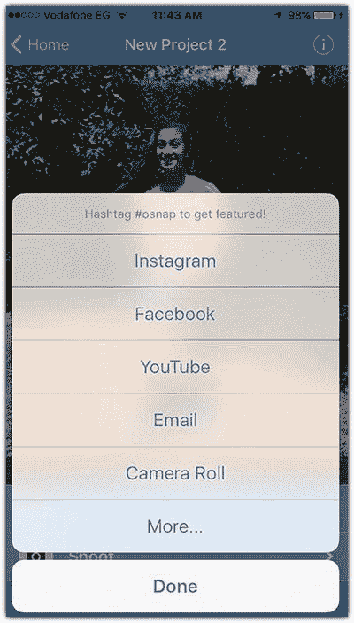

    图 9-10

    渲染并共享视频输出

## 编辑和应用滤镜

使用的工具：`iMovie`

在本节中，你将学习以下内容：

- 从视频片段中间裁剪部分内容
- 在视频片段之间应用转场
- 将视频转换为黑白效果
- 对视频应用滤镜
- 为视频添加音轨

尽管`照片`应用除了能删除视频开头或结尾的片段外，无法让你对视频进行其他修改，但有一些应用可以弥补这一不足。你可以使用如`iMovie`、`Adobe Premier Clip`等应用来扩展手机的**视频**功能。在这个技巧中，我有一段卢浮宫的视频，镜头前有两个人。因此，我想将他们移除，在视频的不同部分之间应用转场，并添加一个黑白滤镜，让视频看起来有年代感。

### 步骤 1：创建视频项目

要创建视频项目，请按照以下步骤操作：

1. 打开`iMovie`应用，点击加号图标添加视频项目，然后点击`影片`以创建自定义视频项目（见图 9-11）。

   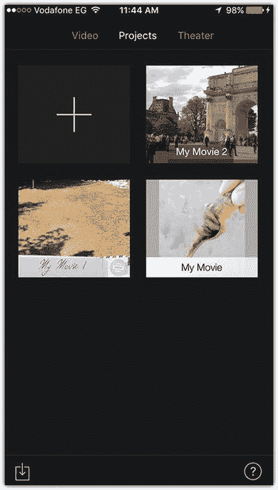

   图 9-11 在`iMovie`中创建新项目

2. 点击你想要添加的视频，然后点击视频上的`选择`（右侧图标）来添加它。你可以选择多个视频添加到同一个项目中。
3. 点击`创建影片`（见图 9-12）。

   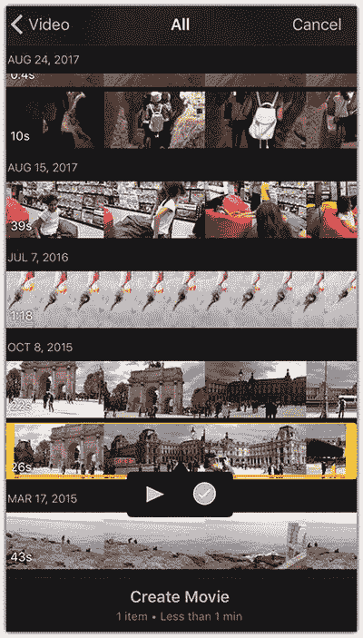

   图 9-12 从一个或多个视频创建视频项目

### 步骤 2：从视频中裁剪不需要的部分

要裁剪视频中不需要的部分，请按照以下步骤操作：

1. 拖动视频时间线，到达第一个要删除的区域。
2. 在时间线上选择视频，以显示视频编辑工具。
3. 点击`裁剪`图标，并选择`拆分`，在不需要的区域之前进行切割（见图 9-13）。

   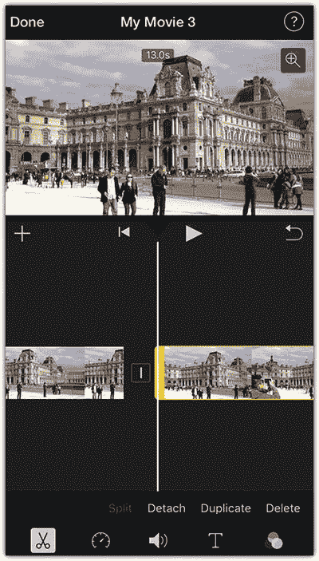

   图 9-13 在特定点拆分视频

4. 将视频拖动到不需要的区域之后，再次点击`拆分`。
5. 选择不需要的区域，然后点击`删除`（见图 9-14）。

   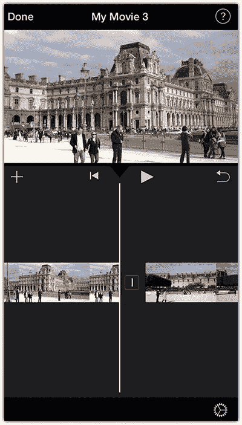

   图 9-14 删除视频中不需要的部分

6. 现在，你需要在删除区域的位置创建一个转场，以在切割部分前后的视频之间建立平滑过渡。点击两个片段之间的小图标，然后选择一个转场。例如，点击`淡出`（见图 9-15）。
7. 对视频中所有不需要的部分重复这些步骤。

   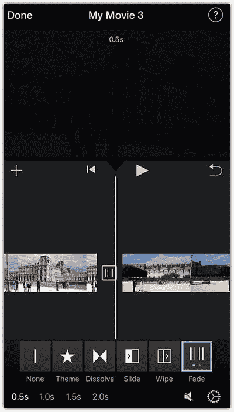

   图 9-15 对视频片段应用转场

### 步骤 3：将视频转换为黑白效果

要将视频转换为黑白效果，请按照以下步骤操作：

1. 将视频拖动到其最左侧的起始位置。
2. 点击屏幕右下角的`设置`图标。
3. 在`滤镜`列表中，选择`无声时代`。
4. 启用`从黑色淡入`和`淡出到黑色`（见图 9-16）。
5. 点击`完成`。

   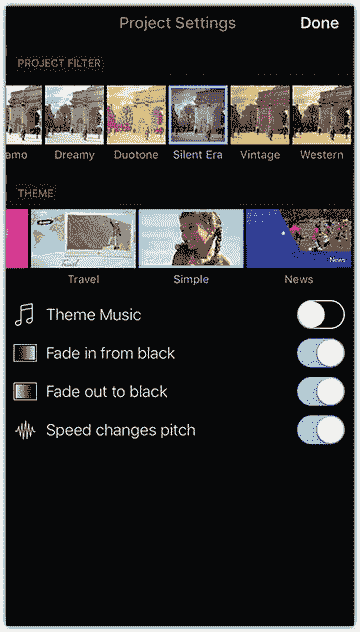

   图 9-16 对视频项目应用全局滤镜

### 步骤 4：为视频添加音轨

要为视频添加音轨，请按照以下步骤操作：

1. 在添加音轨之前，你可以移除现有的视频声音。在时间线上选中视频轨道后，点击`音频`图标，并将滑块拖动到最左侧（见图 9-17）。

   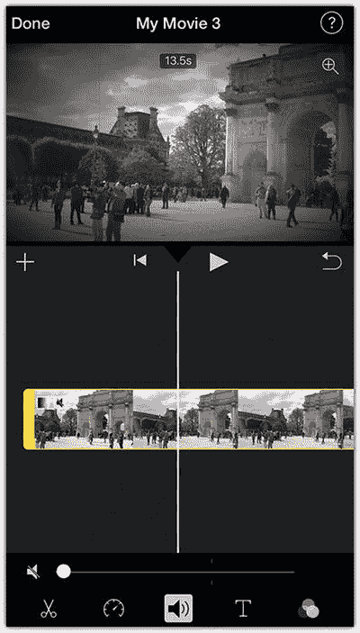

   图 9-17 移除视频片段中的当前音频

2. 点击时间线左上角的加号图标，选择音轨，然后点击`使用`。
3. 在时间线上选择音轨，调整其合适的音量，然后点击`淡入淡出`，使其与视频同步淡入和淡出（见图 9-18）。

   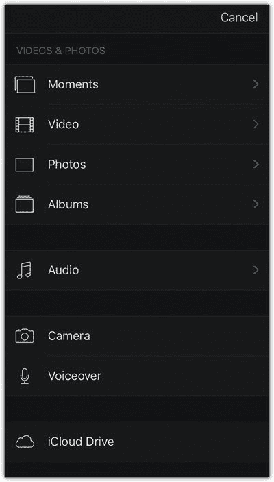

   图 9-18 从资料库向视频添加音轨

### 步骤 5：将项目导出为视频

要将项目导出为视频，请按照以下步骤操作：

1. 完成视频编辑后，点击屏幕左上角的`完成`。
2. 点击`共享`图标，并选择`存储视频`。
3. 选择你想要使用的视频质量。视频将被导出到你的照片图库中（见图 9-19）。

   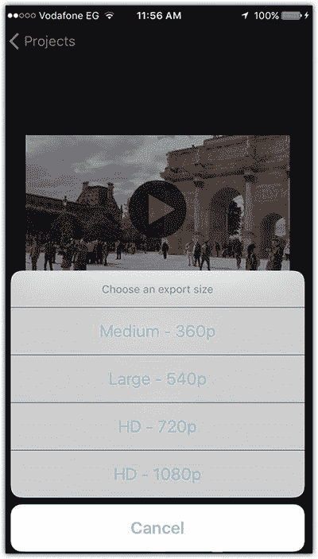

   图 9-19 将视频项目导出到照片图库

## 创建 20 世纪 80 年代电视视频效果

使用的工具：`Clipper` 应用

你将学习以下内容：

- 合并多个视频
- 为视频添加音轨
- 应用老式电视效果

将视频转换成看起来像旧时的风格，是一种创建怀旧视频的有趣方式。在这个技巧中，我使用了孩子们在海滩玩耍的视频，来应用老式 1980 年代电视的外观。我使用了`Clipper`应用来应用此效果，并为此选择了一些好听的柔和背景音乐。在这些步骤中，我使用了一个视频，但你可以添加一系列视频，为它们都赋予相同的风格。

### 步骤 1：合并视频素材和音频

要添加视频素材和音频，请按照以下步骤操作：

1. 打开`Clipper`应用，勾选你想要添加到项目中的视频。
2. 点击右上角的`添加`图标（见图 9-20）。

   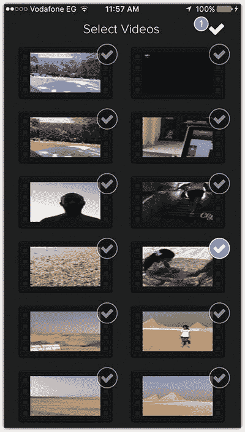

   图 9-20 向项目添加视频

3. 添加视频后，你可以点击视频旁边的图标，向项目添加更多视频。
4. 从时间线的`音频`部分，选择`流行`。你也可以通过点击`音频`图标，从你的资料库中添加音轨（见图 9-21）。

   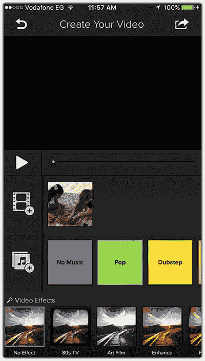

   图 9-21 向项目添加视频和音频

### 步骤 2：添加视频效果并保存视频

要添加视频效果并保存视频，请按照以下步骤操作：

1. 从屏幕底部的`视频效果`列表中，选择`80 年代电视`，将其应用到视频上。
2. 点击时间线上方的`播放`按钮预览视频。
3. 点击屏幕右上角的`共享`图标。选择在社交网络上分享视频，或通过电子邮件发送，或保存到相机胶卷（见图 9-22）。

   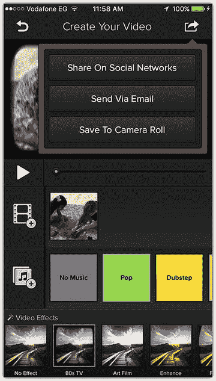

   图 9-22 为视频添加老式电视风格并进行分享

## 总结

你不再需要昂贵的摄像机来拍摄高清视频，也不需要复杂的软件来编辑视频。iPhone 允许你根据需求拍摄不同质量的视频。尽管`照片`应用与它的静态照片编辑工具（如裁剪、色彩调整和光线调整）相比，没有包含很多视频编辑工具，但你可以使用不同的应用来编辑视频、应用效果以及添加音频。虽然某些应用如`iMovie`和`Adobe Clip`提供了完整的编辑功能，但其他应用如`Video Toolbox`也提供了直接应用于视频的基本自定义效果。因此，你需要选择最适合你需求的应用。

## 练习

构思一个延时摄影项目，例如拍摄一组玩耍中的孩子的照片，并将其转换成延时视频。你可以使用`OSnap`应用来完成此操作。然后，使用如`iMovie`或`Clipper`等应用为视频添加滤镜和音频。

