# 10. 存储你的照片

在处理照片和视频时，存储空间耗尽是我最担心的问题之一。这是一个棘手的情况，因为以高质量 HDR 或 Raw 格式拍摄照片会因文件体积庞大而迅速消耗设备的存储空间。拍照时，我通常喜欢从不同角度和变焦倍数拍摄多张照片，这有助于后期编辑照片，或决定将其用于照片合成艺术作品。这同样会占用 iPhone 的空间。

与其他手机不同，iPhone 无法通过添加存储卡来扩展其存储能力。因此，你需要一个完善的计划，确保设备始终为下一次拍摄留有空间。这可以通过管理存储空间并利用 iCloud、Dropbox、Google Drive 等各种云服务来实现。本章的技巧旨在探索可用于管理 iPhone 存储空间的各种妙招。

## 管理你的 iPhone 存储空间

管理整体存储空间的第一步是确保设备上只保留你想要的内容，并为照片留出足够的空间。虽然从设备中移除不必要的应用程序可以节省空间，但这可能不足以解决问题，尤其是当你使用各种照片编辑应用，并需要在设备上安装常用应用时。因此，你可以更改设备设置，确保只保存必要的文档和照片。默认情况下，iPhone 的设置并未配置为主动节省设备空间；实际上，有些设置应该在拿到设备后立即更改，以确保空间仅用于重要事项。以下是一些可帮助清空 iPhone 存储空间，为下一个摄影项目做好准备的操作。

### 不要重复保存照片

在拍摄 HDR 照片时，你可能会注意到 iPhone 会在转换为 HDR 照片之前保留原始照片的副本。虽然这是为了保存原始照片，但你并不需要每张照片都保留一个副本。因此，你可以选择停止这种重复备份，仅在需要时使用此设置。要控制此功能，请按照以下步骤操作（见图 10-1）：

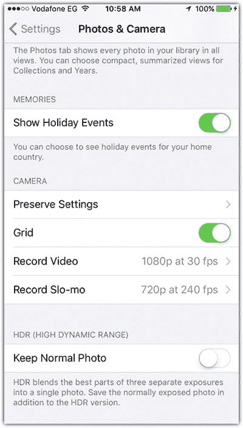

图 10-1

在拍摄 HDR 图像时禁用保留普通照片

1. 打开 `设置 ➤ 照片与相机`。
2. 向下滚动到 `保留正常曝光的照片`，并取消勾选其旁边的开关。

某些应用程序（如 Instagram）也有类似的重复保存照片功能。你可以通过打开 Instagram 应用，选择 `个人资料` 选项卡，然后点击 `设置` 图标来关闭此功能。接着，取消选择 `保存原始照片`。

### 停止存储短信历史记录

默认情况下，iPhone 会永久存储所有已发送和已接收的短信。显然，随着时间的推移，这会消耗大量空间，特别是当你发送大量短信时。你可能不需要那些旧短信，因此你可以将短信存储限制在特定时间段内，让设备自动删除旧短信（见图 10-2）。请按照以下步骤操作：

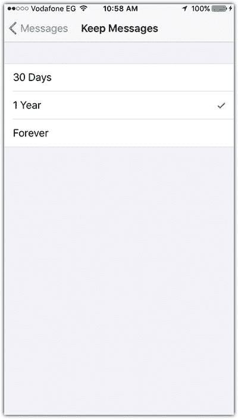

图 10-2

删除短信历史记录

1. 选择 `设置 ➤ 信息 ➤ 信息历史记录 ➤ 保留信息`。
2. 如果你希望保留信息长达一年，请将时间设置为 `1 年`；如果对更短时间满意，则设置为 `30 天`。

### 删除已下载的播客和音乐

已下载的播客和音乐因其体积较大，可能会占用大量 iPhone 空间。有时你下载一首音乐曲目是因为它听起来很有趣，但之后应将其从设备中删除。只保留你经常听的曲目有助于释放一些设备空间。你可以按照以下步骤操作（见图 10-3）：

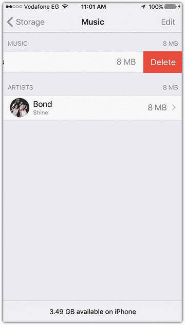

图 10-3

删除不需要的音乐

1. 轻点 `设置 ➤ 通用 ➤ 存储空间与 iCloud 用量 ➤ 管理存储空间`。
2. 向下滚动到 `音乐` 应用。你可以在 `所有歌曲` 上向左轻滑来删除单首歌曲或全部歌曲。

与音乐不同，播客通常只听一次，无需保留每一集。因此，建议删除已下载的播客以释放 iPhone 上的一些空间。你可以手动删除不需要的播客（见图 10-4）。

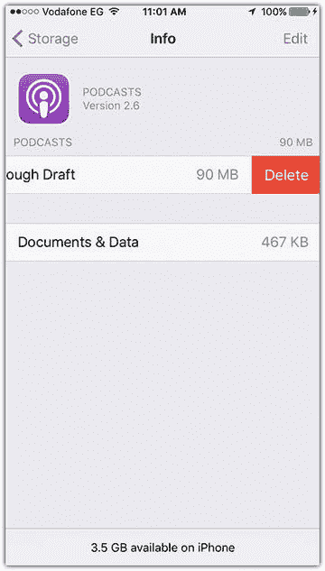

图 10-4

删除不需要的播客

1. 轻点 `设置 ➤ 通用 ➤ 存储空间与 iCloud 用量 ➤ 管理存储空间`。
2. 向下滚动到 `播客`，然后开始逐一删除。

### 移除浏览器历史记录和阅读列表

如果你在 iPhone 上频繁使用 Safari 浏览网页并将页面保存到阅读列表，你可能会注意到浏览历史和已保存的阅读列表缓存会占用部分存储空间。你可以通过打开 `设置 ➤ Safari` 并轻点 `清除历史记录与网站数据` 来移除 Safari 的浏览器缓存。

阅读列表也可能占用一些不必要的空间，因为 Safari 会保留离线阅读列表。移除这个离线阅读列表不会影响你 iPhone 或其他设备上阅读列表中的项目。因此，这是释放更多空间的一个好方法。

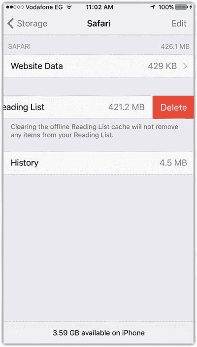

图 10-5

移除浏览器的离线阅读列表

1. 轻点 `通用 ➤ 存储空间与 iCloud 用量 ➤ 存储空间`。
2. 向下滚动并轻点 `Safari`。
3. 在 `离线阅读列表` 项目上向左轻滑，然后轻点 `删除` 以清除缓存（见图 10-5）。
4. 轻点 `网站数据`，向下滚动，然后轻点 `移除所有网站数据`。

## 使用 iCloud 保存和管理照片

如今，世界正转向云解决方案，抛弃传统的本地存储卡和硬盘。云解决方案提供了灵活的存储和可访问性，因为你可以从任何设备访问资源。你可以使用 iCloud 服务存储你的照片和重要文档，从而释放设备上的空间。它还允许你从其他设备（如 iPad、Mac 电脑或 Windows PC）访问资源。

### 激活将照片保存到 iCloud

加入 iCloud 后，你将获得 5GB 的免费方案来存储信息。显然，对于存储文件来说，这空间不够，尤其是当你使用多台设备时。因此，你需要决定哪些应用程序能够将文件保存到 iCloud。你可以按如下方式激活将照片保存到 iCloud（见图 10-6）：

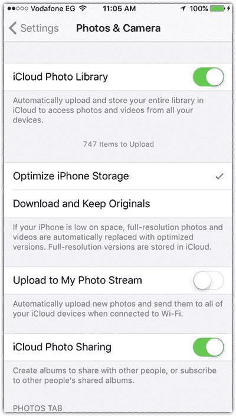

图 10-6

激活将照片保存到 iCloud 服务

1. 轻点 `设置 ➤ 照片与相机`。
2. 在 `iCloud 照片图库` 旁向右滑动以将其开启。
3. 选择 `优化 iPhone 存储空间` 以自动管理你的照片存储。原始照片将保存在 iCloud 上，而非保留在你的设备上。

### 管理 iCloud 存储与应用程序

您可以直接在 iPhone 上查看 iCloud 状态，了解可用空间以及允许将文稿保存到 iCloud 的应用程序（见图 10-7）。

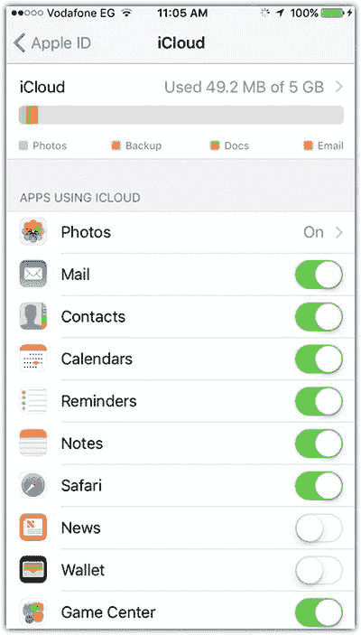

图 10-7：允许或禁止应用使用 iCloud

1.  在`设置`应用中，点击您的 Apple ID 名称，然后点击`iCloud`查看存储状态。
2.  向下滚动，查看允许使用`iCloud`的应用程序。

如果您决定关闭某个应用与`iCloud`之间的同步过程，您可能会看到一条提示信息，告知您与此特定应用关联的文稿将从`iCloud`存储中移除。

您还可以通过网页浏览器访问`iCloud`，查看云端的各个应用，并访问`照片`存储区域。一旦您在`照片`应用设置中激活了`iCloud 照片图库`，您就可以查看上传到`iCloud`的照片，并通过添加照片、删除照片或将其整理到文件夹中进行管理（见图 10-8）。要通过浏览器访问`iCloud`，您可以按照以下步骤操作：

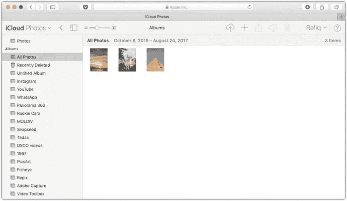

图 10-8：使用网页浏览器管理 iCloud 服务

1.  在浏览器中，输入 [`www.icloud.com`](http://www.icloud.com)。
2.  使用您的 Apple ID 和密码登录。
3.  从仪表盘中选择`照片`。

在左侧，您可以找到 iPhone 使用的不同文件夹，并导航到已上传的照片。通过右上角的图标，您可以上传照片、创建新文件夹、共享照片、下载照片或删除照片。

## 使用其他云服务

`iCloud`并非您可以用来从 iPhone 存储照片和文稿的唯一云服务。尽管 iPhone 与 iOS 高度集成，但您还可以下载并使用其他服务，例如`Dropbox`、`Google Drive`和`One Drive`。所有这些服务都提供免费方案，您可以享受免费存储空间。例如，`Dropbox`提供 2GB 的免费存储空间，之后才需要升级。如果您邀请他人使用该应用，您将获得额外空间作为奖励。`Google Drive`提供最大的免费存储空间，达到 17GB。此外，它还允许您使用`Google Docs`和`Google Slides`等不同应用创建文档和照片，并自动保存到`Google Drive`中。

如果您不确定`iCloud`的免费空间能否保存您所有的照片，您可以使用其他任何云服务来保存照片，只需通过这些应用将照片上传到云端即可（见图 10-9）。`Dropbox`允许您将相机照片上传到其存储空间，操作如下：

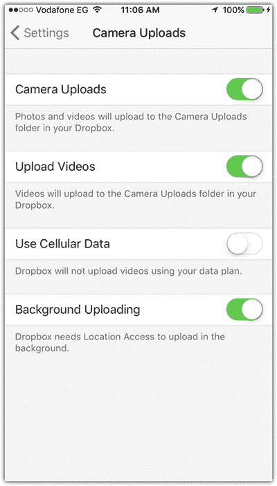

图 10-9：使用 Dropbox 保存相机照片

1.  打开`Dropbox`应用，并使用您的用户名和密码登录。
2.  点击左上角的`设置`图标。
3.  点击`相机上传`并将切换开关滑至`开`。这会将照片上传到`Dropbox`上的`相机上传`文件夹。
4.  切换`上传视频`项目以将视频上传到同一文件夹。
5.  确保`使用蜂窝数据`为关闭状态，以允许您仅通过 Wi-Fi 连接上传。
6.  将`后台上传`切换为`开`，然后选择`启用`。这将让`Dropbox`在您从一个地方移动到另一个地方时上传照片。

## 使用 Lightroom 应用同步原始文件

您可能会注意到，在 Adobe `Lightroom` 应用中拍摄或修改的照片默认保存在与`相机胶卷`不同的单独位置，但可以与`相机胶卷`共享图像。这些保存的照片保留了在`Lightroom` 应用内所做的编辑，因此您可以再次打开它们并修改或更改所应用的效果。如果您需要未经处理的照片以获得更多编辑能力，您还可以使用`Lightroom` 应用拍摄原始照片。然而，由于这些照片文件体积巨大，保存原始文件和文件修改可能会占用您 iPhone 的大量空间。

Adobe `Lightroom` 为 Adobe Creative Cloud 会员提供云存储；您可以将桌面和移动应用中的照片都保存到 Adobe 云服务中。免费订阅提供 2GB 免费存储空间，而付费会员则提供 20GB 存储空间。您可以通过在 Adobe `Lightroom` 应用中登录您的帐户来激活 Adobe Creative Cloud。它将自动上传`Lightroom` 图库中的照片，并更新对任何照片所做的修改。

您可以按照以下步骤同步`Lightroom` 应用图库与 Adobe 云服务中的照片（见图 10-10）：

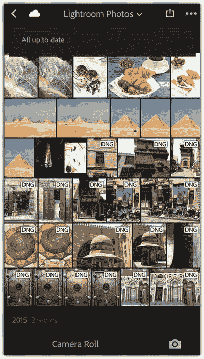

图 10-10：在 Lightroom 应用与 Adobe 云服务之间同步

1.  在您的 iPhone 上打开`Lightroom` 应用。
2.  点击左上角的`云`图标，并使用您的 Adobe ID 和密码登录。
3.  点击该图标，将照片与在线存储空间同步。

您也可以通过浏览器管理在线云存储中的照片，操作如下（见图 10-11）：

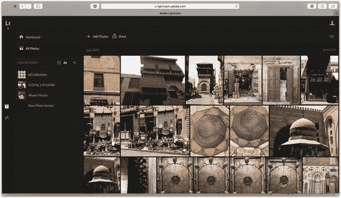

图 10-11：使用电脑浏览器访问 Lightroom 云存储

1.  在您的浏览器中，前往 [`https://lightroom.adobe.com/`](https://lightroom.adobe.com/)。
2.  使用您的 Adobe ID 和密码登录。
3.  点击`添加照片`图标，从您的电脑向云端添加照片。
4.  点击照片上的`选择`图标以删除、共享或更改位置。

## 与您的电脑同步文件

很多人都喜欢大屏幕；对我来说，它能帮助我查看照片的细节，挑出需要修复的小问题。您可以将照片从 iPhone 同步到电脑，以便修改、存储或与他人分享。此外，您还可以在电脑上的`照片`文件夹与 iPhone 之间进行同步，以便在手机上保存您的照片和珍贵回忆的副本。

## 将 iPhone 照片导入电脑

你可以使用 Mac 上的“`照片`”应用，通过 USB 数据线将 iPhone 与电脑连接，轻松将 iPhone 照片导入电脑。连接成功后，系统可能会询问你是否信任该电脑并允许其连接设备。接受该设置后，你便能在左侧导航窗格中看到 iPhone 的照片列表。

你可以按照以下步骤（见图 10-12）将照片从 iPhone 导入 Mac 电脑的“`照片`”应用中：

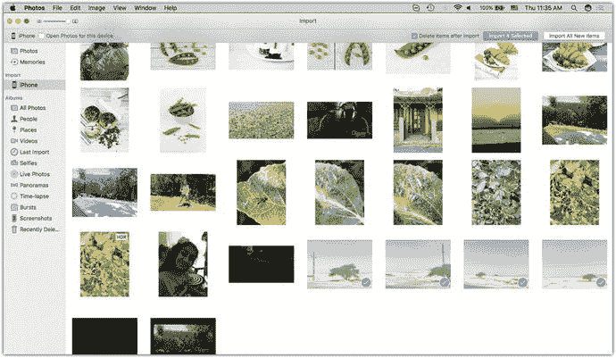

图 10-12 使用 Mac 的“`照片`”应用导入 iPhone 照片

1. 在 Mac 电脑上打开“`照片`”应用。
2. 在左侧的“导入”窗格中选择你的 iPhone。
3. 选择你想要导入的照片。
4. 从顶部控制栏中选择“导入所有新项目”或“导入所选项目”。你可以勾选“导入后删除项目”来移除原始照片以节省空间。

如果你使用的是 Windows 电脑，只需将 iPhone 插入电脑，等待“`自动播放`”窗口弹出，然后选择导入照片即可。你也可以使用诸如 `AnyTrans` 之类的应用程序。

导入照片后，它们会被保存在“`照片`”应用文件夹中，你可以在应用内分享、调整或将其标记为收藏。若要将照片保存到“`访达`”中，以便在诸如 `Photoshop` 或 `Lightroom` 等照片编辑应用中打开，你需要按如下步骤导出（见图 10-13）：

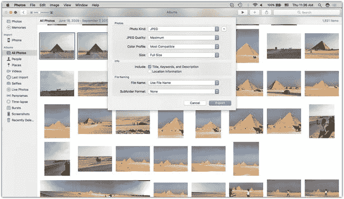

图 10-13 “`照片`”应用中的“导出照片”对话框

1. 选择你需要导出的照片。
2. 选择“文件”➤“导出”➤“导出照片”。
3. 在导出对话框中，选择导出格式、色彩描述文件和大小；点击“导出”。
4. 将照片保存到你的本地电脑上。

## 从电脑同步照片到 iPhone

你可以使用 Mac 和 Windows 上都有的“`iTunes`”应用，轻松同步电脑和 iPhone 上的照片。这可以帮助你同步照片、音乐、图书、应用和播客。要同步照片，可以遵循以下步骤（见图 10-14）：

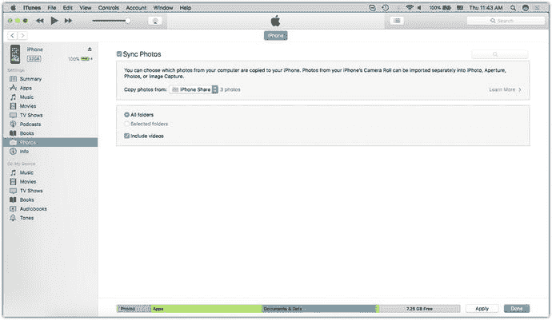

图 10-14 使用“`iTunes`”应用从电脑和 iPhone 同步照片

1. 打开“`iTunes`”应用。
2. 点击左上角的 iPhone 图标。
3. 在“设置”部分，点击“照片”。
4. 选中“同步照片”复选框。
5. 在“从...复制照片”中，选择你想要同步的照片所在的文件夹。
6. 选择同步所有文件夹或所选文件夹。
7. 点击右下角的“应用”。

## 本章小结

虽然 iPhone 的存储空间可能无法让你保存无限多的照片和项目，但云技术通过为你提供将照片保存到各种云服务（如 `iCloud`、`Dropbox`、`Google Drive`、`One Drive` 和 `Adobe Cloud`）的机会，帮助克服了这一障碍。你可以使用这些服务来高效管理设备空间，确保在下一次拍摄时不会因空间不足而烦恼。你可以使用不同应用的免费版本来获取少量存储空间，也可以订阅一项服务以获得足够存储所有项目的空间。你还可以通过 Mac 上的“`照片`”应用或 Windows 上的 `AnyTrans` 等应用将照片导入电脑来保存。

## 实践练习

运用本章介绍的技术来减少设备上的已用存储空间。下载一个或多个云服务应用，并使用它们来保存你的照片。留意一下你可以释放多少设备空间。

