# 11. 为社交网络进行照片编辑

社交网络不仅在你个人的互联网社交生活中扮演着重要角色，在摄影行业也是如此。许多摄影师依赖他们在 `Facebook`、`Instagram`、`500px`、`Pinterest` 等平台上的社交资料来展示和推广他们的作品。这有助于他们的作品每天被这些网络的庞大访问者群体看到。你的 iPhone 让你可以轻松地在这些网络上分享作品。你只需拍摄照片，如果需要则进行编辑，然后直接从任何照片编辑应用上传即可。

诸如 `Adobe Spark` 之类的在线工具也提供了有助于你编辑照片的功能和工具。你可以使用它们的工具来创建动态照片项目，并向客户展示你的作品，正如你将在本章的技巧中探索到的那样。

## 使用 Adobe Spark 创建有吸引力的照片展示

使用的工具：`Adobe Spark Page`

`Adobe Spark` 是一组移动应用，可帮助你使用照片创建不同的社交内容。`Adobe Spark Page` 帮助你创建包含照片、视频和文本的动态页面，然后你可以与客户分享。`Spark Video` 允许你合并多个视频并在它们之间添加文本过渡。`Smart Post` 功能让你可以编辑照片并添加文本，以创建引人注目的社交帖子。

使用 `Spark Page` 创建的照片和文本可以通过台式电脑或移动设备访问。在以下步骤中，我将展示如何为我的巴黎之旅创建一个 `Spark` 页面。请使用你自己的照片跟随操作。

### 第 1 步：创建页面布局

要创建页面布局，请遵循以下步骤：

1. 打开 `Spark Page` 应用。你可以查看“灵感”示例来了解不同的布局范例（见图 11-1）。

   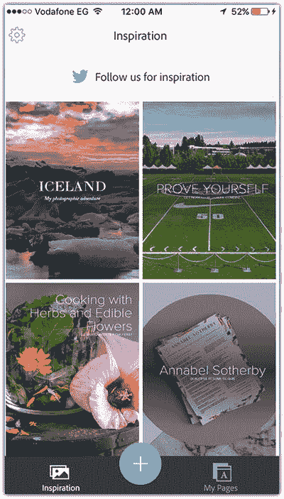

   图 11-1 `Adobe Spark Page` 中的“灵感”示例

2. 点击加号图标。
3. 点击“添加标题和副标题”并输入你的标题（见图 11-2）。

   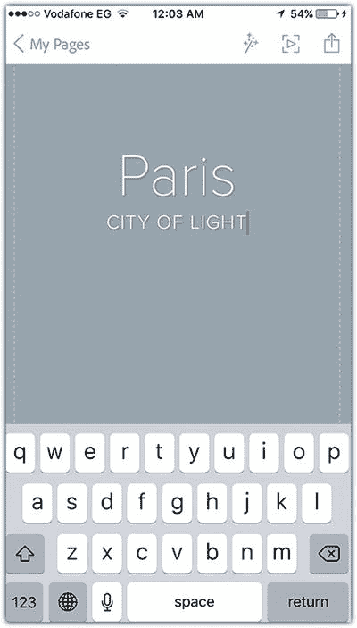

   图 11-2 向页面添加标题和副标题

4. 点击图像图标为标题添加照片背景。
5. 向下滚动以显示菜单，然后点击文本工具为照片项目添加一段文本（见图 11-3）。

   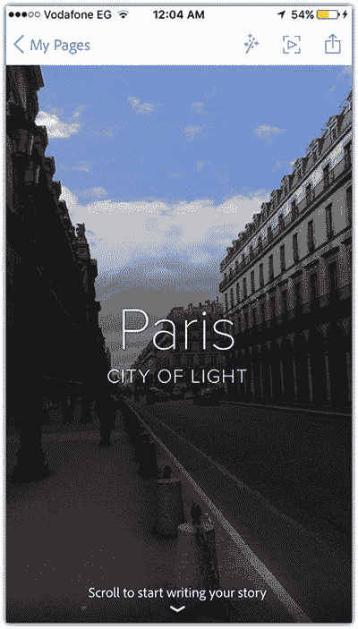

   图 11-3 添加背景图像和段落文本

6. 点击文本下方的加号图标以添加更多内容，然后选择“照片网格”以网格形式显示多张照片。
7. 选择要添加到网格的照片，然后点击“添加”。
8. 点击网格旁边的加号图标并添加描述文本（见图 11-4）。

   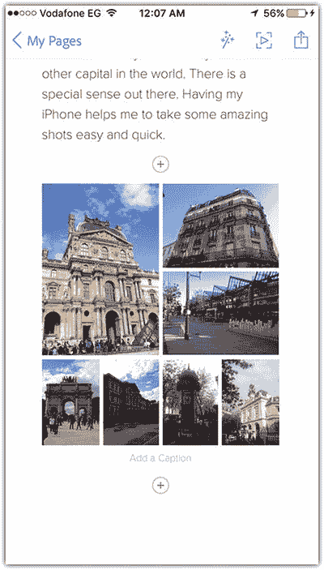

   图 11-4 向 Spark 页面添加照片网格

9. 重复之前的步骤，向项目中添加更多图像。
10. 在顶部图标中，点击效果图标以更改页面上的字体。选择 Chic 字体（见图 11-5）。

    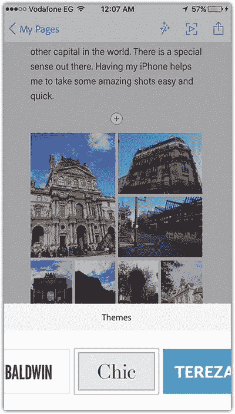

    图 11-5 更改页面字体

### 第 2 步：预览并分享页面

要预览并分享页面，请遵循以下步骤：

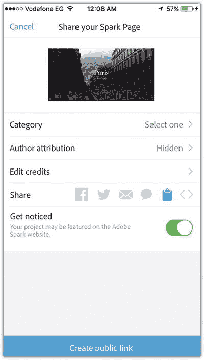

图 11-6 为 Spark 页面创建公开链接

1. 点击屏幕右上角的预览图标以预览已创建的页面。
2. 点击分享图标，并完善页面信息，例如类别和版权。
3. 打开“获得关注”选项，使页面在 `Adobe Spark Page` 上可用。
4. 使用分享图标分享页面。
5. 点击“创建公开链接”以创建一个任何人都能查看该页面的链接（见图 11-6）。

## 创建 Instagram 网格照片

使用工具：Pic Splitter、Moldiv

如果您是摄影爱好者，很可能用过 Instagram。您可以通过 Instagram 将一张照片分割成多个部分，并以网格形式或独立帖子发布到 Instagram 上。

您可以使用网格功能来分割全景照片，使其适配那些对照片可视尺寸有限制的社交网络。例如，将一张全景照片（非正方形尺寸）上传到 Instagram 可能会影响其显示效果。在下面的示例中，我将使用一张巴黎街头的照片，演示如何将其分割成多张照片，为其应用滤镜，然后以帖子网格的形式发布到 Instagram。

### 第 1 步：将照片分割成多个部分

要将照片分割成多个部分，请按照以下步骤操作：

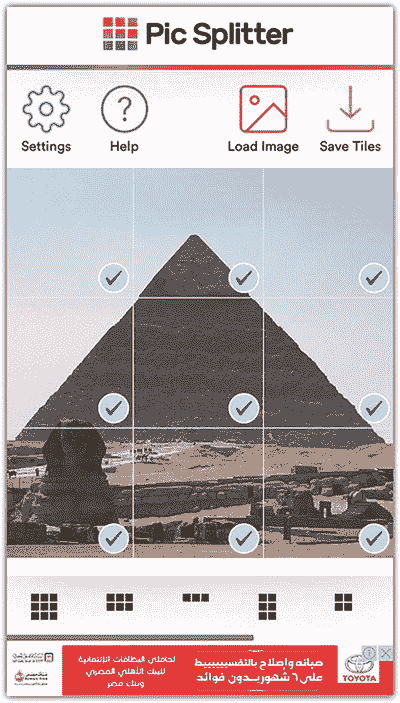

图 11-7

使用 Pic Splitter 应用程序将照片分割成多个部分

1. 打开 Pic Splitter 应用程序。
2. 点击顶部栏中的“加载图像”图标，从“相机胶卷”中选择一张图片。
3. 在底部选择第一个网格，该网格将照片分割成九个部分（见图 11-7）。
4. 点击“保存切片”，将图像保存到“相机胶卷”。

### 第 2 步：为分割后的照片添加滤镜

要为分割后的照片添加滤镜，请按照以下步骤操作：

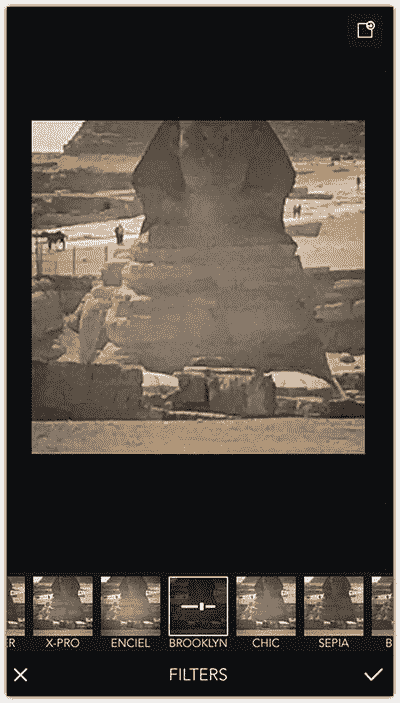

图 11-8

为分割后的照片应用滤镜

1. 打开 Moldiv 应用程序。
2. 打开第一张照片，选择“滤镜”。
3. 从“基础”列表中选择“布鲁克林”，并将滑块拖到最右侧以增加滤镜效果。
4. 将滤镜应用到网格中的其余照片上（见图 11-8）。
5. 点击“分享”图标，将文档保存到“相机胶卷”。

### 第 3 步：分享照片

要分享照片，请按照以下步骤操作：

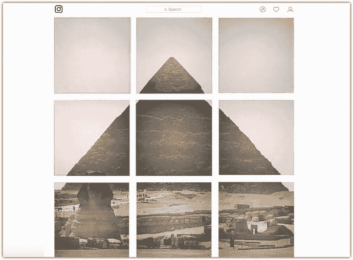

图 11-9

Instagram 中的网格帖子

1. 打开 Instagram，从左下角开始向右上角依次发布照片，以适配 Instagram 个人主页的布局。这样，照片将以网格形式显示（见图 11-9）。

## 将照片转化为社交品牌形象图

打造强有力的社交主页需要让您的页面或作品集具有吸引力。当您用 iPhone 拍摄和修改照片时，您会希望管理好不同社交主页的布局，并以吸引人的方式显示照片。然而，管理每个主页相关的不同标准尺寸（如横幅图片尺寸）并不容易。Canva 是一款便捷的应用程序，能帮助您将照片提升到一个新层次。

Canva 是一款基于网页的照片编辑和模板创建应用程序，其移动应用可让您在 iPhone 上使用所有网页功能。Canva 允许您创建和编辑用于不同社交网络的照片，以进行推广和品牌建设。例如，您可以使用它来创建帖子、海报和名片。在您没有设计经验来设置横幅尺寸、选择合适字体或添加特殊效果时，Canva 尤其有用。在接下来的步骤中，我将使用 Canva 应用程序将我的一张照片转换为 Facebook 个人主页的横幅。然后，我将使用它创建一张可以打印并交给客户的名片。

### 第 1 步：创建 Facebook 横幅

要创建 Facebook 横幅，请按照以下步骤操作：

1. 打开 Canva 应用程序，从顶部菜单中选择“Facebook 封面”。
2. 选择您喜欢的一种样式进行自定义。例如，我将使用第一个模板（见图 11-10）。

   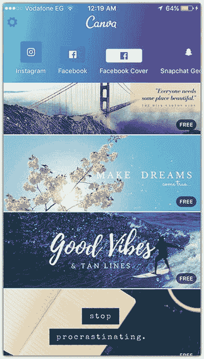

   图 11-10

   使用 Canva 的 Facebook 封面模板
3. 点击背景照片。您会注意到“相机胶卷”出现在底部。选择其中一张照片。
4. 用一根手指拖动照片以重新定位，用两根手指缩放照片（见图 11-11）。

   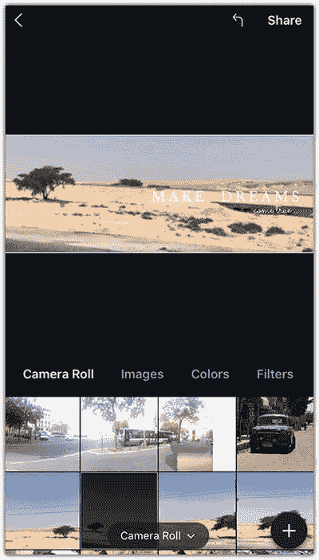

   图 11-11

   修改横幅照片的大小和位置
5. 点击“滤镜”图标，选择一个滤镜并应用到图像上。我将选择 Guyfe 滤镜。
6. 双击文本开始编辑，输入您想要的句子。然后点击“完成”。
7. 使用文本工具更改文本的字体、大小、颜色和间距（见图 11-12）。

   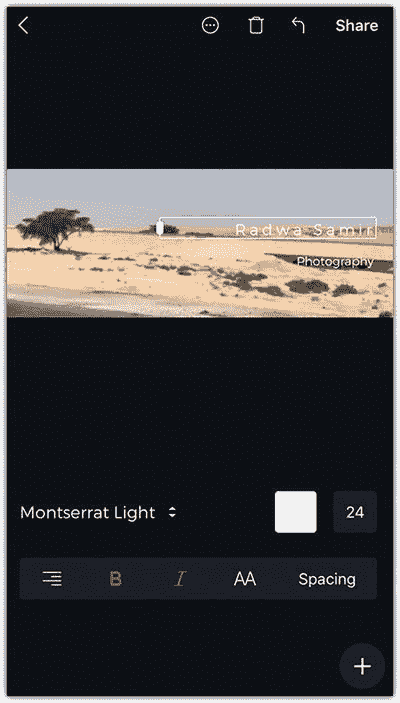

   图 11-12

   为横幅添加和修改文本
8. 点击加号图标显示形状，选择一个分隔符，将其置于主文本和下方文本之间（见图 11-13）。
9. 点击“分享”按钮保存图像，并用它来更新您的 Facebook 个人主页或主页横幅。

   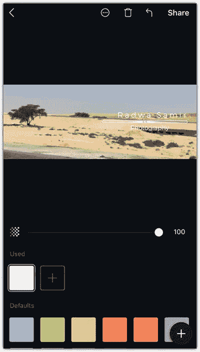

   图 11-13

   在横幅上添加分隔符形状

### 第 2 步：创建摄影名片

要创建名片，请按照以下步骤操作：

1. 打开 Canva 应用程序，选择“名片”。
2. 选择适合您摄影业务的模板。我将选择一个带有背景文字的简单模板（见图 11-14）。

   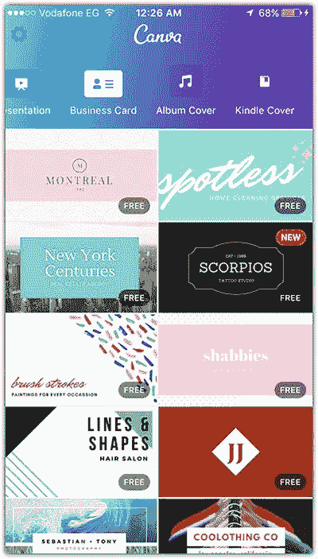

   图 11-14

   使用名片模板创建您自己定制的名片
3. 重复创建 Facebook 横幅时使用的步骤来修改您的名片（见图 11-15）。

   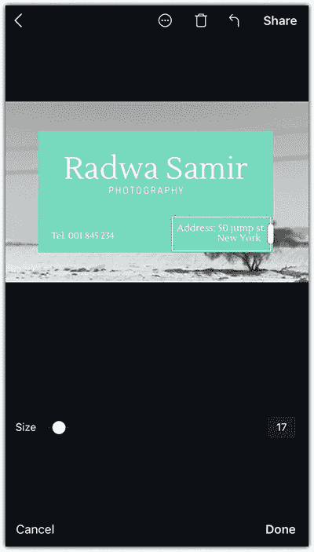

   图 11-15

   修改名片布局
4. 点击“分享”图标。您可以选择不同的适合打印的格式，例如 PNG 图像、标准 PDF 或适合打印的 PDF（见图 11-16）。

   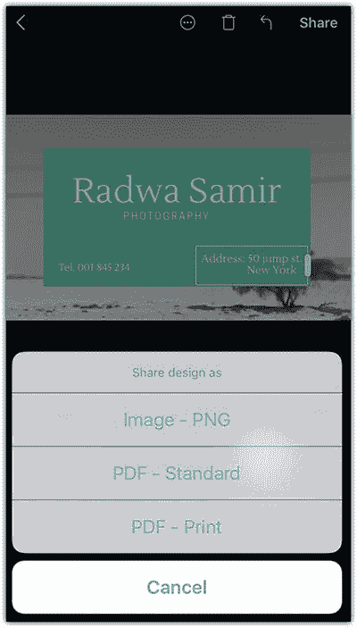

   图 11-16

   以适合打印的格式保存名片

## 总结

您的 iPhone 不仅能拍出精彩的照片，还能帮助您通过不同的社交网络分享它们。您甚至可以使用 iPhone 上的应用程序将您的照片与您所使用的不同社交网络集成。例如，您可以使用 Instagram 布局以网格视图显示照片，使用 Spark Pages 以演示模式展示照片，或者将它们转化为您 Facebook 主页的创意横幅。本章的技巧涵盖了不同的应用程序，可以帮助您将照片与社交网络主页集成。

## 练习

首先，选择一个包含特定主题或地点多张照片的项目。然后，构建一个带有描述的演示文稿。您可以使用 Spark Page 创建此演示文稿并与朋友分享。然后，选择一张照片，使用网格功能在 Instagram 上分享它。此外，您也可以使用这张照片创建 Facebook 横幅或名片。

