# 12. 像专业人士一样营销和销售照片

掌握 iPhone 摄影的艺术和技术层面显然不足以建立一个能够带来利润和荣誉的专业摄影事业。虽然有众多才华横溢的 iPhone 摄影师，但很少有人能将才华转化为职业。要做到这一点，你必须了解这项工作的营销和商业方面，包括如何宣传你的社交媒体资料，使其被全世界看到。借助当今的技术和社交网络，这比以往任何时候都更容易。

你的 iPhone 上有一些应用程序可以扩展你在商业方面的能力；它们将帮助你管理与项目相关的文书工作，例如联系人、表格和模特授权书。你还可以使用 iPhone 提供反馈、评论文档、签署表格和发送合同。

## 管理合同与表格

使用工具：`Adobe Acrobat` 移动版

`Adobe Acrobat` 是桌面端最强大的文档管理工具之一。其移动版本包含了许多桌面版的功能，可以帮助你轻松管理与摄影项目相关的文档，例如模特授权书和合同。你可以扫描文档、添加注释、签名并与团队共享。

### 扫描文档

`Acrobat` 移动应用（见图 12-1）最近新增的功能之一是能够扫描纸质文档并进行修改以增强扫描版本。完成后，你可以对其进行编辑、共享并保存到 `Adobe Cloud` 服务。

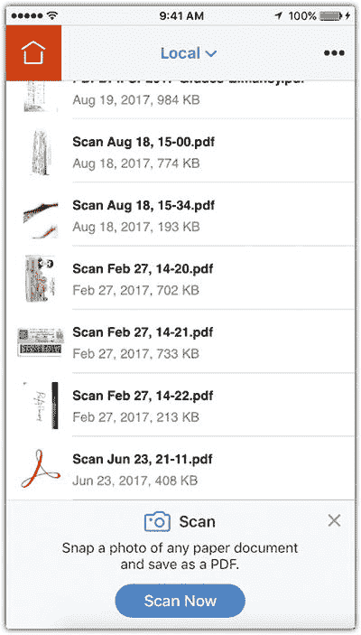

图 12-1：`Adobe Acrobat` 移动应用主界面

虽然 `Acrobat` 允许你通过点击屏幕左下角的闪光灯图标将相机闪光灯设置为开启、关闭或自动，但建议在光线充足（如充足的日光）的条件下扫描文档。这将确保获得清晰且高质量的扫描图像。此外，尽量避免手持相机时可能出现的阴影；你可以尝试改变自己的位置或扫描图像的位置。

### 步骤 1：设置文档并扫描

要设置并扫描文档，请按照以下步骤操作：

1. 打开 `Adobe Acrobat`。
2. 点击 `Acrobat` 的左侧菜单图标，然后选择 `扫描`（见图 12-2）。

    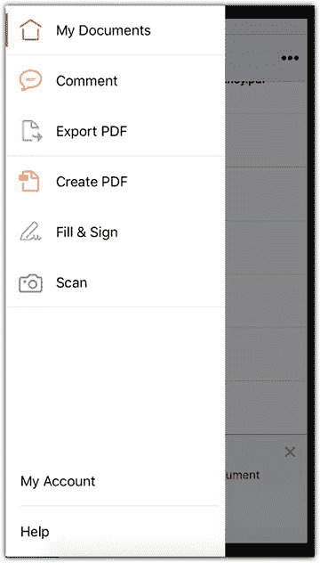

    图 12-2：`Acrobat` 应用的左侧菜单

    扫描文档时，`Acrobat` 允许你裁剪扫描的照片以仅显示所需区域。为确保 `自动裁剪` 已开启，请点击右下角的图标。
3. 将相机对准文档的第一页。`Acrobat` 会通过显示一个蓝色矩形来检测页面。对结果满意后，按下相机按钮拍照（见图 12-3）。

    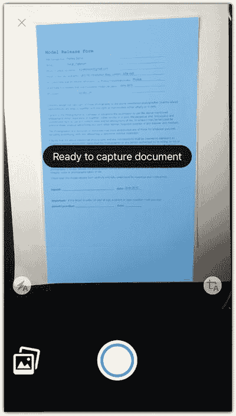

    图 12-3：`Acrobat` 的扫描功能检测纸张边界，并以蓝色高亮显示检测区域

### 步骤 2：添加和修改扫描文档

要添加和修改扫描文档，请按照以下步骤操作：

1. 在审阅屏幕上，你会看到扫描的照片。你可以通过点击 `添加照片` 图标来添加更多照片，可以选择 `拍摄另一张照片` 或 `从相册选择`。
2. 点击 `重新排序` 图标，通过将照片拖拽到所需顺序来重新排列文档中的页面顺序（见图 12-4）。

    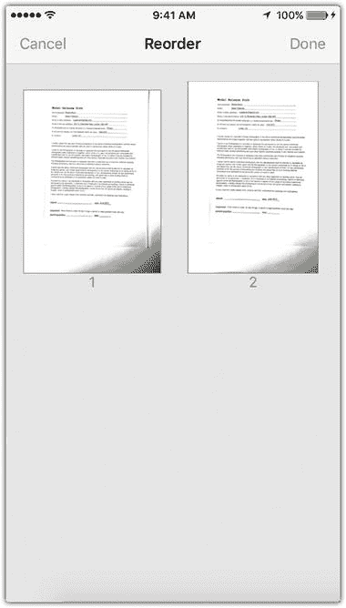

    图 12-4：拖拽页面以重新排序
3. 点击 `裁剪` 工具来修改裁剪区域。使用矩形定义要裁剪的区域，然后点击 `完成`。你可以点击 `旋转` 图标来更改页面的旋转方向。
4. 你可能会注意到页面上的颜色与原文档不同。你可以通过点击 `颜色编辑` 图标来确定图像的颜色类型，该图标允许你在 `原始照片`、`自动颜色`、`灰度` 和 `白板` 之间选择（见图 12-5）。

    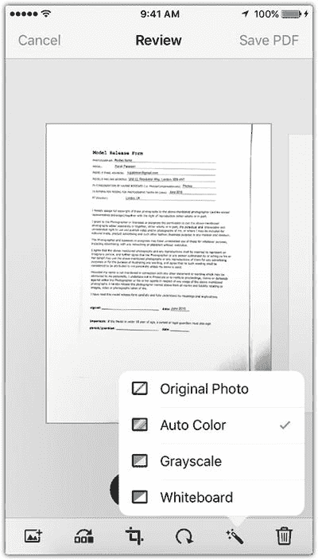

    图 12-5：为最终文档选择颜色设置

### 步骤 3：共享文档

你可以通过点击屏幕右上角的 `保存 PDF` 按钮来保存文档并与他人共享。你需要添加文档名称。如果你拥有免费的 `Adobe Document Cloud` 会员资格，文档将自动保存到云端。你也可以点击 `保存到云端` 手动保存。你可以点击 `共享` 通过电子邮件、Skype、WhatsApp 和其他应用程序将文档发送给他人。点击 `共享` 图标后，你将可以选择共享文档链接、共享文档本身、保存到 `Adobe Document Cloud`、保存到 `Dropbox` 或在其他应用程序中打开。如果你有支持的打印机，还可以打印文档（见图 12-6）。

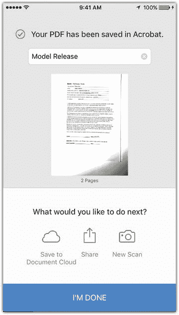

图 12-6：通过 `Adobe Document Cloud` 或其他应用程序共享扫描文档

### 步骤 4：评论文档

当有人向你发送需要审阅的文档（如发票或合同）时，你可以使用 iPhone 上的 `Acrobat` 在最终签名前添加评论和反馈。你也可以将其发回进行修改。

1. 点击底部工具栏中的 `评论` 图标以激活评论模式。你也可以通过点击 `Acrobat` 左侧菜单中的 `评论` 进入评论模式（见图 12-7）。

    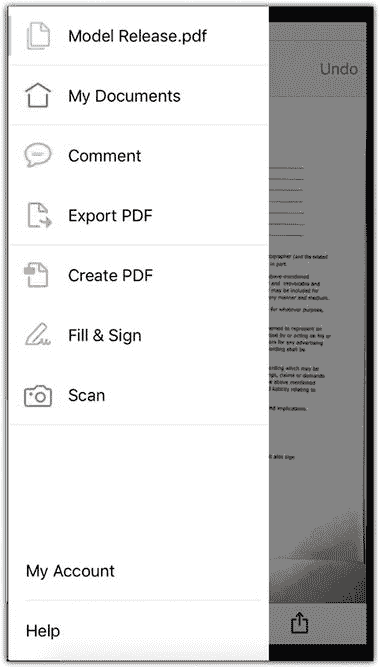

    图 12-7：在 `Acrobat` 菜单中选择 `评论` 模式
2. 点击底部工具栏上的 `便签` 图标。点击你想要添加评论的位置。在弹出的对话框中，输入你的姓名，然后输入便签内容。你还可以使用其他工具来高亮文本、添加删除线、下划线文本、添加文本、自由绘制以及添加签名（见图 12-8）。

    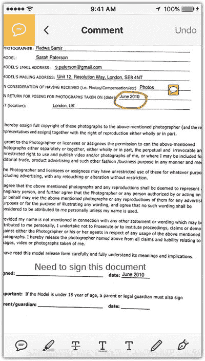

    图 12-8：使用评论工具添加便签、高亮文本和添加文本
3. 点击屏幕右上角的 `保存`。关闭应用后，你可以点击便签并将其拖拽到页面的任意位置。

### 步骤 5：填写并签署文档

使用工具：`Adobe Fill and Sign`

如果你有需要填写并签署的合同、表格或发票，`Adobe` 提供了一款免费应用 `Adobe Fill and Sign`，让你可以直接在 iPhone 上完成操作。`Adobe Fill and Forms` 通过保存你经常用于填写表格的基本信息（如姓名、地址、电子邮件、电话等）来节省时间。此外，它还会存储你的数字签名和姓名首字母，以便快速轻松地填写表格。

### 步骤 6：填写个人资料

要填写个人资料，请按照以下步骤操作：

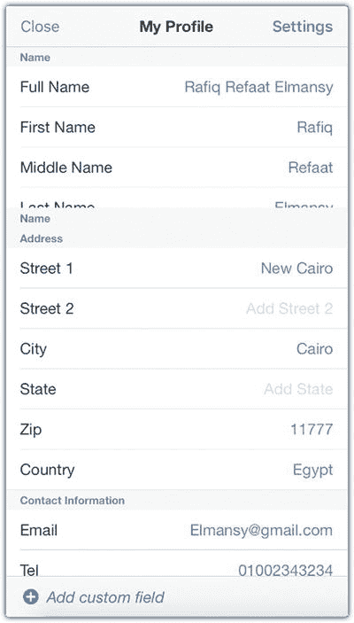

图 12-9：在 `Fill & Sign` 应用中填写个人资料信息

1. 打开 `Fill and Sign` 应用。
2. 点击底部工具栏中的 `个人资料` 图标，然后填写你可能会在表格中使用的个人信息，例如姓名、地址、电子邮件等（见图 12-9）。

### 步骤 7：添加签名和姓名首字母

要添加签名和姓名首字母，请按以下步骤操作：

1. 点击`签名`图标，选择添加签名或姓名首字母。该窗口允许您用手指或触控笔绘制签名。如果手指无法精确绘制，我建议使用触控笔（见图 12-10）。

    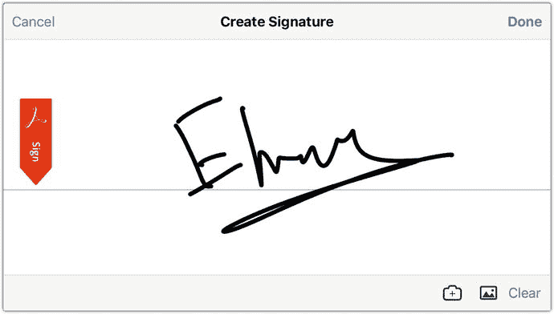

    图 12-10 使用`Fill & Sign`应用创建数字签名

2. 您也可以点击右下角的`相机`图标，拍摄纸质签名的照片并使用。如果已有签名图片，可以点击图片图标，导航至`相机胶卷`并使用该签名图片。

### 步骤 8：填写表单

要填写表单，请按以下步骤操作：

1. 设置个人资料信息和签名后，即可开始填写表单。点击要填写的字段，例如姓名。此时会出现一个文本字段，您可以通过输入信息来填写表单（见图 12-11）。

    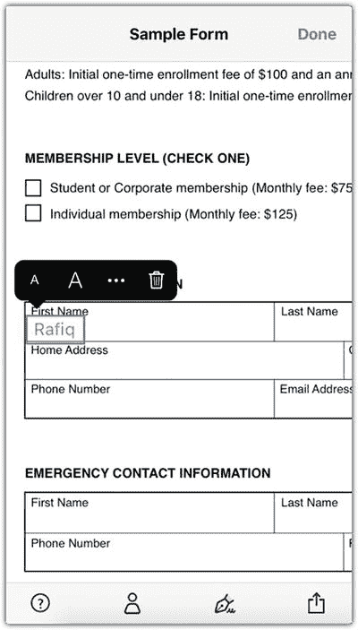

    图 12-11 使用个人资料信息中的数据填写表单

2. 如果信息已保存在您的个人资料中，请点击`个人资料`图标，再点击您要插入的信息，即可将其添加到表单中。
3. 如果文本超出表单字段范围，可以点击已添加的文本，显示调整大小的矩形框。您可以点击并拖动来重新定位文本，或拖动边缘来调整文本大小。
4. 在表单末尾，可重复之前的相同步骤。点击`签名`图标，选择添加完整签名或仅添加姓名首字母；完成后，可以重新定位或调整添加内容的大小（见图 12-12）。

    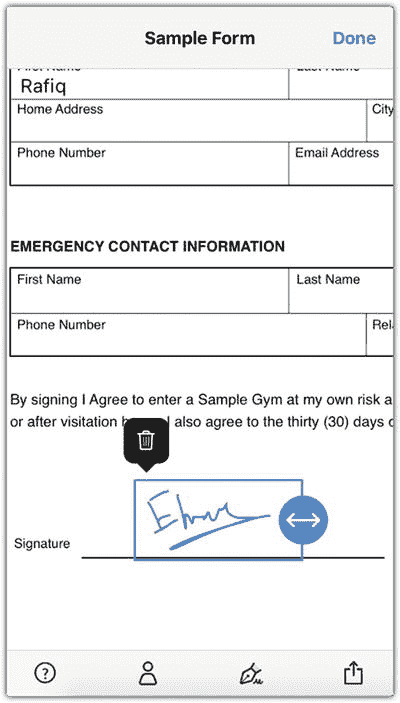

    图 12-12 从已保存的数字签名中添加签名

## 构建摄影作品集

作为摄影师，您的个人资料对于向客户和关注者展示作品、获取反馈以及与摄影师社区互动至关重要。如果您想成为专业摄影师，您的作品集和简历能确保客户深入了解您的经验和才华。

有多种方式可以打造您的线上形象，例如个人网站、作品集网站和社交网络页面。每种类型都有其优缺点。

### 个人摄影网站

拥有带专属网址的个人网站，能让您显得更专业，让关注者和客户视您为成熟企业。然而，这需要花费大量精力和专业知识来注册域名、选择可靠的服务器托管网站，并投入管理时间来上传和维护网站内容。或者，您也可以付费请公司为您处理所有事宜。

### 作品集网站

对于希望专注于作品本身的初级摄影师来说，自行托管网站既耗时又昂贵。因此，许多摄影师使用作品集网站，这些网站允许创建免费账户（有时提供付费升级功能）。这些网站包括：

- `500px.com`
- `Behance.net`
- `1x.com`
- `Flickr.com`

部分作品集网站涵盖所有艺术领域，例如 `Behance.net`（见图 12-13），而其他网站则专注于摄影，例如 `500px.com`（见图 12-14）。虽然这些网站不允许您拥有专属网址和自由设计网站，但它们提供了诸多优势。具体来说，作品集网站为您节省了大量创建专业网站所需的精力和成本。您只需创建一个免费账户，然后开始上传照片即可。

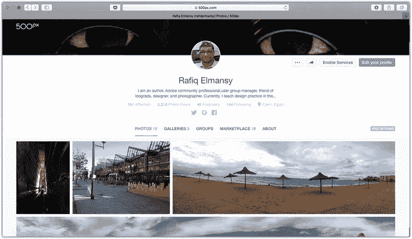

图 12-14 `500px` 是一个专注于摄影的在线个人资料网站

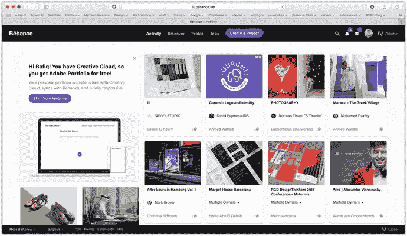

图 12-13 `Behance` 适用于通用主题的在线作品集

此外，许多此类作品集网站还包含社交网络功能，允许您关注其他摄影师、评价他们的作品以及评论他们的动态。

### 社交网络页面

另一种构建作品集的方式是使用社交网站，例如 `Facebook`、`Instagram` 和 `Pinterest`。这些网站非常适合社交互动和宣传作品。然而，这些网站并非设计用于将您的作品展示为真正的作品集。关注者会在您上传新照片时收到通知，但如果他们需要查看您之前的作品，则必须滚动浏览过往帖子或前往`照片`版块。

基于以上原因，作品集网站对于业余和专业摄影师构建作品集来说都是一个良好的起点。一些作品集网站，例如 `500px`，甚至提供移动应用，您可以直接从 iPhone 上传修改后的照片。`500px` 应用允许您拍摄并上传照片，而 `Raw` 应用则允许您拍摄 Raw 格式照片并上传至市场进行销售。

## 让您的照片易于搜索

如果您通过作品集网站或社交网络在线上存在，您需要让您的照片易于搜索，以便人们能够找到、购买或下载它们。当客户搜索特定照片或摄影服务时，他们会在 Google、Bing 或 Yahoo 的搜索框中输入所需内容。

搜索引擎不像我们一样“看”图像；它们查看的是与图像关联的元数据，例如图像标题、描述和关键词。将照片上传到作品集时，添加这些元数据至关重要，这能增加客户在搜索要购买的照片或要雇佣的摄影师时找到您的几率。

幸运的是，作品集网站允许您在上传照片时轻松插入这些信息。在接下来的步骤中，我将引导您通过 500px 应用，将照片从您的 iPhone 上传到您的 `500px.com` 个人资料：

1.  在您的 iPhone 上打开 500px 应用。
2.  点击底部工具栏上的相机图标。这将允许您拍摄一张照片或从您的设备中选择一张照片。
3.  点击“相机胶卷”以访问您的相册，并选择您要上传到个人资料的照片（见图 12-15）。

    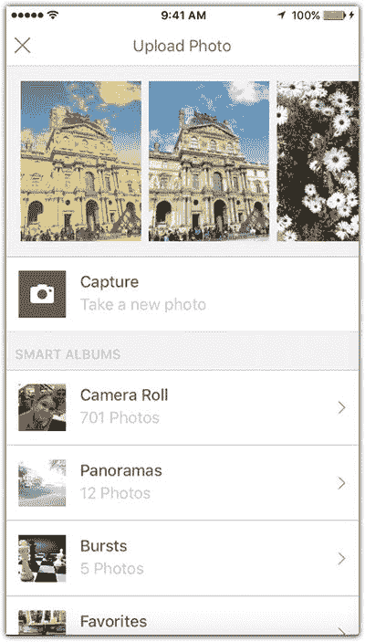

    图 12-15

    拍摄一张照片或从相机胶卷中选择一张，上传到您的 500px 个人资料
4.  在描述字段中，输入关于您照片的描述性信息，例如它是什么、类别、拍摄地点以及其他摄影规格。
5.  在“类别”部分，您可以选择您照片的类别。
6.  在关键词部分，您会注意到应用已根据照片内容添加了关键词；您可以添加更多关键词或移除不合适的关键词（见图 12-16）。

    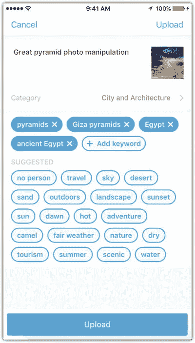

    图 12-16

    在上传照片前添加照片描述、类别和关键词
7.  点击“上传”。
8.  照片上传后，您可以在不同的社交网络上与您的关注者分享它。

如果您使用任何 Adobe 应用修改过照片，您可以直接从该应用中将照片上传到您的 `Behance.net` 账户，操作如下：

1.  在 `Photoshop Mix` 应用中打开您之前在本教程中创建的项目之一。
2.  点击屏幕右上角的分享图标，然后选择 Behance（图 12-17）。

    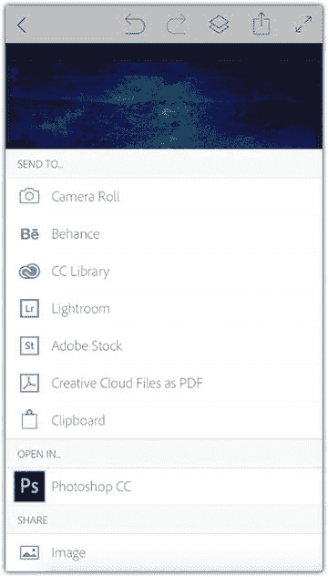

    图 12-17

    在 `Photoshop Mix` 中，从分享菜单中选择 Behance
3.  点击底部工具栏中的文本图标，为照片添加描述，然后点击“保存”。您可以点击“重新排序”链接来更改文本和图像的顺序。完成后，点击“下一步”（见图 12-18）。

    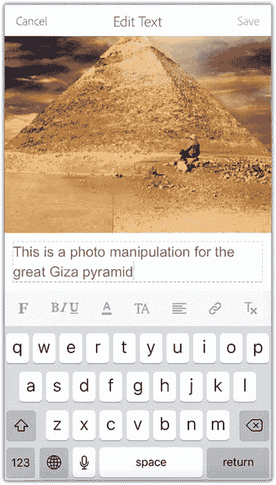

    图 12-18

    使用文本图标为您的项目添加文字
4.  在“选择封面”页面上，从底部的图像中为您的项目设置封面。点击“下一步”。
5.  在“信息”页面上，填写项目信息（见图 12-19）。
6.  点击“高级”为项目添加更多详细信息。
7.  点击“发布”。

    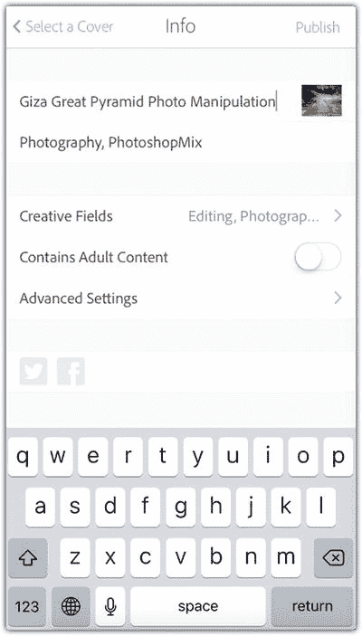

    图 12-19

    添加项目信息。点击“高级设置”以添加更详细的信息

## 在线销售照片

现在是时候用您的 iPhone 照片赚钱了。凭借您学到的先进相机功能、工具和技巧，您可以用漂亮的 iPhone 照片赚钱。尽管照片市场竞争激烈，但好的照片仍然能产生影响。在开始上传您的照片进行销售之前，您需要考虑一些通用准则，以便专业地打造您的作品品牌。这些准则包括以下几点：

-   您需要在销售照片的网站上拥有一个专业的个人资料。当有人购买您的照片时，他们更有可能访问您的个人资料或浏览您的其他照片。因此，保持专业形象很重要。您可以通过访问每个网站上的顶级资料，查看它们的外观并从中获取灵感，来轻松了解专业的个人资料。
-   您需要了解市场需求。哪些照片是人们最想购买的？实际上，这个问题的答案因网站而异，您稍后会看到。因此，您需要做一些研究，了解下载量最高的照片、它们的主题以及所属类别。这可以帮助您了解哪些照片适合上传到特定平台。此外，许多当前的图片销售网站会为您未上传到其他网站的独家照片提供更高的费率。据此，您可以决定哪些照片适合每个网站。

### 在哪里销售您的照片？

谈到销售您的照片，有多个平台可供您创建摄影资料并出售照片。通常，它们是基于佣金的平台，您可从每笔销售中获得一定比例的提成。您实现的销售额越高，获得的提成比例就越高。这种模式鼓励摄影师推广自己的照片并上传更多照片，以提高他们的销售提成比例。

有许多图库网站，您可以都尝试一下；然而，最好还是专注于热门的网站，因为您在那里将有更好的机会销售照片。可惜的是，这些网站上的竞争也很激烈。这些网站包括：

-   Pond 5：`https://www.pond5.com`
-   Adobe Stock：`https://stock.adobe.com`
-   Shutter Stock：`https://www.shutterstock.com`
-   iStockphotos：`www.istockphoto.com`
-   500px Marketplace：`https://marketplace.500px.com`

其中一些应用程序，如 Adobe Stock 和 500px，允许您直接从 iPhone 将照片提交到它们的市场。在 Adobe Stock 中，您可以打开一个 Adobe 移动应用（如 `Photoshop Mix`），点击分享图标，然后选择 Adobe Stock（见图 12-20）。

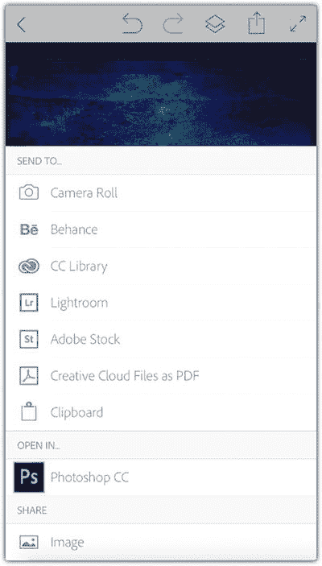

图 12-20

您可以从 `Photoshop Mix` 将照片上传到 Adobe Stock 市场

对于 500px，您可以下载 Raw 应用，它允许您直接从 iPhone 拍摄 Camera Raw 照片。修改图像后，您可以选择将其提交到它们的市场。

此外，您还可以在工艺品网站（如 Etsy）上销售您的照片，该网站允许您通过开设店铺来销售任何实体和数字艺术品。然后您可以提供您的照片，客户可以下载或打印它们，或者您也可以将它们作为打印的实体产品交付。虽然 Etsy 并非专注于销售照片，但它允许您以数字和打印两种格式提供您的照片。这可以最大化您的收入。

最后，如果您在诸如 Shopify 之类的网站上创建在线商店，您可以在自己的网站上销售照片，这可以最大化每张照片的收入，因为无需向图库网站支付佣金。但是，您需要大力推广您的网站来寻找客户，这并非易事。

## 总结

通过掌握本章中与商业相关的技巧，你可以将手机摄影爱好提升到新的专业水平。新款 iPhone 大幅提升了相机和摄影功能，让你能够拍摄出专业的照片，并可以在线出售或添加到你的专业作品集中。iPhone 还能让你通过访问文档来管理你的摄影业务，在文档中你可以进行审阅、评论、签署并与同行分享。此外，你可以直接从手机将照片上传到你的在线个人资料，并提交到摄影市场。

## 练习

本章的练习与之前的有所不同，因为它不涉及任何照片编辑。请从你的书桌中找到一份纸质文件或合同，并尝试使用 `Acrobat` 应用对其进行扫描，将其数字化。然后，开始使用批注工具为文档添加你的笔记。此外，从之前涉及的项目中选择一张照片，直接通过你的 iPhone 将其上传到你在 `500px` 或 `Behance` 上的个人资料。不要忘记添加必要的信息，使你的作品易于搜索和被发现。

