# 附录 A：摄影师简介

有许多优秀的摄影师使用 iPhone 进行创作。在本附录中，从他们身上汲取灵感吧。

## 阿莫·帕西科斯

[`http://melle-amo.fr/`](http://melle-amo.fr/)

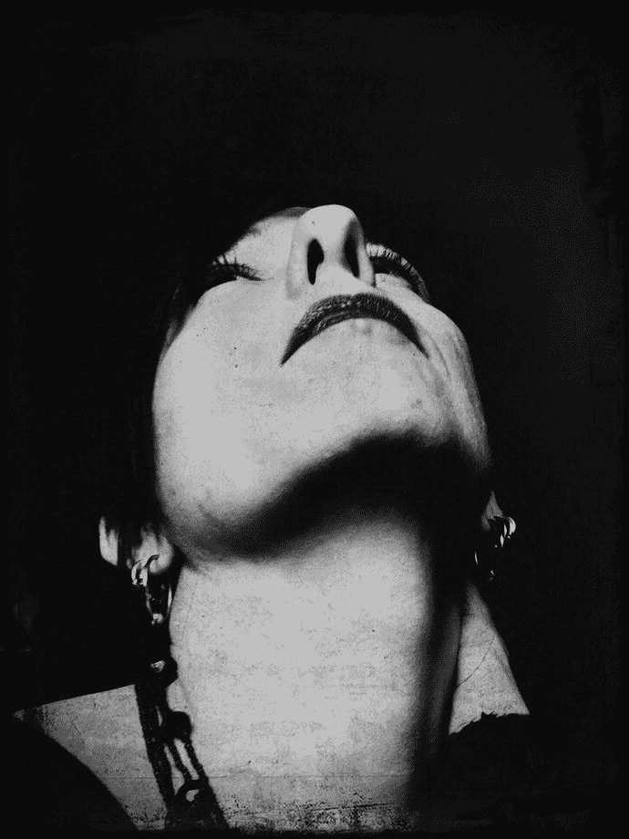

阿莫·帕西科斯是自学成才。尽管她的照片可能暗示她有些近视、混乱并且以家庭为导向，但这些照片只是展现了她所努力保留的、在记忆消逝前那些散落回忆的严重无序状态。

被技术的新颖性及其衍生品所吸引，阿莫以“先行者”的姿态，兴致勃勃地测试了她 iPhone 上提供的数百个应用程序。被影像的即时性所吸引，她以游戏的心态和真诚的愿望拍摄照片，为一种新艺术形式的出现做出贡献。

她目前居住在法国南部，并管理着女性摇滚乐队。

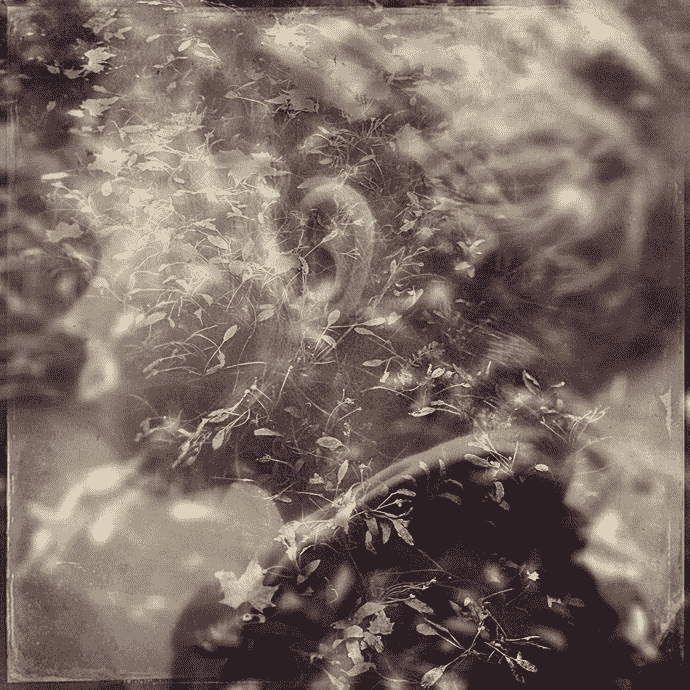

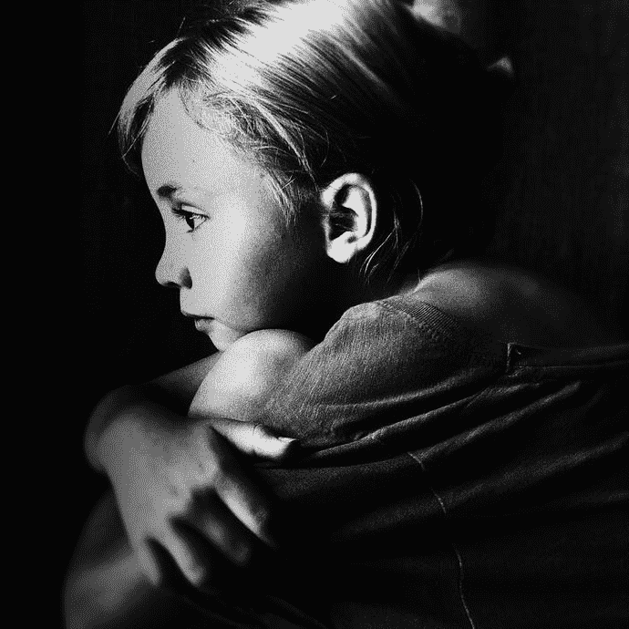

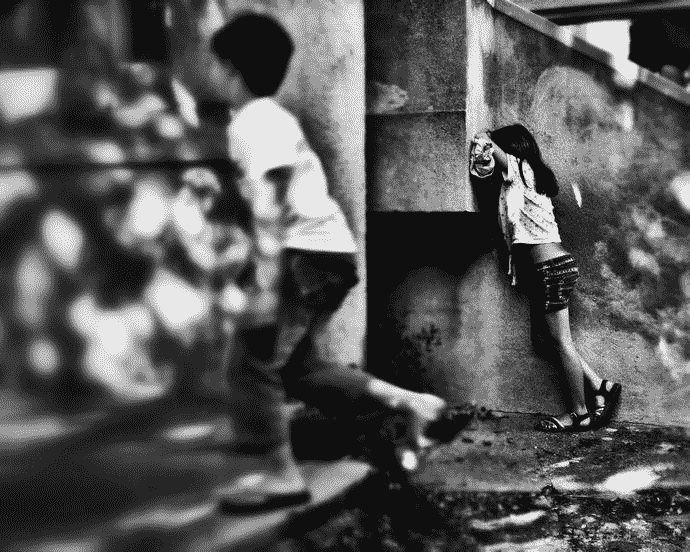

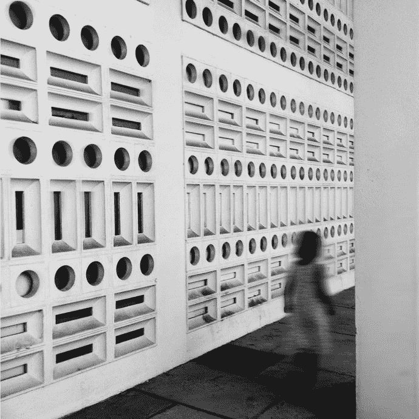

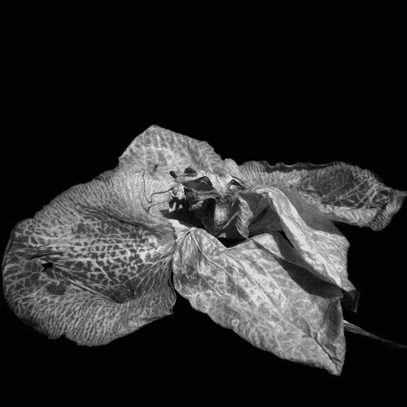

## 曼迪·布莱克

[`www.mandyblakephotography.com`](http://www.mandyblakephotography.com)

曼迪·布莱克是一位来自加拿大安大略省基奇纳的职业摄影师。她是一位屡获殊荣的 iPhone 摄影师，曾多次出现在苹果公司的“用 iPhone 拍摄”广告活动中。当她不是在用 iPhone 在水面上下追逐光线时，她是一名忙碌的婚礼和家庭摄影师，拥有纪实摄影的眼光和轻松的风格。

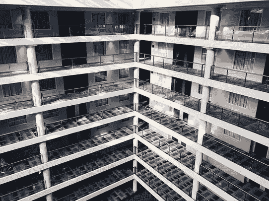

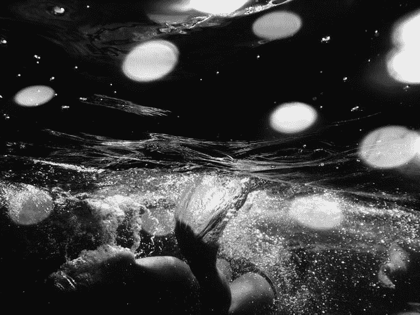

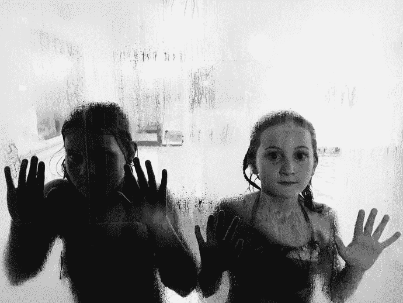

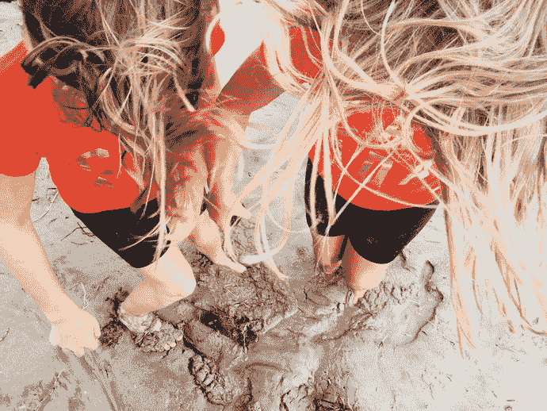

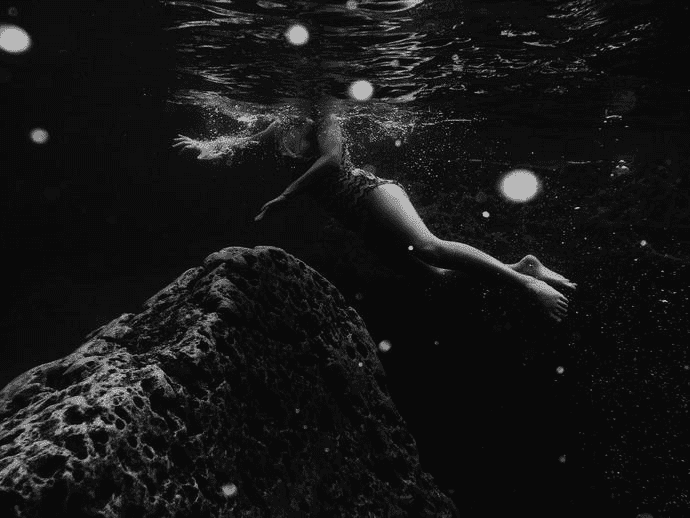

## 迈克尔·克劳森

迈克尔·克劳森是 Big Fish Creations（一家位于内华达山脉小镇格雷格尔的广告与数字媒体公司）的首席创意总监。他的职业生涯始于硅谷，当时苹果电脑和 Adobe 系统刚刚在桌面出版领域崭露头角。在他职业生涯早期就接触了交互式媒体，后来转型为制作艺术家，并最终成为内华达州一家大型广告公司交互部门的创始人和主要负责人。他专攻跨媒体平台的品牌塑造，其多样化的技能组合融合了设计师和开发者的身份，重点在于平面设计、品牌塑造、摄影和沟通。作为演讲者，迈克尔曾多次在行业特定会议上发表演讲，包括 Adobe Max 和 MacWorld。

迈克尔于 2011 年末开始以 iPhone 摄影师的身份进行创作，当时他发现了藏在其小巧手机相机中的强大力量。作为一名专业摄影师，他开始探索 iPhone 的局限性（并因此了解了它的优势），并很快开始利用该设备发挥其创造力的各个方面。他将 Instagram 视为一个让 iPhone 摄影艺术得以蓬勃发展的艺术分享社区，这给了他探索新机遇和新发现的灵感。迈克尔还是一位出版过著作的作者，经常撰写关于 iPhone 摄影和创意编辑的文章并教授相关课程。

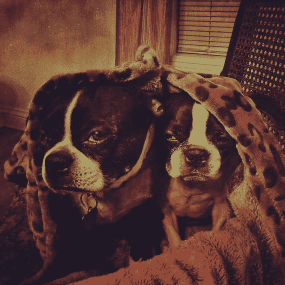

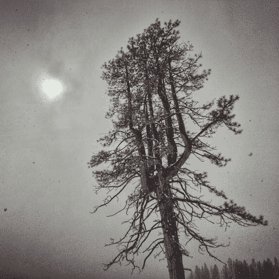

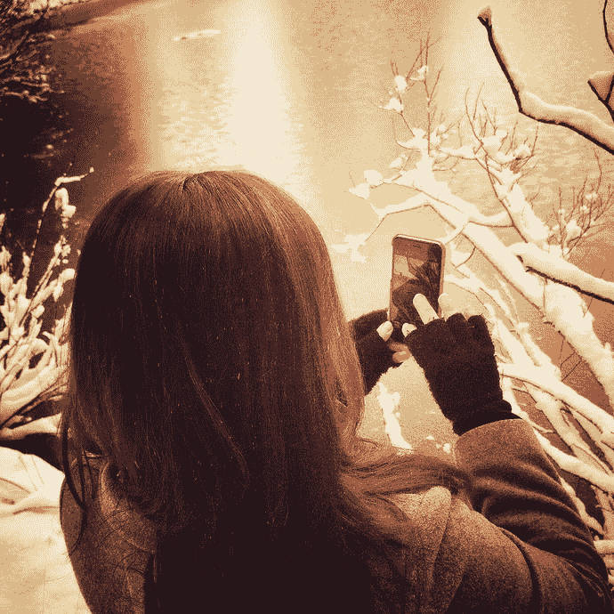

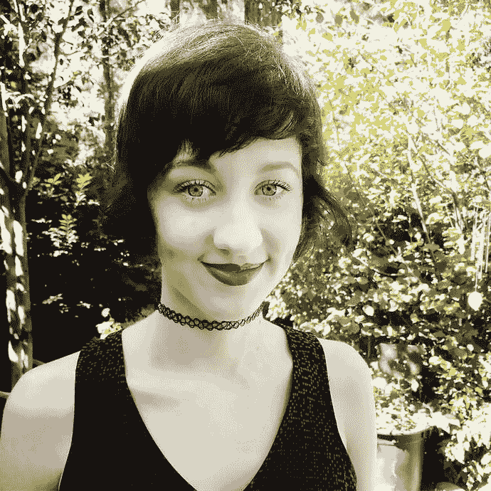

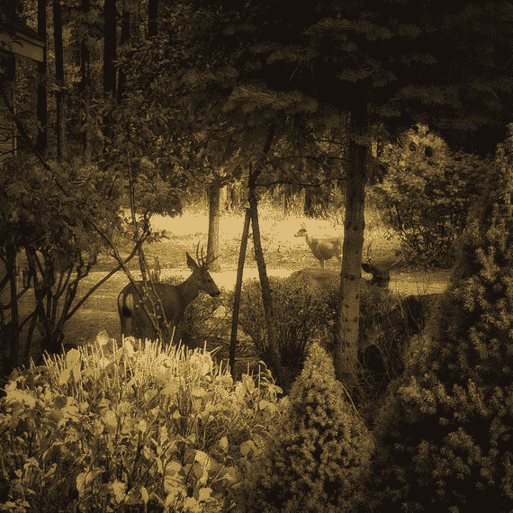

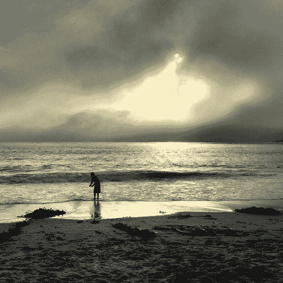

