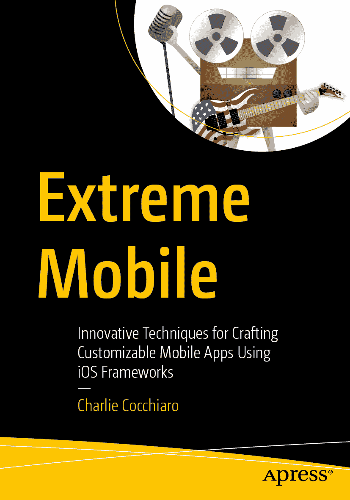

# 排版后内容

`ISBN 979-8-8688-2322-0` `e-ISBN 979-8-8688-2323-7` [`doi.org/10.1007/979-8-8688-2323-7`](https://doi.org/10.1007/979-8-8688-2323-7)

© Charlie Cocchiaro 2026 本作品受版权保护。所有权利均由其出版商独家授权，无论涉及材料的整体还是部分，具体包括翻译、重印、插图复用、朗诵、广播、在微缩胶片或其他物理形式上复制，以及以目前已知或未来开发的类似或不同方法进行传输、信息存储与检索、电子改编、计算机软件等权利。本出版物中使用的通用描述性名称、注册商标、商标、服务标志等，即使在未明确声明的情况下，也不意味着这些名称可以免除相关保护法律和法规的约束，因此可供大众自由使用。出版商、作者及编辑谨慎假定，本书中的建议和信息在出版之日是真实且准确的。出版商、作者及编辑均不对书中所含材料或可能存在的任何错误或疏漏提供明示或暗示的担保。对于已出版地图中的管辖权主张及机构归属，出版商保持中立。

本 Apress 印记由注册公司 APress Media, LLC（施普林格自然集团旗下）出版。

注册公司地址为：美国纽约州纽约市新广场 1 号，邮编 10004。

*献给我的妻子伊莱恩，感谢她激励我成就伟业。献给我的父母山姆和吉恩，感谢他们为我追逐梦想所付出的诸多牺牲。献给我的兄弟卡尔，感谢他鞭策我追求完美。献给我的姐妹西莉亚和兄弟克里斯，感谢他们坚定不移的支持。*

