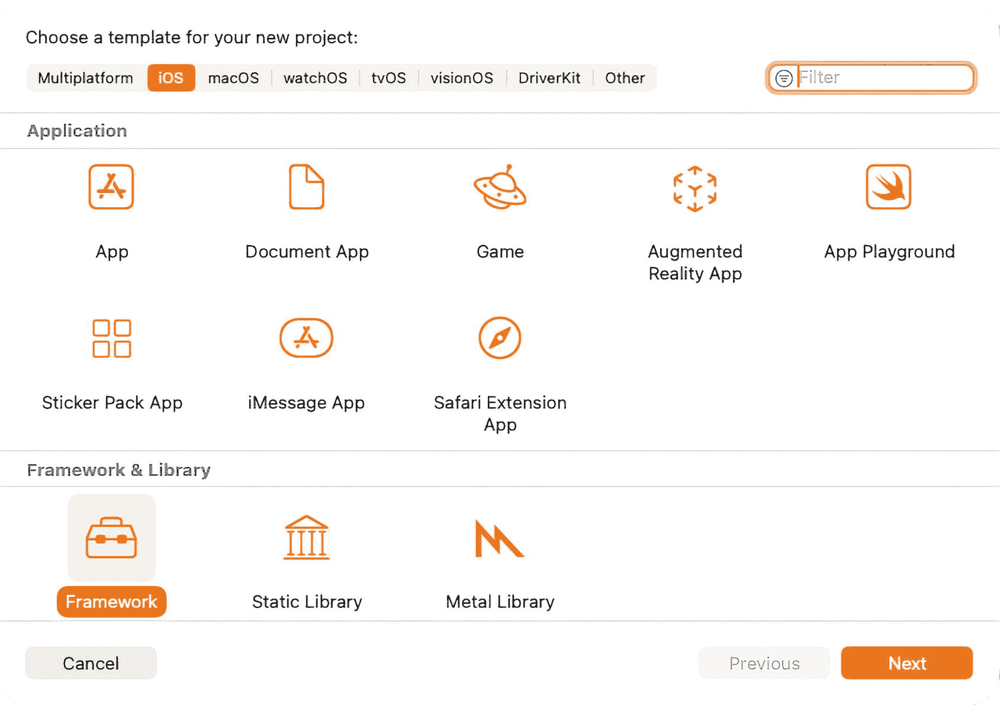
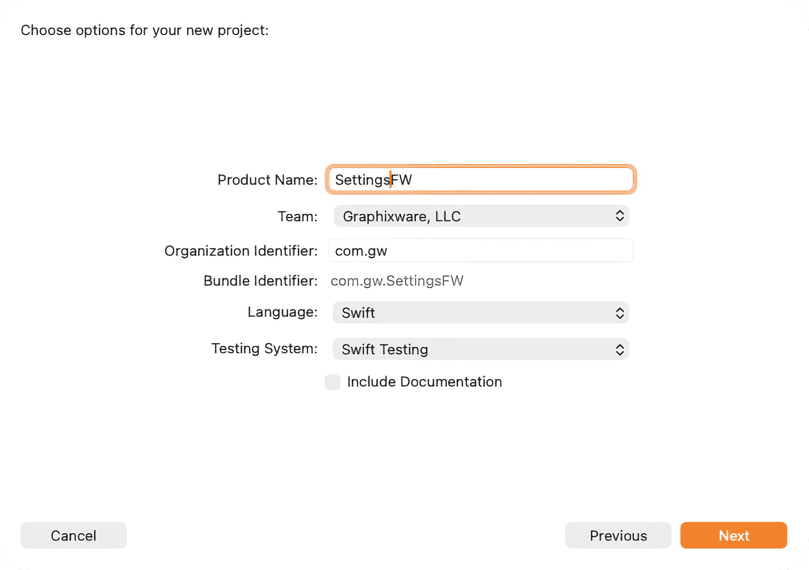
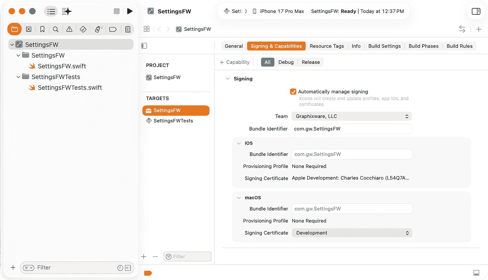
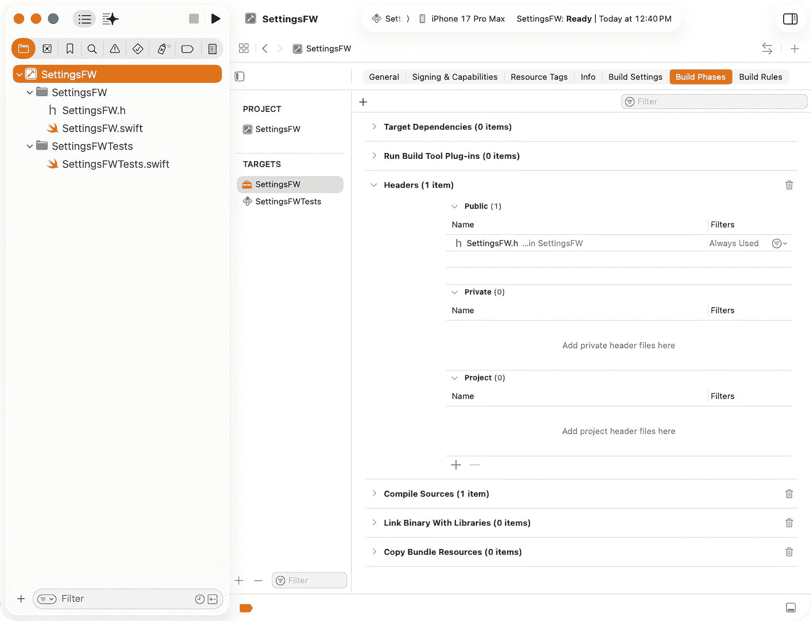
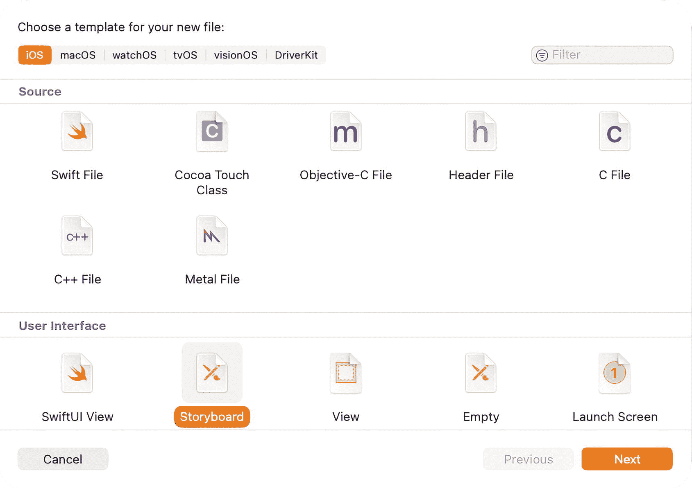
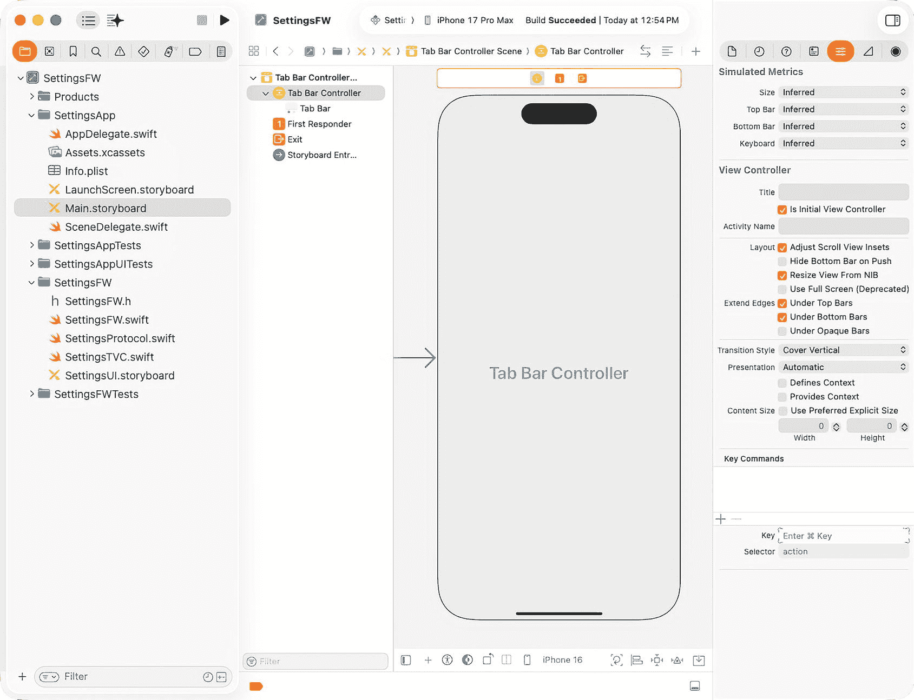
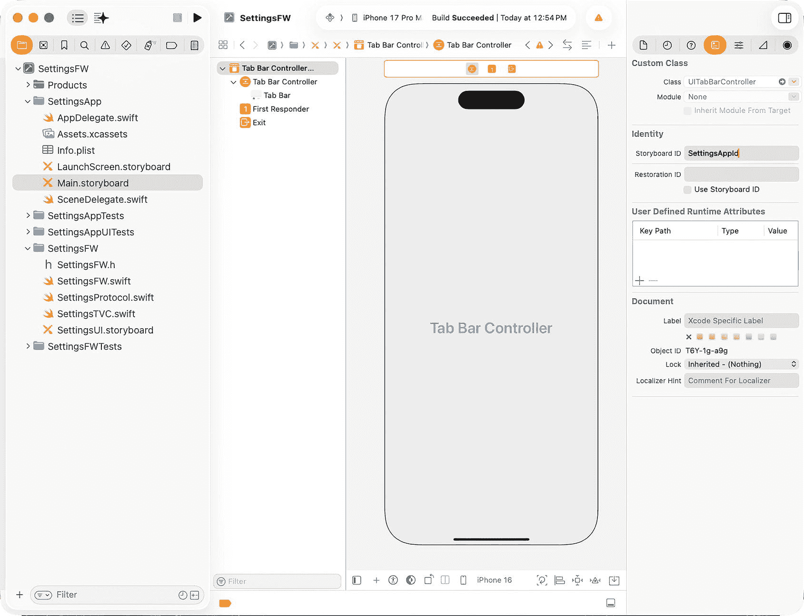
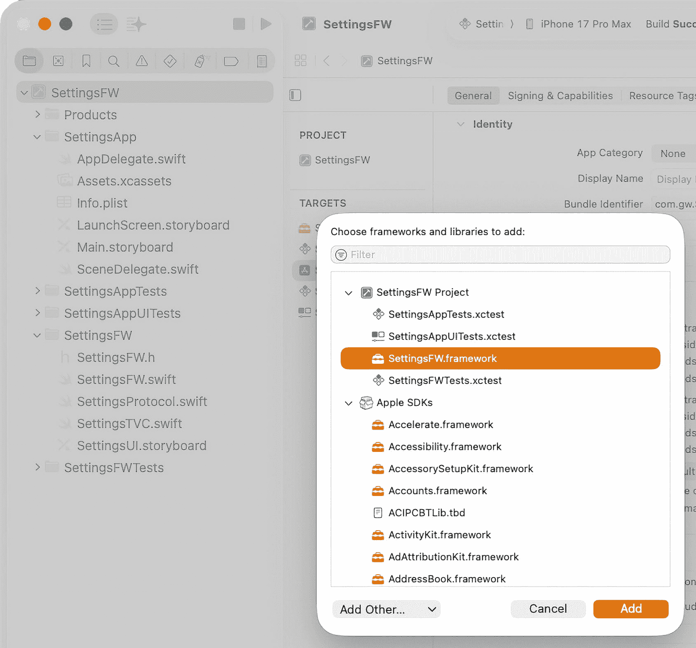
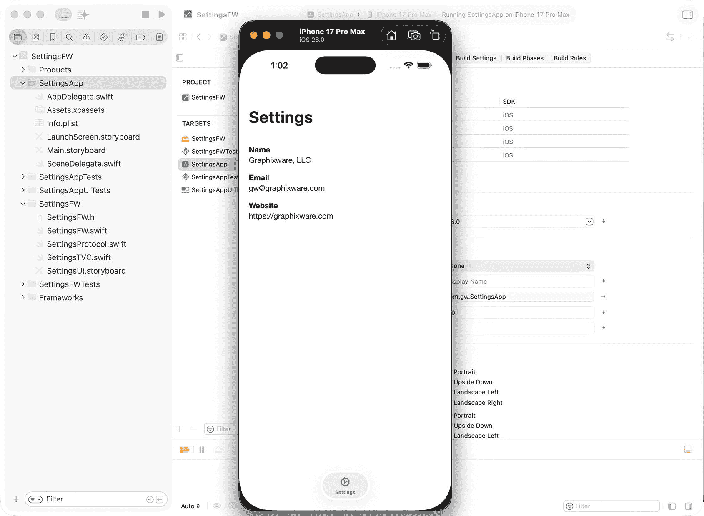

# 1. 构建模块化框架设计的基础

设计 `SettingsFW` 框架

`Swift` 协议将被引入作为支持移动应用中软件模块化的首要手段。`Swift` 协议是一种蓝图或接口，它定义了一组方法、属性和要求，供类、结构体或枚举采用。它提供了一种在不同类型之间建立契约的方式，使它们能够以一致的方式进行通信和交互。`Swift` 中的协议用于定义可在多个类型之间共享的公共行为或功能，从而实现代码复用并促进模块化。通过采用协议，类型保证实现协议定义的必需方法和属性，从而确保具备一组公共能力并实现多态性。你可以在 `Swift.org` 找到关于 `Swift` 协议(¹) 的更多细节。

在设计 iOS 框架时，努力实现软件组件的解耦至关重要。这一目标确保对某一组件的修改对其他组件的影响最小化。当组件紧密耦合，存在强依赖关系时，系统的维护将变得艰巨且耗时。`Swift` 协议可以通过抽象化实现细节，并减少在框架及其集成的应用中需要进行的全局性修改，从而帮助降低耦合度。这有助于实现更精简、更易于管理的开发过程。

在本章中，我们将使用 `Swift` 协议设计一个 iOS 框架。到本章结束时，你将创建出第一个 iOS 框架，并成功将其集成到一个移动应用中，从而获得处理模块化、可复用代码的实战经验。


## 创建 iOS 框架

Xcode 提供了一个名为 `Framework` 的项目模板，位于 `Frameworks & Libraries` 分组下，用于创建 iOS 框架。该框架模板最初被称为 Cocoa Touch 框架，它将为项目提供一组默认文件。在你学习本章的过程中，将逐步向其中添加内容。让我们开始吧！

为你的新项目选择一个模板：



图 1-1 新项目模板

1. 启动 `Xcode`
2. 选择 `创建新项目`
3. 在 `框架与库` 分组下选择 `框架` 模板（**图** **1-1**）
4. 选择 `下一页`

为新项目选择选项（**图** **1-2**）：



图 1-2 新项目设置

**产品名称：** 你的新产品名称

这将是框架项目的名称。项目根目录中会创建一个同名的文件夹。本项目中请使用 `SettingsFW`。

**团队：** 你的开发团队

此字段是一个下拉菜单，包含与你的 Apple ID 关联的代码签名身份。你需要选择一个，以确保在 Apple App Store 发布应用时，该应用来自你的组织。如果需要创建代码签名身份，可以在框架创建后，参考相应的 Apple 文档来完成。^(²)

**组织标识符：** 你组织的包标识符前缀

该值将附加到包标识符之前。

**语言：** 你的主要实现语言

该值应设置为 `Swift`，因为本书提供的代码示例均使用 Swift。

**测试系统：** `XCTest` 或 `Swift Testing`

该值应设置为 `Swift Testing`，因为本书提供的代码示例使用了 Swift Testing 框架。

其余设置可根据需要自行决定。

### 配置 iOS 框架

`Framework` 模板设置了大多数必要的项目设置。如果你仍需要为框架关联一个团队，请使用上一步中提到的 Apple 文档创建一个团队，下载并选中它（**图** **1-3**）：



图 1-3 签名与功能设置

1. 选择 `Xcode`/`设置` 菜单项
2. 选择 `Apple 账户` 选项卡。如果你未登录 Apple 账户，请立即登录，这将自动将你的团队下载到“团队”部分
3. 关闭设置，并在 `项目导航器` 中选择项目的根节点
4. 在 `显示项目与目标列表` 下选择默认目标
5. 选择 `签名与功能` 选项卡
6. 在 `签名` 部分下选择 `自动管理签名`
7. 在 `团队` 下拉列表中选择你的团队

项目创建后，`构建设置`/`打包` 部分下的 `DEFINES_MODULE` 设置可设为 `YES`，以便将框架打包为 Swift 模块，从而允许在 Swift 代码中使用 `import [框架名称]` 导入，并可通过伞头文件暴露任何公共 Objective-C 头文件。如果需要伞头文件来暴露 Objective-C 头文件，则需执行以下步骤：



图 1-4 构建阶段设置

1. 在 `项目导航器` 中右键点击框架文件夹，选择 `从模板新建文件…`
2. 在 `源` 部分下选择 `头文件` 模板，然后点击 `下一页`
3. 输入文件名，例如 `SettingsFW.h`，并创建该文件
4. 在 `项目导航器` 中选择根节点
5. 选择 `构建阶段` 选项卡，展开 `头文件` 部分，将伞头文件拖拽到 `公共` 列表中（**图** **1-4**）
6. 在 `项目导航器` 中选择伞头文件，并插入以下内容（请使用相应的框架名称）：

```objc
#import 
//! SettingsFW 的项目版本号。
FOUNDATION_EXPORT double SettingsFWVersionNumber;
//! SettingsFW 的项目版本字符串。
FOUNDATION_EXPORT const unsigned char SettingsFWVersionString[];
// MARK: - 公共 Objective-C 头文件
// 在此处导入所有你希望 Swift 可见的头文件
// MARK: - 可选的 Swift 互操作性
// 仅包含 Swift 代码的类会自动可用，无需导入
```

**趣闻：** 旧版本的 Xcode 会自动生成此文件。

### 创建故事板

iOS 框架可以提供不同类型的功能，你可以在移动应用中使用，包括 Swift 类扩展、常用工具、第三方 API 集成以及功能集。在本例中，将使用 Interface Builder 开发一个用户界面故事板功能。本书后续章节将创建一个更复杂的 SwiftUI 用户界面。



图 1-5 新文件模板窗口

1. 在 `项目导航器` 中右键点击框架文件夹，选择 `从模板新建文件…`
2. 在 `用户界面` 分组下选择 `故事板` 模板（**图** **1-5**），然后点击 `下一页`
3. 将文件保存为 `SettingsUI.storyboard`


## 创建用户界面

本框架将展示账户设置。你可以使用 Interface Builder 练习开发此用户界面，也可以从 GitHub 下载源代码并替换 Storyboard 文件内容，具体操作如下：


图 1-6 Storyboard 编辑器

1. 在`Project Navigator`中右键点击`SettingsUI.storyboard`，选择“打开方式/源代码”
2. 选中文件内容并删除
3. 在文本编辑器中打开下载的`SettingsUI.storyboard`文件，并将其内容粘贴到项目的`.storyboard`文件中
4. 在`Project Navigator`中右键点击该 Storyboard 文件，选择“打开方式/Interface Builder - Storyboard”（**图** 1-6）

### 创建 Cocoa Touch 类

需要创建一个 Cocoa Touch 类来支持 Storyboard 中定义的用户界面：

1. 在`Project Navigator`中右键点击文件夹，选择**从模板新建文件…**
2. 在**Source**部分选择**Cocoa Touch Class**模板，然后点击**下一步**
3. 输入类名，例如`SettingsTVC`，并将`UITableViewController`设置为父类
4. 确保**同时创建 XIB 文件**未勾选，且**语言**为 Swift

将`SettingsTVC.swift`中的默认生成代码替换为以下内容：

```
import UIKit
class SettingsTVC: UITableViewController {
@IBOutlet weak var nameLabel: UILabel!
@IBOutlet weak var nameValueLabel: UILabel!
@IBOutlet weak var emailLabel: UILabel!
@IBOutlet weak var emailValueLabel: UILabel!
@IBOutlet weak var websiteLabel: UILabel!
@IBOutlet weak var websiteValueLabel: UILabel!
var configuration: Dictionary?
func configure(configuration: Dictionary) {
self.configuration = configuration
}
override func viewDidLoad() {
super.viewDidLoad()
self.navigationController?.navigationBar.prefersLargeTitles = true
self.navigationItem.largeTitleDisplayMode = .always
// 以下硬编码值在实际应用中将通过 API 从后端存储获取...
self.nameValueLabel.text = "Graphixware, LLC"
self.emailValueLabel.text = "gw@graphixware.com"
self.websiteValueLabel.text = "https://graphixware.com"
}
override func numberOfSections(in tableView: UITableView) -> Int {
return 1
}
override func tableView(_ tableView: UITableView, heightForHeaderInSection section: Int) -> CGFloat {
return 0
}
override func tableView(_ tableView: UITableView, numberOfRowsInSection section: Int) -> Int {
return 3
}
override func tableView(_ tableView: UITableView, canEditRowAt indexPath: IndexPath) -> Bool {
return false
}
}
```

由于此类仅作为任意账户设置的静态表示，因此分区数和行数通过`numberOfSections()`和`numberOfRowsInSection()`固定。

字典变量`configuration`和函数`configure()`将允许在未来启用和配置新功能（当这些功能通过框架增强可用时）。本章后续将添加`SettingsTVC`所需的额外代码。

## 创建 Swift 协议

为实现框架集成到应用中的功能，需要定义一个应用可以使用的公共接口。虽然框架可以在不使用协议的情况下，简单地在 Swift 类中暴露一个公共函数，但这会导致两个实体之间紧密耦合，并阻碍框架在未来修改其用户界面而不影响消费端应用。更好的方法是定义一个公共协议来隐藏实现细节，允许框架在未来进行更改而无需修改应用或再次发布 App Store。请按以下步骤创建协议：

1. 在`Project Navigator`中右键点击文件夹，选择**从模板新建文件…**
2. 在**Source**部分选择**Swift File**模板，然后点击**下一步**
3. 将文件命名为`SettingsProtocol.swift`

需要定义一个带有字典参数的协议函数，该函数将在未来用于暴露、启用和配置框架功能：

```
import Foundation
import UIKit
protocol DisplayableViewController {
func instantiateRootViewController(configuration: Dictionary) -> UIViewController
}
```

需要实现该协议以实例化根视图控制器：

```
public class SettingsProtocol: DisplayableViewController {
public init() {}
public func instantiateRootViewController(configuration: Dictionary) -> UIViewController {
let storyboard = UIStoryboard(name: "SettingsUI", bundle: Bundle(for: SettingsTVC.self))
let vc = storyboard.instantiateViewController(withIdentifier: "SettingsNC")
if let navController = vc as? UINavigationController {
if let settingsTVC = navController.topViewController as? SettingsTVC {
settingsTVC.configure(configuration: configuration)
}
}
return vc
}
}
```

**趣味事实：** 如果未使用`UIStoryboard`初始化器`Bundle(for: [class])`，从外部应用目标引用框架 Storyboard 时将无法找到。

**趣味事实：** 如果在 Storyboard 中未为框架视图控制器分配 **Storyboard ID** 和对应的类，它将无法正常加载（示例 Storyboard 已设置好这些内容）。

**趣味事实：** 定义函数协议时未使用访问修饰符，但在实现时必须将其设为`public`，以便外部应用目标正确集成。

至此，代码应能顺利编译。

## 创建应用目标

为了在不集成到外部应用（此操作将在框架项目外部进行）的情况下运行 iOS 框架，需要在框架项目中创建一个应用目标用于测试。请按以下步骤创建应用目标：


图 1-7 新目标模板

1. 在`Project Navigator`中选择根节点
2. 点击**Targets Navigator**底部的 **+** 图标以创建新目标
3. 在**Application**组下选择**App**模板（**图** 1-7），然后点击**下一步**
4. 将**项目名称**设置为`SettingsApp`
5. 将**界面**设置为**Storyboard**
6. 将**语言**设置为**Swift**

其余设置可任意选择。


### 创建应用目标用户界面

创建应用目标时，会生成一组默认文件。其中部分文件无需使用，另一些则需要修改以暴露框架的功能，在本例中即框架的用户界面。请执行以下步骤来创建应用目标的用户界面：

1. 从**项目导航器**中选择 `ViewController.swift` 并删除，因为它不需要
2. 从**项目导航器**中选择 `Main.storyboard`，然后从**故事板导航器**中选择**视图控制器场景**并删除
3. 选择**界面生成器**左下角附近的**库**图标（+ 图标），并创建一个**标签栏控制器**
4. 删除**项目 1 场景**和**项目 2 场景**，因为它们不需要

### 设计应用目标用户界面

请执行以下步骤来配置应用目标的用户界面：



图 1-9 故事板编辑器



图 1-8 故事板编辑器

1. 在界面生成器中选择**标签栏控制器场景**
2. 使用右上角对应的图标选择**显示身份检查器**
3. 在相应字段中输入**故事板 ID**，例如 `SettingsAppId`（**图** **1-8**）
4. 使用右上角对应的图标选择**显示属性检查器**，并选择**是初始视图控制器**（**图** **1-9**）

### 添加 iOS 框架

在将 iOS 框架集成到应用之前，需要先将其添加到应用目标中：



图 1-10 添加框架

1. 在**项目导航器**中选择框架项目的根节点
2. 在**目标**部分选择 `SettingsApp` 目标
3. 选择**通用**标签页，然后点击**框架、库和嵌入式内容**部分的 **+** 图标
4. 将框架添加到应用目标，它将出现在**框架、库和嵌入式内容**部分，并带有**嵌入并签名**选项（**图** **1-10**）

### 集成 iOS 框架

需要在应用的 `SceneDelegate.willConnectTo()` 方法中集成 iOS 框架，以便使用定义的协议实例化框架的用户界面：

```swift
import SettingsFW
func scene(_ scene: UIScene, willConnectTo session: UISceneSession, options connectionOptions: UIScene.ConnectionOptions) {
    guard let winScene = (scene as? UIWindowScene) else { return }
    if let storyboard = session.configuration.storyboard {
        if let tabBarController = storyboard.instantiateInitialViewController() as? UITabBarController {
            window = UIWindow(windowScene: winScene)
            window?.rootViewController = tabBarController
            window?.makeKeyAndVisible()
            // 通过协议添加框架用户界面...
            var tbcViewControllers = tabBarController.viewControllers ?? []
            tbcViewControllers.append(SettingsProtocol().instantiateRootViewController(configuration: ["TestAttribute" : true]))
            tabBarController.setViewControllers(tbcViewControllers, animated: false)
            tabBarController.tabBar.isHidden = (tbcViewControllers.count <= 1)
        }
    }
}
```

#### 运行应用目标

在方案下拉菜单中选择 `SettingsApp` 作为活动方案，构建应用，并使用 Xcode 模拟器或实际设备运行它。应用应能正确编译和运行，并展示相应的框架功能（**图** **1-11**）。



图 1-11 Xcode 模拟器

在本章中，你学习了如何设计并实现一个使用 Swift 协议的 iOS 框架。你从零开始构建了一个框架，探索了如何为模块化和可重用性构建其结构，并将其集成到了一款移动应用中。完成这些步骤后，你获得了创建框架的实践经验，这些框架可以简化应用架构并促进跨项目的代码共享。

随着第一个 iOS 框架的构建完成并集成到应用中，你已经准备好探索更高级的设计技巧。在下一章中，我们将应用现代架构模式来创建可扩展、可维护的框架，这些框架能够适应多个应用和用例。

脚注 1 2

