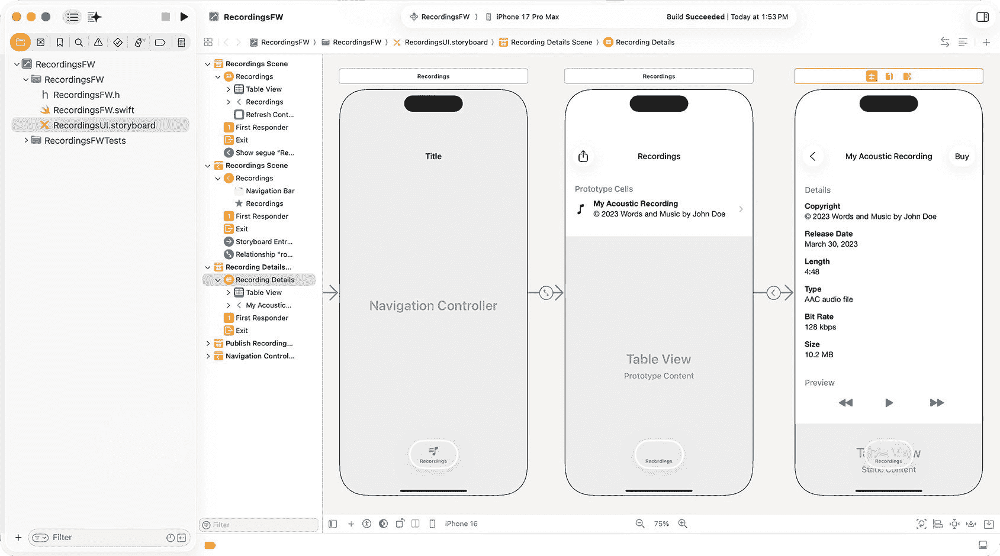

# 2. 应用现代设计模式打造可扩展、可维护的框架

## 设计 RecordingsFW 框架

本章将深入探讨设计一个能够跨不同应用、服务于多种用途的 iOS 框架的复杂性。它将通过演示如何使用模型-视图-视图模型（MVVM）设计模式将本地文件服务集成到用户界面中，来展示软件可重用性的有效性。本章将继续强化软件解耦的重要性，在前一章引入的概念基础上进一步深化。随着阅读的深入，该框架的协议将替换为一个更通用、更灵活的解决方案，进一步增强软件解耦。

对于不熟悉 MVVM 设计模式的人来说，它是计算机软件中的一种架构模式，有助于将图形用户界面（视图）与业务逻辑（模型）分离，使视图不依赖于任何特定的模型平台。^(³) 互联网上关于此主题有大量专门针对 iOS 移动应用的文章。

在本章中，我们将重点设计 `RecordingsFW` 框架，强调其可扩展性、可维护性和可重用性。你将看到如何使用模型-视图-视图模型（MVVM）设计模式将本地文件服务集成到用户界面中，从而强化之前介绍的软件解耦原则。随着学习的深入，该框架的协议最终将演变成一个更通用、更灵活的解决方案，进一步提升跨应用的模块化和灵活性。


### 设置 iOS 框架与项目

需要新建并配置一个 iOS 框架和项目，流程与第 1 章类似。使用`Recordings`前缀命名项目及其对应文件，例如`RecordingsFW`：

1.  执行第 1 章中“创建 iOS 框架”一节所列的步骤
2.  执行第 1 章中“配置 iOS 框架”一节所列的步骤
3.  执行第 1 章中“创建 Storyboard”一节所列的步骤

## 创建用户界面

本章的框架将展示一个代表音频录音的本地文件列表。你可以使用 Interface Builder 练习开发此 UI，也可以从 GitHub 下载代码并按如下方式替换 Storyboard 文件内容：



图 2-1 Storyboard 编辑器

1.  在“项目导航器”中右键单击`RecordingsUI.storyboard`，选择**打开方式/源代码**
2.  选中文件内容并删除
3.  从下载的`RecordingsUI.storyboard`文件中复制故事板文件内容，粘贴到框架的`.storyboard`文件中
4.  在“项目导航器”中右键单击`RecordingsUI.storyboard`，选择**打开方式/Interface Builder - Storyboard**（**图** **2-1**）

### 创建 Cocoa Touch 类

执行以下步骤以创建一个 Cocoa Touch 类，用于支持上一步定义的用户界面：

1.  在“项目导航器”中右键单击文件夹，选择**从模板新建文件…**
2.  在“Source”部分选择`Cocoa Touch Class`模板，点击**下一步**
3.  输入`RecordingsTVC`作为类名，并将`UITableViewController`设置为父类
4.  确保**同时创建 XIB 文件**未勾选，且`Language`为 Swift

同样地，需要修改 Cocoa Touch 类以匹配下载的故事板配置：

```
import UIKit
class RecordingsTVC: UITableViewController {
@IBOutlet weak var publishBarButtonItem: UIBarButtonItem! // 注意：将在后续章节中使用
override func viewDidLoad() {
super.viewDidLoad()
self.publishBarButtonItem.isHidden = true // 注意：将在后续章节中使用
self.clearsSelectionOnViewWillAppear = true
self.navigationController?.navigationBar.prefersLargeTitles = true
self.navigationItem.largeTitleDisplayMode = .always
self.extendedLayoutIncludesOpaqueBars = true
self.tableView.refreshControl?.addTarget(self, action: #selector(self.refresh(_:)), for: .valueChanged)
self.tableView.refreshControl?.beginRefreshing()
}
@objc func refresh(_ sender: AnyObject) {
}
override func tableView(_ tableView: UITableView, numberOfRowsInSection section: Int) -> Int {
return 0
}
override func numberOfSections(in tableView: UITableView) -> Int {
return 1
}
override func tableView(_ tableView: UITableView, cellForRowAt indexPath: IndexPath) -> UITableViewCell {
let cell = tableView.dequeueReusableCell(withIdentifier: "RecordingsCell", for: indexPath)
return cell
}
override func tableView(_ tableView: UITableView, canEditRowAt indexPath: IndexPath) -> Bool {
return false
}
}
class RecordingsCell: UITableViewCell {
@IBOutlet weak var titleLabel: UILabel!
@IBOutlet weak var copyrightLabel: UILabel!
}
```

在此代码示例中，`cellForRowAt()`通过标识符复用`UITableViewCell`来渲染表格的每一行。支持此功能的类`RecordingsCell`也在该类中定义。

### 创建协议与模型

为了实现该框架的 MVVM 设计模式，需要为 ViewModel 创建一个协议。该协议的 ViewModel 实现将获取代表音频录音的本地文件列表。在 ViewModel 中实现该协议后，需要将 ViewModel 集成到表格视图中。执行以下步骤创建协议：

1.  在“项目导航器”中右键单击文件夹，选择**从模板新建文件…**
2.  在“Source”部分选择`Swift File`模板
3.  创建一个名为`RecordingsProtocol.swift`的类

定义协议以返回`Recording`模型数组，这些模型将由设备上的本地文件生成：

```
protocol RefreshableViewModel {
func getRecordings() -> [Recording]
func refresh()
}
```

定义一个`Recording`模型来表示音频录音的（任意）元数据。该模型需要符合`Codable`^(⁴)协议，以便这些数据类型可以从外部表示中读取和写入：

```
struct Recording: Codable {
let bitrate: Int64
let copyright: String
let date: String
let length: Int64
let size: Int64
var title: String
let type: String
let url: String
}
```

### 创建 ViewModel

需要创建一个 ViewModel 类来实现上一节定义的协议：

1.  在“项目导航器”中右键单击文件夹，选择**从模板新建文件…**
2.  在“Source”部分选择`Swift File`模板
3.  创建一个名为`RecordingsViewModel.swift`的类

采用`RefreshableViewModel`，实现所需的协议函数，并定义一个名为`recordings`的变量来保存由底层服务返回的模型（将在下一节定义）：

```
import Foundation
class RecordingsViewModel: RefreshableViewModel {
private(set) var recordings: [Recording]!
init() {
}
func getRecordings() -> [Recording] {
return recordings
}
func refresh() {
fetch()
}
private func fetch() {
}
}
```

需要重写`recordings`变量的`didSet`属性，以便在录音发生变化时通知视图。还需要定义一个复合（函数）类型^(⁵)变量来执行通知。该变量将在视图（View）中设置，并将视图绑定到 ViewModel：

```
private(set) var recordings: [Recording]! {
didSet {
self.bindRecordingsViewModelToController()
}
}
var bindRecordingsViewModelToController : (() -> ()) = {}
```

应在`fetch()`函数中实现以下代码，以调用本地服务从设备读取文件，创建相应的模型，并设置`recordings`变量以触发视图更新自身的通知。

注意：在`RecordingsService`类创建完成之前，`fetch`函数将无法编译，因此可以将其注释掉，直到该类创建完成。

```
private func fetch() {
RecordingsService.shared.fetch() { [weak self] recordings, error in
guard let strongSelf = self else { return }
if let err = error {
print("RecordingsViewModel.fetch(): error = \(err.localizedDescription)")
} else {
strongSelf.recordings = recordings
}
}
}
```


## 创建本地文件服务

在该框架中，将使用本地文件服务从设备读取文件并返回代表音频文件的元数据。请按照以下步骤创建该服务：

1. 右键点击**项目导航器**中的文件夹，选择 **从模板新建文件...**（**New File from Template…**）
2. 在 **Source** 部分下选择 **Swift** **文件**（**Swift** **File**）模板
3. 创建一个名为 `RecordingsService.swift` 的类

为服务创建一个**单例**^(⁶)类。单例是一种常见的设计模式，可防止类被实例化出多个实例。一旦实例化，无论在哪里引用，都会使用同一个实例。

```swift
import Foundation
class RecordingsService {
    public static let shared = RecordingsService()
}
```

定义一个完成处理程序作为复合（函数）类型，当文件系统数据被读取并转换为 `Recording` 模型后，服务将调用该处理程序。

```swift
typealias RecordingCompletionHandler = ([Recording]?, Error?) -> ()
```

由于此框架从设备读取文件并返回代表这些文件的元数据，因此需要定义当文件不存在时使用的示例数据。`init()` 函数将使用每个 `Recording` 模型的 `title` 属性来检查对应文件是否存在，如果不存在则创建该文件。向类中添加以下代码：

```swift
private let recordings: [Recording] = [
    Recording(bitrate: 131072, copyright: "© 2025 Words and Music by John Doe", date: "04/28/2025", length: 270, size: 5*1024*1024,
              title: "My Electric Guitar Anthem", type: "AAC Audio File", url: "https://graphixware.com/MyElectricAnthem.aac"),
    Recording(bitrate: 131072, copyright: "© 2025 Words and Music by John Doe", date: "08/24/2025", length: 228, size: 10*1024*1024,
              title: "My Acoustic Guitar Ballad", type: "AAC Audio File", url: "https://graphixware.com/MyAcousticBallad.aac")
]

private init() {
    let encoder = JSONEncoder()
    encoder.outputFormatting = .prettyPrinted
    for recording in recordings {
        do {
            let file = try FileManager.default.url(for: .documentDirectory, in: .userDomainMask, appropriateFor: nil, create: true)
                .appendingPathComponent(recording.title + ".aac")
            if !FileManager.default.fileExists(atPath: file.lastPathComponent) {
                try encoder.encode(recording).write(to: file)
            }
        } catch {
            print("RecordingsService.init(): Error = \(error.localizedDescription)")
        }
    }
}
```

定义一个 `fetch()` 函数，供 ViewModel 调用以获取数据，随后视图将在其用户界面处理中显示这些数据。

```swift
func fetch(completion: @escaping RecordingCompletionHandler) {
    var recordingModels: [Recording] = []
    let fileManager = FileManager.default
    let documentsURL = fileManager.urls(for: .documentDirectory, in: .userDomainMask)[0]
    do {
        let fileURLs = try fileManager.contentsOfDirectory(at: documentsURL, includingPropertiesForKeys: nil)
        for fileURL in fileURLs {
            if let recording = read(type: Recording.self, file: fileURL) {
                recordingModels.append(recording)
            }
        }
    } catch {
        print("RecordingsService.fetch(): Error = \(error.localizedDescription)")
    }
    completion(recordingModels, nil)
}

private func read<T: Decodable>(type: T.Type, file: URL) -> T? {
    var data: Data?
    do {
        data = try Data(contentsOf: file)
    } catch {
        print("RecordingsService.read(): Error = \(error.localizedDescription)")
    }
    guard let recordingData = data else { return nil }
    do {
        let decoder = JSONDecoder()
        return try decoder.decode(T.self, from: recordingData)
    } catch {
        print("RecordingsService.read(): Error = \(error.localizedDescription)")
    }
    return nil
}
```

**注意**

既然 `RecordingsService` 已经定义完毕，请取消 `RecordingsViewModel` 的 `fetch()` 函数中先前注释掉的代码，以便项目能够正确编译。

## 将 ViewModel 集成到视图中

选择 `RecordingsTVC.swift`，定义一个名为 `viewModel` 的变量，以及一个名为 `initLocalServiceVM()` 的函数，用于实例化 ViewModel、将 ViewModel 绑定到视图、从本地文件服务获取数据，并在数据发生变化时更新用户界面：

```swift
class RecordingsTVC: UITableViewController {
    var viewModel: RefreshableViewModel?

    override func viewDidLoad() {
        super.viewDidLoad()
        // ...
        initLocalServiceVM()
    }

    func initLocalServiceVM() {
        self.viewModel = RecordingsViewModel()
        (self.viewModel as! RecordingsViewModel).bindRecordingsViewModelToController = { [weak self] in
            guard let strongSelf = self else { return }
            if let recordings = strongSelf.viewModel?.getRecordings() {
                print("RecordingsTVC.initLocalServiceVM().bindRecordingsViewModelToController(): recordings.count= \(recordings.count)")
            }
            DispatchQueue.main.async {
                strongSelf.refreshControl?.endRefreshing()
                strongSelf.tableView.reloadData()
            }
        }
        self.viewModel?.refresh()
    }
}
```

将 ViewModel 集成到用户界面实现中每个使用数据的函数中：

```swift
@objc func refresh(_ sender: AnyObject) {
    viewModel?.refresh()
}

override func tableView(_ tableView: UITableView, numberOfRowsInSection section: Int) -> Int {
    return self.viewModel?.getRecordings().count ?? 0
}

override func tableView(_ tableView: UITableView, cellForRowAt indexPath: IndexPath) -> UITableViewCell {
    let cell = tableView.dequeueReusableCell(withIdentifier: "RecordingsCell", for: indexPath)
    if let recordingCell = cell as? RecordingsCell, let recording = self.viewModel?.getRecordings()[indexPath.row] {
        recordingCell.titleLabel.text = recording.title
        recordingCell.copyrightLabel.text = recording.copyright
        return recordingCell
    }
    return cell
}
```


## 将详情视图集成到表格中

如前所述，该框架中的用户界面采用了主从设计模式。要完成详情视图，需要创建一个类，在表格视图中点击对应行时显示音频文件的详细信息：

1.  在项目导航器中右键点击文件夹，选择**从模板新建文件…**
2.  在**来源**部分选择**Cocoa Touch Class**模板，然后点击**下一步**
3.  输入类名，例如 `RecordingTVC`，并将子类设置为 `UITableViewController`
4.  确保**同时创建 XIB 文件**未勾选，且**语言**选项为 Swift

> 注意：此类对于本框架而言，除了使其正常运行外并无其他重要意义。用以下代码替换生成的默认代码，以支持先前创建的对应故事板。

```
import UIKit
class RecordingTVC: UITableViewController {
@IBOutlet weak var copyrightNameLabel: UILabel!
@IBOutlet weak var copyrightLabel: UILabel!
@IBOutlet weak var dateNameLabel: UILabel!
@IBOutlet weak var dateLabel: UILabel!
@IBOutlet weak var lengthNameLabel: UILabel!
@IBOutlet weak var lengthLabel: UILabel!
@IBOutlet weak var typeNameLabel: UILabel!
@IBOutlet weak var typeLabel: UILabel!
@IBOutlet weak var bitrateNameLabel: UILabel!
@IBOutlet weak var bitrateLabel: UILabel!
@IBOutlet weak var sizeNameLabel: UILabel!
@IBOutlet weak var sizeLabel: UILabel!
let detailsTitle = "Details"
let previewTitle = "Preview"
var recording: Recording?
let kbps = "kbps"
let mb = "MB"
override func viewDidLoad() {
super.viewDidLoad()
self.clearsSelectionOnViewWillAppear = true
self.navigationItem.title = recording?.title ?? detailsTitle
self.tableView.separatorInset = UIEdgeInsets.init(top: 0.0, left: 20.0, bottom: 0.0, right: 0.0)
copyrightLabel.text = recording?.copyright ?? ""
dateLabel.text = recording?.date ?? ""
if let length = recording?.length {
let quotient = length / 60
let remainder = length % 60
lengthLabel.text = String(describing: quotient) + ":" + String(describing: remainder)
}
typeLabel.text = recording?.type ?? ""
if let bitrate = recording?.bitrate {
bitrateLabel.text = String(describing: bitrate / 1024) + " kbps"
}
if let size = recording?.size {
let quotientMB = size / (1024 * 1024)
let remainder = size % (1024 * 1024)
let value = remainder > 0 ? String(describing: remainder) + "." : ""
sizeLabel.text = String(describing: quotientMB) + value + " MB"
}
}
override func numberOfSections(in tableView: UITableView) -> Int {
return 2
}
override func tableView(_ tableView: UITableView, numberOfRowsInSection section: Int) -> Int {
switch section {
case 0:
return 6
case 1:
return 1
default:
return 0
}
}
override func tableView(_ tableView: UITableView, canEditRowAt indexPath: IndexPath) -> Bool {
return false
}
override func tableView(_ tableView: UITableView, viewForFooterInSection section: Int) -> UIView? {
if section  CGFloat {
return 21.0
}
override func tableView(_ tableView: UITableView, heightForRowAt indexPath: IndexPath) -> CGFloat {
return indexPath.section == 0 ? 58.0 : 44.0
}
override func tableView(_ tableView: UITableView, willDisplayHeaderView view: UIView, forSection section: Int) {
var title = ""
switch section {
case 0:
title = detailsTitle
case 1:
title = previewTitle
default:
break
}
let titleView = view as! UITableViewHeaderFooterView
titleView.textLabel?.text = title // 移除所有大写字母
}
}
```

选择 `RecordingsTVC`（主视图），创建一个名为 `prepare()` 的函数，将与所选表格行对应的 `Recording` 模型传递至此详情视图：

```
override func prepare(for segue: UIStoryboardSegue, sender: Any?) {
if segue.identifier == "RecordingDetailsSegue" {
if let recordingTVC = segue.destination as? RecordingTVC {
if let indexPath = self.tableView.indexPathForSelectedRow, let recording = self.viewModel?.getRecordings()[indexPath.row]  {
recordingTVC.recording = recording
}
}
}
}
```

### 实现 Swift 协议

由于仍在使用协议将此框架集成到相应的应用中，因此本框架也需要采用在 `RecordingsProtocol.swift` 中创建的协议（同样位于 `RecordingsProtocol` 中）：

```
public class RecordingsProtocol: DisplayableViewController {
public init() {}
public func instantiateRootViewController() -> UIViewController {
let storyboard = UIStoryboard(name: "RecordingsUI", bundle: Bundle(for: RecordingsTVC.self))
let vc = storyboard.instantiateViewController(withIdentifier: "RecordingsNC")
return vc
}
}
```

## 创建应用目标

按照前一章节所述，需要在 iOS 框架项目中创建并配置一个应用目标：

1.  执行第 1 章“**创建应用目标**”部分列出的步骤
2.  执行第 1 章“**创建应用目标用户界面**”部分列出的步骤
3.  执行第 1 章“**设计应用目标用户界面**”部分列出的步骤
4.  执行第 1 章“**添加 iOS 框架**”部分列出的步骤，然后选择 `RecordingsFW.framework`

### 集成 iOS 框架

需要在应用的 `SceneDelegate.willConnectTo()` 中将 iOS 框架集成到应用中：

```
import RecordingsFW
func scene(_ scene: UIScene, willConnectTo session: UISceneSession, options connectionOptions: UIScene.ConnectionOptions) {
guard let winScene = (scene as? UIWindowScene) else { return }
if let storyboard = session.configuration.storyboard {
if let tabBarController = storyboard.instantiateInitialViewController() as? UITabBarController {
window = UIWindow(windowScene: winScene)
window?.rootViewController = tabBarController
window?.makeKeyAndVisible()
// 通过协议添加框架用户界面...
var tbcViewControllers = tabBarController.viewControllers ?? []
tbcViewControllers.append(RecordingsProtocol().instantiateRootViewController())
tabBarController.setViewControllers(tbcViewControllers, animated: false)
tabBarController.tabBar.isHidden = (tbcViewControllers.count <= 1)
}
}
}
```


#### 运行应用目标

将`RecordingsApp`设置为方案下拉菜单中的活动方案，构建应用程序，并使用某个 Xcode 模拟器或实际设备运行它。应用程序应能正常编译和运行，并展示相应的框架功能（**图** **2-2**）。


**图 2-2** Xcode 模拟器

在本章中，您学习了如何使用 MVVM 模式设计 iOS 框架，以分离关注点并促进软件解耦。您将本地文件服务集成到了 UI 中，探索了协议驱动设计，并为将来使用更通用的解决方案增强框架做好了准备。通过应用这些现代设计模式，您创建了一个可扩展、可维护且可在多个应用程序中复用的框架。

借助基于 MVVM 构建并采用模块化设计的`RecordingsFW`框架，您现在已准备好使其更加通用。在下一章中，我们将扩展该框架以处理远程数据，集成网络服务，并应用高级设计模式来创建可复用且解耦的架构。

脚注 1   2   3   4

