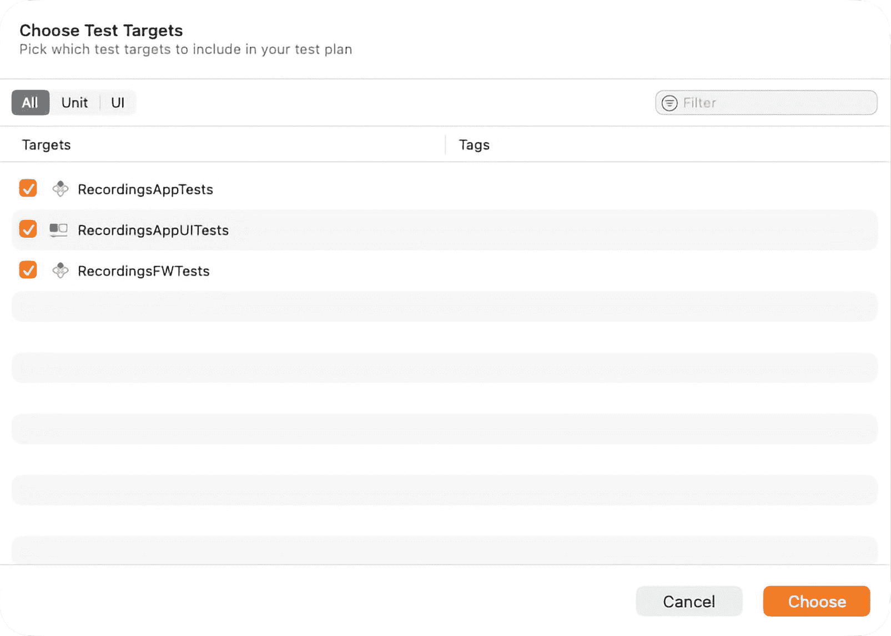
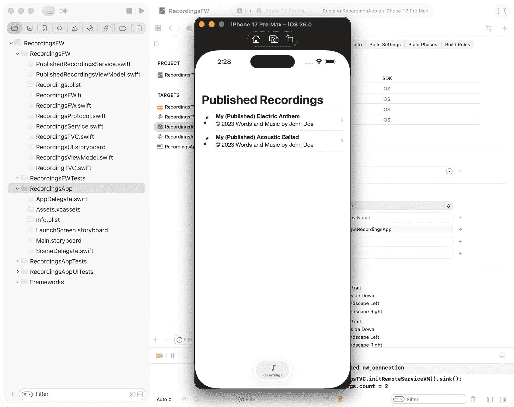

# 3. 为可复用框架设计通用、解耦的架构

扩展`RecordingsFW`框架

上一章设计的框架支持管理**本地**音频录音。随着本书内容的深入，它将与其他框架结合，构建一个“录音室”风格的应用程序。本章将增强该框架，以支持在独立的移动应用中显示**远程**音频录音（即“已发布录音”）。运行模式将通过属性列表（`Property List`）进行控制。网络 API 将集成到远程服务中，并在模型-视图-视图模型（MVVM）设计模式中使用。

本章还将使用一种名为依赖注入（Dependency Injection）的软件设计模式。依赖注入是一种编程技术，它将对象的隐式依赖关系显式化，允许对象在构造时或通过函数调用从其他对象接收这些依赖关系。⁽⁷⁾ 在本例中，依赖注入将通过构造函数注入 API 服务和端点，在框架的`ViewModel`中使用。由于`ViewModel`不关心服务的具体实现，因此如果服务被替换，`ViewModel`也无需更改。

除了依赖注入，本章还将整合 Combine 来处理和发布网络 API 请求的结果。Combine 框架提供了一种声明式的 Swift API，用于处理随时间变化的值。这些值可以代表多种类型的异步事件。Combine 声明了发布者以公开值，并声明了订阅者以从发布者接收这些值。有关 Combine 框架的文档，可在 Apple 开发者网站上获取。⁽⁸⁾

简而言之，本章将扩展`RecordingsFW`框架以支持远程音频录音，同时保持其可扩展性和可复用性。将使用属性列表来控制框架的运行模式。网络 API 将使用依赖注入集成到 MVVM 模式中，以将`ViewModel`与服务实现解耦。我们将利用 Combine 来处理和发布异步网络结果，确保该框架能够生成多个移动应用，而无需修改代码。

### 创建属性列表

需要在`RecordingsFW`项目中添加一个属性列表（Property List，简称“p-list”），以控制框架的运行模式。属性列表只是通过文件系统持久化/加载的对象层次结构的表示。属性列表对于存储少量数据非常有用。⁽⁹⁾ 请执行以下步骤创建属性列表：


**图 3-1** 新建文件模板

1.  在项目导航器中右键点击框架文件夹，然后选择**从模板新建文件...**
2.  在**资源**组中选择**属性列表**模板（**图** **3-1**），然后点击**下一步**
3.  将文件保存为`Recordings.plist`

## 配置属性列表

创建属性列表后，添加一个布尔值来控制框架的运行模式，根据所需结果（例如，显示本地文件 vs. 远程文件）静态设置该值：


**图 3-2** 属性列表编辑器

1.  在项目导航器中选择**属性列表**文件
2.  点击空表 Root 行中的**+**图标
3.  创建一个名为`showPublished`的变量；将其类型设置为**布尔值**，值设置为**YES**（**图** **3-2**）


## 配置外部 API

由于本框架的运行模式是显示“已发布的录音”，因此需要通过网络 API 请求远程获取这些数据。本章的示例代码并未包含支持此功能的实际服务，因此需要对其进行模拟。

有多种方法可以模拟网络 API 请求，包括使用第三方“存根”库（如 `OHHTTPStubs`^(¹⁰）和“模拟”服务（如 `Beeceptor`^(¹¹）。本章的示例代码将使用 `Beeceptor`，通过网络 API 请求返回以下表示音频录音的 JSON 数据：

```json
[
{
"bitrate": 131072,
"copyright": "© 2025 Words and Music by John Doe",
"date": "04/28/2025",
"length": 270,
"size": 5242880,
"title": "My (Published) Electric Anthem",
"type": "AAC Audio File",
"url": "https://graphixware.com/MyElectricAnthem.aac"
},
{
"bitrate": 131072,
"copyright": "© 2025 Words and Music by John Doe",
"date": "08/24/2025",
"length": 228,
"size": 10485760,
"title": "My (Published) Acoustic Ballad",
"type": "AAC Audio File",
"url": "https://graphixware.com/MyAcousticBallad.aac"
}
]
```

在 `RecordingsProtocol.swift` 中定义一个枚举来表示端点：

```swift
enum RecordingsEndpoint {
case fetchRecordings
var urlString: String {
switch self {
case .fetchRecordings:
return "https://graphixware.free.beeceptor.com/scratchtrax/recordings"
}
}
}
```

此示例中的 URL 不保证始终有效，因此现在是你前往 `Beeceptor.com` 创建免费账户以及自己专属端点的好时机。

在 `RecordingsProtocol.swift` 中定义另一个枚举来处理模拟的错误情况：

```swift
enum RecordingsError: Error {
case request(message: String)
case network(message: String)
case status(message: String)
case parsing(message: String)
case other(message: String)
}
```

### 设计一个通用服务

在框架项目下创建一个名为 `PublishedRecordingsService` 的新类，用作远程服务。此服务将通过网络 API 获取录音数据，并将其发布给已订阅变更通知的对象，例如 `ViewModel`。为了防止创建该类的多个实例，它将被定义为一个单例：

```swift
class PublishedRecordingsService {
public static let shared = PublishedRecordingsService()
private init() {
}
}
```

在 `PublishedRecordingsService` 中为远程服务定义一个协议。任何遵循该协议的服务都能够被注入到 `ViewModel` 中，而无需修改 `ViewModel` 本身。协议及其实现将使用 `Combine`，因此还需要导入 `Combine` 框架：

```swift
import Combine
protocol StubAPIService {
func fetch<T: Decodable>(_t: T.Type, url: URL) -> AnyPublisher<T, RecordingsError>
}
```

`fetch()` 函数使用了 Swift 泛型。Swift 泛型允许创建灵活、可复用的函数和类型来处理不同类型的数据，从而避免代码重复。^(¹²)

当调用 `fetch()` 函数时，需要将网络 API 请求期望返回的对象类型作为参数传入：

```swift
service.fetch(_t: Recording.self, url: url)
```

`fetch` 函数的返回值类型定义为 `AnyPublisher<T, RecordingsError>`。`AnyPublisher` 是 `Publisher` 的一个具体实现，它本身没有重要的属性，仅充当一个穿透对象。`Publisher` 将元素传递给一个或多个 `Subscriber` 实例。订阅者的 `Input` 和 `Failure` 关联类型必须与发布者声明的 `Output` 和 `Failure` 类型匹配。发布者通过实现 `receive(subscriber:)` 方法来接受订阅者。^(¹³)

让 `PublishedRecordingsService` 遵循该协议，并实现其所需的行为：

```swift
class PublishedRecordingsService: StubAPIService {
public static let shared = PublishedRecordingsService()
private init() {
}
func fetch<T: Decodable>(_t: T.Type, url: URL) -> AnyPublisher<T, RecordingsError> {
return URLSession.shared.dataTaskPublisher(for: url)
.mapError { error in
RecordingsError.network(message: error.localizedDescription)
}
.flatMap(maxPublishers: .max(1)) { pair in
self.decode(pair.data)
}
.eraseToAnyPublisher()
}
private func decode<T: Decodable>(_ data: Data) -> AnyPublisher<T, RecordingsError> {
let decoder = JSONDecoder()
decoder.dateDecodingStrategy = .secondsSince1970
return Just(data)
.decode(type: T.self, decoder: decoder)
.mapError { error in
RecordingsError.parsing(message: error.localizedDescription)
}
.eraseToAnyPublisher()
}
}
```

`mapError` 将上游发布者的任何失败转换为新的错误。

`flatMap` 将来自上游发布者的元素转换成一个新的发布者，该发布者数量不超过你指定的最大值。在此示例中，`flatMap` 使用指定的解码器解码来自上游发布者的输出，以生成 `Recording` 模型。

`eraseToAnyPublisher` 用一个类型擦除器包装此发布者，向下游订阅者暴露一个 `AnyPublisher` 实例，而不是该发布者的实际类型。

### 设计一个支持依赖注入的 ViewModel

创建一个名为 `PublishedRecordingsViewModel` 的 ViewModel，用于获取已发布的录音并通知视图更新其处理方式。

`PublishedRecordingsViewModel` 将遵循 `RefreshableViewModel` 协议，以确保支持视图所需的行为。该 ViewModel 还将遵循 `ObservableObject`^(¹⁴ 协议，以支持“预发布”变更。

需要定义 `service` 和 `endpoint` 变量以支持依赖注入。由于这些是外部依赖项，它们将通过构造函数注入到 ViewModel 中，以保持 ViewModel 内部的解耦。

`recordings` 变量需要使用 `@Published` 类型别名进行定义。它将维护从服务返回的转换后数据，并在设置时将变更事件发布给订阅者。

`fetch()` 函数将使用注入的服务和端点泛型地获取音频录音元数据，将其存储在 `recordings` 变量中，并通知订阅者此变更。

将以下代码添加到该类中：

```swift
import Foundation
import Combine
class PublishedRecordingsViewModel: RefreshableViewModel, ObservableObject {
// 依赖注入...
private let service: StubAPIService
private let endpoint: RecordingsEndpoint
private var disposables = Set<AnyCancellable>()
@Published private(set) var recordings: [Recording] = []
init(service: StubAPIService, endpoint: RecordingsEndpoint) {
self.service = service
self.endpoint = endpoint
}
func getRecordings() -> [Recording] {
return recordings
}
func refresh() {
fetch()
}
func fetch() {
if let url = URL(string: endpoint.urlString) {
service.fetch(_t: Recording.self, url: url)
.receive(on: DispatchQueue.main)
.sink { [weak self] value in
switch value {
case .failure:
self?.recordings = []
case .finished:
break
}
} receiveValue: { [weak self] response in
self?.recordings = response
}
.store(in: &disposables)
}
}
}
```


## 将 ViewModel 集成到视图中

为了完成本例的 MVVM 设计模式，需要将 ViewModel 集成到视图中。本例中的视图由在第 2 章中创建的 `RecordingsTVC` 管理。

将使用属性列表设置来确定框架的操作模式。需要创建一个名为 `showPublished()` 的函数来读取属性列表值并执行相应的代码路径。和之前一样，需要使用 Bundle 标识符加载属性列表，以确保其正常工作。

**趣闻：**请注意检索属性列表值之后的语句，如果找到 `UserDefaults` 值，该语句将覆盖属性列表值。在本书后面，当应用内购买集成到框架中时，将使用 `UserDefaults` 来实现。

将以下代码集成到 `RecordingsTVC` 中（不要删除现有代码）：

```
let publishedTitle = "Published Recordings"
let localTitle = "Local Recordings"
override func viewDidLoad() {
if showPublished() {
self.navigationItem.title = publishedTitle
// Initialize published recordings
initRemoteServiceVM()
} else {
self.navigationItem.title = localTitle
// Initialize local recordings
initLocalServiceVM()
}
}
func showPublished() -> Bool {
var showPublished = false
if let bundle = Bundle(identifier:"com.gw.RecordingsFW"), let path = bundle.path(forResource: "Recordings", ofType: "plist"),
let plistDict = NSDictionary(contentsOfFile: path) {
showPublished = plistDict.object(forKey: "showPublished") as? Bool ?? false
}
if let features = UserDefaults.standard.object(forKey: "features") as? [String:String] {
if let publishedValue = features["showPublished"], let published = Bool(publishedValue) {
showPublished = published
}
}
return showPublished
}
func initRemoteServiceVM() {
// This will be completed in the next step…
}
```

### 将依赖注入 ViewModel

第 2 章通过 `initLocalServiceVM()` 初始化了一个 ViewModel 来管理本地音频录制。第 3 章需要通过 `initRemoteServiceVM()` 初始化一个 ViewModel 来管理远程音频录制。

将以下代码集成到 `RecordingsTVC` 中（不要删除现有代码）：

```
import Combine
class RecordingsTVC: UITableViewController {
private var cancellables: Set = []
func initRemoteServiceVM() {
self.viewModel = PublishedRecordingsViewModel(service: PublishedRecordingsService.shared, endpoint: .fetchRecordings)
(self.viewModel as! PublishedRecordingsViewModel).$recordings
.sink { [weak self] recordings in
guard let strongSelf = self else { return }
print("RecordingsTVC.initRemoteServiceVM().sink(): recordings.count = \(recordings.count)")
DispatchQueue.main.asyncAfter(deadline: .now()+1) {
strongSelf.refreshControl?.endRefreshing()
strongSelf.tableView.reloadData()
}
}
.store(in: &cancellables)
self.viewModel?.refresh()
}
}
```

`AnyCancellable` 变量是一个令牌，代表一个活跃的 Combine 订阅，当它被释放时会自动取消。

在 `initRemoteServicesVM()` 中创建 ViewModel 时，会通过构造函数将服务和端点注入对象。

`sink()` 函数将用于订阅异步变更事件，这些事件会在 `recordings` 值发生变化时发布。检测到变化后，将在主线程（用于更新用户界面的线程）上重新加载表格视图，以反映这些变化。

`store(in:)` 会将可取消令牌保存到一个集合（通常是 `Set<AnyCancellable>`）中，以便订阅在所有者对象存活期间保持活跃。

`ViewModel.refresh()` 将触发 ViewModel 从服务获取数据并在视图中显示。

### 测试

源代码的全面测试对于实现和维持软件应用程序的高质量水平至关重要，这可以在应用程序发布后降低未来的维护成本。单元测试、集成测试和 UI 测试应在代码开发过程中（或如果采用测试驱动开发方法，则在此之前）纳入软件开发流程。

大多数 iOS 开发者都熟悉 Xcode 中用于创建测试的工具，特别是基于 XCTest 框架的工具。Xcode 16 引入了一个新的测试框架 Swift Testing。创建 Xcode 项目时，生成存根测试的选项现在包括 XCTest 和 Swift Testing。选择任一选项都会根据所选框架生成存根测试和测试计划。使用 Swift Testing 创建的测试不会自动添加到测试计划中（截至 Xcode 26），但可以通过编辑测试计划并选择它们来轻松添加。

`XCTest` 和 `Swift Testing` 之间的主要区别在于它们的结构和发现方式。XCTest 使用继承自 `XCTestCase` 的类，Xcode 会自动查找以 test 开头的测试方法，并在测试导航器中显示它们。另一方面，Swift Testing 允许你在结构体中使用 `@Test` 和 `#expect` 编写测试，这更加“Swift 化”并且能很好地处理并发，但 Xcode 不会自动检测它们。然而，如果你将 Swift Testing 测试添加到测试计划中，它们将出现在测试导航器中，让你可以像 XCTest 测试一样在 Xcode 中运行它们。

关于使用 XCTest 和 Swift Testing 框架编写单元测试、集成测试和 UI 测试的全面概述，可以在 Apple 开发者网站上找到。^(¹⁵)

本章将演示使用模拟服务测试模型-视图-视图模型（MVVM）设计模式中的 ViewModel 部分。在 MVVM 设计中，服务被模拟以将 ViewModel 的逻辑与外部依赖隔离开来。模拟提供可预测的硬编码数据或模拟错误，使测试快速、可靠且可重复，而无需依赖网络条件或实时 API。这还使得测试边缘情况（如解析失败或空响应）变得容易，确保 ViewModel 正确处理所有场景，同时保持测试仅专注于其行为。

在 `RecordingsFWTests` 文件夹（项目创建时生成）下，选择 `RecordingsFWTests.swift` 并导入 Foundation 和 Combine 框架（Testing 和 RecordingsFW 框架应该已经导入，并且 RecordingsFW 标记为 `@testable`）：

```
import Foundation
import Combine
import Testing
@testable import RecordingsFW
```

将创建一个基于 `StubAPIService` 协议（本章前面创建的）的模拟服务，以返回与 `PublishedRecordingsService` API 相同的预设数据。它将定义一个 `MockMode` 枚举来模拟不同场景（成功、网络错误、解析错误），并提供一组硬编码的示例 `Recording` 对象，类似于 API。`fetch` 方法将返回一个 Combine 发布者，根据当前模式，它要么发出录制数据，要么因模拟错误而失败，从而允许测试验证 ViewModel 如何处理各种响应。

将以下代码添加到类中：


```swift
final class MockRecordingsService: StubAPIService {
    enum MockMode {
        case success
        case networkError
        case parsingError
    }
    var mode: MockMode = .success
    private let recordings: [Recording] = [
        Recording(bitrate: 131_072,
                  copyright: "© 2025 Words and Music by John Doe",
                  date: "04/28/2025",
                  length: 270,
                  size: 5 * 1024 * 1024,
                  title: "My Electric Guitar Anthem",
                  type: "AAC Audio File",
                  url: "https://graphixware.com/MyElectricAnthem.aac"),
        Recording(bitrate: 131_072,
                  copyright: "© 2025 Words and Music by John Doe",
                  date: "08/24/2025",
                  length: 228,
                  size: 10 * 1024 * 1024,
                  title: "My Acoustic Guitar Ballad",
                  type: "AAC Audio File",
                  url: "https://graphixware.com/MyAcousticBallad.aac")
    ]
    func fetch(_t: T.Type, url: URL) -> AnyPublisher where T : Decodable {
        switch mode {
        case .networkError:
            return Fail(error: RecordingsError.network(message: ".networkError: Simulated network error"))
                .eraseToAnyPublisher()
        case .parsingError:
            return Fail(error: RecordingsError.parsing(message: ".parsingError: Simulated parsing error"))
                .eraseToAnyPublisher()
        case .success:
            guard let result = recordings as? [T] else {
                return Fail(error: RecordingsError.parsing(message: ".success: Type mismatch"))
                    .eraseToAnyPublisher()
            }
            return Just(result)
                .setFailureType(to: RecordingsError.self)
                .eraseToAnyPublisher()
        }
    }
}
```

在此示例中，需要创建一个 `Publisher` 扩展，用于异步等待发布者发出满足给定条件的值。它使用 `withCheckedContinuation` 来暂停异步函数，直到满足条件或发生超时，从而简化在异步上下文中测试 `@Published` 属性的操作。

将以下代码添加到类中：

```swift
extension Publisher {
    func waitForValue(
        timeout: Duration = .seconds(1),
        condition: @escaping (Output) -> Bool
    ) async -> Output? {
        await withCheckedContinuation { continuation in
            var cancellable: AnyCancellable?
            let deadline = ContinuousClock.now + timeout
            cancellable = self.sink(
                receiveCompletion: { _ in
                    continuation.resume(returning: nil)
                    cancellable?.cancel()
                },
                receiveValue: { value in
                    if condition(value) {
                        continuation.resume(returning: value)
                        cancellable?.cancel()
                    }
                })
            Task {
                try? await Task.sleep(until: deadline, clock: .continuous)
                continuation.resume(returning: nil)
                cancellable?.cancel()
            }
        }
    }
}
```

需要创建一个基于 `Publisher` 扩展的扩展，使其专门与任何 `ObservableObject` 中的 `@Published` 属性配合使用。它允许测试异步等待属性达到所需状态（例如加载完成或数据更新），从而提高测试的可读性和可靠性。

将以下代码添加到类中：

```swift
extension ObservableObject {
    func waitForPublishedValue(
        _ keyPath: KeyPath.Publisher>,
        timeout: Duration = .seconds(1),
        condition: @escaping (Value) -> Bool
    ) async -> Value? {
        let publisher = self[keyPath: keyPath]
        return await publisher.waitForValue(timeout: timeout, condition: condition)
    }
}
```

需要创建一个基于 `PublishedRecordingsViewModel` 的扩展，为 `recordings` 属性封装泛型的 `waitForPublishedValue` 方法。它允许测试轻松等待录音数组更新，而无需编写重复的 Combine 代码，从而简化 ViewModel 的异步单元测试。

将以下代码添加到类中：

```swift
extension PublishedRecordingsViewModel {
    func waitForRecordings(
        timeout: Duration = .seconds(1),
        condition: @escaping ([Recording]) -> Bool
    ) async -> [Recording]? {
        await waitForPublishedValue(\.$recordings, timeout: timeout, condition: condition)
    }
}
```

最后，需要添加测试用例，基于 `MockMode` 枚举定义的用例来测试 ViewModel。这些测试包含使用 `@Test` 和 `#expect` 的 Swift Testing 测试用例。每个方法测试 `PublishedRecordingsViewModel` 的不同场景：成功获取、网络错误、解析错误以及泛型 `@Published` 属性辅助方法。测试异步运行，使用模拟服务控制行为，并通过 `#expect` 断言预期结果，展示了 ViewModel 如何在 Swift 原生、并发友好的测试风格下响应不同条件。

将以下代码添加到类中：

```swift
@MainActor
struct PublishedRecordingsViewModelTests {
    @Test("成功获取录音")
    func testFetchRecordingsSuccess() async throws {
        let mockService = MockRecordingsService()
        mockService.mode = .success
        let viewModel = PublishedRecordingsViewModel(
            service: mockService,
            endpoint: .fetchRecordings
        )
        viewModel.fetch()
        let recordings = await viewModel.waitForRecordings { !$0.isEmpty }
        #expect(recordings?.count == 2)
        #expect(recordings?.first?.title == "My Electric Guitar Anthem")
        #expect(recordings?.last?.title == "My Acoustic Guitar Ballad")
    }
    @Test("正确处理网络错误")
    func testFetchRecordingsNetworkError() async throws {
        let mockService = MockRecordingsService()
        mockService.mode = .networkError
        let viewModel = PublishedRecordingsViewModel(
            service: mockService,
            endpoint: .fetchRecordings
        )
        viewModel.fetch()
        let recordings = await viewModel.waitForRecordings { $0.isEmpty }
        #expect(recordings?.isEmpty == true)
    }
    @Test("正确处理解析错误")
    func testFetchRecordingsParsingError() async throws {
        let mockService = MockRecordingsService()
        mockService.mode = .parsingError
        let viewModel = PublishedRecordingsViewModel(
            service: mockService,
            endpoint: .fetchRecordings
        )
        viewModel.fetch()
        let recordings = await viewModel.waitForRecordings { $0.isEmpty }
        #expect(recordings?.isEmpty == true)
    }
    @Test("正确使用泛型 @Published 辅助方法")
    func testGenericWaitForPublishedValue() async throws {
        class DummyViewModel: ObservableObject {
            @Published var isLoading = true
            func finishLoading() { isLoading = false }
        }
        let dummy = DummyViewModel()
        Task {
            try? await Task.sleep(for: .milliseconds(200))
            dummy.finishLoading()
        }
        let isDone = await dummy.waitForPublishedValue(\.$isLoading) { $0 == false }
        #expect(isDone == false)
    }
}
```

为了运行测试用例，如果它们尚未出现在测试导航器中，则需要将它们添加到测试计划中，具体操作如下：


图 3-4

测试导航器



图 3-3

选择测试目标

1.  显示**测试导航器**（项目导航器的替代标签页），并验证 `RecordingsFW` 下是否存在这些测试。
2.  如果这些测试不存在，请通过在测试导航器左下角的图标处选择**编辑测试计划**菜单项来选中它们（**图** **3-3**）。
3.  一旦它们出现在测试导航器中，即可使用主测试层次结构右侧对应的运行图标来运行它们（**图** **3-4**）。


#### 运行应用目标

在方案下拉菜单中将该应用设置为活跃方案，构建应用，然后使用任一 Xcode 模拟器或实际设备运行它。应用应能正常编译和运行，并展示相应的框架功能（图 3-5）。



图 3-5

Xcode 模拟器

现在，该框架能够在不修改代码的情况下，在不同的移动应用中同时显示本地和远程音频录音。

在本章中，你增强了 `RecordingsFW` 框架以支持远程音频录音，并使用 `MVVM` 集成了网络 API。你应用了依赖注入来将 `ViewModel` 与服务实现解耦，并使用 `Combine` 处理异步数据流。完成这些步骤后，你构建了一个灵活、可复用的框架，能够支持多个应用而无需修改核心代码，强化了可扩展 `iOS` 开发的现代设计原则。

随着 `RecordingsFW` 框架被扩展以支持远程录音，并通过依赖注入实现完全解耦，你已准备好探索动态功能启用。在下一章中，我们将设计一个能够在运行时暴露和管理功能的框架，包括通过应用内购买解锁的功能。

脚注 1 2 3 4 5 6 7 8 9

