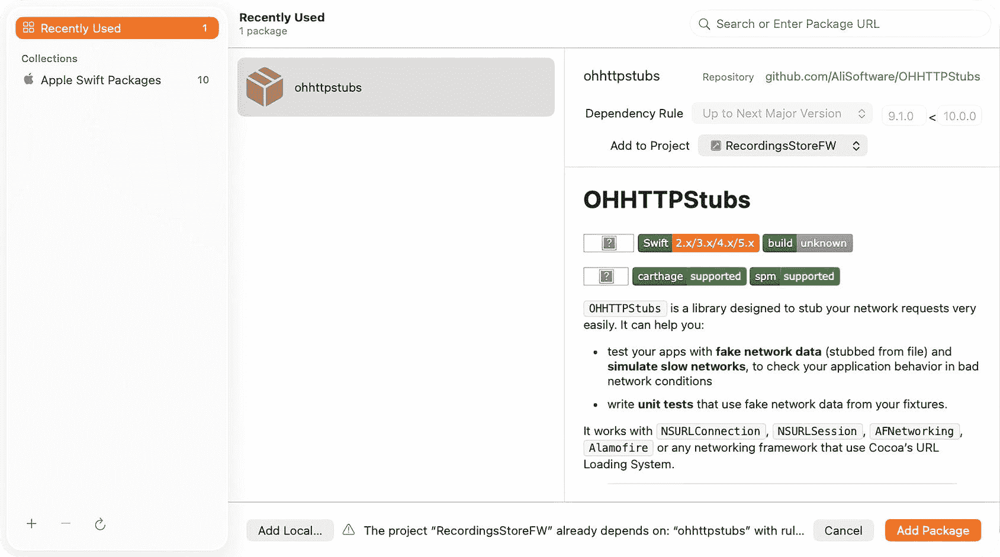

# 4. 为动态功能启用奠定基础

设计 `RecordingsStoreFW` 框架

本章将为 `iOS` 框架中的动态功能启用奠定架构基础。你将设计一个可扩展、模块化的框架，能够在运行时暴露、激活和管理功能。我们将利用模拟的应用内购买^(¹⁶)来演示如何解锁框架中已有的内置功能，以推动收入增长。

应用内购买类似于数字商店，允许用户从应用内部购买内容和功能，而无需下载并安装新版本的应用。应用内购买使移动应用开发者能够将功能集设计为独立的实体，用户可以根据体验和需求进行购买。应用内购买由 `Apple StoreKit` 框架以及 `App Store Connect` 门户提供支持。Apple 已对应用内购买的集成、配置和测试提供了详细的文档，因此本章不将重点放在这些方面。本章将重点介绍如何通过模拟的应用内购买来启用外部框架中的功能。

在本章中，我们将构建 `RecordingsStoreFW` 框架，以支持 `iOS` 框架中的动态功能启用。你将创建一个可扩展、模块化的系统，能够在运行时暴露、激活和管理功能。通过使用模拟的应用内购买，我们将演示如何在不破坏解耦架构的前提下，解锁框架内的功能以推动收入。与之前一样，`MVVM` 将构建框架结构，`SwiftData` 支持模型，`SwiftUI` 和 `Combine` 处理视图，依赖注入将桩 API 集成到 `ViewModel` 中。`ViewModel` 也将通过依赖注入集成第三方桩 API。

## 设置 iOS 框架和项目

需要创建一个新的 `iOS` 框架和项目并进行配置，类似于第 1 章。使用 `RecordingsStore` 前缀命名项目及对应的文件，例如 `RecordingsStoreFW`：

1.  执行第 1 章中"创建 iOS 框架"部分列出的步骤。

2.  执行第 1 章中"配置 iOS 框架"部分列出的步骤。


### 创建 SwiftData 管理器

`SwiftData` 于 iOS 17 中引入，是 Core Data 的现代化转型，专为 Swift 构建并与 SwiftUI 紧密集成。它使用以 `@Model` 属性标记的 Swift 原生模型类型，取代了 `.xcdatamodeld` 文件，自动处理模型架构演进，并提供了更简单的类型安全 API。数据存储在 `ModelContainer` 中，通过 `FetchDescriptor` 进行查询，并通过轻量级的 `ModelContext` 保存。它还能与 SwiftUI 的 `@Query` 和 `@Environment(\.modelContext)` 无缝集成，在数据变化时自动更新视图。本质上，SwiftData 用现代、声明式且以 Swift 为先的设计取代了 Core Data 的复杂性。

SwiftData^(¹⁷) 将用于持久化模拟的应用内购买。应用内购买的交易和收据通常在应用启动、变为活跃状态或接收到与购买相关的交易状态变化时从 Apple App Store 获取。SwiftData 将用于启用需要购买的功能。以下部分将解释如何将 SwiftData 集成到 iOS Framework 中。

**创建一个新文件来管理 SwiftData 交互：**

1.  在 **项目导航器** 中右键点击文件夹，然后选择 **来自模板的新文件…**
2.  在 **Source** 组下选择 **Swift 文件** 模板，并将文件保存为 **SwiftDataManager.swift**

**导入所需的框架：**

```swift
import Foundation
import SwiftData
import Combine
```

**定义 SwiftData 模型：**

在 SwiftData 中，模型被定义为使用 `@Model` 注解的纯 Swift 类型。这取代了 Core Data 的 `.xcdatamodeld` 文件和 `NSManagedObject` 子类。每个存储属性都会自动成为持久化属性，因此无需手动定义实体或属性类型。

`@Attribute(.unique)` 修饰符确保每个记录的 `id` 在数据存储中是唯一的，类似于主键。

SwiftData 会自动为此类生成架构元数据、迁移支持和持久化存储，因此不再需要维护 Core Data 模型文件。

```swift
@Model
public final class Configuration {
    @Attribute(.unique) public var id: UUID
    public var publishRecordings: Bool
    public var trackCount: Int16
    public init(id: UUID = UUID(), publishRecordings: Bool = false, trackCount: Int16 = 0) {
        self.id = id
        self.publishRecordings = publishRecordings
        self.trackCount = trackCount
    }
}
```

**定义类：**

`SwiftDataManager` 将作为单例实现，以确保应用在其整个生命周期内与一个一致的持久化层交互。

它将遵循 `ObservableObject` 协议，以便直接与 SwiftUI 的数据流集成。任何使用 `@StateObject` 或 `@ObservedObject` 观察 `SwiftDataManager.shared` 的 SwiftUI 视图，当其某个 `@Published` 属性发生变化时，都会自动刷新。

将定义一个 `Configuration` 属性并标记为 `@Published`，这样当应用加载、保存或修改该属性时，SwiftUI 视图会立即更新。

此外，还会定义 `ModelContainer` 和 `ModelContext`。`ModelContainer` 取代了 Core Data 的 `NSPersistentContainer`，用于定义架构中存在哪些模型以及数据存储的位置。`ModelContext` 取代了 `NSManagedObjectContext`，允许对模型执行插入、获取、更新和删除等操作。

```swift
public class SwiftDataManager: ObservableObject {
    public static let shared = SwiftDataManager()
    @Published public var configuration: Configuration?
    private let modelContainer: ModelContainer
    private let context: ModelContext
}
```

**初始化 SwiftData 环境：**

类初始化器将在启动时构建完整的 SwiftData 环境。`ModelContainer(for: Configuration.self)` 将创建一个仅管理 `Configuration` 模型的容器，`ModelContext(modelContainer)` 将为持久化操作建立工作上下文。

`fetchConfiguration()` 将立即从磁盘加载任何现有的配置到可观察的 `Configuration` 属性中，确保应用始终以最新的设置启动。

```swift
private init() {
    do {
        // 正确初始化 ModelContainer
        modelContainer = try ModelContainer(for: Configuration.self)
        context = ModelContext(modelContainer)
        fetchConfiguration()
    } catch {
        fatalError("创建 ModelContainer 失败: \(error)")
    }
}

public func fetchConfiguration() {
    let fetchDescriptor = FetchDescriptor<Configuration>()
    do {
        if let firstConfig = try context.fetch(fetchDescriptor).first {
            self.configuration = firstConfig
        }
    } catch {
        print("获取失败: \(error)")
    }
}
```

**持久化 SwiftData 模型和上下文：**

`saveConfiguration()` 将更新现有配置，如果不存在则创建新配置。如果创建了新实例，它将被插入到上下文中，然后填充新值。在将更新应用到配置模型后，它将调用 `context.save()` 将内存中的更改提交到持久化存储。

```swift
public func saveConfiguration(existing: Configuration? = nil, publishRecordings: Bool, trackCount: Int16) {
    let config: Configuration
    if let existing = existing {
        config = existing
    } else {
        config = Configuration()
        context.insert(config)
    }
    config.publishRecordings = publishRecordings
    config.trackCount = trackCount
    do {
        try context.save()
        self.configuration = config
    } catch {
        print("保存失败: \(error)")
    }
}
```

### 配置桩 API 服务

本章将使用名为 OHHTTPStubs 的桩 API 服务，从模拟的网络 API 请求中返回代表应用内购买的 JSON 数据。将使用依赖注入将服务和端点注入到 ViewModel，这与第 3 章中的做法类似。使用此模式有助于解耦。

创建一个名为 `IAP.json` 的文件，包含以下代表可用应用内购买的 JSON 数据：

```json
[
    {
        "category": "发布",
        "name": "发布录音",
        "price": 3.99,
        "type": "publishRecordings"
    },
    {
        "category": "录音",
        "name": "2 个录音轨道",
        "price": 0.99,
        "type": "twoTracks"
    },
    {
        "category": "录音",
        "name": "3 个录音轨道",
        "price": 1.99,
        "type": "threeTracks"
    },
    {
        "category": "录音",
        "name": "4 个录音轨道",
        "price": 2.99,
        "type": "fourTracks"
    }
]
```

创建一个名为 `IAP.swift` 的新类，并为端点定义一个枚举。`.fetchInAppPurchases` 中的 URL 是任意的，但主机名应与集成桩 API 服务时将使用的主机名匹配：

```swift
enum IAPEndpoint {
    case fetchInAppPurchases
    var urlString: String {
        switch self {
        case .fetchInAppPurchases:
            return "https://graphixware.com/iaps"
        }
    }
}
```

定义一个枚举来映射错误情况：

```swift
enum IAPError: Error {
    case request(message: String)
    case network(message: String)
    case status(message: String)
    case parsing(message: String)
    case other(message: String)
}
```


好的，作为高级文档工程师和翻译员，我将严格按照您提供的注意事项和示例，将给定的英文文本翻译成中文。


#### 集成 OHHTTPStubs

`OHHTTPStubs`¹⁸ 是一个可以拦截和模拟网络 API 请求的库。它非常适合在参考应用中模拟网络请求。本章将使用它来模拟获取应用内购买项，这些购买项通常是通过 App Store Connect 为 iOS 应用配置的。在实际应用中，则会使用 `StoreKit` API¹⁹。

`OHHTTPStubs` 可以通过 CocoaPods 或 Swift Package Manager 安装。为了使这个框架保持为 `.xcodeproj` 格式，将使用 Swift Package 选项。



**图 4-1** Swift Package Manager

1.  在**项目导航器**的空白区域右键单击，然后选择**添加包依赖项…**
2.  在搜索字段中输入以下 OHHTTPStubs URL：[`https://github.com/AliSoftware/OHHTTPStubs`](https://github.com/AliSoftware/OHHTTPStubs)
3.  选择**添加包**，然后在相应的弹出窗口（**图** **4-1**）中为包产品选择 **OHHTTPStubsSwift**

#### 设计通用服务

创建一个名为 `IAPService.swift` 的新类来管理应用内购买。为了防止创建该类的多个实例，将其定义为单例：

```swift
import Foundation

class IAPService {
    public static let shared = IAPService()
    private init() {
    }
}
```

为该服务创建一个协议（在类定义之前），ViewModel 将使用该协议：

```swift
import Foundation
import Combine

protocol StubAPIService {
    func fetch<T: Decodable>(_t: T.Type, url: URL) -> AnyPublisher<T, Error>
}
```

与上一章一样，`fetch()` 将利用 **Swift 泛型**来创建灵活、可复用的函数和类型，这些函数和类型可以与不同的类型一起工作，从而避免代码重复。²⁰ 当调用 `fetch()` 函数时，需要将从网络 API 请求返回的所需对象类型传递给该函数。

```
例如: service.fetch(_t: IAP.self, url: url)
```

`OHHTTPStubs` 库将被集成到 `init()` 函数中，用于拦截网络 API 请求并模拟其响应。主机名应替换为您自己的域名。如果您目前没有域名，可以使用示例代码中的域名。只需要一个变量来保存“存根描述符”，它将定义拦截请求的条件（例如，主机匹配），以及使用之前在 `IAP.json` 中定义的 JSON 数据的响应。`onStubActivation()` 回调可用于监视被存根的请求。还需要导入 OHHTTPStubs 框架：

```swift
internal import OHHTTPStubs
internal import OHHTTPStubsSwift

class IAPService: StubAPIService {
    public static let shared = IAPService()
    weak var stubDesc: HTTPStubsDescriptor?
    
    private init() {
        stubDesc = stub(condition: isHost("graphixware.com")) { request in
            return HTTPStubsResponse(fileAtPath: OHPathForFile("IAP.json", type(of: self))!, statusCode: 200,
                                     headers: ["Content-Type":"application/json"]
            )
        }
        stubDesc?.name = "IAP.json"
        HTTPStubs.onStubActivation { (request: URLRequest, stub: HTTPStubsDescriptor, response: HTTPStubsResponse) in
            print("IAPService.init(): 对 \(request.url!) 的请求已被 \((stub.name != nil) ? stub.name! : "?") 存根")
        }
    }
}
```

> **注意：** `OHHTTPStubs` 和 `OHHTTPStubsSwift` 框架是使用内部访问修饰符导入的，以解决编译器警告：模块未使用“库演进支持”进行编译。由于实际应用永远不会附带这些测试框架，因此解决警告对此示例而言已足够。

采用 `StubAPIService` 协议并实现其所需的行为：

```swift
func fetch<T: Decodable>(_t: T.Type, url: URL) -> AnyPublisher<T, Error> {
    return URLSession.shared.dataTaskPublisher(for: url)
        .mapError { error in
            IAPError.network(message: error.localizedDescription)
        }
        .flatMap(maxPublishers: .max(1)) { pair in
            self.decode(pair.data)
        }
        .eraseToAnyPublisher()
}

private func decode<T: Decodable>(_ data: Data) -> AnyPublisher<T, Error> {
    let decoder = JSONDecoder()
    decoder.dateDecodingStrategy = .secondsSince1970
    return Just(data)
        .decode(type: T.self, decoder: decoder)
        .mapError { error in
            IAPError.parsing(message: error.localizedDescription)
        }
        .eraseToAnyPublisher()
}
```

`fetch` 函数的返回值定义为 `AnyPublisher<T, Error>`。`AnyPublisher` 是 `Publisher` 的一个具体实现，它本身没有重要的属性，仅充当传递对象。发布者将元素传递给一个或多个订阅者实例。订阅者的 `Input` 和 `Failure` 关联类型必须与发布者声明的 `Output` 和 `Failure` 类型匹配。发布者实现 `receive(subscriber:)` 方法来接受订阅者。

`mapError` 会将上游发布者的任何失败转换为新的错误。

`flatMap` 会将上游发布者的元素转换为一个新的发布者，最多转换您指定的最大发布者数量。在我们的示例中，`flatMap` 使用指定的解码器解码上游发布者的输出，以生成 `IAP` 模型。

`eraseToAnyPublisher` 将使用类型擦除器包装此发布者，向下游订阅者公开 `AnyPublisher` 的实例，而不是此发布者的实际类型。


## 使用依赖注入设计 ViewModel

创建存根远程服务后，需要一个 `ViewModel` 来获取已发布的录制元数据，并通知视图更新其用户界面处理方式。

在 `IAP.swift` 中创建一个新协议 `RefreshableViewModel`。视图将依赖 ViewModel 实现该协议的方法，以满足其自身需求。

```
protocol RefreshableViewModel {
    func getIAPs() -> [IAP]
    func refresh()
}
```

创建一个 `enum` 和 `struct` 以支持在视图中显示的应用内购买项目。`IAPType` 枚举将为每种应用内购买类型包含一个 case。`IAP` 结构体将包含一个类别，以支持在视图中进行分组表格处理。`IAP` 结构体需要遵循获取协议中的 `Decodable`、SwiftUI `List` 所需的 `Hashable`，以及满足 SwiftUI `ForEach` 签名的 `Identifiable`：

```
enum IAPType: String, Decodable {
    case publishRecordings = "publishRecordings"
    case twoTracks = "twoTracks"
    case threeTracks = "threeTracks"
    case fourTracks = "fourTracks"
}

struct IAP: Hashable, Identifiable, Decodable {
    var id: String { name }
    let category: String
    let name: String
    let price: Double
    let type: IAPType

    init(category: String, name: String, price: Double, type: IAPType) {
        self.category = category
        self.name = name
        self.price = price
        self.type = type
    }
}
```

需要执行以下步骤来定义 `IAPViewModel`。支持这些步骤的实际代码将在后续给出。

创建一个名为 `IAPViewModel.swift` 的新 ViewModel 类，并遵循 `RefreshableViewModel` 协议，以确保支持视图所需的必要行为。ViewModel 还将遵循 `ObservableObject` 协议，以支持“预发布”更改。

创建 `service` 和 `endpoint` 变量以支持依赖注入。由于这些是外部依赖项，它们将通过构造函数注入到 ViewModel 中，以保持 ViewModel 内部的解耦。

使用 `@Published` 类型别名定义一个 `iaps` 变量。它将维护从服务返回的转换后数据，并在设置时向订阅者发布更改事件。

创建一个 `fetch()` 函数，用于使用注入的服务和端点泛型地获取样本元数据，将其存储在 `iaps` 变量中，并通知订阅者更改。

将以下代码添加到 `IAPViewModel` 类中：

```
import Foundation
import Combine

class IAPViewModel: ObservableObject, RefreshableViewModel {
    // 依赖注入...
    private let service: StubAPIService
    private let endpoint: IAPEndpoint
    private var disposables = Set<AnyCancellable>()

    @Published private(set) var iaps: [IAP] = []

    init(service: StubAPIService, endpoint: IAPEndpoint) {
        self.service = service
        self.endpoint = endpoint
    }

    func getIAPs() -> [IAP] {
        return iaps
    }

    func refresh() {
        fetch()
    }

    private func fetch() {
        if let url = URL(string: endpoint.urlString) {
            service.fetch(_t: IAP.self, url: url)
                .receive(on: DispatchQueue.main)
                .sink { [weak self] value in
                    switch value {
                    case .failure:
                        self?.iaps = []
                    case .finished:
                        break
                    }
                } receiveValue: { [weak self] response in
                    self?.iaps = response
                }
                .store(in: &disposables)
        }
    }
}
```

## 将 ViewModel 集成到视图中

为了完成此示例的 MVVM 设计模式，需要将 ViewModel 集成到视图中。在此框架中，视图将使用 SwiftUI 创建。要将 SwiftUI 视图集成到 UIKit 视图层次结构中，需要将视图嵌入 `UIHostingController` 中，并将 `UIHostingController` 指定为框架 Storyboard 的根视图控制器。

在 **User Interface** 组下，使用 **SwiftUI** **View** 模板创建一个名为 `RecordingsStoreView` 的 SwiftUI 类。生成的代码将包含一个默认视图以及 `#Preview`，Xcode 使用它在 SwiftUI 编辑器中设计视图时生成预览。

在 **Source** 组下，使用 **Cocoa Touch** **Class** 模板创建一个名为 `RecordingsStoreVC` 的 UIKit 类（“**Subclass of:**” 字段是任意的，在创建类后将更改为 `UIHostController`）。

`RecordingsStoreVC` 需要在类定义中为嵌入的类类型（例如 `RecordingsStoreView`）包含一个泛型。视图初始化将包含一个 ViewModel 输入参数：

```
import Foundation
import SwiftUI

class RecordingsStoreVC: UIHostingController<RecordingsStoreView> {
    required init?(coder: NSCoder) {
        super.init(coder: coder, rootView: RecordingsStoreView(viewModel:
            IAPViewModel(service: IAPService.shared, endpoint: .fetchInAppPurchases)))
    }
}
```

> **注意**：在创建 `RecordingsStoreView` 类之前，代码将无法编译。

在 **User Interface** 组下，使用 **Storyboard** 模板创建一个名为 `RecordingsStoreUI.storyboard` 的 Storyboard，并将其配置为托管 SwiftUI 视图：

1. 在 **Project Navigator** 中选择 `RecordingsStoreUI.storyboard`
2. 在 **Interface Builder** 的 **Document Outline** 中选择根视图控制器并将其删除
3. 选择 **Interface Builder** 中的 **Library** 图标并添加一个 **Hosting View Controller**
4. 将 **Identity Inspector** 中 **Custom Class** 部分的 **Class** 设置为 `RecordingsStoreVC`
5. 将 **Identity Inspector** 中 **Identity** 部分的 **Storyboard ID** 设置为 `RecordingsStoreVC`
6. 将 **Attributes Inspector** 中 **View Controller** 部分的 **Is Initial View Controller** 设置为选中状态


## 设计 SwiftUI 视图

以下代码需要添加到 `RecordingsStoreView` 类中。由于实现较为复杂，将围绕特定代码片段进行说明。完整类代码可复制本章节末尾的代码。

变量将被定义为 `@State` 属性包装器。State 属性包装器可以读写由 SwiftUI 管理的值。State 用作存储在视图层次结构中给定值类型的“单一数据源”。^(²⁴)

ViewModel 将被定义为 `StateObject` 属性包装器。StateObject 属性包装器可以实例化一个可观察对象。StateObject 用作存储在视图层次结构中引用类型的“单一数据源”。^(²⁵)

```
@State private var selectedIAP: IAP?
@State private var showAlert = false
@State private var loaded = false
@StateObject private var viewModel: IAPViewModel
init(viewModel: IAPViewModel) {
_viewModel = StateObject(wrappedValue: viewModel)
}
```

`groupByCategory()` 是一种排序算法，它按类别对应用内购买项目进行字母顺序排序。

```
func groupByCategory(_ iaps: [IAP]) -> [(String, [IAP])] {
let grouped = Dictionary(grouping: iaps, by: { $0.category })
return grouped.sorted(by: { $0.key < $1.key })
}
```

视图主体将被定义为 SwiftUI 的 `List`，类似于 UIKit 的表格视图。每一行对应一个应用内购买项目。如果某个应用内购买项目已被购买，则该行将被禁用。选择某行会向用户显示提示，询问是否继续执行（模拟）购买。如果用户选择继续，交易将通过 SwiftData 持久化，并通过 UserDefaults 传播。

> **注意：** 在实际支持应用内购买的 iOS 应用中，将使用 StoreKit 框架来执行交易、接收交易状态变化以及验证交易收据。

```
var body: some View {
NavigationView {
List(selection: $selectedIAP) {
ForEach(groupByCategory(viewModel.getIAPs()), id:\.0) { iap in
Section(header: Text("\(iap.0)")
.foregroundColor(.black)
.font(.custom("HelveticaNeue-Bold", fixedSize: 20.0))
){
ForEach(iap.1) { iap in
HStack {
Button("\(Image(systemName: "music.note")) \(iap.name)") {
showAlert = true
selectedIAP = iap
}
.font(.custom("HelveticaNeue", fixedSize: 16.0))
Spacer()
Text("\(NumberFormatter.localizedString(from: NSNumber(value: iap.price), number: .currency))")
.font(.custom("HelveticaNeue-Bold", fixedSize: 16.0))
}
.listRowSeparator(.hidden)
.disabled(isPurchased(iap: iap))
}
}
}
}
.listStyle(.plain)
.navigationBarTitle("专业功能", displayMode: .large)
.alert(isPresented: self.$showAlert) {
Alert(
title: Text("专业功能"),
message: Text("是否要购买 '\(selectedIAP?.name ?? "?")'"),
primaryButton: .default(Text("确定")) {
if let iap = selectedIAP {
updateFeatures(type: iap.type)
}
},
secondaryButton: .default(Text("取消"))
)
}
}
}
```

`onAppear()` 将在视图首次出现时用于获取应用内购买项目，通过调用 `viewModel.refresh()` 来触发底层服务请求：

```
.onAppear {
if !loaded {
loaded = true
viewModel.refresh()
}
}
```

`isPurchased()` 将利用 UserDefaults 来反映通过 SwiftData 持久化的应用内购买交易的状态。

```
func isPurchased(iap: IAP) -> Bool {
if let features = UserDefaults.standard.object(forKey: "iaps") as? [String: Any] {
switch iap.type {
case .publishRecordings:
return features["publishRecordings"] as? Bool ?? false
case .twoTracks:
if let trackCount = features["trackCount"] as? Int16 { return trackCount > 1 }
return false
case .threeTracks:
if let trackCount = features["trackCount"] as? Int16 { return trackCount > 2 }
return false
case .fourTracks:
if let trackCount = features["trackCount"] as? Int16 { return trackCount > 3 }
return false
}
}
return false
}
```

`updateFeatures()` 将通过 SwiftData 持久化一个新的应用内购买交易。

```
func updateFeatures(type: IAPType) {
guard let config = dataManager.configuration else {
saveConfiguration(existing: nil, type: type)
return
}
saveConfiguration(existing: config, type: type)
}
private func saveConfiguration(existing: Configuration?, type: IAPType) {
var publishRecordings = false
var trackCount: Int16 = 1
switch type {
case .publishRecordings:
publishRecordings = true
trackCount = existing?.trackCount ?? 1
case .twoTracks:
publishRecordings = existing?.publishRecordings ?? false
trackCount = 2
case .threeTracks:
publishRecordings = existing?.publishRecordings ?? false
trackCount = 3
case .fourTracks:
publishRecordings = existing?.publishRecordings ?? false
trackCount = 4
}
dataManager.saveConfiguration(existing: existing, publishRecordings: publishRecordings, trackCount: trackCount)
UserDefaults.standard.set(["publishRecordings": publishRecordings, "trackCount": trackCount], forKey: "iaps")
}
```

现在，你可以将 `RecordingsStoreView` 中的默认代码替换为以下代码：

```
import SwiftUI
struct RecordingsStoreView: View {
@State private var selectedIAP: IAP?
@State private var showAlert = false
@State private var loaded = false
@StateObject private var viewModel: IAPViewModel
@State private var fontName: String
@State private var fontSize: CGFloat
@StateObject private var dataManager = SwiftDataManager.shared
init(viewModel: IAPViewModel, fontName: String = "HelveticaNeue", fontSize: CGFloat = 16.0) {
_viewModel = StateObject(wrappedValue: viewModel)
self.fontName = fontName
self.fontSize = fontSize
}
func groupByCategory(_ iaps: [IAP]) -> [(String, [IAP])] {
let grouped = Dictionary(grouping: iaps, by: { $0.category })
return grouped.sorted(by: { $0.key  Bool {
if let features = UserDefaults.standard.object(forKey: "iaps") as? [String: Any] {
switch iap.type {
case .publishRecordings:
return features["publishRecordings"] as? Bool ?? false
case .twoTracks:
if let trackCount = features["trackCount"] as? Int16 { return trackCount > 1 }
return false
case .threeTracks:
if let trackCount = features["trackCount"] as? Int16 { return trackCount > 2 }
return false
case .fourTracks:
if let trackCount = features["trackCount"] as? Int16 { return trackCount > 3 }
return false
}
}
return false
}
func updateFeatures(type: IAPType) {
guard let config = dataManager.configuration else {
saveConfiguration(existing: nil, type: type)
return
}
saveConfiguration(existing: config, type: type)
}
private func saveConfiguration(existing: Configuration?, type: IAPType) {
var publishRecordings = false
var trackCount: Int16 = 1
switch type {
case .publishRecordings:
publishRecordings = true
trackCount = existing?.trackCount ?? 1
case .twoTracks:
publishRecordings = existing?.publishRecordings ?? false
trackCount = 2
case .threeTracks:
publishRecordings = existing?.publishRecordings ?? false
trackCount = 3
case .fourTracks:
publishRecordings = existing?.publishRecordings ?? false
trackCount = 4
}
dataManager.saveConfiguration(existing: existing, publishRecordings: publishRecordings, trackCount: trackCount)
UserDefaults.standard.set(["publishRecordings": publishRecordings, "trackCount": trackCount], forKey: "iaps")
}
}
struct RecordingsStoreView_Previews: PreviewProvider {
static var previews: some View {
RecordingsStoreView(viewModel: IAPViewModel(service: IAPService.shared, endpoint: .fetchInAppPurchases))
}
}
```


## 创建 Swift 协议

由于仍需使用协议将框架集成到应用目标中，请创建一个名为 `RecordingsStoreProtocol.swift` 的新类并定义协议：

```
import Foundation
import UIKit
protocol DisplayableViewController {
    func instantiateRootViewController() -> UIViewController
}
```

遵循该协议：

```
public class RecordingsStoreProtocol: DisplayableViewController {
    public init() {}
    public func instantiateRootViewController() -> UIViewController {
        let storyboard = UIStoryboard(name: "RecordingsStoreUI", bundle: Bundle(for: RecordingsStoreVC.self))
        let vc = storyboard.instantiateViewController(withIdentifier: "RecordingsStoreVC")
        return vc
    }
}
```

## 创建应用目标

按照前几章的操作，创建并配置一个应用目标以集成框架。

1.  执行第 1 章“**创建应用目标**”一节中列出的步骤。
2.  执行第 1 章“**创建应用目标用户界面**”一节中列出的步骤。
3.  执行第 1 章“**设计应用目标用户界面**”一节中列出的步骤。
4.  执行第 1 章“**添加 iOS 框架**”一节中列出的步骤，然后选择 `RecordingsStoreFW.framework`。

### 集成 iOS 框架

框架的用户界面将通过 `SceneDelegate.willConnectTo` 集成到应用中，具体如下：

```
import RecordingsStoreFW
func scene(_ scene: UIScene, willConnectTo session: UISceneSession, options connectionOptions: UIScene.ConnectionOptions) {
    guard let winScene = (scene as? UIWindowScene) else { return }
    if let storyboard = session.configuration.storyboard {
        if let tabBarController = storyboard.instantiateInitialViewController() as? UITabBarController {
            window = UIWindow(windowScene: winScene)
            window?.rootViewController = tabBarController
            window?.makeKeyAndVisible()
            // 通过协议添加框架用户界面...
            var tbcViewControllers = tabBarController.viewControllers ?? []
            tbcViewControllers.append(RecordingsStoreProtocol().instantiateRootViewController())
            tabBarController.setViewControllers(tbcViewControllers, animated: false)
            tabBarController.tabBar.isHidden = (tbcViewControllers.count <= 1)
        }
    }
}
```

#### 运行应用目标

在方案下拉菜单中将该应用设置为活动方案，构建应用，然后使用某个 Xcode 模拟器或真实设备运行它。应用应能正常编译和运行，并展示相应的框架功能（**图** **4-2**）。


图 4-2

Xcode 模拟器

## 管理应用内购买

可以通过在表格中选择一行并同意购买来模拟应用内购买。一旦购买完成，相关信息将通过 SwiftData 持久化，并创建一个与该购买对应的 `UserDefault`。包含应用内的所有代码（包括其他框架）都可以访问该 `UserDefault`，并相应地启用或禁用功能。关闭并再次运行应用将反映这些应用内购买的持久化状态（**图** **4-3**）。


图 4-3

Xcode 模拟器

在本章中，你开发了 `RecordingsStoreFW` 框架，以通过模拟的应用内购买实现动态功能激活。通过利用 MVVM、SwiftData、SwiftUI、Combine 和依赖注入，你构建了一个解耦的、模块化的框架，能够驱动收入并管理运行时功能。这一基础使你能够在多个应用中实现灵活、可货币化的功能，而无需修改核心框架。

在创建了一个通过应用内购买实现动态功能的框架之后，你已经准备好了解这种方法如何跨多个框架进行扩展。在下一章中，我们将构建一个框架，该框架在保持框架间解耦的同时，演示在不同上下文中的可解锁功能。

脚注 1 2 3 4 5 6 7 8 9 10

