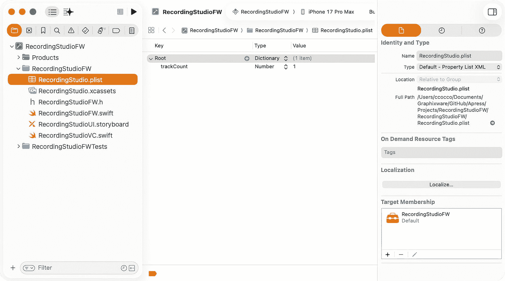
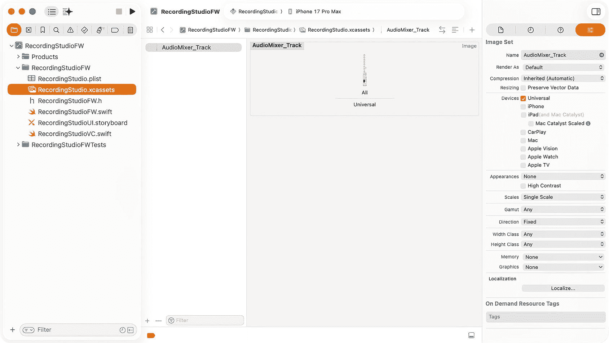
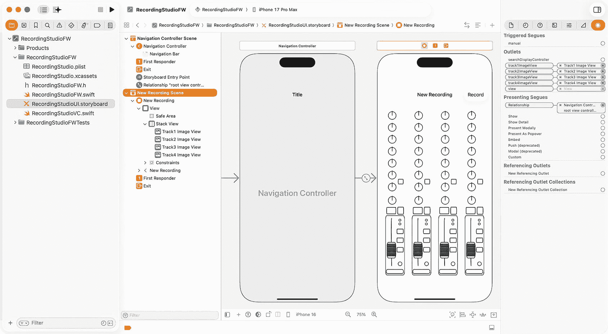
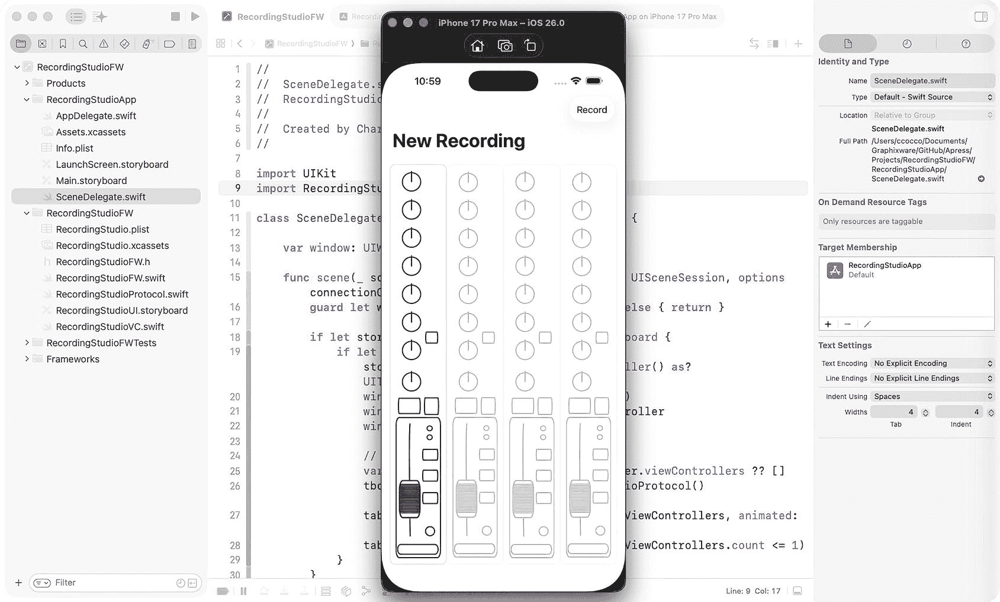

# 5. 扩展动态功能启用示例

## 设计 RecordingStudioFW 框架

基于第 4 章的概念，本章将介绍另一个框架，以演示如何在不同的上下文中应用动态功能启用。你将实现一个类似的架构，展示多个框架如何独立支持可解锁的、购买驱动的功能，从而在整个应用生态系统中强化这种方法的灵活性和可扩展性。本质上，从一个框架内进行的应用内购买将解锁其他框架中的功能，而无需在这些框架之间引入紧密耦合。

本章包含一个模拟多轨录音工作室的用户界面。为了清晰地理解用例，以下是关于**多轨录音**的简要描述：

*多轨录音允许音乐家将每种乐器分别录制到各自的音频轨道上，从而能够灵活地对这些单独轨道进行编辑、重新录制、应用效果、均衡器或音量调整，然后再将它们混音成最终的歌曲。*

在本章中，我们将设计 `RecordingStudioFW` 框架，以将动态功能启用的范围扩展到多个框架。通过使用与前一章类似的架构，你将实现独立运行的可解锁、购买驱动的功能，演示一个框架中的应用内购买如何激活其他框架的功能，而无需引入紧密耦合。一个模拟的多轨录音工作室界面将为这些功能提供一个实用的上下文，说明在模块化应用生态系统中的灵活性和可扩展性。

## 设置 iOS 框架和项目

需要创建并配置一个新的 iOS 框架和项目，类似于第 1 章的操作。使用 `RecordingStudio` 前缀命名项目及相应文件，例如 `RecordingStudioFW`：

1.  执行第 1 章“**创建 iOS 框架**”一节中列出的步骤。
2.  执行第 1 章“**配置 iOS 框架**”一节中列出的步骤。
3.  执行第 1 章“**创建 Storyboard**”一节中列出的步骤。


### 创建属性列表

需要在项目中添加一个属性列表，用于控制框架的运行模式，即轨道启用功能：



图 5-1 属性列表编辑器

1.  右键点击**项目导航器**中的文件夹，选择**从模板新建文件…**
2.  在**资源**组下选择**属性列表**模板，并将其命名为 `RecordingStudio.plist`
3.  在**项目导航器**中选择 `RecordingStudio.plist`
4.  点击空行中的**+**图标，创建一个名为 `trackCount` 的设置，类型为 Number，默认值为 1（**图****5-1**）

### 创建 Cocoa Touch 类

此框架的用户界面将模拟一个 4 轨数字录音工作室。每个轨道将由一个包含录音室控制台上典型控件的图像表示。默认情况下将启用一个轨道。

由于此框架不包含用于控制轨道启用的应用内购买视图，因此将使用属性列表来实现此目的，从而允许框架进行静态配置并在独立应用中使用。一旦此框架集成到包含应用内购买框架的应用中，应用内购买将控制轨道的启用。

1.  右键点击**项目导航器**中的文件夹，选择**从模板新建文件…**
2.  在**源**部分下选择**Cocoa Touch Class**模板，然后点击**下一步**
3.  输入类名 `RecordingStudioVC`，并将子类设置为 `UIViewController`
4.  确保**同时创建 XIB 文件**未勾选，**语言**为 Swift

系统将自动生成以下代码：

```swift
import UIKit
class RecordingStudioVC: UIViewController {
    override func viewDidLoad() {
        super.viewDidLoad()
    }
}
```

需要使用 `@IBOutlet` 定义四个“图像”视图组件，以便通过 Interface Builder 将它们连接到各自的用户界面组件。将以下内容添加到类中：

```swift
class RecordingStudioVC: UIViewController {
    @IBOutlet weak var track1ImageView: UIImageView!
    @IBOutlet weak var track2ImageView: UIImageView!
    @IBOutlet weak var track3ImageView: UIImageView!
    @IBOutlet weak var track4ImageView: UIImageView!
}
```

为了与本书中开发的其他框架保持一致，请将以下标题属性添加到导航控制器：

```swift
override func viewDidLoad() {
    super.viewDidLoad()
    self.navigationController?.navigationBar.prefersLargeTitles = true
    self.navigationItem.largeTitleDisplayMode = .always
}
```

`viewWillAppear()` 将用于在相应视图即将变为可见之前立即启用/禁用轨道组件。默认将使用属性列表设置，并最终由反映应用内购买的 `UserDefaults` 所覆盖。

在模拟用户界面中，轨道启用将简单地包括启用/禁用图像视图组件的用户交互，以及更改图像视图图层的不透明度以呈现启用/禁用的外观。将以下内容添加到类中：

```swift
override func viewWillAppear(_ animated: Bool) {
    super.viewWillAppear(animated)
    var trackCount = 1
    if let bundle = Bundle(identifier:"com.gw.RecordingStudioFW"),
       let path = bundle.path(forResource: "RecordingStudio", ofType: "plist"),
       let plistDict = NSDictionary(contentsOfFile: path),
       let tracks = plistDict.object(forKey: "trackCount") as? Int {
        trackCount = tracks
    }
    if let features = UserDefaults.standard.object(forKey: "iaps") as? [String: Any],
       let tracks = features["tracks"] as? Int {
        trackCount = tracks
    }
    switch trackCount {
    case 2:
        initializeImageView(imageView: self.track1ImageView, enableTrack: true)
        initializeImageView(imageView: self.track2ImageView, enableTrack: true)
        initializeImageView(imageView: self.track3ImageView, enableTrack: false)
        initializeImageView(imageView: self.track4ImageView, enableTrack: false)
    case 3:
        initializeImageView(imageView: self.track1ImageView, enableTrack: true)
        initializeImageView(imageView: self.track2ImageView, enableTrack: true)
        initializeImageView(imageView: self.track3ImageView, enableTrack: true)
        initializeImageView(imageView: self.track4ImageView, enableTrack: false)
    case 4:
        initializeImageView(imageView: self.track1ImageView, enableTrack: true)
        initializeImageView(imageView: self.track2ImageView, enableTrack: true)
        initializeImageView(imageView: self.track3ImageView, enableTrack: true)
        initializeImageView(imageView: self.track4ImageView, enableTrack: true)
    default:
        initializeImageView(imageView: self.track1ImageView, enableTrack: true)
        initializeImageView(imageView: self.track2ImageView, enableTrack: false)
        initializeImageView(imageView: self.track3ImageView, enableTrack: false)
        initializeImageView(imageView: self.track4ImageView, enableTrack: false)
    }
}

func initializeImageView(imageView: UIImageView, enableTrack: Bool) {
    imageView.image = UIImage(named: "AudioMixer_Track", in: Bundle(for: RecordingStudioVC.self), with: nil)
    imageView.isUserInteractionEnabled = enableTrack ? true : false
    imageView.layer.opacity = enableTrack ? 1.0 : 0.25
    imageView.layer.cornerRadius = 10.0
    imageView.layer.masksToBounds = true
    imageView.layer.borderWidth = 1.0
    imageView.layer.borderColor = UIColor(red: 220.0/255.0, green: 220.0/255.0, blue: 220.0/255.0, alpha: 1.0).cgColor
}
```

### 创建资源目录

资源目录^(²⁶) 通常用于组织和管理 iOS 应用内使用的图像。此框架将包含一个表示录音室控制台轨道的图像，该图像将用于每个 `IBOutlet`。该图像可在本框架的下载代码中找到。



图 5-2 资源目录编辑器

1.  右键点击**项目导航器**中的文件夹，选择**从模板新建文件…**
2.  在**资源**组下选择**资源目录**模板，并将其命名为 `RecordingStudio.xcassets`
3.  在**项目导航器**中选择 `RecordingStudio.xcassets`
4.  点击资源目录文档底部的**+**图标，选择**导入…**
5.  选择 `AudioMixer_Track.png`，并将其设置为通用、单一比例图像（**图****5-2**）


## 创建用户界面

本框架的用户界面将模拟一个 4 轨数字录音工作室。每条音轨将由一张描绘录音室调音台典型控件的图片表示。你可以使用 Interface Builder 练习开发这个用户界面，也可以从 GitHub 下载源代码并按以下步骤替换 Storyboard 文件内容：

1. 在项目导航器中右键点击 `RecordingStudioUI.storyboard`，从弹出菜单中选择 **Open As/Source Code**
2. 删除源代码编辑器中显示的文件内容
3. 从下载的 `RecordingStudioUI.storyboard` 文件中复制 storyboard 内容并粘贴到编辑器中
4. 在项目导航器中右键点击 `RecordingStudioUI.storyboard`，从弹出菜单中选择 **Open As/Interface Builder - Storyboard**

该用户界面的视图由一个水平轴栈视图（等分填充）和四个图像视图组成，每个图像视图包含通过资源目录添加的图片，并与添加到 `RecordingStudioVC` 类中的 `@IBOutlet` 变量相连接（**图 5-3**）。



**图 5-3** Storyboard 编辑器

## 创建 Swift 协议

与第 1 章一样，将使用一个公共接口将框架集成到应用目标中。在接下来的章节中，它将被一个完全通用的解决方案所取代。

1. 在**项目导航器**中右键点击文件夹，选择 **New File from Template…**
2. 在 **Source** 组下选择 **Swift File** 模板，并将其命名为 `RecordingStudioProtocol.swift`

在类中定义一个协议以实例化框架的用户界面：

```swift
import Foundation
import UIKit

protocol DisplayableViewController {
    func instantiateRootViewController() -> UIViewController
}
```

采用该协议并使用框架的 Bundle ID 和类继续创建 storyboard：

```swift
public class RecordingStudioProtocol: DisplayableViewController {
    public init() {}
    
    public func instantiateRootViewController() -> UIViewController {
        let storyboard = UIStoryboard(name: "RecordingStudioUI", bundle: Bundle(for: RecordingStudioProtocol.self))
        let vc = storyboard.instantiateViewController(withIdentifier: "RecordingStudioNC")
        return vc
    }
}
```

## 创建应用目标

与之前章节一样，需要在 iOS 框架项目中创建并配置一个应用目标：

1. 执行第 1 章“**创建应用目标**”一节中列出的步骤
2. 执行第 1 章“**创建应用目标用户界面**”一节中列出的步骤
3. 执行第 1 章“**设计应用目标用户界面**”一节中列出的步骤
4. 执行第 1 章“**添加 iOS 框架**”一节中列出的步骤，并选择 `RecordingsStudioFW.framework`

### 集成 iOS 框架

与之前章节一样，需要在 `SceneDelegate.willConnectTo()` 方法中将框架集成到应用中：

```swift
import RecordingStudioFW

func scene(_ scene: UIScene, willConnectTo session: UISceneSession, options connectionOptions: UIScene.ConnectionOptions) {
    guard let winScene = (scene as? UIWindowScene) else { return }
    
    if let storyboard = session.configuration.storyboard {
        if let tabBarController = storyboard.instantiateInitialViewController() as? UITabBarController {
            window = UIWindow(windowScene: winScene)
            window?.rootViewController = tabBarController
            window?.makeKeyAndVisible()
            
            // 通过协议添加框架的用户界面...
            var tbcViewControllers = tabBarController.viewControllers ?? []
            tbcViewControllers.append(RecordingStudioProtocol().instantiateRootViewController())
            tabBarController.setViewControllers(tbcViewControllers, animated: false)
            tabBarController.tabBar.isHidden = (tbcViewControllers.count <= 1)
        }
    }
}
```

#### 运行应用目标

在方案下拉菜单中将应用设置为活动方案，构建应用，然后使用 Xcode 模拟器或实际设备运行。应用应该能够成功编译并运行，显示一条已启用的音轨（**图 5-4**）。



**图 5-4** Xcode 模拟器

在本章中，你通过开发 `RecordingStudioFW` 框架拓展了动态功能启用能力。你在多个框架中实现了可解锁的、由购买驱动的功能，同时保持了解耦，并使用模拟的多轨录音室用户界面演示了实际应用。完成本章后，你进一步加深了对互连框架生态系统中模块化、可扩展性和灵活功能管理原则的理解。

由于现在有多个框架独立支持可解锁功能，你已经准备好探索应用内购买如何跨应用生态系统推动收入增长。在下一章中，我们将扩展一个现有框架，演示在保持解耦的同时实现功能货币化。

