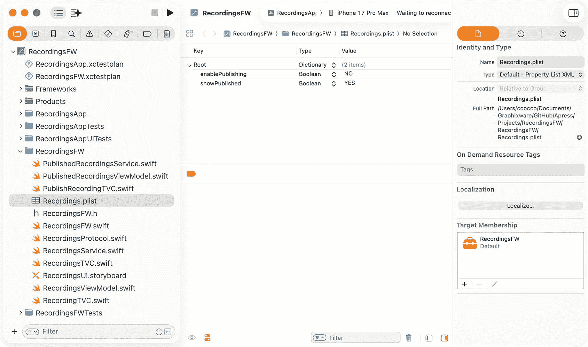
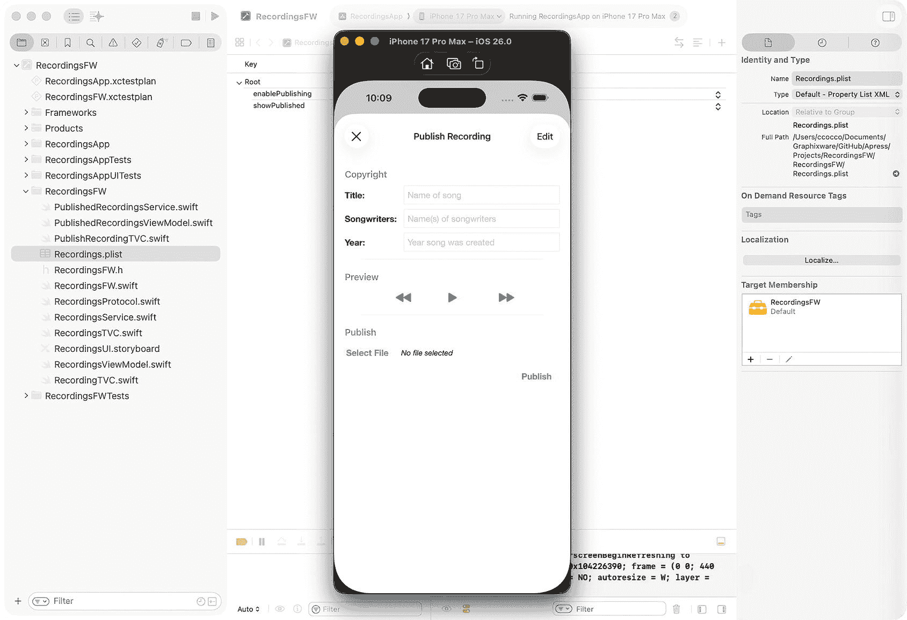
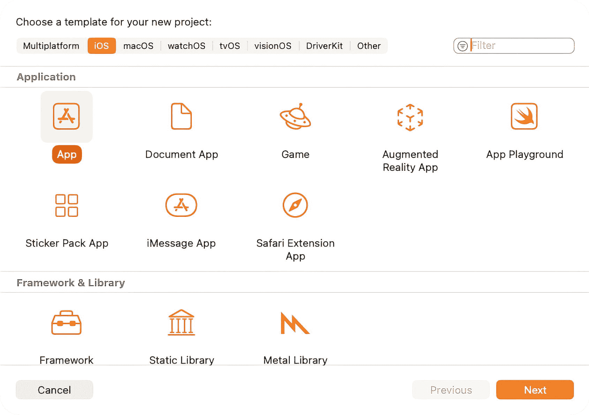
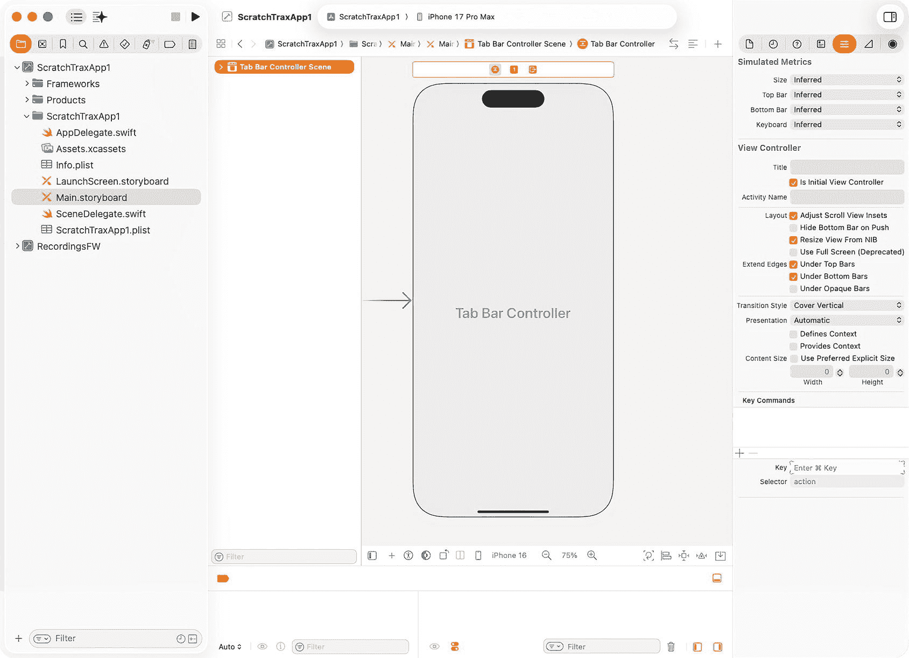
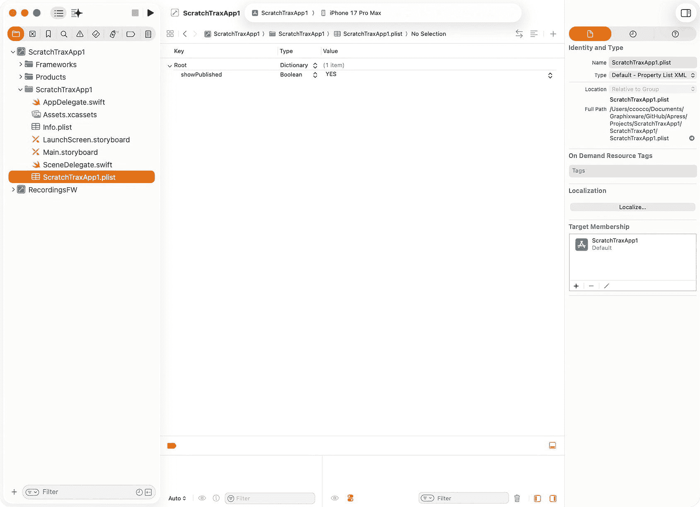
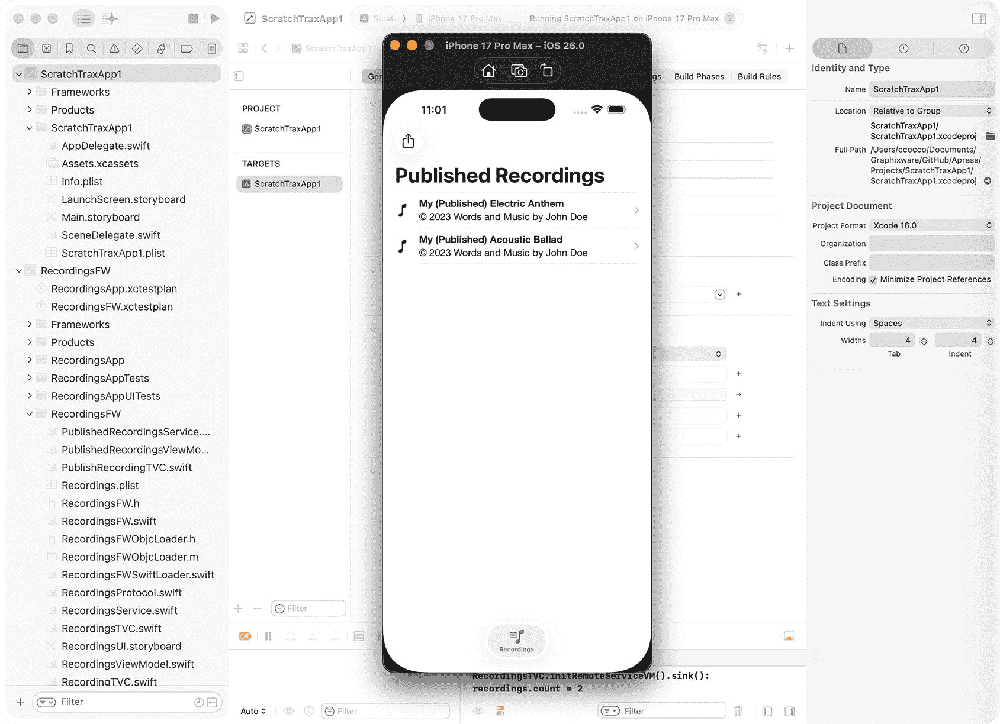

# 6. 通过动态功能启用推动收入增长

## 扩展 RecordingsFW 框架

本章将扩展 `RecordingsFW` 框架，以支持后续章节中演示如何利用应用内购买，根据用户需求和渴望通过功能升级来推动收入增长。

本章将演示通过另一个框架中实现的应用内购买来启用一个“模拟”歌曲发布功能。我们将扩展 `RecordingsFW` 框架以实现收入驱动功能。这种方法为框架在未来章节中应对更复杂的货币化场景做好了准备。

### 功能启用

打开 `RecordingsFW` 框架，因为本章将扩展之前章节开发的代码。

歌曲发布功能将由一个属性列表设置控制，并最终由应用内购买驱动。为了集成属性列表设置，需要在 `Recordings.plist` 中添加一个新属性来控制功能的可见性。创建一个名为 `enablePublishing` 的新属性，并将其定义为 `Bool` 类型，值设置为 `NO`（**图 6-1**）。



**图 6-1** 属性列表编辑器


### 集成行动号召

添加属性列表设置后，该设置将用于控制用户界面组件 `UIBarButtonItem` 的可见性。`UIBarButtonItem` 将触发一个行动号召（CTA），以显示歌曲发布功能的模拟用户界面。

`UIBarButtonItem` 之前已作为 `IBOutlet` 添加到 `RecordingsTVC` 中。应添加一个名为 `publishButtonPressed()` 的行动号召函数作为 `IBAction`，以响应按钮选择（相应的故事板连接已经设置完成）：

```
@IBAction func publishButtonPressed(_ sender: Any) {
let storyboard = UIStoryboard(name: "RecordingsUI", bundle: Bundle(for: RecordingsTVC.self))
let viewController = storyboard.instantiateViewController(withIdentifier: "PublishRecordingNC")
self.present(viewController, animated: true)
}
```

需要在 `viewWillAppear()` 中根据属性列表设置（最终会被 `UserDefaults` 设置覆盖以反映应用内购买）来设置按钮的可见性：

```
override func viewWillAppear(_ animated: Bool) {
super.viewWillAppear(animated)
var enablePublishing = false
if let bundle = Bundle(identifier:"com.gw.RecordingsFW"),
let path = bundle.path(forResource: "Recordings", ofType: "plist"),
let plistDict = NSDictionary(contentsOfFile: path),
let publishing = plistDict.object(forKey: "enablePublishing") as? Bool {
enablePublishing = publishing
}
if let iaps = UserDefaults.standard.object(forKey: "iaps") as? [String: Any],
let publishing = iaps["publish"] as? Bool {
enablePublishing = publishing
}
self.publishBarButtonItem.isHidden = !enablePublishing
}
```

#### 创建行动号召的用户界面

需要创建一个名为 `PublishRecordingTVC` 的新类来支持歌曲发布功能的用户界面：

1.  在项目导航器中右键点击文件夹，然后选择 **从模板新建文件…**
2.  在 **Source** 部分下选择 **Cocoa Touch Class** 模板，然后点击 **Next**
3.  将类命名为 `PublishRecordingTVC`，并将 `UITableViewController` 设置为子类
4.  确保 **同时创建 XIB 文件** 未被勾选，且 **Language** 设置为 Swift

由于此功能的用户界面不具备实际功能，仅用于演示目的，因此可以将该类生成的默认代码替换为以下内容：

```
import UIKit
class PublishRecordingTVC: UITableViewController {
@IBOutlet weak var titleLabel: UILabel!
@IBOutlet weak var songwritersLabel: UILabel!
@IBOutlet weak var yearLabel: UILabel!
@IBOutlet weak var publishButton: UIButton!
@IBOutlet weak var cancelBarButtonItem: UIBarButtonItem!
let copyrightTitle = "Copyright"
let previewTitle = "Preview"
let publishTitle = "Publish"
override func viewDidLoad() {
super.viewDidLoad()
self.clearsSelectionOnViewWillAppear = false
self.tableView.separatorInset = UIEdgeInsets.init(top: 0.0, left: 20.0, bottom: 0.0, right: 0.0)
self.navigationItem.rightBarButtonItem = self.editButtonItem
self.navigationItem.backBarButtonItem = cancelBarButtonItem
if let font = UILabel.appearance().font {
let boldFont = UIFont(descriptor: font.fontDescriptor.withSymbolicTraits(.traitBold)!, size: font.pointSize)
titleLabel.font = boldFont
songwritersLabel.font = boldFont
yearLabel.font = boldFont
}
}
override func numberOfSections(in tableView: UITableView) -> Int {
return 3
}
override func tableView(_ tableView: UITableView, numberOfRowsInSection section: Int) -> Int {
switch section {
case 0:
return 3
case 1:
return 1
case 2:
return 2
default:
return 0
}
}
override func tableView(_ tableView: UITableView, heightForRowAt indexPath: IndexPath) -> CGFloat {
return 44.0
}
override func tableView(_ tableView: UITableView, viewForFooterInSection section: Int) -> UIView? {
if section  CGFloat {
return 21.0
}
override func tableView(_ tableView: UITableView, willDisplayHeaderView view: UIView, forSection section: Int) {
var title = ""
switch section {
case 0:
title = copyrightTitle
case 1:
title = previewTitle
case 2:
title = publishTitle
default:
break
}
let titleView = view as! UITableViewHeaderFooterView
titleView.textLabel?.text = title // Remove all capitalized letters
}
@IBAction func cancelButtonPressed(_ sender: Any) {
self.dismiss(animated: true)
}
@IBAction func publishButtonPressed(_ sender: Any) {
self.dismiss(animated: true)
}
}
```

#### 运行应用目标

在运行应用目标之前，选择 `Recordings.plist`，并将 `showPublished` 设置为 NO，将 `enablePublishing` 设置为 YES。这将模拟一个即将在后续章节中演示的实际应用内购买。

在方案下拉菜单中选择该应用作为活动方案，构建应用，然后使用 Xcode 模拟器或实际设备运行它。应用应能正常编译并运行。

表格视图现在显示了本地音频录制，并准备好发布，同时还有一个可见且已启用的“发布录制”按钮。选择该按钮将显示歌曲发布功能的用户界面（**图** **6-2**）。



**图 6-2** Xcode 模拟器

在本章中，你增强了 `RecordingsFW` 框架，以支持通过应用内购买实现收入驱动功能。通过在另一个框架中通过购买启用模拟的歌曲发布功能，你保持了模块间的解耦，同时演示了模块化框架如何协作以向上销售功能。此扩展巩固了你对可盈利、灵活且可重用的 iOS 框架的理解。在扩展 `RecordingsFW` 框架以支持收入驱动功能后，你已经准备好了解框架如何动态集成到应用中。

在下一章中，我们将探索无代码集成技术，这些技术允许框架动态扩展应用功能，而无需更改代码。

### 启用动态框架集成

#### 设计 ScratchTraxApp1 应用

本章介绍了动态集成的概念，使之前章节中开发的框架能够无缝集成到移动应用中，而无需使用协议或更改代码。本章演示了动态、无代码的框架集成如何让 iOS 应用以更高的灵活性、可扩展性和效率进行扩展和适应，为高度模块化和可维护的架构提供了实用蓝图。

框架需要进行修改，以便通过一系列创新技术实现动态集成。

我们将设计 `ScratchTraxApp1` 应用来演示这种动态框架集成。你将学习如何将之前章节中开发的框架集成到移动应用中，而无需使用协议或进行代码更改。通过应用这些创新技术，你将创建出一个灵活、可扩展且可维护的应用架构，使框架能够动态地适应和扩展应用功能。


##### 创建 iOS 应用

到目前为止，每个框架都是独立开发，并利用各自框架项目内的应用目标来执行的。本章将要构建的 iOS 应用将不再需要这些应用目标，但它们仍保留，以支持框架未来的功能增强，且不依赖于这些 iOS 应用。

创建 `ScratchTraxApp1` 应用与创建内部应用目标类似，该应用将显示通过远程网络请求获取的已发布录音列表。

按如下步骤创建新项目：



图 7-1

新建项目模板

1.  启动 Xcode
2.  选择**创建新 Xcode 项目**
3.  在“应用”分组下选择 **App** 模板（**图** **7-1**）
4.  将产品名称设置为 `ScratchTraxApp1`
5.  将界面设置为 **Storyboard**
6.  将语言设置为 **Swift**

##### 为 iOS 应用创建用户界面

本章构建的 iOS 应用需要一个用户界面来支持框架提供的功能。将使用标签栏控制器，就像每个框架应用目标中使用的那样。执行以下步骤创建并配置标签栏控制器：



图 7-2

故事板编辑器

1.  在**项目导航器**中选择 `ViewController.swift` 并删除它
2.  在**项目导航器**中选择 `Main.storyboard` 以显示**界面构建器**
3.  在**故事板导航器**中选择**视图控制器场景**并删除它
4.  选择**界面构建器**左下角的**库**图标 (+) 并创建一个**标签栏控制器**
5.  删除故事板导航器中的**项目 1 场景**和**项目 2 场景**
6.  在故事板导航器中选择**标签栏控制器场景**
7.  使用右上角的图标显示**检查器**
8.  选择**标识检查器**并输入**故事板 ID**
9.  选择**属性检查器**并勾选**是初始视图控制器**（**图** **7-2**）

##### 为 iOS 应用创建属性列表

需要向项目中添加一个属性列表，以覆盖 `RecordingsFW` 框架中控制其运行模式的属性列表设置 `showPublished`：



图 7-3

属性列表编辑器

1.  右键单击**项目导航器**中的文件夹，选择**从模板新建文件...**
2.  在**资源**分组下选择**属性列表**模板，点击**下一步**
3.  将文件命名为 `ScratchTraxApp1.plist`
4.  在**项目导航器**中选择 `ScratchTraxApp1.plist`
5.  点击空表根行中的 **+** 图标（将鼠标悬停在根单元格上使其可见）
6.  创建一个名为 `showPublished` 的变量，类型设置为 Boolean，值设置为 YES（**图** **7-3**）

### 创建 Xcode 工作区

将使用 Xcode 工作区来组织构建本章移动应用所需的一组项目。当项目被添加到工作区时，Xcode 会自动检测这些项目中目标之间的依赖关系，并以正确的顺序构建它们。关于工作区的详细信息，可在 Apple 开发者文档的“项目与工作区”网站的“**文件和**工作区”主题下找到。^(²⁷)

**创建新工作区：**

1.  如果 Xcode 正在运行，请先关闭它，然后重新启动，并关闭**欢迎使用 Xcode** 界面（没有直接创建工作区的选项，因此需要使用 Xcode 菜单）
2.  选择 Xcode 的 **文件/新建/工作区...** 菜单
3.  将工作区命名为 `ScratchTraxApp1` 并将其保存到包含其他 Xcode 项目的根目录中
4.  右键单击项目导航器中的空白区域，选择**将文件添加到 ScratchTraxApp1…**
5.  导航到包含 `ScratchTraxApp1` 项目的目录，添加 `ScratchTraxApp1.xcodeproj`
6.  在“选择添加文件的选项”下，将**操作**设置为**原地引用文件**
7.  右键单击项目导航器中的空白区域，选择**将文件添加到 ScratchTraxApp1…**
8.  导航到包含 `RecordingsFW` 项目的目录，添加 `RecordingsFW.xcodeproj`
9.  在“选择添加文件的选项”下，将**操作**设置为**原地引用文件**

**将 RecordingsFW 框架添加到应用中：**

1.  在**项目导航器**中选择 `ScratchTraxApp1` 项目的根节点
2.  在**目标**部分选择 `ScratchTraxApp1`
3.  选择**通用**选项卡，然后点击**框架、库和嵌入内容**部分的 **+** 图标
4.  将 `RecordingsFW.framework` 添加到应用中，并确认它出现在**框架、库和嵌入内容**部分，且嵌入方式设置为“嵌入并签名”


### 动态集成 iOS 框架

到目前为止，iOS 框架已通过 `SceneDelegate.willConnectTo()` 方法，使用框架内定义的公开协议集成到应用目标中。接下来，我们将用一种动态、解耦的方案替换这些协议的使用。

为此，需要设计一种机制，允许框架将其根视图控制器注册，供 iOS 应用消费/暴露。将使用 `UserDefaults` 来传播这些“注册信息”。

要支持框架的通用注册，需满足以下要求：

1. 数据格式必须同时为应用和框架所熟知
2. 框架在加载时需要自行注册
3. 应用需要在 `SceneDelegate.willConnectTo()` 中处理注册信息

首先，需要定义一种双方熟知的数据格式。为了实例化、加载并集成框架的用户界面视图控制器，应用需要知道框架的 Bundle ID、Storyboard 名称、Storyboard 标识符、标题以及图标。每个由框架注册的视图都会添加到 `UserDefaults` 的顶级“views”键下：

```
let config = [ "bundle": "com.gw.RecordingsFW", "storyboard": "RecordingsUI", "view":
"RecordingsNC", "title": "Recordings", "icon": "music.note.list"]
```

使用 `UserDefaults` 来管理跨应用和框架的注册信息效果良好，原因如下：

1. 框架总是在应用的 `SceneDelegate.willConnectTo()` 被调用之前加载
2. 框架在加载时总会注册或更新其注册信息，使得框架中的更改能够在应用中体现，而无需应用做出修改
3. 如果应用从设备上删除并重新安装，框架会在加载时重建其注册信息
4. 由应用或其任何框架设置的 `UserDefaults` 对所有框架都是可访问的

为了实现应用的注册流程，`SceneDelegate.willConnectTo()` 需要通过 `UserDefaults` 查找顶级的“views”键。如果找到，它将遍历注册信息数组，并为每个注册信息实例化一个视图控制器，并将其添加到标签栏控制器中。完成后，它会检查应用的属性列表设置，看是否有覆盖框架中对应设置的值，如果有，则通过 `UserDefaults` 传播该值，供框架代码使用。

每个框架内部应用目标中所引用的框架协议将不再需要。取而代之，用以下注册代码替换 `ScratchTraxApp1` 项目中的 `SceneDelegate.willConnectTo()`，以动态地将框架添加到其用户界面：

```
func scene(_ scene: UIScene, willConnectTo session: UISceneSession, options connectionOptions: UIScene.ConnectionOptions) {
    guard let winScene = (scene as? UIWindowScene) else { return }
    if let storyboard = session.configuration.storyboard {
        if let tabBarController = storyboard.instantiateInitialViewController() as? UITabBarController {
            window = UIWindow(windowScene: winScene)
            window?.rootViewController = tabBarController
            window?.makeKeyAndVisible()
            var tbcViewControllers = tabBarController.viewControllers ?? []
            // 通用地添加框架用户界面...
            if let configs = UserDefaults.standard.object(forKey: "views") as? [[String:String]] {
                var lastTitle = ""
                for config in configs {
                    if let bundle = config["bundle"], let storyboard = config["storyboard"], let view = config["view"] {
                        if let bundle = Bundle(identifier: bundle) {
                            let storyboard = UIStoryboard(name: storyboard, bundle: bundle)
                            let storyboardVC = storyboard.instantiateViewController(withIdentifier: view)
                            var image: UIImage?
                            if let icon = config["icon"] {
                                image = UIImage(systemName: icon, withConfiguration: UIImage.SymbolConfiguration(weight: .medium))
                            }
                            storyboardVC.tabBarItem = UITabBarItem(title: config["title"], image: image, tag: 0)
                            if lastTitle == "" || storyboardVC.tabBarItem.title?.caseInsensitiveCompare(lastTitle) == .orderedDescending {
                                tbcViewControllers.append(storyboardVC)
                            } else {
                                tbcViewControllers.insert(storyboardVC, at: tabBarController.viewControllers?.count ?? 0)
                            }
                            lastTitle = storyboardVC.tabBarItem.title ?? ""
                        }
                    }
                }
            }
            tabBarController.setViewControllers(tbcViewControllers, animated: false)
        }
    }
    // 用自己的设置覆盖任何框架的属性列表设置...
    if let bundle = Bundle(identifier:"com.gw.ScratchTraxApp1"), let path = bundle.path(forResource: "ScratchTraxApp1", ofType: "plist"),
       let plistDict = NSDictionary(contentsOfFile: path), let showPublished = plistDict["showPublished"] as? Bool {
        var features = UserDefaults.standard.object(forKey: "features") as? [String:String] ?? [:]
        features["showPublished"] = String(showPublished)
        UserDefaults.standard.set(features, forKey: "features")
    }
}
```


## 框架注册

为了给框架提供充足的机会在应用中注册其用户界面视图控制器，它需要在应用生命周期的早期完成注册，最好是在框架加载时，并且在 `SceneDelegate.willConnectTo()` 执行之前。由于集成到应用中的所有框架都在应用启动其生命周期之前加载完毕，因此检测框架加载至关重要。

那么，在基于 Swift 的框架中如何实现这一点呢？简而言之，这实际上行不通。在 Objective-C 编程语言中，`NSObject` 有一个 `+load` 方法，该方法在实例化 Objective-C 对象时，在其所有父类的 `+load` 方法都被调用后，会被自动调用。然而，在 Swift 类中，该方法并不会被自动调用。

这使框架注册过程变得复杂，实际上阻止了它的正常工作。但有一种替代方案。我们将把 Objective-C 与 Swift 桥接起来，让它作为框架加载的代理。

首先，创建一个 Objective-C 头文件：

1. 在**项目导航器**中右键点击 `RecordingsFW` 项目文件夹，然后选择**从模板新建文件…**
2. 在**Source**组下选择**头文件**模板
3. 将文件命名为 `RecordingsFWObjcLoader.h`

将以下代码添加到头文件中，以定义 Objective-C 的类接口：

```
#ifndef RecordingsFWObjcLoader_h
#define RecordingsFWObjcLoader_h
#import 
NS_ASSUME_NONNULL_BEGIN
@interface RecordingsFWObjcLoader : NSObject
@end
NS_ASSUME_NONNULL_END
#endif /* RecordingsFWObjcLoader_h */
```

为该类创建一个 Objective-C 实现文件：

1. 在**项目导航器**中右键点击 `RecordingsFW` 项目文件夹，然后选择**从模板新建文件…**
2. 在**Source**组下选择**Objective-C 文件**模板
3. 将文件命名为 `RecordingsFWObjcLoader.m`

将以下代码添加到类文件中，以定义 Objective-C 类的实现，该类实现了用于注册钩子的 `+load()` 方法：

```
#import "RecordingsFWObjcLoader.h"
#import "RecordingsFW/RecordingsFW-Swift.h"
@implementation RecordingsFWObjcLoader
+(void) load {
    if ([[RecordingsFWSwiftLoader alloc] init]) {
        NSLog(@"RecordingsFWObjcLoader.load() succeeded...");
    } else {
        NSLog(@"RecordingsFWObjcLoader.load() failed...");
    }
}
@end
```

由于 `RecordingsFW/RecordingsFW-Swift.h` 是一个不可见的桥接头文件，用于支持从 Objective-C 中引用 Swift 类，因此需要设置以下构建设置来强制编译器生成它：

1. 在**项目导航器**中选择 `RecordingsFW` 项目文件夹
2. 选择 `RecordingsFW` 目标
3. 选择**构建设置**选项卡，搜索**Install Generated Header**，并将其设置为**YES**

> **注意：** 在完成下一步之前，`RecordingsFWObjcLoader.m` 将无法编译。

创建一个用于注册框架的 Swift 文件：

1. 在**项目导航器**中右键点击 `RecordingsFW` 项目文件夹，然后选择**从模板新建文件…**
2. 在**Source**组下选择**Swift 文件**模板
3. 将文件命名为 `RecordingsFWSwiftLoader.swift`

将以下代码添加到类中，以执行框架注册，从而让应用能够暴露框架的功能：

```
import Foundation

@objcMembers public class RecordingsFWSwiftLoader: NSObject {
    override public init() {
        super.init()
        initViews()
    }

    func initViews() {
        let config = [ "bundle": "com.gw.RecordingsFW", "storyboard": "RecordingsUI", "view": "RecordingsNC", "title": "Recordings", "icon": "music.note.list"]
        var configs: [[String:String]] = []
        if let persistedConfigs = UserDefaults.standard.object(forKey: "views") as? [Dictionary], !persistedConfigs.isEmpty {
            configs.append(contentsOf: persistedConfigs)
            if !findConfig(configs: persistedConfigs) {
                configs.append(config)
            }
        } else {
            configs.append(config)
        }
        UserDefaults.standard.set(configs, forKey: "views")
    }

    func findConfig(configs: [[String:String]]) -> Bool {
        var found = false
        for config in configs {
            if config["bundle"] == "com.gw.RecordingsFW", config["storyboard"] == "RecordingsUI", config["view"] == "RecordingsNC" {
                found = true
                break
            }
        }
        return found
    }
}
```

###### 关键测试

在方案下拉菜单中将应用设置为当前活动方案，构建应用，然后使用 Xcode 模拟器或真实设备运行它。代码应能正常编译和运行。结果应与**图 7-4**中的截图一致。

当框架被加载时，它会注册自己的视图控制器。应用随后从 `UserDefaults` 中检索此注册信息，实例化相应的视图控制器，将其集成到自己的用户界面中，并覆盖任何框架属性列表设置，以确保视图在“录音”功能中显示**已发布**的音频录音。



**图 7-4** Xcode 模拟器

在本章中，你成功地将一个框架动态集成到了 `ScratchTraxApp1` 应用中，没有使用协议，也没有修改应用底层代码（在为了能够集成而修改代码之后）。你探索了无代码框架集成的技术，展示了如何构建灵活、可扩展且易于维护的应用架构，能够轻松集成模块化框架。这种方法为构建高度可适配的 iOS 应用提供了一个实用的蓝图。

掌握了动态集成技术后，你就可以将多个框架统一到一个单一的、内聚的应用架构中了。在下一章中，我们将把目前开发的所有框架合并到一个应用中，展示跨系统的模块化功能和驱动收入的功能。

