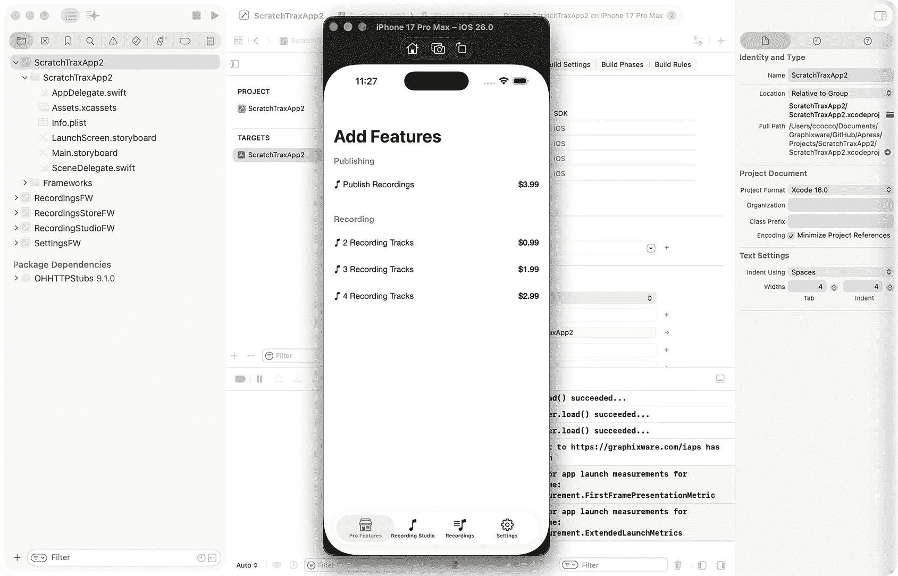
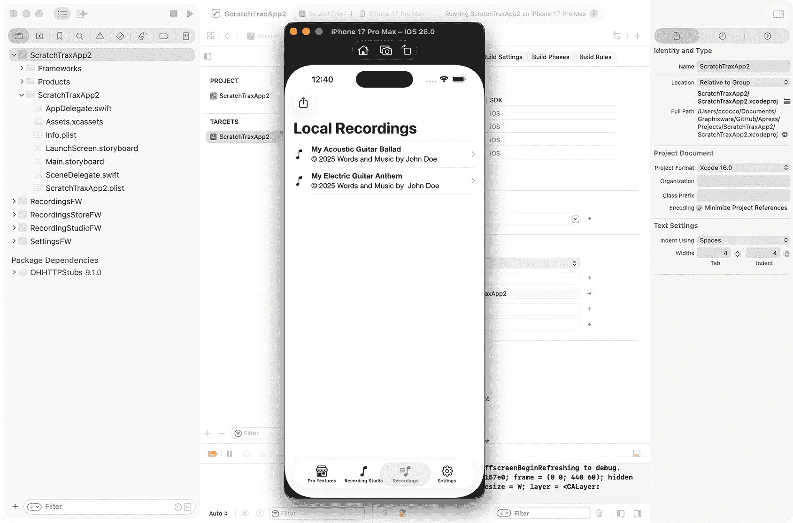
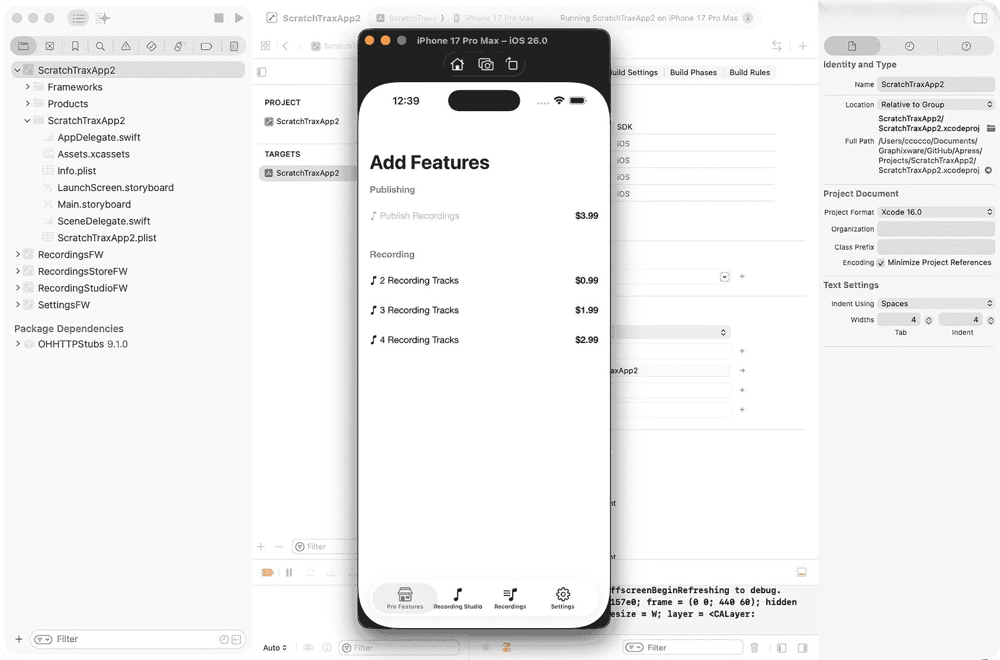
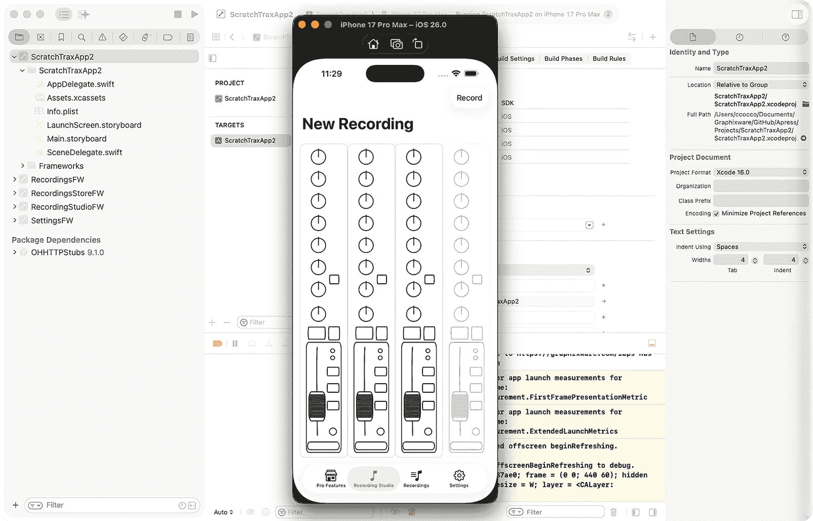
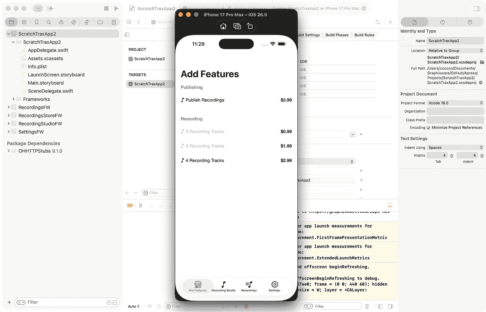

# 8. 统一动态框架架构

## 设计 ScratchTraxApp2 应用

本章将把本书中开发的所有框架整合到一个统一、内聚的架构中。每个框架都基于第 7 章中介绍的原则，在运行时动态加载集成。这个统一系统还跨框架集成了应用内购买，展示了动态功能启用在可扩展的 iOS 架构中如何驱动模块化功能和收入增长。

`RecordingsStoreFW` 和 `RecordingStudioFW` 框架需要像第 7 章中那样进行修改，以便它们能够被动态集成。`SettingsFW` 将继续使用协议进行加载。

在本章中，我们将设计 `ScratchTraxApp2` 应用，将之前开发的所有框架整合到一个统一的、动态集成的系统中。应用内购买将展示动态功能启用如何在保持可扩展和可维护的 iOS 架构的同时，驱动模块化功能和收入增长。

### 创建另一个 iOS 应用

需要创建第二个应用 `ScratchTraxApp2`，使用本书中开发的框架：

1. 启动 Xcode
2. 选择**创建一个新的 Xcode 项目**
3. 在**Application**组下选择**App**模板
4. 将产品名称设置为 `ScratchTraxApp2`
5. 将界面设置为**Storyboard**
6. 将语言设置为**Swift**


### 为 iOS App 创建用户界面

同样，该 App 需要一个用户界面来展示各框架提供的功能。创建并配置一个标签栏控制器：

1.  在**项目导航器**中选择 `ViewController.swift` 并将其删除。
2.  在**项目导航器**中选择 `Main.storyboard` 以显示**界面构建器**。
3.  在**故事板导航器**中选择**视图控制器场景**并将其删除。
4.  选择**界面构建器**左下角的**库**图标（+），并创建一个**标签栏控制器**。
5.  在故事板导航器中删除**项目 1 场景**和**项目 2 场景**。
6.  在故事板导航器中选择**标签栏控制器场景**。
7.  使用右上角的图标显示**检查器**。
8.  选择**身份检查器**并输入**故事板 ID**。
9.  选择**属性检查器**并勾选**是初始视图控制器**。

### 为 iOS App 创建属性列表

需要向项目中添加一个属性列表，以覆盖 RecordingsFW 框架的属性列表设置 `showPublished`，该设置控制着框架的运行模式：

1.  在**项目导航器**中右键点击文件夹，然后选择**从模板新建文件…**。
2.  选择**资源**组下的**属性列表**模板，然后点击**下一步**。
3.  将文件命名为 `ScratchTraxApp2.plist`。
4.  在**项目导航器**中选择 `ScratchTraxApp2.plist`。
5.  在空表格的 Root 行中点击 **+** 图标（将鼠标悬停在 Root 单元格上使其可见）。
6.  创建一个名为 `showPublished` 的变量，类型设置为布尔型，值设置为 NO。

### 创建 Xcode 工作区

同样，本章将使用一个 Xcode 工作区来组织构建移动 App 所需的项目集：

1.  如果 Xcode 正在运行，请先关闭它，然后重新启动，并关闭**欢迎使用 Xcode** 屏幕（由于没有直接创建工作区的选项，因此将使用 Xcode 菜单）。
2.  选择 Xcode 的 **文件/新建/工作区...** 菜单。
3.  将工作区命名为 `ScratchTraxApp2`，并将其保存到包含其他 Xcode 项目的根目录中。
4.  在项目导航器内的空白区域右键点击，选择**将文件添加到 “ScratchTraxApp2”…**。
5.  导航到包含 ScratchTraxApp2 项目的目录，并添加 `ScratchTraxApp2.xcodeproj`。
6.  在**选择添加文件的选项**下，将**操作**设置为**原地引用文件**。
7.  在项目导航器内的空白区域右键点击，选择**将文件添加到 “ScratchTraxApp2”…**。
8.  导航到包含 RecordingsFW 项目的目录，并添加 `RecordingsFW.xcodeproj`。
9.  在**选择添加文件的选项**下，将**操作**设置为**原地引用文件**。
10. 在项目导航器内的空白区域右键点击，选择**将文件添加到 “ScratchTraxApp2”…**。
11. 导航到包含 RecordingsFW 项目的目录，并添加 `RecordingsStoreFW.xcodeproj`。
12. 在**选择添加文件的选项**下，将**操作**设置为**原地引用文件**。
13. 在项目导航器内的空白区域右键点击，选择**将文件添加到 “ScratchTraxApp2”…**。
14. 导航到包含 RecordingsFW 项目的目录，并添加 `RecordingStudioFW.xcodeproj`。
15. 在**选择添加文件的选项**下，将**操作**设置为**原地引用文件**。
16. 在项目导航器内的空白区域右键点击，选择**将文件添加到 “ScratchTraxApp2”…**。
17. 导航到包含 RecordingsFW 项目的目录，并添加 `SettingsFW.xcodeproj`。
18. 在**选择添加文件的选项**下，将**操作**设置为**原地引用文件**。

**将框架添加到 App：**

1.  在**项目导航器**中选择 **ScratchTraxApp2** 项目的根节点。
2.  在**目标**部分下选择 **ScratchTraxApp2**。
3.  选择**通用**选项卡，然后在**框架、库和嵌入式内容**部分下点击 **+** 图标。
4.  将 `RecordingsFW.framework`、`RecordingsStoreFW.framework`、`RecordingStudioFW.framework` 和 `SettingsFW.framework` 添加到 App，并验证它们出现在**框架、库和嵌入式内容**部分，且带有“嵌入并签名”设置。

### 动态集成 iOS 框架

如之前第 7 章所述，框架将通过 `SceneDelegate` 类集成到 App 中。在**项目导航器**中 App 的文件夹下选择该类，并导入 `SettingsFW` 框架。这将是唯一通过公开协议导入的框架。

```swift
import SettingsFW
```

如前所述，需要定义一种众所周知的数据格式。为了实例化、加载和集成框架的用户界面视图控制器，App 需要知道框架的捆绑包 ID、故事板名称、故事板标识符、标题和图标。每个框架注册的视图都将被添加到 `UserDefaults` 顶层“views”键下。以下内容将用于各个相应框架的注册：

**RecordingsFW.framework：**

```swift
let config = [ "bundle": "com.gw.RecordingsFW", "storyboard": "RecordingsUI", "view":
"RecordingsNC", "title": "Recordings", "icon": "music.note.list"]
```

**RecordingsStoreFW.framework：**

```swift
let config = [ "bundle": "com.gw.RecordingsStoreFW", "storyboard": "RecordingsStoreUI",
"view": "RecordingsStoreVC", "title": "Pro Features", "icon": "storefront"]
```

**RecordingStudioFW.framework：**

```swift
let config = [ "bundle": "com.gw.RecordingStudioFW", "storyboard": "RecordingStudioUI",
"view": "RecordingStudioNC", "title": "Recording Studio", "icon": "music.note"]
```

为了实现 App 的注册流程，`SceneDelegate.willConnectTo()` 需要通过 `UserDefaults` 搜索顶层的“views”键。如果找到，它将遍历注册数组，并为每个注册项向标签栏控制器添加一个实例化的视图控制器。完成后，它将检查 App 属性列表中是否有覆盖框架中相应设置的项。如果找到，则通过 `UserDefaults` 传播该设置，以供框架代码使用。

每个框架内部 App Target 引用的框架协议将不再需要。相反，用以下注册代码替换 `ScratchTraxApp2` 项目中 App 的 `SceneDelegate.willConnectTo()` 方法，即可将框架动态添加到其用户界面中：


```swift
func scene(_ scene: UIScene, willConnectTo session: UISceneSession, options connectionOptions: UIScene.ConnectionOptions) {
    guard let winScene = (scene as? UIWindowScene) else { return }
    if let storyboard = session.configuration.storyboard {
        if let tabBarController = storyboard.instantiateInitialViewController() as? UITabBarController {
            window = UIWindow(windowScene: winScene)
            window?.rootViewController = tabBarController
            window?.makeKeyAndVisible()
            var tbcViewControllers = tabBarController.viewControllers ?? []
            // 以通用方式添加框架 UI...
            if let configs = UserDefaults.standard.object(forKey: "views") as? [[String:String]] {
                var lastTitle = ""
                for config in configs {
                    if let bundle = config["bundle"], let storyboard = config["storyboard"], let view = config["view"] {
                        if let bundle = Bundle(identifier: bundle) {
                            let storyboard = UIStoryboard(name: storyboard, bundle: bundle)
                            let storyboardVC = storyboard.instantiateViewController(withIdentifier: view)
                            var image: UIImage?
                            if let icon = config["icon"] {
                                image = UIImage(systemName: icon, withConfiguration: UIImage.SymbolConfiguration(weight: .medium))
                            }
                            storyboardVC.tabBarItem = UITabBarItem(title: config["title"], image: image, tag: 0)
                            // 由于框架加载顺序不可控，按字母顺序添加到标签栏...
                            if lastTitle == "" || storyboardVC.tabBarItem.title?.caseInsensitiveCompare(lastTitle) == .orderedDescending {
                                tbcViewControllers.append(storyboardVC)
                            } else {
                                tbcViewControllers.insert(storyboardVC, at: tabBarController.viewControllers?.count ?? 0)
                            }
                            lastTitle = storyboardVC.tabBarItem.title ?? ""
                        }
                    }
                }
                // 通过协议添加框架用户界面...
                tbcViewControllers.append(SettingsProtocol().instantiateRootViewController(configuration: ["Test" : true]))
                tabBarController.setViewControllers(tbcViewControllers, animated: false)
            }
        }
    }
    // 用自己的设置覆盖任何框架的 p-list 设置…
    if let bundle = Bundle(identifier:"com.gw.ScratchTraxApp2"), let path = bundle.path(forResource: "ScratchTraxApp2", ofType: "plist"),
       let plistDict = NSDictionary(contentsOfFile: path), let showPublished = plistDict["showPublished"] as? Bool {
        var features = UserDefaults.standard.object(forKey: "features") as? [String:String] ?? [:]
        features["showPublished"] = String(showPublished)
        UserDefaults.standard.set(features, forKey: "features")
    }
}
```

## 框架注册

如第 7 章中的`RecordingsFW`框架所示，`RecordingStudioFW`和`RecordingsStoreFW`框架需要添加必要的 Objective-C 和 Swift 类，以便在加载时执行注册。`SettingsFW`框架将继续通过公共协议进行集成。

### RecordingStudioFW

创建 Objective-C 头文件：

1.  在**项目导航器**中右键单击`RecordingStudioFW`项目文件夹，然后选择**从模板新建文件...**
2.  在**源**组下选择**头文件**模板
3.  将文件命名为`RecordingStudioFWObjcLoader.h`

将以下代码添加到头文件以定义 Objective-C 类接口：

```objc
#ifndef RecordingStudioFWObjcLoader_h
#define RecordingStudioFWObjcLoader_h
#import 
// NS_ASSUME_NONNULL_BEGIN: https://developer.apple.com/swift/blog/?id=25
NS_ASSUME_NONNULL_BEGIN
@interface RecordingStudioFWObjcLoader : NSObject
@end
NS_ASSUME_NONNULL_END
#endif /* RecordingStudioFWObjcLoader_h */
```

为该类创建 Objective-C 实现文件：

1.  在**项目导航器**中右键单击`RecordingStudioFW`项目文件夹，然后选择**从模板新建文件...**
2.  在**源**组下选择**Objective-C 文件**模板
3.  将文件命名为`RecordingStudioFWObjcLoader.m`

将以下代码添加到类文件中以定义 Objective-C 类实现，该实现通过`+load()`方法实现注册钩子：

```objc
#import "RecordingStudioFWObjcLoader.h"
#import "RecordingStudioFW/RecordingStudioFW-Swift.h"
@implementation RecordingStudioFWObjcLoader
// https://developer.apple.com/documentation/objectivec/nsobject/1418815-load
+(void) load {
    if ([[RecordingStudioFWSwiftLoader alloc] init]) {
        NSLog(@"RecordingStudioFWObjcLoader.load() 成功...");
    } else {
        NSLog(@"RecordingStudioFWObjcLoader.load() 失败...");
    }
}
@end
```

由于`RecordingStudioFW/RecordingStudioFW-Swift.h`是一个不可见的桥接头文件，用于支持在 Objective-C 中引用 Swift 类，因此需要设置以下构建设置以强制编译器生成该文件：

1.  在**项目导航器**中选择`RecordingStudioFW`项目文件夹
2.  选择`RecordingStudioFW`目标
3.  选择**构建设置**选项卡，搜索**安装生成的头文件**，并将其设置为**YES**

> **注意：** 在完成下一步之前，`RecordingStudioFWObjcLoader.m`将无法编译。

创建用于注册框架的 Swift 文件：

1.  在**项目导航器**中右键单击`RecordingsFW`项目文件夹，然后选择**从模板新建文件...**
2.  在**源**组下选择**Swift 文件**模板
3.  将文件命名为`RecordingStudioFWSwiftLoader.swift`

将以下代码添加到类中以执行框架注册，使应用能够暴露框架的功能：

```swift
import Foundation
@objcMembers public class RecordingStudioFWSwiftLoader: NSObject {
    override public init() {
        super.init()
        initViews()
    }
    
    func initViews() {
        let config = [ "bundle": "com.gw.RecordingStudioFW", "storyboard": "RecordingStudioUI", "view": "RecordingStudioNC", "title": "录音工作室", "icon": "music.note"]
        var configs: [[String:String]] = []
        if let persistedConfigs = UserDefaults.standard.object(forKey: "views") as? [Dictionary], !persistedConfigs.isEmpty {
            configs.append(contentsOf: persistedConfigs)
            if !findConfig(configs: persistedConfigs) {
                configs.append(config)
            }
        } else {
            configs.append(config)
        }
        UserDefaults.standard.set(configs, forKey: "views")
    }
    
    func findConfig(configs: [[String:String]]) -> Bool {
        var found = false
        for config in configs {
            if config["bundle"] == "com.gw.RecordingStudioFW", config["storyboard"] == "RecordingStudioUI", config["view"] == "RecordingStudioNC" {
                found = true
                break
            }
        }
        return found
    }
}
```

### RecordingsStoreFW

创建 Objective-C 头文件：


1.  在**项目导航器**中，右键点击 `RecordingsStoreFW` 项目文件夹，然后选择**从模板新建文件…**

2.  在**源代码**分组下选择**头文件**模板

3.  将文件命名为 `RecordingsStoreFWObjcLoader.h`

将以下代码添加到头文件中，以定义 Objective-C 类的接口：

```
#ifndef RecordingsStoreFWObjcLoader_h
#define RecordingsStoreFWObjcLoader_h
#import 
// NS_ASSUME_NONNULL_BEGIN: https://developer.apple.com/swift/blog/?id=25
NS_ASSUME_NONNULL_BEGIN
@interface RecordingsStoreFWObjcLoader : NSObject
@end
NS_ASSUME_NONNULL_END
#endif /* RecordingsStoreFWObjcLoader_h */
```

为该类创建 Objective-C 的实现文件：

1.  在**项目导航器**中，右键点击 `RecordingsStoreFW` 项目文件夹，然后选择**从模板新建文件…**

2.  在**源代码**分组下选择**Objective-C 文件**模板

3.  将文件命名为 `RecordingsStoreFWObjcLoader.m`

将以下代码添加到类文件中，以定义 Objective-C 类的实现，该实现包含了用于注册钩子的 `+load()` 方法：

```
#import "RecordingsStoreFWObjcLoader.h"
#import "RecordingsStoreFW/RecordingsStoreFW-Swift.h"
@implementation RecordingsStoreFWObjcLoader
// https://developer.apple.com/documentation/objectivec/nsobject/1418815-load
+(void) load {
if ([[RecordingsStoreFWSwiftLoader alloc] init]) {
NSLog(@"RecordingsStoreFWObjcLoader.load() succeeded...");
} else {
NSLog(@"RecordingsStoreFWObjcLoader.load() failed...");
}
}
@end
```

由于 `RecordingsStoreFW/RecordingsStoreFW-Swift.h` 是一个不可见的桥接头文件，用于支持在 Objective-C 中引用 Swift 类，因此需要设置以下构建设置，以强制编译器生成该头文件：

1.  在**项目导航器**中选择 `RecordingsStoreFW` 项目文件夹

2.  选择 `RecordingsStoreFW` 目标

3.  选择**构建设置**标签页，搜索**安装生成的头文件**，并将其设置为**是**

> **注意**：在完成下一步之前，`RecordingsStoreFWObjcLoader.m` 将无法编译。

创建用于注册框架的 Swift 文件：

1.  在**项目导航器**中，右键点击 `RecordingsFW` 项目文件夹，然后选择**从模板新建文件…**

2.  在**源代码**分组下选择**Swift 文件**模板

3.  将文件命名为 `RecordingsStoreFWSwiftLoader.swift`

将以下代码添加到类中，以执行框架注册，从而使应用能够公开框架的功能：

```
import Foundation
@objcMembers public class RecordingsStoreFWSwiftLoader: NSObject {
override public init() {
super.init()
initViews()
}
func initViews() {
let config = [ "bundle": "com.gw.RecordingsStoreFW", "storyboard": "RecordingsStoreUI", "view": "RecordingsStoreVC", "title": "Pro Features", "icon": "storefront"]
var configs: [[String:String]] = []
if let persistedConfigs = UserDefaults.standard.object(forKey: "views") as? [Dictionary], !persistedConfigs.isEmpty {
configs.append(contentsOf: persistedConfigs)
if !findConfig(configs: persistedConfigs) {
configs.append(config)
}
} else {
configs.append(config)
}
UserDefaults.standard.set(configs, forKey: "views")
}
func findConfig(configs: [[String:String]]) -> Bool {
var found = false
for config in configs {
if config["bundle"] == "com.gw.RecordingsStoreFW", config["storyboard"] == "RecordingsStoreUI", config["view"] == "RecordingsStoreVC" {
found = true
break
}
}
return found
}
}
```

向 `RecordingsStoreFWSwiftLoader` 添加 `initFeatures()` 方法，以获取持久化到 Core Data 的应用内购买内容，从而能够通过 `UserDefaults` 进行传播。

```
import Foundation
@objcMembers public class RecordingsStoreFWSwiftLoader: NSObject {
override public init() {
super.init()
initViews()
initFeatures()
}
func initFeatures() {
var publish = false
var tracks: Int16 = 1
let manager = SwiftDataManager.shared
if let config = manager.configuration {
publish = config.publishRecordings
tracks = config.trackCount
} else {
// 没有现有配置——创建一个默认配置
manager.saveConfiguration(existing: nil, publishRecordings: false, trackCount: 1)
if let config = manager.configuration {
publish = config.publishRecordings
tracks = config.trackCount
}
}
UserDefaults.standard.set(["publishRecordings": publish, "trackCount": tracks], forKey: "features")
}
}
```

## 锦上添花

在方案下拉菜单中选择该应用作为当前方案，构建应用，并使用某个 Xcode 模拟器或真机运行它。代码应能正常编译和运行。结果应与**图 8-1** 中的截图一致。



**图 8-1: Xcode 模拟器**

当框架被加载时，它们会注册自己的视图控制器。应用从 `UserDefaults` 中检索这些注册信息，实例化对应的视图控制器，将它们集成到自己的用户界面中，并根据需要覆盖框架的 Property List 设置。在此案例中，应用将在“录音”功能中显示**本地音频录音**。

太棒了！现在使用相同的框架创建了两个截然不同的应用。两者都无需依赖协议即可动态加载框架，并且都不需要修改代码来支持不同的操作模式或功能。


## 通过应用内购买驱动收入

在本章中，`ScratchTraxApp2` 模拟了一个数字录音工作室。本地录音通过“录音”视图管理，而音频轨道管理和歌曲发布则通过“专业功能”视图控制。

模拟的应用内购买将用于测试动态功能启用的正确集成。

**用例 1：**



图 8-3

Xcode 模拟器



图 8-2

Xcode 模拟器

1.  选择“专业功能”标签页，购买“发布录音”应用内购买。该 IAP 将变为禁用状态，表示购买已完成。
2.  导航到“录音”视图，选择导航控制器左侧的“发布录音”图标。将显示“发布录音”视图。
3.  关闭并重新启动应用，确认 IAP 保持禁用状态，通过 `SwiftData` 验证持久化（**图** **8-2** 和 **图** **8-3**）。

**用例 2：**



图 8-5.



图 8-4.

1.  选择“专业功能”标签页，购买“3 个录音轨道”应用内购买。该 IAP 将变为禁用状态，表示购买已完成。
2.  导航到“录音工作室”视图，确认三个录音轨道现已启用。
3.  关闭并重新启动应用，确认 IAP 保持禁用状态，通过 `SwiftData` 验证持久化（**图** **8-4** 和 **图** **8-5**）。

在本章中，您成功地将多个框架通过动态运行时集成统一到了 `ScratchTraxApp2` 应用中。通过按需修改框架并在各模块间利用应用内购买，您构建了一个内聚、模块化且具备收入能力、无需修改代码的应用。本章强化了可扩展架构的原则，展示了动态框架如何无缝协同工作。

现在多个框架已统一到单个应用中，您即可确保自己的应用能够触达全球受众。在下一章中，我们将探讨如何本地化框架以支持多语言，为不同语言和地区调整界面与内容。

