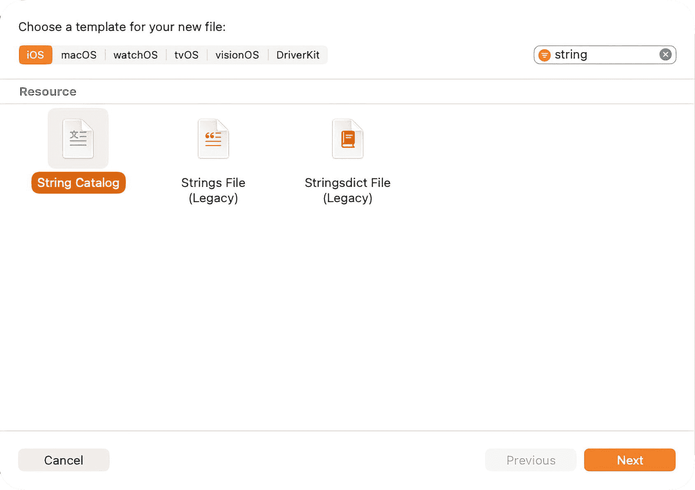
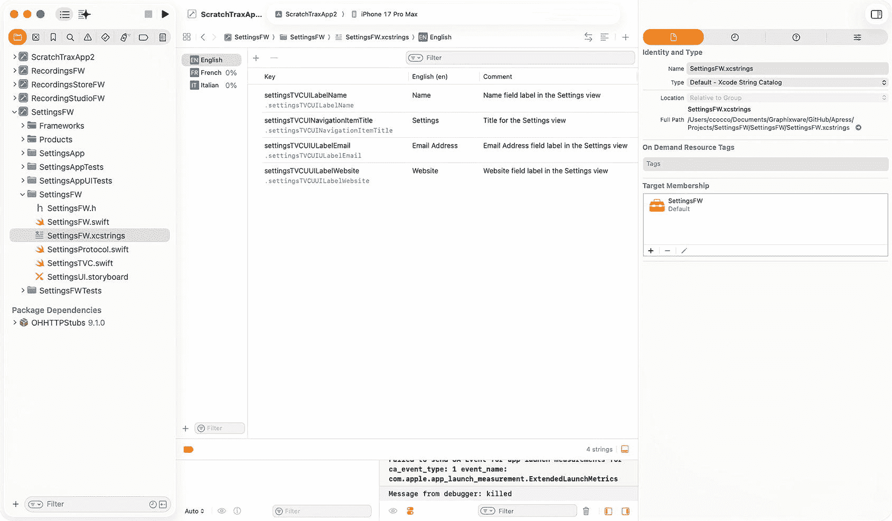
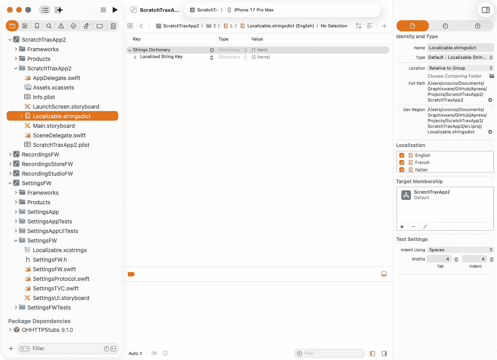
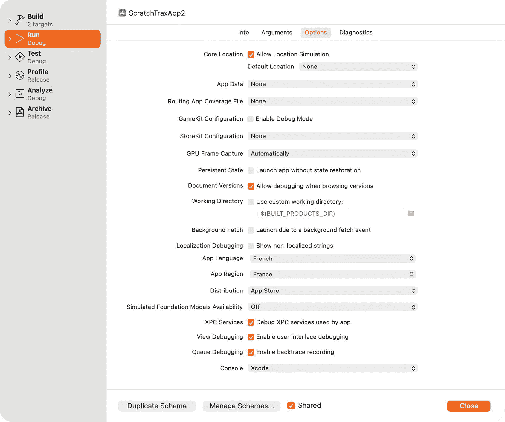
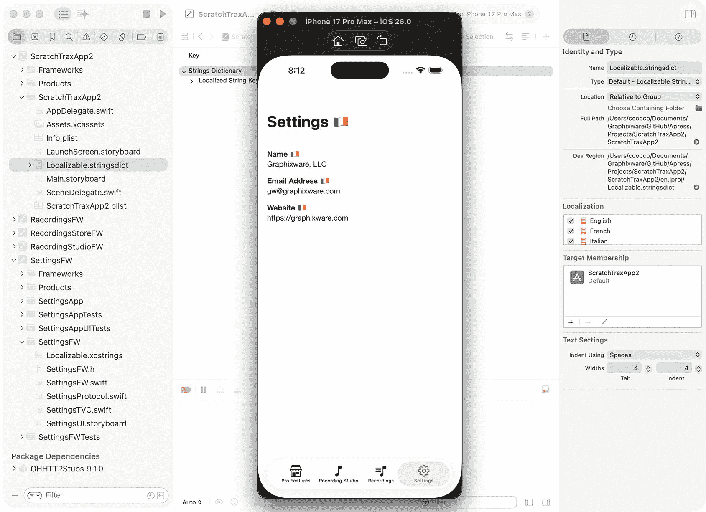

# 9. 国际化框架实现多语言支持

## 本地化 `SettingsFW` 框架

国际化是一个复杂的主题，涵盖用户体验设计、用户界面开发、语言翻译、日期与时间格式、货币、文化敏感性、法律与法规合规性、字符编码与字体支持、键盘与输入法支持，以及无障碍性（ADA 与无障碍标准）。

本章将聚焦于 iOS 框架的本地化与最佳实践，使其能够自动适应不同的语言设置。

完整的本地化多方面主题（包括文本、资源、布局以及导入/导出工具）可在 Apple 开发者文档中获取。^(²⁹)

在本章中，我们将重点讨论本地化 `SettingsFW` 框架，以在 iOS 应用中提供多语言支持。您将学习使文本适应不同语言的最佳实践，确保无缝的用户体验。最终，`ScratchTraxApp2` 将能够以多种语言显示“设置”视图，为您的框架走向国际受众做好准备。


### 本地化视图控制器

在开发包含用户界面的 iOS 框架时，最好对相关代码进行本地化，以简化未来的国际化工作。本书示例项目中使用到的界面显示文本，为了清晰起见，特意采用了硬编码。本章将逐步讲解将 `SettingsFW` 框架本地化为多种语言所需的步骤。

`SettingsTVC` 类定义了框架的用户界面，其中包含三个 `UILabel` 组件：`nameLabel`、`emailLabel` 和 `websiteLabel`。当视图加载时，必须使用相应语言文件中的值来正确初始化这些标签。在生产应用中，对应的值标签 `nameValueLabel`、`emailValueLabel` 和 `websiteValueLabel` 通常会通过网络 API 请求动态设置。然而，在本示例中，这些值仍保持硬编码。

将使用 `String`（这是 Swift 中用于本地化字符串的新式且更推荐的方式）从相应的语言文件中检索 `UILabel` 的值，而不是使用旧的 `NSLocalizedString`。

```
String("settingsTVCUILabelName", bundle: Bundle(for: SettingsTVC.self), comment: "设置视图中的“姓名”字段标签")
```

第一个参数是在相应语言文件中定义的键（Key）。虽然对键没有严格的命名规范，但它们在框架代码库中必须唯一，并且在执行翻译时应易于识别。当键值对数量很大时，这一点尤其重要。如果在翻译文件中找不到某个键，则会显示该键本身。

**注意**：Xcode 的字符串目录编辑器会将点分隔、连字符分隔、下划线分隔以及驼峰式的键转换为小驼峰形式。如果希望键采用特定格式，可以手动编辑 Strings 目录（右键点击 -> 打开为/源代码）。

第二个参数是框架的包标识符（bundle ID），这对函数正常工作至关重要。如果使用的 `String()` 变体不包含包标识符，该函数将尝试从应用的语言文件（而非框架的语言文件）中检索字符串，从而导致失败。

第三个参数是为翻译人员提供上下文的注释。它不会出现在应用的 UI 中，但在使用 Xcode 的"导出用于本地化"功能提取本地化字符串时，它会存储在生成的翻译文件中。由于注释参数将由 String Catalog 提供，因此可以省略。

将 `String()` 集成到 `SettingsTVC` 类中，以本地化设置功能中的可显示文本：

```
override func viewDidLoad() {
super.viewDidLoad()
let frameworkBundle = Bundle(for: SettingsTVC.self)
self.navigationItem.title = String(localized: "settingsTVCUINavigationItemTitle", bundle: frameworkBundle)
self.nameLabel.text = String(localized: "settingsTVCUILabelName", bundle: frameworkBundle)
self.emailLabel.text = String(localized: "settingsTVCUILabelEmail", bundle: frameworkBundle)
self.websiteLabel.text = String(localized: "settingsTVCUILabelWebsite", bundle: frameworkBundle)
}
```

## 创建字符串目录

为 `SettingsFW` 框架创建一个字符串目录：



**图 9-1** 字符串目录模板

1. 在 `Project Navigator` 中右键点击 `SettingsFW` 文件夹，然后选择 `New File from Template…`
2. 在 `Resource` 组下选择 `String Catalog` 模板，然后点击 `Next`（**图** **9-1**）
3. 将文件命名为 `Localizable.xcstrings`

### 向字符串目录添加本地化语言

向字符串目录添加英语 (en)、法语 (fr) 和意大利语 (it) 的本地化：

1. 在 `Project Navigator` 中选择 `.xcstrings` 文件
2. 通过 `Localizations Navigator` 左下角的 + 图标选择 `Add new language`，先添加 `French (fr)`，然后添加 `Italian (it)`，因为英语 (en) 是默认创建的

### 向英语本地化添加值

向英语本地化添加值：



**图 9-2** 字符串目录编辑器

1. 在 `String Catalog Navigator` 中选择 `English`
2. 在空白的 English 本地化编辑器中使用左上角的 + 图标选择 `Add a new manual string`，将 Key 设置为 `settingsTVCUINavigationItemTitle`，English (en) 设置为 `Settings`，Comment 设置为 "`设置视图的标题`"（**图** **9-2**）
3. 对其余字符串重复步骤 2

### 向法语本地化添加值

向法语本地化添加值：

1. 在 `String Catalog Navigator` 中选择 `French`
2. 在空白的 English 本地化编辑器中使用左上角的 + 图标选择 `Add a new manual string`，将 Key 设置为 `settingsTVCUINavigationItemTitle`，French (fr) 设置为 `Settings` 🇫🇷（你可以通过 Control-Command-Space 并搜索 France 来添加法国表情符号），并将 Comment 设置为 "`设置视图的标题`"
3. 对其余字符串重复步骤 2

### 向意大利语本地化添加值

向意大利语本地化添加值：

1. 在 `String Catalog Navigator` 中选择 `Italian`
2. 在空白的 English 本地化编辑器中使用左上角的 + 图标选择 `Add a new manual string`，将 Key 设置为 `settingsTVCUINavigationItemTitle`，Italian (it) 设置为 `Settings` 🇮🇹（你可以通过 Control-Command-Space 并搜索 Italy 来添加意大利表情符号），并将 Comment 设置为 "`设置视图的标题`"
3. 对其余字符串重复步骤 2


## 为 App 创建本地化文件

为了让 `SettingsFW` 框架能根据正确的语言环境显示，包含该框架的 App 也必须包含一个本地化文件（即便该文件为空）。否则，默认将始终显示英语（即默认语言环境）。

为 `ScratchTraxApp2` 创建一个本地化文件：



**图 9-3** Stringsdict 编辑器

1.  在 `Project Navigator` 中右键点击 `ScratchTraxApp2` 文件夹，选择 `New File from Template…`
2.  在 `Resource` 组下选择 `Stringsdict File (Legacy)` 模板，点击 `Next`
3.  将文件命名为 `Localizable.xcstrings` 并创建空文件
4.  在 `Project Navigator` 的 `ScratchTraxApp2` 文件夹下选中 `Localizable.xcstrings`，然后在右侧点击 `Show the File inspector`
5.  在 `Localization` 部分，勾选英语、法语和意大利语（**图** **9-3**）

### 配置 Scheme

在 iOS 模拟器中运行 App 之前，需要先将 `ScratchTraxApp2` Scheme 的 `App Language` 和 `App Region` 设置切换为目标语言：



**图 9-4** 编辑 Scheme 选项

1.  在编辑器上方的方案选择下拉框中，选择 `ScratchTraxApp2`
2.  在编辑器上方的方案选择下拉框中，选择 `Edit Scheme…`
3.  在 Scheme 导航器中选择 `Run` 方案，然后在方案设置中选择 `Options` 选项卡
4.  将 `App Language` 更改为法语，`App Region` 更改为法国（**图** **9-4**）

### 在模拟器中运行 App

当 App 在 iOS 模拟器中运行时，设置视图的标题、姓名、电子邮件地址和网站标签将按法语语言环境显示（**图** **9-5**）。



**图 9-5** Xcode 模拟器

### 在真机上运行 App

为了在真机设备上运行 App 并获得相同的结果，需要执行以下步骤：


**图 9-6** 在真机上运行的 App

1.  再次编辑 Scheme，将 `App Language` 设置为 `System Language`，`App Region` 设置为 `System Region`，并勾选 `Localization Debugging`（SwiftUI 会自动将未本地化的文本显示为大写）
2.  通过 Xcode 在 `Run Destinations` 下选择一台真机设备，然后点击运行以将 App 安装到设备上
3.  在设备上，进入 `Settings/General/Language & Region`，然后 `Add Italian`（在提示时选择 `Use Italian`）
4.  设备重启后，在设备上（在 Xcode 之外）运行 App 以查看结果（**图** **9-6**）

在本章中，您对 `SettingsFW` 框架进行了本地化以支持多种语言，并应用了文本适配的最佳实践。通过完成这项工作，`ScratchTraxApp2` 现在可以以不同语言显示设置，展示了如何为 iOS 框架做好面向国际用户的准备，同时保持模块化和可用性。

在为框架做好面向国际用户的准备之后，您就可以探索如何让您的 App 在视觉上更具灵活性。在下一章中，我们将实现动态品牌化，以便在不更改代码的情况下，跨框架实现一致且集中的样式。

脚注 1

