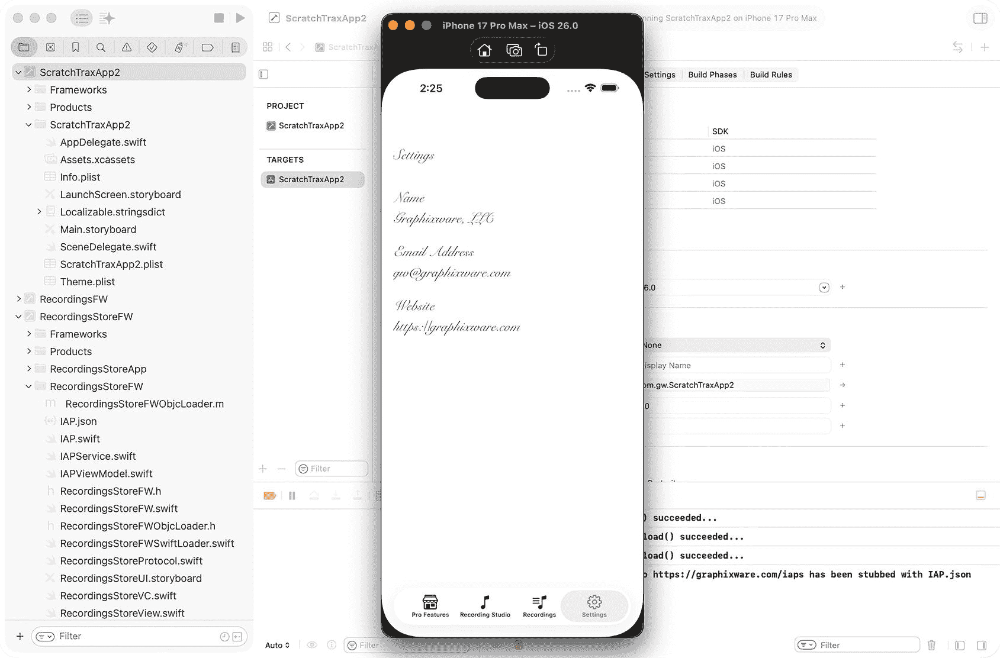
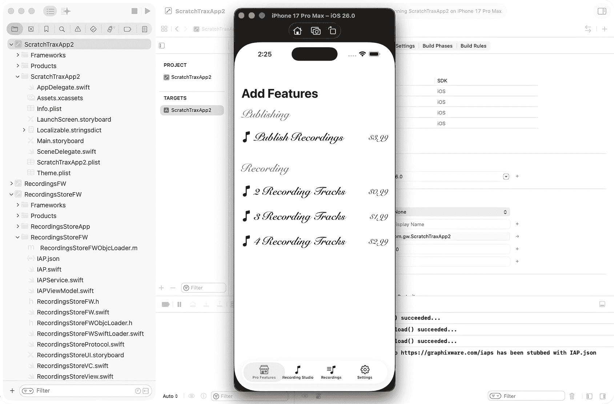

# 10. 在 iOS 框架中设计动态品牌化

增强 `ScratchTraxApp2` App

品牌化涉及为 App 创建一个独特且令人难忘的身份，确保在所有平台和素材上保持一致。品牌化的关键方面包括 App 图标、启动屏幕、调色板、排版、图像、图标设计、无障碍访问和 UI 元素。

关于品牌化、^(³⁰) 人机界面指南 (HIG)、^(³¹) `UIAppearance`、^(³²) 和配置^(³³) 的全面文档，可以在 Apple 开发者网站上找到。

在本章中，我们将通过跨框架实现动态品牌化来增强 `ScratchTraxApp2` App。您将学习如何为 `UIKit` 和 `SwiftUI` 组件集中管理字体和样式属性，从而确保一致的 App 身份。通过应用这些技术，您的 App 将能够在不修改底层代码的情况下动态更新品牌形象。

## 动态品牌化技术

动态品牌化将首先通过 `UIKit` 组件进行演示，然后介绍 `SwiftUI` 组件。`UIKit` 元素将尽可能使用 `Configuration` 功能，否则使用替代技术。`SwiftUI` 元素将利用 `Environment Keys`。将使用类、协议和结构体扩展来一致地应用品牌化。所有动态品牌化都将从集中位置进行管理，以确保由框架提供的 App 用户界面在外观上保持一致。

在 iOS 26+ 中，支持现代 `Configuration` 功能的 UIKit 组件包括：`UIButton`、`UIBarButtonItem`、`UISegmentedControl`、`UIToolbar`、`UITabBarItem`、`UITabBar`、`UINavigationBar`、嵌入在菜单中的 `UIStackView` 按钮，以及通过内容配置实现的 `UICollectionView`/`UITableView` 单元格。不支持 `Configuration` 功能并且仍然需要直接设置属性或使用 `UIAppearance` 功能的组件包括：`UILabel`、`UITextField`、`UITextView`、`UIImageView`、`UISlider`、`UISwitch`、`UIProgressView`、`UIActivityIndicatorView` 以及大多数自定义的 `UIView` 子类。

`SwiftUI` 组件将通过为适用的组件字体定义 `Environment Keys` 来进行品牌化。`View` 的扩展（例如 `.appBodyFont()` 和 `.appButtonFont()`）会自动应用这些字体，从而确保整个 App 中所有 `SwiftUI` 组件的品牌形象保持一致。


## 为品牌化创建属性列表

属性列表（plist）将用于定义和管理品牌化属性，提供一种集中式、人类可读且结构化的格式，可在运行时加载，以配置字体、字号和颜色，而无需更改代码。翻译人员或本地化团队可以使用此 plist 或等效的 CSV 版本来配置品牌属性。

在 `ScratchTraxApp2` 项目中创建一个属性列表：

1.  在 `项目导航器` 中右键单击 `ScratchTraxApp2` 文件夹，然后选择 `从模板新建文件…`
2.  在 `资源` 组下选择 `属性列表` 模板，并将其命名为 `Theme.plist`
3.  在项目导航器中右键单击 `Theme.plist`，选择 `打开方式/源代码`
4.  将 `<dict/>` 替换为下面的示例品牌属性
5.  在项目导航器中右键单击 `Theme.plist`，选择 `打开方式/属性列表`

```
bodyFontName
SnellRoundhand
bodyFontSize

bodyFontColor
darkGray
titleFontName
SnellRoundhand-Bold
titleFontSize

buttonBaseBackgroundColor
systemTeal
buttonBaseForegroundColor
white
buttonCornerRadius

buttonStrokeColor
white
buttonStrokeWidth

buttonHighlightedColor
systemRed
buttonDisabledColor
systemGray

```

## 跨框架集中管理品牌属性

`AppDelegate` 是从 plist 读取品牌属性以填充 `UserDefaults` 的理想位置，因为它在应用启动时运行一次，且在所有视图或视图控制器加载之前。这确保了所有依赖于品牌值、字体或其他配置设置的 UI 元素和代码从一开始就能访问这些数据。通过在此处初始化 `UserDefaults`，您的主题系统将保证在整个应用中准备就绪，无论是在 UIKit 组件、SwiftUI 视图还是其他服务中，都无需在多个位置重复设置。

选择 `ScratchTraxApp2` 文件夹下的 `AppDelegate` 类，并将 `didFinishLaunchingWithOptions()` 替换为以下代码：

```
func application(_ application: UIApplication, didFinishLaunchingWithOptions launchOptions: [UIApplication.LaunchOptionsKey: Any]?) -> Bool {
    if let url = Bundle.main.url(forResource: "Theme", withExtension: "plist"),
       let data = NSDictionary(contentsOf: url) as? [String: Any] {
        UserDefaults.standard.set(data, forKey: "Theme")
    }
    return true
}
```

这段代码简单地读取了 plist 字典，并通过 `UserDefaults` 将其传播到整个应用和框架中。

## 创建 UIKit 类扩展

使用**类扩展**可以方便地应用品牌属性，因为它们允许您将样式逻辑封装在一个地方，而无需修改各个视图控制器。通过扩展 `UILabel` 或 `UIButton` 等类，您可以在组件实例化时自动应用字体、颜色和其他主题设置，从而确保整个应用的一致性，减少重复代码，并使未来的品牌更新变得容易。

在创建 UIKit 类扩展时，品牌属性将通过 `awakeFromNib()` 和 `didMoveToSuperView()` 应用到组件上。`awakeFromNib()` 在组件从故事板或 XIB 加载后调用，因此非常适合在视图存在后、显示前立即初始化字体、颜色或其他样式。`didMoveToSuperview()` 在视图添加到视图层级时调用，涵盖了组件可能以编程方式创建的情况。

将以下类扩展添加到 `AppDelegate` 类中，以将通过 `UserDefaults` 传播的品牌属性应用到 `UILabel` 组件：

```
public extension UILabel {
    override func awakeFromNib() {
        super.awakeFromNib()
        applyBrandedFont()
    }
    override func didMoveToSuperview() {
        super.didMoveToSuperview()
        applyBrandedFont()
    }
    private func applyBrandedFont() {
        guard let theme = UserDefaults.standard.dictionary(forKey: "Theme"),
              let name = theme["bodyFontName"] as? String,
              let size = theme["bodyFontSize"] as? CGFloat else { return }
        self.font = UIFont(name: name, size: size) ?? UIFont.systemFont(ofSize: size)
        if let colorName = theme["bodyFontColor"] as? String {
            self.textColor = UIColor(namedSystemOrHex: colorName) ?? .darkGray
        }
    }
}
extension UIColor {
    convenience init?(namedSystemOrHex name: String?) {
        guard let name = name else { return nil }
        let systemColors: [String: UIColor] = [
            "systemRed": .systemRed,
            "systemBlue": .systemBlue,
            "systemTeal": .systemTeal,
            "systemGray": .systemGray,
            "white": .white,
            "black": .black,
            "darkGray": .darkGray,
            "lightGray": .lightGray
        ]
        if let color = systemColors[name.lowercased()] {
            self.init(cgColor: color.cgColor)
            return
        }
        // 十六进制格式: #RRGGBB
        if name.hasPrefix("#"), name.count == 7 {
            let r = CGFloat(Int(name.dropFirst().prefix(2), radix: 16) ?? 0) / 255.0
            let g = CGFloat(Int(name.dropFirst(3).prefix(2), radix: 16) ?? 0) / 255.0
            let b = CGFloat(Int(name.dropFirst(5).prefix(2), radix: 16) ?? 0) / 255.0
            self.init(red: r, green: g, blue: b, alpha: 1.0)
            return
        }
        return nil
    }
}
```

由于 `UILabel` 不支持 `Configuration` 特性，字体和文本颜色属性将直接通过 `UserDefaults` 公开的 plist 设置应用到组件上。

`UIColor` 类扩展是一个便捷类，用于从系统颜色名称（如 `systemRed` 或 `systemTeal`）或十六进制字符串（如 `#RRGGBB`）创建颜色。这使得存储在 plist 中的品牌属性可以被动态应用，从而支持标准的 UIKit 颜色和自定义颜色。

将以下类扩展添加到 `AppDelegate` 类中，以将品牌应用于 `UIButton` 组件：

```
public extension UIButton {
    override func awakeFromNib() {
        super.awakeFromNib()
        applyBrandedFont()
    }
    override func didMoveToSuperview() {
        super.didMoveToSuperview()
        applyBrandedFont()
    }
    private func applyBrandedFont() {
        guard let theme = UserDefaults.standard.dictionary(forKey: "Theme"),
              let name = theme["titleFontName"] as? String,
              let size = theme["titleFontSize"] as? CGFloat else { return }
        var config = UIButton.Configuration.filled()
        // 字体
        config.titleTextAttributesTransformer = UIConfigurationTextAttributesTransformer { attrs in
            var newAttrs = attrs
            newAttrs.font = UIFont(name: name, size: size) ?? UIFont.systemFont(ofSize: size, weight: .bold)
            return newAttrs
        }
        // 基础颜色和样式
        config.baseBackgroundColor = UIColor(namedSystemOrHex: theme["buttonBaseBackgroundColor"] as? String) ?? .systemTeal
        config.baseForegroundColor = UIColor(namedSystemOrHex: theme["buttonBaseForegroundColor"] as? String) ?? .white
        config.background.cornerRadius = theme["buttonCornerRadius"] as? CGFloat ?? 12
        config.background.strokeColor = UIColor(namedSystemOrHex: theme["buttonStrokeColor"] as? String) ?? .white
        config.background.strokeWidth = theme["buttonStrokeWidth"] as? CGFloat ?? 2
        self.configuration = config
        // 动态状态颜色
        self.configurationUpdateHandler = { button in
            var updated = button.configuration ?? UIButton.Configuration.filled()
            if button.isHighlighted {
                updated.baseBackgroundColor = UIColor(namedSystemOrHex: theme["buttonHighlightedColor"] as? String) ?? .systemRed
            } else if !button.isEnabled {
                updated.baseBackgroundColor = UIColor(namedSystemOrHex: theme["buttonDisabledColor"] as? String) ?? .systemGray
            } else {
                updated.baseBackgroundColor = UIColor(namedSystemOrHex: theme["buttonBaseBackgroundColor"] as? String) ?? .systemTeal
            }
            button.configuration = updated
        }
    }
}
```

由于 `UIButton` 支持 `Configuration` 特性，字体和文本颜色属性将使用此特性，并通过 `UserDefaults` 公开的 plist 设置应用到组件上。

`UIButton` 类扩展还包含一个 `configurationUpdateHandler`，用于针对不同的操作状态动态更改按钮文本和背景。


### 在模拟器中运行应用

当应用在 iOS 模拟器中运行时，“设置”视图将使用品牌样式显示“标题”、“名称”、“电子邮件地址”和“网站”标签（图 10-1）。



图 10-1

Xcode 模拟器

## 创建 SwiftUI 类扩展和环境键

将使用 SwiftUI 类扩展和环境键来集中和简化 SwiftUI 组件的品牌化。环境键允许从 plist 加载的字体和样式值在所有的 SwiftUI 视图中全局访问。该方法确保了样式的一致性，减少了重复代码，并使品牌系统与单个视图实现解耦。本节中的更改将在 `RecordingsStoreFW` 框架中进行。

在`RecordingsStoreFW`框架文件夹下创建一个新的 Swift 类 `ThemeEnvironment`，并添加以下环境键和类扩展：

```
import SwiftUI
private struct AppBodyFontKey: EnvironmentKey {
static let defaultValue: Font = .body
}
private struct AppButtonFontKey: EnvironmentKey {
static let defaultValue: Font = .headline
}
public extension EnvironmentValues {
var appBodyFont: Font {
get { self[AppBodyFontKey.self] }
set { self[AppBodyFontKey.self] = newValue }
}
var appButtonFont: Font {
get { self[AppButtonFontKey.self] }
set { self[AppButtonFontKey.self] = newValue }
}
}
public extension View {
/// 将 UserDefaults 中的主题字体应用到环境中。
func applyThemeEnvironment() -> some View {
let theme = UserDefaults.standard.dictionary(forKey: "Theme")
let bodyFont: Font = {
if let name = theme?["bodyFontName"] as? String,
let size = theme?["bodyFontSize"] as? CGFloat {
return Font.custom(name, size: size, relativeTo: .body)
}
return .body
}()
let buttonFont: Font = {
if let name = theme?["titleFontName"] as? String,
let size = theme?["titleFontSize"] as? CGFloat {
return Font.custom(name, size: size, relativeTo: .headline)
}
return .headline
}()
return self
.environment(\.appBodyFont, bodyFont)
.environment(\.appButtonFont, buttonFont)
}
}
```

将 `RecordingsStoreView` 类中的代码替换为以下代码，该代码进行了微小修改，移除了硬编码的字体和样式，并使用环境变量应用了主题品牌样式：

```
import SwiftUI
struct RecordingsStoreView: View {
@State private var selectedIAP: IAP?
@State private var showAlert = false
@State private var loaded = false
@StateObject private var viewModel: IAPViewModel
@StateObject private var dataManager = SwiftDataManager.shared
init(viewModel: IAPViewModel) {
_viewModel = StateObject(wrappedValue: viewModel)
}
var body: some View {
NavigationView {
List(selection: $selectedIAP) {
ForEach(groupByCategory(viewModel.getIAPs()), id: \.0) { category in
IAPCategorySectionView(
category: category,
isPurchased: isPurchased,
selectAction: { iap in
selectedIAP = iap
showAlert = true
}
)
}
}
.listStyle(.plain)
.navigationBarTitle("添加功能", displayMode: .large)
.alert("添加功能", isPresented: $showAlert) {
Button("确定") {
if let iap = selectedIAP {
updateFeatures(type: iap.type)
}
}
Button("取消", role: .cancel) {}
} message: {
AlertMessageText(message: "您要购买\"\(selectedIAP?.name ?? "?")\"吗？")
}
}
.onAppear {
if !loaded {
loaded = true
viewModel.refresh()
}
}
}
private struct IAPRowView: View {
let iap: IAP
let isDisabled: Bool
let action: () -> Void
@Environment(\.appButtonFont) private var titleFont
@Environment(\.appBodyFont) private var bodyFont
var body: some View {
HStack {
Button(action: action) {
Text("\(Image(systemName: "music.note")) \(iap.name)")
.font(titleFont)
}
Spacer()
Text(NumberFormatter.localizedString(from: NSNumber(value: iap.price), number: .currency))
.font(bodyFont)
}
.listRowSeparator(.hidden)
.disabled(isDisabled)
}
}
private struct IAPCategorySectionView: View {
let category: (String, [IAP])
let isPurchased: (IAP) -> Bool
let selectAction: (IAP) -> Void
@Environment(\.appButtonFont) private var titleFont
var body: some View {
Section(header: Text(category.0).font(titleFont)) {
ForEach(category.1) { item in
IAPRowView(
iap: item,
isDisabled: isPurchased(item),
action: { selectAction(item) }
)
}
}
}
}
private struct AlertMessageText: View {
let message: String
@Environment(\.appBodyFont) private var bodyFont
var body: some View {
Text(message)
.font(bodyFont)
}
}
private func groupByCategory(_ iaps: [IAP]) -> [(String, [IAP])] {
let grouped = Dictionary(grouping: iaps, by: { $0.category })
return grouped.sorted(by: { $0.key  Bool {
if let features = UserDefaults.standard.object(forKey: "iaps") as? [String: Any] {
switch iap.type {
case .publishRecordings:
return features["publishRecordings"] as? Bool ?? false
case .twoTracks:
if let trackCount = features["trackCount"] as? Int16 { return trackCount > 1 }
return false
case .threeTracks:
if let trackCount = features["trackCount"] as? Int16 { return trackCount > 2 }
return false
case .fourTracks:
if let trackCount = features["trackCount"] as? Int16 { return trackCount > 3 }
return false
}
}
return false
}
private func updateFeatures(type: IAPType) {
guard let config = dataManager.configuration else {
saveConfiguration(existing: nil, type: type)
return
}
saveConfiguration(existing: config, type: type)
}
private func saveConfiguration(existing: Configuration?, type: IAPType) {
var publishRecordings = false
var trackCount: Int16 = 1
switch type {
case .publishRecordings:
publishRecordings = true
trackCount = existing?.trackCount ?? 1
case .twoTracks:
publishRecordings = existing?.publishRecordings ?? false
trackCount = 2
case .threeTracks:
publishRecordings = existing?.publishRecordings ?? false
trackCount = 3
case .fourTracks:
publishRecordings = existing?.publishRecordings ?? false
trackCount = 4
}
dataManager.saveConfiguration(existing: existing, publishRecordings: publishRecordings, trackCount: trackCount)
UserDefaults.standard.set(["publishRecordings": publishRecordings, "trackCount": trackCount], forKey: "iaps")
}
}
struct RecordingsStoreView_Previews: PreviewProvider {
static var previews: some View {
RecordingsStoreView(
viewModel: IAPViewModel(service: IAPService.shared, endpoint: .fetchInAppPurchases)
)
}
}
```

将 `RecordingsStoreVC` 类中的代码替换为以下代码，该代码使用 `.environment` 特性将集中管理的字体和样式集成到 SwiftUI 组件和视图中：

```
import SwiftUI
import UIKit
class RecordingsStoreVC: UIHostingController {
required init?(coder: NSCoder) {
let viewModel = IAPViewModel(
service: IAPService.shared,
endpoint: .fetchInAppPurchases
)
// 构建根视图并应用环境值
let view = RecordingsStoreView(viewModel: viewModel)
.applyThemeEnvironment()
.eraseToAnyView()
super.init(coder: coder, rootView: view)
}
}
private extension View {
func eraseToAnyView() -> AnyView { AnyView(self) }
}
```


### 在模拟器中运行应用

当应用在 iOS 模拟器中运行时，**专业功能** (SwiftUI) 视图会按照品牌样式显示相应的文本和按钮（**图** **10-2**）。



图 10-2

Xcode 模拟器

在本章中，你为 ScratchTraxApp2 应用应用了集中式动态品牌化，使得 UIKit 和 SwiftUI 组件之间的样式保持一致。通过动态设置字体属性和其他视觉元素，你创建了一个灵活、可维护的框架，该框架无需修改代码即可适应品牌变化，强化了模块化、可扩展的应用架构。

有了动态品牌化，你的框架在视觉和功能上现在都变得灵活。在最后一章中，我们将探讨如何打包和分发这些框架，以便它们可以轻松地在多个项目之间共享、集成和维护。

脚注 1   2   3   4

