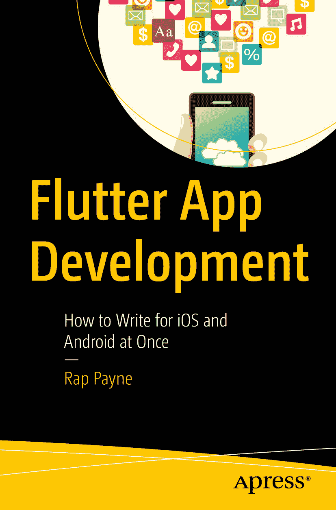

ISBN 979-8-8688-0484-7  
电子书 ISBN 979-8-8688-0485-4  
[`doi.org/10.1007/979-8-8688-0485-4`](https://doi.org/10.1007/979-8-8688-0485-4)

© Rap Payne 2024  
本作品受版权保护。所有权利均独家授权给出版商，涉及材料的全部或部分内容，具体包括翻译、重印、插图复用、朗诵、广播、以微缩胶片或任何其他物理形式复制，以及电子方式的信息传输或存储检索、电子改编、计算机软件，或当前已知或未来开发的类似或不同方法。在本出版物中使用通用描述性名称、注册商标、商标、服务标志等，即使未明确声明，也不意味着这些名称不受相关保护法律和法规的约束，因此可自由使用。出版商、作者和编辑假定本书中的建议和信息在出版之日是真实准确的。出版商、作者或编辑均不对材料内容或可能存在的任何错误或遗漏提供明示或暗示的保证。出版商对已出版地图中的管辖权主张及机构隶属关系保持中立。

本 Apress 印记由隶属于 Springer Nature 的注册公司 APress Media, LLC 出版。  
注册公司地址为：1 New York Plaza, New York, NY 10004, U.S.A.

*本书献给 Flutter 社区的各位同仁。我从未见过一个团体如此致力于帮助他人成功。你们是我的灵感和榜样。*

*特别感谢以下社区成员在 Flutter 问题上给予我的帮助。我这个得克萨斯人欠你们一份情！*

*Andrew “Red” Brogdon（俄亥俄州哥伦布市）、Brian Egan（蒙大拿州）、Frederik Schweiger（德国杜塞尔多夫）、Jeroen “Jay” Meijer（荷兰鹿特丹）、Jochum van der Ploeg（荷兰兹沃勒）、Martin Rybak（纽约）、Martin Jeret（爱沙尼亚）、Nash Ramdial（特立尼达）、Nilay Yenner（旧金山）、Norbert Kozsir（德国卡尔斯鲁厄）、Pooja Bhaumik（印度班加罗尔）、Randal Schwartz（俄勒冈州波特兰市）、Raouf Rahiche（经阿尔及利亚的卡萨布兰卡）、Remi Rousselet（巴黎）、Rohan Tanaja（柏林）和 Scott Stoll（俄亥俄州克利夫兰市）。*

*但尤其要感谢 Simon Lightfoot（伦敦），我们都称他为“Flutter 低语者”。我所了解的 Flutter 知识中，有很大一部分是他教给我的。*

## 前言

移动开发的世界已经发生了变化。为 iOS 和 Android 分别维护独立代码库的日子一去不复返。如今的开发者渴望效率、速度，以及用单一代码库触达更广泛受众的能力。这正是 Flutter 的闪光之处。

作为 Google 开发者专家，我亲眼见证了 Flutter 的变革性潜力。其优雅的架构，结合强大的 widget 库，让开发者能够以前所未有的速度创建美观且高性能的应用。热重载的魔力让实验变得轻而易举，大幅缩减了开发时间并加速了迭代过程。

但不要被 Flutter 的强大所迷惑——它也并非没有挑战。学习一门新语言并驾驭庞大的工具和库生态系统可能会令人望而生畏。而这正是本书的价值所在。

本书提供了 Flutter 的全面指南，带你从最基础的入门知识一直深入到状态管理和 API 集成等更高级的主题。本书精心编排，包含清晰的解释、实用的示例和动手练习，这将巩固你的理解，并赋能你构建出色的应用。

无论你是一位寻求拓展技能栈的经验丰富的开发者，还是一位渴望进入移动开发世界的好奇新手，本书都是你的完美伴侣。它是我朋友 Rap Payne 的奉献和专业知识的证明，我相信它将为你提供成为成功 Flutter 开发者所需的知识和信心。

那么，拥抱跨平台开发的未来，深入阅读这本宝贵资源的每一页吧。准备好用 Flutter 构建美观且高性能的应用！

Randal L. Schwartz  
2024 年 5 月

## 全球赞誉：*Flutter App Development: How to Write for iOS and Android at Once*

> “Rap 为 Flutter 多平台开发的新手撰写了一本出色的入门指南，内容丰富。”
> 
> —Frederik Schweiger（德国杜塞尔多夫），国际 Flutter 黑客马拉松组织者，Flutter School 创始人

> “一本很棒的书！它涵盖了一个初学者可能想知道的一切，甚至更多。它不仅解释了 Flutter 是什么，还解释了它为什么以这样的方式存在和工作。同时，它还就沿途常见的陷阱提供了极好的建议。强烈推荐。”
> 
> —Jeroen “Jay” Meijer（荷兰鹿特丹），Flutter Community GitHub 负责人

> “Rap 的书是一本很好的 Flutter 入门书籍。它涵盖了编写第一个应用所需的所有重要主题，同时也为更有经验的开发者提供了宝贵的信息。”
> 
> —Norbert Kozsir（德国卡尔斯鲁厄），Flutter Community 编辑

> “作为一名非英语母语者，我对这本书的简洁性以及我能毫不厌倦地阅读和理解这么多内容感到非常震撼。”
> 
> —Raouf Rahiche（阿尔及利亚），Flutter 演讲者、开发者与讲师

> “作为 Flutter 的早期采用者和 Flutter Community 的原始成员之一，Rap 是世界上最重要的 Flutter 权威之一。如果说文档是为工程师而写、由工程师所写，那么 Rap 则是一个（谢天谢地！）能用令人愉悦的风格写作并能被其他人类轻松理解的人。”
> 
> —Scott Stoll（俄亥俄州克利夫兰市），Flutter 代码库贡献者，Flutter Study Group 联合创始人

## 本书适合谁？

如果你是一位具有一定面向对象语言（如 Java、C#、C++ 或 Objective-C）开发经验的开发者，并且希望使用 Flutter 创建 Android 应用、iOS 应用或 Web 应用，那么本书适合你。如果你希望创建一个在多个平台上运行的应用，并且是 Flutter 新手，那么本书尤其重要。

如果你已经有一些 Flutter 经验，你无疑会学到新东西，但我们并不假设你具备任何 Flutter 的预备知识或经验。我们编写所有章节时，都假设 Flutter 中的一切对你来说都是全新的。

如果你了解任何关于 iOS 开发、Android 开发或 Web 开发的知识，那肯定有助于理解相关主题，因为其中有许多与 Flutter 的类比。你对这些了解得越多越好，尤其是 JavaScript 和 React。但即使你一无所知，也无需担心。它们绝不是必需的。

了解 Dart 语言也会有帮助。Dart 有一些独特但非常酷的特性，我们认为这些是最佳实践。我们本可以通过不使用这些最佳实践来“简化”代码，但从长远来看，这对你没有好处。相反，我们直接使用它们，但会在附录 A “Dart 语言概述”中解释这些内容。在那里，我们为你提供一份速查表，其中包含足够编写代码的细节，随后会对那些可能让其他语言开发者感到意外的特性进行更深入的说明。请特别注意名为“关于 Dart 的意外之处”的部分。

## 涵盖内容

本书将教你如何创建功能完备且特性丰富的应用程序，使其能够运行在 iOS、Android、桌面端和 Web 端。

1.  Hello Flutter – 欢迎来到 Flutter！我们会让你感受到为何选择它。Flutter 解决了哪些问题？为什么老板会选择 Flutter 而非其他解决方案。

2.  Flutter 开发 – Flutter 的工具集并非总是简单明了。我们会解释每个工具的用途及使用方法。本章将引导你完成编写-调试-测试-运行的流程，让你了解包括安装和维护在内的工具使用。

3.  万物皆 Widget – Widget 对 Flutter 至关重要，因为它们是每个 Flutter 应用的构建块。我们将展示其重要性，并提供创建 Widget 的动机和方法。主题包括组合、UI 即代码、Widget 类型、键值、无状态与有状态 Widget。

4.  值 Widget – 深入探讨承载值的 Widget，特别是用户输入字段。主题包括 `Text`、`Image` 和 `Icon` Widget，以及如何在 Flutter 中创建表单。

5.  响应手势 – 如何让你的程序响应用户操作，如点击、滑动、捏合等。我们将介绍按钮家族和 `GestureDetector` Widget。

6.  导航与路由 – 导航是指应用根据用户操作隐藏一个 Widget 并显示另一个，让用户感觉在不同场景间切换。我们将涵盖堆栈导航、标签导航和抽屉导航。

7.  状态管理 – 如何在 Widget 之间传递数据以及如何修改这些数据。我们将介绍如何创建 `StatefulWidgets` 并以最佳方式设计它们。

8.  状态管理库 – 概述多个库，并详细介绍一个超级简单的库——Raw State，以及最流行的库——Riverpod。

9.  使用 HTTP 进行 RESTful API 调用 – 如何从 HTTP API 服务器读取数据和向其写入数据。这里将展示如何发起 `GET`、`POST`、`PUT`、`DELETE` 和 `PATCH` 请求。

10. 使用主题美化样式 – 本章将解答所有必要问题，让实际应用外观美观且通过样式和主题保持一致性。

11. 布局你的 Widget – 作为最后部分的开始，本章介绍布局的概念、控制布局的步骤，并揭示 Flutter 的布局算法。

12. 布局 – Widget 定位 – 如何控制 Widget 并排或上下排列。

13. 布局 – 解决溢出 – 当试图绘制*超出*屏幕可容纳范围时的处理方法。

14. 布局 – 填充额外空间 – 当试图绘制*少于*可容纳范围时的处理方法。如何利用多余空间使其看起来美观？

15. 布局 – 微调定位 – 如何使用边框、内边距和外边距调整最后细节。如何制作非矩形形状。

16. 布局 – 特殊展示 Widget – 当简单布局无法满足需求时的 Widget——滑动列表、Stack、Card、Positioned 和 Table。

此外，我们还提供了五个附录。

1.  Dart 语言概述 – 一份易于查阅的 Dart 速查表，涵盖预期功能和令人惊喜的特性。

2.  Futures、Async 和 Await – 处理 Flutter 中的异步活动。

3.  在 Flutter 应用中引入包 – 如何查找并引入丰富的第三方、公开且免费的包。同时介绍如何编写和发布自己的包。

4.  如何处理文件 – 使用库、Futures、async 和 await。将文件捆绑到应用中。读写文件。JSON 序列化。

5.  如何调试布局 – 解读在 VS Code 和 Android Studio 可视化调试器中看到的内容。

## 未涵盖的内容及查找途径

同样重要的是，你应该了解本书不涵盖哪些内容。除了上述附录外，我们不会提供 Dart 编程语言入门。我们只是认为这并非对你时间的最佳利用，而是希望直接深入 Flutter。如果你后续觉得需要入门指导，请访问：[`https://dart.dev/guides/language/language-tour`](http://dart.dev/guides/language/language-tour)，接着是 [`https://dart.dev/tutorials`](http://dart.dev/tutorials)。我们选择不讨论如何部署到应用商店。商店本身已经很好地解释了如何提交应用。此外，流程变化频繁，因此你的最终参考资源应是商店本身。你可以在 [`https://developer.apple.com/ios/submit/`](http://developer.apple.com/ios/submit/) 和 [`https://play.google.com/apps/publish`](http://play.google.com/apps/publish) 找到说明。我们也不会涵盖某些高级主题，如 iOS 和 Android 的设备特定开发，或将 Flutter 添加到现有 iOS/Android 项目。这些及其他众多主题可以通过网络搜索找到。

序言

欢迎阅读《Flutter 应用开发：如何同时为 iOS 和 Android 编写代码》！如果你熟悉我之前的工作《Flutter 入门应用开发》，你可能会在这里那里发现一些熟悉的影子。这是因为本书在第一本的基础上扩展并更新了主题，融入了使其有价值的核心概念。

然而，请将此视为一次全新的旅程，进入不断发展的 Flutter 开发世界。自从我的第一本书出版以来，Flutter 已经取得了显著进步，提供了令人兴奋的新功能和改进的工作流程。本书反映了这些变化，对该框架进行了全面且最新的探索。

虽然某些部分可能包含熟悉的内容，但你会在这些页面中找到大量新材料。在第一本书中，我们试图用一章来涵盖布局。这是个重大错误。在本书中，我们将其扩展到*六*章。在第一本书中，我们讨论了状态管理库，但没有解释它们的工作原理。感谢 Remi Rousselet 的批评，我们将这些章节提前了许多，并编写了关于他的 Riverpod 库的使用指南。感谢迪士尼和美国国务院等客户，我扩展了现有概念，深入探讨了特定功能，引入了涵盖最新发展的全新章节，并重新调整了流程以使学习 Flutter 更加容易。

无论你是基于基础进行构建的中级 Flutter 开发者，还是开始第一个项目的新手，本书都旨在成为你可信赖的伙伴。我们将引导你掌握使用 Flutter 构建美观且高性能的 iOS 和 Android 应用的复杂性，为你提供在不断发展变化的环境中游刃有余的知识和技能。

所以，即使你以前走过这条路，也请准备好与《Flutter 应用开发：如何同时为 iOS 和 Android 编写代码》一起踏上新的冒险之旅！

拉普·佩恩
2024 年 9 月

关于作者 关于技术审阅者

