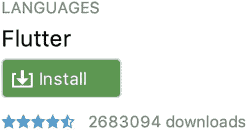
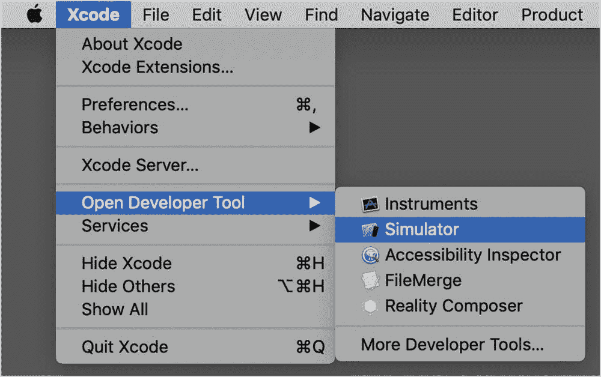
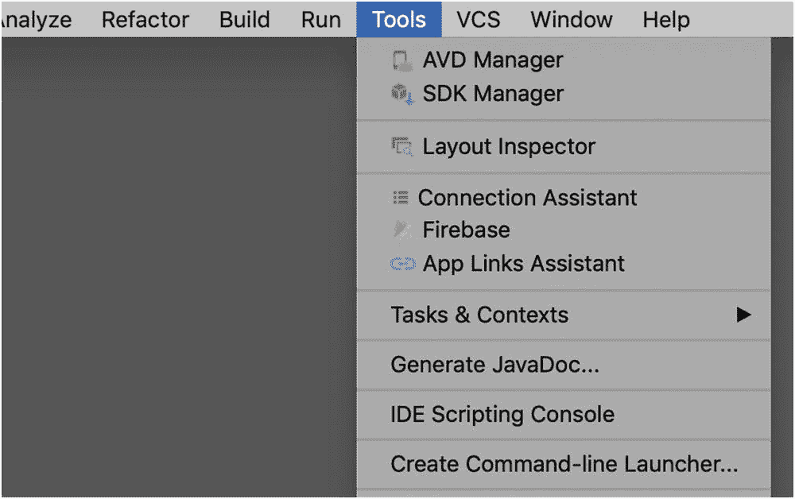
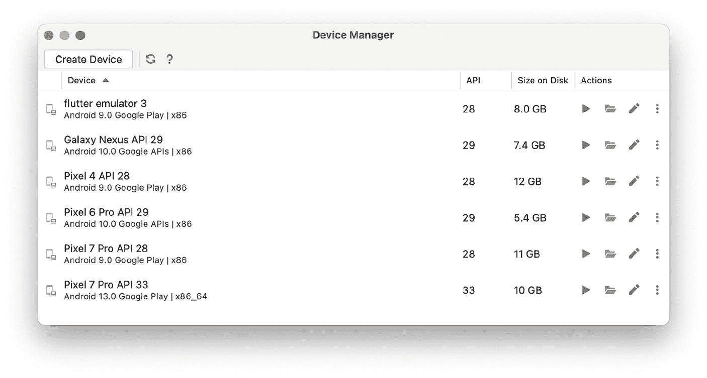
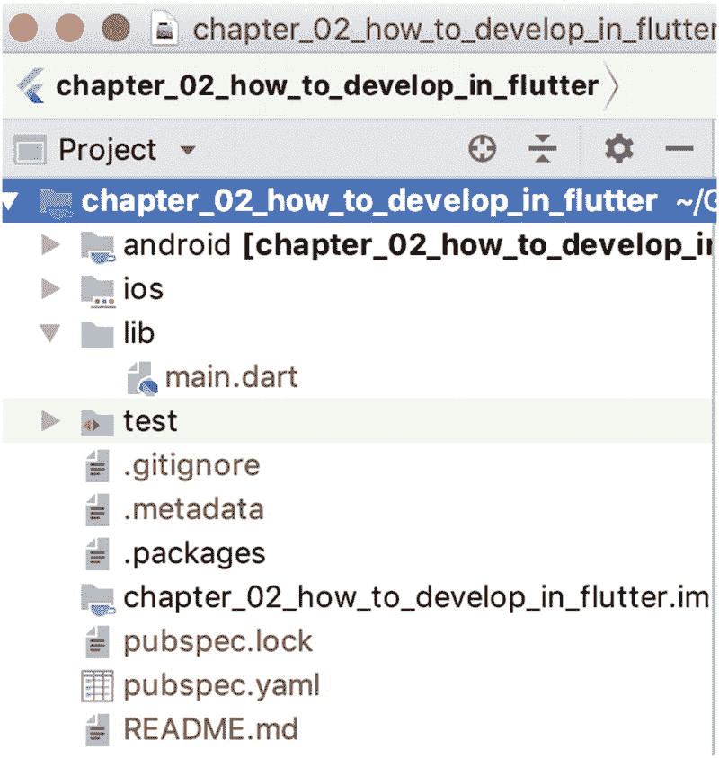

# 2. 使用 Flutter 进行开发

如上一章所述，Flutter 让我们能够创建在 Web、桌面电脑和移动设备上运行的应用程序（这确实是其主要吸引力所在）。但稍等片刻，我们究竟如何创建这些应用程序？应该使用哪种编辑器？Flutter 项目中需要什么？如何编译 Dart 源代码？我们是否需要其他工具来支持项目？如何将其部署到浏览器或设备上进行测试？都是好问题，对吧？

让我们在本章中解答这些问题以及更多内容。我们将涵盖两个重要主题：

1.  **所需工具** – 如何安装和维护 Flutter 工具链
2.  **开发流程** – 如何创建、运行和调试应用程序

> **注意**
>
> 就其性质而言，跨平台应用开发工具涉及来自各个组织的大量变动部件，而这些组织在做出更改前很少相互协商。并且，由于我们面对的是前沿且年轻的技术，变化频繁发生。在本章中，我们尽量坚持提供永恒不变的信息，但即便如此，信息最终也可能变得过时。请查阅这些工具的开发者以获取最新和最好的信息。

## Flutter 工具链

开发社区生产的有用工具不胜枚举，真可谓令人眼花缭乱。我们不打算涵盖所有工具。我们只想提供足够让你变得熟练，但又不会让你感到负担过重的信息。如果我跳过了你最喜欢的工具，还请见谅。

### Flutter SDK

Flutter SDK 是唯一必不可少的工具。它包含 Flutter 编译器、项目创建器、设备管理器、测试运行器以及用于诊断甚至修复 Flutter 配置问题的工具。

#### 安装 Flutter SDK

安装说明可在此处找到：[`https://flutter.dev/docs/get-started/install`](https://flutter.dev/docs/get-started/install)。简而言之——这将涉及下载最新的工具压缩包，并设置你的 `PATH` 环境变量指向你解压该压缩包的文件夹。具体的步骤因操作系统而异，但该网站上的说明非常清晰。

> **提示**
>
> 这一步看起来非常底层，而且听起来令人生畏，但完成这一步后，事情会变得更容易，也更不容易出错。不要让它使你气馁。

### 集成开发环境（IDE）

理论上来说，并不真正需要 IDE。可以使用任何编辑器编写 Flutter 代码，然后使用你之前安装的 Flutter SDK 进行编译和运行。但实际上，几乎没有人会这么做。他们为什么要这么做呢？以下 IDE 都内置了 Flutter 支持！

#### 来自微软的 VS Code

VS Code 来自微软。它的官方名称是“Microsoft Visual Studio Code”，但我们大多数人只是叫它 VS Code。无论你怎么称呼它，请不要将其与微软的另一款名为“Microsoft Visual Studio”的产品混淆。尽管名称相似，但它们不是同一回事。

你可以在此处获取 VS Code：[`https://code.visualstudio.com`](https://code.visualstudio.com)。

#### 来自 JetBrains 的 Android Studio/IntelliJ

Android Studio 和 IntelliJ 本质上是同一回事。它们基于相同的代码库构建，并具有相同的功能。

你可以在此处获取 Android Studio：[`https://developer.android.com/studio`](https://developer.android.com/studio)，此处获取 IntelliJ IDEA：[`www.jetbrains.com/idea/download`](http://www.jetbrains.com/idea/download)。

#### 我应该使用哪个 IDE？

VS Code 和 Android Studio/IntelliJ 都是免费且开源的。它们都跨平台运行于 Windows、Mac 和 Linux 上。两者在 Flutter 开发者中的受欢迎程度大致相当^(³)，彼此之间都没有明显的市场优势。选择哪一个都不会错。

但如果你必须选一个，我们发现你的背景可能会影响你对工具的喜好。来自 Web 开发领域、使用诸如 HTML、CSS、JavaScript、NodeJS、React、Angular 或 Vue 等技术栈的开发者，强烈倾向于 VS Code。另一方面，来自 Java 世界的开发者，尤其是 Android 开发者，似乎更倾向于 Android Studio/IntelliJ。

好消息是，这是一个压力很小的选择。切换编辑器非常容易——即使在处理特定项目时也是如此。从其中一个开始，看看你是否喜欢它。如果不喜欢，你可以试用另一个一段时间。来回切换几次，直到你有了强烈的偏好。切换真的不是什么大问题。

### IDE 开发工具

虽然这些 IDE 很棒，但它们并非专为 Flutter 构建；它们也用于其他语言和框架的开发。因此，为了改善 Flutter 的开发流程，我们应该安装 Flutter DevTools。它增加了调试器支持，让你可以查看日志，与模拟器无缝连接，以及提供一些其他功能。

安装 DevTools 是在每个 IDE *内部*完成的。在 Android Studio/IntelliJ 中，从主菜单进入“偏好设置 ➤ 插件”（图 2-1）。在 VS Code 中，进入“视图 ➤ 扩展”（图 2-2）。Flutter DevTools 被简称为“Flutter”，搜索一下就能找到。在任一平台上，点击绿色的“安装”按钮。



**图 2-1** 在 Android Studio 中安装 DevTools


**图 2-2** 在 VS Code 中安装 DevTools

安装后，你可能需要重启 IDE。

### 模拟器

一旦你安装好了 IDE 和 DevTools，就可以编译你的应用了。要运行它，让我们将它部署到设备上。模拟器——一种在你的笔记本电脑/台式机上运行的虚拟设备——使得运行、测试、调试和展示你的应用变得非常容易。你可能希望在 iOS 和 Android 上都进行测试，因此你需要两者的模拟器。有几种可用的模拟器，但我只提两个，Xcode 的 iOS 模拟器和 AVD 的 Android 模拟器。

#### iOS 模拟器

如果你没有 Mac 电脑，你就无法运行 iOS 模拟器，甚至无法为 iOS 进行编译。^(⁴) 但如果你有 Mac 并且安装了 Xcode，那么你很幸运；你已经拥有了 iOS 模拟器。要运行它，打开 Xcode，然后转到 **Xcode ➤ 打开开发者工具 ➤ 模拟器**（图 2-3）。模拟器将启动，在其中，你可以选择任何 iOS 设备，包括 iPhone 和 iPad。



**图 2-3** 从 Xcode 打开 iOS 模拟器

#### Android 模拟器

就像有大量的 Android 机型一样，也有大量的 Android 模拟器，但与它们交互只有一种流行方式：AVD（Android 虚拟设备）管理器。AVD 管理器可以在 Android Studio 的 **工具** 菜单下找到（图 2-4）。



**图 2-4** 在 Android Studio 中查找 AVD 管理器

打开后，你将看到当前已安装的模拟器列表。一开始应该是空的。通过点击顶部的“创建设备”按钮（图 2-5），你可以安装数百种可用的 Android 设备模拟器中的一个或多个。



**图 2-5** AVD 管理器显示可用设备列表。点击“创建设备”以添加更多

点击它，你可以从各种设备中选择，或者创建你自己的设备。你只需安装一个设备一次。安装完成后，该模拟设备就可从任何 IDE 中使用，无论是 IntelliJ/Android Studio 还是 VS Code。无需在 VS Code 上进行单独设置。


### 保持工具更新

早期，使用 `Xamarin` 和 `React Native` 这类工具进行跨平台开发极其困难，原因在于涉及的工具数量庞大且相互依赖。那段痛苦的经历至今让我心有余悸。

但由于 `Flutter` 面世较晚，它能够借鉴前人的教训。`Flutter` 团队意识到了这些痛点，为我们提供了一项创新工具来管理其余的工具链。它会检查你的开发机，寻找开发 `Flutter` 应用所需的所有工具、你当前安装的版本、可用的版本以及它们之间的依赖关系，然后对问题进行诊断。它甚至能针对这些问题给出解决方案。“检查、诊断并开药方？”听起来像是医生，对吧？那么，让我来介绍 `flutter doctor`！

#### Flutter doctor

你可以在命令行中运行 `flutter doctor`。它会检查工具链中的所有工具，并报告遇到的任何问题。下面是一个 `Xcode` 需要处理的示例：

```
$ flutter doctor
Doctor summary (to see all details, run flutter doctor -v):
Flutter (Channel beta, vX.Y.Z, on Mac OS X X.Y.Z, locale en-US)
Android toolchain - develop for Android devices (SDK version X.Y.Z)
Xcode - develop for iOS and macOS (Xcode X.Y)
Xcode requires additional components to be installed in
order to run.
Launch Xcode and install additional required components
when prompted.
Android Studio (version X.Y)
VS Code (version X.Y.Z)
Connected device
No devices available
Doctor found issues in 2 categories.
$
```

“No devices available”这个错误很常见，通常可以忽略。它仅仅表示此刻没有模拟器在运行。

以下是我们更希望看到的结果——一切检查通过：

```
$ flutter doctor
Doctor summary (to see all details, run flutter doctor -v):
Flutter (Channel beta, vX.Y.Z, on Mac OS X X.Y.Z, locale en-US)
Android toolchain - develop for Android devices (SDK version X.Y.Z)
Xcode - develop for iOS and macOS (Xcode X.Y)
Android Studio (version X.Y)
VS Code (version X.Y.Z)
Connected device (1 available)
• No issues found!
```

`flutter doctor` 不仅能检测并报告问题，通常还会针对每个问题给出修复方案。它甚至会在需要升级自身时，通过 `flutter upgrade` 命令提示你。

#### Flutter Upgrade

没错，首次安装 `Flutter` SDK 时可能会有些令人望而生畏，但升级过程却轻而易举。你只需输入两个单词：`flutter upgrade`：

```
$ flutter upgrade
Upgrading Flutter from /usr/local/bin/flutter...
From https://github.com/flutter/flutter
2d2a1ff..a72edc2  beta       -> origin/beta
3932ffb..cc3ca9a  dev        -> origin/dev
5a3a46a..a085635  master     -> origin/master
* [new branch]      refactor   -> origin/refactor

* [new tag]         vX.A.B    -> vX.Y.Z
Updating c382b8e..a72edc2
11 files changed, 413 insertions(+), 302 deletions(-)
Building flutter tool...
Upgrading engine...
Downloading ios-deploy...                                 0.3s
Flutter X.Y.Z • channel beta • https://github.com/flutter/flutter.git
Framework • revision a72e06 (23 hours ago) • 20XX-YY-ZZ 15:41:01 -0700
Engine • revision b863200c37
Tools • Dart X.Y.Z
Running flutter doctor...
Doctor summary (to see all details, run flutter doctor -v):
Flutter (Channel beta, vX.Y.Z, on Mac OS X X.Y.Z, locale en-US)
Android toolchain - develop for Android devices (SDK version X.Y.Z)
Xcode - develop for iOS and macOS (Xcode X.Y)
Android Studio (version X.Y)
VS Code (version X.Y.Z)
Connected device (1 available)
• No issues found!
```

请注意，`flutter doctor` 作为最后一步自动运行，以确认一切正常。升级简直是小菜一碟。

## Flutter 开发流程

现在我们已经安装并更新了所有工具，接下来让我们创建一个应用并通过调试器运行它。

### 搭建应用和文件架构

通过运行以下命令创建一个全新的 `Flutter` 应用……

```
$ flutter create my_app
```

这将在当前文件夹下创建一个名为 `my_app` 的子文件夹。其中将包含大量可直接运行的 `Dart` 代码。

提示

应用名称不区分大小写，因此建议全部使用小写。连字符是非法的字符，所以不能使用烤串命名法。推荐的命名方式是 `小写字母加下划线`。

### Flutter 项目结构剖析

了解你刚刚创建的项目中所有文件和文件夹并非至关重要。但如果你好奇，我们可以快速浏览一下图 2-6 所示的新创建的 `Flutter` 项目结构。



图 2-6

由 `flutter create` 生成的一个崭新的 `Flutter` 项目

你将看到以下这些文件夹：

*   `android`, `ios`, `web`, `linux`, `windows`, `macos` – 这些是项目中平台相关的部分。除非你需要让应用在不同平台上有不同表现，否则通常无需修改它们。

*   `lib` – 这是你所有 `Dart` 源代码的存放位置。你将在此构建应用的层级结构。这里将占据你绝大部分的时间和精力。

*   `test` – 如果你有单元测试（最终你很可能需要它们），请放在这里。

你还会看到以下这些文件：

*   `pubspec.yaml` – 这本质上是 `Dart` 项目的项目文件。我们可以在这里设置项目名称、描述、依赖项等。请务必阅读其中的注释，以便更好地了解建议和可能的配置。

*   `.gitignore` 和 `README.md` – 对于使用 `Git` 和 `GitHub` 作为源代码仓库的开发者来说，这些文件非常熟悉。其他人则无需关注。

*   `analysis_options.yaml` – 项目的代码检查规则和配置。它指示 `IDE` 如何在编写不规范的代码时发出警告。如果规则过于严苛，你想关闭某些规则，只需删除相应行或用注释符号将其注释掉即可。所有代码检查规则的说明可在此处找到：[`http://dart-lang.github.io/linter/lints/`](http://dart-lang.github.io/linter/lints/)。


## 运行你的应用

现在你已经创建了一个 Flutter 应用，让我们来运行它。有多种方式可以运行你的应用。最常用的方法是点击 Android Studio/IntelliJ 或 VS Code 中的绿色“播放”按钮（图 2-7）。你可以通过设置断点并使用开发者工具单步执行代码来调试应用（图 2-8）。

图 2-8  
VS Code 中的播放按钮位于左上角

图 2-7  
Android Studio 中的播放和调试按钮位于顶部

显然，你需要在某种设备上运行你的应用。有几种选择：用于 Web 应用的 Chrome 浏览器、模拟器，或者通过数据线连接到开发机的物理设备。当你点击播放/调试按钮时，你可以选择当前要运行的设备。请注意，在前面的 Android Studio 截图中，有一个下拉菜单列出了可用的设备。在 VS Code 中，点击播放按钮，会立即弹出一个菜单供你选择。无论使用哪种 IDE，都由你掌控。

> **提示**  
> 你可以通过从命令行运行 `flutter devices` 来检查当前可用的设备。

```
$ flutter devices
3 connected devices:
Vivo XL3   • 55S...KF • android-arm64 • Android 8.0.0 (API 26)
Android SDK • emul...4 • android-x86   • Android 9 (API 28)
iPhone X    • E6...39A • ios • com.apple...OS-12-1 (simulator)
```

上面的示例输出告诉我们有三台设备。第一台和第二台是 Android 设备，第三台运行的是 iOS。第一台设备是连接线连接的物理设备，第二台和第三台是模拟器。

请注意，此命令与 `flutter emulators` 命令不同，后者会告诉你所有*可能*选择的模拟器。而 `flutter devices` 命令会告诉你哪些设备是*当前*可用于运行你的应用的。

### 作为 Web 应用运行

这是最简单的选择。当你作为 Web 应用运行时，Flutter 会将你的浏览器视为一个设备。因此，作为 Web 应用运行所需的全部操作就是启用 Google Chrome 浏览器作为设备。当你获得运行应用的可选设备列表时，“Chrome”会出现在其中。只需选择在 Chrome 中运行你的应用，IDE 就会在其中加载你的 Web 应用。

## 在连接线的设备上运行

有时你需要在物理设备上运行你的应用。例如，我正在开发一个涉及通过蓝牙连接到物理打印机打印标签的项目。模拟器无法通过蓝牙配对。为了测试打印功能，我需要一个已经与我的蓝牙打印机配对的真实物理设备。

要将物理设备连接到你的开发机，你需要使用物理数据线。

> **提示**  
> #1 连接 Android 设备时，它最初会认为你正在尝试充电或传输照片。要让设备知道你正在尝试调试，请打开设备上的“开发者选项”屏幕，并选择“启用 USB 调试”。  
> #2 许多连接问题可能是由劣质数据线引起的。与直觉相反，并非所有数据线都一样。如果在更改设置后仍然无法连接，请换用质量更高的数据线。

#### 热重载

初始编译可能会有点慢。但是一旦应用在你的模拟器/浏览器/物理设备或其他设备上运行，你就可以对源代码进行修改并重新运行。这里有一个非常酷的特性：每次你保存对源代码的更改，它都会被重新编译，并且新版本会立即加载。你的应用会从你离开的地方继续运行——在相同的位置，具有相同的状态和相同的数据。我们称之为“热重载”，它使开发周期变得异常快速且无摩擦。

#### 调试

两种 IDE 都拥有你在所有 IDE 中已经习惯的基本调试工具。当你启动项目运行时，调试工具将会出现。

在 Android Studio 中，调试窗口会打开，通常位于 IDE 底部。它有一个小工具栏，如图 2-9 所示。

图 2-9  
Android Studio 中的调试工具栏  

从左到右的选项分别是“单步跳过”、“单步进入”、“强制单步进入”和“单步跳出”。

在 VS Code 中，工具栏会浮动显示在你的源代码上方（图 2-10）。

图 2-10  
VS Code 中的调试工具栏  

其选项包括“播放/暂停”、“单步跳过”、“单步进入”、“单步跳出”、“热重载”、“重启”和“停止调试”。

> **注意**  
> Flutter 在调试时比在实际设备上运行时更挑剔。这是一件好事，因为在调试过程中，它会明确显示某些你本应修复但不一定是致命的错误。在发布版本中，它会忽略这些相同的错误，并（希望如此）允许我们的用户继续运行我们的应用。

其中一类错误是“运行时断言”。当你调试器给出如下错误时，你就会知道正在处理这类问题：

```
════════ Exception caught by gesture ════════
The following assertion was thrown while handling a gesture:
setState() callback argument returned a Future.
The setState() method on _FooState#236 was called with a closure or method that returned a Future. Maybe it is marked as "async".
等等，等等，等等。
```

你要记住的是：当你看到这类问题时，请修复它。这是正确的做法。但如果在部署后发现同样的问题，请不要感到困惑。

## 结论

我知道，这些内容很多，需要吸收。跨平台开发的本质使得工具链变得棘手。但最困难的部分已经过去了。一旦你安装了 Flutter SDK 和 IDE（VS Code/Android Studio/IntelliJ IDEA），你就拥有了真正需要的一切。当然，DevTools 和一两个模拟器确实会很有帮助。剩下的就是多多练习。你会变得非常出色！

那么，既然我们已经了解了 Flutter 工具链，让我们开始创建小部件吧！

---

脚注 1 2


