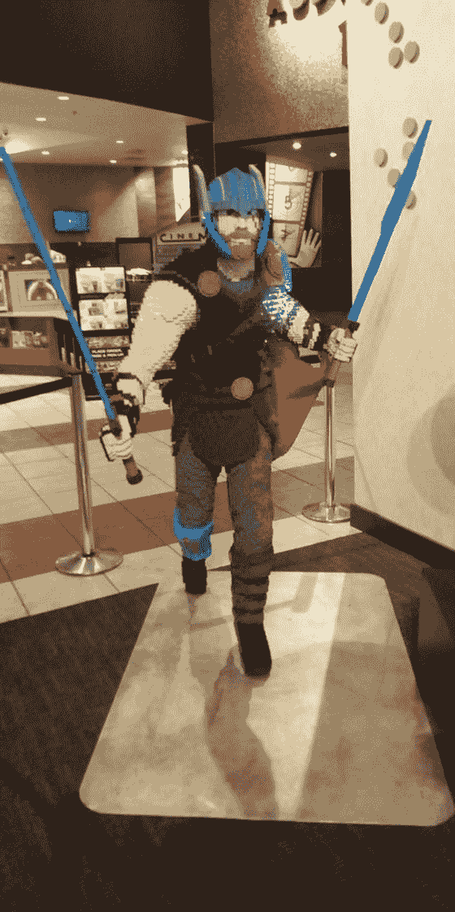
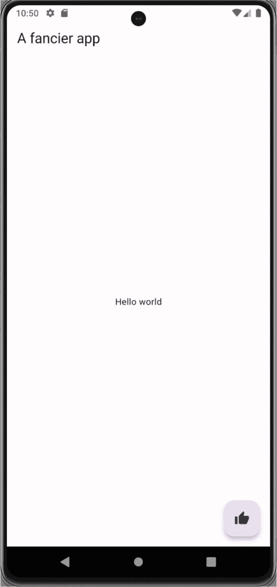
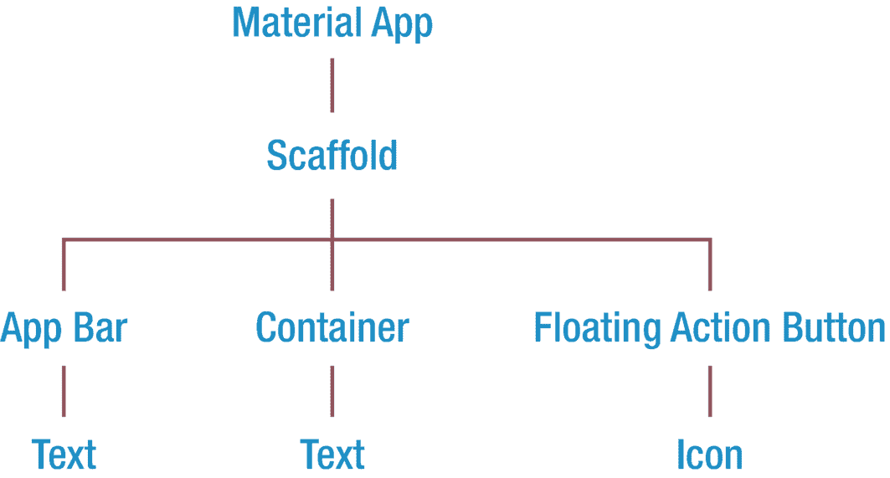

# 3. 万物皆组件

假设你是一个极具天赋的乐高迷，并且获得了令人垂涎的乐高大师建造师职位之一。恭喜！我们再假设你的第一个任务是用 26,000 块乐高积木建造一个六英尺高的雷神托尔（图 3-1）。



***图 3-1***
*乐高版托尔。作者曾在一家电影院拍下这张照片*

你会怎么做？想一想。别急，我们等着。

你会直接抓起积木然后拼在一起吗？可能不会。你会先铺好托尔的脚底，然后从下往上搭建吗？也不会。我猜你的常识性策略是这样的：

1.  对你建造的东西有个整体构想，先想清楚全貌。
2.  意识到整个项目太复杂，无法一蹴而就。
3.  将项目分解成各个部分（腿、左臂、右臂、躯干、左手剑、右手剑、头盔、披风、头部）。
4.  意识到每个部分仍然过于复杂。
5.  对于每个部分，再将其分解成子部分。
6.  重复步骤 4 和 5，直到得到足够简单的组件，使得你和你的队友都能轻松理解、构建和维护。
7.  创建每个简单的组件。
8.  将简单组件组合成更大、更复杂的组件。
9.  重复步骤 7 和 8，直到完成整个项目。

这个过程有一个名字，叫做*组件化*，这正是我们在 Flutter 应用中要遵循的思考过程。

组件化并非什么新鲜事物。实际上，它早在 1968 年就被提出了。^(⁵) 但得益于 Angular、React、Vue、Svelte、SolidJS 以及原生 Web 组件等 Web 框架，这项技术近年来才迅速流行起来。如今，似乎所有酷孩子都在做软件组件。将复杂部分递归分解为更简单部分的想法称为*分解*。而将编写好的部分重新组合成更大组件的行为称为*组合*。

在 Flutter 的世界里，这些组件被称为*widget*。Flutter 社区的人喜欢说“万物皆 widget”，这意味着你和我都会使用 Flutter 自带的內建 widget。我们会将它们组合在一起来创建自定义 widget。然后，我们的自定义 widget 会再被组合，创建出越来越复杂的自定义 widget。这个过程一直持续，直到你构建出一个完整的应用。

每个应用都可以从两个方面来考虑：

1.  **行为** – 软件的功能。所有的业务逻辑都在这里：数据读取、写入和处理。
2.  **呈现** – 软件的外观。用户界面。如按钮、文本框和标签。

而 Flutter 将这两者融合在了一种语言中，而不是两种。

## 界面即代码

其他开发框架已经证明了组件化是正确的发展方向。Flutter 团队公开表示，他们深受基于组件化的 React^(⁶)的启发。事实上，所有框架的创造者似乎都在相互借鉴。但 Flutter 在用户界面表达方式上是独一无二的。开发者使用同一种 Dart 语言来同时描述应用的图形用户界面和行为（表 3-1）。我们称之为“UI as code（界面即代码）”。

***表 3-1***
*只有 Flutter 使用同一种语言来处理呈现和行为*

| 框架 | 行为用…表达 | 界面用…表达 |
| --- | --- | --- |
| Maui | C# | XAML |
| React Native | JavaScript | JSX |
| NativeScript | JavaScript | XML |
| Flutter | Dart | Dart |

那么，这个界面是如何创建的呢？像许多其他框架和语言一样，Flutter 应用从一个`main`函数开始。在 Flutter 中，`main`会调用一个名为`runApp()`的函数。这个`runApp()`接收一个 widget，即根 widget，它可以被任意命名，但它必须是一个继承了 Flutter `StatefulWidget`/`StatelessWidget`的类。它看起来像这样：

```
// 导入所有 Flutter 应用所需的 Dart 包
import 'package:flutter/material.dart';
// 这里是 main 调用 runApp
void main() => runApp(RootWidget());
// 这是你的根 widget
class RootWidget extends StatelessWidget {
@override
Widget build(BuildContext context) {
return Text("Hello world");
}
}
```

这就是在 Flutter 中创建一个“Hello world”所需的全部代码。

但是等等……这个`Text()`是什么东西？它是一个內建的 Flutter widget。由于这些內建 widget 非常重要，我们需要仔细看看它们。

## 內建 Flutter Widget

Flutter 的基础 widget 是我们构建一切事物的基石，而且数量众多——上次统计有超过 1300 个。^(⁷) 这对于你我来说需要了解的数量相当大。但是，如果你在脑海中将它们进行分类整理，就会容易管理得多。

它们大致可分为以下几类：

*   数值型 widget
*   布局型 widget
*   导航型 widget
*   其他 widget

> **注意**
> 这些并非 Flutter 官方分类列表。其 15 个官方分类列在此处：[`https://flutter.dev/docs/development/ui/widgets`](https://flutter.dev/docs/development/ui/widgets)。我们只是觉得重新组织一下有助于理清思路。

我们将通过一两个例子快速浏览每个类别，然后在后续章节中进行深入探讨。让我们从数值型 widget 开始。

### 数值型 Widget

某些 widget 持有数值，这些数值可能来自本地存储、互联网服务或用户本身。它们用于向用户显示数值，以及从用户那里获取数值进入应用。典型的例子是`Text` widget，它用于显示一小段文本。另一个是`Image` widget，用于显示 `.jpg`、`.png` 或其他图片。

以下是更多数值型 widget：

| AlertDialog Badge Checkbox Chip CircularProgressIndicator Date & Time Pickers DataTable DropdownButton ElevatedButton FlatButton | FloatingActionButton FlutterLogo Form FormField Icon IconButton Image LinearProgressIndicator Menu PopupMenuButton Radio | RawImage RefreshIndicator RichText SegmentedButton Slider SnackBar Switch Text TextField Tooltip |

我们将在下一章更详细地探索数值型 widget。

### 布局型 Widget

布局型 widget 赋予我们大量控制能力，使场景能够正确布局——使用`Row` widget 将 widget 并排放置，或使用`Column` widget 上下堆叠；使用`SingleChildScrollView`使它们可滚动，使用`Wrap`使其自动换行，使用`Padding`确定 widget 周围的空间以避免拥挤感，等等：

| Align AppBar AspectRatio BottomAppBar BottomSheet Card Center Column ConstrainedBox Container Divider Expanded ExpansionPanel FittedBox | Flow FractionallySizedBox GridView IntrinsicHeight IntrinsicWidth LayoutBuilder LimitedBox ListTile ListView MediaQuery NestedScrollView OverflowBox Padding PageView | Placeholder Row Scaffold Scrollable Scrollbar SingleChildScrollView SizedBox SizedOverflowBox Slivers* SnackBar Stack Table Transform Wrap |

这是一个庞大的主题，我们将在本书的最后六章进行介绍。

### 导航型 Widget

当你的应用有多个场景（“屏幕”、“页面”，随便你怎么称呼）时，你需要某种方式在它们之间切换。导航型 widget 就派上用场了。它们将控制用户如何看到一个场景，然后移动到下一个。通常，当用户点击按钮时会发生这种切换。有时，导航按钮位于标签栏或从屏幕左侧滑入的抽屉中。以下是一些导航型 widget：

| AlertDialog Drawer MaterialApp NavigationBar | NavigationDrawer NavigationRail Navigator | SimpleDialog TabBar TabBarView |

我们将在第六章“导航与路由”中学习它们的工作原理。


### 其他小组件

当然，并非所有小组件都能归入这些整齐的类别。让我们把其余部分归为一个杂项类别。以下是一些杂项组件：

| `ClipPath` `Cupertino` `Dismissible` | `FutureBuilder` `GestureDetector` `Semantics` | `StreamBuilder` `Theme` `Transitions` |

本书会在各章节中自然而然地介绍这些杂项组件中的许多内容。`GestureDetector` 和 `Dismissible` 出现在第 5 章“响应手势”中。`Theme` 在第 10 章“使用主题进行样式设计”中介绍。`FutureBuilder` 和 `StreamBuilder` 在第 9 章“使用 HTTP 进行 RESTful API 调用”中介绍。

### 如何创建你自己的无状态组件

我们知道，我们将组合这些内置组件来形成我们自己的自定义组件，然后这些自定义组件再与其他内置组件组合，最终形成一个应用。

组件设计得非常巧妙，因为每个组件都易于理解，因此也易于维护。组件从外部看是抽象的，而在内部则是逻辑清晰且可预测的。它们用起来令人愉悦。

每个组件都是一个类，可以拥有属性和方法。每个组件都可以有一个包含零个或多个参数的构造函数。最重要的是，每个组件都有一个 `build` 方法，该方法接收一个 `BuildContext`^(⁸) 并返回一个单一的 Flutter 组件。

**提示**

如果你曾好奇某个组件的外观是如何形成的，请找到它的 `build` 方法。

```
class RootWidget extends StatelessWidget {
@override
Widget build(BuildContext context) {
return Text('Hello world');
}
}
```

在这个我们本章前面重复过的 hello world 示例中，我们展示了一个 `Text` 组件（图 3-2）。一个单独的内部组件是可以工作的，但现实世界的应用会复杂得多。根组件可以由许多其他子组件组成：



**图 3-2** 这个简单组件创建的应用

```
class FancyHelloWidget extends StatelessWidget {
Widget build(BuildContext context) {
return MaterialApp(
home: Scaffold(
appBar: AppBar(
title: Text("一个更花哨的应用"),
),
body: Container(
alignment: Alignment.center,
child: Text("Hello world"),
),
floatingActionButton: FloatingActionButton(
child: Icon(Icons.thumb_up),
onPressed: () => {},
),
),
);
}
}
```

所以正如你所见，`build` 方法返回一个单一的组件 `MaterialApp`，但它包含一个 `Scaffold`，其中又包含三个子组件：一个 `AppBar`、一个 `Container` 和一个 `FloatingActionButton`（图 3-3）。这些组件中的每一个又分别包含它们自己的子子组件。



**图 3-3** 上面示例应用中的组件树

这就是你的 `build` 方法始终的工作方式。它将返回一个单一的、庞大的、嵌套的表达式。正是组件内部的组件内部的组件，使你能够创建自己精心设计的自定义组件。

### 组件拥有键

让我们暂时谈谈 Flutter 的架构。如果 Flutter 在每次做出微小更改时都尝试重新渲染整个屏幕，那将会很慢。相反，Flutter 将状态更改应用到屏幕的内存副本上，这个副本被称为元素树。这非常快，因为它们实际上并没有绘制在屏幕上。绘制工作保留给了“渲染树”。

嗯，这种结构的美妙之处在于——当渲染树被绘制时，它会重用所有自上次渲染以来*没有*改变的组件。只有那些需要重新渲染的组件才会被重新渲染。但 Flutter 是如何知道的呢？它使用了键。

每个组件都有一个唯一的键。它会自动获得一个键，但如果你愿意，也可以手动分配键。当一个组件需要重绘时，它会在内存中被重新创建并获得一个新键。Flutter 假定任何类型和键都没有改变的组件都可以保持不变。

但偶尔，Flutter 在匹配元素树中的组件时也会出错。如果你的组件被绘制到了错误的位置、屏幕上的数据没有更新，或者滚动位置没有保留，你就会知道需要手动分配键了。

通常你不需要担心键的问题。它们很少被需要，以至于如果你能理解以下几点，我们就很满意了……

1.  键是存在的，以及为什么 Flutter 可能需要它们。
2.  当你的组件没有按预期重绘时，键可能可以解决问题。
3.  你有机会为组件分配键。

如果这对你来说还不够，那么伟大的 Emily Fortuna 已经录制了一个关于键的超级 10 分钟视频。^(⁹)

### 向组件传递值

你知道这个公式是什么意思吗？

*y = f(x)*

数学专业的人会认出这读作“*y* 是 *x* 的函数”。它简洁地传达了当 *x*（自变量）变化时，*y*（因变量）将以可预测的方式变化。Flutter 依赖于这个理念，但在 Flutter 中，这个公式读作：

*场景 = f(数据)*

换句话说，随着你应用中数据的变化，屏幕也会相应变化。而你，作为开发者，可以在编写组件的 `build` 方法时决定如何呈现这些数据。这是 Flutter 的一个基本概念。

那么数据可能如何变化呢？有两种方式：

1.  组件可以使用从外部传入的新数据进行重新渲染。
2.  数据可以在某些组件*内部*维护。

让我们谈谈第一种方式。要将数据传入组件，你可以将其作为构造函数参数发送：

```
Widget build(BuildContext context) {
return Person(firstName: "Sarah", lastName: "Ali");
}
```

下面是你如何编写组件来接收这个值：

```
class Person extends StatelessWidget {
final String firstName;
final String lastName;
Person({this.firstName = "", this.lastName = ""}) {}
@override
Widget build(BuildContext context) {
return Text('$firstName $lastName');
}
}
```

我们将名字和姓氏传递给了组件。编写 Dart 构造函数还有别的方法。请查看附录 A“Dart 语言概述”或 Dart 参考文档来了解它们。

**提示**

请注意，在前面的示例中，我们使用了一个 `Person` 类，该类可能是在你使用它的同一个 dart 文件中定义的。但更好的做法是，在每个单独的 dart 文件中创建类，并将其导入到使用它的其他 dart 文件中。

`import 'Person.dart';`

### 无*状态*组件和*有*状态组件

到目前为止，我们一直在刻意创建无状态组件。所以你可能已经猜到还有一种有状态组件。你猜对了。无*状态*组件是不维护自身状态的组件。有*状态*组件则维护自身状态。

在此上下文中，“状态”指的是组件内在其生命周期中可以更改的数据。想想我们之前的 `Person` 组件。如果它只是一个显示人员信息的组件，那么它应该是无状态的。但如果它是一个人员**维护**组件，我们允许用户通过在 `TextField` 中输入数据来更改信息，那么我们就需要一个 `StatefulWidget`。

后面有一整章是关于有状态组件的。如果你等不及想了解更多关于它们的信息，可以阅读本书后面的第 7 章“管理状态”。然后再回到这里。


### 那么我该创建哪种 Widget？

简而言之，创建无状态 widget。除非万不得已，永远不要使用有状态 widget。假设你创建的所有 widget 都是无状态的，并以此为基础开始开发。当你确信确实需要状态时，再将它们重构为有状态 widget。但要认识到，状态其实比开发者想象的更容易避免。尽可能避免状态的使用，这能让 widget 更简单，从而更易于编写、维护和扩展。你的团队成员会因此感谢你。

> **注意**  
> 实际上还有第三种 widget，即 `InheritedWidget`。你可以在 `InheritedWidget` 中设置一个值，任何后代 widget 都可以沿 widget 树向上追溯，直接请求该数据。你可以在第 8 章“状态管理库”中了解更多信息，或者在此处观看关于 `InheritedWidget` 的简明概述：[`http://bit.ly/inheritedWidget`](http://bit.ly/inheritedWidget)。

## 总结

现在我们知道了 Flutter 应用的核心就是 widget。你将组合自定义的无状态或有状态 widget，它们包含一个 `build` 方法，该方法会渲染出一棵由 Flutter 内置 widget 组成的树。因此，我们显然需要了解这些内置的 Flutter widget，我们将在下一章开始学习它们。

脚注 1   2   3   4   5

