# 4. 数值型 Widget

在上一章我们了解到，*万物皆 widget。* 你创建的所有东西都是 widget，Flutter 提供给我们的所有东西也都是 widget。当然，也存在例外，但这样思考并无坏处，尤其是在你刚入门 Flutter 的时候。在本章中，我们将深入探讨 Flutter 提供的最基础的一组 widget——那些承载数值的 widget。我们将介绍 `Text` widget、`Icon` widget 和 `Image` widget，它们所显示的内容正如其名。我们还会简单了解 `SnackBar` widget。然后，我们将深入讲解输入型 widget——那些设计用来获取用户输入的 widget。

## Text Widget

如果你想在屏幕上显示一个字符串，`Text` widget 就是你需要的工具。它接收一个字符串作为输入（即你想要显示的文本），并将其显示在屏幕上。默认情况下，所有文本都在一行内显示，但如果容器宽度不够，它会自动换行到多行。

```
Widget build(BuildContext context) {
  String str = 'Hello world';
  return Text(str);
}
```

> **提示**  
> 如果你的 `Text` 内容是字面量，在其前面加上 `const` 关键字，该 widget 将在编译时而非运行时创建。你的 `apk/ipa` 文件会略微增大，但它们能在设备上运行得更快。这点付出是值得的。

你可以通过 `style` 属性控制 `Text` 的大小、字体、粗细、颜色等。但我们将在第 10 章“使用主题进行样式设计”中介绍这部分内容。

`Text()` 能满足大部分单一风格文本的需求。但如果文本的不同部分需要不同的样式呢？这时就需要用到 `RichText`。它允许你在同一个文本 widget 内，使用 `TextSpan` 对象混合搭配不同的样式。

## Icon Widget

Flutter 内置了大量图标（图 4-1），从相机、人物、卡片、交通工具、箭头、电池到 Android/iOS 设备，应有尽有。完整列表可以在这里找到：[`https://api.flutter.dev/flutter/material/Icons-class.html`](https://api.flutter.dev/flutter/material/Icons-class.html)，但该页面不太容易搜索。这里有一个可以按名称搜索的网站：[`https://fonts.google.com/icons`](https://fonts.google.com/icons)。

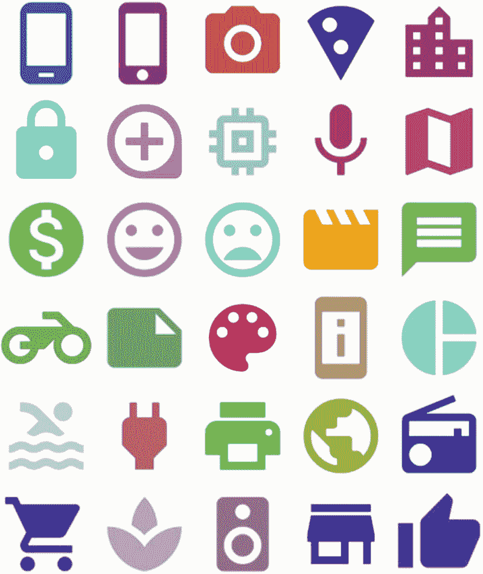

图 4-1：一组随机颜色的 Flutter 内置图标

要放置一个图标，你需要使用 `Icon` widget。这并不意外。你需要使用 `Icons` 类来指定具体图标。这个类拥有数百个静态值，例如 `Icons.phone_android`、`Icons.phone_iphone` 和 `Icons.cake`。每个值都指向一个不同的图标，就像上面展示的那些。以下是如何在你的应用中放置一个红色大生日蛋糕（图 4-2）的代码：


图 4-2：红色蛋糕图标

```
Icon(
  Icons.cake,
  color: Colors.red,
  size: 200,
)
```

如果近 9000 个内置图标仍不能满足你的需求，你完全可以引入其他图标集。Flutter 可以使用 Font Awesome，它可在 [`https://pub.dev/packages/font_awesome_flutter`](https://pub.dev/packages/font_awesome_flutter) 获取，能提供另外 2000 个图标。而 [`https://pub.dev/packages/icons_flutter`](https://pub.dev/packages/icons_flutter) 上的 `icons_flutter` 包则提供了另外 14,000 个图标。这些应该足够你用一阵子了。

## Image Widget

在 Flutter 中显示图片比使用 `Text` 或 `Icons` 要复杂一些。它涉及几个方面：

1.  **获取图片来源**——图片可以嵌入在应用本身内，也可以从互联网实时获取。如果图片在应用整个生命周期内都不会改变（例如标志或装饰图案），则应该使用嵌入图片。

2.  **调整大小**——将图片缩放或裁剪到合适的尺寸和形状。

### 嵌入图片

嵌入图片在运行时速度更快，但会在编译时增加应用的安装包大小。要嵌入图片，请将图片文件放入你的项目文件夹中。放在项目中的任何位置都可以，但惯例是将其放在名为 `assets` 的子文件夹中，可能还需要一个子文件夹以保持结构清晰。像 `assets/images` 这样的路径就很合适。

然后编辑 `pubspec.yaml` 文件。添加以下内容：

```
flutter:
  assets:
    - assets/images/photo1.png
    - assets/images/photo2.jpg
```

保存文件并在命令行中运行 `flutter pub get`，让项目处理该文件。

> **提示**  
> `pubspec.yaml` 文件保存了关于你项目的各种重要信息。它包含项目元数据，如名称、描述、仓库位置和版本号。它列出了库依赖项和字体。对于刚接触你项目的其他开发者来说，这是首要查看的文件。对于 JavaScript 开发者来说，它相当于 Dart 项目中的 `package.json` 文件。更多信息请参见附录 C“在你的 Flutter 应用中包含包”。

你可以通过调用 `asset()` 构造器将图片放入 widget，如下所示：

```
Image.asset('assets/images/photo1.jpg'),
```

### 网络图片

网络图片更接近 Web 开发者所习惯的方式。它只是通过 HTTP 从互联网上获取图片。你需要使用 `network` 构造器，并传入一个 URL 字符串作为参数。

```
Image.network(imageUrl),
```

正如你所料，这些图片比嵌入图片慢，因为在通过互联网向服务器发送请求和你的设备下载图片的过程中存在延迟。其优势在于这些图片是实时的；只需更改图片 URL，就可以动态加载任何图片。


### 调整图像尺寸

图像几乎总是被放置在一个容器中。这并不是硬性要求，只是我无法想象在实际使用中，图像会不被包裹在其他控件里。容器对图像的绘制尺寸有决定权。如果图像的原始尺寸能恰好匹配容器的尺寸，那将是非常惊人的巧合。实际上，Flutter 的布局引擎会缩小图像以适配其容器，但不会放大它。这种适配方式被称为 `BoxFit.scaleDown`，并且作为默认行为是合理的。但还有哪些其他选项可用？我们又如何决定使用哪一个呢？表 4-1 列出了 `BoxFit` 的可用选项。

**表 4-1** *BoxFit 选项*

| `fill` | 拉伸图像，使其宽度和高度都精确适配。可能会扭曲图像 | 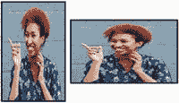 |
| `cover` | 缩小或放大图像，直至填满空间。顶部/底部或两侧可能会被裁剪。不会扭曲图像 | 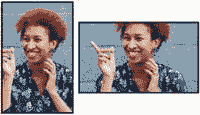 |
| `fitHeight` | 使高度精确适配。根据需要裁剪宽度或添加额外空间 | 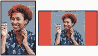 |
| `fitWidth` | 使宽度精确适配。根据需要裁剪高度或添加额外空间 |  |
| `contain` | 缩小图像，直至高度*和*宽度都适配。顶部/底部或两侧可能会留有额外空间 | 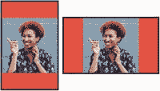 |

*照片来源：[Eye for Ebony](https://unsplash.com/%2540eyeforebony%253Futm_source%253Dunsplash%2526utm_medium%253Dreferral%2526utm_content%253DcreditCopyText) 在 [Unsplash](https://unsplash.com/search/photos/black-woman%253Futm_source%253Dunsplash%2526utm_medium%253Dreferral%2526utm_content%253DcreditCopyText) 上发布*

以上就是所有可选项，但你该如何选择呢？图 4-3 或许能帮助你在不同情况下决定使用哪种适配方式。

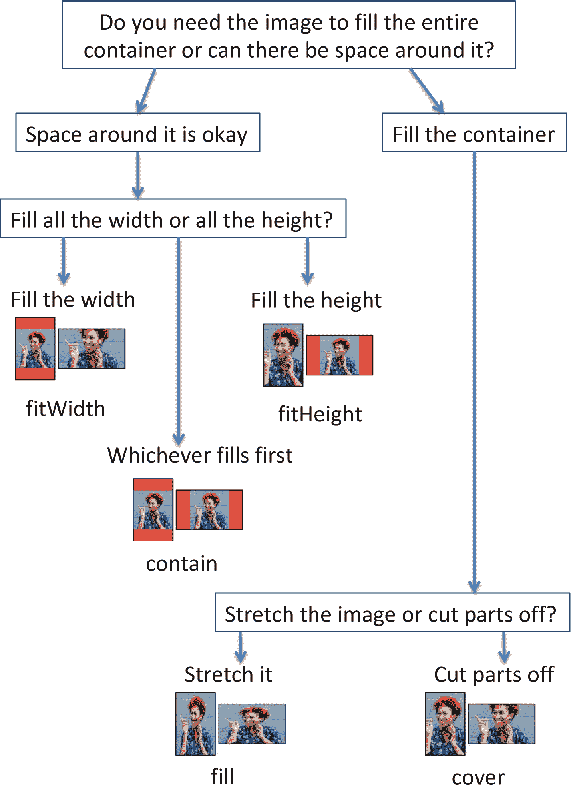

**图 4-3** 如何决定图像的适配方式

要指定适配方式，你需要设置 `fit` 属性。

```
Image.asset('assets/images/woman.jpg', fit: BoxFit.contain,),
```

### SnackBar 控件

我知道这个名字很奇怪。听起来像某种美味的小吃，但这个控件实际上是向用户发出通知的标准方式。一个 `SnackBar`（图 4-4）会出现在屏幕底部，遮挡住原本在底部的任何内容，并在短暂时间后自动消失。你可以决定 `SnackBar` 显示什么文字，甚至可以在其上放置一个按钮供用户执行操作。


**图 4-4** SnackBar 显示一条消息和可选的交互按钮

你可以在任何场景中显示一个 `SnackBar`，只要这个操作是在嵌套在 `Scaffold` 内部的控件中进行的。你必须：

1.  创建 `SnackBar`
2.  调用 `ScaffoldMessenger.of(context).showSnackBar(sb)`
3.  处理操作按钮（可选）

请注意，`showSnackBar()` 是异步运行的，以避免阻塞 UI 线程。默认情况下它会显示四秒钟，但可以通过 `duration` 属性覆盖此设置。示例如下：

```
IconButton(
icon: const Icon(Icons.delete, size: 36),
onPressed: () {
bool goAheadAndDeletePerson = true;
final SnackBar sb = SnackBar(
content: Text("${person.name} 已删除。"),
duration: const Duration(seconds: 5),
action: SnackBarAction(
label: "撤销",
onPressed: () => goAheadAndDeletePerson = false,
),
);
ScaffoldMessenger.of(context).showSnackBar(sb);
Future.delayed(const Duration(seconds: 5), () {
if (goAheadAndDeletePerson) {
deletePerson(person);
}
});
},
),
```

在这个例子中，我们对用户撒了个小谎 😲。我们告诉用户记录已被删除，但实际上他们有五秒钟的时间可以通过点击“撤销”来取消删除。`Future.delayed()` 表示在五秒延迟后，在一个独立的 isolate 中执行 `deletePerson()`。如果用户在此期间点击了“撤销”，那么 `Future` 就会跳过删除操作。

当然，你可能只想显示一条不带操作按钮的消息。这完全取决于你。

### 输入控件

我们很多人都有 Web 开发的背景，从一开始就接触到了包含 `<input>` 和 `<select>` 的 HTML `<form>`。所有这些元素都是为了使用户能够向 Web 应用输入数据，而这项活动在移动应用中同样不可或缺。Flutter 提供了类似 Web 上用于输入数据的控件，但它们的工作方式并不相同。创建和使用这些控件需要更多的工作量。对此深表歉意。不过，好的一面是，它们也更安全，并且为我们提供了更多的控制能力。

造成这种复杂性的部分原因是，这些控件并不维护自己的状态；你需要手动管理。

另一个复杂之处在于，输入控件彼此之间并不知道对方的存在。换句话说，除非你使用 `Form` 控件将它们组合在一起，否则它们彼此间的协作性并不好。我们最终需要重点学习 `Form` 控件。但在那之前，让我们先研究如何创建文本字段、复选框、单选按钮、滑块和下拉菜单。

**警告**

> 输入控件只有在 `StatefulWidget` 内部使用时才易于操作，因为它们本质上是会改变状态的。请记住，我们在上一章简要提到了 `StatefulWidget`，我们将在第 7 章“管理状态”中深入讨论它们。但在那之前，请暂且相信我们，目前先把它们放在有状态控件中使用。

#### 文本字段

如果你只需要一个简单的文本框，那么 `TextField` 控件可能就是你想要的。下面是一个 `TextField` 控件的简单示例，其上方带有一个 `Text` 标签：

```
const Text('搜索词'),
TextField(
initialValue: "一些初始值",
onChanged: (val) => _searchTerm = val,
),
```

这里的 `onChanged` 属性是一个事件处理程序，会在每次按键后触发。它接收一个 `String` 类型的值。这是用户正在输入的值。在这个示例中，我们将用户输入的内容赋值给一个名为 `_searchTerm` 的局部变量。

你注意到 `Text('搜索词')` 了吗？这是我们试图在 `TextField` 上方添加标签的拙劣尝试。其实有更好得多的方法。看看这个……

##### 让 TextField 变得更精致

有很多选项可以让你的 `TextField` 更有用——虽然不是无限的选项，但也很多。所有这些选项都可以通过 `InputDecoration` 控件（图 4-5）来设置：


**图 4-5** 一个带有 InputDecoration 的 TextField

```
return TextField(
decoration: InputDecoration(
labelText: '邮箱',
hintText: 'you@email.com',
icon: Icon(Icons.contact_mail),
),
),
```

表 4-2 列出了更多 `InputDecoration` 的选项。

**表 4-2** *InputDecoration 选项*

| 属性 | 描述 |
| --- | --- |
| `labelText` | 显示在 `TextField` 上方。告知用户这个 `TextField` 的作用 |
| `hintText` | `TextField` 内部浅色的提示文字。用户开始输入时消失 |
| `errorText` | 显示在 `TextField` 下方的错误信息。通常为红色。由验证机制自动设置（稍后介绍），但你也可以在需要时手动设置 |
| `icon` | 在整个 `TextField` 的左侧绘制一个图标 |
| `prefixIcon` | 在 `TextField` 内部靠左绘制一个图标 |
| `suffixIcon` | 与 `prefixIcon` 类似，但位于最右侧 |

#### 密码框

要将其变为密码框（图 4-6），将 `obscureText` 属性设置为 `true`。用户输入时，每个字符短暂显示一秒后会替换成一个圆点。

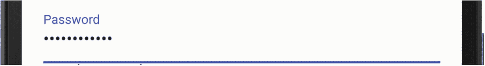

**图 4-6** 设置了 `obscureText` 的密码框

```
return TextField(
obscureText: true,
decoration: InputDecoration(
labelText: '密码',
),);
```


## 调整软键盘

想要一个特殊的软键盘？没问题。只需使用 `keyboardType` 属性即可。效果分别如图 4-7 至 4-10 所示。

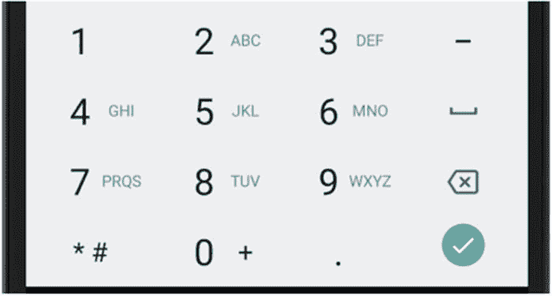

图 4-10

`TextInputType.phone`

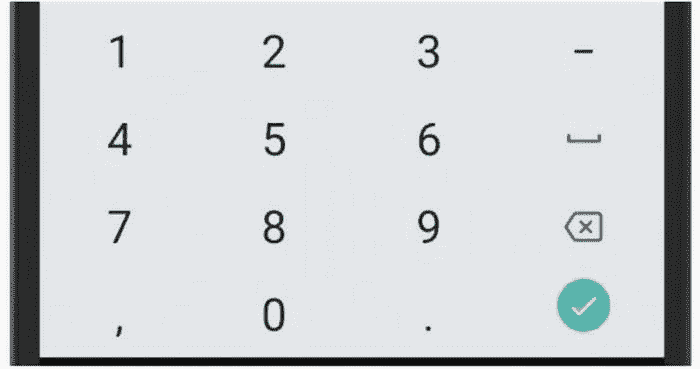

图 4-9

`TextInputType.number`

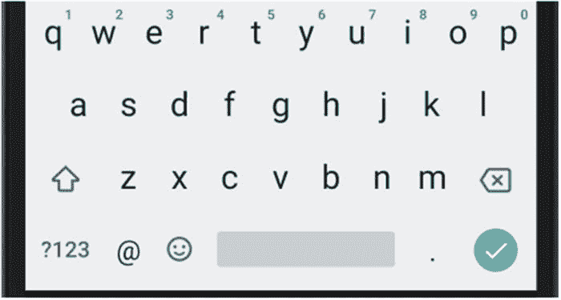

图 4-8

`TextInputType.email`。请注意 @ 符号

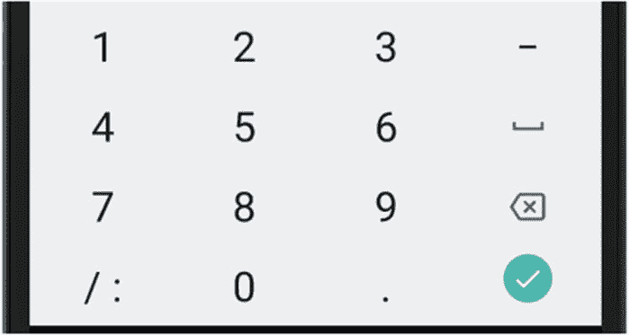

图 4-7

`TextInputType.datetime`

```
return TextField(
keyboardType: TextInputType.number,
);
```

软键盘会显示不同的键盘，但它不控制可以在每个字段中输入什么内容。换句话说，即使软键盘是数字类型，你仍然可以将普通文本输入到 `FormField()` 中。想解决这个问题吗？方法如下……

## 限制可输入的数据

如果你想限制允许输入的文本类型，可以通过 `TextInput` 的 `inputFormatters` 属性来实现。它实际上是一个数组，因此你可以组合使用一个或多个以下格式化器：

*   `BlacklistingTextInputFormatter` – 禁止输入某些字符。用户输入时，这些字符根本不会出现。
*   `WhitelistingTextInputFormatter` – 只允许输入这些字符。列表之外的任何字符都不会出现。
*   `LengthLimitingTextInputFormatter` – 最多只能输入 X 个字符。

前两个格式化器允许你使用正则表达式来指定你想要（白名单）或不想要（黑名单）的模式。示例如下：

```
return TextField(
inputFormatters: [
WhitelistingTextInputFormatter(RegExp('[0-9 -]')),
LengthLimitingTextInputFormatter(16)
],
decoration: InputDecoration(
labelText: 'Credit Card',
),
);
```

在 `WhitelistingTextInputFormatter` 中，我们只允许输入数字 0-9、空格或短横线。然后 `LengthLimitingTextInputFormatter` 将最大长度限制为 16 个字符。

## 复选框

Flutter 复选框（图 4-11）具有一个布尔类型的 `value` 属性和一个 `onChanged` 方法，该方法在每次更改后触发。与其他所有输入小部件一样，`onChanged` 方法接收用户设置的值。因此，在复选框的情况下，该值是 `bool` 类型。

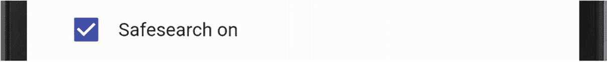

图 4-11

*一个 Flutter 复选框小部件*

```
Checkbox(
value: true,
onChanged: (val) => print(val),
),
```

提示

Flutter 开关（图 4-12）与复选框的用途相同 – 用于表示开或关。因此 `Switch` 小部件具有相同的选项并且工作方式相同，只是外观不同。

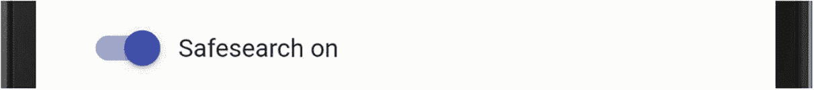

图 4-12

一个 Flutter 开关小部件

## 单选按钮

当然，单选按钮的妙处在于，如果你选中一个，同一组中的其他按钮就会取消选中。所以显然我们需要以某种方式对它们进行分组。在 Flutter 中，当你将 `groupValue` 属性设置为同一个局部变量时，`Radio` 小部件就会被分组。该变量保存当前处于选中状态的*那个* `Radio` 的值。

每个 `Radio` 也有自己的 `value` 属性，该属性与*那个*特定小部件相关联（无论它是否被选中）。在 `onChanged` 方法中，你将 `groupValue` 变量设置为该单选按钮的值。

| value | 每个单选按钮都有自己独特的值 |
| groupValue | 当前选中的一个值，取决于最后点击的是哪个单选按钮。 |

以下是它们协同工作的方式：

```
SearchLocation? searchLocation;
//其他代码放在这里
Radio(
groupValue: searchLocation,
value: SearchLocation.anywhere,
onChanged: (val) => setState(() => searchLocation = val)),
const Text('Search anywhere'),
Radio(
groupValue: searchLocation,
value: SearchLocation.text,
onChanged: (val) => setState(() => searchLocation = val)),
const Text('Search page text'),
Radio(
groupValue: searchLocation,
value: SearchLocation.title,
onChanged: (val) => setState(() => searchLocation = val)),
const Text('Search page title'),
```

请注意，每个 `Radio` 都有其自己的值，第一个是 `SearchLocation.anywhere`，第二个是 `SearchLocation.text`，第三个是 `SearchLocation.title`。但它们都共享 `groupType`，正是这个属性将它们分组在一起。还要注意，当选中一个时，其 `onChanged` 会触发，我们将 `searchLocation` 变量设置为选中的项。

这段简化后的代码将生成类似图 4-13 的效果。

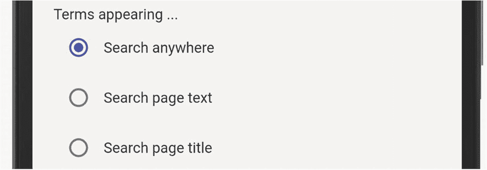

图 4-13

*Flutter 单选按钮小部件*

提示

对 `SearchLocation` 感到困惑？我不怪你。它是一个枚举。单选按钮与枚举配合使用效果非常好。

以下是上面提到的 `SearchLocation` 枚举的创建方式：

```
enum SearchLocation { anywhere, title, text }
```

## 滑块

当你希望用户选择一个介于上限和下限之间的数值时，滑块是一种方便的交互方式（图 4-14）。

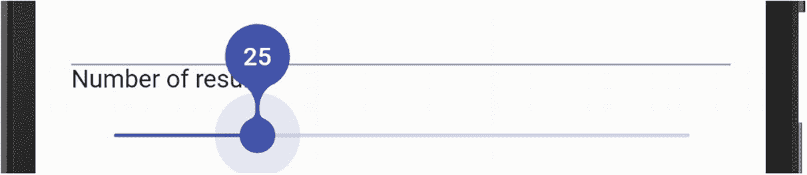

图 4-14

值为 25 的滑块

要在 Flutter 中实现一个，你需要使用 `Slider` 小部件，它需要 `onChanged` 事件和 `value` 属性（类型为 `double`）。它还有 `min`（默认为 `0.0`）和 `max`（默认为 `1.0`）。零到一的范围很少有用，所以你通常会改变它们。它还有一个可选的 `label` 属性，这是一个指示器，用于告知用户他们正在选择的值。

```
Slider(
label: numberOfResults.toString(),
min: 0.0,
max: 100.0,
divisions: 100,
value: numberOfResults.toDouble(),
onChanged: (val) {
setState(() => numberOfResults = val.round());
},
);
```

## 下拉菜单

当需要从少量选项中选择一个时（比如枚举），下拉菜单非常有用。假设我们有这样一个枚举：

```
enum SearchType { web, image, news, shopping }
```

显然，我们定义了一个 `SearchType` 类型，它可以是 `web`、`image`、`news` 或 `shopping`。如果我们希望用户从中选择一个，我们可能会向他们展示一个 `DropdownButton` 小部件，初始状态可能看起来像图 4-15。

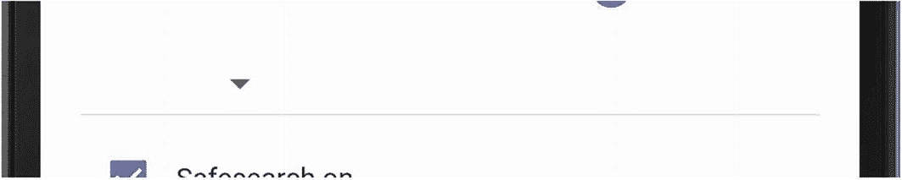

图 4-15

*未选择任何内容时的 `DropdownButton`*

然后，当他们点击下拉菜单时，它看起来像图 4-16。

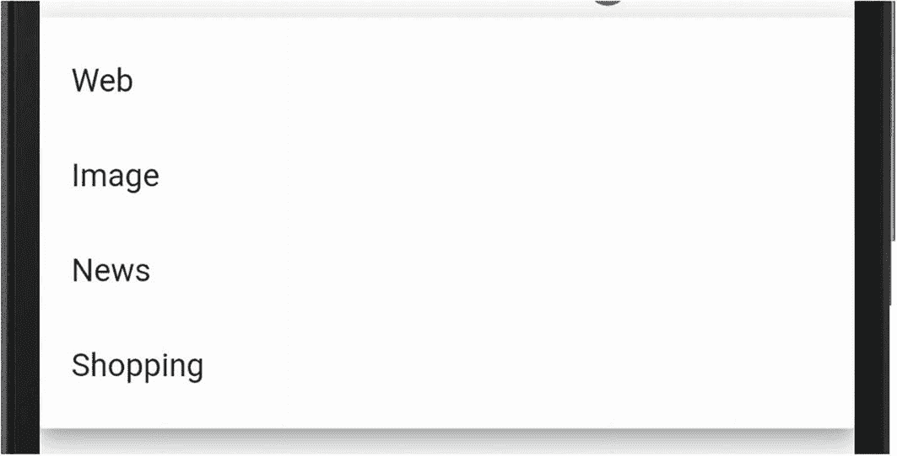

图 4-16

*展开后显示选项的 `DropdownButton`*

当他们点击其中一个选项时，该选项被选中（图 4-17）。

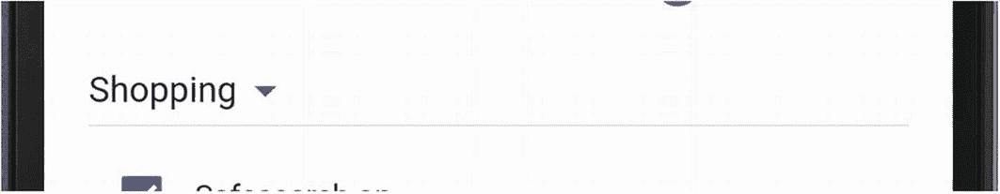

图 4-17

*选中了一个选项的 `DropdownButton`*

要创建这个 `DropdownButton`，我们的 Flutter 代码可能如下所示：

```
SearchType searchType = SearchType.web;
//其他代码放在这里
return DropdownButton(
value: searchType,
items: [
DropdownMenuItem(
value: SearchType.web, child: Text('Web') ),
DropdownMenuItem(
value: SearchType.image, child: Text('Image') ),
DropdownMenuItem(
value: SearchType.news, child: Text('News') ),
DropdownMenuItem(
value: SearchType.shopping, child: Text('Shopping') ),
],
onChanged: (val) => searchType = val,
);
```

请注意，所有项的类型都是 `DropdownMenuItem`。它们有 `value` 和 `child` 属性，但 `onChanged` 事件处理程序位于菜单上，而不是菜单项上。仔细想想，这还挺有道理的。

## 整合表单小部件

我们拥有了所有这些不同类型的字段，它们外观漂亮且功能出色，这很棒。但你通常希望将它们组合在一起，以便可以作为一个组进行某种程度的控制。为此，你将使用 `Form` 小部件。


## 表单组件

在 Flutter 中，当有多个相互依赖的字段或需要添加验证逻辑时，`Form` 组件会很有帮助。但并非所有场景都必然需要它。如果不需要，你可以忽略 `Form` 组件。在真正需要了解 `Form` 组件之前，尽管跳过这一节去读下一章，我完全不会介意。

……还在看？好吧。让我们看看 `Form` 组件能为我们做些什么。系好安全带，因为接下来的旅程会有些颠簸……

表单需要一个 `GlobalKey`。还记得上一章我们介绍过键（keys）吗？当时我们说除了少数情况外，键通常可以忽略。而这里正是需要键的场景之一。如果你决定使用 `Form`，就需要一个类型为 `FormState` 的 `GlobalKey`：

```
GlobalKey _key = GlobalKey();
```

然后将这个键设置为 `Form` 的一个属性：

```
@override
Widget build(BuildContext context) {
return Form(
key: _key,
autovalidate: AutovalidateMode.always,
child: // 所有表单字段都将放在这里
);
}
```

乍一看，`Form` 似乎没有带来什么变化。但仔细观察，你会发现我们现在可以访问以下内容：

*   `autovalidate` – `always` 表示当任何字段发生变化时立即运行验证。`disabled` 表示你需要手动触发验证。`onUserInteraction` 表示每次用户交互时都运行验证。（我们将在几页后讨论验证。）

*   键本身，我们在上面的代码中称其为 `_key`。

这个 `_key` 拥有一个 `currentState` 属性，该属性又包含以下方法：

1.  `save()` – 通过调用每个字段的 `onSaved` 方法来保存表单内的所有字段。

2.  `validate()` – 运行每个字段的 `validator` 函数。

3.  `reset()` – 将表单内的每个字段重置为 `initialValue`。

**注意：** `currentState` 是一个可空属性。这意味着我们必须使用 `?` 或 `!` 来安抚编译器。记住，`?` 表示如果它为 null，则在此处停止处理（即什么也不做）。而 `!` 表示我们确信它此时永远不可能为 null。为了简洁起见，你会看到我使用 `!`。

有了这些，你就可以理解 `Form` 如何处理其嵌套字段了。当你调用这三个方法中的任何一个时，它都会遍历所有内部字段并对每个字段调用相应的方法。在 `Form` 级别的一次调用将触发所有字段的对应操作。

但请稍等！如果 `_key.currentState.save()` 调用了字段的 `onSaved()`，我们需要提供一个 `onSaved` 方法，对吗？`validate()` 调用 `validator` 同理。但是 `TextField`、`DropdownButton`、`Radio`、`Checkbox` 和 `Slider` 这些组件本身并没有这些方法。现在该怎么办？我们需要将每个字段包裹在一个 `FormField` 组件中，而这个组件**确实**拥有这些方法。（这坑越来越深了。）

### FormField 组件

这个组件存在的全部意义就是为内部组件提供 `onSaved` 和 `validator` 事件处理器。`FormField` 组件可以通过 `builder` 属性包裹任何组件：

```
FormField(
builder: (state) {
return TextField(); // 任何字段组件，如 Switch、Radio、Checkbox 或 Slider。
},
onSaved: (String initialValue) {
// 在此处将值推送到仓库或其他地方。
},
validator: (String val) {
// 在此处放置验证逻辑（下文将进一步说明）。
},
),
```

所以，我们首先用 `FormField` 组件包裹每个输入组件，并在一个名为 `builder` 的方法中完成此操作。然后，我们可以添加 `onSaved` 和 `validator` 方法。

**注意：** 虽然 `Switch`、`Checkbox` 和 `Slider` 被包裹在 `FormField` 中，但 `Radio` 有所不同。你需要将整个 `Radio` 组包裹在一个 `FormField` 中。仔细想想，这很合理——因为整个组确定的是一个值——即 `groupValue`。

### TextFormField 和 DropdownButtonFormField

Flutter 团队贴心地为我们提供了一个快捷方式。如果你在 `Form` 内部使用 `TextField`，无需*包裹*它，而是直接*替换*为 `TextFormField` 组件。这个新组件很容易与 `TextField` 混淆，但它们是不同的。本质上……

`TextFormField` = `TextField` + `FormField`

`TextFormField` 拥有 `TextField` 的所有属性，并额外增加了 `onSaved` 和 `validator`：

```
TextFormField(
initialValue: "一些初始字符串",
decoration: InputDecoration(labelText: '邮箱'),
onSaved: (val) => print("表单已保存: $val"),
validator: (val) {
// 在此处放置你的验证逻辑
},
),
```

类似地，当在 `Form` 中使用 `DropdownButton` 时，可以将其替换为 `DropdownButtonFormField`：

```
DropdownButtonFormField(
onChanged: (val) => _searchType = val,
onSaved: (val) => _dbRecord["searchType"] == val,
validator: _searchTypeValidator,
value: _searchType,
items: [...],
),
```

现在是不是好多了？终于，我们得到了一个让事情变得更简单的喘息之机。复选框没有这个快捷方式，`Radio` 和 `Slider` 也没有。只有 `TextField` 和 `DropDownButton` 有。

#### onSaved

记住，你的 `Form` 有一个键，这个键拥有一个 `currentState`，而 `currentState` 又有一个 `save()` 方法。都记住了吗？没有？不太清楚？我们换个方式理解：当点击“保存”按钮时，你需要编写代码来调用……

```
_key.currentState!.save();
```

……而它会依次调用 `Form` 中每个 `FormField` 的 `onSaved` 方法。

#### validator

类似地，你可能已经猜到可以调用……

```
_key.currentState!.validate();
```

……然后 Flutter 会调用每个 `FormField` 的 `validator` 方法。每个 `validator` 函数将接收其待验证的值，并返回一个可为空的字符串。你需要编写函数：如果输入值有效，则返回 `null`；如果无效，则返回一条错误消息。返回的字符串就是 Flutter 会显示给用户的信息：

```
return Form(
child: TextFormField(
validator: (val)=> (val == null || val.isEmpty)
? "请输入一些文本"
: null,
),
);
```

#### 提交表单

我们（终于）准备好实际提交表单了。通常你会在按钮点击时执行此操作，并且只有当所有数据都有效时才希望提交表单。代码可能如下所示：

```
ElevatedButton(
onPressed: () {
if (_key.currentState!.validate()) {
_key.currentState!.save();
print("表单已保存。");
}
},
child: const Text("提交"),
);
```

## 一个大型表单示例

我知道，我知道。这相当复杂。在具体的上下文中看看这些东西是如何组合在一起的可能会有所帮助。请查看代码仓库中名为 `search_form.dart` 的文件，它在一个大型 `StatefulWidget` 中整合了所有这些部分。

## 总结

理解 Flutter 表单需要一些时间。请不要气馁。当你实际使用表单时，很快就会弄明白。虽然表单这个话题可能让你有点望而生畏，但文本、图片、图标和 SnackBar 这些内容是非常直观的，对吧？

在下一章中，我们将学习如何创建各种类型的按钮，并使它们——或任何组件——能够响应点击及其他手势，届时我们的应用将真正活起来！

