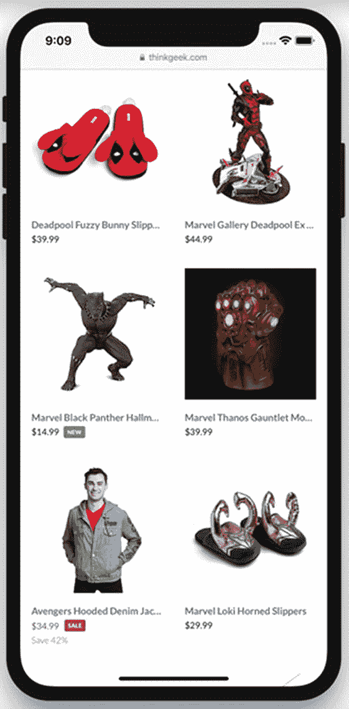
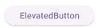
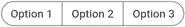
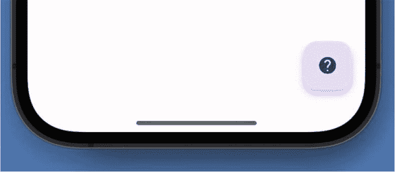
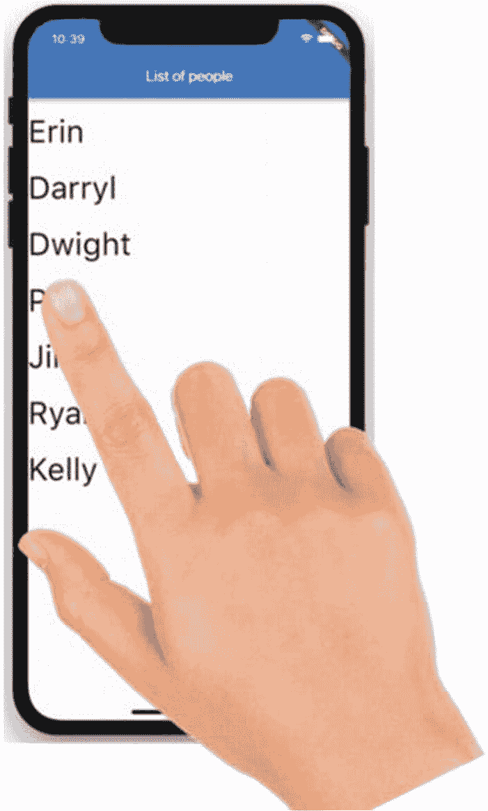
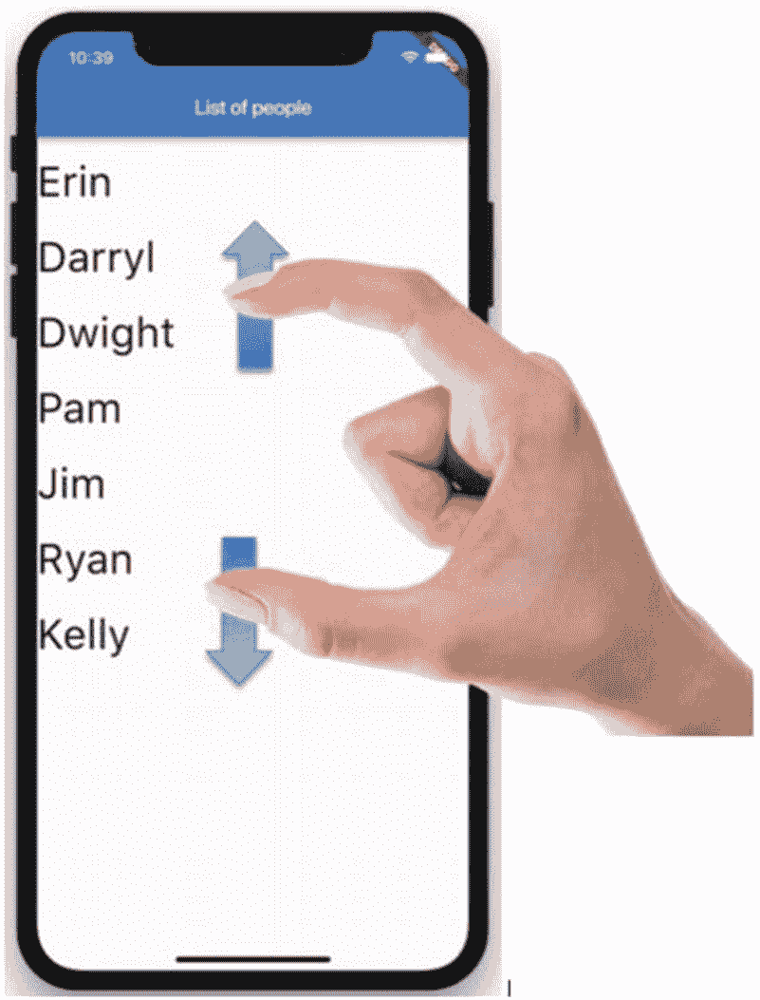
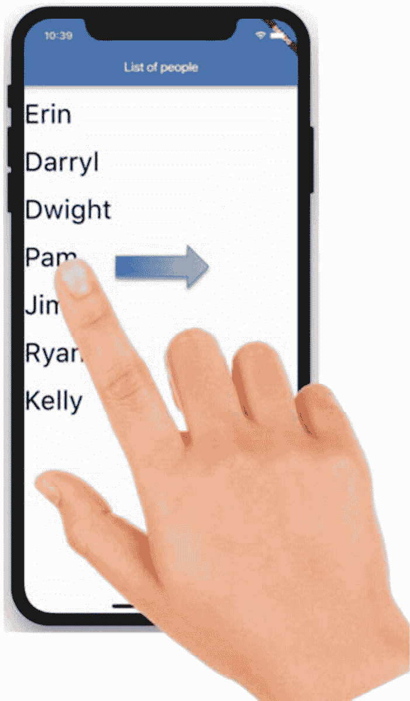

# 5. 响应手势

到目前为止，我们已经取得了很大的进展！你现在知道 Flutter 是关于什么的。你对开发和调试过程的工作原理已经相当熟悉。你明白为什么我们使用组件，并且对上一章的值组件已经相当熟悉了。天呐，你甚至可以创建自己的无状态组件了。但我们仍然缺少一个主要的、基础的功能：事件处理。

假设你有一个屏幕，用户在其中选择商品并将其放入购物车。他们将需要在一个商品列表中上下滚动（图 5-1）。向上和向下滑动以滚动是一种手势。要选择商品，他们会点击它。那也是一种手势。然后要将其放入购物车，也许会让他们向右滑动。那又是另一种不同的手势。



图 5-1

一个购物应用

本章的全部内容就是处理这些手势。我们将手势分为两类：内置组件上的手势和自定义组件上的手势。让我们从内置组件上的手势开始讲起。


## 认识按钮家族

有些手势非常简单，因为它们是某些小部件的内置功能。例如，按钮小部件的创建者知道它们存在的唯一目的就是被按下，然后做出相应的响应。因此，所有按钮都有一个名为 `onPressed` 的属性。要使用它，你只需将其指向用户按下按钮时想要运行的函数：

```
IconButton(
  icon: const Icon(Icons.delete),
  // 回调函数必须返回 void
  onPressed: () => print("tapped"),
)
```

图 5-2 显示了输出结果。


**图 5-2** 一个 `IconButton`

你可以把 `Button` 看作是所有其他按钮的基类。实际并非如此，但你把其他所有按钮都看作是具有某些特殊功能的 `Button` 也没什么坏处。例如，以下这些都是按钮的专用类型的小部件。

| `TextButton` |  |
| `ElevatedButton` |  |
| `IconButton` |  |
| `FloatingActionButton` |  |
| `SegmentedButton` |  |
| `CupertinoButton` |  |

让我们仔细看看它们。

### `ElevatedButton`

这种按钮看起来像是浮动在页面上方：

```
ElevatedButton(
  onPressed: () => {},
  child: const Text("ElevatedButton"),
),
```

### `TextButton` 和 `IconButton`

这两种按钮有点像是 `ElevatedButton` 的对立面。它们看起来完全是扁平的，很不起眼，只有简单的文字或图标，不会强烈暗示用户去按下，比如“撤销”按钮或“返回”按钮。

```
IconButton(
  icon: const Icon(Icons.delete),
  onPressed: () => {},
),
TextButton(
  onPressed: () => {},
  child: const Text("TextButton"),
),
```

### `FloatingActionButton` (FAB)

这是你常在屏幕右下角看到的那种按钮。它通常是圆形的，明确地向用户提示如何进入工作流的下一步（图 5-3）。



**图 5-3** 浮动操作按钮

在 Flutter 中，FAB 是 Scaffold 的三个主要组成部分之一。你通常会看到它像这样被包含进来：

```
Widget build(BuildContext context) {
  return Scaffold(
    appBar: ...,
    body: ...,
    floatingActionButton: FloatingActionButton(
      child: const Icon(Icons.help),
      onPressed: (){},
    ),
  );
}
```

### `SegmentedButton`

这是一组被视为一个整体的按钮。可以选择一项，也可以选择多项。

```
SegmentedButton(
  emptySelectionAllowed: true,
  multiSelectionEnabled: true,
  selected: selectedValue, // 当前选中的值
  onSelectionChanged: (value) =>
    setState(() => selectedValue = value),
  segments: const [
    ButtonSegment(label: Text('Option 1'), value: 'option1'),
    ButtonSegment(label: Text('Option 2'), value: 'option2'),
    ButtonSegment(label: Text('Option 3'), value: 'option3'),
  ],
),
```

### `CupertinoButton`

一种 iOS 风格的按钮。在 iPhone 上看起来很棒，但在 Android 设备上使用 iOS 风格会感觉有点奇怪。如果你使用它，可能打算将它包裹在 `CupertinoApp` 中，而不是本章中其他按钮使用的 `MaterialApp`。如果这样做，请确保在 Dart 文件顶部添加以下内容：

```
import 'package:flutter/cupertino.dart';
```

## `Dismissible`

所有按钮的创建目的只有一个：响应按下操作。类似地，`Dismissible` 的创建目的也只有一个：响应滑动操作。要使用它，你通常需要构建一个小部件，然后用 `Dismissible` 将其包裹起来。这样，该小部件就能响应滑动手势：

```
Dismissible(
  // 向右滑动时给蓝色背景，
  // 向左滑动时给红色背景
  background: Container(color: Colors.blue),
  secondaryBackground: Container(color: Colors.red),
  onDismissed: (direction) => print("You swiped $direction"),
  child: SomeWidget(),
);
```

注意，顾名思义，它用于取消（dismiss）一个小部件，在将其“滑走”时从视图中移除它。但如果我只想滑动它，而不想取消它呢？这就需要自定义手势了。

## 为自定义小部件创建自定义手势

为什么 `Dismissible` 能理解滑动手势？为什么按钮能理解 `onPressed` 手势？因为开发者将它们写入了代码中。你的自定义小部件也需要编写手势程序。但由于是*你*在编写它们，你可以创建自己的手势。并且你可以创建比简单按下更有趣的手势。你可以让你的小部件响应滑动、长按、双击和捏合缩放。

| `Tap` | 即按下。包括双击（点按两次） |
| `LongPress` | 长时间按在屏幕上——大约一两秒钟 |
| `Scale` | 即捏合或展开，当你的手指分开时 |
| `Drag` | 即滑动 |

**注意**

还有一个 `Pan` 手势，它与 `Drag` 非常相似，为了简化，我们在此略过。

响应自定义手势需要以下步骤：

1.  确定你的手势及其行为。
2.  正常创建你的自定义小部件。
3.  添加一个 `GestureDetector` 小部件。
4.  将手势与其行为关联起来。

### 第一步：确定你的手势及其行为

这一步很简单。你的用户体验专家可能在你拿到设计稿之前就已经完成了。你只需列出你想响应的手势，以及检测到该手势时应执行的操作。

我们将通过一个例子来演示。假设用户看到一个人物列表，需要选择他们喜欢和不喜欢的人。我们让用户向右滑动他们喜欢的每个人，向左滑动他们不喜欢的每个人。再假设用户有时想在两个人之间添加一个新人物。我们会让他们用双指将两个人分开——就像在他们之间为新条目腾出空间一样。最后，也许我们会让用户长按来删除一个人物。

| 手势 | 动作 |
| --- | --- |
| 向右滑动 | 将他们添加到“喜欢”列表 |
| 向左滑动 | 将他们添加到“不喜欢”列表 |
| 捏合（实际上是反向捏合） | 插入一个新人物 |
| 长按 | 删除那个人物 |

### 第二步：创建你的自定义小部件

按照我们在前几章中学到的方法编写 Dart 代码。这是一个人物列表：

```
class ManagePeople extends StatelessWidget {
  List fetchPeople() {
    return [
      {"first":"Kevin", "last":"Malone"},
      {"first":"Kelly", "last":"Kapoor"},
      {"first":"Creed", "last":"Bratton"},
      {"first":"Dwight", "last":"Schrute"},
      {"first":"Andy", "last":"Bernard"},
      {"first":"Pam", "last":"Beasley"},
      {"first":"Jim", "last":"Halpert"},
      {"first":"Robert", "last":"California"},
      {"first":"David", "last":"Wallace"},
      {"first":"Ryan", "last":"Howard"},
    ];
  }

  @override
  Widget build(BuildContext context) {
    var _peopleObjects = fetchPeople();
    return ListView(
      children: _peopleObjects.map((person) =>
        Person(person:person)).toList(),
    );
  }
}
```

### 第三步：添加一个 `GestureDetector` 小部件

`GestureDetector` 小部件与大多数 UX 小部件不同——它是不可见的。你可以将某个小部件用 `GestureDetector` 包裹起来，或者将其嵌套在 `child` 属性中；它非常灵活。无论哪种方式，它都能检测并处理该小部件的手势。由于看不见它，它除了 `child` 属性或 `build` 方法之外没有多余的其他属性或方法，正如你所期望的那样。事件才是关键所在！

在这里，我们用 `GestureDetector` 包裹每个 `Person`：

```
return ListView(
  children: _peopleObjects
    .map((person) =>
      GestureDetector(child: Person(person: person))
    ).toList(),
);
```


#### 第四步：将手势与其行为关联起来

最后一步。为你在第一步中设计的每个事件分配一个方法。`GestureDetector`（手势检测器）支持大量事件^(¹⁰)，因此它们可能会让人感到非常困惑。我们在这里将其归纳为最常用的一些事件。

| 手势 | 要使用的事件 |
| --- | --- |
| 点击（按下） | `onTap` |
| 双击 | `onDoubleTap` |
| 长按 | `onLongPress` |
| 左右滑动 | `onHorizontalDragUpdate`、`Start`、`End` |
| 上下滑动 | `onVerticalDragUpdate`、`Start`、`End` |
| 斜向滑动 | `onPanUpdate`、`Start`、`End` |
| 捏合 | `onScaleUpdate`、`Start`、`End` |

#### 示例 1：响应长按

长按（图 5-4）会忽略简单的点击，但当用户持续按下较长时间（比如一两秒）时会触发。假设我们的用户体验设计团队决定，长按将表示用户想要删除一个用户。



图 5-4

长按

为了实现这一点，我们将添加 `onLongPress` 事件处理器：

```
GestureDetector(
  child: Person(person: person),
  onLongPress: () {
    _people.remove(person);
    print("已删除 ${person['first']}");
  },
);
```

#### 示例 2：通过捏合添加新项目

假设我们的用户体验专家建议，用户可能想要向列表中添加项目，并指定插入的位置。为了表达这一点，他们将通过反向捏合（双指张开）来展开列表（图 5-5）。



图 5-5

捏合

我们需要检测用户是在向内捏合还是向外张开。正常的向内捏合应该被忽略。但向外张开——即他们张开手指——意味着我们正在添加一个新用户。请注意，某些事件处理器会接收到一个事件对象。这个对象包含了关于该特定事件的信息。在缩放/捏合的情况下，它包含一个名为 `scale` 的属性。如果 `scale` 大于 1.0，则这是一个向外张开（放大）。假设如果用户进行的向外张开操作达到正常缩放的两倍，我们就认为他们想要向列表中添加一个新用户：

```
onScaleUpdate: (e) {
  if (e.scale > 2.0)
    addPerson(context);
},
```

#### 示例 3：向左或向右滑动

现在，我们的用户体验团队决定，如果用户在列表中的某个人上向右滑动，我们应该将其添加到“好人”列表；如果用户向左滑动，则将其添加到“坏人”列表（图 5-6）。



图 5-6

滑动

要检测滑动，我们会寻找拖拽或平移。当我们预期用户可能进行*斜向*滑动时，会使用平移（pan）。`HorizontalDrag`（水平拖拽）仅针对左和右；它会忽略 Y 方向。`VerticalDrag`（垂直拖拽）仅针对上和下；它会忽略 X 方向上的任何变化。由于我们只关心左滑或右滑，我们将专注于 `HorizontalDrag` 手势。

我们的应用可以通过使用 `onHorizontalDragEnd` 事件来响应任何滑动。在这种情况下，我们还需要关注滑动的方向：是从左到右还是从右到左？因此，我们必须在每种情况下都查看事件对象。在拖拽开始时，我们保存用户手指所在的 X 位置。然后随着每个像素的移动，拖拽更新事件会捕获当前的 X 位置。最后，在拖拽结束时，我们做一个简单的计算；如果结束时的 X 位置更大，我们就知道是向右滑动了。否则，就是向左滑动：

```
double swipeStartX = 0;
String swipeDirection = "";
return GestureDetector(
  child: Person(person: person),
  onHorizontalDragStart: (e) {
    swipeStartX = e.globalPosition.dx;
  },
  onHorizontalDragUpdate: (e) {
    swipeDirection =
      (e.globalPosition.dx > swipeStartX) ? "Right" : "Left";
  },
  onHorizontalDragEnd: (e) {
    if (_swipeDirection == "Right")
      updatePerson(person, status: "nice");
    else
      updatePerson(person, status: "naughty");
  },
);
```

## 结论

Flutter 的手势直观易懂。它们的工作方式与普通开发者预期的一致，使我们易于编写代码，也让用户易于使用。当被触发时，所有事件都会在单独的线程上运行，因此让它们返回 `Async<>` 对象是完全没问题的。因此，请随意将你的事件处理函数标记为 `async`，并用 `await` 来填充它们。^(¹¹)

脚注 1 2

