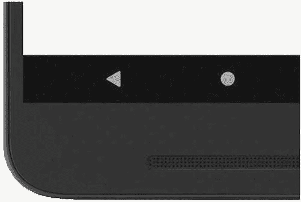
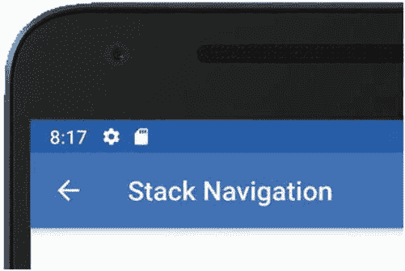
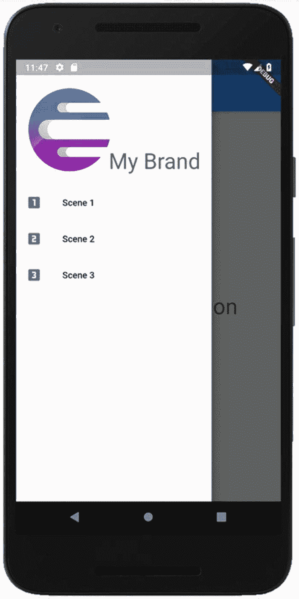
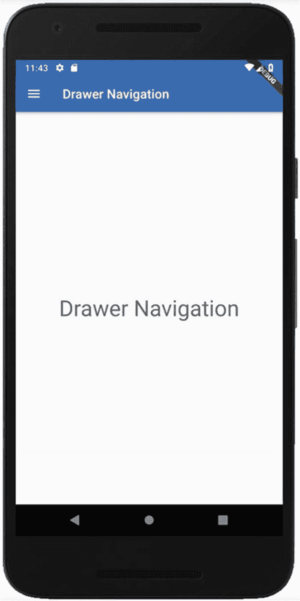
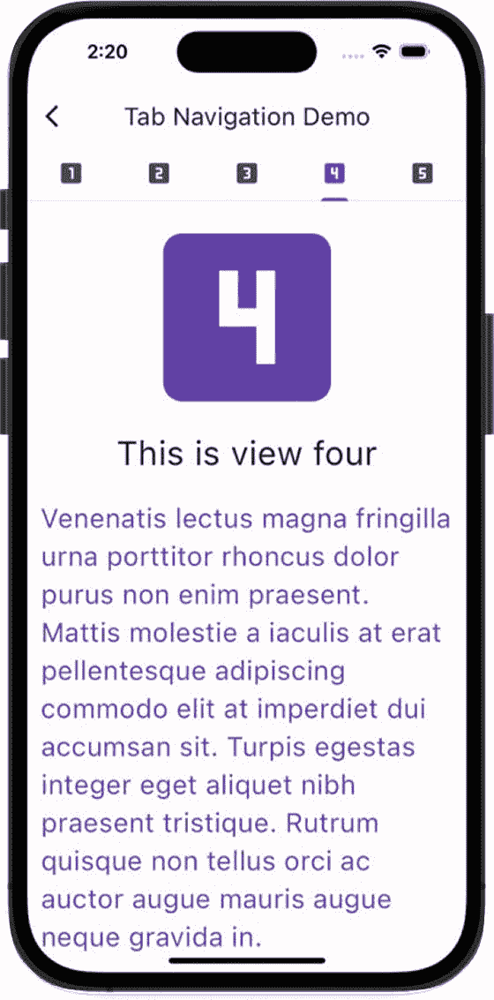
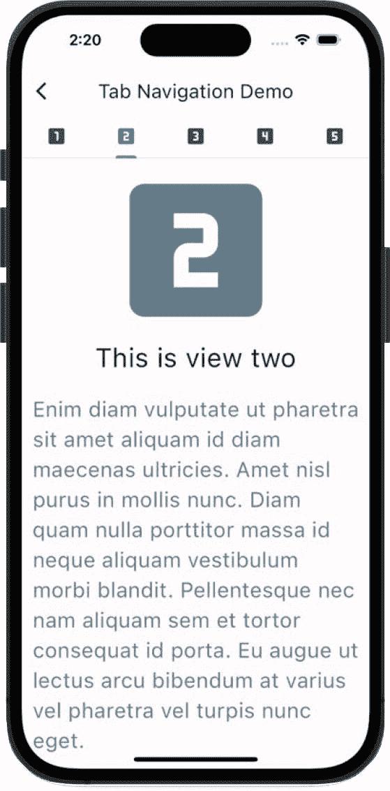
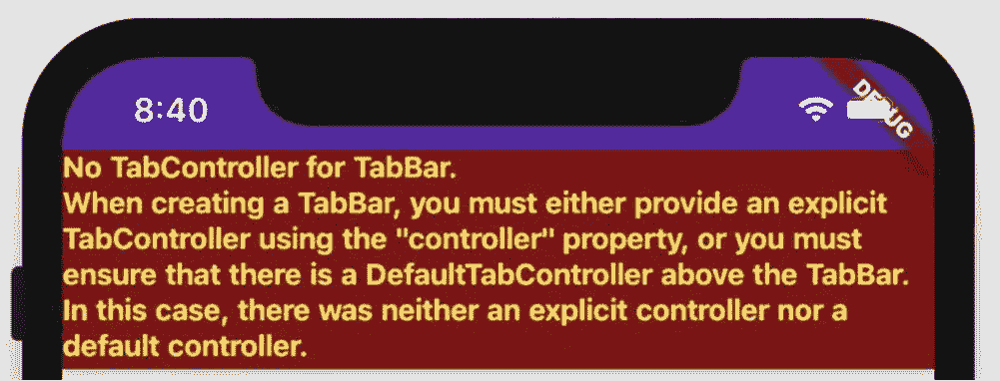
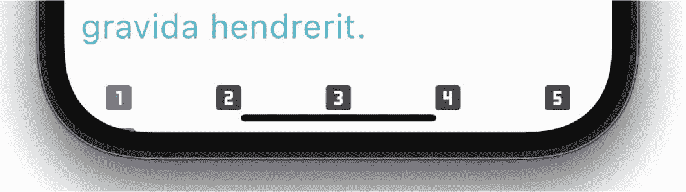
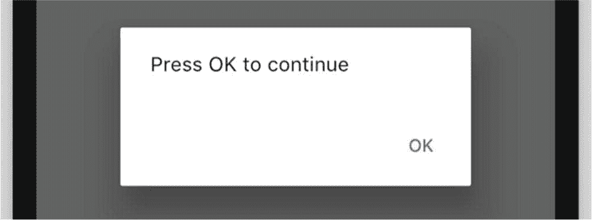
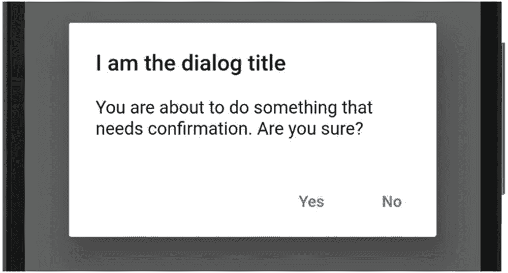

# 6. 导航与路由

所有应用都涉及从一个屏幕*移动*到另一个屏幕的概念。用户点击购物车按钮，我们就进入购物车场景。用户点击“继续购物”按钮，我们就继续浏览以购买更多商品。一些应用开发者称之为路由。另一些则称之为导航。不管你怎么称呼它，这都是 Flutter 让事情变得简单的领域之一，因为只有四种导航方式：

- **堆栈（Stacks）** – 每个 widget 都是全屏的。用户通过点击按钮来遍历预定义的工作流程。历史记录会被维护，用户可以通过按返回按钮回溯。
- **抽屉（Drawers）** – 屏幕的大部分区域显示一个 widget，但在左边缘，有一个抽屉正对着用户。当用户按下它或向右滑动它时，它会滑出并显示一个菜单选项。按下一个选项会更改主屏幕区域的 widget。
- **标签页（Tabs）** – 在屏幕的顶部或底部会预留一些空间来放置一组标签页。当你点击某个标签页时，我们会显示与该标签页对应的 widget。
- **对话框（Dialogs）** – 虽然严格来说它们不属于导航的一部分，但它们也是一种查看另一个 widget 的方式，所以我们将其纳入。对话框是模态的（即弹出窗口），会一直显示直到用户将其关闭。

这些方法中的每一种都依赖于你的应用拥有一个 `MaterialWidget` 作为其祖先。让我们从堆栈导航开始，深入探讨这些方法。

## 堆栈导航

如果你是一位经验丰富的开发者，你对队列和堆栈应该不陌生。如果不是，让我简要解释一下。假设你在厨房工作。盘子洗完后，会被堆叠起来，对吧？每个盘子都被放在堆栈的顶部。这被称为*压入（pushing）*堆栈。当需要上菜时，你自然会拿起最后一个放入的盘子，也就是堆栈顶部的那个。这被称为从堆栈顶部*弹出（popping）*。

Flutter 的导航就是使用堆栈工作的。当你想将用户带到一个新场景时，你会将一个 widget `push()` 到堆栈的顶部，用户就会看到该 widget。每次你 `push()` 时，都会使场景堆栈变得越来越高。当你希望用户返回到他们之前的位置时，你会从堆栈顶部 `pop()` 掉最后一个场景，然后会露出什么？是之前的那个场景。

使用 Flutter 的堆栈，你通常会预先定义场景（也称为路由）并为每个场景命名。这必须在 `MaterialApp` 层面完成，如下所示：

```
Widget build(BuildContext context) {
  return MaterialApp(
    title: '购物应用',
    initialRoute: '/',
    routes: {
      '/': (ctx) => LandingScene(),
      '/browse': (ctx) => Browse(),
      '/product': (ctx) => ViewProduct(),
      '/checkout': (ctx) => Checkout(),
    },
  );
}
```

请注意，使用路由时，我们不再使用 `home` 属性。取而代之的是使用 `initialRoute` 属性。

提示

如果你的 `initialRoute` 是 `"/"`，你可以完全省略它，Flutter 会假定它是 `"/"`。


### 向前与向后导航

要在场景间导航，你需要使用 `Navigator.pushNamed(context, route)` 和 `Navigator.pop(context)`。

要将用户推送到另一个路由：

```
RaisedButton(
child: const Text('结账'),
onPressed: () => Navigator.pushNamed(context, '/checkout'),
),
```

当他们完成任务并想要返回时：

```
RaisedButton(
child: const Text('返回'),
onPressed: () => Navigator.pop(context),
),
```

等等，还有更多！注意，如果你使用了 `Scaffold`，`appBar` 中会自动添加一个返回箭头（图 6-1）。点击它即可返回。如果你的用户在 Android 设备上，无处不在的 Android 返回键也同样有效（图 6-2）。



图 6-2 —— Android 返回键与栈协同工作



图 6-1 —— `appBar` 中的返回箭头

### 使用匿名路由

使用命名路由时，你的路由方案是自文档化的。当你的团队成员想要审查场景级别的组件时，只需前往 `MaterialApp` 找到路由即可。瞧！所有可访问的页面一目了然。

还有一种路由方式，不需要在 `MaterialApp` 中预定义路由表。相反，你可以动态生成路由。由于没有名称，我们将之称为匿名路由。匿名路由更加即兴和灵活，但对于你的团队成员来说，也更容易变得不可预测。

你随时可以：

```
Navigator.push(
context,
MaterialPageRoute(builder:
(BuildContext context) => SecondRoute()
)
);
```

如你所见，这种方式要复杂得多。但如果想要自定义过渡效果，或者不想使用预定义路由，它就很受欢迎。通过这种方式，你可以导航到任意组件，无论它是否在命名路由列表中。

### 场景关闭后获取结果

使用栈式导航时，每次调用 `pop()` 都会返回其调用者。因此，每个场景都有可能返回一个值。这虽然不常见，但在将用户引导至工作流时却非常有用。假设你的应用有一个维护 `person` 对象的区域。该 `person` 对象在 `MyPersonWidget` 中定义，我们提供了一个按钮来修改登录凭据，另一个按钮来修改电话号码，还有一个按钮来修改 X/Twitter 账号。当用户点击每个按钮时，我们可能会通过 `push()` 将他们导航到一个路由来修改数据。如果这样，当我们在 `pop()` 时，需要将修改后的数据返回给 `MyPersonWidget`。在这种情况下，我们会以略微不同的方式使用 `push()`；我们需要一个变量来接收返回值：

```
// 这里需要 'async'，因为下面要使用 'await'。
onPressed:  () async {
_person.xHandle =
await Navigator.pushNamed(context, '/xHandle');
},
```

注意

`await` 关键字意味着 `pushNamed()` 返回一个 `Future`。同时请注意，从此路由返回的任何值都将赋值给 `_person.xHandle`。

那么这个值是如何从 `XWidget` 返回的呢？当然是在 `pop()` 中！

```
Navigator.pop(context, xHandle);
```

`Navigator.pop()` 是重载的。如果你添加第二个参数，它将会被返回给最初调用 `push()` 的组件。在上述示例中，`xHandle` 将被返回。

对于层级较浅的应用，使用 `push()` 和 `pop()` 的效果很好。但你的应用可能具有深层导航树且包含大量选项。这类应用通常不适合用大量按钮来进行 `push()` 和 `pop()`。相反，它们应该有一个导航菜单。Flutter 为我们提供了两种类型。较简单的应用可以使用标签页。更复杂的应用则可以使用抽屉。下面我们来看看抽屉。

## 抽屉导航

当我们有大量导航选项——多到无法放入标签页时，抽屉是非常好的选择。在许多响应式网站上，你会看到页面顶部有一个菜单，包含指向网站其他页面的链接。当网站被放置在小型设备或甚至狭窄的浏览器窗口中查看时，该菜单会被一个汉堡菜单替代，点击后会下拉出一个包含相同选项的菜单。本质上，这是网站对有限屏幕空间的响应，提供了用户需要时才显示的菜单选项。

由于大多数手机屏幕空间已经有限，你可能会选择将菜单选项放在抽屉里，这样在用户准备好查看之前，它不会占用宝贵的屏幕空间（图 6-3）。用户将点击如今常见的汉堡菜单（那个有三条横线的图标），选项会从左侧滑出（图 6-4）。当用户选择某个选项后，我们将通过 `Navigator.push()` 将他们导航到一个新的路由。



图 6-4 —— 抽屉打开时的场景



图 6-3 —— 抽屉关闭时的场景

### 抽屉组件

你需要一个 `NavigationDrawer` 组件，这是一个内置的 Flutter 组件，具有滑出、滑入以及包含菜单选项的功能。使用抽屉时，你总是将其放在 `Scaffold` 的 `drawer` 属性中，如下所示：

```
Widget build(BuildContext context) {
return Scaffold(
body: SomeFullPageWidget(),
drawer: NavigationDrawer(child: Column(
children: [
Text('选项 1'),
Text('选项 2'),
Text('选项 3'),
],
),),
);
}
```

请注意，当你的 `Scaffold` 中有抽屉时，它的汉堡图标会取代 `appBar` 的返回按钮。除非你手动创建自己的按钮，否则这两个按钮无法同时显示。因此，虽然抽屉导航和栈式导航*可以*协同工作，但可能会显得有些尴尬。一个让它们很好配合的例子是，在顶层使用抽屉，然后在所有下层使用栈式导航。

提示

你希望整个应用都能使用一致的抽屉吗？如果是，我们通常在每个场景中放置一个 `Scaffold`，并在其中包含抽屉。因此，最好将抽屉放在独立的组件中，然后包含它。

```
return Scaffold(
appBar: AppBar(
title: const Text('抽屉导航'),
),
body: const Text('抽屉导航'),
drawer: MyDrawer(),
);
```


### 填充抽屉

添加抽屉本身很简单。关键在于如何将条目放入抽屉，并让它们导航到其他组件。请注意，`Drawer` 有一个*child*属性，它只接受单个组件。要让抽屉中有多个子组件，你需要使用支持多个子组件的组件，例如`Column`（不可滚动）或`ListView`（可滚动）。

无论你选择哪种，都需要在其中放入可点击的内容，因为要进行导航，你需要像使用堆栈导航一样调用`Navigator.push()`或`Navigator.pushNamed()`。

**提示**  
有一个很酷的组件叫`DrawerHeader`，它专门用于占据抽屉顶部的大片区域。它非常适合放置你的 Logo 或其他品牌信息，让用户知道他们正在使用哪个应用。这虽然只是装饰性的，但效果确实很棒。

以下是完整的代码。它生成了图 6-4 中的截图。

```dart
return Drawer(
  child: ListView(
    children: [
      DrawerHeader(
        child: Stack(
          children: [
            Image.asset('lib/assets/Logo.jpg'),
            Container(
              alignment: Alignment.bottomRight,
              child: Text('My Brand')),
          ],
        ),
      ),
      ListTile(
        leading: const Icon(Icons.looks_one),
        title: const Text('Widget 1'),
        onTap: () => Navigator.pushNamed(context, '/widget1')
      ),
      ListTile(
        leading: const Icon(Icons.looks_two),
        title: const Text('Widget 2'),
        onTap: () => Navigator.pushNamed(context, '/widget2')
      ),
      ListTile(
        leading: const Icon(Icons.looks_3),
        title: const Text('Widget 3'),
        onTap: () => Navigator.pushNamed(context, '/widget3')
      ),
    ],
  ),
);
```

抽屉导航虽然很好，但用户体验专家对此有一些疑虑。他们声称^((12))这会显著降低应用的可用性，使得你的应用更难被发现和操作。他们认为问题在于选项在用户主动请求之前是隐藏的。他们的异议可以通过一个始终可见的提示（affordance）来解决。说到这个……

## 标签导航

正如你所想，标签系统将 N 个标签与 N 个组件一一对应。当用户按下标签 1 时，他们看到组件 1，依此类推（图 6-5）。这种匹配是通过`DefaultTabController`、一个包含`Tab`组件的`TabBar`组件以及一个`TabBarView`组件来实现的。



图 6-6  
同一个`TabBar`，选中了第四个标签



图 6-5  
一个`TabBar`，选中了第二个标签

**提示**  
虽然标签数量没有硬性上限，但如果`TabBar`上的标签太多，你的应用会变得极其难用。因为点击那些微小的标签实在太困难。如果实在没办法，你可以将`isScrollable`设置为`true`，并让用户知道他们可以向左滑动来滚动标签列表。

### DefaultTabController

`DefaultTabController`是最不直观的部分。你只需要知道必须有它，否则你会得到图 6-7 中的错误。



图 6-7  
当你忘记添加`TabController`时

创建它的最简单方法是将所有内容包裹在一个带有`length`属性的`DefaultTabController()`中。问题就解决了。这部分非常简单——简单到你可能会想，为什么 Flutter 不为你隐式创建一个？如果你这么想，那也不算错：

```dart
Widget build(BuildContext context) {
  return DefaultTabController(
    length: 5,
    child: Scaffold(
      ...
    );
  }
}
```

### TabBarView

接下来，你需要添加一个`TabBarView`组件。这个组件包含的是当用户按下标签时最终会显示的组件，并定义了它们将显示在*哪里*。通常，这会占据屏幕的其余部分，但你也可以将其他组件放在`TabBarView`的上方、下方或任何位置。你应该提供与`DefaultTabController`的`length`属性相同数量的组件（理所当然）：

```dart
child: Scaffold(
  ...
  body: TabBarView(
    children: [
      WidgetA(),
      WidgetB(),
      WidgetC(),
      WidgetD(),
      WidgetE(),
    ],
  ),
```

### TabBar 和 标签

最后，我们来定义标签本身。标签可以包含文本、图标，或者两者兼有。下面是一个包含五个标签的`TabBar`，每个标签只有图标：

```dart
child: Scaffold(
  appBar: AppBar(
    title: const Text('标签导航演示'),
    bottom: const TabBar(
      tabs: [
        Tab(icon: Icon(Icons.looks_one)),
        Tab(icon: Icon(Icons.looks_two)),
        Tab(icon: Icon(Icons.looks_3)),
        Tab(icon: Icon(Icons.looks_4)),
        Tab(icon: Icon(Icons.looks_5)),
      ],
    ),
  ),
  ...
```

要为`Tab()`添加文本，请提供一个`child`属性：`Tab(child: Text('选项 1'))`。

**注意**  
每个标签与`TabBarView`中的每个子组件存在一一对应的关系，它们按位置进行匹配。你必须有相同数量的标签和`TabBarView`内的组件，并且顺序必须一致。

### 将 TabBar 放在底部

请注意，之前我们选择将`TabBar`放在`appBar`中，它自然出现在屏幕顶部。但有时你的设计需要标签显示在屏幕底部。这很容易实现，因为`Scaffold`有一个名为`bottomNavigationBar`的属性，它设计用于容纳一个`TabBar`：

```dart
child: Scaffold(
  ...
  bottomNavigationBar: const TabBar(
    tabs: [
      Tab(icon: Icon(Icons.looks_one)),
      Tab(icon: Icon(Icons.looks_two)),
      Tab(icon: Icon(Icons.looks_3)),
      Tab(icon: Icon(Icons.looks_4)),
      Tab(icon: Icon(Icons.looks_5)),
    ],
  ),
),
```



图 6-8  
位于底部的`TabBar`

**注意**  
`TabBar`的默认外观是在深色背景上显示浅色文字。因此，当你将`TabBar`放置在浅色背景上时，文字可能难以辨认（浅色叠加浅色）。要解决这个问题，可以将你的`TabBar`包裹在一个具有更深背景颜色的`Material`组件中。

## 对话框组件

我们最后一个导航类别严格来说可能根本不算导航类别——对话框。从某种意义上说，你是在显示另一个组件，所以……算导航？但从另一种意义上说，你基本上是在显示一个弹出窗口，所以……不算导航。¯\_(ツ)_/¯

无论哪种方式，对话框都是常见的东西，我们应该介绍一下。由于它们在本章其他部分不太好归类，我们暂时假装它们是导航主题之一。嗯，配合一下。

### `showDialog()` 和 `AlertDialog`

`showDialog()`是 Flutter 的一个内置方法。你必须提供一个`context`和一个返回`Widget`的`builder`方法，通常返回的是`SimpleDialog`或`AlertDialog`。`AlertDialog`有一个*actions*参数——这是一个由（通常是）`TextButton`组成的`List`，用于让用户关闭对话框（图 6-9）。



图 6-9  
一个简单的`AlertDialog`

```dart
ElevatedButton(
  child: const Text('我是一个按钮。点我'),
  onPressed: () => showDialog(
    context: context,
    builder: (BuildContext context) {
      return AlertDialog(
        content: const Text('按“确定”继续'),
        actions: [
          TextButton(
            child: const Text('确定'),
            onPressed: () => Navigator.pop(context)),
        ],
      );
    },
  ),
),
```

这看起来比实际需要的更复杂。而这已经是最简单的形式了！如果你想给用户提供更多选择，它会变得更复杂。


### 响应式对话框

`showDialog()` 返回一个 `Future<T>`，这意味着它可以向调用者返回一个值。假设你想要用户通过“是”或“否”来回应（图 6-10）。



**图 6-10** – 可返回值的 `AlertDialog`

你可以像这样创建对话框并处理响应：

```
ElevatedButton(
child: const Text('获取响应'),
onPressed: () async {
// 构建器在此处返回用户的选择。
// 由于这是一个 Future，我们使用 'await' 来
// 将其转换为 String
String response = await showDialog(
context: context,
builder: (BuildContext context) {
return AlertDialog(
content: const Text('你确定吗？'),
actions: [
TextButton(
child: const Text('是'),
// 关闭时返回 "是"。
onPressed: () => Navigator.pop(context, '是')),
TextButton(
child: const Text('否'),
// 关闭时返回 "否"。
onPressed: () => Navigator.pop(context, '否')),
],
);
},
);
// 对上面 'await' 得到的响应进行处理。
print(response);
},
),
```

**提示** – 顾名思义，`SimpleDialog` 组件是 `AlertDialog` 的简化版本。它没有操作按钮，因为点击任意位置即可关闭。它的构造函数参数较少，例如 `titleTextStyle`、`contentTextStyle` 等。当你不需要用户对提示做出响应，而只是进行通知时，主要使用它。

## 导航方法可以组合使用

虽然你可以通过堆叠导航进入带抽屉的组件，再从那里导航到带选项卡的组件，但你需要谨慎。这些方法并非不兼容，但混合使用时可能会变得相当复杂！试想一下；如果你通过 `push()` 堆叠导航到一个带抽屉的组件，`appBar` 中的返回按钮将不再可用。Android 底部有软返回按钮，但 iOS 没有。因此用户将陷入无法返回的困境。另一个例子，`TabBarView` 包含组件，但这些组件可以说是被托管的，因此它们不应该有 `Scaffold`。如果你尝试使用另外两种方法中的任何一种导航到同一个组件，你将无法返回……既没有抽屉可显示，也没有返回按钮可点击。用户再次陷入困境。

我们建议只坚持使用两种不同的类型，并保持层级一致。例如，为用户提供带选项卡的导航体验非常常见，而在每个选项卡内部，你可以使用堆叠导航。但若设计得比这复杂得多，你可能会忙得不可开交。

脚注 1

