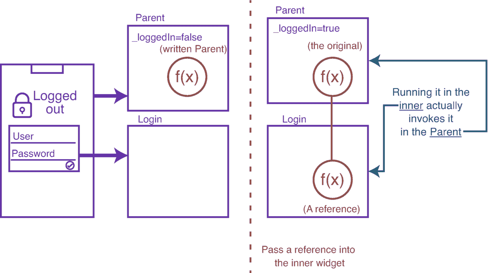
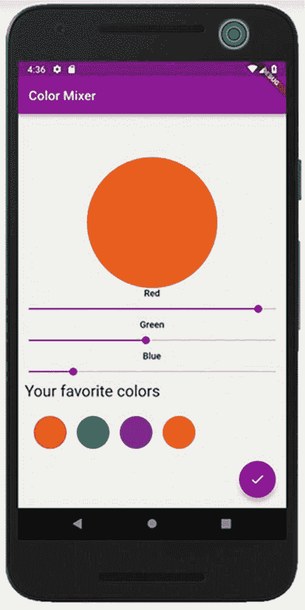
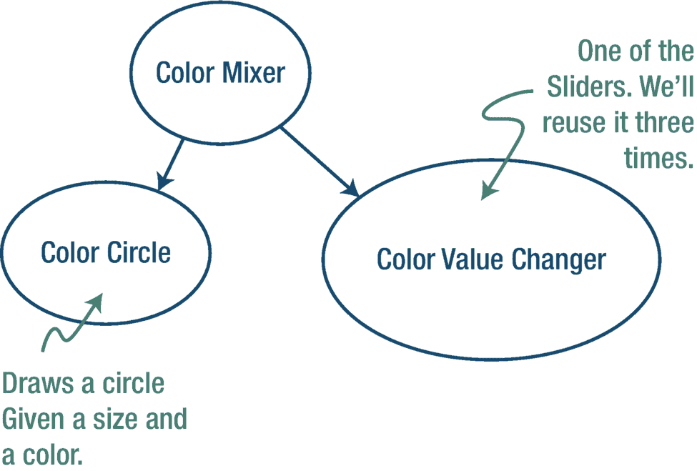
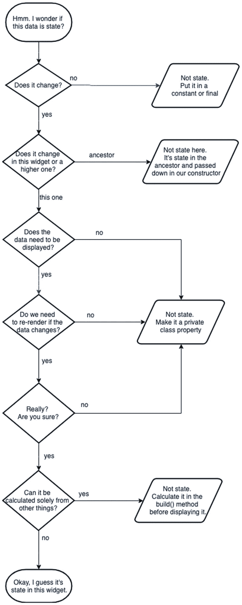

# 7. 管理状态

我们从第一章开始就一直铺垫这个主题，因为我们一直在编写继承自 `StatelessWidget` 的类。既然 Flutter 有一个 `State**less**Widget`，那么你可能会想它也应该有一个 `State**ful**Widget`。没错，你想对了。

但究竟什么是 `StatefulWidget`？它与无状态组件有何不同？我们何时选择一种而非另一种？`StatefulWidget` 的结构是怎样的？使用它有什么规则吗？如果数据发生变化，如何重新渲染？都是好问题，对吧？耐心点，年轻的绝地武士，我们将在本章中回答所有这些以及更多问题。

**警告** – 本章不适合胆小者。本章将介绍一些令人费解的概念。不是说你应付不了！我们只是提前给你打个预防针，这样当你遇到一些更深层次的概念和代码时，不会灰心。做好准备就好。

### 什么是状态？

> *状态是值发生变化时需要重新渲染的组件数据。*
> 
> *——Rap Payne ;-)*

`StatelessWidgets` 可能包含数据，但这些数据要么在组件存活期间不会改变，要么不会改变屏幕的外观。当然，当 Flutter 销毁并重新创建组件时，这些数据可能会改变，但这不算。要成为状态，它必须在组件处于活动状态时发生变化。

Flutter 提供了一些开箱即用且自带状态的组件。

| - `AppBar` | - `InputDecorator` |
| - `BottomNavigationBar` | - `MonthPicker` |
| - `Checkbox` | - `Navigator` |
| - `DefaultTabController` | - `ProgressIndicator` |
| - `Dismissible` | - `Radio` |
| - `DrawerController` | - `RefreshIndicator` |
| - `DropdownButton` | - `Scaffold` |
| - `EditableText` | - `Scrollbar` |
| - `Form` | - `Slider` |
| - `FormField` | - `Switch` |
| - `GlowingOverscrollIndicator` | - `TextField` |
| - `Image` | - `YearPicker` |

……以及更多。这些组件都拥有需要维护和监控的内部数据，以便当其变化时，Flutter 能重新渲染组件以在屏幕上显示所述变化。这很难理解吗？让我们举一个简单的例子：`TextField` 组件。

是的，我们正在讨论这个行为类似于文本框的内置组件；最终用户可以在其中输入字符。你当然意识到，当用户输入时，组件会跟踪并显示他们正在输入的内容。我的朋友，这就是状态——发生变化并实时显示的数据。

这听起来很棒，但我们如何编写自己的 `StatefulWidget` 呢？请继续阅读！


## `StatefulWidget` 的结构

每个 `StatefulWidget` 看起来都是这样的：

```
class Foo extends StatefulWidget {
  @override
  State createState() => _FooState();
}

class _FooState extends State {
  // 这里的私有变量即被视为“状态”
  @override
  Widget build(BuildContext context) {
    return someWidget;
  }
}
```

**注意：** 这里有两个类：一个是组件类，一个是状态类！

任何有状态的组件初看都很复杂，但一旦你熟悉了它的结构，就会变得得心应手。我们通常将这两个类写在同一个 Dart 文件中。组件类继承自 `StatefulWidget`，并且是公开的，因为它会被放置在其他组件中。

状态类始终是私有的，因为只有当前组件才能访问到这个类。状态类负责以下工作：

1. 定义和维护状态数据。
2. 定义 `build()` 方法——它知道如何在屏幕上绘制组件。
3. 定义数据收集或事件处理所需的任何回调函数。

那么组件类还剩下什么工作呢？不多了。组件类基本上只是让出空间而已。

那么为什么要把它们分开呢？有两个原因。首先，[单一职责原则](https://en.wikipedia.org/wiki/Single_responsibility_principle)（SRP）建议我们由一个部分负责绘制组件，另一个部分负责处理数据。这是良好的软件设计。其他框架也建议你将 UI 与状态管理分离，但大多数并不强制要求。Flutter 则强制执行。

其次是性能。重绘需要时间。重新计算状态也需要时间。当我们像这样分离它们时，Flutter 就有机会独立处理这两件事。有时，仅仅因为状态发生变化，并不需要进行重绘。这样我们就节省了重绘的周期。

此外，当我们重绘时，Flutter 会创建并绘制一个全新的组件。内存中的旧组件不再需要，因此会被取消引用并最终被垃圾回收。这很棒，但状态仍然需要保留。如果 Flutter 保留那个旧的状态对象，它就可以被重用，而不是被垃圾回收和重新创建。通过分离这些对象，Flutter 解耦了它们，使它们能够各自以最高效的方式被处理。这是一个精妙的设计！

## 关于状态的最重要规则！

对状态数据的所有更改都必须满足以下条件：

1. 在状态类中
2. 在 `setState()` 的函数调用内部：

```
setState(() {
  // 在此处对所有状态变量进行更改...
  _value = 42; // <-- ...就像这样
});
```

`setState()` 接收一个函数，这个函数会在……嗯……不久之后运行。Flutter 子系统会批量处理这些更改，并在它认为最优的时间统一执行。这极其高效，原因之一就是它会减少屏幕重绘的次数。

`setState()` 不仅以最高效、最可控的方式设置变量，而且它总是强制此组件重新渲染。它会在幕后调用 `build()`。最终结果是：当你更改一个值时，组件会自行重绘，用户就能看到新版本。请注意，如果此组件内部包含子组件（即*内部*组件），它们也会在 `build()` 方法中，因此调用 `setState()` 实际上会重绘此组件中的**所有内容**，包括其所有子树。

如果这让你瞬间惊慌，请记住 Flutter 使用的是虚拟组件树，所以即使我们告诉它绘制所有内容，它也能智能地判断屏幕的哪些部分不需要刷新，并且只在技术上重绘那些真正需要更新的部分。它超级高效！

## 向下传递状态

好吧，被你说中了。从技术上讲，你不能将状态从宿主组件传递给内部组件，因为状态只存在于组件*内部*。但我们确实想向下传递数据。这些数据可能是宿主组件中的有状态数据，并且可能会被转移到内部组件的状态中。

但这并不新鲜。我们在 `StatelessWidget` 中已经这样做过。提醒一下，你只需声明类级别的 final 变量，并在构造函数参数中提供它们的初始值即可。

但是，传递进来的值如何在状态类中可见呢？Flutter 为我们提供了一个名为 `widget` 的对象，它代表了 `StatefulWidget`。换句话说，如果在 `StatefulWidget` 中有一个名为 `"x"` 的变量，那么在 `State` 类中就可以通过 `widget.x` 来访问它：

```
class Foo extends StatefulWidget {
  // 从其宿主传递进来的值
  Foo({required this.passedIn, super.key});
  final String passedIn;

  State createState() => _FooState();
}

class _FooState extends State {
  @override
  Widget build(BuildContext context) {
    return Text(widget.passedIn); // <-- 看到了吗？"widget."！
  }
}
```

现在我们知道了如何将数据从宿主组件向下传递给内部组件，接下来我们反其道而行之，看看如何将数据从内部组件向上传递回宿主组件。

## 将状态向上提升

又……又被你说中了。你不能传递状态。但情况更糟。在 Flutter 中，你什么都不能往*上*传。

Flutter 的数据流是单向的。没有例外。数据只能从宿主组件向下流向内部组件。我们这样做已经，大概，有 200 页了吧？但有时我们需要数据从内部组件向上流回宿主组件。

例如，假设我们有一个 `Login` 组件，包含用户名/密码的 `TextField` 和一个提交按钮。我们会把这个 `Login` 组件放在其他组件中，前提是用户尚未登录。登录的业务逻辑必须放在 `Login` 组件本身。但当用户成功登录后，我们确实需要让宿主组件——甚至所有组件——知道用户现在已经认证通过。令牌需要被传回上层。但当我们无法将数据（状态）向上传递给宿主时，该怎么做呢？

诀窍在这里。不要将数据往*上*传。而是将处理方法往*下*传！在 Dart 中，函数是一等公民。这意味着它们的引用可以像数据一样被传递。这也意味着你可以将一个函数从宿主组件向下传递给内部组件。现在内部组件拥有了这个函数的句柄，它可以像调用自己的函数一样调用它。当然，当内部组件调用它时，如果它往这个函数传递了一个值，那么该值就会在最初定义该函数的宿主组件中可见。

这种技术被称为*提升状态*（图 7-1）。



**图 7-1** 提升状态


## 状态管理示例

我们最好通过一些代码来巩固这些概念。假设有一个应用，允许用户通过三个滑块分别调节红、绿、蓝数值来创建颜色。这些颜色会混合并显示在一个大圆中（图 7-2）。



图 7-2  
一个有状态组件的示例

显然，当滑块数据变化时，大圆需要重绘。这种需要触发重绘的变化数据就是状态！虽然我们可以在技术上把所有内容都放在一个名为`ColorMixer`的大组件中，但本书已经讲过，要将大组件拆分为更小、更专一的小组件。让我们提取出`ColorCircle`，用于顶部的大圆和底部的收藏颜色。既然我们有三个带标签的滑块，它们的功能完全相同，那么最好也将滑块/标签提取为一个`ColorValueChanger`组件。那么，图 7-3 中的布局如何？



图 7-3  
组件树的可能布局方式

`ColorMixer`必须是有状态的：

```
import 'package:flutter/material.dart';
import 'color_circle.dart';
import 'color_value_changer.dart';

// 有状态组件
class ColorMixer extends StatefulWidget {
  const ColorMixer({super.key});

  @override
  State createState() => _ColorMixerState();
}

// 状态类
class _ColorMixerState extends State {
  // 这三个变量是组件的'状态'
  int _redColor = 0;
  int _blueColor = 0;
  int _greenColor = 0;

  @override
  Widget build(BuildContext context) {
    return Column(
      children: [
        // 该组件使用了变量（即状态）
        ColorCircle(
          color: Color.fromRGBO(
              _redColor, _greenColor, _blueColor, 1),
          radius: 200,
        ),
        // 以下三个组件将 _setColor 函数向下传递，以便
        // *此处*的状态能在下层被修改。这被称为"状态提升"。
        ColorValueChanger(property: "Red", value: _redColor,
            changeColorValue: _setColor),
        ColorValueChanger(property:"Green",value:_greenColor,
            changeColorValue:_setColor),
        ColorValueChanger(property: "Blue",value:_blueColor,
            changeColorValue: _setColor),
      ],
    );
  }

  void _setColor(String property, int value) {
    setState(() {
      _redColor = (property == "Red") ? value : _redColor;
      _greenColor = (property == "Green") ? value : _greenColor;
      _blueColor = (property == "Blue") ? value : _blueColor;
    });
  }
}
```

请注意这一点：我们将`ColorCircle`所需的一切——颜色和尺寸——全部传递给了它。这两者在`ColorCircle`内部都不会改变，因此它可以是无状态的。如果`ColorMixer`的状态发生变化，我们只需调用`setState()`，从而重新渲染它，并进而重新渲染其所有子组件`ColorCircle`的实例。你看到了吗？子组件`ColorCircle`可以保持无状态，因为其有状态的父组件`ColorMixer`将状态变量向下传递了！

同样地，我们向每个`ColorValueChanger`传递一个初始值，并传递一个对`_setColor`方法的引用。请记住，向下传递一个函数意味着该函数在子组件中可用并可执行。尽管是子组件执行它，但该函数实际上存在于父组件中！

以下是在内部的`ColorValueChanger`组件中的实现方式：

```
import 'package:flutter/material.dart';

class ColorValueChanger extends StatefulWidget {
  // 从宿主组件传入的值
  const ColorValueChanger({
    required this.property,
    required this.value,
    required this.changeColorValue, super.key});

  final String property;
  final int value;
  final Function changeColorValue; // createState() => _ColorValueChangerState();
}

class _ColorValueChangerState extends State {
  int _value = 0;

  @override
  Widget build(BuildContext context) {
    _value = widget.value;
    return Column(
      children: [
        Text(widget.property),
        Slider(
          min: 0, max: 255,
          value: _value.toDouble(),
          label: widget.property,
          onChanged: _onChanged,
        )
      ],
    );
  }

  _onChanged(double value) {
    setState(() => _value = value.round());
    // 这里是调用从宿主（父）组件传入的设置函数的地方。
    widget.changeColorValue(widget.property, value.round());
  }
}
```

## 何时使用状态？

但你知道吗？避免复杂状态的最佳方法就是完全避免状态。几乎每一位专家都同意，如果能够完全避免状态，那就这样做。但何时需要状态、何时不需要，有时会令人困惑。

例如，颜色选择器上的标签是组件内的数据。这应该是状态吗？不，当然不是；它不会改变。`for`循环中的循环计数器呢？也不是；它从不会影响`build()`方法中的任何内容，因此不需要放入`setState()`中。看到了吗？状态有时是可以简化或消除的。

图 7-4 总结了如何判断。



图 7-4  
如何判断是否应在组件中使用状态

## 结论

现在你明白了。状态是可能发生变化并会以某种方式影响显示的数据。它必须在`setState()`方法内修改，否则用户永远无法看到变化。它只能私有地存在于`StatefulWidget`中——其他组件无法访问。

但这带来了一个非常、非常大的问题。如果状态是完全私有的，那么当我们需要在多个不同的组件之间共享数据时该怎么办？我们可以通过构造函数向下传递数据，也可以通过传递函数向上提升状态。但远亲组件之间呢？共享大量复杂数据呢？我们为你准备了几种解决方案，这正是下一章的主题——状态管理库！

脚注

## 状态管理库

我们在上一章学到的内容，即使组件树变得无限深，也能按预期工作。我们可以一直将状态向上提升并向下传递。但请意识到，随着你的应用变得越来越大，状态管理也会变得愈发复杂。当复杂度太高时，使用更高级的状态管理模式会更好。这些模式通常不易学习，但在你的应用发展到一定阶段时，它们就值得你付出努力去掌握。

在本章中，我们将探讨几种模式、几个组件和几个库。然后，我们将重点介绍两个库：一个简单的库，以及目前最流行的库——`Riverpod`。

### InheritedWidget

这是一个相对简单的解决方案，可能对于大多数需求来说过于简单了。`InheritedWidget`是 Flutter 内置的一个组件。本质上，它暴露了一小部分变量，这些变量对其组件树中的所有后代组件都是可用的。从某种意义上说，它创建了伪全局变量。它们在`InheritedWidget`之下的任何地方都可用，但只能以非常可控的方式访问。`InheritedWidget`定义了需要在其所有后代组件之间共享的变量。然后，后代组件可以沿着组件链向上查询`InheritedWidget`并访问这些变量。其他几种方法（Provider、Redux、Riverpod 等）都是对`InheritedWidget`的封装。

优点：是本章所有解决方案中最简单的。

缺点：尽管如此，对于许多 Flutter 新手来说，它仍然令人望而却步。它功能简陋，只适用于最基础的应用状态。


### BLoC 模式

BLoC 是业务逻辑组件的缩写，它既不是一个库，也不是一个小部件，而是一种设计模式。BLoC 模式最初是为了让代码能够在网页、移动应用和后端之间复用而创建的。由于它诞生于谷歌，Flutter 社区自然而然地接受了它，并一度使其成为状态管理的代名词。

BLoC 将数据视为流，并以响应式的方式改变状态。它将 UI（用户界面）与业务逻辑分离，使你的代码更具以下优势：

*   **可维护性** – 关注点分离更清晰，代码导航和更新更轻松。
*   **可测试性** – 你可以独立于 UI 交互来测试业务逻辑。
*   **可扩展性** – 有效处理复杂的应用状态。

BLoC 包含多个不同的部分：
*   `StreamControllers`：控制数据流
*   `StreamTransformers`：在数据流入时进行处理
*   `StreamBuilders`：在新值到达时运行，并将其渲染到 UI 中

优点：社区中有很多人可以（并且愿意）帮助你。它是一个可靠且经过充分验证的模式。

缺点：BLoC 理解起来和写起来都不简单。虽然有 `bloc` 库可以提供帮助，但大多数人在编写 BLoC 组件时并不使用该库，因此它处于非常底层的水平。

#### 一些库

##### ScopedModel

[ScopedModel](https://pub.dartlang.org/packages/scoped_model)^(¹⁵) 是一个由 Brian Egan 从 [Fuchsia](https://fuchsia.googlesource.com/)^(¹⁶) 代码库“厚颜无耻地借用”而来的库（嘿，这是 Brian 自己的话，可不是我的！他是个谦虚的人）。ScopedModel 创建了能够注册监听器的数据模型。每个模型在数据发生变化时通知其监听器，以便它们进行自我更新。巧妙的设计。

这是由 Brian 维护的一个外部第三方包。它构建在 `InheritedWidget` 之上，提供了一种稍好一些的方式来访问、更新和改变状态。它允许你轻松地将数据模型从父级小部件向下传递给其子孙后代，并在模型更新时重新构建使用该模型的所有子级小部件。

优点：很好地完成了分离表示层和数据的任务。与本章其他方法相比，它更易于理解。

缺点：该代码库目前未得到维护，可能是因为开发者倾向于使用更现代的解决方案。一些人认为 `ScopedModel` 在处理复杂应用时存在性能问题。

##### Redux 与 Hooks

我之所以包含这两个库，是专为 React 开发者准备的。这两个库都模拟了同名的 React 功能。如果你并非来自 React 世界，请跳过本节。但如果你热爱 React，这些可能是你最简单的选择。瞧，你已经跨越了学习曲线。[flutter_​redux](https://pub.dartlang.org/packages/flutter_redux)^(¹⁷) 由我们之前在 `ScopedModel` 中提到过的 Brian Egan 编写，[flutter_​hooks](https://pub.dartlang.org/documentation/flutter_hooks)^(¹⁸) 则由巴黎的 Rémi Rousselet 编写，你稍后将在 Provider 和 Riverpod 部分了解到他。

优点：性能非常好。可扩展性很强。

缺点：除非你已经熟悉 React，否则学习曲线非常陡峭。

##### Provider

我在这里提及 Provider，并不是因为你可能会用到它，而是因为你可能会听到它的名字，我不希望你被它诱惑。有更好的选择。Provider 一度是最流行的 Flutter 状态管理库。但它已被一个更优的选择所取代：Riverpod（在本章最后一节中介绍）。

优点：一个功能强大且相对简单的包。

缺点：由于其继任者 Riverpod 的出现，未得到积极维护。

##### 哇！好多包！

是不是感到困惑了？这不能怪你。这些包以不同的方式解决同一个问题，有些相似，另一些则采用截然不同的策略。没人期望你除了知道存在这些工具之外还有什么更多了解。当你听到有人说“我们的状态变得混乱了。也许我们应该考虑一下 BLoC 或 ScopedModel”时，你至少能明白他们在谈论哪种类型的东西。然后，你就可以深入研究这些技术，看看自己可能想用哪一个。

但是，要是能对一两种实际可用的解决方案有所了解，岂不是很好？让我们为其中两个状态管理解决方案编写一点代码：最简单的 `raw_state`，以及最流行且最健壮的 `flutter_riverpod`。

### Raw State

`raw_state` ([`https://pub.dev/packages/raw_state`](https://pub.dev/packages/raw_state)) 是学习 Flutter 的理想选择，这也是我们在此介绍它的原因。它也适用于非常简单的应用程序和启动你的 MVP。它通过创建一个名为 `rawState` 的全局变量来解决小部件之间的共享问题。一旦你执行 `flutter pub add raw_state` 并导入 `raw_state`，这个 `rawState` 变量就会自动定义。

```dart
import 'package:raw_state/raw_state.dart';
```

然后，在任何小部件中，你可以将任意数量的值写入 `rawState`：

```dart
String foo = "raw_state is stupidly simple";
rawState.set("aString", foo);
rawState.set("aDate", DateTime.now());
rawState.set("aMap", {"foo":"bar","baz":100} );
```

注意

键可以是任意字符串，值可以是任何东西——`String`、`double`、`int`、`bool`、`Array`、`Map`、对象……等等。

在任何其他小部件中，你可以从 `rawState` 读取这些值。只需调用 `get` 并传入键即可：

```dart
String foo = rawState.get("aString");
DateTime someDate = rawState.get("aDate");
Map aMap = rawState.get<Map>("aMap");
```

提示

数据类型（即泛型）是可选的，但出于安全原因，这是一种良好的实践。请注意，为了演示，我们在第一次使用时省略了它，但在其余部分都包含了。

`raw_state` 简单得离谱。也许太简单了。它缺乏许多其他库具备的许多保护机制和任何自动更新功能。因此，让我们把注意力转向最后一个库——Riverpod，它由前面提到的 Rémi Rousselet 编写。

### Riverpod

在撰写本文时，Riverpod 是首选的状态管理解决方案。它功能完备且健壮，并且比上面的一些库更简单。这是一个成功的组合。

警告

请不要误解。我并没有说 Riverpod 很简单。它并不简单。所以，如果你近期不打算使用 Riverpod，直接跳到下一章也没关系。我将列出使用 Riverpod 最简单的步骤，仅供你入门。但即便如此，它仍令人望而生畏。

以下是使用 Riverpod 的六个基本步骤。

一次性前期准备工作：

1. 安装 `flutter_riverpod`
2. 用 `ProviderScope` 包裹你的应用
3. 编写一个 `Provider`

然后，在每个需要的小部件中：

1. 继承自 `ConsumerStateWidget`
2. 使用 `ref.watch()` 读取数据
3. 使用 `ref.read()` 写入数据

让我们逐一审视这些步骤。

#### 1. 安装 `flutter_riverpod`

这一步很简单。要么将其添加到你的 `pubspec.yaml` 并运行 `flutter pub get`，要么直接运行：

```bash
flutter pub add flutter_riverpod
```

#### 2. 用 `ProviderScope` 包裹你的应用

记住，在你的 `main` 函数中，我们调用 `runApp(App())`。只需用从 `flutter_riverpod` 导入的 `ProviderScope` 包裹该应用即可：

```dart
void main() => runApp(
ProviderScope(
child: App()
)
);
```


### 3\. 编写一个 Provider

在存储值之前，我们需要为*每项*要共享的内容创建一个 provider。假设我们允许用户在一个 widget 中选择他们最喜欢的颜色，然后在其余 widget 中读取它。我们可以创建一个 `favColorProvier`:

```
final favColorProvider =
StateProvider((_) => Colors.red);
```

显然，`StateProvider` 是 Riverpod 的一部分。

##### 等等，你所说的这个 *Provider* 到底是什么？

准备工作已经完成，这些步骤只需一次性预先完成。在我们将注意力转向在单个 widget 中使用 Riverpod 之前，让我们先聚焦于这个 provider 本身。用 Riverpod 的术语来说，provider……嗯……*提供*一个保存的值给任何请求它的对象。为了在彼此封装、相互独立的 widget 之间共享值，我们会在一个 widget 中写入 provider，然后在另一个 widget 中从同一个 provider 读取。但是如何做到呢？

使用 Riverpod，我们不再继承自 `StatefulWidgets`。相反，我们要继承自 *Consumer*`StateWidgets`。明白了吗？你编写一个*提供*值的 provider，以及一个*消费*该值的 consumer。很巧妙，对吧？这个 consumer 拥有一个可以访问所有 provider 的 `ref` 属性。来看看……

### 4\. 继承自 ConsumerStateWidget

每个需要访问共享数据的 widget 都应该以略微不同的方式编写。

**不要这样做：**

```
class FavColor extends StatefulWidget {
const FavColor({super.key});
@override
State createState() => _FavColorState();
}
class _FavColorState extends State {}
```

**相反，应该这样做：**

```
class FavColor extends ConsumerStatefulWidget {
const FavColor({super.key});
@override
ConsumerState createState() => _FavColorState();
}
class _FavColorState extends ConsumerState {}
```

你看，神奇之处在于这些 Riverpod 提供的类有一个名为 `ref` 的属性。而 `ref` 知道所有你在上面创建的 provider。现在让我们来使用它。

### 5\. 使用 `ref.watch( )` 读取数据

在状态化 widget 中，从给定 provider 读取数据的最佳方式是使用 `ref.watch(theProvider)`，它会监视该 provider，并在 provider 中的值发生变化时，触发其所属的 widget 重新渲染。

```
Color favColor = ref.watch(favColorStateProvider);
int favNumber = ref.watch(favNumberStateProvider);
Person favPerson = ref.watch(favPersonStateNotifierProvider);
```

提示

你也可以使用 `ref.read()` 读取数据。只是 `ref.read()` 只绑定一次；`ref.read()` 不会实时更新，而 `ref.watch()` 可以。

### 6\. 使用 `ref.read( )` 写入数据

具有讽刺意味的是，你可以用 `ref.read()` 来写入数据。虽然还有其他方法，但这是最直接的方式。只需这样做：

```
ref.read(favColorStateProvider.notifier).state = newColor;
```

当你为这个 provider 的状态赋值时，它会设置值并通知所有监听者——那些之前使用 `ref.watch()` 订阅过的对象。

就是这样。你可以设置、写入和读取 Riverpod provider。我们就先讲到这里。这个健壮而强大的包还有更多内容，但你已经掌握了基本概念。我们的篇幅有限，而且 Riverpod 无疑会继续发展。所以，如果你准备深入探索（我建议你这样做），可以从这里开始：[`https://pub.dev/packages/riverpod`](https://pub.dev/packages/riverpod)。它会引导你前往 Riverpod 的主页和文档，获取更多信息。

## 结论

我们拥有的状态化 widget 越多，需要在它们之间传递的状态就越多。这可能会很快变得非常复杂，因此我们求助于像 Redux、Hooks、raw_state 和 ScopedModel 这样的包，但最流行的是 Riverpod，用以管理状态。当然，你也可以手动使用其他工具和技术，如 BLoC 和 InheritedWidget 来实现，但当你的应用规模变大时，这种方法就变得不切实际了。

既然我们现在可以处理 widget *内部*和 widget *之间*的数据，接下来让我们看看如何处理我们的应用与某个远程服务器之间的数据。让我们探讨如何发起 HTTP 调用来读取和写入数据。继续往下读！

脚注 1 2 3 4 5

