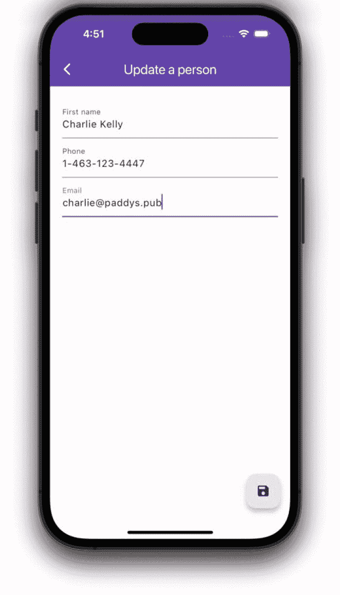
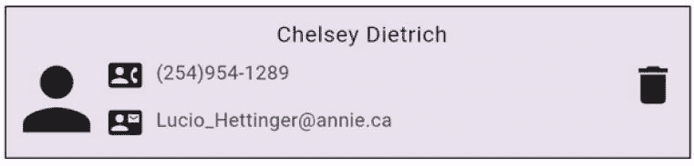

# 9\. 使用 HTTP 进行 RESTful API 调用

我们已经非常擅长管理应用程序的状态，但这些数据从何而来？本地文件？本地数据库？用户输入？当然可以。这些都是可能的来源，但真实的应用程序会从云端的某台服务器获取真实数据。你的应用程序会发起 HTTP 调用，最好是异步的 RESTful HTTP API 调用。它会等待并处理响应，然后通常显示这些数据。哇！这有很多流行词，对吧？在本章中，我们将学习这些术语的含义，以及如何在 Flutter 应用中处理所有类型的 HTTP 请求和响应。以下是需要了解的内容：

*   究竟什么是 API 调用
*   发起 HTTP GET 或 DELETE 请求
*   发起 HTTP POST、PUT 或 PATCH 请求
*   以最简单的方式处理响应
*   使用 `FutureBuilder` 和 `StreamBuilder` 进行更清晰的处理
*   使用强类型对象实现更清晰的代码

这将是我们本章的计划。此外，还将通过一个允许 HTTP 请求的 API 服务进行动手实践。为了确保大家在同一页面上（这里绝对是双关语），我们可能应该从 API 究竟是什么开始讲起。如果你已经熟悉，可以随意浏览或跳过。

## 什么是 *API* 调用？

Flutter 应用程序已经具备从微小的本地数据库读取数据的能力。但它无法读取位于*其他地方*的数据库。换句话说，你不能直接连接到 SQL Server/MongoDB/PostgresSQL 数据库并读取或写入记录。这是不可能做到的，即使你拥有数据库凭据。我的意思是，想想如果公共应用可以从任何地方连接并直接修改数据，会带来多么严重的安全隐患。因此，开发人员的做法是创建一个服务器端程序，以可控的方式进行读写，然后通过特定的协议（通常是 `https`）在特定地址上，将该程序暴露在你的网络或互联网上。

为了读取这些服务器端数据，任何用户都可以在发送其凭据（形式为用户名/密码，或更佳的方式是使用一个称为 API 密钥的唯一且秘密的密钥）后，发起 `http` 请求。

又是 *API* 这个术语。它代表应用程序编程接口（Application Programming Interface）。在不同情境下含义不同，但其默认含义已演变为开发人员为了读写数据而向其发送 `http` 请求的任何互联网地址。有大量公开可用的 API，也有许多选项供你自己创建。

当 API 响应时，它会返回一个数据流，这些数据几乎总是以 JSON^(¹⁹) 格式呈现。


## API 请求的几种类型

与 API 服务器的通信只通过少数几种类型完成（表 9-1）。

**表 9-1** HTTP 方法及描述

| HTTP 方法 | 意图 | 说明 |
| --- | --- | --- |
| `GET` | 读取记录 | 类似于数据库读取，仅向服务器请求数据 |
| `DELETE` | 删除记录 | 删除由提供的 ID 指向的记录，不返回数据 |
| `POST` | 插入新记录 | 即使已存在类似记录，也创建一条新记录 |
| `PUT` | 替换现有记录 | 用此记录覆盖现有记录，完全删除旧记录并在此位置添加新记录 |
| `PATCH` | 更新现有记录 | 保留原有记录，但用此请求中的数据更新其字段 |

此外还有 `HEAD`、`CONNECT`、`OPTIONS` 和 `TRACE` 用于其他类型的请求。典型应用很少使用这些方法。想了解的话，可以查阅 [`http://bit.ly/HTTPMethods`](http://bit.ly/HTTPMethods)。

开发者很少使用除 `GET`、`POST`、`PUT`、`PATCH` 和 `DELETE` 之外的方法。在 Flutter 中，所有这些都是通过导入 `http.dart` 使用一个 Dart 库来完成的。

首先，你需要在 `pubspec.yaml` 的依赖部分添加 `http` 包。当你运行 `flutter pub get` 后，该包将从 [`https://pub.dev/packages/http`](https://pub.dev/packages/http) 下载。

然后，在任何需要发出这些请求的 Dart 文件中导入 `http.dart`：

```dart
import 'package:http/http.dart';
```

这将暴露 `http` 类，该类包含与每个 HTTP 方法对应的方法。现在，让我们看看如何使用这个库发送请求。

## 发送 HTTP GET 或 DELETE 请求

我们先介绍 `GET` 和 `DELETE` 请求，因为它们是最简单的——它们永远没有请求体。^(²⁰) 事实上，唯一的复杂性在于 HTTP 请求是异步执行的。它们返回一个 `Future`^(²¹)，你需要用 `.then()` 处理或使用 `await` 等待它。所以你可以这样发出请求：

```dart
Uri uri = Uri.parse('https://us.com/people/1234');
Response response = await get(uri);
print(response.statusCode); // 希望是 200
Map person = json.decode(response.body);
print(person['name']);
print(person['phone']);
print(person['email']);
```

或者像这样使用 `.then()`：

```dart
get(uri).then((Response res) {
  print(res.statusCode); // 希望是 200
  Map person = jsonDecode(res.body);
  print(person['name']);
  print(person['phone']);
  print(person['email']);
});
```

`DELETE` 请求以相同方式完成。实际上，它们通常更简单，因为它们常常没有响应值。`DELETE` 要么成功且无返回值，要么失败并返回 400 或 500 系列的响应：

```dart
Response response = await delete(uri);
```

**注意**

在发送任何类型的 HTTP 请求时，你应该始终在发送之前对 URL 进行编码。这有助于确保 URL 有效，也有助于安全性，尤其是在获取用户输入时。你可以使用 `Uri.encodeComponent()`、`Uri.encodeQueryComponent()` 和/或 `Uri.encodeFull()` 来实现。像这样调用 `Uri.encodeFull`：

```dart
String url = Uri.encodeFull('http://us.com/api/ppl?query=Jo Ki');
```

为简单起见，我们将在示例中省略编码。但在实际开发中，请记住这一点。

## 发送 HTTP PUT、POST 或 PATCH 请求

`PUT`、`POST` 和 `PATCH` 与 `GET` 和 `DELETE` 非常相似。最大的区别在于 `PUT`、`POST` 和 `PATCH` 都需要请求体——通常是包含 JSON 格式键值对的字符串：

```dart
String payload = '''
{"first": "Kamala", "last": "Khan", "id": 374}
''';
Response response = await post(uri, body: payload);
```

与 `GET` 和 `DELETE` 请求一样，对此响应进行解析。

**注**

使用 `POST`、`PUT` 和 `PATCH` 时，我们正在将数据从客户端发送到服务器。明智的做法（有时也是必要的要求）是同时告知服务器我们是如何编码这些数据的。我们将在请求的 HTTP 标头中完成此操作。提供一个名为 `Content-Type` 的键，其值为 `application/json`。具体操作如下：

```dart
Map<String, String> headers = {'Content-Type': 'application/json'};
Response res = await post(url, headers: headers, body: payload);
```

既然说到这里，还有许多你可能觉得有用的标头变量，例如 `Accept`、`Accept-Encoding`、`Authorization`、`Content-MD5`、`Cookie`、`Date`、`Host`、`If-Modified-Since` 等。在此处了解它们：[`https://en.wikipedia.org/wiki/List_of_HTTP_header_fields#Request_fields`](https://en.wikipedia.org/wiki/List_of_HTTP_header_fields%2523Request_fields)。

从 API 发送 HTTP 请求并不难，对吧？我们很快就让 Flutter 应用能够发送请求、反序列化响应并将其打印到调试控制台。但 Flutter 的核心在于将这些数据显示在炫酷的组件中。那么，我们该如何将请求集成到组件中呢？

## HTTP 响应到组件

有几种方法可以等待 `Future` 解析然后显示数据。我们通过向你展示三种方法来简化说明：

1.  暴力法
2.  `FutureBuilder`
3.  `StreamBuilder`

暴力法显而易见且易于理解，但我认为你会更喜欢 `FutureBuilder`/`StreamBuilder`，因为它们更简洁、更优雅。

### 暴力法——简单的方式

你已经拥有了显示数据所需的所有工具：你理解 `Future`，也知道如何告诉有状态组件用新数据重绘自身——`setState()`。因此，只需在 `.then()` 内部或 `await` 之后放置一个 `setState()` 即可：

```dart
Uri uri = Uri.parse('http://us.com/api/people/12345');
Response response = await get(uri);
Map body = json.decode(response.body);
String first = body['name'];
String email = body['email'];
String imageUrl = body['profilePictureUrl'];
Widget card = Stack(
  children: [
    Image.network(imageUrl,
        height: 300, width: 300, fit: BoxFit.cover),
    Text("$name"),
  ],
);
setState(() => _cardWidget = card);
```

当然，只要你的构建方法在某处显示了 `card`，一旦 `Future` 解析完毕（这只有在 HTTP `GET` 请求返回数据时才会发生），它就会用正确的数据进行渲染。小菜一碟！但这并非最优雅的方式。


### `FutureBuilder` – 更优雅的方式

更好的解决方案可能是使用 `FutureBuilder` 组件。当你面临一个 `Future`，其完成后产生的数据需要在 Flutter 组件中渲染时，请考虑使用 `FutureBuilder`。这个场景听起来熟悉吗？应该很熟悉，因为这正是我们在 Flutter 中使用 `Future` 的主要原因。之前那个简单的代码示例，使用 `FutureBuilder` 可以更加简洁地实现：

```
FutureBuilder(
future: get(uri),
builder: (ctx, AsyncSnapshot snapshot) {
if (snapshot.connectionState != ConnectionState.done) {
return const CircularProgressIndicator();
}
if (snapshot.hasError) {
return Text('噢不！出错了！ ${snapshot.error}');
}
if (!snapshot.hasData) {
return const Text('没有可显示的内容');
}
final Map body =
json.decode(snapshot.data.body);
final int statusCode = snapshot.data.statusCode;
if (statusCode > 299) {
return Text('服务器错误：$statusCode');
}
String first = body['name'];
String imageUrl = body['profilePictureUrl'];
return Stack(
children: [
Image.network(imageUrl,
height: 300, width: 300, fit: BoxFit.cover),
Text("$name"),
],
);
},
);
```

这里不再需要 `setState()`，因为 `FutureBuilder` 可以直接访问 `Future` 本身，从而知晓何时以及如何重绘自身。在上面的例子中，你可以看到它能够针对每种情况渲染不同的内容：在等待 `Future` 完成时显示 `ProgressIndicator`，出现错误时显示错误信息，`Future` 中没有数据时显示提示，当然，数据成功返回时则显示对应的组件。

**注意**

在访问 `snapshot.data` 之前，务必检查 `snapshot.hasData` 和/或 `snapshot.hasError`。同时要留意 HTTP 状态码，它位于 `response.statusCode` 中。如果该数字是 4xx 或 5xx，说明你从服务器收到了一个有效响应，但请求本身有问题，此时你的数据将是 `null`。

### `StreamBuilder`

`FutureBuilder` 对 `Future` 的处理方式，就是 `StreamBuilder` 对 `Stream` 的处理方式。这两个类几乎完全相同，具有相同的格式，使用相同形式的快照，并同样检查 `snapshot.hasError` 和 `snapshot.hasData`。但有时候，我们处理的不是像 Future 那样的一次性数据返回，而是一个*数据流*，它可能以间断或连续的方式不断到达。在这种情况下，你应该使用 `StreamBuilder`：

```
StreamBuilder(
stream: anythingThatReturnsAStream(),
builder: (BuildContext ctx, AsyncSnapshot snapshot){
// 以下大部分内容与 FutureBuilder 类似，
// 但这里的数据是一个文档集合，每个文档代表一条记录
if (snapshot.connectionState != ConnectionState.done) {
return const CircularProgressIndicator();
}
if (snapshot.hasError) {
return Text('噢不！出错了！ ${snapshot.error}');
}
if (!snapshot.hasData) {
return const Text('暂无数据，请稍候...');
}
return ListView.builder(
itemCount: snapshot.data.documents.length,
itemBuilder: (BuildContext context, int i) {
String first = snapshot.data.documents[i]['name'];
String imageUrl =
snapshot.data.documents[i]['imageUrl'];
return Stack(
children: [
Image.network(imageUrl,
height: 300, width: 300, fit: BoxFit.cover),
Text("$name"),
],
),
},
);
);
},
);
```

**提示**

像这样编写能够根据新到达的数据自动唤醒并更新自身的代码，有一个专门的术语：*响应式编程*。当我们的应用能够感知外部影响并指示其做出相应反应时，就实现了响应式编程。你可能听说过像 `rxJava`、`rxJS` 和 `rx.NET` 这样的响应式扩展，它们是为这种风格设计的类库。毫无疑问，Flutter 也有一个对应的库，名为 `rxDart`。你可以在 [`https://github.com/ReactiveX/rxdart`](https://github.com/ReactiveX/rxdart) 找到它。

## 强类型类

至此，你已经知道如何对 API 发起 HTTP 调用，并在收到响应后如何解包数据并使用它。这为我们使用类型化反序列化模式将这些数据转换为强类型类提供了绝佳条件。

**注意**

发起 HTTP 调用并不强制要求这样做。这仅仅是一种更清晰的处理调用并将数据拉取到可预测结构中的方法。HTTP 数据本质上是非结构化的。这是许多 Flutter 开发者使用的一种最佳实践，但并非强制要求。所以，如果你不喜欢，完全可以跳过。

类型化反序列化通过三个简单步骤完成：

1.  创建业务类。

2.  编写一个 `.fromJSON()` 方法和/或一个 `.fromJSONArray()` 方法。

3.  在通过 HTTP 调用读取数据时，使用 `.fromJSON()` 来实例化对象。

### 创建一个业务类

假设我们要读写人员数据。我们应该创建一个 `Person` 类：

```
class Person {
String? name;
String? email;
String? imageUrl;
}
```

### 编写一个 `.fromJSON()` 方法

这应该是一个静态方法，它会返回业务类（这里是 `Person`）的一个实例：

```
class Person {
// 此处编写更多类代码
static Person fromJson(String jsonString) {
Map data = jsonDecode(jsonString);
return Person()
..name = data['name']
..email = data['email']
..imageUrl = data['imageUrl'];
}
// 可能这里还有更多类代码
}
```

注意这里使用了 Dart 的级联运算符，并省略了 `new` 关键字。两者都是最佳实践。

### 使用 `.fromJSON()` 来实例化对象

“实例化”这个词的字面意思是“注水”。在这个上下文中，数据就是水，我们通过将数据添加到新创建的 `Person` 对象中来“注水”。你可以使用 `.get()` 方法从 HTTP 服务读取数据，然后像这样将其传入 `.fromJSON()`：

```
// 发起 HTTP 调用
final Response res = await get(url);
// 从响应体（一个 JSON 字符串）中实例化一个 Person 对象
Person p = Person.fromJson(res.body);
```

看到代码是多么简洁和直接了吗？

我想此刻，你可能想要实践一下这些新学到的知识。接下来，我们就通过一个免费的 API 服务来练习。

## 一个大综合示例

一个真正的 API 服务会涉及一个数据库，并暴露 GET、POST、DELETE、PUT 和/或 PATCH 等端点，这些都需要在服务器端进行大量设置。你最终肯定想达到那种水平，但除非你是全栈开发者，否则那是后端人员的事情。现在，我们先使用 `JSONPlaceholder`，一个用于测试 API 的免费服务。你可以从 [`https://jsonplaceholder.typicode.com/guide`](https://jsonplaceholder.typicode.com/guide) 了解它。

**注意**

`JSONPlaceholder` 接受所有类型的 RESTful 请求，但出于显而易见的原因，他们不能让全世界在未经认证的情况下进行 `PUT`、`POST` 和 `DELETE` 操作。所以他们实际上不会更改任何服务器数据。如果该服务支持，我们编写的代码本可以更改服务器数据，但既然它不支持，请勿期望看到你的更改被持久化。

如果你想测试这个服务器，可以在你喜欢的浏览器中打开 [`https://jsonplaceholder.typicode.com/users`](https://jsonplaceholder.typicode.com/users)，你将看到前十位用户。恭喜，你已经成功发起了一个 GET 请求。再试试打开 [`https://jsonplaceholder.typicode.com/users/1`](https://jsonplaceholder.typicode.com/users/1)，你将看到用户 ID 为 1 的那个人。事实上，你可以尝试不同的 ID 来查看不同的用户。

另外三种 HTTP 方法则不那么简单。你需要使用像 `cURL`、`Postman` 或 `SoapUI` 这样的工具来发送 `POST`、`PUT` 或 `DELETE` 请求。

| 方法 | URL | 功能 |
| --- | --- | --- |
| `DELETE` | [`https://jsonplaceholder.typicode.com/users/1`](https://jsonplaceholder.typicode.com/users/1) | 删除用户 #1 |
| `PUT` | [`https://jsonplaceholder.typicode.com/users/1`](https://jsonplaceholder.typicode.com/users/1) | 更新用户 #1 |
| `POST` | [`https://jsonplaceholder.typicode.com/users`](https://jsonplaceholder.typicode.com/users) | 创建新用户 |

那么我们如何在应用中使用这些方法呢？继续往下看吧！


### 应用程序概览

启动时，应用程序会发送一个 `GET` 请求来读取用户列表，并绘制屏幕来显示这些用户（图 9-1）。


图 9-1：人物卡片列表

当用户点击垃圾桶图标时，应用程序会发送一个 `DELETE` 请求来删除该人员。

当用户点击任意用户卡片时，我们会显示一个包含该用户当前信息的表单（图 9-2），用户可进行修改并保存。点击保存的 FAB 按钮会向服务器发送一个 `PUT` 请求。



图 9-2：用于添加或更新人员的“upsert”表单

类似地，当用户点击人员列表上的“+”FAB 按钮时，我们会显示相同的表单，但字段为空，以便他们创建新用户。

### 创建 Flutter 应用

这个项目会很有趣，因为这是我们第一次将本书中的多个主题结合起来。首先，使用 `flutter create people_maintenance` 创建 flutter 应用。接下来，确保已安装 `http` 包。

```
flutter pub add http
```

打开 `main.dart` 并找到你的 `MaterialApp` 组件。移除“home”属性，并添加两个命名路由：

```
routes: {
'/': (_) => const ListPeople(),
'/upsert': (_) => const UpsertPerson(),
},
```

然后创建两个新的 `StatefulWidget`，一个命名为 `list_people.dart`，另一个命名为 `upsert_person.dart`。我们稍后会填充它们的细节。但首先，创建一个业务类来表示 `Person` 对象可能是个好主意。

### 创建强类型业务类

由于我们要处理 `Person` 对象，创建一个 `Person` 类来保存每个人员可能是个好主意。这个可选的最佳实践有助于避免在序列化和反序列化服务器数据时出现错误，并为我们提供一个集中管理所有与 `Person` 相关逻辑的地方：

```
import 'dart:convert' show jsonDecode;
class Person {
Person({this.id, this.name, this.email, this.phone});
int? id;
String? name;
String? email;
String? phone;
// 单个人员的类型化反序列化模式
static Person fromJson(String jsonString) {
Map json = jsonDecode(jsonString);
return Person(
id: json['id'],
email: json['email'],
name: json['name'],
phone: json['phone']);
}
Map toJson() =>
{'id': id, 'email': email, 'name': name, 'phone': phone};
// List 的类型化反序列化模式使用 .map() 方法
static List fromJsonArray(String jsonString) {
List json = jsonDecode(jsonString);
return json
.map((p) => Person(
id: p['id'],   email: p['email'],
name: p['name'], phone: p['phone']))
.toList();
}
}
```

### list_people.dart

我们很快会从 RESTful 服务中读取人员列表，并希望显示他们的数据。`PeopleList` 组件负责显示这个人员列表：

```
import 'package:flutter/material.dart';
import './people.dart';
import './person_widget.dart';
import './person.dart';
class ListPeople extends StatefulWidget {
const ListPeople({super.key});
@override
State createState() => _ListPeopleState();
}
class _ListPeopleState extends State {
@override
Widget build(BuildContext context) {
return Scaffold(
appBar: AppBar(title: const Text('People')),
body: scaffoldBody,
floatingActionButton: FloatingActionButton(
child: const Icon(Icons.add),
onPressed: () {
Navigator.pushNamed(context, '/upsert');
},
),
);
}
// 注意我们如何提取细节以便让组件对你更抽象。
// 下面我们对 PersonWidget 也做了同样处理。
Widget get scaffoldBody {
return FutureBuilder(
future: fetchPeople(), // 获取人员列表的方法
builder: (ctx, snapshot) {
if (snapshot.hasError) {
return Text('哦不！出错了！ ${snapshot.error}');
}
if (!snapshot.hasData) {
return const Text('未找到人员');
}
// 将 JSON 数据转换为 Person 数组
List people =
Person.fromJsonArray(snapshot.data.body);
// 将人员列表转换为组件列表
List personTiles = people
.map((Person person) => PersonWidget(
person: person,
editPerson: () => setState(() {
Navigator.of(context)
.pushNamed('/upsert', arguments: person);
})))
.toList();
// 在可滚动的 ListView 中显示所有人员卡片
return ListView(
children: personTiles,
);
},
);
}
}
```

`PersonWidget` 是在屏幕上绘制每个 `Person` 的组件（图 9-3）。由于这不是本章的重点，我们暂时省略其细节。但你可以查看 GitHub 仓库以了解细节。



图 9-3：每个 `PersonWidget` 显示一个人员

### Flutter 中的 GET 请求

回顾一下 `getScaffoldBody()` 方法。它包含一个 `FutureBuilder`。`future` 属性指向一个名为 `fetchPeople()` 的方法，该方法只是向 URL 发送一个 `GET` 请求，该 URL 会以 JSON 数组的形式返回 `Person` 记录：

```
const String _baseUrl =
'https://jsonplaceholder.typicode.com';
Future fetchPeople() {
Uri uri = Uri.parse('$_baseUrl/users');
return get(uri);
}
```

一旦你创建了 Flutter 基础设施，`GET` 请求就相当简单，对吧？

### Flutter 中的 DELETE 请求

每个 `PersonWidget` 右侧都有一个垃圾桶 `IconButton`。点击它会调用 `deletePerson()` 方法，接收我们想要删除的人员。这个 `deletePerson()` 方法应该发送一个 HTTP `DELETE` 请求，通过 ID 指定要删除的人员：

```
Future deletePerson(person) {
Uri uri = Uri.parse('$_baseUrl/users/${person.id}');
return delete(uri);
}
```

### upsert_person.dart

我们已经处理了读取人员和删除人员的功能。但添加新人员需要一个表单供用户输入信息。细心的读者会注意到，更新现有人员也需要一个相同的表单。为了遵循 DRY 原则^(²²)，让我们创建一个表单并同时用于添加和更新操作。

```
class _UpsertPersonState extends State {
late Person person;
@override
Widget build(BuildContext context){
// 获取导航期间设置的'当前'人员。如果该人员
// 为 null，则我们正在添加新人员，必须实例化一个。
// 如果该人员不为 null，则我们正在更新该人员。
Person? routePerson =
ModalRoute.of(context)?.settings.arguments as Person?;
person = (routePerson == null) ? Person() : routePerson;
return Scaffold(
appBar: AppBar(
title: Text(
(person.id == null) ? '添加人员' : '更新人员',
),
),
body: _body,
floatingActionButton: FloatingActionButton(
onPressed: () {
// 保存人员信息
upsertPerson(person);
// 然后返回到来的地方
Navigator.pop(context);
},
child: const Icon(Icons.save),
),
);
}
Widget get _body {
// 表单代码请查看 github。
}
}
```

注意，在 FAB 的 `onPressed` 处理程序中，我们保存了表单数据并调用了 `upsertPerson()`。以下是它的实现：

### Flutter 中的 POST 和 PUT 请求

如果是添加操作，我们希望进行 `POST` 调用。如果是更新操作，我们希望进行 `PUT` 调用：

```
Future upsertPerson(Person person) {
final String payload = '''
{
"id": ${person.id},
"name":"${person.name}",
"phone":"${person.phone}",
"email":"${person.email}"
}
''';
final headers = {'Content-type': 'application/json'};
// 如果 id 为 null，则是在添加。如果不是，则是在更新。
if (person.id == null) {
Uri uri = Uri.parse('$_baseUrl/people');
return post(uri, headers: headers, body: payload);
} else {
Uri uri = Uri.parse('$_baseUrl/people/${person.id}');
return put(uri, headers: headers, body: payload);
}
}
```


## 结论

不算太糟，对吧？我们从对通过 HTTP 读写数据几乎一无所知，到能够使用一些相当高级的技术（如类型化反序列化模式和 `FutureBuilder` 组件）来完成一个综合性示例。

如果你按照我上面的代码示例操作，你的应用已经能够完美地读取 HTTP 数据。但它看起来仍然不会像截图那样。你看，我使用了样式和主题来让它更赏心悦目。样式对我们来说仍然有点神秘。嘿，让我们在下一章揭开这个谜团吧！

脚注 1   2   3   4

