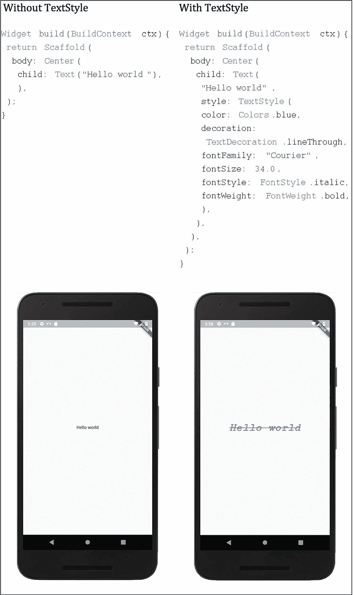
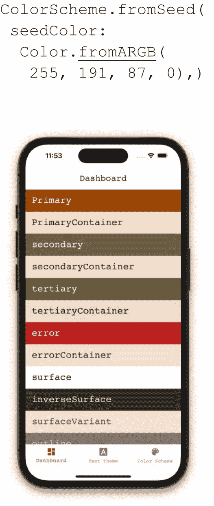
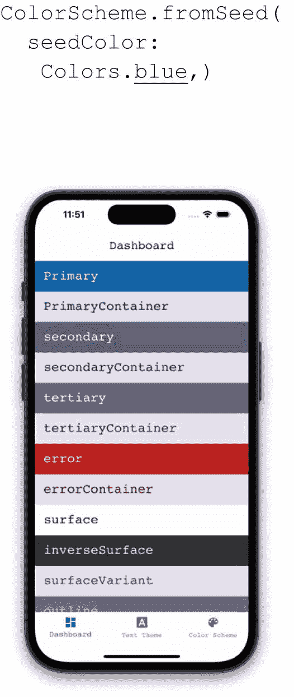
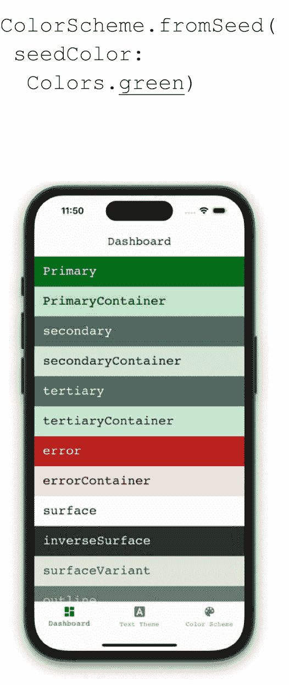
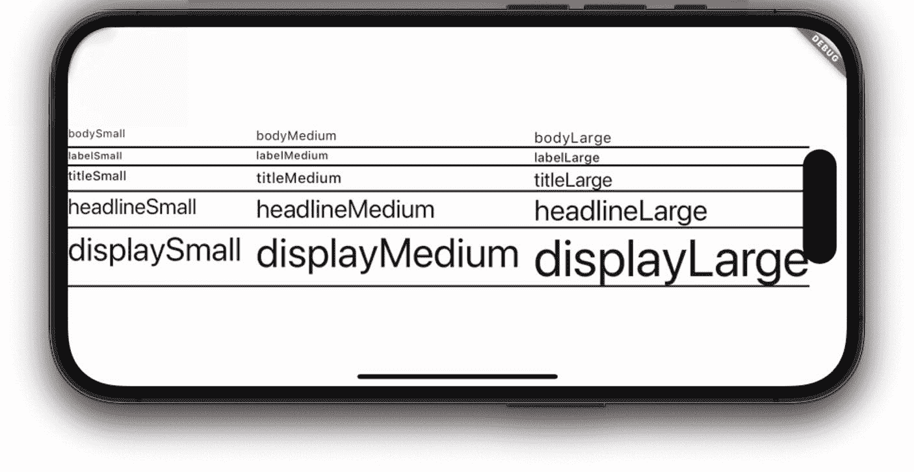
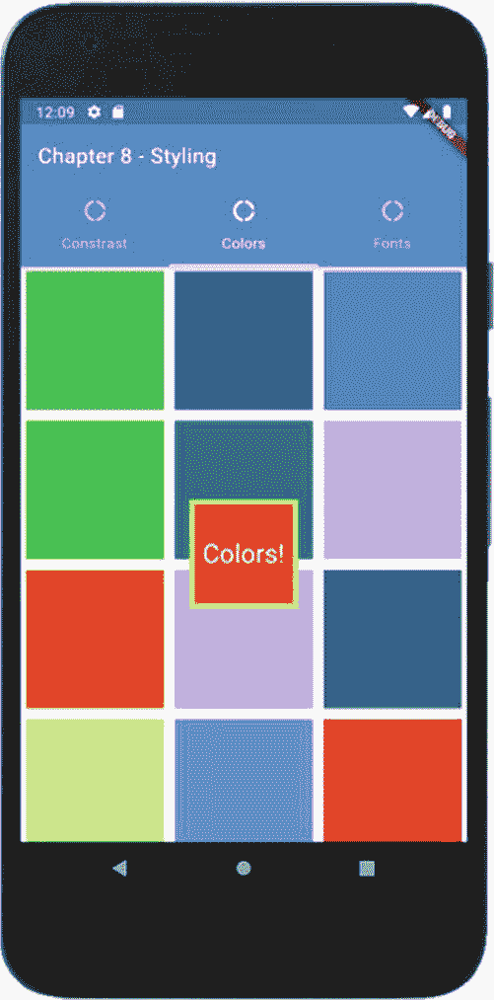
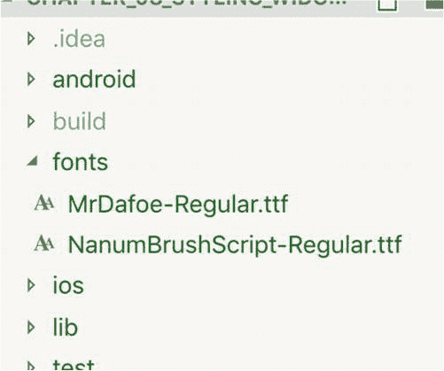
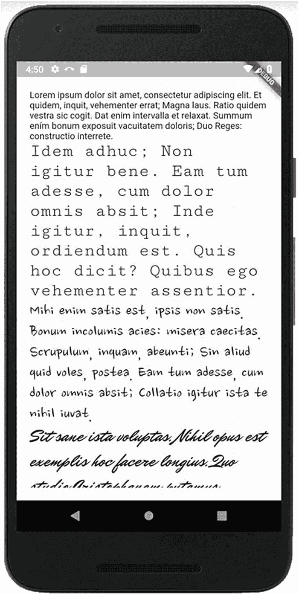

# 10. 使用主题进行样式设计

为组件设置样式对你来说并不完全陌生。我们在之前的章节中已经触及了一些小的样式特性，并且在代码示例中你也看到了样式技术。但本章，我们将深入探讨样式。终于到了！

你可以始终进行底层样式设计，所以我们先从它开始。然后，我们将过渡到更复杂但更清晰的——使用主题。最后，我们将通过颜色和自定义字体的细节来结束本章。

## 思考 Flutter 样式

Flutter 中的样式借鉴了 Android、iOS 开发和 Web 开发的最佳理念。但它并没有*完全照搬*它们的技术。Flutter 有自己的方式，如果将 Web 的类比过度延伸，那将是一个错误。Flutter 的样式不是 CSS。虽然 CSS 有某些属性会传递给子元素，但 Flutter 样式*不会*继承。例如，你*不能*在你的自定义组件上设置字体系列，然后让其中所有的 `Text`、`TextField` 和按钮都立即开始使用该字体渲染。为了实现这种效果，我们需要创建并应用一个主题。但首先，让我们学习如何将样式应用到元素上。

## 单独样式

我们在之前的章节和代码示例中已经窥见过这一点。大多数组件都接受一个 `style` 属性，以及通常与样式相关的属性，如内边距、边框等。你可以（有时也确实会）手动设置这些值，通常是在你只需要对某个组件的单个实例（例如一个单独的 `Text` 组件）进行样式设置时。

### 文本样式设计

```
Text(aString, style: TextStyle(
fontSize: 12.0,
fontWeight: FontWeight.bold,
color: Colors.blue,
fontStyle: FontStyle.italic,
)),
```

`Text` 组件有一个 `style` 属性，它接受一个 `TextStyle` 对象（图 10-1）。



图 10-1

有样式和无样式的对比

你只需将 `style` 属性设置为一个 `TextStyle` 组件的实例，并设置其属性。`TextStyle` 支持大约 20 个属性。以下是最常用的几个：

*   `color` – 任何有效的 1600 多万种颜色之一
*   `decoration` – `TextDecoration.underline`、`overline`、`strikethrough`、`none`
*   `fontSize` – 双精度浮点数。字符的高度（像素数）。默认大小为 14.0 像素
*   `fontStyle` – `FontStyle.italic` 或 `normal`
*   `fontWeight` – `FontWeight.w100` 到 `w900`。或者 `bold`（即 `w700`）或 `normal`（即 `w400`）
*   `fontFamily` – 一个字符串

`fontFamily` 是一个更大的话题，我们将在本章末尾讨论。

许多组件都有一个 `style` 属性，如果你只需要设置一个组件的样式，这是最佳方式。但最佳实践是尽可能避免使用单独样式。创建并应用一个主题会更好、更清晰。

## 批量更改值

真人真事。我有一个接近完成的应用。它美轮美奂。我从客户的品牌标志中选择了颜色，以为他们会感激我遵循他们的营销方案。嗯，他们的一种颜色是深栗色，我大量使用了它。我的客户讨厌那种颜色，认为它的红色调会传达“危险”或“错误”的信息。你知道吗？他们是对的！我之前就是没建立那种联系。所以我当然想把它全部改掉。

现在，想象一下我必须做什么。遍历整个应用？在数百个 `Text` 组件、边框、阴影、按钮、卡片和磁贴中找到所有出现该颜色的地方？不。因为我使用了主题，在客户等待的时候，我在一个地方就把它改好了。事实上，我们反复尝试了不同的颜色，直到找到他们喜欢的配色方案。这超级简单，一点也不麻烦！让我们来看看使用主题设置样式的正确方法。

## 主题

当你使用主题时，你可以预先在一个文件中一次性地定义样式。为什么呢？

1.  你的整个应用会有一致、连贯的外观和感觉。
2.  在整个应用中更改样式变得几乎不费吹灰之力。

使用主题包括五个相当简单的步骤：

1.  设置 `ColorScheme`
2.  设置 `TextTheme`
3.  创建特定组件的主题
4.  将所有内容组合到主题中
5.  如有需要，覆盖底层组件的样式

让我们来逐一完成这些步骤。

### 1. ColorScheme（配色方案）

`ColorScheme` 构成了应用的基本颜色：

*   `primary` – 主要品牌颜色
*   `secondary` – 强调色
*   `tertiary` – 较不突出的颜色
*   `error` – 用于突出显示错误
*   `background` – 常规背景颜色
*   `outline` – 用于边框
*   `surface` – 用于卡片和容器背景色

其中四种颜色——`primary`、`secondary`、`tertiary` 和 `error`，各自进一步细分为“on”、“container”和“onContainer”。例如，`primary` 有：

*   `primary` – 主要品牌颜色
*   `onPrimary` – 与 `primary` 对比鲜明的颜色；适合阅读
*   `primaryContainer` – 适合 `primary` 的背景色
*   `onPrimaryContainer` – 在 `primaryContainer` 背景上可读的文本颜色

这些都是经过科学选择、看起来赏心悦目的颜色，它们由单一的主色（*种子*颜色）生成。

```
var _scheme = ColorScheme.fromSeed(seedColor: );
```

**注意：** `ColorScheme.fromSwatch( )` 本身并未废弃，但它是为 Material 1 和 2 设计的。如果你使用的是 Material 3 及更高版本，请使用 `ColorScheme.fromSeed( )`。

来看看三种不同配色方案下的标准颜色（图 10-2 至 10-4）：



图 10-4

焦橙色方案



图 10-3

蓝色方案



图 10-2

绿色方案

你当然可以手动创建 `ColorScheme` 对象并设置其每种颜色，但那工作量巨大！相反，让 Flutter 通过 `ColorScheme.fromSeed()` 为你完成创建初始方案的艰巨工作，并提供你的种子颜色。

**提示：** 除了上面列出的颜色之外，还有 `shadow`、`scrim`、`surface`、`surfaceVariant` 等——总共大约 30 种。不必费心去记住它们。既然你已经明白了概念，到时候查一下你需要的即可。

如果你决定调整一种或多种默认颜色，请使用 `copyWith()`：

```
ColorScheme _colorScheme = ColorScheme.fromSeed(
seedColor: Colors.green,
).copyWith(
error: Color.fromARGB(255, 191, 87, 0),
onError: Colors.white,
);
```

这将用一个命令设置所有颜色。


### 2\. `TextTheme`

您的`textTheme`由 15 个`TextStyle`组成。设置它们将自动设置某些小部件的样式。例如，更改`bodyMedium`的`textStyle`将依次改变您添加的每个`Text`小部件、每个`ListItem`和每个`Navigator`的外观。设置`labelLarge`的`textStyle`将依次设置您添加的每个`TextButton`、每个`ElevatedButton`、每个`FAB`和每个`Chip`。您有以下通用分组：

*   Display
*   Headline
*   Title
*   Body
*   Label

在每个组别背后，您都有 `small`、`medium` 和 `large` 三种尺寸。图 10-5 展示了它们的外观。



**Figure 10-5** 实际尺寸下的 `TextTheme` 文本样式

同样，我建议使用`.copyWith()`来更改默认值。例如，如果您想让每个`Text`小部件更大，可以这样做：

```dart
TextTheme _textTheme = const TextTheme().copyWith(
  bodyMedium: const TextStyle().copyWith(fontSize: 18.0),
);
```

> **小贴士**
> `.copyWith()` 是 Dart 中一种常见的模式。许多许多类都编写了`.copyWith()`方法，允许您对实例的副本进行增量更改。留意这种模式，您会惊讶于它出现的频率。事实上，在您自己的类中编写一个`.copyWith()`方法，您的开发者同行们会感谢您的。

### 3\. 小部件特定主题

当您不喜欢默认样式时，许多其他显示小部件也具有您可以覆盖的样式。例如，如果您想更改所有`AppBar`和所有`ListTile`的外观该怎么办？

```dart
// Widget-specific themes
AppBarTheme _appBarTheme = const AppBarTheme().copyWith(
  foregroundColor: _colorScheme.onTertiaryContainer,
  color: _colorScheme.tertiary,
  titleTextStyle: _textTheme.displayLarge!
    .copyWith(fontFamily: 'Courier'));
ListTileThemeData _listTileThemeData = ListTileThemeData(
  tileColor: _colorScheme.secondary,
  textColor: _colorScheme.onSecondary,
  contentPadding: const EdgeInsets.all(10.0));
```

请注意，这些主题的层级要低得多，并且仅适用于那些特定的部件。许多小部件都有自己的主题，这些主题由特定于该小部件类型的样式组成。当然，一旦在`Theme`中设置并应用于`MaterialApp`，所有该类型的小部件都将遵循该主题。实际上，您拥有相当多的小部件主题：

`appBarTheme`, `textButtonTheme`, `elevatedButtonTheme`, `cardTheme`, `inputDecorationTheme`, `iconTheme`, `sliderTheme`, `tabBarTheme`, `drawerTheme`, `tooltipTheme`, `chipTheme`, `dialogTheme`, `pageTransitionTheme`, `floatingActionButtonTheme`, `NavigationRailTheme`, `snackBarTheme`, `bottomSheetTheme`, `popupMenuTheme`, `bannerTheme`, `buttonBarTheme`, `bottomNavigationBarTheme`, `timePickerTheme`, `outlinedButtonTheme`, `textSelectionTheme`, `dataTableTheme`, `checkboxTheme`, `radioButtonTheme`, `sliderTheme`, `switchTheme`, `progressIndicatorTheme`。

### 4\. 将它们整合到一个主题中

是时候将所有这些整合到一个主题中了。我们已经写了很多代码，对吧？主题比您预期的要冗长得多，所以我建议在一个单独的文件中创建它，例如在`theme.dart`中：

```dart
ThemeData themeData = ThemeData(
  colorScheme: _colorScheme,
  textTheme: _textTheme,
  // Widget-specific themes only when needed
  appBarTheme: _appBarTheme,
  listTileTheme: _listTileThemeData,
  // Optionally set other specialized things here
  fontFamily: 'Courier',
  fontFamilyFallback: const ['monospace', 'serif'],
);
```

然后将该主题导入到您的`main.dart`文件中，并将其应用于您的`MaterialApp`：

```dart
import './theme.dart';
class MyApp extends StatelessWidget {
  @override
  Widget build(BuildContext context) {
    return MaterialApp(
      title: 'Themes and Styles Demo',
      theme: themeData,
      routes: {
        "/": (_) => const Dashboard(),
        ...,
      },
    );
  }
}
```

就是这样！运行您的应用并观察您出色设计的辉煌！无需其他操作。除非，您需要零星地应用单个样式。

### 5\. 覆盖单个小部件的样式

最后一步。设置您的`ColorScheme`、`TextTheme`和单个小部件主题为您的应用建立了默认的外观和感觉。但有时我们希望某个单独的小部件具有特殊样式。也许您放在页面顶部的`Text()`应该作为页面标题。或者如果您希望一个按钮看起来不同。比如一个“您确定吗？”按钮。也许我们希望那一个按钮——仅仅那一个——从其他按钮中脱颖而出。因此，我们偶尔需要为单个小部件设置样式。当您有主题时，最佳实践是基于主题样式创建一个样式，使用`.copyWith()`来扩展它。然后将其应用于您的特殊小部件。

```dart
// First, copy the default style & apply your customizations
TextStyle dangerButtonStyle = Theme.of(context)
    .textTheme
    .labelLarge
    .copyWith(
        fontSize: 18.0,
        fontWeight: FontWeight.bold,
        color: Colors.red,
    );
// Use the custom style in your button widget
TextButton(
    onPressed: () => deleteEverything(),
    child: Text("Are you sure?", style: dangerButtonStyle),
);
```

> **小贴士**
> 我们已经看到`MaterialApp`有一个*theme*。碰巧这个主题就是`lightTheme`。`MaterialApp`还有一个*`darkTheme`*。像创建常规（亮色）主题一样创建一个`darkTheme`，并将`MaterialApp`指向它。现在，您的应用可以响应操作系统的亮色和暗色主题变化。

## 关于样式设计的最后思考

在我们结束样式设计这个话题之前，我们确实应该简要讨论一下颜色和字体。如果这些不是您当前立即感兴趣的内容，请随意跳到本章结尾。当您有迫切需求时，再回来看这部分。但在 Flutter 中，颜色和字体并非完全简单明了。有一些需要注意的陷阱我们将进行讨论。

### 关于颜色的补充说明

大多数 Flutter 样式的应用范围非常狭窄；它们仅对某些严格定义的情况有意义。另一方面，颜色几乎应用于所有地方（图 10-6）。边框、文本、背景、图标、按钮和阴影都有颜色。并且它们都以相同的方式指定。例如，下面是一个红色容器中的白色文本，带有黄色边框，所有这些小部件都使用语法`color: Colors.somethingOrOther`进行着色：



**Figure 10-6** Flutter 中的颜色无处不在

```dart
child: Container(
  decoration: BoxDecoration(
    color: Colors.red,
    border: Border.all(color: Colors.yellow)
  ),
  child: Text('Colors!',
    style: TextStyle(color: Colors.white,),
  ),
),
```

您看到背景中那些彩色方块了吗？它们的创建方式如下：

```dart
List _randomColors() {
  Random rnd = Random();
  return List.generate(25,
    (int i) => Container(
      color: Color.fromRGBO(
        rnd.nextInt(255), rnd.nextInt(255),
        rnd.nextInt(255), 1.0),
    ));
}
```

因此，您可以使用`Color.fromRGBO(red, green, blue, opacity)`创建超过 1600 万种颜色中的任何一种，其中三个 RGB 颜色分量每个都是 0 到 255 之间的数字，`opacity`（不透明度）为 1.0 表示完全不透明，0.0 表示完全透明。还有一个`Color.fromARGB(alpha, red, green, blue)`，它执行相同的功能，只是将不透明度作为`alpha`移到前面，它是一个介于 0（完全透明）到 255（完全不透明）之间的数字。

如果您有 Web 开发背景，您可能更习惯使用十六进制数字创建颜色。这同样有效：

```dart
color: Color(0xFFFF7F00),
```

> **注意**
> 请小心。那个十六进制数字实际上是“ARGB”，其中前两个十六进制字符是 alpha 通道。如果您忘记了这一点，例如写成`Color(0xFFF700)`，您将绘制出完全透明的颜色，并且永远看不到它。请记住，如果您的颜色不显示，请将典型的网页十六进制数字前面加上“FF”。


### 自定义字体

有一些内置字体，例如 `Courier`、`Times New Roman`、`serif` 等等。还有多少种？这取决于应用运行的设备类型。由于我们无法控制用户的设备，最佳实践是坚持使用默认字体系列，除非你安装并使用自定义字体。我们来谈谈如何做到这一点。

某些设计师在设计场景时会要求使用自定义字体。事实证明，使用 Flutter 实现自定义字体非常简单，并且它们可以跨平台工作。这涉及三个步骤：



图 10-7：字体通常存储在一个名为 `fonts` 的文件夹中

1.  下载格式为 `ttf`、`woff` 或 `woff2` 的自定义字体文件。这些文件通常存储在根级别的 `fonts` 文件夹中，但名称由你决定（图 10-7）。

    **提示：** 你可以在 `http://fonts.google.com` 找到一些优秀的免费字体。可以通过类型搜索它们，查看示例，并轻松下载。

2.  将字体文件添加到 `pubspec.yaml` 文件的 `flutter/fonts` 部分，以便通知编译器将它们打包到安装文件中。

    ```
    flutter:
      fonts:
        - family: MrDafoe
          fonts:
            - asset: fonts/MrDafoe-Regular.ttf
        - family: NanumBrushScript
          fonts:
            - asset: fonts/NanumBrushScript-Regular.ttf
    ```

3.  像我们在前几节中讨论的那样，在 `TextStyle`  widget 的 `fontFamily` 属性中使用不区分大小写的字体名称：

    ```
    Text(loremIpsums[0]),  // 无样式
    Text(loremIpsums[1],   // 有些字体，比如 Courier，可能是内置的
          style: TextStyle(fontFamily: 'Courier'),),
    Text(loremIpsums[2],
          style: TextStyle(fontFamily: 'NanumBrushScript'),),
    Text(loremIpsums[3],
          style: TextStyle(fontFamily: 'MrDafoe'),),
    ```

上述示例可能看起来像图 10-8。



图 10-8：可用的字体

## 结论

如你所见，在 Flutter 中设置样式的选项几乎是无限的。Flutter 的样式设置与 CSS 完全不同。首先，它更加冗长。其次，它不支持继承。有些人可能不喜欢这些特性，但另一些人则会喜欢由此带来的简洁性。

无论你对此有何看法，你都会对 Flutter 提供的样式能力印象深刻，尤其是当你考虑到样式是如何在主题中组织，以便我们可以在整个应用中呈现一致且专业的观感时。

现在，大家期待已久的时刻到了……让我们学习如何在场景中布局我们的 widget！

