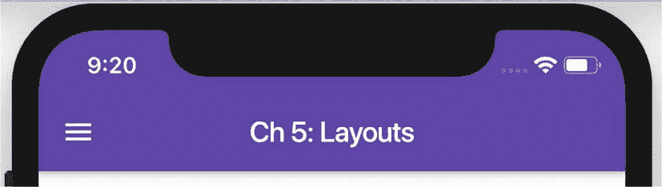
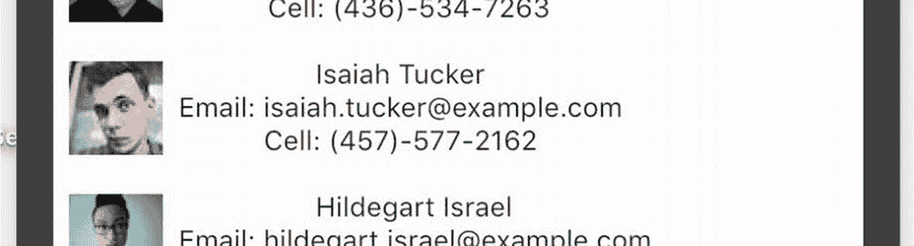
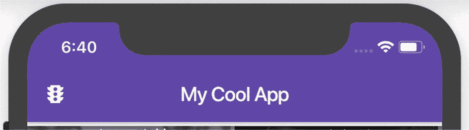
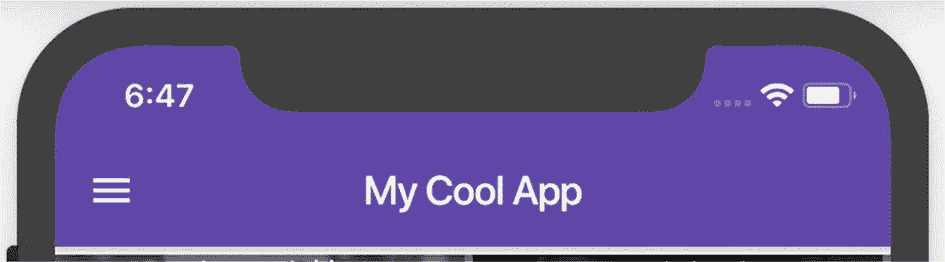
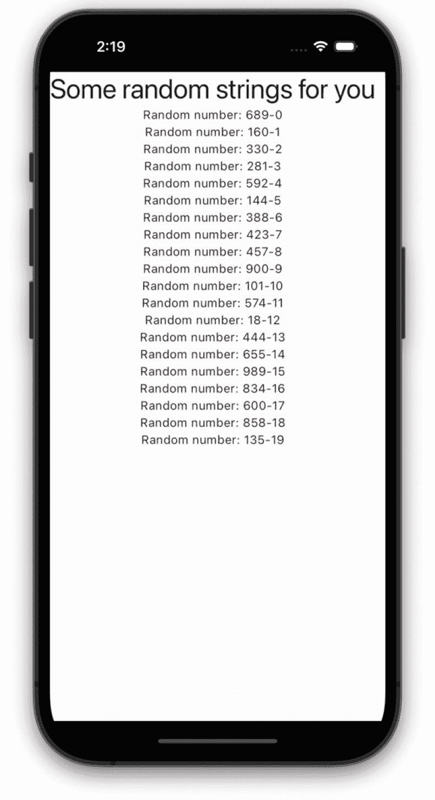
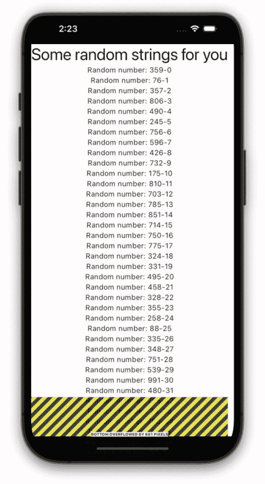
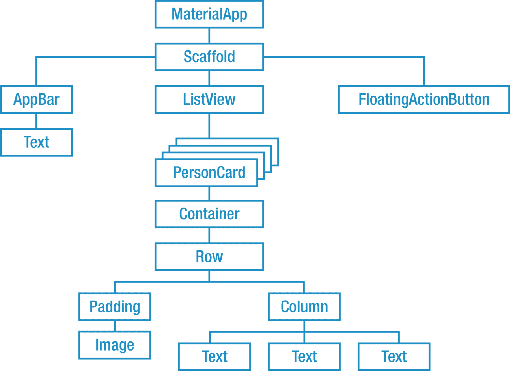

# 11. 布局你的 Widget

我们已经取得了很大进展，但一个主要话题仍然存在——控制应用 app 的视觉布局。我们需要精细控制 widget 在屏幕上的显示方式——大小、位置和间距。以下是我们将如何解决这个问题。

## 我们的方法

要掌握布局，我们需要知道如何做五件事：

1.  布局整个场景
2.  相对于彼此定位 widget
3.  解决溢出问题，例如当你的 widget 无法在屏幕上容纳时
4.  处理额外空间，例如当你的屏幕比所需空间更大时
5.  微调位置

这将是我们接下来五章的计划，每章一步。

### 1. 布局整个屏幕（即场景）

在本章中，我们将学习 Flutter 在布局时的思考方式。我们将设置整个应用的观感（使用 `MaterialApp`），并创建场景的外部结构，例如标题和菜单（使用 `Scaffold`）（图 11-1）。



图 11-1：标题和菜单出现在顶部，此外还有其他元素，如操作按钮

### 2. 将 Widget 上下放置或并排放置

在设计任何场景时，我们将其分解为 widget 并放置在屏幕上。例如，以下场景（图 11-2）必须分解为 widget 。由于这是一个人员列表，我们可能会创建一堆自定义的 `PersonCard` widget（图 11-3），并将它们上下放置。我们可以使用 `Column` widget 来实现这一点。


图 11-3：我们可能会创建一个 `PersonCard` widget


图 11-2：`Column` 可以将 widget 上下放置

然后反过来，每个 `PersonCard` widget 应该有一个图像与文本并排放置（图 11-4）。如何让文本出现在图像旁边？我们将使用 `Row` widget。还要注意，文本是关于该人员的一系列数据。如何让文本上下排列？我们将再次使用 `Column` widget。


图 11-4：`Row` widget 和 `Column` widget 可用于放置元素

放置 widget 将是第 12 章“布局 – 定位 Widget”的主题。

### 3. 处理空间不足和场景溢出的情况

在包含所有 `PersonCard` 的场景中，我们的人数超过了屏幕的显示能力，因此发生了溢出。这通常会导致错误，但有几种方法可以解决这个问题。我们将在第 13 章“布局 – 解决溢出”中探讨相关策略。

### 4. 处理场景中的额外空间

嘿，每个人的右侧都有额外的空间。如果我们希望将这部分空间放置在图片和文本之间会怎样？或者如果我们希望将部分额外空间放在图片的左侧会怎样？第 14 章“布局 – 填充额外空间”将向我们展示如何以悦目的方式分配这些空间。

### 5. 对定位进行更精细的调整

对于布局的最后一步，你可能会希望通过调整内边距、外边距和对齐方式来完善你的场景。这样可以防止场景显得拥挤。我们能做些什么来创造一些活动空间？在第 15 章“布局 – 微调定位”中，我们将学习如何使布局看起来更像图 11-5。



图 11-5：微调后的间距

好了，这就是我们在本书整个部分的计划。我们将在每章中深入探讨这五个步骤中的每一个。准备好开始第一步了吗？开始吧！

## 布局整个场景

这里有一个提示给你：应用永远不应该让用户感到惊讶。^((23)) 当应用以用户期望的方式运行时，用户会认为该应用友好、简单且易用。用户已经被训练成习惯在顶部看到一个状态栏，后面跟着一个标题栏。虽然其他屏幕功能会根据需要有所不同，但存在明确的约定。Flutter 拥有使你的布局感觉……嗯……*正常* 的 widget。


### `MaterialApp` 组件

根应用组件为你的应用创建了外层框架。尽管它至关重要，用户却从未见过应用组件，因为其任何部分在技术上都不可见。它包裹着整个应用，允许设置应用标题，以便当 iOS/Android 将应用移至后台时能显示名称。应用组件是设置应用默认主题的地方——包括字体、大小、颜色等。它也是指定路由的地方。

对于应用，你有三种选择：`MaterialApp`、`CupertinoApp` 或自定义的应用组件。

大多数 Flutter 组件在这三种应用中都能工作。应用组件只是让你选择基础的外观和感觉。如果你在 `CupertinoApp` 中放置 Cupertino 组件，它们看起来会完全像 iOS 应用。如果你在 `MaterialApp` 中放置符合 Material 规范的组件，它们看起来会更像 Android 应用。

“没错，但我需要它在 iOS 上像 iOS，在 Android 上像 Android！”你说。好吧，我明白。这是可行的。你可以创建自己的自定义应用组件，它继承自 `WidgetApp`，并进行大量条件绘制，就像这样：

```
Platform.isIOS ? CupertinoButton(...) : ElevatedButton(...)
```

但是，哎呀！这需要编写大量底层代码，坦白说这抵消了跨平台的优势，所以大多数开发者不会费这个功夫。在社区中，超过 95% 的项目使用 `MaterialApp`。只有一小部分使用 `CupertinoApp` 或从 `WidgetApp` 派生的自定义应用组件。使用 `MaterialApp` 是标准做法。

|   | `MaterialApp` | `CupertinoApp` | `WidgetApp` |
| --- | --- | --- | --- |
| 遵循的标准 | Google 的 Material 设计指南 | Apple 的人机界面指南 | 无 |
| 外观和感觉 | Google/Android | iOS | 通用且灵活 |
| 实际使用情况 | 大多数应用 | 优先适配 iOS 或仅 iOS 应用 | 自定义应用组件创建的基类 |

以下是 `MaterialApp` 可能的样子：

```
Widget build(BuildContext context) {
  return MaterialApp(
    home: MainWidget(),
    title: "我的酷应用",
    theme: _themeDefinedElsewhere,
    routes: ({
      '/scene1': (ctx) => MyWidget1(),
      '/scene2': (ctx) => MyWidget2(),
      '/scene3': (ctx) => MyWidget3(),
    },
    debugShowCheckedModeBanner: false,
  );
}
```

### `Scaffold` 组件

`MaterialApp` 组件创建了一个**外层不可见**的框架，而 `Scaffold` 组件则创建了**内层可见**的框架。

`Scaffold` 只有一个使命：为每个场景的可见结构进行布局，赋予其可预测且因此可用的布局——就像许多其他应用一样。它创建的内容包括：

*   用于标题的 `AppBar`
*   用于主体内容的部分
*   底部的导航栏或左侧的导航抽屉
*   浮动操作按钮
*   底部面板——通常处于折叠状态，但可以向上滑动以显示当前场景的上下文相关信息

```
@override
Widget build(BuildContext context) {
  return Scaffold(
    appBar: MyAppBar(),
    drawer: MyNavigationDrawer(),
    body: TheRealContentOfThisPartOfTheApp(),
    floatingActionButton: FloatingActionButton(
      child: Icon(Icons.add),
      onPressed: () { /* 在这里执行操作 */},
    ),
    bottomSheet: MyBottomSheet,
  );
}
```

`Scaffold` 的所有部分都是可选的。这很合理，因为你并不总是需要 `floatingActionButton`、`drawer` 或 `bottomNavigationBar`。我们的屏幕设计将决定我们需要哪些部分，不需要哪些部分。

### `AppBar` 组件

要在屏幕顶部创建一个标题栏，请使用 `AppBar` 组件（图 11-6）。这严格来说是可选的。但你的用户几乎完全期望每个非游戏类应用都有 `AppBar`。你几乎总是需要一个标题。并且你可能希望在开头添加一个图标。图标是 *leading* 属性：



图 11-6

带有 leading 图标和标题的 `AppBar` 组件

```
return Scaffold(
  appBar: AppBar(
    leading: Icon(Icons.traffic),
    title: Text("我的酷应用"),
  ),
  /* 此处更多内容：浮动操作按钮、主体、抽屉等。 */
);
```

不过有一个问题。如果你同时设置了 leading 图标和导航抽屉，Flutter 就无法使用该空间来显示汉堡菜单（图 11-7）：



图 11-7

没有 leading 图标的 `AppBar` 能够显示汉堡菜单图标

```
return Scaffold(
  appBar: AppBar(
    /* 这次没有 leading。 */
    title: Text("我的酷应用"),
  ),
  /* 此处更多内容：浮动操作按钮、主体、抽屉等。 */
);
```

如果你有导航抽屉，你可能希望省略 leading 图标。

### `SafeArea` 组件

物理设备屏幕很少是整齐的矩形。它们有圆角、刘海和顶部的状态栏。如果我们忽略这些，应用的某些部分就会被裁剪或隐藏。不想这样？只需用 `SafeArea` 组件包裹所有主体内容，它就会限制你的应用渲染在刘海、状态栏和圆角下方。将其放在 `Scaffold` 内部但包裹主体内容是一个绝佳的位置：

```
Widget build(BuildContext context) {
  return Scaffold(
    drawer: LayoutDrawer(),
    body: SafeArea(
      child: MyNormalBody(),
    ),
    floatingActionButton: FloatingActionButton(
      child: Icon(Icons.next),
      onPressed: () {},
    ),
  );
}
```

## Flutter 的布局算法

朋友们，请做好准备。本章的最后一部分并不适合胆小者。这是相当高层次的思考，但直接跳过会是对你的不负责任。一旦你理解了 Flutter 是如何布局的，许多组件及其正确用法就会突然变得清晰。没有这种理解，我们只能胡乱修改代码，直到它勉强能工作——这令人沮丧，并且会产生脆弱的代码。

所以，和我一起深入探究，我们来谈谈 Flutter 的布局算法。我们先从……


### 可怕的“无限高度”错误

我敢保证，在你的开发生涯中，你一定会遇到 Flutter 抛出这个错误：

```
══╡ Exception caught by rendering library ╞═════════════
The following assertion was thrown during performResize(): Vertical viewport was given unbounded height.
Viewports expand in the scrolling direction to fill their container. In this case, a vertical viewport was given an unlimited amount of vertical space in which to expand. This situation typically happens when a scrollable widget is nested inside another scrollable widget. If this widget is always nested in a scrollable widget there is no need to use a viewport because there will always be enough vertical space for the children. In this case, consider using a Column or Wrap instead. Otherwise, consider using a CustomScrollView to concatenate arbitrary slivers into a single scrollable.
```

这个错误信息对开发者并不友好，对吧？大多数人在看到这条错误信息时，都会完全搞不懂代码中的问题所在。类似的错误信息可能还会说“RenderFlex children have non-zero flex”或者“RenderViewport does not support returning intrinsic dimensions.”这些消息都没什么帮助。如果它们能友好一点，应该会这样说：

```
══╡ You're doing it wrong ╞═════════════════════════
The ListView you're drawing wants to be infinitely tall and it needs a parent widget that will keep it reasonably short. Maybe tell it to be small by wrapping it with an Expanded widget?
```

这样是不是清晰多了？你就能明白问题所在以及如何修复。

让我帮你解读 Flutter 试图告诉我们什么：某些 widget 想要填满所有可用空间。换句话说，它们是“贪婪的”。它们需要一个父 widget 来约束自己。如果它们处于一个拒绝提供这种约束的父 widget 内，Flutter 就会崩溃，因为它无法绘制无限高的东西。下面用一些代码来说明这个问题。

这段代码在一个 `Column()` 中绘制了一个标题和 20 个随机的 `Text()`。它看起来很正常（图 11-8）：

```
Widget build(BuildContext context) {
List randomTexts = List.generate(20,
(i) => Text("Random number: ${Random().nextInt(1000)}-$i"));
return Column(
children: [
Text("Some random strings for you", style: big),
Column(
children: randomTexts,
),
],
);
}
```



图 11-8

一个短小的 Column 绘制得很好。

当数量增加到 80 个随机的 `Text()` 时，就会溢出视口（图 11-9）。



图 11-9

子元素过多的 Column 会溢出屏幕

这看起来很难看，但这不是运行时错误。我们应该怎么做？我知道了！让我们把 `randomTexts` 列表放入一个 `ListView` 中使其可滚动。这是一个完全合乎逻辑的想法。

```
@override
Widget build(BuildContext context) {
List randomTexts = List.generate(80,
(i) => Text("Random number: ${Random().nextInt(1000)}-$i"));
return Column(
crossAxisAlignment: CrossAxisAlignment.center,
children: [
Text("Some random strings for you", style: big),
ListView(
children: randomTexts,
),
],
);
}
```

我们只是把其中一个 widget 从 `Column` 换成了 `ListView`，然后就——砰！它崩溃了。看到了吗？`Column()` 认为它没有责任限制任何子元素的高度。“你想多大就多大，”`Column` 说。而 `ListView` 会试图变得和它的父 widget 允许的一样大。由于 `ListView` 的父 widget 没有限制它，它就会变得无限高。

坦白说，这是开发者没有真正理解 Flutter 如何处理布局的典型症状。所以让我试着解释一下 Flutter 的布局算法，希望能预测并避免像上面例子那样的混乱局面。然后我会解释一种解决方法。

### 算法本身

你的 widget 在 `main` 方法的顶部总会有一个根 widget。它有分支、分支的分支，一直延续下去。我们称之为渲染树（图 11-10）。Flutter 必须决定树中每个 widget 的大小。它通过询问每个 widget 它希望有多大，并询问其父 widget 是否允许这样做来实现。



图 11-10

每个场景都有一个 widget 树

Flutter 从顶部开始向下遍历树。它会读取根 widget 的 `BoxConstraints`（最大宽度和最大高度）。它记住这些约束，然后与每个子 widget 通信。对于每个子 widget，它会将其 `BoxConstraints` 传递给它，然后继续向下遍历到孙 widget。它会一直这样做，直到每条分支的末端。我们称之为叶子层。

然后它询问每个叶子的 `RenderBox`——它希望有多大。有些子元素是贪婪的，会说“尽可能大”。其他的则占用较小的空间。Flutter 允许叶子在其所有祖先的*约束之内*以其首选大小绘制。如果首选大小对于其父 widget 的 `BoxConstraints` 来说太大，Flutter 会在运行时裁剪它——这是我们极力避免的！如果首选大小太小，Flutter 会用额外的空间填充它，直到它合适为止。

然后它会向上返回一层，尝试将这些分支放入它们的共同父 widget 中，而这个父 widget 有自己的约束。以此类推，一直回到顶部。

结果是，每个子 widget 都可以得到它喜欢的高度和宽度——只要它的父 widget 允许。并且，在所有子 widget 都有最终大小之前，没有父 widget 会有最终大小。

所以你可以看到我们是如何得到“无限高度”错误的。如果我们有一个子 widget 试图变得尽可能大，而又没有父 widget 来阻止它，Flutter 就会恐慌，因为这个子 widget 现在无限高了。

要解决这个问题，父 widget 只需要指示它的子 widget 停止增长。在我们的 `ListView`/`Column` 例子中，有几种解决方案。一种是将 `Column` 和 `ListView` 互换。`Column` 并不贪婪，所以它可以放在 `ListView` 中。但这样一来，标题 `Text` 就会滚动出页面。另一种方法是将 `ListView` 包裹在 `SizedBox` 中，以精确锁定大小，或者包裹在 `LimitedBox` 中，以提供 `maxWidth` 和 `maxHeight`。但这些解决方案都很笨拙。第三种方法是把 `ListView` 包裹在一个 `Expanded` 中。我们将在几章后详细讲解 `Expanded`，但在这里它对我们有利，因为 `Expanded` 会扩展以占据剩余（不是无限的）空间，并告诉它的子 widget 它现在有了 `BoxConstraints`。完美！我们只需要这样做：

```
Widget build(BuildContext context) {
List randomTexts = List.generate(80,
(i) => Text("Random number: ${Random().nextInt(1000)}-$i"));
return Column(
crossAxisAlignment: CrossAxisAlignment.center,
children: [
Text("Some random strings for you", style: big),
Expanded(         // <-- 添加这个 widget
child: ListView(
children: randomTexts,
),
),
],
);
}
```

## 结论

你明白为什么我说理解布局策略很重要了吗？在你真正搞懂它之前，你只是在猜测解决方案。理解它们需要很多工作，但这是值得的。

Flutter 有大量的 widget 来控制大小和位置。在接下来的几章中，我们将学习那些最关键的布局 widget——那些你绝对必须掌握的 widget。我们将从 `Row` 和 `Column` 开始。

脚注 1

