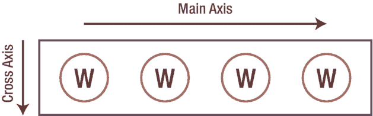
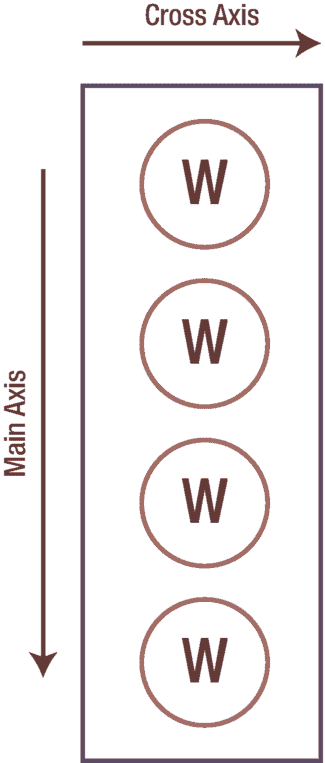

# 12. 布局 – 定位 Widget

请记住，应用程序视觉部分的步骤是：

1.  布局整个场景

2.  将 widget 相对于彼此进行定位

3.  修复溢出问题，例如当 widget 不适合屏幕时

4.  处理多余空间，例如当屏幕比所需空间更大时

5.  微调位置

在上一章中，我们学习了 Flutter 的布局算法，并学会了如何使用 `MaterialApp`、`Scaffold` 及其典型子 widget 来为布局做好准备。现在是时候进入第二步了：`Row` 和 `Column`。


## 将控件并排或上下排列

顾名思义，`Row` 和 `Column` 分别用于将控件并排（`Row`，如图 12-1 所示）或上下排列（`Column`，如图 12-2 所示）。除了子控件的布局方向不同，它们几乎没有区别。



**图 12-1** `Row` 控件用于并排布局

```
Row(
  children: [
    SomeWidget(),
    SomeWidget(),
    SomeWidget(),
  ],
),
```



**图 12-2** `Column` 控件用于上下排列

```
Column(
  children: [
    SomeWidget(),
    SomeWidget(),
    SomeWidget(),
  ],
),
```

注意，它们都有一个 `children` 属性，该属性是一个控件数组。`children` 数组中的所有控件将按照你添加的顺序依次显示。你甚至可以在列中嵌套行，或者在行中嵌套列，嵌套的层数不限。通过这种方式，你几乎可以在任何应用中创建出能想象到的任何布局。

`Row` 和 `Column` 将是你最常用的布局控件。诚然，还有其他布局控件，但这两种会是你的首选。

## 响应式设计

响应式设计诞生于 2010 年代初期，当时网络正从以桌面浏览为主的时代，转向智能手机和平板电脑普及的时代，这就要求网站能够适应各种不同屏幕尺寸的新格局。Web 应用会根据其所在设备的屏幕尺寸和方向来调整布局。你明白我的意思了吗？这是一种会对屏幕尺寸和方向做出*响应*的*设计*。

### Flutter 中的响应式设计

Flutter UI 需要适配移动设备。响应式设计确保了你的应用布局能够适应不同的屏幕尺寸和方向，无论用户是竖屏持握手机，还是将其旋转为横屏。

想象一下你在竖屏模式下使用应用的情形：布局整洁，所有元素都易于点击和阅读。然而，当旋转到横屏时，设备的文本可能会溢出，按钮会靠得太近，甚至有些元素会完全被隐藏。使用 `Flex` 控件配合 `MediaQuery`，你可以创建一个能够智能适应可用空间的 UI。这确保了用户无论以何种方式持握设备，都能获得流畅无阻的体验。

### Flex 与 MediaQuery

与 `Row` 或 `Column` 一样，`Flex` 控件也是将其子控件并排或上下排列。但 `Flex` 更加灵活。它有一个 `orientation` 属性，可以设置为垂直或水平方向。

- 方向设置为水平的 `Flex` 实际上等同于 `Row()`。
- 方向设置为垂直的 `Flex` 实际上等同于 `Column()`。

请注意，这个 `orientation` 属性可以被设置为条件性的。这正是 `MediaQuery` 的用武之地。

`MediaQuery` 从设备本身获取特定数据。

- `MediaQuery.sizeOf(context)` – 宽度和高度
- `MediaQuery.displayFeaturesOf(context)` – 摄像头开孔、刘海等
- `MediaQuery.platformBrightnessOf(context)` – 浅色或深色模式
- `MediaQuery.textScaleFactorOr(context)` – 当前字体大小
- `MediaQuery.viewInsetsOf(context)` – 设备应用了多少内边距？
- `MediaQuery.devicePixelRatioOf(context)` – 像素密度

> **注意**  
> 在 Flutter 中，所谓的像素实际上是*逻辑*像素。iOS 开发者称其为*点*，而 Android 开发者则称之为*密度无关像素*。`MediaQuery.devicePixelRatioOf(context)` 能帮助我们确定真实的像素密度，以备不时之需。

- `MediaQuery.orientationOf(context)` – 横屏或竖屏

最后这一个属性是关键。你需要检查屏幕方向，如果是横屏，则使用 `Row`；否则，应使用 `Column`。以下是相关代码：

```
Flex(
  direction:
    MediaQuery.orientationOf(context) == Orientation.landscape ?
    Axis.horizontal : Axis.vertical,
  children: [
    SomeWidget(),
    SomeWidget(),
    SomeWidget(),
  ],
),
```

## 总结

现在，你已经能够将控件并排放置或上下排列了。你甚至可以在需要时使用 `Flex` 来实现响应式布局。但是，如果布局引擎没有足够的屏幕空间来显示所有内容，会发生什么？我们该怎么办？让我们在下一章中探讨这个问题。

