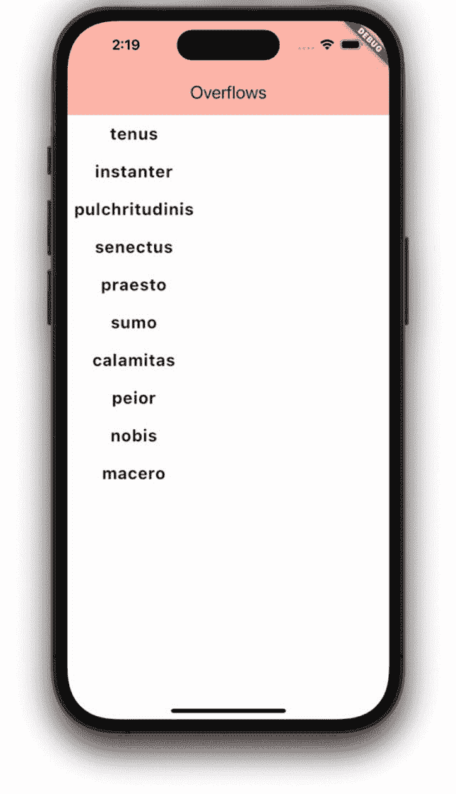
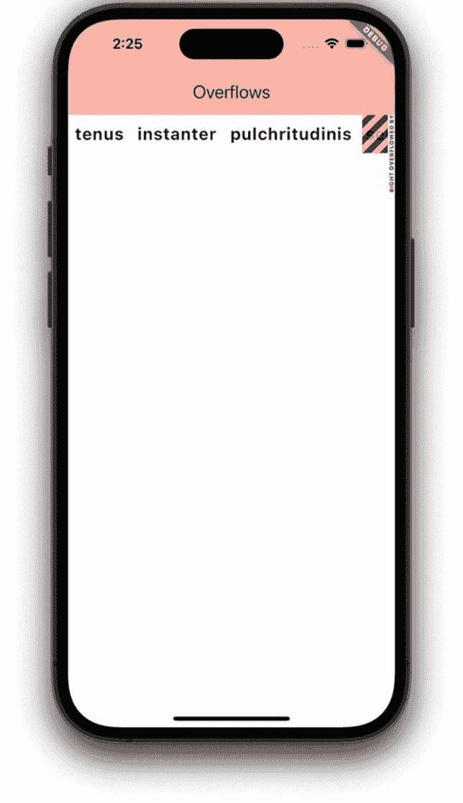
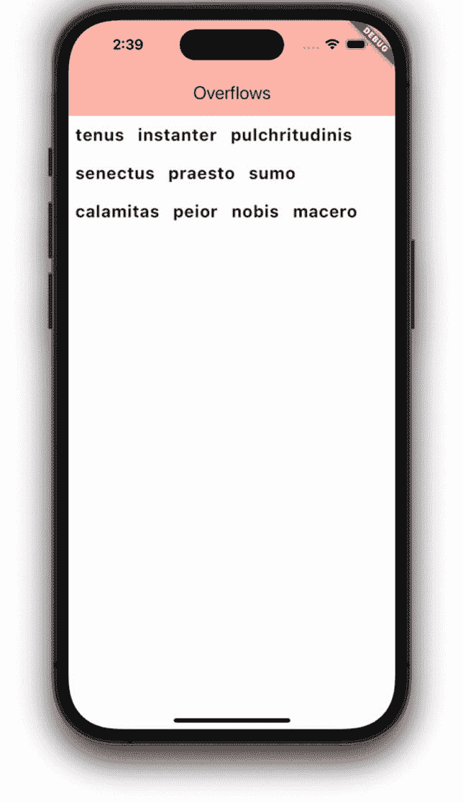
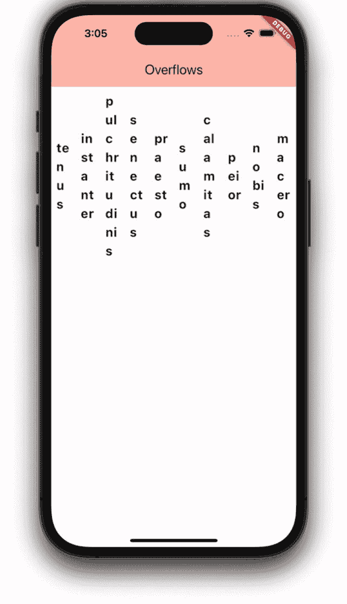
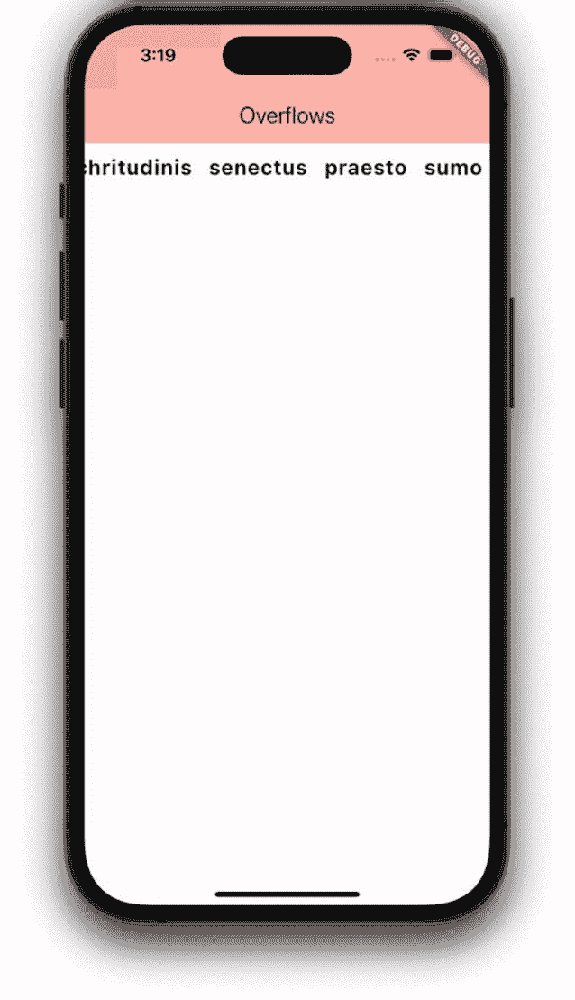
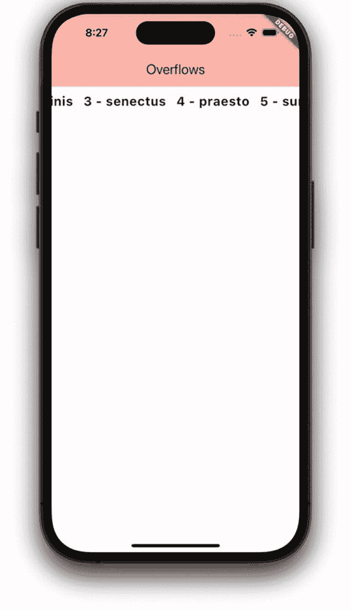
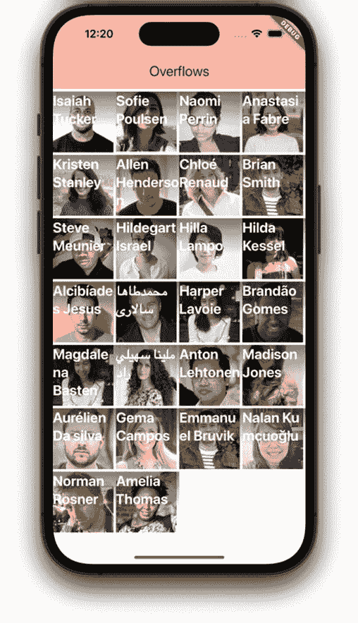

# 13. 布局 – 解决溢出问题

你的控件永远不可能恰好适配屏幕。

如果所有元素都能完美地适配在一个场景中，那将是一个极其罕见的巧合。即使它们现在完美适配，一旦应用在其他不同尺寸的屏幕上运行，或者从竖屏旋转为横屏，情况就会发生变化。因此，我们需要处理两种情况：

1.  空间不足怎么办？（给定空间内的控件过多）
2.  如果还有剩余空间怎么办？（屏幕显示面积大于控件占用的像素）

这两种情况很可能*同时*发生在你场景的不同部分。我们将在本章着手解决空间不足的问题，并在下一章处理空间过多的问题。

## 溢出警告条

容器内容溢出并非致命错误，但会造成不良后果。在调试时，如果任何控件溢出屏幕，Flutter 会友好地通过显示溢出警告来通知你（如图 13-1 所示）。这些警告是黄黑相间的条纹，旁边还有一些微小的红色文字，显示溢出了多少像素。


**图 13-1** 溢出条

> **提示**  
> 该警告仅在调试模式下显示。正式发布的应用永远不会显示这些溢出条。相反，溢出的控件会被直接裁剪。我不确定这算不算更好。

## 纠正溢出的可选方案

在现实中，如果你有一个固定大小的容器，比如一个纸板箱，你需要放进去一个太大而装不下的东西，你会怎么做？

1.  折叠或拆卸物品（假设它们可以被拆卸或折叠）。
2.  挤压物品，直到它能被装下（假设它是可挤压的）。
3.  将其放入多个箱子中。

从逻辑上讲，我们只有这些选择。让我们将同样的思路应用到 Flutter 屏幕上。我们有相同的三种选择：

1.  允许子控件换行（假设它们可以换行）。
2.  挤压子控件，直到它们适应（假设它们可以缩放）。
3.  允许用户滚动。

让我们看看在 Flutter 中如何实现这三件事。

## 待解决的示例问题

为了说明我们的三种方案，我们准备了一个随机的 lorem ipsum 字符串列表。我创建了一个名为 `Word()` 的自定义控件，它只是 `Text()` 的一个封装，并添加了样式和内边距。我将使用 `.map` 把这些字符串转换为 `Word` 控件，并将它们放入一个 `Column` 中，如下所示：

```
Widget build(BuildContext context) {
  var wordWidgets = words.map((w) => Word(w)).toList();
  return Column(
    children: wordWidgets,
  );
}
```

图 13-2 展示了这段代码可能产生的效果。



**图 13-2** 在 `Column` 中显示效果不错

到目前为止还不错？在 `Column` 中，它显示得很好——有足够的空间。但是，当我们把它改成一行时：

```
Widget build(BuildContext context) {
  var wordWidgets = words.map((w) => Word(w)).toList();
  return Row(
    children: wordWidgets,
  );
}
```

就出现了问题。所有单词无法在此设备上水平排列，右侧出现了溢出条（如图 13-3 所示）。



**图 13-3** 溢出条显示我们向右溢出了屏幕

记住，我们有三种方案来解决溢出问题。第一种方案可能最适合我们当前的情况——允许 `Word` 控件在其行内自动换行。


### 让子控件自动换行

顾名思义，`Wrap` 控件的作用就是“包裹”。它的子控件可以自动换行，显示成所需的任意行数，直到所有内容都能在屏幕上完整显示。

```dart
Widget build(BuildContext context) {
  var wordWidgets = words.map((w) => Word(w)).toList();
  return Wrap(
    children: wordWidgets,
  );
}
```

我们只做了一处改动，就是把 `Row` 换成了 `Wrap`。仅此而已。它现在的效果如图 13-4 所示。



**图 13-4** 子控件自动换行

对于我们当前这种单词列表的场景，这是理想的解决方案。但大多数情况下，我们会处理其他类型的控件。接下来我们看看第二种解决方案。

### 挤压子控件直至适配

如果你的控件是可压缩的，一个合乎逻辑的选择就是水平挤压`Row`的子控件，或垂直挤压`Column`的子控件，直到它们适配。听起来不舒服？确实有点。这种方式通常不会带来可预测且美观的呈现效果。但偶尔，这也正是我们需要的。

让内容变小的一种方法是将它们放入 `Flexible()` 控件中。`Flexible()` 会对它的子控件说：“我会把你缩小，直到你适配，或者直到你被压缩到极限。如果你无法被压缩到足够的程度，那我就干脆放弃。”这意味着 `Flexible` 并不是一个万无一失的解决方案。

> **提示**  
> `Flexible` 只有在 `Row()` 或 `Column()` 内部直接使用时才有意义。

`Flexible` 包裹着 `Row` 或 `Column` 中的每一个子控件：

```dart
Widget build(BuildContext context) {
  var wordWidgets = words.map((w) => Word(w)).toList();
  return Row(
    children: wordWidgets
        .map((w) => Flexible(child: w))
        .toList(),
  );
}
```

> **注意**  
> `Iterable.map()` 只是将一个 X 数组转换成一个 Y 数组。在上面的代码中，我们所做的就是将*每一个* `Word()` 控件都嵌套在一个 `Flexible()` 控件中。请不要为此分心。本章你应重点关注的是 `Flexible` 及其对场景的影响——它让每个子控件协同工作以适配空间。（不过，你不得不承认，`.map()` 是一种简洁的转换方法。）

每个 `Flexible` 会与 `Row` 中所有其他的 `Flexible` 进行“沟通”，沿着水平轴挤压它的子控件，从而产生了图 13-5 中不太美观的结果。



**图 13-5** `Flexible` 控件挤压其子控件

#### 挤压的另一种选择

请记住，Flutter 有数百个控件，它们在用途和功能上有很多重叠。如果你想挤压子控件，而 `Flexible` 不能满足需求，可以考虑 `FittedBox`。

位于 `FittedBox` 中的子控件会根据你指定的 `BoxFit` 进行缩放和/或裁剪。还记得第 4 章“值控件”中的 `BoxFit` 吗？所有这些值都适用于 `FittedBox`。

- `fitWidth` – 使宽度完全适配。如果需要，则裁剪高度或在顶部/底部添加内边距。
- `fitHeight` – 使高度完全适配。如果需要，则裁剪宽度或在左侧/右侧添加内边距。
- `cover` – 适配最小的尺寸（宽/高），裁剪另一侧。
- `contain` – 适配最大的尺寸（宽/高），为另一侧添加内边距。
- 等等。更多细节请参考第 4 章“值控件”。

在这种情况下，这不是最佳选择，但当您确切知道要压缩多少内容以及一个或多个控件可以占用多少像素时，它非常适用。

### 允许用户滚动

解决溢出问题的最后一个选项是允许用户滚动。坦白说，这是最常选择的方案，在大多数情况下都非常合理。它也是最容易理解的选项，也许也是实现起来最简单的。我把最好的留到了最后！

和 Flutter 的典型风格一样，有很多滚动选项可供选择。我们将介绍三种：`SingleChildScrollView`、`ListView` 和 `GridView`。

#### SingleChildScrollView 控件

`SingleChildScrollView` 这个名字很形象。它包裹一个*单一子控件*并允许*滚动*。Flutter 不会裁剪该子控件，而是让用户通过滑动来水平或垂直（默认）滚动。这是使用 `SingleChildScrollView` 的代码：

```dart
Widget build(BuildContext context) {
  var wordWidgets = words.map((w) => Word(w)).toList();
  return SingleChildScrollView(
    scrollDirection: Axis.horizontal,
    child: Row(
      children: wordWidgets,
    ),
  );
}
```

图 13-6 展示了它的样子。嘿，没有溢出条了！与之前的截图相比，可以看到文本的位置发生了变化。



**图 13-6** 使用 `SingleChildScrollView` 包裹后允许滚动

> **提示**  
> `SingleChildScrollView` 允许水平*或*垂直滚动，但不能同时进行。`InteractiveViewer` 控件则允许两者同时进行。如果你需要显示某个在水平和垂直方向上都过大的内容，可以了解一下 `InteractiveViewer`，它允许在两个方向上平移/滚动，并支持通过捏合进行放大和缩小。这对于高分辨率图片或大型地图非常有用。

#### ListView 控件

`ListView` 没有 `child` 属性，它有 `children` 属性。因此，如果我们将 `Row` 转换为 `ListView` 并将其 `scrollDirection` 属性设置为水平，它的外观和行为就与 `SingleChildScrollView` 非常相似。

```dart
Widget build(BuildContext context) {
  var wordWidgets = words.map((w) => Word(w)).toList();
  return ListView(
    scrollDirection: Axis.horizontal,
    children: wordWidgets,
  );
}
```

但 `ListView` 拥有 `SingleChildScrollView` 所不具备的超能力。`ListView` 在内存上更高效，也更灵活。

##### ListView 内存效率更高

`SingleChildScrollView` 在显示其子控件及其所有后代控件之前，会将它们全部构建到内存中，无论其大小或数量如何。`ListView` 则不同。`ListView` 会跟踪哪些子控件当前正在显示，哪些即将离开屏幕。它只构建这些控件。因此，当用户专注于阅读或滚动屏幕上的内容时，Flutter 正在忙于构建更多可能很快就会出现的控件。如果用户向下滚动，Flutter 会构建当前视口下方的控件。如果用户向上滚动，Flutter 则构建上方的控件。明白了吗？

它还会将滚动离屏的控件从内存中移出，因此无论你的列表有多大，任何时候都只有少数几个控件在内存中。

聪明的读者可能已经发现了其中的几个缺陷。首先，用户滚动速度可能超过 Flutter 创建控件的速度。这没什么大不了的；它只是会短暂地显示空白区域，一旦控件创建完成就会立即显示。其次，如果用户反复上下滚动，Flutter 将会浪费一些时间来销毁和重新创建相同的控件。诚然，这些都是问题，但它们很次要，当你考虑所获得的效率提升时，这点代价是完全值得的。

> **提示**  
> 当你有大量（甚至是无限！）的项目需要显示时，`ListView` 是最佳选择。只有靠近视口的那些项目才会在内存中。

##### ListView 非常灵活

`ListView` 有四种不同的使用方式：

1. **常规 `ListView`** – 常规用法。它有一个 `children` 属性，用于接收静态控件的集合。
2. **`ListView.builder`** – 用于根据项目列表动态创建子控件。
3. **`ListView.separated`** – 类似于 builder，但在每个项目*之间*放置一个控件。非常适合在列表中定期插入广告。更多信息请阅读 [`http://bit.ly/flutter_listview_separated`](http://bit.ly/flutter_listview_separated)。
4. **`ListView.custom`** – 用于创建自定义的高级 `ListView`。更多信息请阅读 [`http://bit.ly/flutter_listview_custom`](http://bit.ly/flutter_listview_custom)。

让我们先看看前两个选项，从常规的 `ListView` 开始。


##### 常规 ListView

此版本的 `ListView` 非常适合显示大量预定义的多样化小部件。你只需将 `children` 属性设置为已经定义好的列表即可。我们上面的代码示例已经展示了这一点。

但 `ListView` 真正有趣的地方在于，你可以让它根据一个事物列表来构建新小部件——比如人员、产品、商店——任何你可以从数据库或 RESTful 服务中获取的数据。为了显示可滚动条目的动态数量，我们需要使用 `ListView.builder` 构造方法。

##### `ListView.builder`：当你需要从对象列表构建小部件时

`ListView` 的另一个构造方法 `ListView.builder` 接收两个参数：一个 `itemCount` 整数和一个 `itemBuilder` 函数。`itemBuilder` 函数会根据需要动态创建子小部件。当用户滚动时，`itemBuilder` 函数会运行并创建新的条目。

`itemCount` 属性是一个整数，它告诉我们将要绘制多少个内容，因此我们通常将其设置为要滚动浏览的数组/集合的长度。`itemBuilder` 函数接收两个参数：上下文 (context) 和一个整数，该整数对于第一个条目为 0，并且每次运行时递增。

```
Widget build(BuildContext context) {
return ListView.builder(
scrollDirection: Axis.horizontal,
itemCount: words.length,
itemBuilder: (context, i) => Word("$i - ${words[i]}"),
);
}
```

在这个例子中，我们为每个打印出的单词添加了一个索引。请注意，我再次向右滚动了（图 13-7）。



`ListView.builder` 动态构建每个子小部件

创建能够按行或列滚动的小部件列表非常棒。但如果你需要滚动的是方形小部件呢？

#### GridView 小部件

让我们调整一下示例。假设我们不再提供一些占位文本，而是给你一个人员列表，我们希望为每个人创建一个小的、大致方形的 `PersonCard` 小部件，其中包含照片和姓名。你可能希望它们以行和列的形式出现，而不是列表形式。`GridView` 拥有与 `ListView` 相同的魔力，但它会在一个自动换行的网格中绘制内容。

你可以像使用 `Row`、`Column`、`Wrap` 和 `ListView` 一样，将 `GridView` 的 `children` 属性设置为你想要显示的小部件列表。`GridView` 会以网格形式显示它们，横向填充然后自动换行到下一行，并调整其可用空间直到刚好合适。最棒的是，它会自动滚动！

`GridView` 有两个构造方法：`GridView.extent()` 和 `GridView.count()`。

##### `GridView.extent()`

*Extent* 这个词指的是子元素的最大宽度。`GridView` 仅允许其子元素增长到该尺寸。如果子元素试图变得更大，它就会在该行上放置另一个元素，并均匀地缩小所有子元素，直到它们刚好能横跨整个宽度。请看这个例子：

```
Widget build(BuildContext context) {
return GridView.extent(
maxCrossAxisExtent: 300.0,
children: _peopleList
.map((Person person) => PersonCard(person))
.toList(),
);
}
```

请注意在图 13-8 和图 13-9 中，容器是如何调整到小于 300 像素的。`GridView` 决定在竖屏方向上可以并排容纳两个。但当旋转到横屏时，这两个容器本可以调整到大于 300 像素，所以它每行放置了三个。


同样的 `GridView.extent()` 旋转到横屏模式


竖屏模式下的 `GridView.extent()`

##### `GridView.count()`

使用 `count()` 构造方法时，你可以指定所需的列数，*无论屏幕方向如何*。`GridView` 会负责调整其内容的大小以适应需求。在下面的例子中，我们告诉 `GridView.count()` 无论屏幕方向如何，我们都想要四列，然后 `GridView` 会调整其子元素的大小，使其恰好并排为四列。这些显示在图 13-10 和图 13-11 中。



竖屏模式下同样的 `GridView.count()`


横屏模式下的 `GridView.count()`

```
Widget build(BuildContext context) {
return GridView.count(
crossAxisCount: 4,
children: _peopleList
.map((Person person) => PersonCard(person))
.toList(),
);
}
```

`GridView.extent()` 可能更有用，因为无论设备如何，内容的大小都大致保持不变，这比保持列数一致更符合常见的需求。

## 结论

设备上容纳不下足够多的小部件可能是最常见的情况，而这也许是最难优雅解决的问题，因此能坚持学到这里本身就是一个重要的成就。在本章中，我们为你提供了针对该问题的多种解决方案，并帮助你判断在给定情况下哪种方案最佳。

这是我们布局场景五步中的第三步。接下来，让我们在第四部分（下一章）中介绍如何优雅地分配额外空间。

