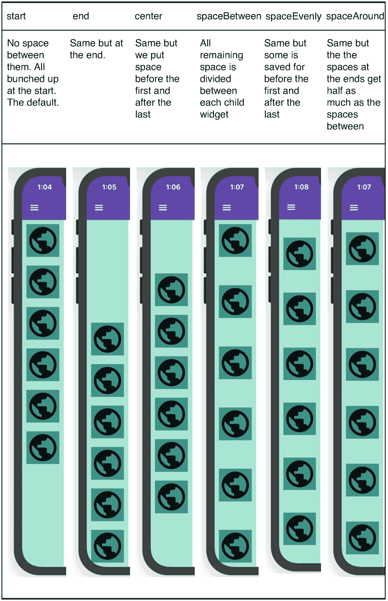
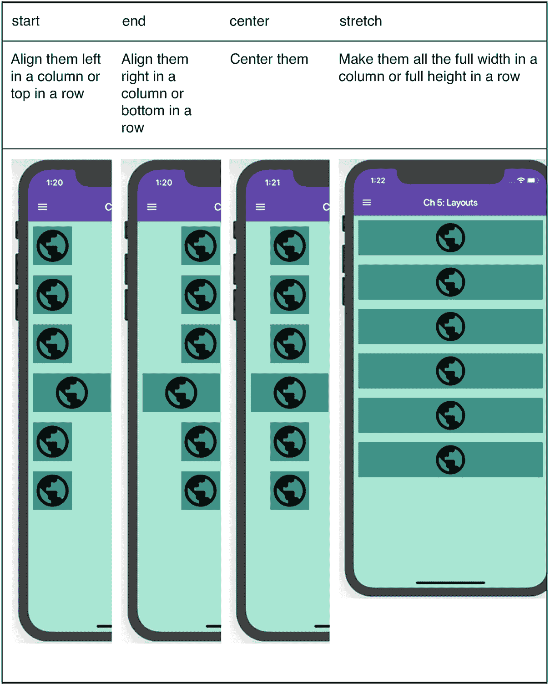
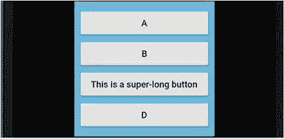
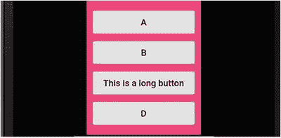
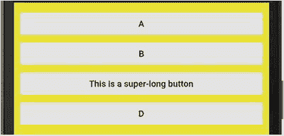

# 14. 布局——填充额外空间

我们正深入进行场景布局的过程。请记住，这是我们遵循的步骤。

1.  布局整个场景
2.  相对定位小部件
3.  处理溢出，例如当小部件无法适应屏幕时
4.  处理额外空间，例如当屏幕比实际需要更大时
5.  微调位置

我们现在已经知道如何处理整个场景，如何使小部件彼此相对定位——上下排列或并排显示——以及如何处理它们过大而无法容纳的情况。这些是步骤一、二和三。现在，让我们来处理在 `Row` 或 `Column` 中填充可能看起来不太美观的额外空间的任务。

### 如果留有额外空间怎么办？

与空间不足相比，这是一个好问题。你真正需要回答的唯一问题是如何分配这些额外空间。你希望在每个子小部件周围分配多少空间？你有几个选择。最简单快捷的方法是使用 `mainAxisAlignment` 和 `crossAxisAlignment`。

### `mainAxisAlignment`

`mainAxisAlignment` 是 `Row` 或 `Column` 的一个属性（图 14-1）。通过它，你可以控制如何沿着主轴分配额外空间——对于 `Column` 是垂直方向，对于 `Row` 是水平方向：

```
child: Column(
mainAxisAlignment: MainAxisAlignment.spaceEvenly,
children: [
SubWidget(),
SubWidget(),
],
),
```

你有几种选择。



`mainAxisAlignment` 指定如何沿着主轴分配额外空间

### `crossAxisAlignment`

`crossAxisAlignment` 也是 `Row` 或 `Column` 的一个属性；它决定当小部件在 `Row` 中高度不同或在 `Column` 中宽度不同时，额外空间应放置在哪里。在图 14-2 中，我们有意让其中一个成员比其他成员更宽。图中显示了 `crossAxisAlignment` 的可选值。



`crossAxisAlignment` 指定如何沿着交叉轴分配额外空间

还有一个选项：baseline。但它仅在 `Row` 中，并且当你对齐不同高度的 `Text()` 组件时才有意义。它会将文本的基线对齐。


### IntrinsicWidth

如果你希望 `Column` 的所有子组件宽度一致，但又不一定占满整个屏幕宽度，可以使用 `IntrinsicWidth` 组件。使用 `crossAxisAlignment.stretch` 时，它们会拉伸至最大宽度（图 14-3），但如果包裹在 `IntrinsicWidth` 中，它们都会和最宽的子组件保持相同尺寸（图 14-4 和 14-5）。



图 14-5

使用 `IntrinsicWidth`，当有一个更宽的成员时，所有成员都会随之变宽



图 14-4

使用 `IntrinsicWidth`，它们只会和最宽的成员一样宽



图 14-3

未使用 `IntrinsicWidth` 时，所有子组件都会拉伸至整个宽度

```
IntrinsicWidth(
child: Column(
mainAxisAlignment: MainAxisAlignment.center,
crossAxisAlignment: CrossAxisAlignment.stretch,
children: [ ... ],
),
),
```

注意第三个子组件，在图 14-4 中它原本较长，但在图 14-5 中变得更宽。因此你可以看到，当最宽的子组件变宽时，所有子组件都会随之变宽。

## Expanded 组件

当间距需求明确（比如希望等距分布）时，`mainAxisAlignment` 非常实用。这是常规情况。但如果你根本不需要间距呢？如果你希望子组件扩展以填满剩余空间呢？`Expanded` 组件来救场！

以下面的代码为例，如图 14-6 所示。


图 14-6

这个 `Row` 组件有大量额外空间

```
Row(
mainAxisAlignment: MainAxisAlignment.spaceAround,
children: [
SubWidget(),
SubWidget(),
SubWidget(),
SubWidget(),
SubWidget(),
SubWidget(),
],
),
```

当你用 `Expanded` 组件包裹 `Row`/`Column` 的某个子组件时，该子组件会变得*可伸缩*，这意味着如果有额外空间，它会沿着主轴方向拉伸以填满该空间。

下面展示同样的代码，只是第二个子组件包裹了 `Expanded()`。请见图 14-7，该组件现在扩展并吞噬了所有可用空间。


图 14-7

第二个子组件被包裹在 `Expanded` 中

```
Row(
mainAxisAlignment: MainAxisAlignment.spaceAround,
children: [
SubWidget(),
Expanded(child: SubWidget()),
SubWidget(),
SubWidget(),
SubWidget(),
SubWidget(),
],
),
```

注意，此时 `mainAxisAlignment` 不再起作用，因为没有额外空间了——所有空间都被 `Expanded` 占用。

如果再加一个 `Expanded` 会怎样？让我们把第三个和第四个组件也用该组件包裹（图 14-8）：


图 14-8

多个 `Expanded` 会平分剩余空间

```
Row(
children: [
SubWidget(),
Expanded(child: SubWidget()),
Expanded(child: SubWidget()),
Expanded(child: SubWidget()),
SubWidget(),
SubWidget(),
],
),
```

注意第二个组件现在变小了，因为额外空间被第三和第四个子组件共享，并平均分配。

等等！还有更多功能！我们可以控制每个 `Expanded` 获取的空间大小。`Expanded` 有一个名为 *flex* 的属性，类型为整数。当布局 `Row`/`Column` 时，刚性元素会先被确定尺寸，然后弹性元素根据其 flex 系数扩展（图 14-9）。在前面的例子中，`Expanded` 的默认 flex 系数为 1，因此它们获得了等量空间。但如果赋予它们不同的 flex 系数，它们会以不同速率扩展：


图 14-9

`Expanded` 的 flex 属性用于控制每个组件获得额外的空间量

```
Row(
children: [
SubWidget(),
Expanded(flex: 1, child: SubWidget()),
Expanded(flex: 3, child: SubWidget()),
Expanded(flex: 2, child: SubWidget()),
SubWidget(),
SubWidget(),
],
),
```

请注意，剩余空间仍然分配给 `Expanded`，但比例是 1、3 和 2，而非均分。因此 flex 系数为 3 的组件获得的额外空间是 flex 系数为 1 的组件的三倍。

### 使用 `Expanded` 创建开放空间

也许你希望像使用 `mainAxisAlignment` 那样在元素之间留出空白，同时又想控制这些空白的大小。这时 `Spacer` 和 `SizedBox` 组件就能派上用场。

`Spacer` 在 `Row`/`Column` 的子组件之间插入空白空间。每个 `Spacer` 都有一个 flex 系数，该系数会与该轴上的所有其他 flex 系数协调工作。因此，如果你想按比例分配空间，`Spacer` 就能实现。

提示

`Spacer` 实际上就是内部包含一个空 `Container` 的 `Expanded`。

但有时你需要固定的空白空间，比如精确知道要留多少像素。这时 `SizedBox` 就有用了。`SizedBox` 拥有 `height` 和 `width` 属性，可实现精细控制。图 14-10 展示了这一点。


图 14-10

`Spacer()` 和 `SizedBox()` 重新引入了自由空间，但让你精准控制其位置和大小

```
Row(
children: [
SubWidget(),
Spacer(),
Expanded(flex: 1, child: SubWidget()),
Spacer(flex: 2),
Expanded(flex: 3, child: SubWidget()),
Expanded(flex: 2, child: SubWidget()),
SubWidget(),
SizedBox(width: 10.0),
SubWidget(),
],
),
```

## 总结

本章涵盖了场景布局的相关内容，包括当场景中有多余空间或空间不足时该如何处理。接下来让我们学习五个主题中的最后一个：如何微调组件的间距和位置。我们将通过探索盒模型来完成这一目标。

