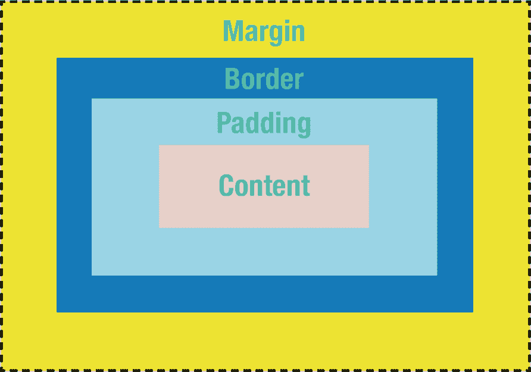
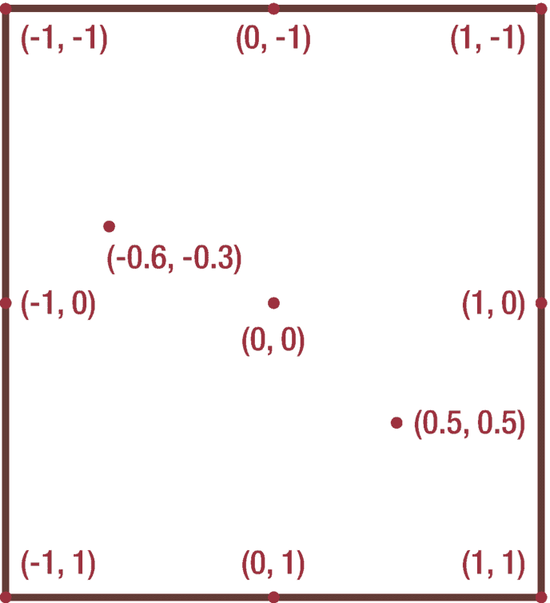
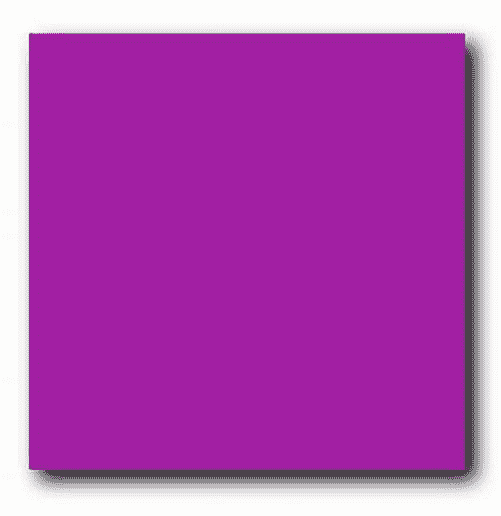
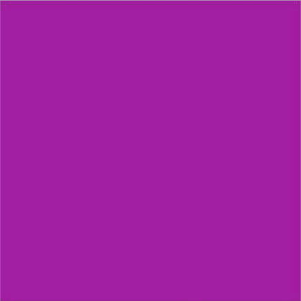
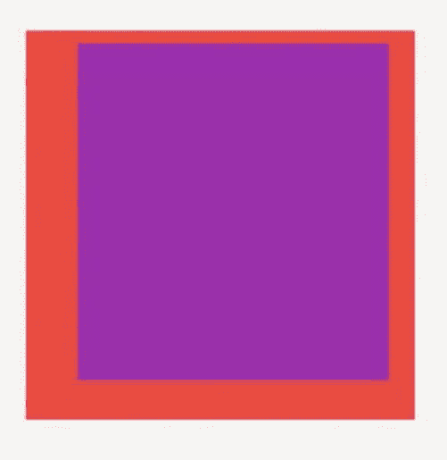
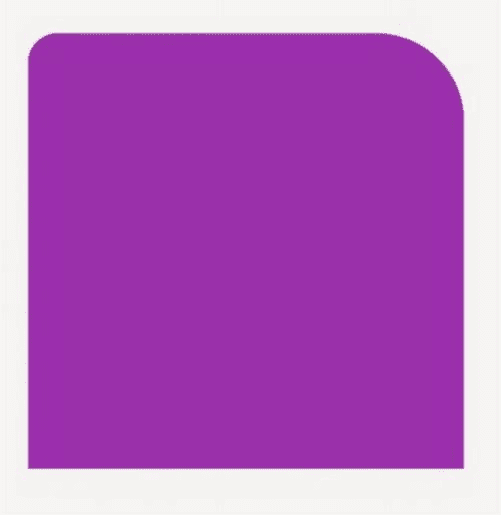
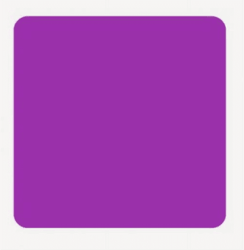
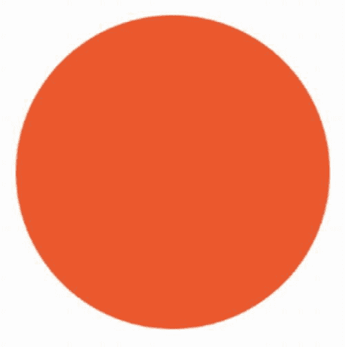
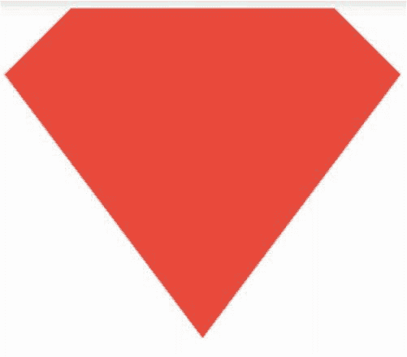

# 15. 布局——微调定位

我们的学习旅程即将结束，掌握了如何布局 Flutter 场景。你已完成了除最后一步之外的所有步骤。

1. 布局整个场景

2. 相对于其他组件定位组件

3. 处理溢出问题（例如组件无法在屏幕上完整显示）

4. 处理多余空间（例如屏幕比实际需要更大时）

5. 微调位置

至此，我们能够在场景中放置任意内容，并按任何可想象的配置将它们彼此相邻或重叠摆放。如果空间不足，我们可以处理溢出问题；如果空间过多，我们可以熟练地分配空间。

现在，如果你准备好进入更高阶的阶段，让我们来讨论微调。在本章中，我们将学习如何精细控制屏幕上的每一个像素，而这一切都将围绕盒模型展开。


## 容器组件与盒模型

Flutter 大量借鉴了其他技术，包括 HTML 和 Web，它们拥有边框（border）、内边距（padding）和外边距（margin）的概念。这些统称为盒模型。参见图 15-1。它们用于在屏幕元素周围及之间创建赏心悦目的间距。这是一个经过实战检验的概念，在 Web 上表现出色，那么为什么不将其借鉴到 Flutter 中呢？



**图 15-1**

盒模型定义了内边距、边框和外边距

假设我们有一个指定尺寸的图片，想要对其进行“装裱”，具体来说，设置内边距为 8、外边距为 10、边框为 1。Flutter 新手可能会首先尝试这样写：

```
Image.network(
_peopleList[i]['picture']['thumbnail'],
padding: 8.0,
margin: 10.0,
border: 1.0,
),
```

这样是行不通的，因为 `Image` 组件并没有 `padding`、`margin` 或 `border` 属性。但你知道什么有吗？容器（Container）！

Web 开发者有时会通过将元素包裹在一个名为 `<div>` 的通用容器中，然后应用样式来为网页创建舒适的间距。

Flutter 没有 `<div>`，但它有一个类似 div 的组件，叫做 `Container`，它的作用就是……嗯……*包含*其他东西。实际上，它存在的全部意义就是对其内部的内容应用布局和样式。一个 HTML 的 `<div>` 可以包含多个东西，但 Flutter 的 `Container` 只能包含一个子元素。它拥有名为 `padding`、`margin` 和 `decoration` 的属性。我们将把 `decoration` 留到本章末尾再讲，但 `padding` 和 `margin` 对于创建美观的间距非常有用：

```
Container(
padding: EdgeInsets.all(8.0),
margin: EdgeInsets.all(10.0),
decoration: BoxDecoration(border: Border.all(width: 1.0)),
child:  Image.network(thePicture),
),
```

### 用于内边距和外边距的 `EdgeInsets`

如果它们允许我们直接列出代表四个边的四个数值，那么外边距和内边距可能更容易学习。（它们就不能让事情简单点吗？）相反，我们使用一个名为 `EdgeInsets` 的辅助组件。

*   `EdgeInsets.all(8.0)` – 相同的值均匀应用于所有四个边。

*   `EdgeInsets.symmetric(horizontal: 7.0, vertical: 5.0)` – 顶部和底部相同。左侧和右侧相同。

*   `EdgeInsets.only(top: 20.0, bottom: 40.0, left: 10.0, right: 30.0)` – 左、上、右、下可以全部不同。

*   `EdgeInsets.fromLTRB(10.0, 20.0, 30.0, 40.0)` – 与上面相同，但输入更少。

另外请注意，如果你只需要内边距（不需要其他格式），`Padding` 组件是一个简写形式。

| `Container(``padding: EdgeInsets.all(5),``child: Text("foo"),``),` | `Padding(``padding: EdgeInsets.all(5),``child: Text("foo"),``),` |

这两者是等价的。

### 容器内的对齐与定位

当你将一个小的子组件放置在一个大的 `Container` 中时，`Container` 中的空间会多于其子组件所需的空间。默认情况下，该子组件会位于左上角。你可以选择使用 *alignment* 属性来定位它：

```
Container(
width: 150, height: 150,
alignment: Alignment(1.0, -1.0),
child:  Image.network(
_peopleList[i]['picture']['thumbnail'],
),
),
```

这些对齐数字代表水平对齐（-1.0 是最左边，0.0 是居中，1.0 是最右边）和垂直对齐（-1.0 是最顶部，0.0 是居中，1.0 是最底部）。参见图 15-2。



**图 15-2**

以 (0,0) 为中心的对齐坐标系

但你可能更倾向于在可能的情况下使用英文单词而不是数字：

```
Container(
width: 150, height: 150,
alignment: Alignment.centerLeft,
child:  Image.network(
_peopleList[i]['picture']['thumbnail'],
),
),
```

`Alignment` 可以接受以下任何值：`topLeft`、`topCenter`、`topRight`、`centerLeft`、`center`、`centerRight`、`bottomLeft`、`bottomCenter`、`bottomRight`。这样写起来是不是更容易，你的开发者同事读起来也更轻松呢？

提示

`Align` 组件是用于指定对齐方式而不指定其他属性的简写形式。`Center` 组件则仅仅是居中的简写形式。

以下三种写法是等价的，第一种是最底层的，最后一种最简洁清晰：

```
Container(
alignment: Alignment.center,
child: Text("foo"),
),
Align(
alignment: Alignment.center,
child: Text("foo"),
),
Center(
child: Text("foo"),
),
```

### 容器的大小并非显而易见

你可能已经注意到，在上一节中，我试图悄悄地向你引入了 `width` 和 `height`。是的，你可以告诉 `Container` 你想要一个特定的 `width` 和 `height`，它会 *在能力范围内* 遵守。`width` 和 `height` 都接受一个简单的数字，范围可以从 0 到 `double.infinity`。`double.infinity` 这个值 *暗示* 要尽可能大到其父级允许的程度。

现在，我知道你在想什么。“Rap，你说的‘在能力范围内’和‘暗示’是什么意思？难道就没有硬性规则吗？我希望 `Container` 的大小是可预测的！”我完全同意。在你了解其规则之前，`Container` 的大小确实难以预测。那么，它到底是如何决定的呢？

记住两件事。首先，`Container` 的构建是为了 *包含* 一个子元素，但拥有子元素是可选的。几乎每次它都会有一个子元素。在极少数情况下，`Container` 没有子元素，我们会用它来提供背景颜色或为其相邻/同级元素创建间距。其次，请记住 Flutter 分两个阶段确定布局：沿渲染树向下传递以确定盒约束（Box Constraints），然后沿着渲染树向上以确定 RenderBox（还记得吗？也就是“尺寸”）。

我们先从上往下看：

*   Flutter 通过从其父级向 `Container` 传递盒约束来限制最大尺寸。

*   `Container` 在向上布局时会告诉其父级：“如果我的邻居需要空间，请尽管拿去。我可以变得和你需要的一样小。”

*   如果设置了 `height` 和/或 `width`，它会遵循这些值，但不超过由盒约束决定的最大尺寸。请注意，你列出的尺寸大于其盒约束并不是错误，只是它不会变得更大。这就是为什么你可以使用 `double.infinity` 而不会出错的原因。

提示

设置 `height` 和 `width` 会使 `Container` 变得非常僵硬；它会锁定一个尺寸。虽然这在你想微调布局时很方便，但最佳实践是避免使用它们，除非你有非常充分的理由。通常，你应该允许组件自行决定它们的大小。

然后我们自下而上：

*   在 1% 的情况下（没有子元素时），它会消耗剩余的所有空间，直到其最大盒约束。

*   但大多数时候，它有一个子元素，因此布局引擎会查看子元素的 RenderBox。

*   如果子元素的 RenderBox 大于我的盒约束，它会裁剪子元素，这是一个大问题。从技术上讲，这不是错误，但看起来很难看。所以请避免这种情况。

*   如果子元素的 RenderBox 在我的盒约束范围内，就会有多余的空间。Flutter 会查看 `alignment` 属性。如果 `alignment` *没有* 设置，我们会将其放置在左上角，并使容器紧密贴合——它会收缩以适应子元素。

*   如果 `alignment` *被* 设置了，它会使容器变得“贪婪”。仔细想想，这有点道理，因为如果它不通过增长来增加空间，它又怎么能进行顶部/底部/左侧/右侧的对齐呢？

*   完成所有这些之后，根据需要缩小以遵守外边距。

是的，这很复杂。这就是为什么 Flutter 开发者经常误解 Container 大小的原因。在沙盒中玩玩，你会慢慢习惯的。这需要一些时间。


## 容器装饰

我们在本章开头承诺过要讨论边框。之所以这样安排，是因为边框并非显而易见的议题。如何给`Text`添加边框？你做不到。如何给`Icon`设置背景？也不行。这些组件本身不具备承载装饰的能力。但你知道什么可以吗？`Container`。当你遇到这类样式问题时，答案几乎总是：将部件包裹在`Container`中，然后为其添加装饰。

因此，理解容器装饰能够解决许多部件面临的样式难题。

`Container`具备一个大多数其他部件所没有的全能样式属性，名为`decoration`。以下示例展示了如何为容器添加阴影：

```
child: Container(
width: 300.0,
height: 300.0,
decoration: BoxDecoration(
color: Colors.purple,
boxShadow: [
BoxShadow(
offset: Offset.fromDirection(0.25*pi, 10.0),
blurRadius: 10.0,
)
],
),
),
```

图 15-3 和 15-4 分别展示了无阴影和有阴影的盒子。



**图 15-4** 带盒阴影的效果



**图 15-3** 无盒阴影的效果

这是 Flutter 冗长特性的典型案例。在 Web 中，实现同样效果只需 17 个字符。但在 Flutter 中，我们必须记住`boxShadow`是一个`BoxShadow`的*数组*，每个阴影对象包含偏移量（方向以弧度表示）、尺寸（以像素为单位）以及模糊半径（同样以像素计）。唉！

模糊半径可能需要额外解释。模糊半径是指阴影消散的距离。这就像给灯加了个灯罩——不加罩子时，光线刺眼，阴影边缘清晰；加上灯罩后，光线柔和，阴影也随之变得柔和。模糊半径值越大，阴影越柔和。

> **注意：** 如果同时使用了`BoxDecoration`，则无法直接在`Container`上指定颜色属性。但别慌；`BoxDecoration`本身也包含`color`属性。只需将`Container`的`color`属性移到`BoxDecoration`中，即可达到相同效果。

还有其他几种装饰可用。让我们看看最实用的几个：`border`、`borderRadius`和`BoxShape`。

### 边框

正如你用`BoxDecoration`实现阴影，你也可以用它为容器添加边框。以下是一个具有四种不同宽度的红色边框（图 15-5）：



**图 15-5** 不同宽度的边框

```
Container(
decoration: BoxDecoration(
color: Colors.purple,
border: Border(
top: BorderSide(width: 10,color: Colors.red,),
right: BorderSide(width: 20,color: Colors.red,),
bottom: BorderSide(width: 30,color: Colors.red,),
left: BorderSide(width: 40,color: Colors.red,),
),
),
)
```

虽然 Flutter 允许我们设置不同宽度甚至不同颜色的边框确实不错，但你多久会用到这个功能呢？通常四边都是统一的。所以我们常用简写形式`Border.all()`：

```
Container(
decoration: BoxDecoration(
color: Colors.purple,
border: Border.all(width: 10, color: Colors.red,),
),
)
```

这样简单多了。没错，依然冗长，但更简洁。

### 圆角半径

圆角是备受青睐的外观。即使没有边框，你也可以让`Container`变得圆润（图 15-6）。通过`BorderRadius`实现：



**图 15-6** 两个角应用`BorderRadius`

```
Container(
decoration: BoxDecoration(
color: Colors.purple,
borderRadius: BorderRadius.only(
topLeft: Radius.circular(20.0),
topRight: Radius.circular(60.0),
),
),
)
```

我们只设置了`topLeft`和`topRight`的圆角半径，但同时也存在`bottomLeft`和`bottomRight`属性。尽管我们欣赏这种灵活性，但实际应用中并不常用。我们通常会让四个角保持一致（图 15-7）：



**图 15-7** 四个角都应用`BorderRadius`

```
Container(
decoration: BoxDecoration(
color: Colors.purple,
borderRadius: BorderRadius.all(Radius.circular(20.0),),
),
)
```

### 盒子形状

你的容器不必总是矩形。当需要其他形状时，可以通过`BoxShape`或`CustomPainter`实现。`BoxShape`使用更为简便，但它只支持圆形（除了默认的矩形外），如图 15-8 所示：



**图 15-8** `BoxShape.circle`让你的`Container`变圆形

```
Container(
decoration: BoxDecoration(
shape: BoxShape.circle,
color: Colors.deepOrange,
),
),
```

`CustomPainter`则复杂得多，但支持无限种形状。深入`CustomPainter`的细节可能会分散注意力（图 15-9），但这里提供一个快速示例——超人盾牌：



**图 15-9** 使用`CustomPainter`

```
Container(
child: CustomPaint(
size: Size(200, 200),
painter: SupermanShieldPainter(),
),
)
class SupermanShieldPainter extends CustomPainter {
@override
void paint(Canvas canvas, Size size) {
canvas.drawPath(Path()
..moveTo(25, 0)
..lineTo(125, 0)
..lineTo(150,25)
..lineTo(75, 125)
..lineTo(0,25)
..lineTo(25,0),
Paint()
..style=PaintingStyle.fill
..color = Colors.red
);
}
@override
bool shouldRepaint(oldDelegate) => false;
}
```

看到了吗？相当复杂。请注意，你的容器仍然是矩形，只是背景发生了改变。若要深入了解`CustomPainter`，请查阅[`https://api.flutter.dev/flutter/widgets/CustomPaint-class.html`](https://api.flutter.dev/flutter/widgets/CustomPaint-class.html)。

> **提示：** 所有这些装饰都应用于`decoration`属性，但它们同样可以应用于名为`foregroundDecoration`的属性——顾名思义，该属性应用于容器*之上*的图层。由于它们绘制在其他元素上方，你需要记住另一个修改项：不透明度。颜色可以设置为半透明。以下代码将在容器顶部创建一个 50%透明的红色图层：
>
> ```
> foregroundDecoration: BoxDecoration(
> color:Colors.red.withOpacity(0.5),
> ),
> ```

## 结论

从很多方面来看，`Container`是 Flutter 中最为典型的部件，提供了大量选项来微调布局。天哪，你甚至可以用`Container`完成整个布局，因为它们实在太万能了！（小朋友们，可千万别真这么干。我们只是理论探讨。）但`Container`对于微调布局和为众多其他部件添加视觉装饰来说，确实非常有用。

嘿，恭喜你！你已经掌握了一些非常难的概念，我们希望在前几章中这些内容学起来更容易。我们将用一个相关主题来结束本书：特殊展示部件。它们会将你的布局提升到新高度！

