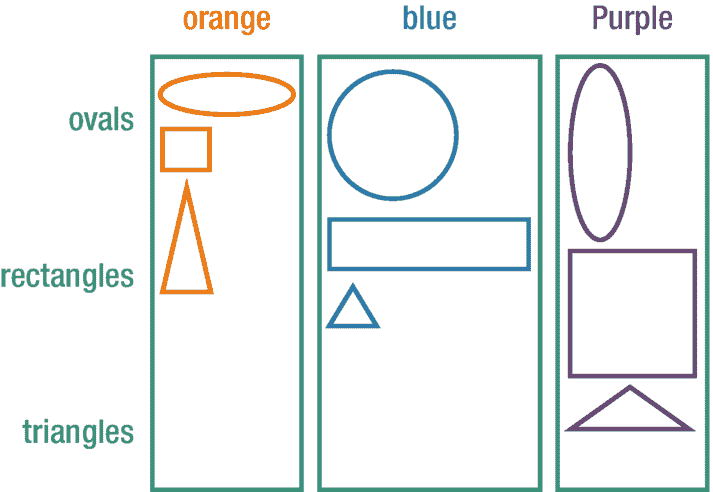
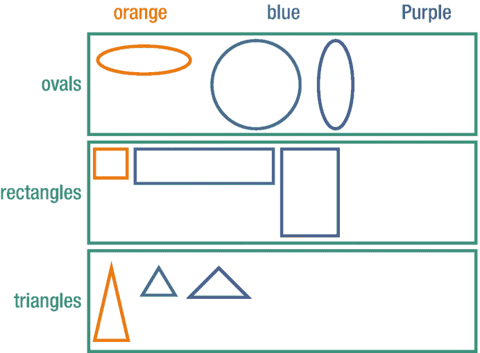
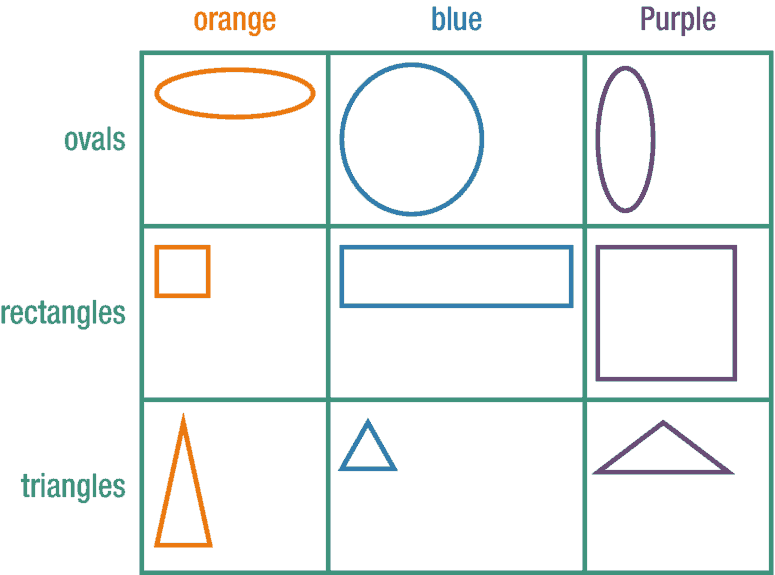
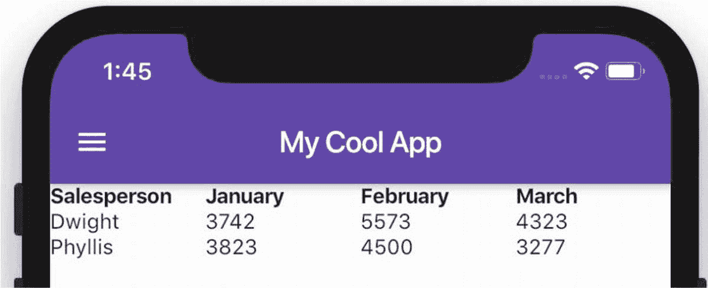

# 16. 布局——特殊展示部件

在之前的五章布局内容之后，我们已经涵盖了 90%布局需求所需的工具，但仍有更多内容。有几个部件值得一看，这样当遇到相关情况时，你就知道该用什么工具。这些部件专为非常特定的布局场景设计，虽然常见，但并非日常使用，需要专门的工具来实现。

我们将快速浏览`Sliver`，然后深入探讨`Stack`和`Table`部件。


## Slivers（滑片组件）

Slivers 是一个重要主题，足以用几个章节来深入探讨，因此我们仅作浅层介绍。我们的目标是让您了解它们。只要知道它们的用途，目前就足够了。Slivers 用于实现自定义滚动设计。

您可能有一天需要创建视差效果，或实现当区块位于顶部时折叠、在视口中滚动时展开的效果，或实现多个可滚动的 `ListView` 并且彼此之间也能滚动切换，或带有子标题的可滚动列表，或可在可滚动容器内部再滚动的小部件。Slivers 实现了这些高级滚动行为。是不是有点令人惊叹？

简而言之：当常规的 Flutter 小部件无法满足您的开箱即用滚动需求时，Slivers 就能派上用场。Slivers 是屏幕上的*可滚动部分*。以下是一些主要的 Sliver 小部件：

* `SliverList` – 类似 `ListView`，但对自定义滚动效果具有更高的灵活性
* `SliverFixedExtentList` – 与 `SliverList` 类似，但将所有子项保持固定大小，适用于网格或统一尺寸的列表
* `SliverAppBar` – 一个可随用户滚动而折叠或展开的应用栏
* `SliverPadding` – 为 sliver 元素添加能感知滚动的内边距
* `SliverGrid` – 在可滚动区域内呈现网格布局

如果以上都不完全符合您的需求，您可以尝试构建自己的自定义可滚动小部件，通过扩展 `Sliver` 类并重写 `layoutChild` 等类似方法来实现。

## Stack（堆叠）小部件

当您希望将小部件分层放置，使它们在屏幕上占据相同的 X 和 Y 位置并相互重叠时，就可以使用它。您想要……嗯……将它们沿着 Z 方向进行*堆叠*。使用 `Stack`，您可以列出若干子小部件，它们将按此顺序一层层叠加显示。最后添加的子小部件会遮挡（隐藏）前一个，前一个又会遮挡更前一个，以此类推。

使用 `Stack`，您可以创建一些非常酷的布局。实际上，Material 卡片大量使用了 `Stack`，因为它支持在背景图片上叠加文字。也许我们想要一张卡片，包含人物头像，并在其上叠加显示姓名和详细信息（图 16-1）。^(²⁴)


图 16-1  
使用 `Stack` 小部件在图片上叠加文字效果的卡片

以下是实现方式：

```
Card(
  child: Stack(
    children: [
      Image.asset("sandeep.jpg"),
      Column(
        children: [
          Text("Sandeep Patel", style: _bigText),
          Expanded(child: Container()), // 用于产生间距
          Text("Email: s.patel@us.com"),
          Text("Phone: +1 (555) 786-3512"),
        ],
      ),
    ],
  ),
),
```

在 `Stack` 中，我们首先放置了图片。然后在图片上方，添加了一个包含文本元素的 `Column`。由于 `Column` 是在图片*之后*添加的，因此它显示在图片的前面。

### Positioned（定位）小部件

在前面的例子中，文本布局效果尚可，因为 `Column` 会将其子元素居中，而 `Expanded` 将 `Text` 分别推到了顶部和底部。但如果我们将所有元素直接放在 `Stack` 中，结果会如图 16-2 所示。


图 16-2  
没有使用 `Positioned` 小部件时，所有元素都挤在左上角

当您使用 `Stack` 时，其中的每个小部件都会默认尝试停留在左上角。我们可以通过将这些内部小部件包裹在 `Positioned` 小部件中，将它们精确地放置在 `Stack` 中的任意位置。^(²⁵)

```
Card(
  child: Stack(
    children: [
      Image.asset("sandeep.jpg"),
      Positioned(
        top: 10, left: 10,
        child: Text("Sandeep Patel", style: _bigText),
      ),
      Positioned(
        bottom: 30, right: 10,
        child: Text("Email: s.patel@us.com"),
      ),
      Positioned(
        bottom: 10, right: 10,
        child: Text("Phone: +1 (555) 786-3512"),
      ),
      Positioned(
        bottom: 0, left: 0, height: 100, width: 100,
        child: FlutterLogo(),
      ),
    ],
  ),
),
```

为了效果更好，我们还添加了一个 `FlutterLogo`。现在结果如图 16-3 所示。看起来好多了！


图 16-3  
使用 `Positioned` 小部件后，效果明显改善

`Positioned` 小部件通过指定 `top`、`bottom`、`left` 和/或 `right` 位置，使其子元素与四个角中的某一个保持固定距离。

### Card（卡片）小部件

您可能已经注意到，在前面的例子中我们使用了 `Card` 小部件。在这种场景下，使用 `Card` 感觉恰到好处，但它并非必需的。

Flutter 的 `Card` 小部件旨在实现 Material Design 的外观和感觉，具有诸如 `color`（背景色）、`elevation`（阴影大小）、`borderOnForeground`（边框）和 `margin`（外边距）等属性。诚然，所有这些属性也可以通过 `Container` 实现。但如果您想使用标准的外观和感觉，`Card` 能让事情变得更简单：

```
Card(
  elevation: 20.0,
  child: Text("This is text in a card"),
),
```

## Table（表格）小部件

当需要以自动换行的行和列来显示小部件时，`GridView` 非常出色。自动换行意味着您并不真正关心哪个子小部件最终位于哪一行哪一列。位置无关紧要。您只是希望它们整齐地显示出来。

当您*确实*关心每个子元素位于哪一行哪一列时，`Row` 和 `Column` 是最佳选择。在需要时，它们可以很严格。不幸的是，列与列之间无法相互通信，因此它们经常会对不齐（图 16-4 和 16-5）。



图 16-5  
使用嵌套小部件的 `Column` 可以工作，但行没有对齐



图 16-4  
使用嵌套小部件的 `Row` 可以工作，但列没有对齐

`Table` 小部件解决了这个问题。它像嵌套的 `Row` 和 `Column` 一样严格，但每一行和每一列都能感知到其他行和列的存在，从而整齐地对齐（图 16-6）。



图 16-6  
`Table` 使行和列对齐

`Table` 小部件包含子元素，即一组 `TableRow` 小部件。每个 `TableRow` 小部件又包含子元素，即一组子小部件：

```
return Table(
  children: [
    // 第 1 行，标题行
    TableRow(children: [
      Text('Salesperson', style: _bold),
      Text('January', style: _bold),
      Text('February', style: _bold),
      Text('March', style: _bold),
    ]),
    // 第 2 行
    TableRow(children: [
      Text('Dwight'),
      Text('3742'),
      Text('5573'),
      Text('4323'),
    ]),
    // 第 3 行
    TableRow(children: [
      Text('Phyllis'),
      Text('3823'),
      Text('4500'),
      Text('3277'),
    ]),
  ],
);
```

上述代码将生成图 16-7。



图 16-7  
`Table` 小部件同时使行和列对齐

**注意**

任何有 HTML 背景的人都知道，使用 HTML `<table>` 来布局页面是可行的，但并非好主意。`<table>` 应用于显示数据，而不是用于布局。在 Flutter 中也是如此。虽然可行，但一般来说，应避免使用表格来布局页面。但如果要显示数据，`Table` 是正确的选择。

如果您想对列宽进行更多控制，请将 `columnWidths` 属性设置为一个从列号到宽度的 `Map`。以下代码将使第一列占据 30% 的宽度，并将剩余的 70% 平均分配给其余列：

```
return Table(
  columnWidths: {0: FractionColumnWidth(0.3)},
  children: [ ...
```

如何实现跨列？例如用于表格标题。遗憾的是，在 Flutter 的 `Table` 中还不能直接实现——目前不行。也许将来可以。已经有关于跨列的 feature request 了。


## 结语

Flutter 丰富多样的组件既是其优势，也造成了诸多困惑——这无疑是一把双刃剑。在经历了这第六篇（没错！）关于布局组件的章节后，相信你已掌握足够的知识来应对大部分布局难题。本章我们重点介绍了一些特殊的布局组件，这将赋予你构建极具创意的 Flutter 界面的能力。

感谢你与我同行！衷心祝愿你在 Flutter 的探索之旅中一切顺利！


