# 1. 开始使用

本章的指南将帮助你搭建本地开发环境，为构建 Flutter 应用做好准备。根据你机器的操作系统不同，设置步骤可能有所差异。你只需根据自身需求使用相应的指南即可。完成本章指南后，你应该能够在模拟器或物理设备上运行第一个 Flutter 应用。

## 1.1 在 Windows 上安装 Flutter SDK

### 问题

你有一台 Windows 机器，并希望在这台机器上开始 Flutter 开发。

### 解决方案

在 Windows 机器上安装 Flutter SDK 并配置 Android 平台。

### 讨论

Flutter SDK 支持 Windows 平台。在 Windows 上安装 Flutter 并不像你想象的那样困难。首先，你需要确保本地开发环境满足最低要求。你需要拥有 64 位 Windows 7 SP1 或更高版本，并且 Flutter SDK 至少需要 400MB 的可用磁盘空间。Flutter SDK 还需要机器上安装有 Windows PowerShell 5.0 或更新版本，以及 Git for Windows。

Windows PowerShell 5.0 预装在 Windows 10 中。对于 Windows 10 之前的 Windows 版本，你需要按照微软的说明（https://docs.microsoft.com/en-us/powershell/scripting/setup/installing-windows-powershell）手动安装 PowerShell 5.0。你可能已经安装了 Git for Windows，因为 Git 是一种非常流行的开发工具。如果你可以在 PowerShell 中运行 Git 命令，那就没问题。否则，你需要下载 Git for Windows（https://git-scm.com/download/win）并安装它。在安装 Git for Windows 时，请确保在“调整你的 PATH 环境”页面中选中“从命令行以及第三方软件使用 Git”选项；见图 1-1。

满足这些最低要求后，你可以从官方网站（https://flutter.dev/docs/get-started/install/windows）下载 Flutter SDK 的 zip 压缩包。将下载的 zip 文件解压到本地机器上所需的位置。建议避免使用安装 Windows 的系统驱动器。在解压后的目录中，双击 `flutter_console.bat` 文件启动 Flutter 控制台并运行 Flutter SDK 命令。

为了能够在任何 Windows 控制台中运行 Flutter SDK 命令，我们需要将 Flutter SDK 添加到 `PATH` 环境变量中。安装目录下 `bin` 文件夹的完整路径应被添加到 `PATH` 中。在 Windows 10 上修改 PATH：

1.  打开开始搜索，输入“env”并选择“编辑系统环境变量”。
2.  点击“环境变量...”按钮，在“系统变量”区域下找到第一列为“Path”的行。
3.  在“编辑环境变量”对话框中，点击“新建”并输入已安装 Flutter SDK 的 `bin` 目录路径。
4.  点击“确定”关闭所有对话框。

现在，你可以打开一个新的 PowerShell 窗口，输入命令 `flutter --version` 来验证安装；见图 1-2。

Windows 上仅支持 Android 平台。请按照指南 1-7 继续设置。

## 1.2 在 Linux 上安装 Flutter SDK

### 问题

你有一台 Linux 机器，并希望在这台机器上开始 Flutter 开发。

### 解决方案

在 Linux 机器上安装 Flutter SDK 并配置 Android 平台。


### 讨论

Flutter SDK 支持 Linux 平台。然而，由于存在众多不同的 Linux 发行版，安装 Flutter SDK 的实际步骤可能略有差异。本指南基于在 Ubuntu 18.04 LTS 上安装 Flutter SDK。

Flutter SDK 要求本地环境中具备若干命令行工具，包括 `bash`、`mkdir`、`rm`、`git`、`curl`、`unzip` 和 `which`。对于大多数 Linux 发行版，`bash`、`mkdir`、`rm`、`unzip` 和 `which` 这些命令默认应该已经包含在内。最简便的验证方法是打开一个终端窗口并输入这些命令查看输出。如果某个命令未安装，你会看到“command not found”错误。`git` 和 `curl` 很可能默认未包含。大多数 Linux 发行版提供了内置的包管理器来安装这些工具。对于 Ubuntu，可以使用 `apt-get`，参见以下命令。

```
$ sudo apt-get update
$ sudo apt-get install -y curl git
```

安装成功完成后，你可以输入 `curl` 和 `git` 命令进行验证。

现在，你可以从官方网站（`https://flutter.dev/docs/get-started/install/linux`）下载 Flutter SDK 压缩包。将下载的压缩文件解压到本地机器的目标位置。打开一个终端窗口，导航到解压后的 Flutter SDK 目录，并运行以下命令来验证安装。

```
$ bin/flutter --version
```

建议将 Flutter SDK 的 `bin` 目录添加到 `PATH` 环境变量中，以便在任何终端会话中都能运行 `flutter` 命令。对于 Ubuntu，你可以编辑 `~/.profile` 文件。

```
$ nano ~/.profile
```

将以下行添加到此文件并保存。

```
export PATH="/bin:$PATH"
```

在当前终端窗口中，你需要运行 `source ~/.profile` 使更改生效。或者，你可以直接创建一个新的终端窗口。在任何终端窗口中输入 `flutter --version` 进行验证。你会看到与图 1-2 相同的输出。

Linux 仅支持 Android 平台。按照指南 1-7 继续后续设置。

## 1.3 在 macOS 上安装 Flutter SDK

### 问题

你有一台 macOS 机器，并希望在这台机器上开始 Flutter 开发。

### 解决方案

在 macOS 机器上安装 Flutter SDK 并设置 Android 和 iOS 平台。

### 讨论

对于 macOS，Flutter SDK 要求本地环境中具备若干命令行工具。这些工具包括 `bash`、`mkdir`、`rm`、`git`、`curl`、`unzip` 和 `which`。macOS 应该已经将这些工具作为系统的一部分包含在内。你只需在终端中输入这些命令即可验证。安装缺失工具的最简便方法是使用 Homebrew（`https://brew.sh/`）。在设置 iOS 开发环境时，Homebrew 也很重要。使用 `brew install` 来安装工具，例如，使用 `brew install git` 来安装 Git。

安装所需工具后，我们可以从官方网站（`https://flutter.dev/docs/get-started/install/macos`）下载 Flutter SDK 压缩包。将下载的压缩文件解压到本地机器的目标位置。`flutter` 命令位于解压位置的 `bin` 目录下。

为了在任何终端会话中运行 `flutter` 命令，应更新 `PATH` 环境变量，使其包含 Flutter SDK 的 `bin` 目录。这通常通过更新 shell 的配置文件来完成。对于默认的 bash，此文件是 `~/.bash_profile`。对于 zsh，此文件是 `~/.zshrc`。修改此文件以包含以下行。

```
export PATH=/bin:$PATH
```

要使当前终端窗口使用更新后的 `PATH`，你需要运行 `source ~/.bash_profile`。你也可以启动一个新的终端窗口，它会自动使用 `PATH` 的更新值。

在任何终端窗口中运行 `flutter --version` 以验证安装。你会看到与图 1-2 相同的输出。

macOS 同时支持 Android 和 iOS 平台。按照指南 1-4 和 1-7 继续后续设置。

## 1.4 设置 iOS 平台

### 问题

你想为 iOS 平台开发 Flutter 应用。

### 解决方案

在您的 Mac 上为 Flutter SDK 设置 iOS 平台。

### 讨论

要为 iOS 开发 Flutter 应用，你需要一台至少安装了 Xcode 9.0 的 Mac。要设置 iOS 平台，你需要完成以下步骤：

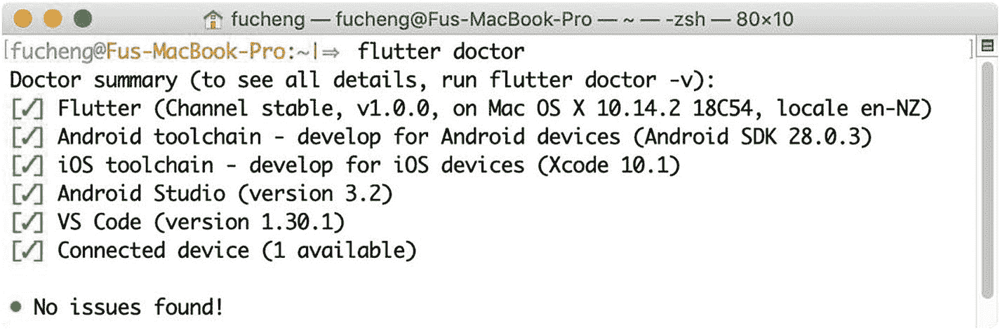  
图 1-3：`flutter doctor` 的输出

1.  从 App Store 安装 Xcode（`https://developer.apple.com/xcode/`）。

2.  验证 Xcode 命令行工具的路径。运行以下命令以显示当前命令行工具的路径。通常你应该会看到类似 `/Applications/Xcode.app/Contents/Developer` 的输出。

    ```
    $ xcode-select -p
    ```

    如果输出中显示的路径不是您想要的，例如，您安装了不同版本的 Xcode 命令行工具，请使用 `xcode-select -s` 切换到不同的路径。如果您没有安装命令行工具，请使用 `xcode-select --install` 打开安装对话框。

3.  您需要打开一次 Xcode 以接受其许可协议。或者，您可以选择运行命令 `sudo xcodebuild -license` 来查看并接受它。

4.  Flutter SDK 需要用于 iOS 平台的其他工具，包括 `libimobiledevice`、`usbmuxd`、`ideviceinstaller`、`ios-deploy` 和 CocoaPods（`https://cocoapods.org/`）。所有这些工具都可以使用 Homebrew 安装。如果您运行 `flutter doctor` 命令，它会显示使用 Homebrew 安装这些工具的命令。只需运行这些命令，然后再次使用 `flutter doctor` 进行检查。当您看到“iOS toolchain”旁边出现绿色勾选标记时，表示 iOS 平台已成功设置为 Flutter SDK 使用；示例输出见图 1-3。

## 1.5 设置 iOS 模拟器

### 问题

您需要一种快速的方法在 iOS 平台上测试 Flutter 应用。

### 解决方案

设置 iOS 模拟器。

### 讨论

Xcode 为不同的 iOS 版本提供了模拟器。您可以使用 Xcode ➤ Preferences 中的 Components 选项卡下载额外的模拟器。要打开模拟器，请运行以下命令。

```
$ open -a Simulator
```

当模拟器打开后，您可以通过菜单 **Hardware** ➤ **Device** 切换不同设备与 iOS 版本的组合。

模拟器启动后，运行 `flutter devices` 应该会显示该模拟器。

## 1.6 设置 iOS 真机设备

### 问题

您已经在 iOS 模拟器上完成了 Flutter 应用的测试，现在希望在真实的 iOS 设备上测试它们。

### 解决方案

将 Flutter 应用部署到 iOS 真机设备。


### 讨论

在将 Flutter 应用部署到 iOS 设备之前，需要运行 `flutter doctor` 来验证 iOS 工具链是否正确配置。要在设备上开发和测试 Flutter 应用，你需要有一个 Apple ID。如果你想将应用分发到 App Store，还需要注册 Apple Developer Program。

首次连接物理设备进行 iOS 开发时，需要信任该 Mac 电脑以连接你的设备。Flutter 应用在部署到设备前需要进行签名。在 Xcode 中打开 Flutter 应用的 `ios/Runner.xcworkspace` 文件。在 **General** 标签页的 **Signing** 部分选择正确的团队。如果你选择已连接的设备作为运行目标，Xcode 将完成代码签名所需的必要配置。**Bundle Identifier** 必须是唯一的。

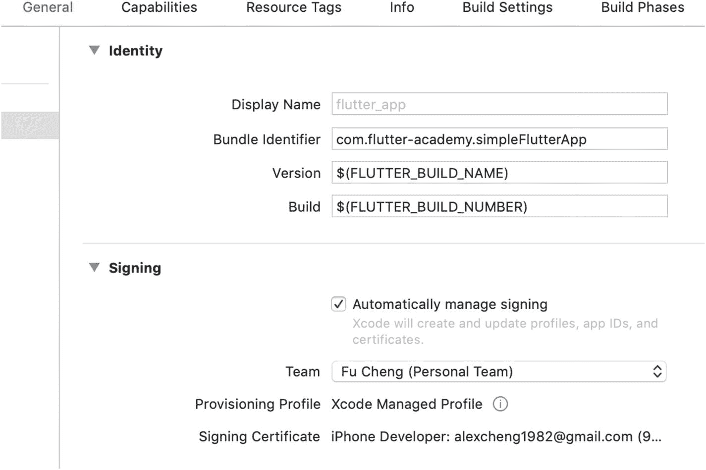

图 1-4

在 Xcode 中进行应用签名

Flutter 应用可以通过 Xcode 或 `flutter run` 命令部署到设备。首次部署应用时，可能需要在 iOS 设备上“设置”应用的 **通用** ➤ **描述文件与设备管理** 中信任开发证书。

## 1.7 搭建 Android 平台

### 问题

你想为 Android 平台开发 Flutter 应用。

### 解决方案

安装 Android Studio 以在你的本地机器上搭建 Android 平台。

### 讨论

要为 Android 平台开发 Flutter 应用，我们需要先搭建 Android 平台。Flutter SDK 需要完整安装 Android Studio 以获取其 Android 平台依赖，因此我们必须安装 Android Studio。

访问 Android Studio 下载页面（`https://developer.android.com/studio/`）并点击“下载 Android Studio”按钮。你需要接受条款和条件才能下载。下载页面会检查你的平台并提供最合适的版本进行下载。如果提供的选项不是你想要的，请点击“下载选项”并从所有下载选项列表中进行选择；见图 1-5。

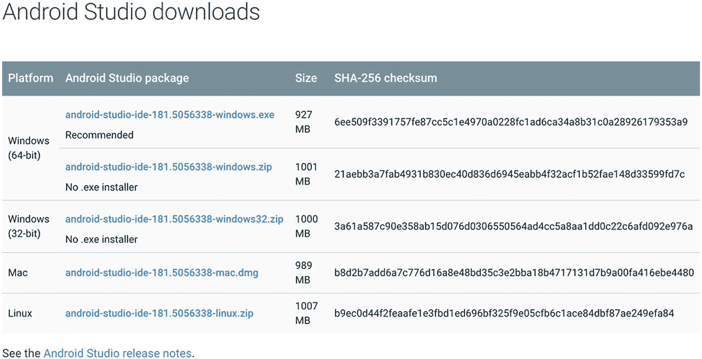

图 1-5

Android Studio 的下载选项

Android Studio 提供了一个基于 GUI 的安装程序，因此非常容易在本地机器上安装和运行。安装 Android Studio 也会安装 Android SDK、Android SDK 平台工具和 Android SDK 构建工具。即使你选择不使用 Android Studio 作为 IDE，Android 开发仍然需要 Android SDK 及其相关工具。

在 Android Studio 偏好设置的 Android SDK 页面中，你还可以安装其他 Android SDK 平台和工具；见图 1-6。Android Studio 还会提示已安装的 Android SDK 平台和工具的可用更新。

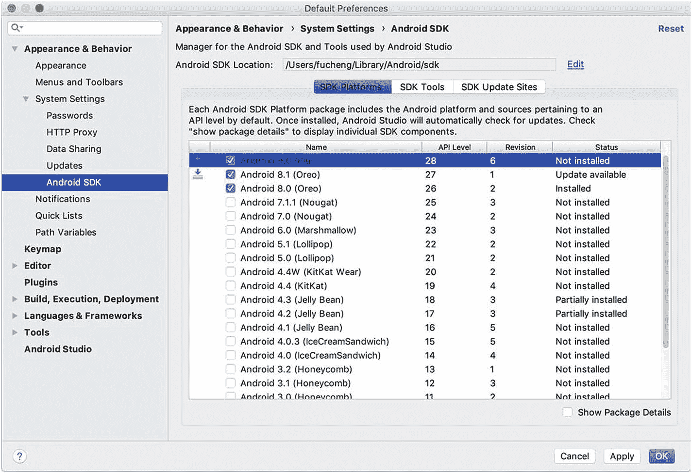

图 1-6

在 Android Studio 中管理 Android SDK

## 1.8 搭建 Android 模拟器

### 问题

你需要一种快速的方法来测试适用于 Android 平台的 Flutter 应用。

### 解决方案

搭建 Android 模拟器。

### 讨论

在开发 Flutter 应用时，你可以在 Android 模拟器上运行它们，以查看应用运行的效果。要搭建 Android 模拟器，可以按照以下步骤操作。

在 Android Studio 中打开一个 Android 项目，选择 **Tools** ➤ Android ➤ **AVD Manager** 以打开 AVD Manager，然后点击“创建虚拟设备…”；见图 1-7。

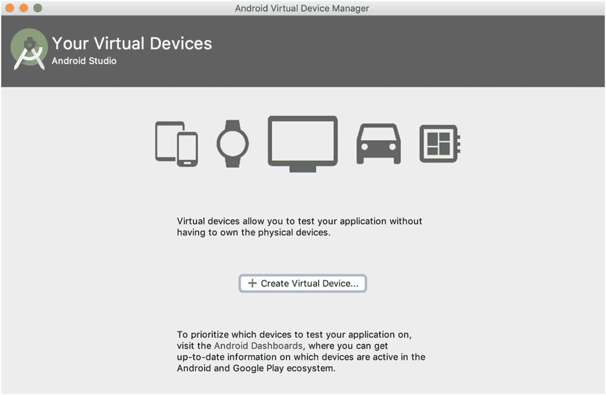

图 1-7

Android 虚拟设备管理器

选择一个设备定义，例如 Nexus 6P，然后点击“下一步”；见图 1-8。

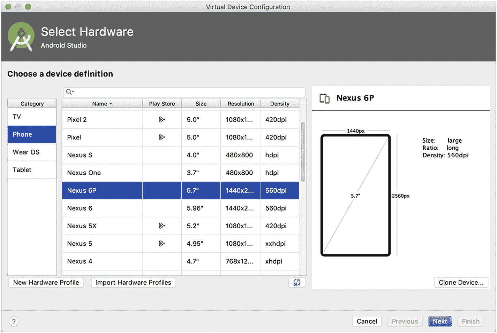

图 1-8

选择硬件

为你想要模拟的 Android 版本选择一个系统映像，然后点击“下一步”；见图 1-9。

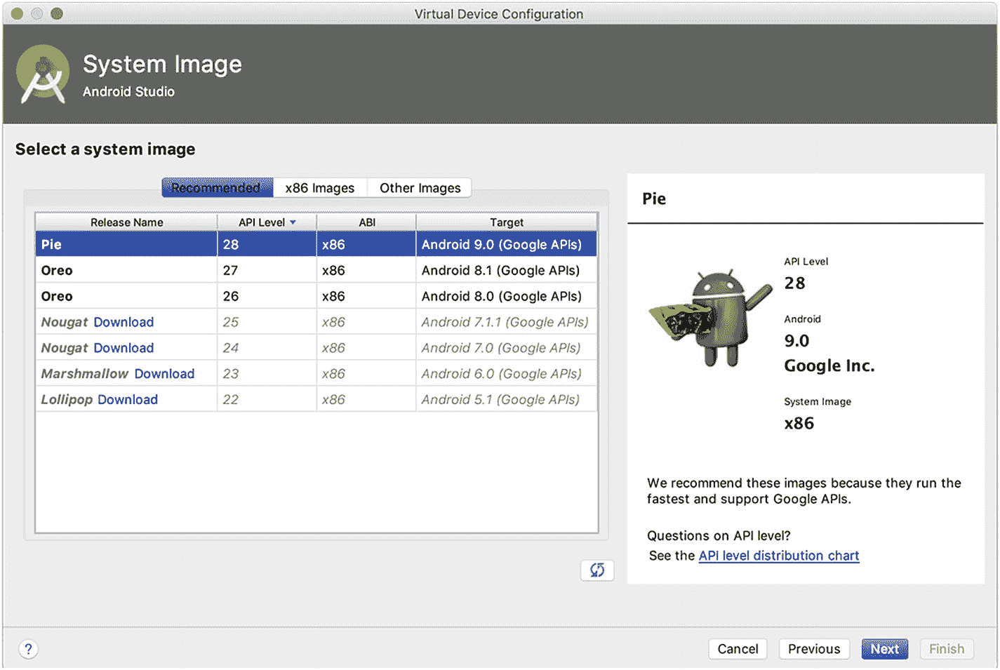

图 1-9

选择系统映像

为模拟性能选择 **Hardware - GLE 2.0** 以启用硬件加速，然后点击“完成”；见图 1-10。

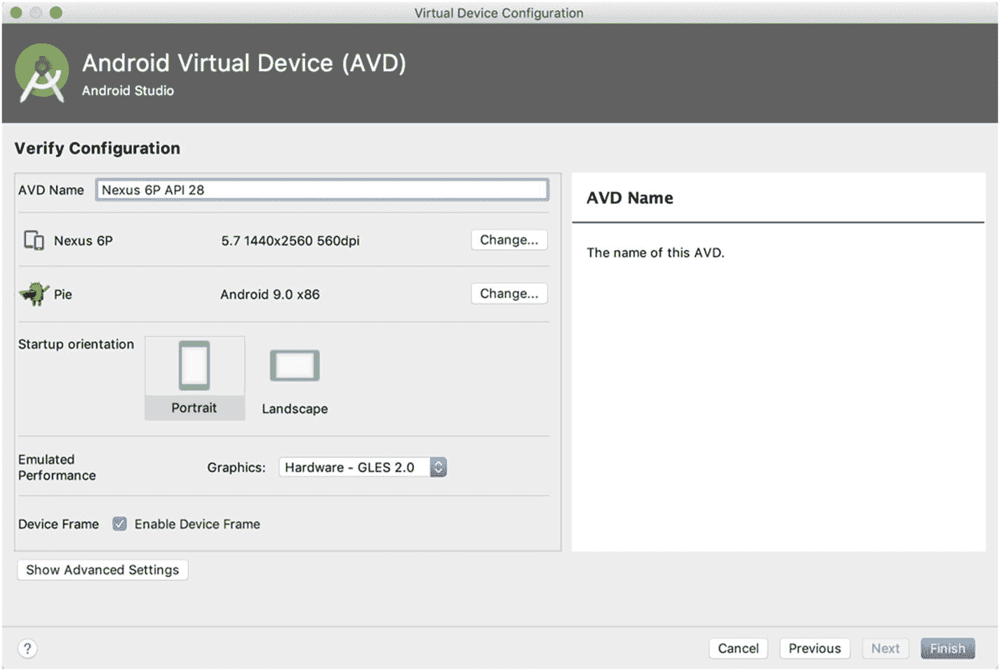

图 1-10

选择模拟性能

一个新的 AVD 被创建并显示在 AVD Manager 中。如果你想了解更多关于 AVD 配置的详细信息，Android Studio 官方网站提供了一个全面的指南（`https://developer.android.com/studio/run/managing-avds`），介绍如何管理 AVD。

在 AVD Manager 中，点击绿色的三角形按钮启动模拟器。模拟器启动并显示默认的 Android 主屏幕可能需要一些时间。

## 1.9 搭建 Android 设备

### 问题

你已经在模拟器上完成了 Flutter 应用的测试，现在想在实际的 Android 设备上测试它们。

### 解决方案

配置你的 Android 设备以运行 Flutter 应用。

### 讨论

要配置你的 Android 设备，可以按照以下步骤操作：

1.  你需要在设备上启用开发者选项和 USB 调试。请查看 Android 官方网站上的说明（`https://developer.android.com/studio/debug/dev-options#enable`）。你可能还需要在 Windows 机器上安装 Google USB 驱动程序（`https://developer.android.com/studio/run/win-usb`）。

2.  使用 USB 数据线将设备连接到电脑。设备会弹出一个对话框请求权限，授权你的电脑访问设备。

3.  运行命令 `flutter devices` 以验证 Flutter SDK 能否识别你的设备。

Flutter 应用可以通过 Android Studio 或 `flutter run` 命令部署到设备。

## 1.10 使用命令行创建 Flutter 应用

### 问题

你已经搭建好了本地环境来开发 Flutter 应用。虽然使用 Android Studio 或 VS Code 是开发的良好选择，但你仍可能想知道如何通过命令行来实现。

### 解决方案

使用 Flutter SDK 中的命令来创建和构建 Flutter 应用。

### 讨论

使用像 Android Studio 和 VS Code 这样的工具可以使 Flutter 开发变得更加容易。然而，了解如何使用命令行工具构建 Flutter 应用仍然很有价值。这对于持续集成非常重要。它也使你能够使用任何其他编辑器来开发 Flutter 应用。

`flutter create` 命令可用于创建一个新的 Flutter 应用。实际上，Android Studio 和 VS Code 都使用此命令来创建新的 Flutter 应用。以下命令在 `flutter_app` 目录中创建一个新的 Flutter 应用。

```
$ flutter create flutter_app
```

此命令在指定目录中创建各种文件，作为新应用的框架代码。导航到 `flutter_app` 目录，并使用 `flutter run` 来运行此应用。

## 1.11 使用 Android Studio 创建 Flutter 应用

### 问题

你想拥有一个强大的 IDE，能满足开发 Flutter 应用时的大部分需求。

### 解决方案

使用 Android Studio 创建 Flutter 应用。


### 讨论

由于我们已经安装了 Android Studio 来为 Flutter SDK 配置 Android 平台，因此使用 Android Studio 作为 IDE 来开发 Flutter 应用是一个很自然的选择。Android Studio 本身是一款基于 IntelliJ 平台的强大 IDE。如果你使用过 JetBrains 的其他产品，比如 IntelliJ IDEA 或 WebStorm，你会发现上手 Android Studio 非常容易。

要使用 Android Studio 进行 Flutter 开发，需要安装 `Flutter` 和 `Dart` 插件。安装这两个插件时，请打开 Android Studio 的 `Preferences`（偏好设置）对话框中的 `Plugins`（插件）页面，然后点击“Browse repositories…”（浏览仓库…）按钮。在打开的对话框中，输入“Flutter”搜索并安装 `Flutter` 插件；参见图 1-11。点击绿色的 Install（安装）按钮进行安装。系统会提示您同时安装 `Dart` 插件。点击“Yes”（是）进行安装。然后重启 Android Studio。

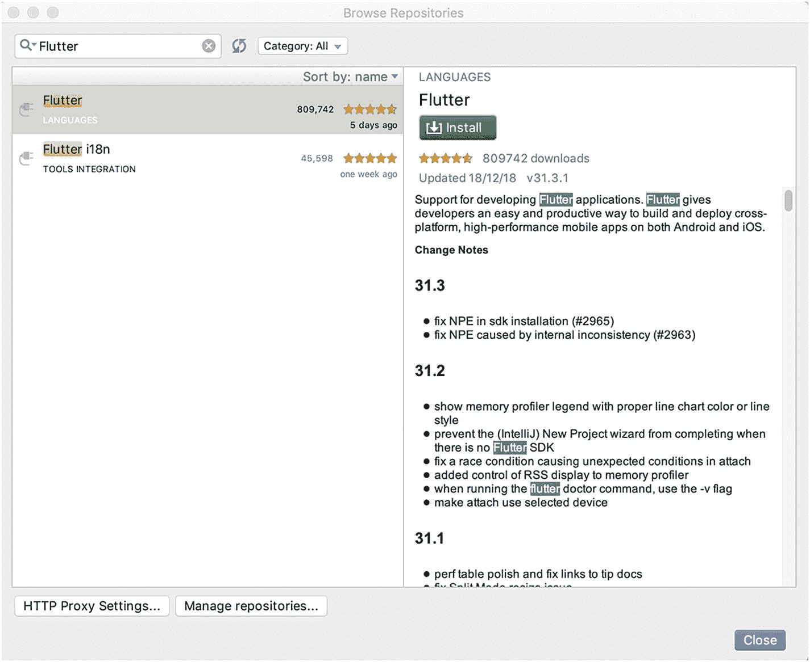

图 1-11

在 Android Studio 中安装 Flutter 插件

重启 Android Studio 后，您应该会看到一个用于启动新 Flutter 项目的新选项。Flutter 项目的向导包含多个页面，用于配置新项目。

第一个页面允许您选择新 Flutter 项目的类型。页面中的描述说明了这四种不同项目类型之间的区别。大多数情况下，我们将创建一个 Flutter 应用程序。

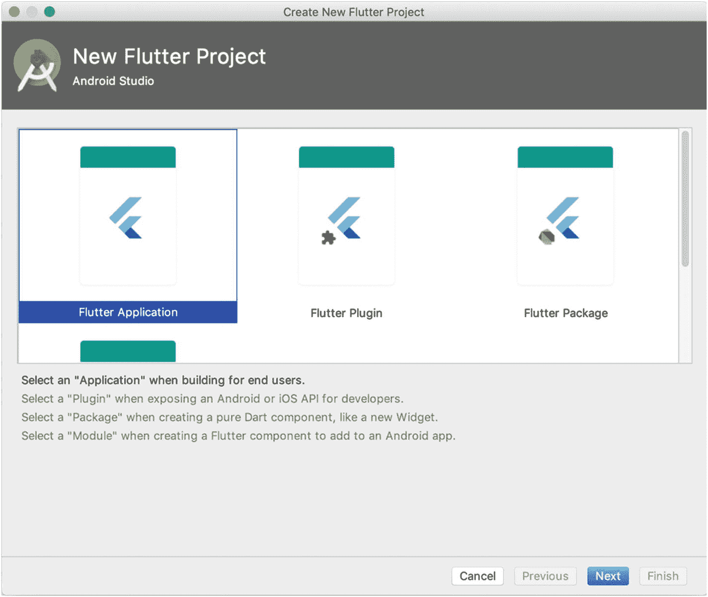

图 1-12

选择 Flutter 项目类型

第二个页面允许您自定义新 Flutter 项目的基本配置，包括项目名称、位置和描述。

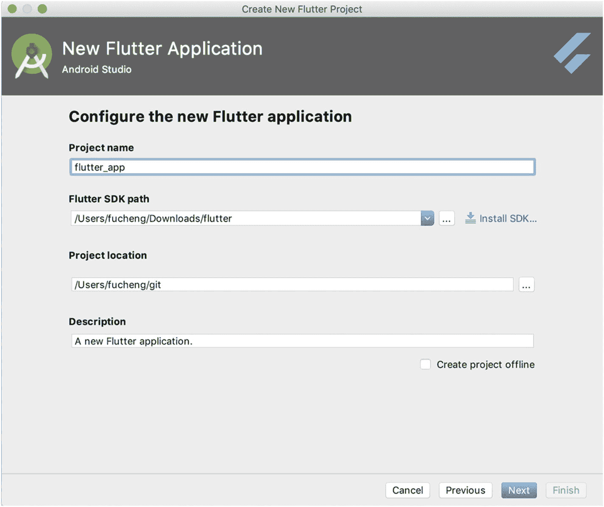

图 1-13

基本项目配置

最后一个页面允许您自定义一些高级项目配置。公司域名用于为项目创建唯一标识符。

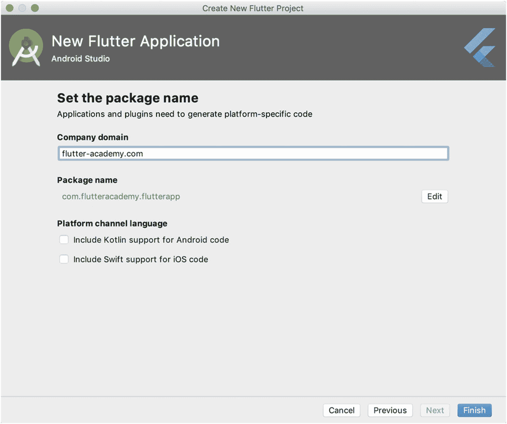

图 1-14

高级项目配置

完成向导后，新项目就会被创建并在 Android Studio 中打开。

## 1.12 使用 VS Code 创建 Flutter 应用

### 问题

您想使用轻量级编辑器来开发 Flutter 应用。

### 解决方案

使用 VS Code 创建 Flutter 应用。

### 讨论

VS Code ( [`code.visualstudio.com/`](https://code.visualstudio.com/) ) 是一款在前端开发者社区中广受欢迎的轻量级编辑器。通过安装 Flutter 和 Dart 的扩展，我们也可以使用 VS Code 进行 Flutter 开发。打开 VS Code 的 `Extensions`（扩展）选项卡，搜索“flutter”并安装 `Flutter` 扩展；参见图 1-15。`Flutter` 扩展依赖于 `Dart` 扩展，该扩展也会被一并安装。安装完这两个扩展后，我们可以打开命令面板并搜索“flutter”来查看可用的 Flutter 命令。

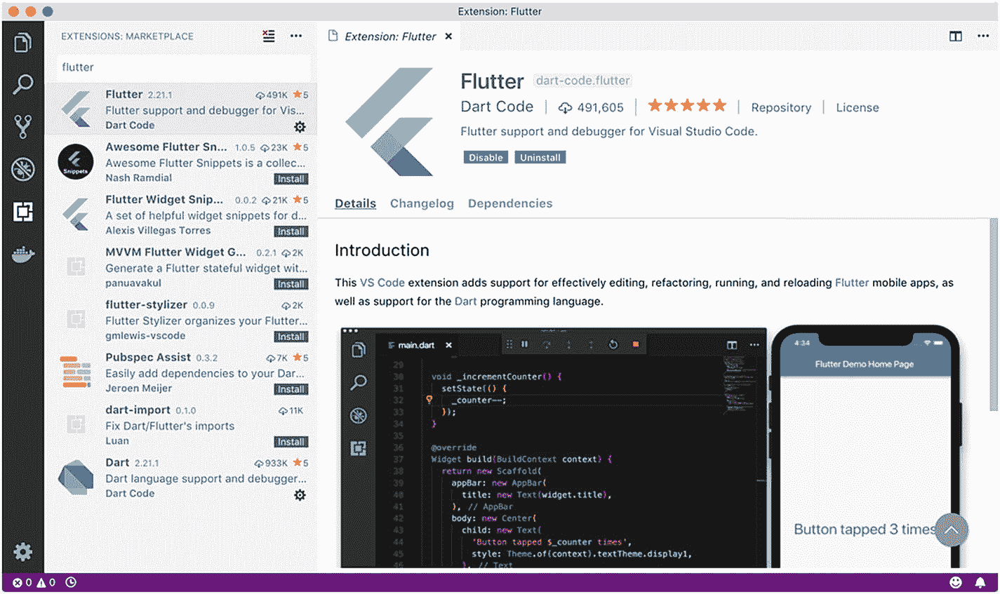

图 1-15

在 VS Code 中安装 Flutter 扩展

要在 VS Code 中创建新的 Flutter 项目，请打开命令面板并运行 `Flutter: New Project`（Flutter: 新建项目）命令。在打开的对话框中输入新项目的名称。选择项目的目录。VS Code 会为新创建的项目打开一个新窗口。

## 1.13 运行 Flutter 应用

### 问题

您想在模拟器或设备上运行 Flutter 应用。

### 解决方案

使用 `flutter run` 命令或 IDE 来运行 Flutter 应用。

### 讨论

根据您喜欢的 Flutter 应用开发方式，有多种运行 Flutter 应用的方法。在运行 Flutter 应用之前，您必须至少有一个正在运行的模拟器或已连接的设备：

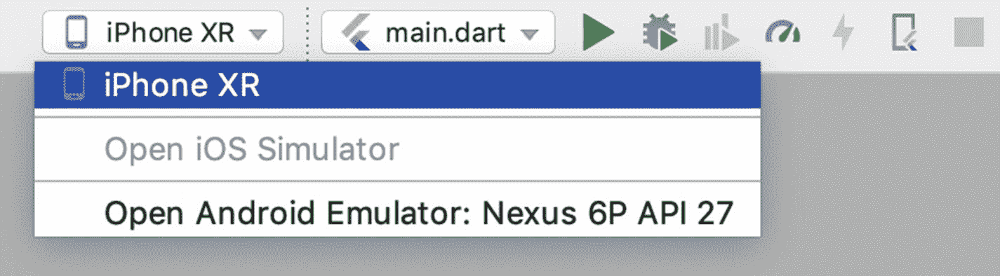

图 1-16

在 Android Studio 中选择设备

*   使用命令 `flutter run` 启动当前的 Flutter 应用。
*   在 Android Studio 中，从图 1-16 所示的下拉菜单中选择模拟器或设备，然后点击 `Run`（运行）按钮启动应用。
*   在 VS Code 中，选择 `Debug`（调试）➤ `Start Without Debugging`（不调试直接启动）来启动应用。

## 1.14 理解 Flutter 应用的代码结构

### 问题

您想了解 Flutter 应用的典型结构。

### 解决方案

浏览 Flutter SDK 生成的示例应用，并理解各个文件。

### 讨论

在深入学习 Flutter 应用开发的细节之前，您应该了解 Flutter 应用的代码结构，这样才能知道在何处添加新文件。Flutter 应用为应用中的各种文件预定义了目录结构。当创建一个新应用时，您可以查看生成的文件并对其有基本的了解。表 1-1 展示了所创建应用的目录和文件。

表 1-1

Flutter 应用的目录和文件

| 名称 | 描述 |
| --- | --- |
| `lib` | 应用源代码的主目录。文件 `main.dart` 通常是应用的入口点。 |
| `test` | 包含测试文件的目录。 |
| `android` | Android 平台的文件。 |
| `ios` | iOS 平台的文件。 |
| `pubspec.yaml` | Dart pub 工具的包描述文件。 |
| `pubspec.lock` | Dart pub 工具的锁定文件。 |
| `.metadata` | Flutter SDK 使用的 Flutter 项目描述文件。 |

## 1.15 修复 Flutter SDK 的配置问题

### 问题

您想确保本地开发环境的配置对于 Flutter 开发是正确的。

### 解决方案

使用 `flutter doctor` 命令。

### 讨论

安装 Flutter SDK 后，需要将其与其他支持工具进行配置。`flutter doctor` 命令是提供必要帮助的主要工具。此命令检查本地环境并报告 Flutter SDK 安装的状态。对于它发现的每个问题，它还会给出如何修复的说明。您需要做的就是应用建议的修复，然后再次运行 `flutter doctor` 来验证结果。没有必要修复 `flutter doctor` 报告的所有问题。如果某些问题不相关，您完全可以忽略它们。例如，如果您不打算将 VS Code 用作主要 IDE，那么是否安装 VS Code 就无关紧要了。

## 1.16 总结

本章中的技巧提供了有关如何让本地机器为 Flutter 应用开发做好准备的方法。`flutter doctor` 是一个用于设置的有用工具。您应该能够通过遵循此命令提供的说明来修复大多数配置问题。在下一章中，我们将看到关于使用 Dart SDK、Flutter SDK 和 IDE 提供的工具的技巧。

