# 2. 了解工具

构建 Flutter 应用离不开各种工具的帮助。在开发过程中，我们可能需要使用 Dart SDK、Flutter SDK 和各种 IDE 提供的工具。善用这些工具可以提高您的生产力。本章涵盖了 Dart SDK、Flutter SDK、Android Studio 和 VS Code 中工具的使用。

## 2.1 使用 Dart Observatory

### 问题

您想了解正在运行的 Flutter 应用的内部情况。

### 解决方案

使用 Dart SDK 提供的 Dart Observatory。


### 讨论

`Dart Observatory`是一个由 Dart SDK 提供的工具，用于分析和调试 Dart 应用程序。由于 Flutter 应用同样是 Dart 应用程序，因此`Observatory`也可用于 Flutter 应用。`Observatory`是一个重要的工具，用于调试、追踪和性能分析 Flutter 应用。`Observatory`允许您：

- 查看应用的 CPU 性能分析。
- 查看应用的内存分配分析。
- 以交互方式调试应用。
- 查看应用的堆快照。
- 查看应用生成的日志。

当 Flutter 应用通过`flutter run`启动时，`Observatory`也会一同启动并等待连接。您可以指定`Observatory`监听的端口，否则默认会使用随机端口。您可以在命令输出中找到访问`Observatory`的 URL。在浏览器中导航到该 URL，即可看到`Observatory`的用户界面。

### 注意

为了获得最佳效果，建议在使用`Observatory`时使用 Google Chrome。其他浏览器可能无法正常运行。

`Observatory` UI 的顶部区域显示 Dart VM 信息，参见图 2-1。点击**刷新**按钮可更新信息。

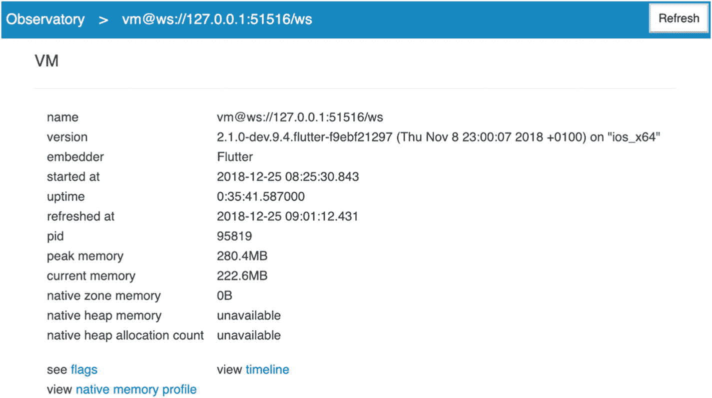

图 2-1 Dart `Observatory`中的 VM 信息

底部区域显示了一个隔离区列表，参见图 2-2。每个 Flutter 应用都有一个用于入口文件的初始隔离区。对于每个隔离区，饼图显示了 VM 活动的细分情况。在饼图的右侧，有一列链接指向`Observatory`其他功能的不同界面。

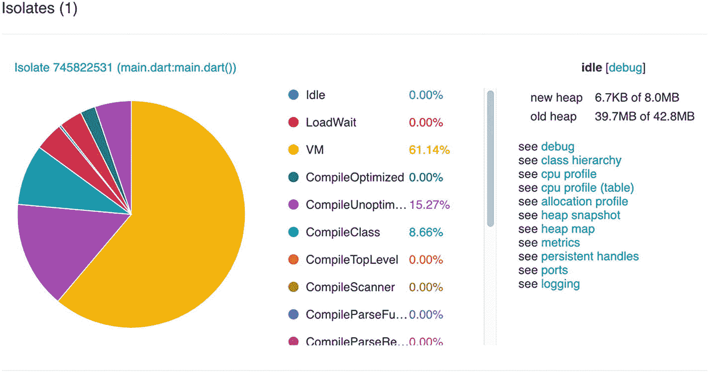

图 2-2 Dart `Observatory`中的隔离区信息

这些`Observatory`界面的细节超出了本教程的范围；有关说明，请参考官方文档（[`dart-lang.github.io/observatory/`](https://dart-lang.github.io/observatory/)）。

## 2.2 使用热重载和热重启

### 问题

在开发 Flutter 应用时，当您对代码进行了一些更改后，希望快速看到结果。

### 解决方案

使用 Flutter SDK 提供的热重载和热重启功能。

### 讨论

在构建移动应用时，能够高效地查看代码更改的效果至关重要，尤其是在构建 UI 时。这使得我们可以快速查看实际 UI 并迭代更新代码。在更新应用时，保持应用的当前状态也非常重要。否则，手动将应用重置回之前的状态并继续测试将非常痛苦。假设您正在开发的组件仅对注册用户可用，为了实际测试该组件，如果应用更新后状态未保留，您可能每次代码更改后都需要登录。

Flutter SDK 提供的热重载是一项杀手级功能，可以显著提高开发人员的工作效率。使用热重载，状态在应用更新之间得以保留，因此您可以立即看到 UI 更新，并从上次进行更改的执行点继续开发和测试。

根据 Flutter 应用的启动方式不同，触发热重载的方法也不同。只有处于调试模式的 Flutter 应用才能进行热重载：

- 当应用通过命令`flutter run`启动时，在终端窗口中输入`r`即可触发热重载。
- 当应用通过 Android Studio 启动时，保存文件会自动触发热重载。您也可以点击**Flutter 热重载**按钮手动触发。
- 当应用通过 VS Code 启动时，保存文件会自动触发热重载。您也可以使用键盘快捷键`Control-F5`运行**Flutter: 热重载**命令手动触发。

如果应用热重载成功，您可以在控制台中看到输出，其中包含热重载的详细信息。图 2-3 显示了在 Android Studio 中通过保存文件触发热重载时的控制台输出。

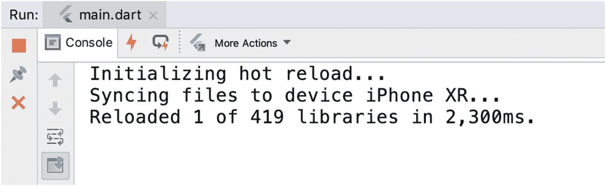

图 2-3 热重载输出

热重载非常有用，您可能希望它适用于所有代码更改。不幸的是，仍有一些情况下热重载可能无效：

- 您的代码更改引入了编译错误。您需要先修复这些编译错误，热重载才能继续进行。
- 热重载会保留应用状态，并尝试使用保留的状态重建 widget 树以反映新的更改。如果您的代码更改修改了状态，则对 widget 的更改可能无法与旧的保留状态兼容。假设我们有一个用于显示用户个人资料信息的 widget。在之前的版本中，用户的状态只包含用户名和姓名。在新版本中，状态更新为包含一个新属性`email`，并且 widget 也更新为显示这个新属性。热重载后，widget 仍然使用旧状态，看不到新属性。在这种情况下，需要热重启来获取状态更改。
- 全局变量和静态字段的初始化器的更改只能通过热重启来生效。
- 应用`main()`方法的更改可能只能通过热重启来生效。
- 当枚举类型更改为常规类，或常规类更改为枚举类型时，不支持热重载。
- 更改类型的泛型声明时，不支持热重载。

如果热重载无效，您仍然可以使用热重启，它会从头开始重启应用。您可以确信热重启会反映您所做的所有更改。根据 Flutter 应用的启动方式不同，触发热重启的方法也不同：

- 当应用通过`flutter run`启动时，在终端窗口中输入`R`即可触发热重启。
- 当应用通过 Android Studio 启动时，点击**Flutter 热重启**按钮即可触发热重启。
- 当应用通过 VS Code 启动时，点击重启按钮，或在命令面板中运行**Flutter: 热重启**命令来触发热重启。

## 2.3 升级 Flutter SDK

### 问题

您希望保持 Flutter SDK 为最新版本，以获取最新的功能、错误修复和性能改进。

### 解决方案

跟踪不同的 Flutter SDK 频道并升级 SDK。


### 讨论

有时，我们需要升级 Flutter SDK 以获取新功能、错误修复和性能改进。Flutter SDK 拥有不同渠道来获取更新。每个渠道实际上就是 Flutter SDK 仓库中的一个 Git 分支。执行 `flutter channel` 命令可以显示所有可用渠道，如图 2-4 所示。带有星号标记的渠道即为当前渠道。在图 2-4 中，当前渠道是 `stable`。

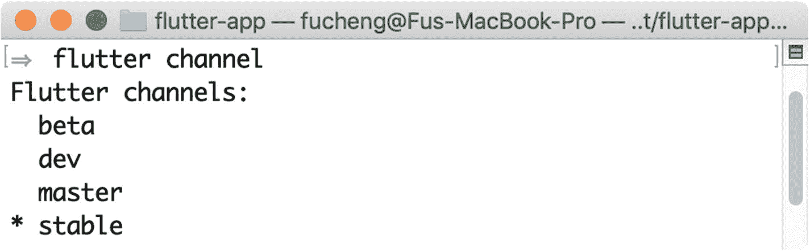

**图 2-4** – `flutter channel` 命令的输出

表 2-1 展示了 Flutter SDK 的四个渠道。

**表 2-1** Flutter SDK 渠道

| 渠道 | 描述 |
| --- | --- |
| `stable` | 用于稳定版本的渠道。这是产品开发的推荐渠道。 |
| `beta` | 用于前一个月最佳版本的渠道。 |
| `dev` | 用于最新全面测试版本的渠道。此渠道比 `master` 运行了更多测试。 |
| `master` | 用于包含最新修改的积极开发渠道。如果你想尝试最新功能，请追踪此渠道。此渠道中的代码通常能正常工作，但有时可能会意外出错。使用此渠道需自担风险。 |

我们可以使用 `flutter channel [<渠道名称>]` 命令切换到另一个渠道。例如，`flutter channel master` 会切换到 `master` 渠道。要获取当前渠道的更新，请运行 `flutter upgrade` 命令。以下命令展示了切换渠道的典型方式。

```
$ flutter channel master
$ flutter upgrade
```

## 2.4 在 Android Studio 中调试 Flutter 应用

### 问题

你正在使用 Android Studio 开发 Flutter 应用，并想找出代码未按预期方式运行的原因。

### 解决方案

使用 Android Studio 内置的 Flutter 调试支持。

### 讨论

调试是开发者日常工作的重要组成部分。调试时，我们可以查看代码在运行时的实际执行路径，并检查变量的值。如果你有其他编程语言的经验，应该已经掌握了基本的调试技巧。

在 Android Studio 中，你可以点击编辑器某行左侧的边距，为该行添加断点。点击**调试**图标或使用菜单**运行** ➤ **调试**以调试模式启动应用，如图 2-5 所示。

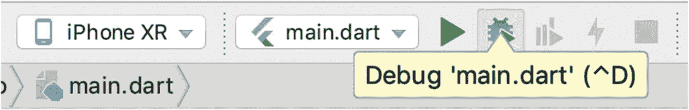

**图 2-5** — 点击调试图标开始调试

一旦代码执行到断点，执行便会暂停。你可以检查变量的值，并使用调试工具栏中的按钮交互式地继续执行。在调试模式下，有不同的面板可以查看相关信息。

图 2-6 中的“帧”视图显示当前执行帧。

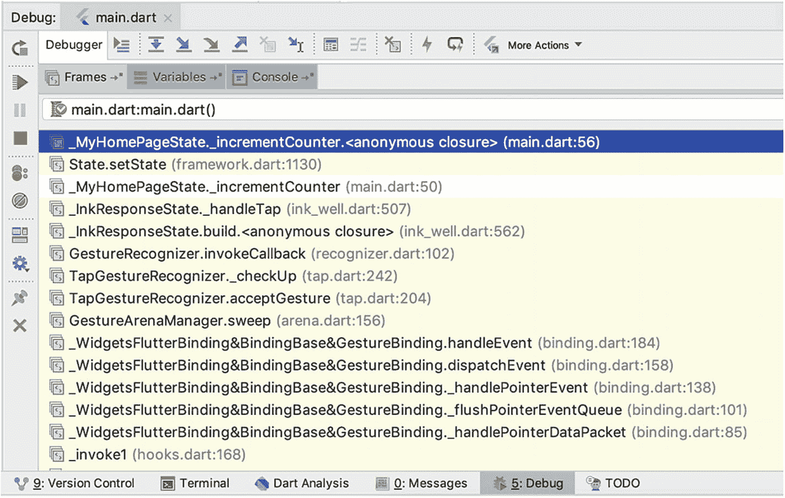

**图 2-6** — Android Studio 中的帧视图

图 2-7 中的“变量”视图显示变量和对象的值。在此视图中，我们还可以添加表达式来监视其值。

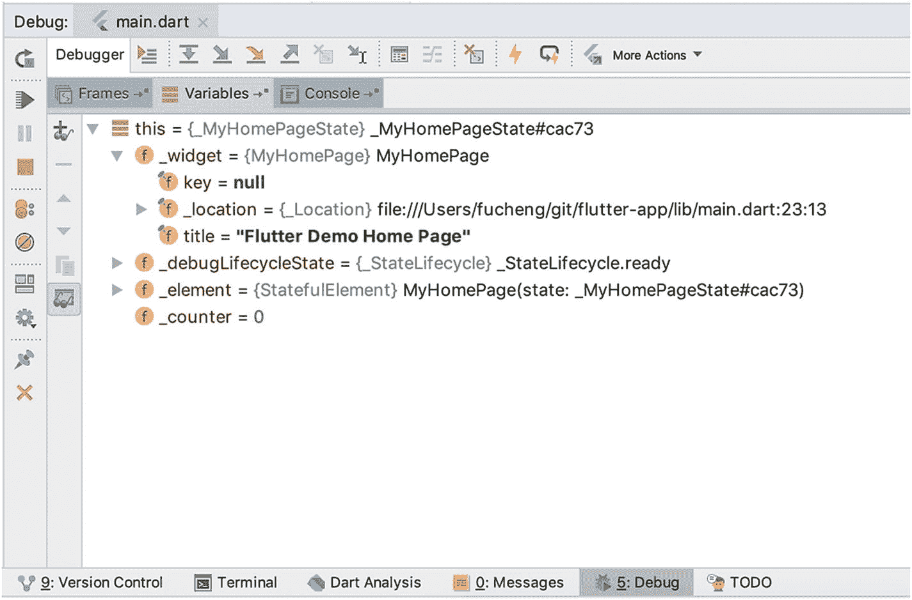

**图 2-7** — Android Studio 中的变量视图

图 2-8 中的“控制台”视图显示输出到控制台的消息。

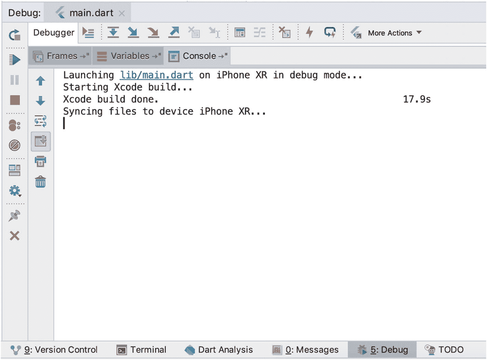

**图 2-8** — Android Studio 中的控制台视图

## 2.5 在 Android Studio 中查看 Flutter 应用的轮廓

### 问题

你想查看 Flutter 应用的轮廓，以清晰了解小部件的组织方式。

### 解决方案

在 Android Studio 中使用 Flutter Outline 视图。

### 讨论

在 Android Studio 中，可以通过菜单**视图** ➤ **工具窗口** ➤ **Flutter Outline** 打开 Flutter Outline 视图。此视图显示当前打开文件的树状层级结构，如图 2-9 所示。Flutter Outline 视图与文件编辑器相关联。在 Flutter Outline 视图中选择一个元素，会使编辑器滚动并高亮显示该元素的源代码。这种关联是双向的；在编辑器中进行选择也会导致 Flutter Outline 视图中相应的元素被选中。

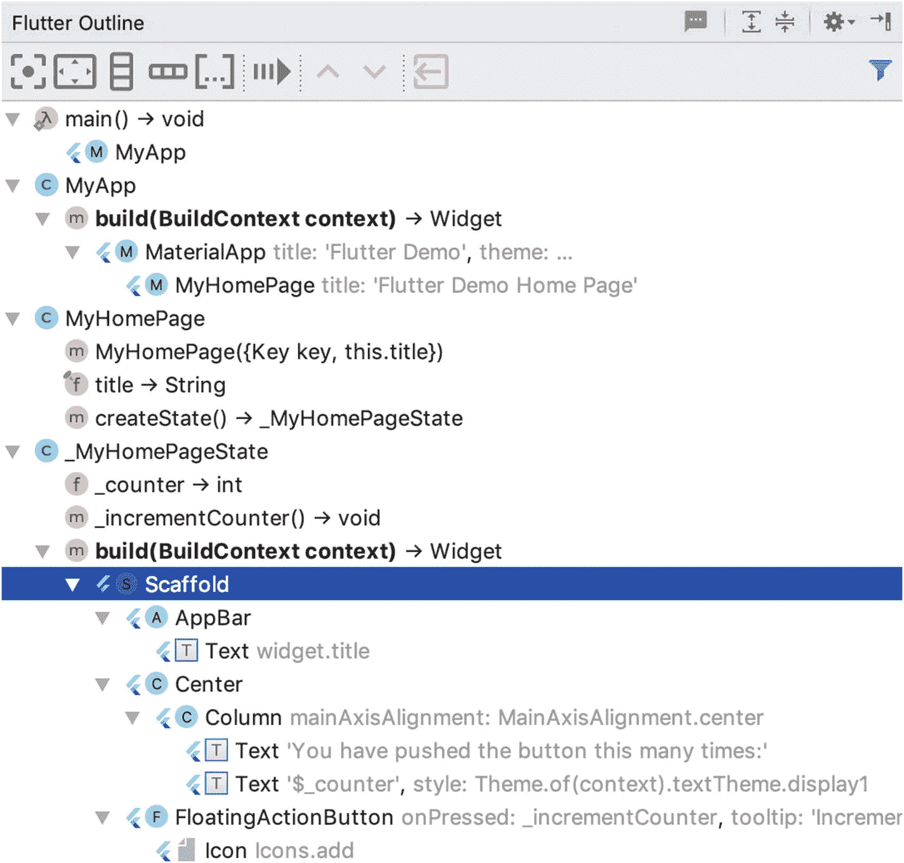

**图 2-9** — Android Studio 中的 Flutter Outline 视图

Flutter Outline 视图中的工具栏提供了不同的操作来管理小部件。例如，居中按钮可将当前小部件包装在一个 `Center` 小部件中。

## 2.6 在 VS Code 中调试 Flutter 应用

### 问题

你正在使用 VS Code 开发 Flutter 应用，并想找出代码未按预期方式运行的原因。

### 解决方案

使用 VS Code 内置的 Flutter 调试支持。

### 讨论

在 VS Code 中，你可以点击编辑器某行左侧的边距，为该行添加断点。使用菜单**调试** ➤ **开始调试**以调试模式启动应用。

图 2-10 展示了 VS Code 在调试模式下的视图。此视图中包含不同的面板：

*   **变量** – 显示变量的值。
*   **监视** – 管理监视表达式并查看其值。
*   **调用堆栈** – 查看当前调用堆栈。
*   **断点** – 查看已添加的断点。
*   **调试控制台** – 查看输出到控制台的消息。

顶部的操作栏包含“继续”、“单步跳过”、“单步进入”、“单步跳出”、“重启”和“停止”等操作。

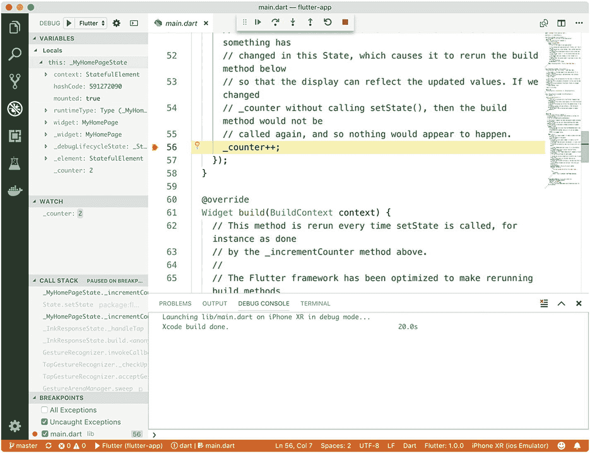

**图 2-10** — 在 VS Code 中调试

## 2.7 创建 Flutter 项目

### 问题

你想创建不同类型的 Flutter 项目。

### 解决方案

使用 `flutter create` 命令并附带不同参数。

### 讨论

`flutter create` 是 Flutter SDK 提供的用于创建 Flutter 项目的命令。在方法 1-10 中，我们使用此命令创建了一个简单的 Flutter 应用。在方法 1-11 中，我们还看到了 Android 提供的用于创建新 Flutter 项目的向导，该向导允许自定义创建的项目。在底层，Android Studio 也使用了 `flutter create` 命令。此命令针对不同场景支持不同的参数。以下代码是 `flutter create` 的基本用法。输出目录将包含新项目的文件。

```
$ flutter create
```


好的，作为高级文档工程师和翻译员，我将遵循您的注意事项和示例，将给定的英文文本翻译成中文。

---


#### 项目类型

使用参数 `-t` 或 `--template` 来指定要创建的项目类型。共有四种项目类型，见表 2-2。

**表 2-2** Flutter 项目类型

| 项目类型 | 描述 |
| --- | --- |
| `app` | 一个 Flutter 应用。这是默认类型。 |
| `package` | 一个可共享的 Flutter 项目，包含模块化的 Dart 代码。 |
| `plugin` | 一个可共享的 Flutter 项目，包含针对 Android 和 iOS 的平台特定代码。 |

以下命令展示了如何创建一个 Flutter 包和插件。

```
$ flutter create -t package my_package
$ flutter create -t plugin my_plugin
```

创建插件时，我们还可以使用参数 `-i` 或 `--ios-language` 来指定 iOS 代码的编程语言。可选值为用于 Objective-C 的 `objc` 和用于 Swift 的 `swift`。默认值为 `objc`。对于 Android 代码，我们可以使用参数 `-a` 或 `--android-language` 来指定 Android 代码的编程语言。可选值为用于 Java 的 `java` 和用于 Kotlin 的 `kotlin`。默认值为 `java`。以下命令展示了如何创建一个 iOS 使用 Swift 且 Android 使用 Kotlin 的 Flutter 插件。

```
$ flutter create -t plugin -i swift -a kotlin my_plugin
```

#### 代码示例

创建 Flutter 应用时，我们可以使用参数 `-s` 或 `--sample` 来指定要用作新应用的 `lib/main.dart` 文件的示例代码。给定一个示例 ID，该命令会尝试从 URL [`https://docs.flutter.dev/snippets/<sample_id>.dart`](https://docs.flutter.dev/snippets/%253csample_id%253e.dart) 加载该 Dart 文件。

#### 项目配置

创建项目时，有一些通用的配置可用，见表 2-3。

**表 2-3** Flutter 项目配置

| 参数 | 描述 | 默认值 |
| --- | --- | --- |
| `--project-name` | 此新 Flutter 项目的名称。名称必须是有效的 dart 包名。 | 从输出目录名称派生 |
| `--org` | 此新 Flutter 项目的组织名称。该值应使用反向域名表示法，例如 `com.example`。该值用作 Android 代码的 Java 包名以及 iOS 捆绑包标识符中的前缀。 | `com.example` |
| `--description` | 此新 Flutter 项目的描述。 | 一个新的 Flutter 项目 |

以下命令使用了表 2-3 中的项目配置。

```
$ flutter create --org=com.mycompany --description="E-commerce app" my_ecommerce_app
```

#### 启用或禁用功能

还有一些额外的标志用于启用或禁用某些功能，见表 2-4。每次只能指定一对参数中的一个。带有前缀 `--no` 的参数表示禁用某个功能，而另一个参数则表示启用该功能。例如，`--overwrite` 表示允许覆盖，而 `--no-overwrite` 表示禁止覆盖。默认值 On 或 Off 分别表示该功能默认是启用还是禁用。例如，对于 `--overwrite` 和 `--no-overwrite` 这对参数，默认值 Off 意味着默认使用 `--no-overwrite`。

**表 2-4** `flutter create` 的功能

| 参数 | 描述 | 默认值 |
| --- | --- | --- |
| `--overwrite` / `--no-overwrite` | 是否覆盖现有文件。 | 关闭 |
| `--pub` / `--no-pub` | 项目创建后是否运行 `flutter packages get`。 | 开启 |
| `--offline` / `--no-offline` | 是否以离线模式运行 `flutter packages get`。仅在 `--pub` 开启时适用。 | 关闭 |
| `--with-driver-test` / `--no-with-driver-test` | 是否添加 `flutter_driver` 依赖并生成一个示例 Flutter Drive 测试。 | 关闭 |

## 2.8 运行 Flutter 应用

### 问题

你想要运行 Flutter 应用。

### 解决方案

使用带有不同参数的 `flutter run` 命令。

### 讨论

`flutter run` 是 Flutter SDK 提供的用于启动 Flutter 应用的命令。`flutter run` 有许多适用于不同使用场景的参数。

#### 不同的构建风格

默认情况下，`flutter run` 构建应用的调试版本。调试版本适合开发和测试，并支持热重载。你还可以使用其他构建风格以适应不同场景，见表 2-5。

**表 2-5** `flutter run` 的构建风格

| 参数 | 描述 |
| --- | --- |
| `--debug` | 调试版本。这是默认的构建风格。 |
| `--profile` | 专门用于性能分析的版本。此选项当前不支持模拟器目标。 |
| `--release` | 准备发布到应用商店的发布版本。 |
| `--flavor` | 由特定平台构建设置定义的自定义应用风格。这需要在 Android Gradle 脚本和自定义 Xcode scheme 中使用产品风格。 |

#### 其他选项

参数 `-t` 或 `--target` 指定应用的主入口点文件。它必须是包含 `main()` 方法的 Dart 文件。默认值为 `lib/main.dart`。以下命令使用 `lib/app.dart` 作为入口点文件。

```
$ flutter run -t lib/app.dart
```

如果你的应用有不同的路由，可以使用参数 `--route` 指定运行应用时要加载的路由。

如果你想记录正在运行的 Flutter 应用的进程 ID，请使用参数 `--pid-file` 指定写入进程 ID 的文件。有了进程 ID，你可以发送信号 `SIGUSR1` 来触发热重载，发送 `SIGUSR2` 来触发热重启。在以下命令中，进程 ID 被写入文件 `~/app.pid`。

```
$ flutter run --pid-file ~/app.pid
```

现在，我们可以使用 `kill` 向正在运行的 Flutter 应用发送信号。

```
$ kill -SIGUSR1 $(<~/app.pid)
$ kill -SIGUSR2 $(<~/app.pid)
```

表 2-6 展示了 `flutter run` 支持的其他参数。

**表 2-6** `flutter run` 的额外参数

| 参数 | 描述 | 默认值 |
| --- | --- | --- |
| `--hot` / `--not-hot` | 是否启用热重载。 | 开启 |
| `--build` / `--no-build` | 在运行前是否需要（如有必要）构建应用。 | 开启 |
| `--pub`/ `--no-pub` | 运行前是否执行 `flutter packages get`。 | 开启 |
| `--target-platform` | 为 Android 设备构建应用时指定目标平台。可选值为 `default`、`android-arm` 和 `android-arm64`。 | `default` |
| `--observatory-port` | 指定 Observatory 调试器连接的端口。 | `0`（随机空闲端口） |
| `--start-paused` | 使应用以暂停模式启动，并等待调试器连接。 |   |
| `--trace-startup` | 开始跟踪。 |   |
| `--enable-software-rendering` | 启用使用 Skia 进行渲染。 |   |
| `--skia-deterministic-rendering` | 当与 `--enable-software-rendering` 一起使用时，提供 100% 确定的 Skia 渲染。 |   |
| `--trace-skia` | 启用对 Skia 代码的跟踪。 |   |

图 2-11 显示了运行 `flutter run` 命令的输出。从输出中，我们可以看到正在运行的应用的 Observatory 端口，这对于其他 Flutter SDK 命令与该运行中的应用交互非常重要。我们可以通过按下不同的键与控制台进行交互。例如，按下“r”触发热重载。按下“h”后，`flutter run` 会显示一条关于它可以接受的所有命令的帮助信息。

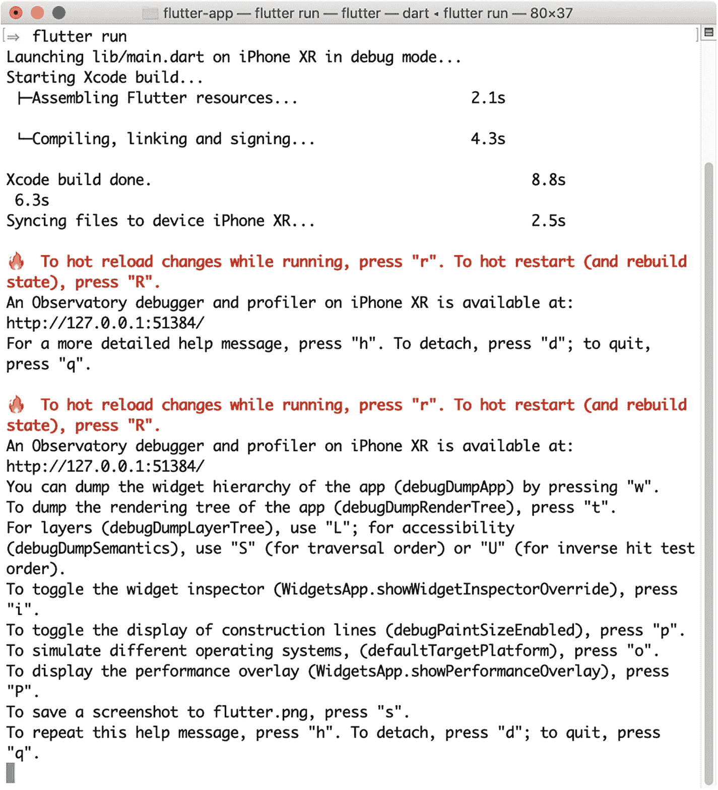

**图 2-11** 命令 `flutter run` 的输出

## 2.9 构建 Flutter 应用二进制文件

### 问题

你想要为 Android 和 iOS 平台构建应用二进制文件。

### 解决方案

使用命令 `flutter build`。


### 讨论

要将 Flutter 应用部署到设备上并发布到应用商店，我们需要为 Android 和 iOS 平台构建二进制文件。`flutter build` 命令支持构建这些二进制文件。

#### 为 Android 构建 APK 文件

`flutter build apk` 命令用于为你的应用构建 APK 文件。表 2-7 显示了该命令支持的参数。

**表 2-7** `flutter build apk` 的参数

| 参数 | 描述 |
| --- | --- |
| `--debug` | 构建调试版本。 |
| `--profile` | 构建专用于性能分析的版本。 |
| `--release` | 构建准备发布到应用商店的发布版本。 |
| `--flavor` | 构建由特定平台构建设置定义的自定义应用变体。这需要在 Android Gradle 脚本中使用产品变体，并自定义 Xcode 配置。 |
| `--pub` / `--no-pub` | 是否在构建应用前运行 `flutter packages get`。 |
| `--build-number`= | 一个整数，用于指定递增的内部版本号。每次构建此值都必须唯一。该值用作“`versionCode`”。 |
| `--build-name`= | 一个字符串版本号，格式为 `x.y.z`。该值用作“`versionName`”。 |
| `--build-shared-library` | 编译为 `*.so` 文件。 |
| `--target-platform` | 目标平台。可选值为 `android-arm` 和 `android-arm64`。 |

构建 APK 文件时，`--release` 是默认模式。以下命令构建一个发布版本，其构建号为 `5`，版本名为 `0.1.0`。

```
$ flutter build apk --build-number=5 --build-name=0.1.0
```

#### 为 iOS 构建

`flutter build ios` 命令用于构建 iOS 应用程序包。此命令与 `flutter build apk` 拥有相同的参数：`--debug`、`--profile`、`--release`、`--flavor`、`--pub`、`--no-pub`、`--build-number` 和 `--build-version`。`--build-number` 的值用作“`CFBundleVersion`”，而 `--build-name` 的值用作“`CFBundleShortVersionString`”。

它还有其他参数；参见表 2-8。

**表 2-8** `flutter build ios` 的额外参数

| 参数 | 描述 |
| --- | --- |
| `--simulator` | 构建一个用于 iOS 模拟器的版本。 |
| `--no-simulator` | 构建一个用于 iOS 设备的版本。 |
| `--codesign` / `--no-codesign` | 是否对应用程序包进行签名。默认值为 `--codesign`。 |

默认情况下，`flutter build ios` 为设备构建应用，即使用 `--no-simulator`。以下命令为模拟器构建一个调试版本，并且不签名应用程序包。

```
$ flutter build ios --debug --no-codesign --simulator
```

## 2.10 安装 Flutter 应用

### 问题

你想要将 Flutter 应用安装到模拟器或设备上。

### 解决方案

使用 `flutter install` 命令。

### 讨论

`flutter install` 命令将当前的 Flutter 应用安装到模拟器或设备上。要安装应用，你至少需要启动一个模拟器或连接一个设备。在安装应用之前，目标模拟器或设备上应已存在可用的二进制文件。请先使用 `flutter build` 构建二进制文件。

以下命令安装构建好的二进制文件。

```
$ flutter install
```

## 2.11 管理包

### 问题

你想要管理 Flutter 应用的依赖项。

### 解决方案

使用 `flutter packages` 命令。

### 讨论

使用包是 Dart 管理项目依赖的方式。Flutter 继承了相同的依赖管理方式。你可能在其他编程平台中见过类似的概念。为了使依赖管理生效，我们需要一种方式来描述可共享的组件及其依赖关系，同时还需要一个工具来获取这些依赖。表 2-9 展示了不同平台的包管理工具。Flutter SDK 使用 `flutter packages` 命令来管理依赖，该命令底层使用了 Dart 的 `pub` 工具。

**表 2-9** 包管理工具

| 平台 | 描述文件 | 工具 |
| --- | --- | --- |
| Node.js | `package.json` | `npm`、`Yarn` |
| Dart/Flutter | `pubspec.yaml` | `pub`、`flutter packages` |
| Java | `pom.xml`、`build.gradle` | Maven、Gradle |
| Ruby | `Gemfile` | Bundler |

`flutter packages get` 命令会下载 Flutter 项目中的依赖包。`flutter packages upgrade` 命令会升级 Flutter 项目中的包。这两个命令只是对 Dart 底层的 `pub` 工具进行了简单的封装。我们也可以使用 `flutter packages pub` 来直接调用 Dart 的 `pub` 工具。`flutter packages` 命令的功能有限，能干的事情不多。你可以随时使用 `flutter packages pub` 将任务委托给 Dart 的 `pub` 工具。

### 注意

你应该使用 `flutter packages get` 和 `flutter packages upgrade` 来管理 Flutter 应用的依赖项。不应使用 Dart `pub` 工具中的 `pub get` 和 `pub upgrade` 命令。如果你需要 Dart `pub` 工具提供的更多功能，请使用 `flutter packages pub`。

`flutter packages test` 命令与 `pub run test` 相同，但与 `flutter test` 不同。由 `flutter packages test` 运行的测试托管在纯 Dart 环境中，因此 `dart:ui` 这样的库不可用。这使测试运行得更快。如果你正在构建不依赖 Flutter SDK 中任何包的库，则应使用此命令来运行测试。

## 2.12 运行 Flutter 测试

### 问题

你已经为 Flutter 应用编写了测试，并希望确保这些测试通过。

### 解决方案

使用 `flutter test` 命令。


### 讨论

测试是可维护软件项目中不可或缺的一部分。你应该为 Flutter 应用编写测试。命令 `flutter test` 用于运行 Flutter 应用的测试。运行此命令时，你可以提供一系列以空格分隔的相对文件路径，来指定要运行的测试文件。如果未提供任何文件，则会包含 `test` 目录下所有文件名以 `_test.dart` 结尾的文件。以下命令运行测试文件 `test/mytest.dart`。

```
$ flutter test test/mytest.dart
```

#### 筛选要运行的测试

参数 `--name` 指定用于匹配要运行测试名称的正则表达式。一个测试文件可能包含多个测试。如果你只需要进行简单的子字符串匹配，请改用 `--plain-name`。以下命令展示了 `--name` 和 `--plain-name` 的用法。

```
$ flutter test --name="smoke\d+"
$ flutter test --plain-name=smoke
```

你可以使用 `--name` 和 `--plain-name` 指定多个匹配条件。要运行的测试必须满足所有给定的条件。以下命令同时使用了 `--name` 和 `--plain-name`。

```
$ flutter test --name="smoke.*" --plain-name=test
```

#### 测试覆盖率

如果你想了解测试的覆盖率，请使用参数 `--coverage`。测试完成后，`flutter test` 会生成测试覆盖率信息并保存到文件 `coverage/lcov.info`。可以使用参数 `--coverage-path` 指定覆盖率信息的输出路径。如果你有基础覆盖率数据，可以将其放入路径 `coverage/lcov.base.info`，并向 `flutter test` 传递参数 `--merge-coverage`，随后 Flutter SDK 将使用 `lcov` 合并这两个覆盖率文件。

要查看覆盖率报告，你需要安装 `lcov`。在 macOS 上，可以使用 Homebrew 安装 `lcov`。

```
$ brew install lcov
```

命令 `genhtml` 从 `lcov` 覆盖率信息文件生成 HTML 文件。以下命令生成 HTML 覆盖率报告。打开生成的文件 `index.html` 即可查看报告。

```
$ genhtml coverage/lcov.info --output-directory coverage_report
```

#### 调试测试

如果你想调试一个测试文件，可以使用参数 `--start-paused`。此模式下只允许使用单个测试文件。执行过程会暂停，直到调试器连接。以下命令用于调试文件 `test/simple.dart`。

```
$ flutter test --start-paused test/simple.dart
```

#### 其他选项

还有其他有用的参数；请参阅表 2-10。

表 2-10

`flutter test` 的额外参数

| 参数 | 描述 | 默认值 |
| --- | --- | --- |
| `--j`, `--concurrency` | 并发运行的测试数量。 | `6` |
| `--pub` / `--no-pub` | 是否在运行测试前执行 `flutter packages get`。 | 开 |

## 2.13 分析代码

### 问题

你的 Flutter 代码编译成功，并且在测试中表现良好。但是，你想知道代码中是否存在任何潜在的错误或不佳的代码实践。

### 解决方案

使用命令 `flutter analyze`。

### 讨论

即使你的代码编译成功并通过了所有测试，代码仍可能存在潜在错误或不良代码味道。例如，声明了一个局部变量但从未使用过。保持代码尽可能清晰是一种良好实践。Dart 提供了分析器来分析源代码以发现潜在错误。

命令 `flutter analyze` 接受一系列目录来扫描 Dart 文件。如果未提供路径，`flutter analyze` 仅分析当前工作目录。以下命令分析目录 `~/my_app/lib`。

```
$ flutter analyze ~/my_app/lib
```

分析结果可以使用参数 `--write` 写入文件。默认情况下，结果会输出到控制台。你也可以传递参数 `--watch`，让分析器监视文件系统更改并持续进行分析。

表 2-11 显示了 `flutter analyze` 的额外参数。

表 2-11

`flutter analyze` 的额外参数

| 参数 | 描述 | 默认值 |
| --- | --- | --- |
| `--current-package` / `--no-current-package` | 是否分析当前项目。如果启用了 `--no-current-package` 且未指定目录，则不会分析任何内容。 | 开 |
| `--pub` / `--no-pub` | 是否在运行分析前执行 `flutter packages get`。 | 开 |
| `--preamble` / `--no-preamble` | 是否显示正在分析的当前文件。 | 开 |
| `--congratulate` / `--no-congratulate` | 即使没有错误、警告、提示或 lint 问题，是否也显示输出。 | 开 |
| `--watch` | 持续监视文件系统更改，并响应地运行分析。 |   |

命令 `flutter analyze` 将代码分析委托给 Dart 的 `dartanalyzer` 工具。我们可以使用项目根目录中的文件 `analysis_options.yaml` 来自定义分析行为。

图 2-12 展示了 `flutter analyze` 的输出，代码中发现了一个问题。

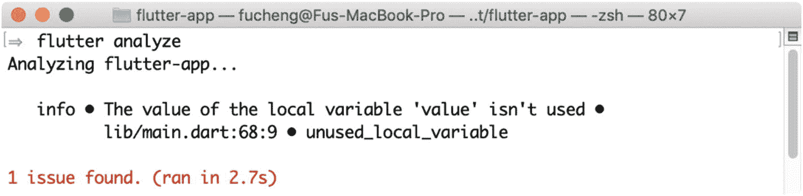

图 2-12

命令 `flutter analyze` 的输出

## 2.14 管理模拟器

### 问题

你想管理 Flutter SDK 使用的不同模拟器。

### 解决方案

使用命令 `flutter emulators`。

### 讨论

在为 Flutter SDK 设置 Android 和 iOS 平台时，我们也创建了 Android 和 iOS 模拟器。对于 Android，我们可以使用 AVD 管理器来管理模拟器。对于 iOS，我们可以使用 Xcode 来管理模拟器。如果我们能以相同的方式管理 Android 模拟器和 iOS 模拟器，那将会非常方便。命令 `flutter emulators` 就是用于管理模拟器的工具。

运行 `flutter emulators` 会显示所有可供 Flutter SDK 使用的模拟器；请参见图 2-13。

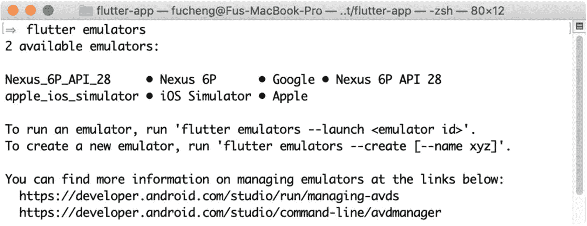

图 2-13

命令 `flutter emulators` 的输出

要启动一个模拟器，请使用 `flutter emulators --launch <emulator_id>`。以下命令启动 `Nexus_6P_API_28` 模拟器。你只需要提供一个部分 ID 来找到要启动的确切模拟器。这个部分 ID 必须只匹配一个模拟器。

```
$ flutter emulators --launch Nexus
```

我们也可以使用 `flutter emulators --create` 创建新的 Android 模拟器。以下命令创建一个名为 `Pixel` 的新模拟器。此命令只能创建基于 Pixel 设备的模拟器。

```
$ flutter emulators --create --name Pixel
```

## 2.15 截取屏幕截图

### 问题

你想截取正在运行的应用的屏幕截图。

### 解决方案

使用命令 `flutter screenshot`。


### 讨论

Android 模拟器和 iOS 模拟器都提供了截取屏幕截图的原生功能。对于 iOS 模拟器，可以通过菜单**文件** ➤ **新建屏幕快照**来完成。对于 Android 模拟器，可以点击浮动控制栏中的截屏图标。但使用 UI 控件并不十分方便。模拟器截取的屏幕截图默认保存到桌面。你必须配置模拟器才能保存到所需位置。

`flutter screenshot` 命令比模拟器的内置功能更容易使用。你可以使用参数 `-o` 或 `--output` 来指定保存截图的路径；请参考以下命令。

```
$ flutter screenshot -o ~/myapp/screenshots/home.png
```

`flutter screenshot` 可以截取不同类型的截图。参数 `--type` 接受表 2-12 中列出的值。

**表 2-12** 截图类型

| 类型 | 描述 |
| --- | --- |
| `Device` | 使用设备的原生截图功能。截图包含当前正在显示的整个屏幕。这是默认类型。 |
| `Rasterizer` | 使用光栅化器渲染的 Flutter 应用的截图。 |
| `skia` | 渲染为 Skia 图片的 Flutter 应用的截图。 |

对于 `rasterizer` 和 `skia` 类型，需要使用参数 `--observatory-port` 提供正在运行应用的 Dart Observatory 端口号。该端口号显示在 `flutter run` 命令的输出中。

## 2.16 连接到正在运行的应用

### 问题

你的 Flutter 应用不是通过 `flutter run` 启动的，但你需要与之交互。

### 解决方案

使用 `flutter attach` 命令。

### 讨论

当 Flutter 应用通过 `flutter run` 启动时，我们可以通过控制台与之交互。但是，应用也可以通过其他方式启动。例如，我们可以在设备上关闭应用然后重新打开。在这种情况下，我们会失去对正在运行的应用的控制。`flutter attach` 提供了一种连接到正在运行的应用的方法。

如果应用已经在运行，并且你知道它的 observatory 端口，可以使用 `flutter attach --debug-port` 进行连接。以下命令连接到一个正在运行的应用。

```
$ flutter attach --debug-port 10010
```

如果没有提供 observatory 端口，`flutter attach` 会开始监听并扫描新激活的应用。当检测到新的 observatory 时，此命令会自动连接到该应用。

```
$ flutter attach
```

在图 2-14 中，`flutter attach` 最初正在等待新的 Flutter 应用启动。一旦 Flutter 应用启动，`flutter attach` 就会连接到它并显示与 `flutter run` 相同的控制台。

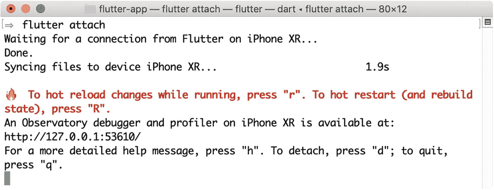

**图 2-14** `flutter attach` 命令的输出

## 2.17 追踪正在运行的 Flutter 应用

### 问题

你想要追踪一个正在运行的应用的执行过程。

### 解决方案

使用 `flutter trace` 命令。

### 讨论

要开始追踪，我们需要知道正在运行的应用的 observatory 端口，并通过参数 `--debug-port` 将此端口提供给 `flutter trace`。默认情况下，追踪会运行 `10` 秒，并将结果 JSON 文件写入当前目录，文件名类似于 `trace_01.json`、`trace_02.json` 等。在以下命令中，observatory 端口是 `51240`。

```
$ flutter trace --debug-port=51240
```

使用参数 `-d` 或 `--duration` 来指定追踪运行的持续时间（以秒为单位）。以下命令运行追踪 5 秒。

```
$ flutter trace --debug-port=51240 -d 5
```

如果你希望手动控制追踪过程，可以先使用 `flutter trace --start` 开始追踪，然后在稍后使用 `flutter trace --stop` 停止追踪。值得注意的是，当调用 `flutter trace --stop` 时，追踪需要等待 `--duration` 中指定的时间才能停止。在以下命令中，在第二次 `flutter trace --stop` 之后，追踪会再等待 10 秒才停止，这是 `--duration` 的默认值。

```
$ flutter trace --start
$ flutter trace --stop
```

要立即停止追踪，请使用以下命令。

```
$ flutter trace --stop -d 0
```

## 2.18 配置 Flutter SDK

### 问题

你想要配置 Flutter SDK 的不同设置。

### 解决方案

使用 `flutter config` 命令。

### 讨论

`flutter config` 命令允许配置一些 Flutter SDK 设置。表 2-13 显示了 `flutter config` 的参数。

**表 2-13** `flutter config` 的参数

| 参数 | 描述 | 默认值 |
| --- | --- | --- |
| `--analytics` / `--no-analytics` | 是否报告匿名的工具使用统计信息和崩溃报告。 | 开启 |
| `--clear-ios-signing-cert` | 清除用于签署 iOS 设备部署应用的已保存开发证书。 |   |
| `--gradle-dir` | 设置 Gradle 安装目录。 |   |
| `--android-sdk` | 设置 Android SDK 目录。 |   |
| `--android-studio-dir` | 设置 Android Studio 安装目录。 |   |

要移除某个设置，只需将其配置为空字符串即可。以下命令禁用了分析报告功能。

```
$ flutter config --no-analytics
```

## 2.19 显示应用日志

### 问题

你想要查看在模拟器或设备上运行的 Flutter 应用生成的日志。

### 解决方案

使用 `flutter logs` 命令。

### 讨论

尽管我们可以调试 Flutter 应用的代码来找出某些问题的原因，但日志对于错误诊断仍然非常有价值。在 Flutter 应用中生成日志的最简单方法是调用 `print()` 方法。`flutter logs` 命令会监视设备上生成的日志并将其打印到控制台。

```
$ flutter logs
```

如果你想在读取日志之前清除日志历史，可以使用参数 `-c` 或 `--clear`。

```
$ flutter logs -c
```

图 2-15 显示了 `flutter logs` 的输出。

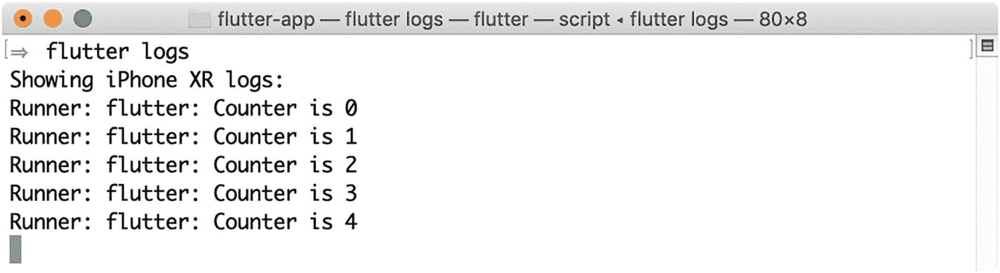

**图 2-15** `flutter logs` 命令的输出

## 2.20 格式化源代码

### 问题

你想要确保应用的源代码遵循相同的代码风格。

### 解决方案

使用 `flutter format` 命令。

### 讨论

为你的应用保持统一的代码风格是一个好习惯，尤其是对于开发团队来说。一致的代码风格也有利于代码审查。`flutter format` 命令可以格式化源代码文件，使其符合 Dart 的默认代码风格。

要运行 `flutter format`，你需要提供以空格分隔的路径列表。以下命令格式化当前目录。

```
$ flutter format .
```

`flutter format` 简单地将格式化任务委托给了 Dart 的 `dartfmt` 工具。代码风格在 Dart 语言的官方指南（ [`https://dart.dev/guides/language/effective-dart/style`](https://dart.dev/guides/language/effective-dart/style) ）中有详细说明。表 2-14 显示了 `flutter format` 的额外参数。

**表 2-14** `flutter format` 的额外参数

| 参数 | 描述 |
| --- | --- |
| `-n`, `--dry-run` | 仅显示哪些文件会被修改，而不实际修改它们。 |
| `--set-exit-if-changed` | 如果此命令进行了任何格式化更改，则返回退出代码 `1`。 |
| `-m`, `--machine` | 将输出格式设置为 JSON。 |

## 2.21 列出已连接的设备

### 问题

你想要查看所有已连接且 Flutter SDK 可用的设备。

### 解决方案

使用 `flutter devices` 命令。


### 讨论

Flutter SDK 在执行某些命令前，需要至少有一个模拟器或设备处于就绪状态。Flutter SDK 使用“设备”一词来指代 Android 模拟器、iOS 模拟器和真实设备。命令 `flutter devices` 会列出所有 Flutter SDK 可用的设备。图 2-16 展示了 `flutter devices` 命令的输出结果。

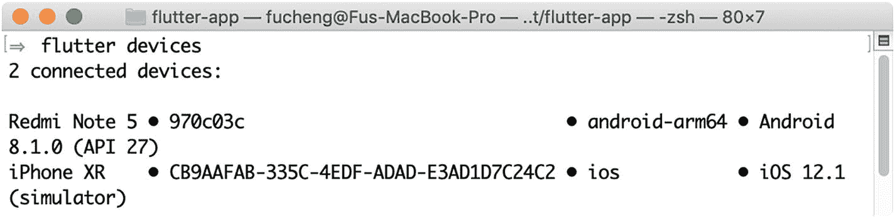

**图 2-16** — `flutter devices` 命令的输出

## 2.22 运行集成测试

### 问题

你已经使用 Flutter Driver 编写了集成测试，并且希望运行这些测试。

### 解决方案

使用 `flutter drive` 命令。

### 讨论

Flutter Driver 是 Flutter SDK 提供的用于运行集成测试的工具。运行集成测试时，应用本身在模拟器或设备上运行，但测试脚本在你的本地机器上执行。在测试过程中，测试脚本会连接到正在运行的应用，并向其发送命令以模拟不同的用户操作。测试脚本可以执行诸如点击和滚动等操作，也可以读取 widget 属性并验证其正确性。

`flutter drive` 是用来运行集成测试的命令。它可以启动应用本身，也可以连接到一个已有的正在运行的应用。当 `flutter drive` 启动应用时，它可以接受与 `flutter run` 相同的参数，包括 `--debug`、`--profile`、`--flavor`、`--route`、`--target`、`--observatory-port`、`--pub`、`--no-pub` 和 `--trace-startup`。这些参数的含义与在 `flutter run` 中相同。当连接到已有应用时，需要使用 `--use-existing-app` 参数并指定该应用的 observatory URL，如下命令所示。

```
$ flutter drive --use-existing-app=http://localhost:50124
```

启动测试脚本时，`flutter drive` 会根据应用的入口文件，按照约定定位测试脚本文件。入口文件通过 `--target` 参数指定，其默认值为 `lib/main.dart`。`flutter drive` 会尝试在 `test_driver` 目录下查找同名但带有 `_test.dart` 后缀的测试脚本文件。例如，如果入口文件是 `lib/main.dart`，它会尝试查找测试脚本文件 `test_driver/main_test.dart`。你也可以使用 `--driver` 参数显式指定测试脚本文件，如下命令所示。

```
$ flutter drive --driver=test_driver/simple.dart
```

如果应用是由 `flutter drive` 启动的，那么测试脚本执行完毕后应用将被停止，除非指定了 `--keep-app-running` 参数来保持其运行。当连接到已有应用时，测试脚本执行完毕后应用会继续运行，除非指定了 `--no-keep-app-running` 参数来停止它。以下命令会在测试后保持应用运行。

```
$ flutter drive --keep-app-running
```

## 2.23 启用 Flutter SDK 命令的 Bash 补全功能

### 问题

在输入 Flutter SDK 命令时，你希望你的 shell 能够提供补全支持。

### 解决方案

使用 `flutter bash-completion` 命令来设置补全功能。

### 讨论

有了 shell 补全支持，当你输入一些命令时，shell 会尝试完成它们。`flutter bash-completion` 会打印出用于启用 bash 和 zsh 补全功能的设置脚本。如果未提供参数，设置脚本会打印到控制台。如果提供了文件路径，设置脚本则会写入该文件。

在 macOS 上，我们可以使用 Homebrew 先安装 `bash-completion`。

```
$ brew install bash-completion
```

如果你使用的是 bash，需要修改 `~/.bash_profile` 文件，添加以下内容。

```
[ -f /usr/local/etc/bash_completion ] && . /usr/local/etc/bash_completion
```

然后，你可以运行 `flutter bash-completion` 将设置脚本保存到 `/usr/local/etc/bash_completion.d` 目录下，如下命令所示。

```
$ flutter bash-completion /usr/local/etc/bash_completion.d/flutter
```

最后，你应该执行 `source ~/.bash_profile` 或者重启 shell 来启用补全功能。

如果你使用的是 zsh，可以将设置脚本添加到 `~/.zshrc` 文件中。首先，你需要在 `~/.zshrc` 文件的开头添加以下内容。

```
autoload bashcompinit
bashcompinit
```

然后，你需要运行以下命令将设置脚本添加到 `~/.zshrc` 文件中。

```
$ flutter bash-completion >> ~/.zshrc
```

最后，你应该执行 `source ~/.zshrc` 或者重启 shell 来启用补全功能。

## 2.24 清理 Flutter 应用的构建文件

### 问题

你想要清理 Flutter 应用的构建文件。

### 解决方案

使用 `flutter clean` 命令。

### 讨论

`flutter clean` 命令会删除 `build` 目录中的文件。即使对于小型应用，`build` 目录占用的磁盘空间也可能很大。例如，在构建 Flutter 示例应用后，`build` 目录的大小约为 200 MB。在学习 Flutter 时，你可能会创建许多用于测试的小型应用。当你认为这些应用已经不再需要时，对它们运行 `flutter clean` 是一个好主意。你会发现可以回收大量的磁盘空间。

## 2.25 管理 Flutter SDK 缓存

### 问题

你想要显式管理 Flutter SDK 的缓存。

### 解决方案

使用 `flutter precache` 命令。

### 讨论

Flutter SDK 在 `bin/cache` 目录中维护了所需构建工件的缓存。该目录包含 Dart SDK、Flutter 引擎、Material 字体和 Gradle Wrapper 的二进制文件。如果此缓存不存在，它会被自动填充。`flutter precache` 命令用于显式更新缓存。除 `config`、`precache`、`bash-completion` 和 `upgrade` 命令外，大多数 Flutter 命令在执行前都会自动更新缓存，因此在大多数情况下你无需显式运行此命令。

`flutter precache` 有一个 `-a` 或 `--all-platforms` 参数，用于指定是否应下载所有平台的构建工件。默认情况下，只会下载当前平台的工件。

```
$ flutter precache -a
```

## 2.26 总结

本章介绍了开发 Flutter 应用时可能需要使用的工具。你可能不需要使用所有这些工具。在 IDE 的帮助下，你可以在 IDE 内完成大部分操作。然而，了解这些工具仍然很有价值，因为你可以利用它们做更多事情。在下一章中，我们将学习关于 Dart 语言核心部分的范例。

