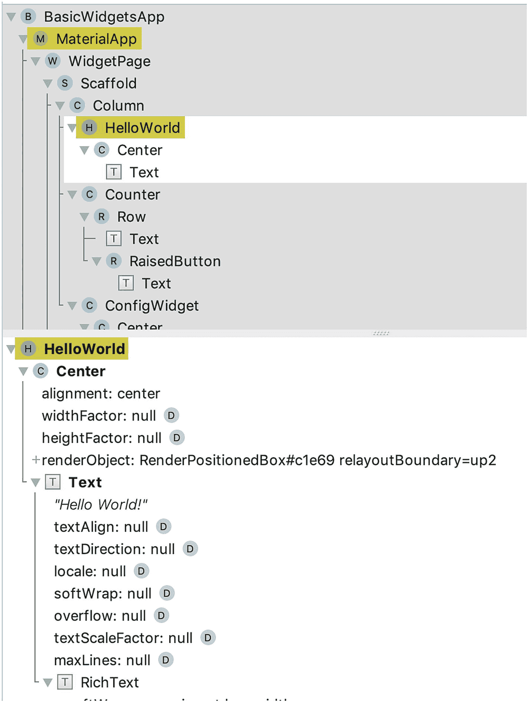
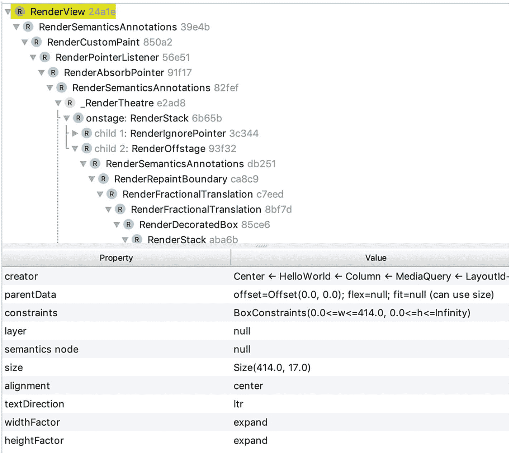

# 4. 部件基础

在构建 Flutter 应用时，大部分时间你都在与部件（widget）打交道。本章提供关于 Flutter 中部件的基本背景信息。此外，还涵盖了显示文本、图片、图标、按钮和占位符的几个基本部件。

## 4.1 理解部件

### 问题

你想知道如何在 Flutter 中使用组件。

### 解决方案

部件在 Flutter 中无处不在。


### Discussion

如果你参与过用户界面的开发，应该对“小部件”或“组件”等概念并不陌生。这些概念代表了创建用户界面的可复用构建块。一个好的用户界面库应拥有大量高质量且易于使用的组件。按钮、图标、图片、菜单、对话框和表单输入等都是组件的例子。组件可大可小，复杂的组件通常由多个小型组件组成。你可以遵循组件模型创建自己的组件，也可以选择将组件分享给社区。一个良好的组件生态系统是用户界面库成功的关键因素。

`Flutter`使用`widget`来描述用户界面中的可复用构建块。与其他库相比，`Flutter`中的`widget`概念更为广泛。不仅按钮和表单输入等常见组件是`widget`，布局约束在`Flutter`中也以`widget`的形式表达。例如，如果你想将一个`widget`放置在盒子中央，只需将该`widget`包装进一个`Center` widget 中。`widget`也用于获取上下文数据，例如，`DefaultTextStyle` widget 会获取适用于未设置样式的`Text` widget 的`TextStyle`。

`Flutter`中的`widget`是用户界面某部分的不可变描述。`widget`类的所有字段都是`final`的，并在构造函数中设置。`widget`构造函数仅包含命名参数。一个`widget`可以有一个或多个子`widget`。`Flutter`应用的`widget`会形成一个树状层次结构。`Flutter`应用入口文件的`main()`方法使用`runApp()`方法来启动应用。`runApp()`的唯一参数是一个`Widget`对象，该对象是应用`widget`树的根节点。`widget`只是静态配置，用于描述如何配置层次结构中的子树。要实际运行应用，我们需要一种管理`widget`实例化的方式。

`Flutter`使用`Element`来表示树中特定位置上`Widget`的实例化。一个`Widget`可以被实例化零次或多次。将`Widget`转化为`Element`的过程称为“膨胀（inflation）”。`Widget`类有一个`createElement()`方法，用于将`widget`膨胀为`Element`的具体实例。`Flutter`框架负责管理元素的声明周期。与元素关联的`widget`可能随时间变化，框架会更新元素以使用新的配置。

运行应用时，`Flutter`框架负责渲染元素以创建渲染树，从而使最终用户能够看到用户界面。渲染树由`RenderObject`组成，其根节点为`RenderView`。如果你使用`Android Studio`，你可以在 **Flutter Inspector** 视图中查看`widget`树和渲染树。选择 `View ➤ Tool Windows ➤ Flutter Inspector` 即可打开`Flutter Inspector`视图。图 4-1 展示了`Flutter Inspector`中的`widget`树，顶部面板显示`widget`树，底部面板显示某个`widget`的详细信息。



**图 4-1**  
Flutter Inspector 中的 Widget 树

图 4-2 展示了`Flutter Inspector`中的渲染树，其根节点是一个`RenderView`。



**图 4-2**  
Flutter Inspector 中的渲染树

## 4.2 理解 `BuildContext`

### 问题

你想访问与`widget`树中某个`widget`相关的信息。

### 解决方案

`WidgetBuilder`函数有一个`BuildContext`参数，用于访问与`widget`树中某个`widget`相关的信息。你可以在`StatelessWidget.build()`和`State.build()`方法中看到`BuildContext`。

### 讨论

构建一个`widget`时，该`widget`在`widget`树中的位置可能决定其行为，特别是当它有一个`InheritedWidget`作为祖先时。`BuildContext`类提供了访问与该位置相关信息的的方法，见表 4-1。

**表 4-1**  
BuildContext 的方法

| 名称 | 描述 |
| --- | --- |
| `ancestorInheritedElementForWidgetOfExactType` | 获取与给定`InheritedWidget`类型最近的祖先`widget`对应的`InheritedElement`。 |
| `ancestorRenderObjectOfType` | 获取最近的`RenderObjectWidget`祖先`widget`的`RenderObject`。 |
| `ancestorStateOfType` | 获取最近的`StatefulWidget`祖先`widget`的`State`对象。 |
| `rootAncestorStateOfType` | 获取最远的`StatefulWidget`祖先`widget`的`State`对象。 |
| `ancestorWidgetOfExactType` | 获取最近的祖先`Widget`。 |
| `findRenderObject` | 获取当前`widget`的`RenderObject`。 |
| `inheritFromElement` | 将此`BuildContext`注册到给定的祖先`InheritedElement`，以便当祖先的`widget`发生变化时，此`BuildContext`会重新构建。 |
| `inheritFromWidgetOfExactType` | 获取给定类型的最近`InheritedWidget`，并注册此`BuildContext`，以便当该`widget`发生变化时，此`BuildContext`会重新构建。 |
| `visitAncestorElements` | 访问祖先元素。 |
| `visitChildElements` | 访问子元素。 |

`BuildContext`实际上是`Element`类的接口。在`StatelessWidget.build()`和`State.build()`方法中，`BuildContext`对象代表当前`widget`被膨胀的位置。在清单 4-1 中，使用了`ancestorWidgetOfExactType()`方法来获取类型为`Column`的祖先`widget`。

```
class WithBuildContext extends StatelessWidget {
@override
Widget build(BuildContext context) {
Column column = context.ancestorWidgetOfExactType(Column);
return Text(column.children.length.toString());
}
}
```

**清单 4-1**  
使用 BuildContext

## 4.3 理解无状态小部件

### 问题

你想创建一个没有可变状态的`widget`。

### 解决方案

继承`StatelessWidget`类。

### 讨论

当使用`widget`来描述用户界面的某一部分时，如果该部分可以完全通过`widget`自身的配置信息和其被膨胀时的`BuildContext`来描述，那么这个`widget`应该继承自`StatelessWidget`。创建`StatelessWidget`类时，你需要实现`build()`方法，该方法接受一个`BuildContext`并返回一个`Widget`。在清单 4-2 中，`HelloWorld`类继承自`StatelessWidget`类，并在`build()`方法中返回了一个`Center` widget。

```
class HelloWorld extends StatelessWidget {
const HelloWorld({Key key}) : super(key: key);
@override
Widget build(BuildContext context) {
return Center(
child: Text('Hello World!'),
);
}
}
```

**清单 4-2**  
StatelessWidget 示例

## 4.4 理解有状态小部件

### 问题

你想创建一个具有可变状态的`widget`。

### 解决方案

继承`StatefulWidget`类。


### 讨论

如果用户界面的某个部分可能会动态变化，则需要继承 `StatefulWidget` 类。`StatefulWidget` 自身是不可变的，其状态由它们创建的 `State` 对象管理。`StatefulWidget` 子类需要实现 `createState()` 方法，该方法返回一个 `State<StatefulWidget>` 对象。当状态发生变化时，`State` 对象应调用 `setState()` 方法来通知框架触发更新。在代码清单 4-3 中，`_CounterState` 类是 `Counter` 小部件的 `State` 对象。当按钮被按下时，值会在 `setState()` 方法中更新，从而更新 `_CounterState` 小部件以显示新值。

```
class Counter extends StatefulWidget {
@override
_CounterState createState() => _CounterState();
}
class _CounterState extends State {
int value = 0;
@override
Widget build(BuildContext context) {
return Row(
children: [
Text('$value'),
RaisedButton(
child: Text('+'),
onPressed: () {
setState(() {
value++;
});
},
),
],
);
}
}
代码清单 4-3
StatefulWidget 示例
```

## 4.5 理解 InheritedWidget

### 问题

你希望将数据沿小部件树向下传递。

### 解决方案

继承 `InheritedWidget` 类。

### 讨论

在构建小部件子树时，你可能需要将数据沿小部件树向下传递。例如，子树根小部件可能定义了一些上下文数据，比如从服务器获取的配置数据。子树中的其他小部件也可能需要访问这些上下文数据。一种可能的方式是将上下文数据添加到小部件的构造函数中，然后将其作为子小部件的构造函数参数传递下去。这种方案的主要缺点是，你需要将构造函数参数添加到子树中的所有小部件中。即使某些小部件实际上并不需要这些数据，它们仍然需要拥有这些数据以传递给它们的子小部件。

更好的方法是使用 `InheritedWidget` 类。`BuildContext` 类提供了一个 `inheritFromWidgetOfExactType()` 方法，用于获取特定类型 `InheritedWidget` 的最近实例。使用 `InheritedWidget`，你可以将上下文数据存储在一个 `InheritedWidget` 实例中。如果某个小部件需要访问上下文数据，你可以使用 `inheritFromWidgetOfExactType()` 方法来获取该实例并访问数据。如果一个继承的小部件状态发生改变，它将导致其消费者小部件重新构建。

在代码清单 4-4 中，`ConfigWidget` 类包含数据 `config`。静态方法 `of()` 获取最近的祖先 `ConfigWidget` 实例以获取 `config` 值。方法 `updateShouldNotify()` 决定了何时应该通知消费者小部件。

```
class ConfigWidget extends InheritedWidget {
const ConfigWidget({
Key key,
@required this.config,
@required Widget child,
})  : assert(config != null),
assert(child != null),
super(key: key, child: child);
final String config;
static String of(BuildContext context) {
final ConfigWidget configWidget =
context.inheritFromWidgetOfExactType(ConfigWidget);
return configWidget?.config ?? ";
}
@override
bool updateShouldNotify(ConfigWidget oldWidget) {
return config != oldWidget.config;
}
}
代码清单 4-4
InheritedWidget 示例
```

在代码清单 4-5 中，`ConfigUserWidget` 类使用 `ConfigWidget.of()` 方法来获取 `config` 值。

```
class ConfigUserWidget extends StatelessWidget {
@override
Widget build(BuildContext context) {
return Text('Data is ${ConfigWidget.of(context)}');
}
}
代码清单 4-5
ConfigWidget 的使用
```

在代码清单 4-6 中，`ConfigWidget` 实例的 `config` 值为 “Hello!”，并且有一个后代 `ConfigUserWidget` 实例。

```
ConfigWidget(
config: 'Hello!',
child: Center(
child: ConfigUserWidget(),
),
);
代码清单 4-6
完整示例
```

## 4.6 显示文本

### 问题

你想显示一些文本。

### 解决方案

使用 `Text` 和 `RichText` 小部件。

### 讨论

几乎所有应用都需要向最终用户显示一些文本。Flutter 提供了几个与文本相关的类。`Text` 和 `RichText` 是用于显示文本的两个小部件。事实上，`Text` 在内部使用了 `RichText`。`Text` 小部件的 `build()` 方法返回一个 `RichText` 实例。`Text` 和 `RichText` 的区别在于，`Text` 使用最近邻的 `DefaultTextStyle` 对象的样式，而 `RichText` 需要显式指定样式。

#### Text

`Text` 有两个构造函数。第一个构造函数 `Text()` 接受一个 `String` 作为要显示的文本。另一个构造函数 `Text.rich()` 接受一个 `TextSpan` 对象来表示文本和样式。创建 `Text` 小部件的最简单形式是 `Text('Hello world')`，它使用最近邻的 `DefaultTextStyle` 对象的样式来显示文本。`Text()` 和 `Text.rich()` 构造函数都有几个命名参数来自定义它们；参见表 4-2。

**表 4-2** `Text()` 和 `Text.rich()` 的命名参数

| 名称 | 类型 | 描述 |
| --- | --- | --- |
| `style` | `TextStyle` | 文本的样式。 |
| `textAlign` | `TextAlign` | 文本应如何水平对齐。 |
| `textDirection` | `TextDirection` | 文本的方向。 |
| `locale` | `Locale` | 基于 Unicode 选择字体所用的区域设置。 |
| `softWrap` | `bool` | 是否在软换行处断开文本。 |
| `overflow` | `TextOverflow` | 如何处理文本溢出。 |
| `textScaleFactor` | `double` | 缩放文本的因子。 |
| `maxLines` | `int` | 最大行数。如果文本超过此限制，将根据 `overflow` 中指定的策略进行截断。 |
| `semanticsLabel` | `String` | 文本的语义标签。 |

`TextAlign` 是一个枚举类型，其值见表 4-3。

**表 4-3** `TextAlign` 值

| 名称 | 描述 |
| --- | --- |
| `left` | 将文本对齐到其容器的左侧边缘。 |
| `right` | 将文本对齐到其容器的右侧边缘。 |
| `center` | 将文本对齐到其容器的中心。 |
| `justify` | 对于以软换行结束的文本行，拉伸这些行以填充容器的宽度；对于以硬换行结束的文本行，将它们对齐到起始边缘。 |
| `start` | 将文本对齐到其容器的前导边缘。对于从左到右的文本，前导边缘是左侧边缘；而对于从右到左的文本，则是右侧边缘。 |
| `end` | 将文本对齐到其容器的尾随边缘。尾随边缘与前导边缘相反。 |

建议始终使用 `TextAlign` 值 `start` 和 `end`，而不是 `left` 和 `right`，以更好地处理双向文本。`TextDirection` 是一个枚举类型，其值为 `ltr` 和 `rtl`。`TextOverflow` 是一个枚举类型，其值见表 4-4。

**表 4-4** `TextOverflow` 值

| 名称 | 描述 |
| --- | --- |
| `clip` | 裁剪溢出的文本。 |
| `fade` | 将溢出的文本淡化为透明。 |
| `ellipsis` | 在溢出的文本后添加省略号。 |

`DefaultTextStyle` 是一个 `InheritedWidget`，它具有属性 `style`、`textAlign`、`softWrap`、`overflow` 和 `maxLines`，这些属性的含义与表 4-2 中所示的命名参数相同。如果在构造函数 `Text()` 和 `Text.rich()` 中提供了某个命名参数，则该提供的值会覆盖最近祖先 `DefaultTextStyle` 对象中的值。代码清单 4-7 展示了使用 `Text` 小部件的几个示例。

```
Text('Hello World')
Text(
'Bigger Bold Text',
style: TextStyle(fontWeight: FontWeight.bold),
textScaleFactor: 2.0,
);
Text(
'Lorem ipsum dolor sit amet, consectetur adipiscing elit, sed do eiusmod tempor incididunt',
maxLines: 1,
overflow: TextOverflow.ellipsis,
);
代码清单 4-7
Text 示例
```


#### `TextSpan`

构造函数`Text.rich()`接受一个`TextSpan`对象作为必需的参数。`TextSpan`表示一个不可变的文本段。`TextSpan()`构造函数有四个命名参数；参见表 4-5。`TextSpan`按层次结构组织。一个`TextSpan`对象可以拥有多个`TextSpan`对象作为其子节点。子节点`TextSpan`可以覆盖其父节点的样式。

**表 4-5** `TextSpan()`的命名参数

| 名称 | 类型 | 描述 |
| --- | --- | --- |
| `style` | `TextStyle` | 文本及其子节点的样式。 |
| `text` | `String` | 该文本段中的文本。 |
| `children` | `List<TextSpan>` | 作为该文本段子节点的`TextSpan`。 |
| `recognizer` | `GestureRecognizer` | 用于接收事件的手势识别器。 |

清单 4-8 展示了使用`Text.rich()`的示例。该示例使用不同的样式显示句子“The quick brown fox jumps over the lazy dog”。

```
Text.rich(TextSpan(
style: TextStyle(
fontSize: 16,
),
children: [
TextSpan(text: 'The quick brown '),
TextSpan(
text: 'fox',
style: TextStyle(
fontWeight: FontWeight.bold,
color: Colors.red,
)),
TextSpan(text: ' jumps over the lazy '),
TextSpan(
text: 'dog',
style: TextStyle(
color: Colors.blue,
)),
],
));
清单 4-8
Text.rich()示例
```

#### `RichText`

`RichText`始终使用`TextSpan`对象来表示文本和样式。`RichText()`构造函数有一个必需的命名参数`text`，类型为`TextSpan`。它还具有可选的命名参数`textAlign`、`textDirection`、`softWrap`、`overflow`、`textScaleFactor`、`maxLines`和`locale`。这些可选的命名参数与表 4-2 中所示的`Text()`构造函数含义相同。

在`RichText`中显示的文本需要显式指定样式。您可以使用`DefaultTextStyle.of()`从`BuildContext`对象获取默认样式。这正是`Text`在内部所做的。`Text`组件获取默认样式，并与`style`参数中提供的样式合并，然后创建一个`RichText`，其中包含一个包装了文本和合并后样式的`TextSpan`。如果您发现确实需要以默认样式为基础，则应直接使用`Text`而不是`RichText`。清单 4-9 展示了一个使用`RichText`的示例。

```
RichText(
text: TextSpan(
text: 'Level 1',
style: TextStyle(color: Colors.black),
children: [
TextSpan(
text: 'Level 2',
style: TextStyle(fontWeight: FontWeight.bold),
children: [
TextSpan(
text: 'Level 3',
style: TextStyle(color: Colors.red),
),
],
),
],
),
);
清单 4-9
RichText 示例
```

## 4.7 为文本应用样式

### 问题

您希望显示的文本具有不同的样式。

### 解决方案

使用`TextStyle`来描述样式。

### 讨论

`TextStyle`描述了应用于文本的样式。`TextStyle()`构造函数有许多描述样式的命名参数；参见表 4-6。

**表 4-6** `TextStyle()`的命名参数

| 名称 | 类型 | 描述 |
| --- | --- | --- |
| `color` | `Color` | 文本的颜色。 |
| `fontSize` | `Double` | 字体大小。 |
| `fontWeight` | `FontWeight` | 字型的粗细。 |
| `fontStyle` | `FontStyle` | 字体的变体。 |
| `letterSpacing` | `Double` | 每个字母之间的间距。 |
| `wordSpacing` | `Double` | 每个单词之间的间距。 |
| `textBaseline` | `TextBaseline` | 用于对齐此文本段及其父文本段的公共基线。 |
| `height` | `Double` | 文本行高。 |
| `locale` | `Locale` | 用于选择区域特定字形的区域设置。 |
| `foreground` | `Paint` | 文本的前景色。 |
| `background` | `Paint` | 文本的背景色。 |
| `shadows` | `List<Shadow>` | 绘制在文本下方的阴影。 |
| `decoration` | `TextDecoration` | 文本的装饰。 |
| `decorationColor` | `Color` | 文本装饰的颜色。 |
| `decorationStyle` | `TextDecorationStyle` | 文本装饰的样式。 |
| `debugLabel` | `String` | 用于调试的样式描述。 |
| `fontFamily` | `String` | 字体的名称。 |
| `package` | `String` | 如果字体在包中定义，则与`fontFamily`一起使用。 |

`FontWeight`类定义了值`w100`、`w200`、`w300`、`w400`、`w500`、`w600`、`w700`、`w800`和`w900`。`FontWeight.w100`是最细的，而`FontWeight.w900`是最粗的。`FontWeight.bold`是`FontWeight.w700`的别名，而`FontWeight.normal`是`FontWeight.w400`的别名。`FontStyle`是一个枚举类型，具有两个值：`italic`和`normal`。`TextBaseline`是一个枚举类型，具有值`alphabetic`和`ideographic`。

`TextDecoration`类定义了不同类型的文本装饰。您也可以使用构造函数`TextDecoration.combine()`通过组合一个`TextDecoration`实例列表来创建一个新的`TextDecoration`实例。例如，`TextDecoration.combine([TextDecoration.underline, TextDecoration.overline])`实例会在文本下方和上方绘制线条。表 4-7 展示了`TextDecoration`中的常量。

**表 4-7** `TextDecoration`常量

| 名称 | 描述 |
| --- | --- |
| `none` | 无装饰。 |
| `underline` | 在文本下方绘制一条线。 |
| `overline` | 在文本上方绘制一条线。 |
| `lineThrough` | 穿过文本绘制一条线。 |

`TextDecorationStyle`是一个枚举类型，其值如表 4-8 所示。`TextDecorationStyle`定义了由`TextDecoration`创建的线条的样式。

**表 4-8** `TextDecorationStyle`值

| 名称 | 描述 |
| --- | --- |
| `solid` | 绘制实线。 |
| `double` | 绘制双线。 |
| `dotted` | 绘制点线。 |
| `dashed` | 绘制虚线。 |
| `wavy` | 绘制波浪线。 |

清单 4-10 展示了使用`TextDecoration`和`TextDecorationStyle`的示例。

```
Text(
'Decoration',
style: TextStyle(
fontWeight: FontWeight.w900,
decoration: TextDecoration.lineThrough,
decorationStyle: TextDecorationStyle.dashed,
),
);
清单 4-10
使用 TextDecoration 和 TextDecorationStyle 的示例
```

如果您想创建一个`TextStyle`实例的副本并更新某些属性，请使用`copyWith()`方法。`apply()`方法也会创建一个新的`TextStyle`实例，但它允许使用因子和差值来更新某些属性。例如，命名参数`fontSizeFactor`和`fontSizeDelta`可以更新字体大小。`fontSize`的更新值通过`fontSize * fontSizeFactor + fontSizeDelta`计算得出。您也可以使用相同的模式来更新`height`、`letterSpacing`和`wordSpacing`的值。对于`fontWeight`，只支持`fontWeightDelta`。在清单 4-11 中，应用于文本的`TextStyle`更新了`fontSize`和`decoration`的值。

```
Text(
'Scale',
style: DefaultTextStyle.of(context).style.apply(
fontSizeFactor: 2.0,
fontSizeDelta: 1,
decoration: TextDecoration.none,
),
);
清单 4-11
更新 TextStyle
```

## 4.8 显示图像

### 问题

您希望显示从网络加载的图像。

### 解决方案

使用`Image.network()`并传入图像 URL 来加载和显示图像。


### 讨论

如果图片托管在你自己的服务器或其他地方，可以使用 `Image.network()` 构造函数来显示它们。`Image.network()` 构造函数只需要提供要加载图片的 URL。图片 widget 应通过命名参数 `width` 和 `height` 指定具体尺寸，或放置在一个设置了严格布局约束的上下文中。这是因为图片的尺寸在加载时可能会发生变化。如果没有严格的尺寸约束，图片 widget 可能会影响其他 widget 的布局。在示例 4-12 中，图片 widget 的尺寸通过命名参数 `width` 和 `height` 指定。

```
Image.network(
'https://picsum.photos/400/300',
width: 400,
height: 300,
);
示例 4-12
Image.network() 示例
```

所有下载的图片都会被缓存，无论 HTTP 头部信息如何。这意味着所有 HTTP 缓存控制头部都将被忽略。你可以使用缓存破坏器来强制刷新缓存的图片。例如，你可以在图片 URL 中添加一个随机字符串。

如果需要额外的 HTTP 头部来加载图片，你可以指定 `headers` 参数（类型为 `Map<String, String>`）来提供这些头部。一个典型的用例是加载需要 HTTP 头部进行身份验证的受保护图片。

如果图片无法覆盖整个盒子的区域，你可以使用 `repeat` 参数（类型为 `ImageRepeat`）来指定图片如何重复。`ImageRepeat` 是一个枚举类型，其值如表 4-9 所示。默认值为 `noRepeat`。

**表 4-9** `ImageRepeat` 值

| 名称 | 描述 |
| --- | --- |
| `Repeat` | 在 x 和 y 两个方向重复。 |
| `repeatX` | 仅在 x 方向重复。 |
| `repeatY` | 仅在 y 方向重复。 |
| `noRepeat` | 不重复。未覆盖区域将透明。 |

在示例 4-13 中，图片被放入一个比图片更大的 `SizedBox` 中。通过使用 `ImageRepeat.repeat`，盒子被该图片填充。

```
SizedBox(
width: 400,
height: 300,
child: Image.network(
'https://picsum.photos/300/200',
alignment: Alignment.topLeft,
repeat: ImageRepeat.repeat,
),
);
示例 4-13
重复图片
```

## 4.9 显示图标

### 问题

你想使用图标。

### 解决方案

使用 `Icon` 来显示 Material Design 的图标或社区的图标包。

### 讨论

图标在移动应用中广泛使用。与文字相比，图标用更少的屏幕空间表达相同的语义。图标可以通过字体字形或图片创建。`Icon` widget 使用字体字形绘制。字体字形通过 `IconData` 类描述。要创建一个 `IconData` 实例，需要该图标在字体中的 Unicode 码点。

`Icons` 类包含许多预定义的 `IconData` 常量，对应 Material Design 中的图标（[`material.io/tools/icons/`](https://material.io/tools/icons/)）。例如，`Icons.call` 是名为“call”的图标的 `IconData` 常量。如果应用使用 Material Design，这些图标可以直接使用。`CupertinoIcons` 类包含许多预定义的 `IconData` 常量，对应 iOS 风格的图标。

`Icon()` 构造函数有命名参数 `size` 和 `color`，分别用于指定图标的尺寸和颜色。图标始终是正方形，其宽度和高度都等于 `size`。`size` 的默认值是 24。示例 4-14 创建了一个大小为 100 的红色 `Icons.call` 图标。

```
Icon(
Icons.call,
size: 100,
color: Colors.red,
);
示例 4-14
Icon() 示例
```

要使用流行的 Font Awesome 图标，可以使用 `font_awesome_flutter` 包（[`pub.dartlang.org/packages/font_awesome_flutter`](https://pub.dartlang.org/packages/font_awesome_flutter)）。将包依赖添加到 `pubspec.yaml` 文件后，可以导入该文件以使用 `FontAwesomeIcons` 类。与 `Icons` 类类似，`FontAwesomeIcons` 类包含许多 `IconData` 常量，对应 Font Awesome 中的不同图标。示例 4-15 创建了一个大小为 80 的蓝色 `FontAwesomeIcons.angry` 图标。

```
Icon(
FontAwesomeIcons.angry,
size: 80,
color: Colors.blue,
);
示例 4-15
使用 Font Awesome 图标
```

## 4.10 使用带文字的按钮

### 问题

你想使用带文字的按钮。

### 解决方案

使用按钮 widget `FlatButton`、`RaisedButton`、`OutlineButton` 和 `CupertinoButton`。

### 讨论

Flutter 为 Material Design 和 iOS 提供了不同类型的按钮。这些按钮 widget 都有一个必需的参数 `onPressed`，用于指定按下时的处理函数。如果 `onPressed` 处理函数为 `null`，则按钮被禁用。按钮的内容通过类型为 `Widget` 的参数 `child` 指定。`FlatButton`、`RaisedButton` 和 `OutlineButton` 在触摸响应方面有不同的样式和行为：

- `FlatButton` 具有零仰角且没有可见边框。它通过填充由 `highlightColor` 指定的颜色来响应触摸。
- `RaisedButton` 具有仰角并填充颜色。它通过将仰角增加到 `highlightElevation` 来响应触摸。
- `OutlineButton` 有边框，初始仰角为 0.0，背景透明。它通过用颜色使背景不透明并将仰角增加到 `highlightElevation` 来响应触摸。

`FlatButton` 应使用在工具栏、对话框、卡片或与其他内容内联的地方，这些地方有足够的空间使按钮的存在显而易见。`RaisedButton` 应使用在空间不足以让按钮脱颖而出的地方。`OutlineButton` 是 `RaisedButton` 和 `FlatButton` 的混合体。当 `FlatButton` 或 `RaisedButton` 都不适用时，可以使用 `OutlineButton`。

如果你更喜欢 iOS 风格的按钮，可以使用 `CupertinoButton` widget。`CupertinoButton` 通过淡出和淡入来响应触摸。示例 4-16 展示了创建不同类型按钮的示例。

```
FlatButton(
child: Text('Flat'),
color: Colors.white,
textColor: Colors.grey,
highlightColor: Colors.red,
onPressed: () => {},
);
RaisedButton(
child: Text('Raised'),
color: Colors.blue,
onPressed: () => {},
);
OutlineButton(
child: Text('Outline'),
onPressed: () => {},
);
CupertinoButton(
child: Text('Cupertino'),
color: Colors.green,
onPressed: () => {},
);
示例 4-16
不同类型的按钮
```

## 4.11 使用带图标的按钮

### 问题

你想使用带图标的按钮。

### 解决方案

使用 `IconButton` widget、`FlatButton.icon()`、`RaisedButton.icon()` 和 `OutlineButton.icon()`。

### 讨论

创建带图标的按钮有两种方式。如果只有图标就足够，使用 `IconButton` widget。如果需要同时包含图标和文字，使用构造函数 `FlatButton.icon()`、`RaisedButton.icon()` 或 `OutlineButton.icon()`。

`IconButton` 构造函数需要 `icon` 参数来指定图标。`FlatButton.icon()`、`RaisedButton.icon()` 和 `OutlineButton.icon()` 使用参数 `icon` 和 `label` 分别指定图标和文字。示例 4-17 展示了使用 `IconButton()` 和 `RaisedButton.icon()` 的示例。

```
IconButton(
icon: Icon(Icons.map),
iconSize: 50,
tooltip: 'Map',
onPressed: () => {},
);
RaisedButton.icon(
icon: Icon(Icons.save),
label: Text('Save'),
onPressed: () => [],
);
示例 4-17
IconButton() 和 RaisedButton.icon() 示例
```

## 4.12 添加占位符

### 问题

你想添加占位符，以代表稍后添加的 widget。

### 解决方案

使用 `Placeholder`。


### 讨论

在实现应用的界面之前，你通常会对应用的外观有一个基本构想。你可以先将界面拆解为多个小部件（widget）。在开发过程中，可以使用占位符来表示尚未完成的小部件，这样就能测试其他小部件的布局。例如，如果你需要创建两个小部件，一个显示在顶部，另一个显示在底部。如果你选择先创建底部小部件，并用占位符代替顶部小部件，就能看到底部小部件显示在预期位置。

`Placeholder()` 构造函数接受命名参数 `color`、`strokeWidth`、`fallbackWidth` 和 `fallbackHeight`。占位符绘制为一个矩形和两条对角线。参数 `color` 和 `strokeWidth` 分别指定线条的颜色和宽度。默认情况下，占位符会适配其容器。然而，如果占位符的容器没有边界限制，它会使用给定的 `fallbackWidth` 和 `fallbackHeight` 来确定大小。`fallbackWidth` 和 `fallbackHeight` 的默认值都是 `400.0`。代码清单 [4-18] 展示了 `Placeholder` 小部件的示例。

```
Placeholder(
color: Colors.red,
strokeWidth: 1,
fallbackHeight: 200,
fallbackWidth: 200,
);
Listing 4-18
Example of Placeholder
```

## 4.13 总结

小部件在 Flutter 应用中无处不在。本章对 Flutter 中的小部件进行了基本介绍，包括 `StatelessWidget`、`StatefulWidget` 和 `InheritedWidget`。本章还涵盖了使用常见基本小部件显示文本、图像、图标、按钮和占位符的用法。下一章将讨论 Flutter 中的布局。

