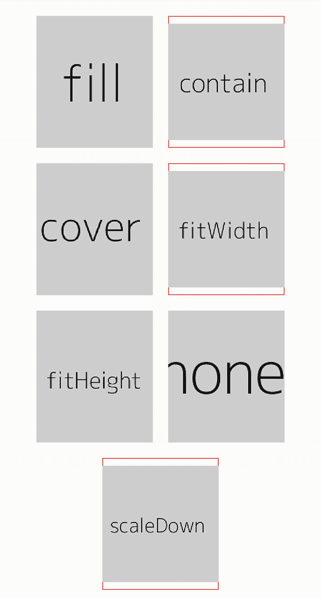
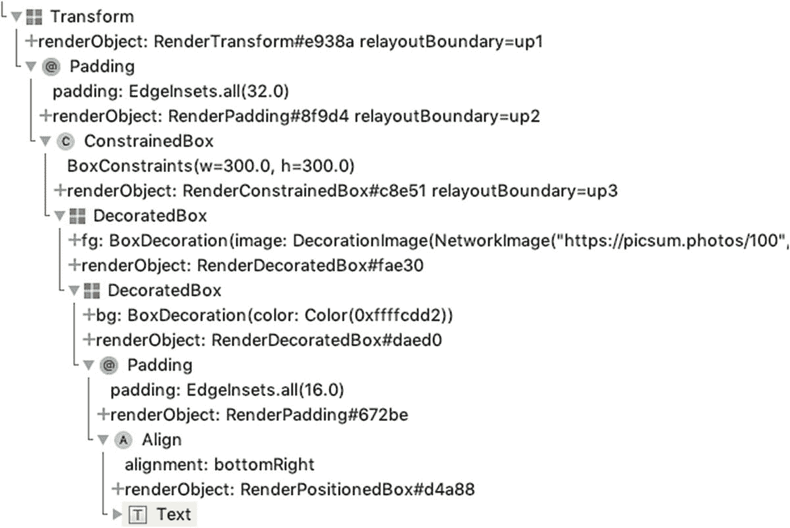
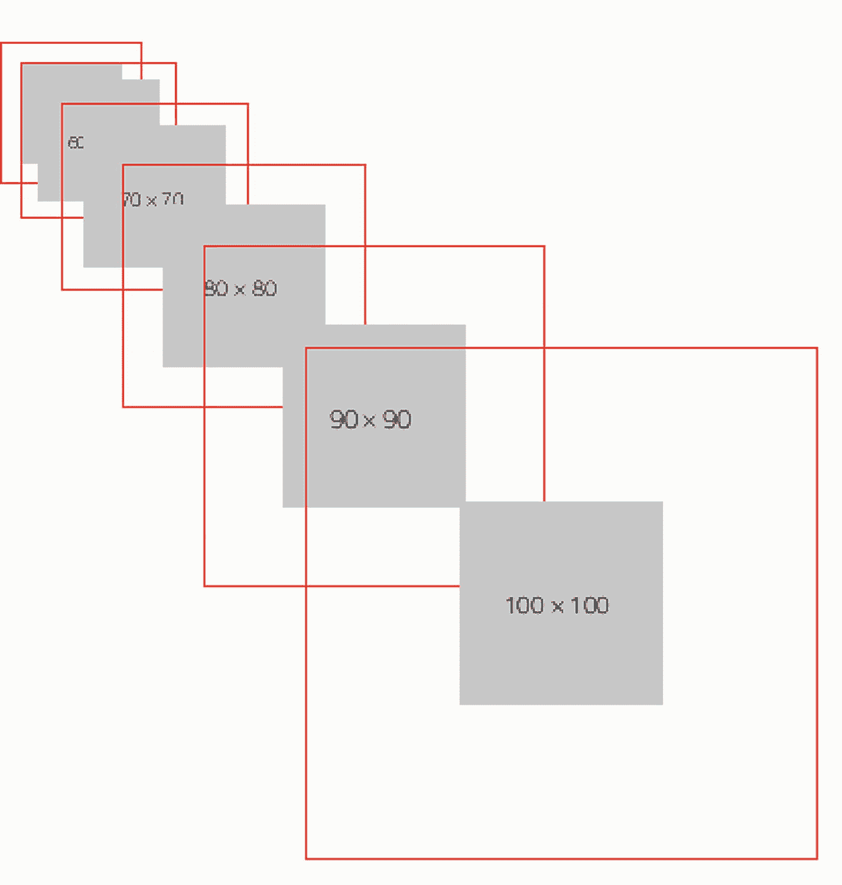

# 5. 布局小部件

在构建用户界面时，布局始终是一项具有挑战性的任务。对于移动应用而言，考虑到设备屏幕分辨率种类繁多，布局会变得更加复杂。本章将介绍 Flutter 中与布局相关的实用方法。

## 5.1 理解 Flutter 中的布局

### 问题

你想了解 Flutter 中的布局是如何工作的。

### 解决方案

Flutter 中的布局通过一组小部件来实现。这些布局小部件会包裹其他小部件，以应用不同的布局约束。

### 讨论

对于移动应用而言，布局必须具有响应性，才能在无需编写大量难以维护的代码的情况下，适应不同的屏幕分辨率。幸运的是，随着布局技术的发展，现在构建响应式布局变得更加容易。如果你有过使用 CSS 进行 Web 开发的经验，可能听说过 W3C 制定的 CSS 弹性盒子布局模块规范（`https://www.w3.org/TR/css-flexbox-1/`）。弹性布局模型之所以强大，是因为它允许开发者表达布局“应该是什么”，而不是“如何”实现实际布局。这种声明式方法将繁重的工作转移到了底层框架上。最终得到的布局代码更易于理解和维护。

例如，如果你想将一个盒子放置在容器的中央，旧方法可能需要计算盒子和容器的大小以确定盒子的位置。而使用弹性布局时，可以将布局简化为代码清单 [5-1] 中的 CSS 代码：

```
.container {
display: flex;
width: 400px;
height: 400px;
justify-content: center;
align-items: center;
border: 1px solid green;
}
.item {
width: 200px;
height: 200px;
border: 1px solid red;
}
Listing 5-1
CSS code to center an item
```

弹性布局的思想现在不仅用于网页设计，也应用于移动应用。React Native 使用了弹性布局（`https://facebook.github.io/react-native/docs/flexbox`）。Flutter 也采用了弹性布局的思路。正如方法 4-1 中所述，布局是通过小部件实现的。你可以在 Flutter 中看到诸如 `Flex`、`Row`、`Column` 和 `Flexible` 这样的小部件类，它们的名称都源自弹性布局的概念。CSS 中的弹性布局模型不在本书的讨论范围内。不过，理解这一 W3C 规范仍然很有价值，它能帮助你更好地理解 Flutter 中的弹性布局。

#### RenderObject

Flutter 中的布局算法负责确定渲染树中每个 `RenderObject` 实例的尺寸和位置。`RenderObject` 类非常灵活，可以适用于任何坐标系或布局协议。`RenderObject` 类通过 `layout()` 方法定义了基本的布局协议。`layout()` 方法有一个必需的、类型为 `Constraints` 的位置参数。`Constraints` 类指定了子对象必须遵守的布局约束。对于一个特定的 `Constraints` 实例，可能存在多个满足它的结果。只要结果在允许范围内，子对象可以自由选择使用其中任何一个。有时，一个 `Constraints` 实例可能只给子对象留出一个有效结果。这种 `Constraints` 实例被称为紧约束。紧约束通常灵活性较低，但由于具有紧约束的小部件无需重新布局，它们能提供更好的性能。

`layout()` 方法有一个命名参数 `parentUsesSize`，用于指定父对象是否需要使用子对象计算出的布局信息。如果 `parentUsesSize` 为 true，意味着父对象的布局依赖于子对象的布局。在这种情况下，每当子对象需要布局时，父对象可能也需要重新布局。布局完成后，每个 `RenderObject` 实例的某些字段会被设置，以包含布局信息。实际存储的信息取决于布局实现方式。这段布局信息存储在 `parentData` 属性中。

默认情况下，Flutter 使用由 `RenderBox` 类实现的二维笛卡尔坐标系。`RenderBox` 类通过 `BoxConstraints` 类实现了盒子布局模型。在盒子布局模型中，每个 `RenderBox` 实例被视为一个矩形，其大小由 `Size` 实例指定。每个盒子都有自己的坐标系。左上角的坐标为 (0,0)，而右下角的坐标为 (宽度，高度)。`RenderBox` 类使用 `BoxParentData` 作为布局数据的类型。`BoxParentData.offset` 属性指定了在父对象的坐标系中绘制子对象的偏移量。

#### BoxConstraints

一个 `BoxConstraints` 实例由四个双精度浮点命名参数指定：`minWidth`、`maxWidth`、`minHeight` 和 `maxHeight`。这些参数的值必须满足以下规则。`double.infinity` 是约束的有效值：

- `0.0 <= minWidth <= maxWidth <= double.infinity`
- `0.0 <= minHeight <= maxHeight <= double.infinity`

盒子布局完成后，`RenderBox` 实例的大小必须满足应用于它的 `BoxConstraints` 实例的约束：

- `minWidth <= Size.width <= maxWidth`
- `minHeight <= Size.height <= maxHeight`

如果在某个轴向上最小约束和最大约束相同，则该轴向是紧约束。例如，如果 `minWidth` 和 `maxWidth` 的值相同，则宽度是紧约束的。当宽度和高度都是紧约束时，`BoxConstraints` 实例即为紧约束。如果在某个轴向上最小约束为 `0.0`，则该轴向是松约束。如果在某个轴向上最大约束不是无限大，则该轴向是有界的；否则，该轴向是无界的。

#### 布局算法

在盒子布局模型中，布局通过一次遍历渲染树来完成。首先，它通过传递约束向下遍历渲染树。在此阶段，渲染对象使用其父对象传递的约束进行布局。在第二阶段，它通过传递具体结果向上遍历渲染树，这些结果决定了每个渲染对象的大小和偏移量。


### 布局组件

Flutter 提供了一组用于不同布局需求的布局组件。这些组件可分为两类。第一类是包含单个子组件的组件，它们是 `SingleChildRenderObjectWidget` 类的子类。第二类是可以包含多个子组件的组件，它们是 `MultiChildRenderObjectWidget` 类的子类。这些组件的构造方法具有相似的模式。第一个命名参数是类型为 `Key` 的 `key`。单子组件布局构造方法的最后一个命名参数是类型为 `Widget` 的 `child`，而多子组件布局构造方法的最后一个命名参数是类型为 `List<Widget>` 的 `children`。

这些布局组件是 `RenderObjectWidget` 类的子类。`RenderObjectWidget` 类用于配置 `RenderObjectElement`。`RenderObjectElement` 则封装了 `RenderObject`。

## 5.2 将组件居中放置

### 问题

你希望将一个组件放置在另一个组件的中心。

### 解决方案

用 `Center` 组件包裹该组件。

### 讨论

要将一个组件放置在另一个组件的中心，只需用 `Center` 组件包裹该组件即可。该组件将水平且垂直地放置在 `Center` 组件的中心。这个 `Center` 组件会成为原始父组件的子组件。`Center` 构造方法有两个命名参数 `widthFactor` 和 `heightFactor`，分别用于指定宽度和高度的尺寸因子。清单 5-2 展示了使用 `Center` 组件的示例。

```dart
Center(
widthFactor: 2.0,
heightFactor: 2.0,
child: Text("Center"),
)
```

`Center` 组件实际上是 `Align` 组件的一个子类，其 `alignment` 属性被设置为 `Alignment.center`。`Center` 组件的行为与配方 5-3 中讨论的 `Align` 组件相同。

## 5.3 对齐组件

### 问题

你希望将一个组件在其父组件内的不同位置进行对齐。

### 解决方案

用 `Align` 组件包裹该组件。

### 讨论

使用 `Align` 组件，你可以将子组件对齐到不同的位置。`Align` 构造方法有一个类型为 `AlignmentGeometry` 的命名参数 `alignment`，用于指定对齐方式。`Center` 组件实际上是 `Align` 组件的一种特殊形式，其 `alignment` 始终设置为 `Alignment.center`。`Align` 构造方法还有命名参数 `widthFactor` 和 `heightFactor`。

`AlignmentGeometry` 类有两个子类，用于不同的场景。`Alignment` 类表示视觉坐标中的对齐方式。`Alignment` 有两个属性 `x` 和 `y`，用于表示二维坐标系中矩形内的位置。`x` 和 `y` 属性分别指定水平方向和垂直方向的位置。`Alignment(0.0, 0.0)` 表示矩形的中心。1.0 单位表示从中心到矩形一侧的距离。2.0 单位表示矩形在特定方向上的长度。例如，`x` 的值为 2.0 表示矩形的宽度。`x` 的正值表示中心右侧的位置，负值表示中心左侧的位置。`y` 的值也遵循同样的规则。`Align` 为常用位置提供了几个常量；参见表 5-1。

**表 5-1** 对齐常量

| 名称 | 值 | 描述 |
| --- | --- | --- |
| `bottomCenter` | `Alignment(0.0, 1.0)` | 底边中点。 |
| `bottomLeft` | `Alignment(-1.0, 1.0)` | 底边最左点。 |
| `bottomRight` | `Alignment(1.0, 1.0)` | 底边最右点。 |
| `center` | `Alignment(0.0, 0.0)` | 水平和垂直方向的中点。 |
| `centerLeft` | `Alignment(-1.0, 0.0)` | 左边中点。 |
| `centerRight` | `Alignment(1.0, 0.0)` | 右边中点。 |
| `topCenter` | `Alignment(0,0, -1.0)` | 顶边中点。 |
| `topLeft` | `Alignment(-1.0, -1.0)` | 顶边最左点。 |
| `topRight` | `Alignment(1.0, -1.0)` | 顶边最右点。 |

如果在对齐时需要考虑文本方向，则需要使用 `AlignmentDirectional` 类而不是 `Alignment` 类。`AlignmentDirectional` 类具有属性 `start` 而不是 `x`。`start` 的值沿文本方向增长。当文本方向为从左到右时，`start` 的值与 `Alignment` 中的 `x` 含义相同。如果文本方向为从右到左，则 `start` 的值与 `Alignment` 中的 `x` 相反。`AlignmentDirectional` 类也为常用位置提供了几个常量；参见表 5-2。这些常量使用 `start` 和 `end` 而不是 `left` 和 `right` 来表示不同方向。

**表 5-2** AlignmentDirectional 常量

| 名称 | 值 | 描述 |
| --- | --- | --- |
| `bottomCenter` | `AlignmentDirectional (0.0, 1.0)` | 底边中点。 |
| `bottomStart` | `AlignmentDirectional(-1.0, 1.0)` | 起始侧的底角。 |
| `bottomEnd` | `AlignmentDirectional(1.0, 1.0)` | 结束侧的底角。 |
| `center` | `AlignmentDirectional (0.0, 0.0)` | 水平和垂直方向的中点。 |
| `centerStart` | `AlignmentDirectional(-1.0, 0.0)` | 起始边的中点。 |
| `centerEnd` | `AlignmentDirectional(1.0, 0.0)` | 结束边的中点。 |
| `topCenter` | `AlignmentDirectional(0,0, -1.0)` | 顶边中点。 |
| `topStart` | `AlignmentDirectional(-1.0, -1.0)` | 起始侧的顶角。 |
| `topEnd` | `AlignmentDirectional(1.0, -1.0)` | 结束侧的顶角。 |

`AlignmentGeometry` 的 `resolve()` 方法接收一个类型为 `TextDirection` 的参数，并返回一个 `Alignment` 实例。你可以使用此方法将 `AlignmentDirectional` 实例转换为 `Alignment` 实例。

传递给其子组件的约束是对此组件约束对象调用 `loosen()` 方法的结果。这意味着子组件可以选择一个不超过此组件大小的尺寸。组件本身的大小取决于参数 `widthFactor` 和 `heightFactor` 的值及其约束对象。对于宽度，如果 `widthFactor` 不为 null 或 `constraints.maxWidth` 为 `double.infinity`，则宽度是受约束限制的，最接近 `childWidth * (widthFactory ?? 1.0)` 的值。否则，宽度由约束决定。高度也遵循同样的规则。

清单 5-3 展示了使用 `Align` 组件的示例。

```dart
Align(
alignment: Alignment.topLeft,
child: SizedBox(
width: 200,
height: 200,
child: Center(
child: Text("TopLeft"),
),
),
)
```

## 5.4 对组件施加约束

### 问题

你希望对组件施加布局约束。

### 解决方案

使用 `ConstrainedBox` 或 `SizedBox`。


```markdown

# Discussion

正如食谱 5-1 中所讨论的，`Constraints`和`BoxContraints`实例通常分别用于`RenderObject`和`RenderBox`的`layout()`方法中。当构建 widget 树时，你可能也想对 widget 施加布局约束。在这种情况下，你可以使用`ConstrainedBox` widget。`ConstrainedBox`构造函数有一个必需的命名参数`constraints`，类型为`BoxConstraints`，用于指定要施加给子组件的约束。

`SizedBox` widget 可以被视为一种特殊的`ConstrainedBox`。`SizedBox`具有命名参数`width`和`height`，它们用于通过`BoxConstraints.tightFor()`方法创建一个紧约束。`SizedBox(width: width, height: height, child: child)`等同于`ConstrainedBox(constraints: BoxConstraints.tightFor(width: width, height: height), child: child)`。如果你想施加紧约束，那么`SizedBox`比`ConstrainedBox`更方便。`SizedBox`还有其他用于常见用例的命名构造函数；见表 5-3。

**表 5-3** `SizedBox`构造函数

| 名称 | 含义 | 描述 |
| --- | --- | --- |
| `SizedBox.expand()` | `SizedBox(width: double.infinity, height: double.infinity)` | 与其父组件允许的一样大。 |
| `SizedBox.shrink()` | `SizedBox(width: 0.0, height: 0.0)` | 与其父组件允许的一样小。 |
| `SizedBox.fromSize()` | `SizedBox(width: size.width; height: size.height)` | 具有指定大小的框。 |

实际应用于子 widget 的约束是提供的`constraints`参数与`ConstrainedBox`或`SizedBox`的父组件提供的约束的组合。组合通过调用`providedContraints.enforce(parentContraints)`完成。结果约束尊重父约束，并尽可能接近提供的约束。`ConstrainedBox`或`SizedBox`的大小是子 widget 布局后的大小。

列表 5-4 展示了使用`ConstrainedBox`和`SizedBox`的四个示例。第一个示例是`SizedBox`的典型用法模式。第二个示例使用了`SizedBox.shrink()`，导致图像不显示。第三个示例是`ConstrainedBox`的典型用法模式。最后一个示例展示了`ConstrainedBox`实例如何尊重来自父组件的约束。

```
SizedBox(
  width: 100,
  height: 100,
  child: Text('SizedBox'),
)

SizedBox.shrink(
  child: Image.network('https://picsum.photos/50'),
)

ConstrainedBox(
  constraints: BoxConstraints(
    maxWidth: 50,
    minHeight: 50,
  ),
  child: Text('ConstrainedBox'),
)

ConstrainedBox(
  constraints: BoxConstraints(
    maxWidth: 200,
  ),
  child: ConstrainedBox(
    constraints: BoxConstraints(
      maxHeight: 200,
    ),
    child: Image.network('https://picsum.photos/300'),
  ),
)

列表 5-4 ConstrainedBox 和 SizedBox 示例
```

## 5.5 不对 Widget 施加约束

### 问题

你想要对 widget 施加约束，以允许它们以自然大小渲染。

### 解决方案

使用`UnconstrainedBox`。

### 讨论

`UnconstrainedBox`与食谱 5-4 中的`ConstrainedBox`相反。`UnconstrainedBox`不对其子组件施加任何约束。子组件可以在`UnconstrainedBox`实例提供的无限空间上自由渲染。`UnconstrainedBox`将尝试通过遵循其自身约束的限制，使用子 widget 的大小来确定其自身大小。

如果子 widget 的大小大于`UnconstrainedBox`能提供的最大尺寸，子 widget 将被裁剪。否则，子 widget 将根据`alignment`参数（类型为`AlignmentGeometry`）的值进行对齐。如果子组件溢出父组件，则在调试模式下会显示警告。使用`UnconstrainedBox`时，仍然可以通过`constrainedAxis`参数（类型为`Axis`）向一个轴添加约束。然后子组件仅允许在另一个轴上不受约束地渲染。

在列表 5-5 中，`UnconstrainedBox` widget 被放置在一个具有固定宽度和高度的`SizedBox` widget 中。`UnconstrainedBox` widget 在水平轴上受到约束，这意味着最小和最大宽度均为 100px。图像的宽度为 200px，因此它被缩小到 100px 以满足宽度约束。这导致图像高度缩小到 150px，超过了父组件`SizedBox` widget 的最大高度 100px。在调试模式下运行时，你可以看到警告消息，提示顶部和底部溢出了 25px。

```
SizedBox(
  width: 100,
  height: 100,
  child: UnconstrainedBox(
    constrainedAxis: Axis.horizontal,
    child: Image.network('https://picsum.photos/200/300'),
  ),
)

列表 5-5 UnconstrainedBox 示例
```

## 5.6 忽略父组件时对 Widget 施加约束

### 问题

你希望无论 widget 放置在何处，都对其施加约束。

### 解决方案

使用`OverflowBox`。

### 讨论

在向 widget 施加约束时，通常会尊重来自父 widget 的约束。尊重父约束使得 widget 的布局能够灵活适应不同的使用场景。有时你可能希望 widget 只尊重显式提供的约束，而忽略父组件的约束。在这种情况下，你可以使用`OverflowBox`。

`OverflowBox`构造函数具有命名参数`alignment`、`minWidth`、`maxWidth`、`minHeight`和`maxHeight`。如果任何与约束相关的参数为`null`，则使用父约束中的相应值。如果你为所有四个与约束相关的参数提供非空值，则`OverflowBox`的子组件的布局与当前 widget 完全无关。

在列表 5-6 中，`OverflowBox` widget 创建时所有四个与约束相关的参数都提供了非空值，因此即使它被放置在`SizedBox` widget 内部，其大小也始终是`Size(200, 200)`。

```
SizedBox(
  width: 100,
  height: 100,
  child: OverflowBox(
    minWidth: 200,
    minHeight: 200,
    maxWidth: 200,
    maxHeight: 200,
    child: Image.network('https://picsum.photos/300'),
  ),
)

列表 5-6 OverflowBox 示例
```

## 5.7 限制大小以允许子 Widget 溢出

### 问题

你希望 widget 具有特定大小，并允许子 widget 溢出。

### 解决方案

使用`SizedOverflowBox`。

### 讨论

`SizedOverflowBox`由一个大小创建。该 widget 的实际大小尊重其约束，并尽可能接近请求的大小。子组件的布局仅使用`SizedOverflowBox` widget 的约束。

在列表 5-7 中，`SizedOverflowBox` widget 被放置在一个具有约束`BoxConstraints.loose(Size(100, 100))`的`ConstrainedBox` widget 中。`SizedOverflowBox` widget 的请求大小是`Size(50, 50)`。`SizedOverflowBox`的实际大小也是`Size(50, 50)`。子`Image` widget 仅使用`SizedOverflowBox`的约束。结果是图像 widget 的大小为`Size(100, 100)`，这溢出其父组件。

```
ConstrainedBox(
  constraints: BoxConstraints.loose(Size(100, 100)),
  child: SizedOverflowBox(
    size: Size(50, 50),
    child: Image.network('https://picsum.photos/400'),
  ),
)

列表 5-7 SizedOverflowBox 示例
```

## 5.8 在无界时限制 Widget 大小

### 问题

你有一个通常匹配其父组件大小的 widget，但你希望它能在需要大小约束的其他地方使用。

### 解决方案

使用`LimitedBox`。
```


### 讨论

某些 widget 在设计上通常会尽可能放大以匹配父级尺寸。但在其他场景下，这些 widget 需要被约束。例如，当这些 widget 被添加到垂直列表中时，其高度需要受到限制。`LimitedBox` 构造函数的命名参数 `maxWidth` 和 `maxHeight` 用于指定限制条件。如果 `LimitedBox` widget 的最大宽度无限制，则其子级宽度将被限制在 `maxWidth` 内。如果其最大高度无限制，则子级高度被限制在 `maxHeight` 内。

在代码清单 5-8 中，`LimitedBox` widget 的 `maxHeight` 被设置为 100，因此子级的最大高度为 100px。

```
LimitedBox(
maxHeight: 100,
child: Image.network('https://picsum.photos/400'),
)
代码清单 5-8
LimitedBox 示例
```

## 5.9 缩放与定位 Widget

### 问题

你需要缩放和定位一个 widget。

### 解决方案

使用 `FittedBox` 搭配不同的适应模式和对齐方式。

### 讨论

食谱 5-3 中的 `Align` widget 可以通过不同的对齐方式定位其子级。`FittedBox` widget 支持对其子级进行缩放和定位。适应模式通过类型为 `BoxFit` 的参数 `fit` 指定。`BoxFit` 是一个枚举类型，其值如表 5-4 所示。

**表 5-4** BoxFit 值

| 名称 | 描述 |
| --- | --- |
| `fill` | 填充目标框。会忽略源素材的宽高比。 |
| `contain` | 尽可能大，将源素材完整包含在目标框内。 |
| `cover` | 尽可能小，覆盖整个目标框。 |
| `fitWidth` | 仅确保显示源素材的完整宽度。 |
| `fitHeight` | 仅确保显示源素材的完整高度。 |
| `none` | 在目标框内对齐源素材，并丢弃框外部分。 |
| `scaleDown` | 与目标框对齐，必要时缩小源素材以确保其适应框内。如果源素材被缩小，效果等同于 `contain`；否则等同于 `none`。 |

`FittedBox` 通常用于显示图片时。代码清单 5-9 展示了一个演示 `BoxFit` 不同值的示例。`ImageBox` widget 使用 `SizedBox` widget 来限制其尺寸，并将图片放置在 `FittedBox` widget 内部。`DecoratedBox` widget 创建了一个红色边框来显示 `ImageBox` widget 的边界。

```
class FitPage extends StatelessWidget {
@override
Widget build(BuildContext context) {
return Scaffold(
appBar: AppBar(
title: Text('适应'),
),
body: Center(
child: Wrap(
spacing: 20,
runSpacing: 20,
alignment: WrapAlignment.spaceAround,
children: [
ImageBox(fit: BoxFit.fill),
ImageBox(fit: BoxFit.contain),
ImageBox(fit: BoxFit.cover),
ImageBox(fit: BoxFit.fitWidth),
ImageBox(fit: BoxFit.fitHeight),
ImageBox(fit: BoxFit.none),
ImageBox(fit: BoxFit.scaleDown),
],
),
),
);
}
}
class ImageBox extends StatelessWidget {
const ImageBox({
Key key,
this.boxWidth = 150,
this.boxHeight = 170,
this.imageWidth = 200,
this.fit,
});
final double boxWidth;
final double boxHeight;
final double imageWidth;
final BoxFit fit;
@override
Widget build(BuildContext context) {
return DecoratedBox(
decoration: BoxDecoration(border: Border.all(color: Colors.red)),
child: SizedBox(
width: boxWidth,
height: boxHeight,
child: FittedBox(
fit: fit,
child: SizedBox(
width: imageWidth,
height: imageWidth,
child: Image.network('https://dummyimage.com/${imageWidth.toInt()}'
'&text=${fit.toString().substring(7)}'),
),
),
),
);
}
}
代码清单 5-9
BoxFit 的不同值
```

图 5-1 展示了代码清单 5-9 的截图效果。图片中的文字显示了该 `ImageBox` widget 所采用的 `BoxFit` 值。



**图 5-1** BoxFit 的不同值

## 5.10 旋转 Widget

### 问题

你需要旋转一个 widget。

### 解决方案

使用 `RotatedBox`。

### 讨论

`RotatedBox` widget 会在布局前旋转其子级。旋转角度通过 `int` 类型的顺时针四分之一圈数指定，使用 `quarterTurns` 参数。`quarterTurns` 参数值为 1 表示顺时针旋转 90 度。

在代码清单 5-10 中，`Text` widget 被旋转了四分之一圈。

```
RotatedBox(
quarterTurns: 1,
child: Text(
'Hello World',
textScaleFactor: 2,
),
)
代码清单 5-10
RotatedWidget 示例
```

## 5.11 为 Widget 添加内边距

### 问题

你需要为 widget 周围添加内边距（padding）。

### 解决方案

使用 `Padding`。

### 讨论

`Padding` widget 会在其子级周围创建空白空间。传递给其子级的布局约束，是 widget 自身约束减去内边距后的结果，这会导致子级以更小的尺寸进行布局。内边距通过必需的 `padding` 参数指定，其类型为 `EdgeInsetsGeometry`。

与 `AlignmentGeometry` 类似，`EdgeInsetsGeometry` 有两个子类：`EdgeInsets` 和 `EdgeInsetsDirectional`。`EdgeInsets` 类以视觉坐标表示偏移量。偏移量通过 `left`、`right`、`top` 和 `bottom` 边指定。表 5-5 展示了 `EdgeInsets` 类的构造函数。

**表 5-5** EdgeInsets 构造函数

| 名称 | 描述 |
| --- | --- |
| `EdgeInsets.all()` | 所有边的偏移量都设置为给定值。 |
| `EdgeInsets.fromLTRB()` | 分别为左、上、右、下边指定偏移量值。 |
| `EdgeInsets.only()` | 包含命名参数 left、top、right 和 bottom，默认值为 0.0。 |
| `EdgeInsets.symmetric()` | 包含命名参数 vertical 和 horizontal，用于创建对称偏移量。 |

如需考虑文本方向，应使用 `EdgeInsetsDirectional` 类代替 `EdgeInsets`。`EdgeInsetsDirectional` 类使用 `start` 和 `end` 来代替 `left` 和 `right`。它提供了 `EdgeInsetsDirectional.fromSTEB()` 构造函数，用于从 `start`、`top`、`end` 和 `bottom` 偏移量创建内边距。`EdgeInsetsDirectional.only()` 构造函数与 `EdgeInsets.only()` 类似。

代码清单 5-11 展示了 `Padding` widget 的示例。

```
Padding(
padding: EdgeInsets.all(20),
child: Image.network('https://picsum.photos/200'),
)
代码清单 5-11
Padding 示例
```

## 5.12 按宽高比调整 Widget 尺寸

### 问题

你需要调整 widget 尺寸以保持特定的宽高比。

### 解决方案

使用 `AspectRatio`。


### 讨论

`AspectRatio` 构造函数需要一个必填参数 `aspectRatio`，用于指定宽高比的数值。例如，4:3 的宽高比对应的值为 `4.0/3.0`。`AspectRatio` 组件会尝试在尊重其布局约束的前提下，找到保持该宽高比的最佳尺寸。

这个过程从将宽度设置为约束的最大宽度开始。如果最大宽度是有限的，则高度通过 `width / aspectRatio` 计算得出。否则，高度被设置为约束的最大高度，宽度则设置为 `height * aspectRatio`。可能还会有些额外步骤，以确保计算出的宽度和高度满足布局约束。例如，如果高度小于约束的最小高度，则高度被设置为该最小值，宽度则基于高度和宽高比重新计算。一般规则是先检查宽度再检查高度，先检查最大值再检查最小值。最终尺寸可能不完全满足宽高比要求，但必须满足布局约束。

在代码清单 5-12 中，`AspectRatio` 组件被放置在一个约束宽松的 `ConstrainedBox` 内，其约束为 `Size(200, 200)`。宽高比是 `4.0/3.0`，因此高度基于 `200 / (4.0 / 3.0) = 150.0` 计算得出。`AspectRatio` 的最终尺寸为 `Size(200.0, 150.0)`。

```
ConstrainedBox(
constraints: BoxConstraints.loose(Size(200, 200)),
child: AspectRatio(
aspectRatio: 4.0 / 3.0,
child: Image.network('https://picsum.photos/400/300'),
),
)
代码清单 5-12
AspectRatio 示例
```

## 5.13 变换组件

### 问题

你想对一个组件应用变换。

### 解决方案

使用 `Transform`。

### 讨论

`Transform` 组件可以在绘制其子组件之前对其应用变换。变换使用 `Matrix4` 实例来表示。`Transform` 构造函数具有表 5-6 中所示的命名参数。

**表 5-6** `Transform` 的命名参数

| 名称 | 类型 | 描述 |
| --- | --- | --- |
| `transform` | `Matrix4` | 用于变换子组件的矩阵。 |
| `origin` | `Offset` | 应用变换的坐标系原点。 |
| `alignment` | `AlignmentGeometry` | 原点的对齐方式。 |
| `transformHitTests` | `bool` | 执行命中测试时是否应用变换。 |

`Transform` 类提供了其他构造函数来创建常见的变换：

*   `Transform.rotate()` – 通过旋转指定角度来变换子组件。
*   `Transform.scale()` – 通过使用指定的缩放因子均匀缩放来变换子组件。
*   `Transform.translate()` – 通过平移指定的偏移量来变换子组件。

代码清单 5-13 展示了使用 `Transform` 命名构造函数的示例。

```
Transform.rotate(
angle: pi / 4.0,
origin: Offset(10, 10),
child: Text('Hello World'),
)
Transform.translate(
offset: Offset(50, 50),
child: Text('Hello World'),
)
代码清单 5-13
Transform 示例
```

## 5.14 在组件上控制不同的布局方面

### 问题

你想为一个组件定义不同的布局方面。

### 解决方案

使用 `Container`。

### 讨论

Flutter 有很多用于控制布局不同方面的组件。例如，`SizedBox` 组件控制尺寸，而 `Align` 组件控制对齐方式。如果你想在同一个组件上控制不同的布局方面，可以通过嵌套地包裹这些组件来实现。实际上，Flutter 提供了一个 `Container` 组件，使得定义不同的布局方面更加容易。

表 5-7 展示了 `Container` 构造函数的命名参数。你不能同时为 `color` 和 `decoration` 提供非空值，因为 `color` 仅仅是创建 `BoxDecoration(color: color)` 的一种简写。如果 `width` 或 `height` 不为空，则它们的值将用于收紧约束。

**表 5-7** `Container` 的命名参数

| 名称 | 类型 | 描述 |
| --- | --- | --- |
| `alignment` | `AlignmentGeometry` | 子组件的对齐方式。 |
| `padding` | `EdgeInsetsGeometry` | 装饰内部的空间。 |
| `color` | `Color` | 背景颜色。 |
| `decoration` | `Decoration` | 绘制在子组件背后的装饰。 |
| `foregroundDecoration` | `Decoration` | 绘制在子组件前面的装饰。 |
| `width` | `double` | 子组件的宽度。 |
| `height` | `double` | 子组件的高度。 |
| `constraints` | `BoxConstraints` | 额外的约束。 |
| `margin` | `EdgeInsetsGeometry` | 装饰周围的空间。 |
| `transform` | `Matrix4` | 应用于容器的变换。 |

`Container` 是基于参数值对不同组件的组合。代码清单 5-14 展示了 `Container` 所使用的不同组件的嵌套结构以及这些组件可能用到的参数。如果某个参数的值为空，则相应的组件可能不存在。

```
Transform (transform)
- Padding (margin)
- ConstrainedBox (constraints, width, height)
- DecoratedBox (foregroundDecoration)
- DecoratedBox (decoration, color)
- Padding (padding, decoration)
- Align (alignment)
- child
代码清单 5-14
Container 的结构
```

代码清单 5-15 展示了一个使用了所有命名参数的 `Container` 组件示例。

```
Container(
alignment: Alignment.bottomRight,
padding: EdgeInsets.all(16),
color: Colors.red.shade100,
foregroundDecoration: BoxDecoration(
image: DecorationImage(
image: NetworkImage('https://picsum.photos/100'),
),
),
width: 300,
height: 300,
constraints: BoxConstraints.loose(Size(400, 400)),
margin: EdgeInsets.all(32),
transform: Matrix4.rotationZ(0.1),
child: Text(
'你好世界',
textScaleFactor: 3,
),
)
代码清单 5-15
Container 示例
```

图 5-2 展示了代码清单 5-15 中 `Container` 组件的结构。你可以清晰地看到这些组件是如何嵌套的。



**图 5-2** `Container` 的结构

## 5.15 实现 Flex 框布局

### 问题

你有多个组件需要布局，并且希望它们能够占据额外的空间。

### 解决方案

使用 `Flex`、`Column`、`Row`、`Flexible` 和 `Expanded`。

### 讨论

要使用弹性框模型布局多个组件，你可以使用 Flutter 提供的一组组件，包括 `Flex`、`Column`、`Row`、`Flexible`、`Expanded` 和 `Spacer`。实际上，只需理解 `Flex` 和 `Flexible` 组件即可。`Flex` 组件用作布局容器，而 `Flexible` 组件用于包裹容器内的子组件。`Flex` 组件将其子组件显示为一维数组。它支持在水平和垂直两个方向上布局子组件。`Row` 和 `Column` 是 `Flex` 的子类，它们分别只在水平方向和垂直方向放置子组件。`Flex` 容器中的 `Flexible` 组件可以控制子组件如何伸缩以占据额外空间。`Flex` 组件的子组件可以是弹性的，也可以不是。如果你想让一个子组件具有弹性，只需将其包裹在 `Flexible` 组件中即可。

与 CSS 弹性框布局类似，`Flex` 组件使用两个轴进行布局。子组件沿其排列的轴称为*主轴*。另一个轴称为*交叉轴*。主轴通过类型为 `Axis` 的 `direction` 参数配置。如果值是 `Axis.horizontal`，则主轴为水平轴，而交叉轴为垂直轴。如果值是 `Axis.vertical`，则主轴为垂直轴，而交叉轴为水平轴。`Row` 组件始终使用水平轴作为主轴，`Column` 组件始终使用垂直轴作为主轴。如果主轴已知，则应使用 `Row` 或 `Column` 组件，而不是 `Flex` 组件。


#### 弹性盒子布局算法

弹性盒子的子节点布局较为复杂，需分多步进行。第一步，对每个弹性因子为 null 或零的子节点进行布局，这些是非弹性子节点。用于布局这些子节点的约束取决于 `crossAxisAlignment` 的值。如果 `crossAxisAlignment` 的值是 `CrossAxisAlignment.stretch`，则约束将是交叉轴上最大尺寸的紧约束。否则，约束仅在交叉轴上设置最大值。例如，如果方向是 `Axis.horizontal` 且 `crossAxisAlignment` 为 `CrossAxisAlignment.stretch`，则这些非弹性子节点的约束会将 `minHeight` 和 `maxHeight` 都设置为 Flex 约束的 `maxHeight`。这使得这些子节点占据交叉轴上的所有空间。第一步中，会记录这些子节点的总分配尺寸以及交叉轴尺寸的最大值。

第二步，对每个具有弹性因子的子节点进行布局，这些是弹性子节点。根据第一步，已知主轴已分配的尺寸。基于主轴的**最大尺寸**和**已分配尺寸**可以计算出**自由空间**。自由空间根据弹性因子在所有弹性子节点之间分配。弹性因子为 `2.0` 的子节点获得的自由空间量是弹性因子为 `1.0` 的子节点的两倍。假设有三个子节点，其弹性因子分别为 `1.0`、`2.0` 和 `3.0`，如果自由空间是 `120px`，那么这些子节点获得的额外空间将分别是 `20px`、`40px` 和 `60px`。为每个子节点基于弹性因子计算出的值将成为主轴上的最大约束。主轴上的最小约束取决于该子节点的 `FlexFit` 值。如果 `fit` 值是 `FlexFit.tight`，则最小值与最大值相同，这会在主轴上产生紧约束。如果 `fit` 值是 `FlexFit.loose`，则最小值为 `0.0`，这会在主轴上产生松约束。交叉轴上的约束与 Flex 小部件的约束相同。最终的约束被用于布局这些弹性子节点。

第三步，确定主轴和交叉轴的**范围**。如果 `mainAxisSize` 的值为 `MainAxisSize.max`，则主轴范围是当前 Flex 小部件的最大约束。否则，主轴范围是所有子节点的**已分配尺寸**。交叉轴的范围是所有子节点交叉轴约束的**最大值**。

最后一步，根据 `mainAxisAlignment` 和 `crossAxisAlignment` 的值确定每个子节点的位置。

表 5-8 展示了枚举 `MainAxisAlignment` 的值。

表 5-8

`MainAxisAlignment` 值

| 名称 | 描述 |
| --- | --- |
| `start` | 将子节点放置在靠近主轴起始端的位置。起始位置对于水平方向由 `TextDirection` 决定，对于垂直方向由 `VerticalDirection` 决定。 |
| `end` | 将子节点放置在靠近主轴末端的位置。末端位置的确定方式与起始端相同。 |
| `center` | 将子节点放置在靠近中间的位置。 |
| `spaceBetween` | 将自由空间均匀分布在子节点之间。 |
| `spaceAround` | 将自由空间均匀分布在子节点之间，并在第一个子节点之前和最后一个子节点之后各留一半空间。 |
| `spaceEvenly` | 将自由空间均匀分布在子节点之间，包括第一个子节点之前和最后一个子节点之后。 |

表 5-9 展示了枚举 `CrossAxisAlignment` 的值。

表 5-9

`CrossAxisAlignment` 值

| 名称 | 描述 |
| --- | --- |
| `start` | 将子节点放置为其起始边缘与交叉轴的起始侧对齐。起始位置对于水平方向由 `TextDirection` 决定，对于垂直方向由 `VerticalDirection` 决定。 |
| `end` | 将子节点放置为其末端边缘与交叉轴的末端侧对齐。末端位置的确定方式与起始端相同。 |
| `center` | 将子节点放置为其中心与交叉轴中心对齐。 |
| `stretch` | 要求子节点填充满交叉轴。 |
| `baseline` | 在交叉轴上匹配子节点的基线。 |

#### Flexible

`Flexible` 具有 `flex` 参数用于指定弹性因子，以及 `fit` 参数用于指定 `BoxFit` 值。`flex` 参数的默认值是 `1`，而 `fit` 的默认值是 `BoxFit.loose`。`Expanded` 是 `Flexible` 的一个子类，其 `fit` 参数被设置为 `BoxFit.tight`。

在代码清单 5-16 中，`Column` 小部件被放置在一个 `LimitedBox` 小部件中以限制其高度。`Column` 小部件的所有子节点都是非弹性的。

```
LimitedBox(
maxHeight: 320,
child: Column(
crossAxisAlignment: CrossAxisAlignment.end,
mainAxisAlignment: MainAxisAlignment.spaceAround,
children: [
Image.network('https://picsum.photos/50'),
Image.network('https://picsum.photos/70'),
Image.network('https://picsum.photos/90'),
],
),
)
代码清单 5-16
包含非弹性子节点的 Flex 小部件
```

在代码清单 5-17 中，`Column` 小部件同时包含弹性和非弹性子节点。可以通过使用 `Flexible` 或 `Expanded` 小部件进行包裹来创建 `Flexible` 小部件。

```
LimitedBox(
maxHeight: 300,
child: Column(
mainAxisAlignment: MainAxisAlignment.spaceBetween,
children: [
Flexible(
child: Image.network('https://picsum.photos/50'),
),
Image.network('https://picsum.photos/40'),
Expanded(
child: Image.network('https://picsum.photos/50'),
),
Expanded(
flex: 2,
child: Image.network('https://picsum.photos/50'),
),
],
),
)
代码清单 5-17
包含弹性与非弹性子节点的 Flex 小部件
```

## 5.16 显示重叠的小部件

### 问题

你想要布局可能会相互重叠的小部件。

### 解决方案

使用 `Stack` 或 `IndexedStack`。


### 讨论

`Stack` widget 的子组件可以是已定位的或未定位的。已定位的子组件会被包装在至少有一个非空属性的 `Positioned` widget 中。`Stack` widget 的尺寸由所有未定位的子组件决定。布局过程分为两个阶段。

第一阶段是布局所有未定位的子组件。用于未定位子组件的约束取决于 `StackFit` 类型的 `fit` 属性值：

*   `StackFit.loose` – 由 `constraints.loosen()` 创建的松散约束。
*   `StackFit.expand` – 由 `BoxConstraints.tight(constraints.biggest)` 创建的紧约束。
*   `StackFit.passthrough` – 与 `Stack` widget 相同的约束。

`Stack` widget 的尺寸由所有未定位子组件的最大尺寸决定。

在第二阶段，所有未定位的子组件会根据 `alignment` 属性进行定位。用于已定位子组件的约束由 `Stack` widget 的尺寸及其属性决定。`Positioned` widget 有六个属性：`left`、`top`、`right`、`bottom`、`width` 和 `height`。`left`、`right` 和 `width` 属性用于确定紧宽度约束。`top`、`bottom` 和 `height` 属性用于确定紧高度约束。例如，如果 `left` 和 `right` 值都不为 null，则紧宽度约束为 `widthOfStack – right – left`。然后，已定位的子组件会根据两个轴上的 `left`、`right`、`top` 和 `bottom` 值进行定位。如果所有这些值都为 null，则根据 `alignment` 进行定位。

`Stack` 的子组件按顺序绘制，第一个子组件位于最底层。`children` 数组中的顺序决定了子组件如何相互重叠。

`IndexedStack` 类是 `Stack` 的子类。`IndexedStack` 实例仅显示子组件列表中的单个子组件。`IndexedStack` 构造函数不仅具有与 `Stack` 构造函数相同的参数，还包括一个 `int` 类型的 `index` 参数，用于指定要显示的子组件索引。如果 `index` 参数的值为 null，则不显示任何内容。`IndexedStack` 的布局与 `Stack` 相同。`IndexedStack` 类仅仅是绘制方式不同。这意味着即使只有一个子组件被显示，所有子组件仍然需要像 `Stack` 一样进行布局。

清单 5-18 展示了一个包含已定位子组件的 `Stack` widget 示例。

```
Stack(
children: [
Image.network('https://picsum.photos/200'),
Image.network('https://picsum.photos/100'),
Positioned(
right: 0,
bottom: 0,
child: Image.network('https://picsum.photos/150'),
),
],
)
Listing 5-18
Example of Stack
```

## 5.17 在多行中显示组件

### 问题

你希望在多行（水平或垂直）中显示组件。

### 解决方案

使用 `Wrap`。

### 讨论

`Flex` widget 不允许子组件的尺寸超过主轴方向的尺寸。当没有足够空间容纳子组件时，`Wrap` widget 会创建新的行。表格 5-10 展示了 `Wrap` 构造函数的命名参数。

表格 5-10 `Wrap` 的命名参数

| 名称 | 值 | 默认值 | 描述 |
| --- | --- | --- | --- |
| `direction` | `Axis` | `Axis.horizontal` | 主轴方向。 |
| `alignment` | `WrapAlignment` | `WrapAlignment.start` | 主轴方向上子组件在行内的对齐方式。 |
| `spacing` | `Double` | `0.0` | 主轴方向上子组件之间的间距。 |
| `runAlignment` | `WrapAlignment` | `WrapAlignment.start` | 交叉轴方向上行的对齐方式。 |
| `runSpacing` | `Double` | `0.0` | 交叉轴方向上各行之间的间距。 |
| `crossAxisAlignment` | `WrapCrossAlignment` | `WrapCrossAlignment.start` | 交叉轴方向上子组件在行内的对齐方式。 |
| `textDirection` | `TextDirection` |  | 水平布局子组件的顺序。 |
| `verticalDirection` | `VerticalDirection` | `VerticalDirection.down` | 垂直布局子组件的顺序。 |
| `children` | `List<Widget>` | `[]` | 子组件列表。 |

`WrapAlignment` 枚举的值与 `MainAxisAlignment` 相同。`WrapCrossAlignment` 枚举只有 `start`、`end` 和 `center` 三个值。

清单 5-19 展示了一个使用 `Wrap` widget 包装十个 `Image` widget 的示例。

```
Wrap(
spacing: 10,
runSpacing: 5,
crossAxisAlignment: WrapCrossAlignment.center,
children: List.generate(
10,
(index) => Image.network('https://picsum.photos/${50 + index * 10}'),
),
)
Listing 5-19
Example of Wrap
```

## 5.18 创建自定义单子布局

### 问题

你希望为单个子组件创建自定义布局。

### 解决方案

使用 `CustomSingleChildLayout`。

### 讨论

如果那些用于单个子组件的内置布局 widget 不能满足你的需求，你可以使用 `CustomSingleChildLayout` 创建自定义布局。`CustomSingleChildLayout` widget 将布局委托给一个 `SingleChildLayoutDelegate` 实例。你需要创建自己的 `SingleChildLayoutDelegate` 子类来实现表格 5-11 中所示的方法。

表格 5-11 `SingleChildLayoutDelegate` 的方法

| 名称 | 描述 |
| --- | --- |
| `getConstraintsForChild(BoxConstraints constraints)` | 获取子组件的约束。 |
| `getPositionForChild(Size size, Size childSize)` | 根据此 widget 和子组件的尺寸获取子组件的位置。 |
| `getSize(BoxConstraints constraints)` | 获取此 widget 的尺寸。 |
| `shouldRelayout()` | 是否应该重新布局。 |

此 widget 的尺寸是委托的 `getSize()` 方法返回的尺寸在应用约束后的结果。子组件的布局使用委托的 `getConstraintsForChild()` 方法返回的约束完成。最后，子组件的位置会用委托的 `getPositionForChild()` 方法返回的值更新。

在清单 5-20 中，`FixedPositionLayoutDelegate` 类重写了 `getSize()` 方法来提供父 widget 的尺寸。它还重写了 `getPositionForChild()` 方法来提供子组件的位置。`getConstraintsForChild()` 方法也被重写以返回紧缩约束。

```
class FixedPositionLayoutDelegate extends SingleChildLayoutDelegate {
@override
bool shouldRelayout(SingleChildLayoutDelegate oldDelegate) {
return false;
}
@override
Size getSize(BoxConstraints constraints) {
return constraints.constrain(Size(300, 300));
}
@override
BoxConstraints getConstraintsForChild(BoxConstraints constraints) {
return constraints.tighten(width: 300, height: 300);
}
@override
Offset getPositionForChild(Size size, Size childSize) {
return Offset(50, 50);
}
}
Listing 5-20
Custom single child layout delegate
```

清单 5-21 展示了如何使用 `FixedPositionLayoutDelegate`。

```
CustomSingleChildLayout(
delegate: FixedPositionLayoutDelegate(),
child: Image.network('https://picsum.photos/100'),
)
Listing 5-21
Example of FixedPositionLayoutDelegate
```

## 5.19 创建自定义多子布局

### 问题

你希望为多个子组件创建自定义布局。

### 解决方案

使用 `CustomMultiChildLayout` 和 `MultiChildLayoutDelegate`。

好的，作为高级文档工程师和翻译员，我将遵循您提供的注意事项和示例，将给定的英文文本翻译成中文。


### 讨论

如果那些内建的多子元素组件无法满足你的需求，你可以使用 `CustomMultiChildLayout` 创建自定义布局。与 `CustomSingleChildLayout` 类似，`CustomMultiChildLayout` 将布局逻辑委托给一个 `MultiChildLayoutDelegate` 实例。`CustomMultiChildLayout` 的所有子元素必须包裹在 `LayoutId` 组件中，以便为它们提供唯一的 ID。在表 5-12 展示的所有方法中，`performLayout()` 和 `shouldRelayout()` 方法是必须实现的。所有其他方法都有默认实现。在 `performLayout()` 方法的实现中，必须为每个子元素恰好调用一次 `layoutChild()` 方法。

表 5-12
`MultiChildLayoutDelegate` 的方法

| 名称 | 描述 |
| --- | --- |
| `hasChild(Object childId)` | 检查是否存在具有给定 ID 的子元素。 |
| `layoutChild(Object childId, BoxConstraints constraints)` | 使用提供的约束条件布局子元素。 |
| `positionChild(Object childId, Offset offset)` | 将子元素定位到给定的偏移量。 |
| `getSize(BoxConstraints constraints)` | 获取此组件的大小。 |
| `performLayout(Size size)` | 实际的布局逻辑。 |
| `shouldRelayout()` | 是否应该重新布局。 |

代码清单 5-22 展示了一个自定义的多子元素布局委托。该委托使用递增的整数值作为布局 ID。子元素的布局 ID 必须从 0 开始。在 `performLayout()` 方法中，`layoutChild()` 方法被调用在每个子元素上，从第一个子元素开始，并使用宽松约束，这让第一个子元素可以采用其自然尺寸。第一个子元素的实际尺寸被记录下来。然后，使用 `Offset.zero` 调用 `positionChild()` 方法，将第一个子元素放置在左上角。在第一个子元素之后，依次对其它所有子元素调用 `layoutChild()` 和 `positionChild()` 方法，并使用递增的尺寸和位置偏移量。

```
class GrowingSizeLayoutDelegate extends MultiChildLayoutDelegate {
@override
void performLayout(Size size) {
int index = 0;
Size childSize = layoutChild(index, BoxConstraints.loose(size));
Offset offset = Offset.zero;
positionChild(index, offset);
index++;
while (hasChild(index)) {
double sizeFactor = 1.0 + index * 0.1;
double offsetFactor = index * 10.0;
childSize = layoutChild(
index,
BoxConstraints.tight(Size(
childSize.width * sizeFactor, childSize.height * sizeFactor)));
offset = offset.translate(offsetFactor, offsetFactor);
positionChild(index, offset);
index++;
}
}
@override
bool shouldRelayout(MultiChildLayoutDelegate oldDelegate) {
return false;
}
@override
Size getSize(BoxConstraints constraints) =>
constraints.constrain(Size(400, 400));
}
代码清单 5-22
自定义多子元素布局委托
```

代码清单 5-23 展示了 `GrowingSizeLayoutDelegate` 的用法。`CustomMultiChildLayout` 的子元素是六个嵌套在 `SizedBox` 中的图片。需要包裹 `LayoutId` 组件来将布局 ID 传递给委托。

```
CustomMultiChildLayout(
delegate: GrowingSizeLayoutDelegate(),
children: List.generate(
6,
(index) => LayoutId(
id: index,
child: DecoratedBox(
decoration:
BoxDecoration(border: Border.all(color: Colors.red)),
child: SizedBox(
width: 70,
height: 70,
child: Image.network(
'https://dummyimage.com/${50 + index * 10}'),
),
),
),
),
)
代码清单 5-23
`GrowingSizeLayoutDelegate` 示例
```

图 5-3 展示了使用 `GrowingSizeLayoutDelegate` 的结果。



图 5-3
使用 `GrowingSizeLayoutDelegate` 的结果

## 5.20 总结

借助 Flutter 中的布局组件，可以轻松满足构建 Flutter 应用时常见的布局需求。本章介绍了许多用于单子元素和多子元素的布局组件。在下一章中，我们将讨论表单组件。

