# 6. 表单组件

表单控件在移动应用中对于与用户交互非常重要。Flutter 提供了一套用于 Material Design 和 iOS 风格的表单组件。这些表单组件通常没有内部状态。它们的外观和行为完全由构造函数参数定义。通过在前代组件中维护状态，表单组件会重新渲染以反映状态变化。本章涵盖了与表单组件基本用法相关的方案。

## 6.1 收集文本输入

### 问题

你想要收集文本输入。

### 解决方案

对于 Material Design 使用 `TextField`，对于 iOS 风格使用 `CupertinoTextField`。

### 讨论

要在 Flutter 应用中收集用户输入，你可以为 Material Design 使用 `TextField` 组件，或者为 iOS 风格使用 `CupertinoTextField` 组件。这两个组件具有相似的使用模式和表现。实际上，这两个组件都封装了相同的 `EditableText`，后者提供了支持滚动、选择和光标移动的基本文本输入能力。`EditableText` 是一个高度可定制的组件，拥有许多命名参数。本方案着重介绍如何设置 `TextField` 或 `CupertinoTextField` 组件的初始值，并从中获取文本。

`EditableText` 组件的文本由一个 `TextEditingController` 实例控制。你可以在创建新的 `EditableText` 组件时，使用 `controller` 参数来设置一个 `TextEditingController` 实例。该控制器维护了与相应 `EditableText` 组件的双向数据绑定。控制器有一个 `text` 属性来跟踪当前编辑的文本，以及一个类型为 `TextSelection` 的 `selection` 属性来跟踪当前选中的文本。每当 `EditableText` 组件中的文本被用户修改或选中时，关联的 `TextEditingController` 实例的 `text` 和 `selection` 属性将被更新。如果你修改了 `TextEditingController` 实例的 `text` 或 `selection` 属性，`EditableText` 组件会自行更新。`TextEditingController` 类是 `ValueNotifier<TextEditingValue>` 的子类，因此你可以向控制器添加监听器，以便在文本或选区发生变化时收到通知。在创建新的 `TextEditingController` 实例时，你可以通过 `text` 参数传入一些文本，这些文本将成为对应 `EditableText` 组件的初始文本。

让我们看看从 `EditableText` 组件获取文本的三种不同方法。

#### 使用 TextEditingController

第一种方法是使用 `TextEditingController`。代码清单 6-1 中的 `ReverseText` 组件用于反转一个输入字符串。`TextEditingController` 实例在创建时带有初始文本 `<input>`。当按钮被按下时，`_value` 被更新为从控制器检索到的文本。反转后的字符串将被显示出来。

```
class ReverseText extends StatefulWidget {
@override
_ReverseTextState createState() => _ReverseTextState();
}
class _ReverseTextState extends State {
final TextEditingController _controller = TextEditingController(
text: "",
);
String _value;
@override
Widget build(BuildContext context) {
return Column(
crossAxisAlignment: CrossAxisAlignment.start,
children: [
Row(
children: [
Expanded(
child: TextField(
controller: _controller,
),
),
RaisedButton(
child: Text('Go'),
onPressed: () {
this.setState(() {
_value = _controller.text;
});
},
),
],
),
Text( (_value ?? "). split(").reversed.join()),
],
);
}
}
代码清单 6-1
使用 TextEditingController 获取文本
```

图 6-1 展示了代码清单 6-1 中代码的截图。

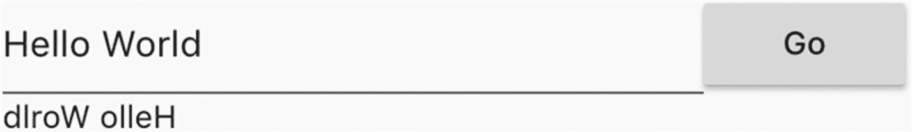

图 6-1
使用 `TextEditingController`


#### 使用 `TextEditingController` 的监听器

`TextEditingController` 实例同时也是 `ValueNotifier<TextEditingValue>` 的实例，因此你可以为其添加监听器来响应通知。在代码清单 6-2 中，监听器函数 `_handleTextChanged` 在接收到变更通知时会调用 `setState()` 函数来更新状态。监听器在 `initState()` 函数中添加，并在 `dispose()` 函数中移除，这样可以确保资源被妥善清理。

```
class ReverseTextWithListener extends StatefulWidget {
@override
_ReverseTextWithListenerState createState() =>
_ReverseTextWithListenerState();
}
class _ReverseTextWithListenerState extends State {
TextEditingController _controller;
String _value;
@override
void initState() {
super.initState();
_controller = TextEditingController(
text: "",
);
_controller.addListener(_handleTextChanged);
}
@override
Widget build(BuildContext context) {
return Column(
crossAxisAlignment: CrossAxisAlignment.start,
children: [
TextField(
controller: _controller,
),
Text( (_value ?? "). split(").reversed.join()),
],
);
}
@override
void dispose() {
_controller.removeListener(_handleTextChanged);
super.dispose();
}
void _handleTextChanged() {
this.setState(() {
this._value = _controller.text;
});
}
}
代码清单 6-2
使用 TextEditingController 监听器
```

图 6-2 展示了代码清单 6-2 中代码的截图。

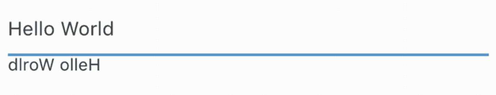

图 6-2

使用 TextEditingController 监听器

#### 使用回调函数

从 `EditableText` 组件获取文本的另一种方法是使用回调函数。与文本编辑相关的回调函数有三种类型，参见表 6-1。

表 6-1

`EditableText` 回调函数

| 名称 | 类型 | 描述 |
| --- | --- | --- |
| `onChanged` | `ValueChanged<String>` | 文本更改时调用。 |
| `onEditingComplete` | `VoidCallback` | 用户提交文本时调用。 |
| `onSubmitted` | `ValueChanged<String>` | 用户完成编辑文本时调用。 |

如果你想要主动监视文本变化，应该使用 `onChanged` 回调。当用户完成文本编辑时，`onEditingComplete` 和 `onSubmitted` 这两个回调都会被调用。区别在于 `onEditingComplete` 回调不提供对所提交文本的访问。

在代码清单 6-3 中，不同的回调函数记录了不同的消息。所有日志消息都显示在一个 `RichText` 组件中。

```
class TextFieldCallbacks extends StatefulWidget {
@override
_TextFieldCallbacksState createState() => _TextFieldCallbacksState();
}
class _TextFieldCallbacksState extends State {
List _logs = List();
void _log(String value) {
this.setState(() {
this._logs.add(value);
});
}
@override
Widget build(BuildContext context) {
return Column(
crossAxisAlignment: CrossAxisAlignment.start,
children: [
TextField(
onChanged: (text) => _log('changed: $text'),
onEditingComplete: () => _log('completed'),
onSubmitted: (text) => _log('submitted: $text'),
),
Text.rich(TextSpan(
children: this._logs.map((log) => TextSpan(text: '$log\n')).toList(),
)),
],
);
}
}
代码清单 6-3
EditableText 回调函数
```

图 6-3 展示了代码清单 6-3 中代码的截图。

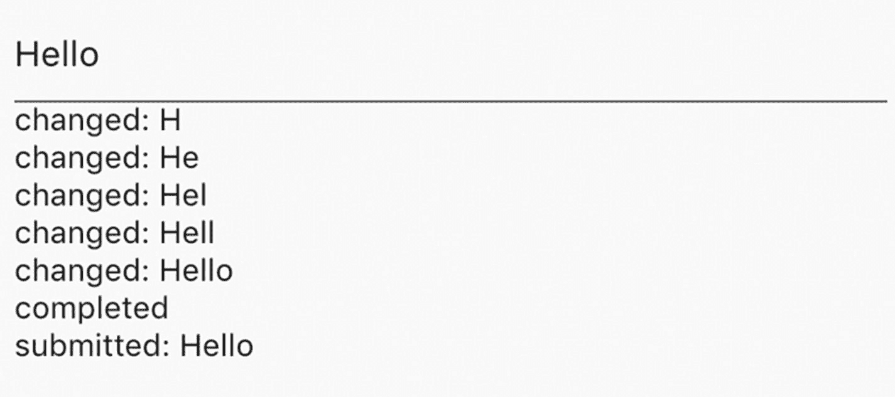

图 6-3

`EditableText` 回调函数

虽然代码清单 6-1、6-2 和 6-3 中的示例使用了 `TextField`，但相同的模式也可以应用于 `CupertinoTextField`。

## 6.2 自定义文本输入键盘

### 问题

你想自定义用于编辑文本的键盘。

### 解决方案

使用 `keyboardType`、`textInputAction` 和 `keyboardAppearance` 参数。

### 讨论

`EditableText` 组件允许自定义用于编辑文本的键盘。你可以使用类型为 `TextInputType` 类的 `keyboardType` 参数来设置适合文本的键盘类型。例如，如果 `EditableText` 组件用于编辑电话号码，那么 `TextInputType.phone` 是 `keyboardType` 参数的更好选择。表 6-2 展示了 `TextInputType` 中的常量。`TextInputType.number` 常量用于不带小数点的无符号数。对于其他类型的数字，你可以使用 `TextInputType.numberWithOptions({bool signed: false, bool decimal: false })` 构造函数来设置数字是否应带符号或是否应包含小数点。

表 6-2

`TextInputType` 常量

| 名称 | 描述 |
| --- | --- |
| `text` | 纯文本。 |
| `multiline` | 多行文本。 |
| `number` | 不带小数点的无符号数。 |
| `phone` | 电话号码。 |
| `datetime` | 日期和时间。 |
| `emailAddress` | 电子邮件地址。 |
| `url` | URL。 |

类型为 `TextInputAction` 枚举的 `textInputAction` 参数用于设置在用户提交文本时要执行的逻辑操作。例如，如果文本字段用于输入搜索查询，那么 `TextInputAction.search` 值会使键盘显示文本“Search”。用户可以期望在点击操作按钮后执行搜索操作。`TextInputAction` 枚举定义了一组操作。这些操作的按钮在不同平台或同一平台的不同版本上可能具有不同的外观。大多数操作在 Android 和 iOS 上均受支持。它们映射到 Android 上的 IME 输入类型和 iOS 上的键盘返回键类型。表 6-3 展示了 `TextInputAction` 的值及其在 Android 和 iOS 上的映射。某些操作可能仅在 Android 或 iOS 上受支持。使用不受支持的操作将导致在调试模式下抛出错误。然而，在发布模式下，不受支持的操作将分别在 Android 上映射为 `IME_ACTION_UNSPECIFIED`，在 iOS 上映射为 `UIReturnKeyDefault`。

表 6-3

`TextInputAction` 值

| 名称 | Android IME 输入类型 | iOS 键盘返回键类型 |
| --- | --- | --- |
| `none` | `IME_ACTION_NONE` | 不适用 |
| `unspecified` | `IME_ACTION_UNSPECIFIED` | `UIReturnKeyDefault` |
| `done` | `IME_ACTION_DONE` | `UIReturnKeyDone` |
| `search` | `IME_ACTION_SEARCH` | `UIReturnKeySearch` |
| `send` | `IME_ACTION_SEND` | `UIReturnKeySend` |
| `next` | `IME_ACTION_NEXT` | `UIReturnKeyNext` |
| `previous` | `IME_ACTION_PREVIOUS` | 不适用 |
| `continueAction` | 不适用 | `UIReturnKeyContinue` |
| `join` | 不适用 | `UIReturnKeyJoin` |
| `route` | 不适用 | `UIReturnKeyRoute` |
| `emergencyCall` | 不适用 | `UIReturnKeyEmergencyCall` |
| `newline` | `IME_ACTION_NONE` | `UIReturnKeyDefault` |

最后一个类型为 `Brightness` 的 `keyboardAppearance` 参数用于设置键盘的外观。`Brightness` 枚举有两个值：`dark` 和 `light`。此参数仅用于 iOS。

代码清单 6-4 展示了 `textInputAction` 和 `keyboardAppearance` 参数的用法。

*代码清单 6-4. `keyboardType` 和 `keyboardAppearance` 参数*

```
TextField(
keyboardType: TextInputType.phone,
)
TextField(
keyboardType: TextInputType.numberWithOptions(
signed: true,
decimal: true,
),
)
TextField(
textInputAction: TextInputAction.search,
keyboardAppearance: Brightness.dark,
)
```

## 6.3 在 Material Design 中为文本输入添加装饰

### 问题

你想在 Material Design 中为文本字段添加前缀和后缀等装饰。

### 解决方案

使用类型为 `InputDecoration` 的 `decoration` 参数。


### 讨论

`TextField` 组件支持添加不同的装饰，以向用户呈现各种信息。例如，如果文本输入值无效，你可以添加红色边框并在文本输入下方显示一些文本来提示。你还可以添加文本或图标作为前缀或后缀。如果 `TextField` 组件用于编辑货币值，你可以添加货币符号作为前缀。`TextField` 的 `decoration` 参数（类型为 `InputDecoration`）用于添加这些信息。`InputDecoration` 类有许多命名参数，我们接下来将进行介绍。

#### 边框

让我们从为文本输入组件添加边框开始。`InputDecoration` 构造函数有多个类型为 `InputBorder` 的参数，这些参数与边框相关，包括 `errorBorder`、`disabledBorder`、`focusedBorder`、`focusedErrorBorder` 和 `enabledBorder`。这些参数的名称表明了它们将根据状态在何时显示。还有一个 `border` 参数，但此参数仅用于提供边框的形状。

`InputBorder` 类是抽象类，因此应使用其子类 `UnderlineInputBorder` 或 `OutlineInputBorder`。`UnderlineInputBorder` 类仅在底部有边框。`UnderlineInputBorder` 构造函数的参数包括类型为 `BorderSide` 的 `borderSide` 和类型为 `BorderRadius` 的 `borderRadius`。`BorderSide` 类定义了边框一侧的颜色、宽度和样式。边框样式由 `BorderStyle` 枚举定义，其值有 `none` 和 `solid`。样式为 `BorderStyle.none` 的 `BorderSide` 将不会被渲染。`BorderRadius` 类为矩形的每个角定义了一组圆角半径。角的半径使用 `Radius` 类创建。半径的形状可以是圆形或椭圆形。圆形或椭圆形的半径可以分别使用构造函数 `Radius.circular(double radius)` 和 `Radius.elliptical(double x, double y)` 创建。`BorderRadius` 具有 `topLeft`、`topRight`、`bottomLeft` 和 `bottomRight` 属性，其类型为 `Radius`，用于表示这四个角的半径。你可以使用 `BorderRadius.only()` 为每个角指定不同的 `Radius` 实例，或者使用 `BorderRadius.all()` 为所有角使用单个 `Radius` 实例。

`OutlineInputBorder` 类在组件周围绘制一个矩形。`OutlineInputBorder` 构造函数也具有参数 `borderSide` 和 `borderRadius`。它还有一个 `gapPadding` 参数，用于指定边框间隙中显示的标签文本的水平内边距。

在代码清单 6-5 中，两个 `TextField` 组件都通过 `focusedBorder` 参数声明了在获得焦点时渲染的边框。

```
TextField(
decoration: InputDecoration(
enabledBorder: UnderlineInputBorder(
borderSide: BorderSide(color: Colors.red),
borderRadius: BorderRadius.all(Radius.elliptical(5, 10)),
),
),
)
TextField(
decoration: InputDecoration(
labelText: 'Username',
focusedBorder: OutlineInputBorder(
borderSide: BorderSide(color: Colors.blue),
borderRadius: BorderRadius.circular(10),
gapPadding: 2,
),
),
)
Listing 6-5
InputDecoration 示例
```

图 6-4 显示了代码清单 6-5 中代码的截图。第二个 `TextField` 处于聚焦状态，因此显示了聚焦边框。

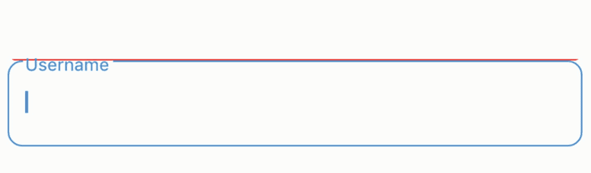

图 6-4

边框

#### 前缀和后缀

文本输入中的前缀和后缀可以提供在编辑文本时有用的信息和操作。前缀和后缀都可以是纯文本或组件。使用文本时，你可以自定义文本的样式。`InputDecoration` 构造函数具有参数 `prefix`、`prefixIcon`、`prefixText` 和 `prefixStyle` 来自定义前缀。它还具有参数 `suffix`、`suffixIcon`、`suffixText` 和 `suffixStyle` 来自定义后缀。你不能同时为 `prefix` 和 `prefixText` 指定非空值。此限制同样适用于 `suffix` 和 `suffixText`。你只能提供组件或文本，但不能同时提供两者。

```
TextField(
decoration: InputDecoration(
prefixIcon: Icon(Icons.monetization_on),
prefixText: 'Pay ',
prefixStyle: TextStyle(fontStyle: FontStyle.italic),
suffixText: '.00',
),
)
Listing 6-6
前缀和后缀示例
```

图 6-5 显示了代码清单 6-6 的截图。

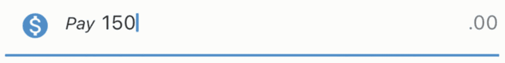

图 6-5

前缀和后缀

#### 文本

你可以添加不同类型的文本作为装饰并自定义其样式。表 6-4 显示了五种类型的文本。

表 6-4

不同文本类型

| 类型 | 文本 | 样式 | 描述 |
| --- | --- | --- | --- |
| 标签 | `labelText` | `labelStyle` | 标签显示在输入字段上方。 |
| 辅助 | `helperText` | `helperStyle` | 辅助文本显示在输入字段下方。 |
| 提示 | `hintText` | `hintStyle` | 当输入字段为空时，提示显示在其中。 |
| 错误 | `errorText` | `errorStyle` | 错误信息显示在输入字段下方。 |
| 计数器 | `counterText` | `counterStyle` | 计数器显示在输入字段下方，但靠右对齐。 |

如果 `errorText` 值不为 null，则输入字段将设置为错误状态。

```
TextField(
keyboardType: TextInputType.emailAddress,
decoration: InputDecoration(
labelText: 'Email',
labelStyle: TextStyle(fontWeight: FontWeight.bold),
hintText: 'Email address for validation',
helperText: 'For receiving validation emails',
counterText: '10',
),
)
Listing 6-7
文本示例
```

图 6-6 显示了代码清单 6-7 中代码的截图。

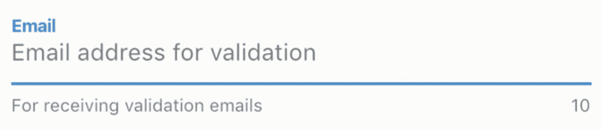

图 6-6

`TextField` 的文本

## 6.4 设置文本长度限制

### 问题

你想控制文本的长度。

### 解决方案

使用 `maxLength` 参数。

### 讨论

要设置 `TextField` 和 `CupertinoTextField` 中文本的最大长度，你可以使用 `maxLength` 参数。`maxLength` 参数的默认值为 `null`，表示对字符数没有限制。如果设置了 `maxLength` 参数，文本输入下方会显示一个字符计数器，显示已输入的字符数和允许的字符数。如果 `maxLength` 参数设置为 `TextField.noMaxLength`，则只显示已输入的字符数。当设置 `maxLength` 后，如果字符达到限制，其行为取决于 `maxLengthEnforced` 参数的值。如果 `maxLengthEnforced` 为 `true`（默认值），则无法再输入更多字符。如果 `maxLengthEnforced` 为 `false`，则可以输入额外字符，但组件会切换到错误样式。

```
TextField(
maxLength: TextField.noMaxLength,
)
TextField(
maxLength: 10,
maxLengthEnforced: false,
)
CupertinoTextField(
maxLength: 10,
)
Listing 6-8
maxLength 示例
```

图 6-7 显示了代码清单 6-8 中两个 `TextField` 组件的截图。

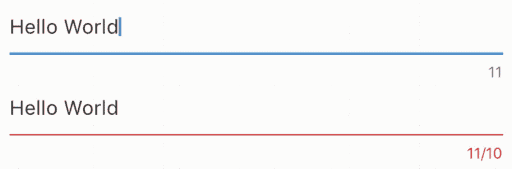

图 6-7

文本长度限制

## 6.5 选择文本

### 问题

你想在文本输入中选择一些文本。

### 解决方案

使用 `TextEditingController` 的 `selection` 属性。


### 讨论

在配方 6-1 中，您已经看到了使用 `TextEditingController` 来获取和设置使用 `EditableText` 的小部件文本的示例。`TextEditingController` 也可用于获取用户选择的文本以及选择文本。这是通过获取或设置 `selection` 属性（类型为 `TextSelection`）的值来实现的。

`TextSelection` 是 `TextRange` 的子类。您可以使用 `TextRange.textInside()` 来获取选中的文本。`TextSelection` 类使用 `baseOffset` 和 `extentOffset` 属性分别表示选择的起始和终止位置。`baseOffset` 的值可能大于、小于或等于 `extentOffset`。如果 `baseOffset` 等于 `extentOffset`，则表示选择已折叠。折叠的文本选择包含零个字符，但它们用于表示文本插入点。`TextSelection.collapsed()` 构造函数可以在指定偏移量处创建一个折叠的选择。

在清单 6-9 中，当文本选择发生变化时，会显示选中的文本。第一个按钮选择了范围 [0, 5] 内的文本，而第二个按钮将光标移动到偏移量 1。

```
class TextSelectionExample extends StatefulWidget {
@override
_TextSelectionExampleState createState() => _TextSelectionExampleState();
}
class _TextSelectionExampleState extends State {
TextEditingController _controller;
String _selection;
@override
void initState() {
super.initState();
_controller = new TextEditingController();
_controller.addListener(_handleTextSelection);
}
@override
void dispose() {
_controller.removeListener(_handleTextSelection);
super.dispose();
}
@override
Widget build(BuildContext context) {
return Column(
crossAxisAlignment: CrossAxisAlignment.start,
children: [
TextField(
controller: _controller,
),
Row(
children: [
RaisedButton(
child: Text('Select text [0, 5]'),
onPressed: () {
setState(() {
_controller.selection =
TextSelection(baseOffset: 0, extentOffset: 5);
});
},
),
RaisedButton(
child: Text('Move cursor to offset 1'),
onPressed: () {
setState(() {
_controller.selection = TextSelection.collapsed(offset: 1);
});
},
),
],
),
Text.rich(TextSpan(
children: [
TextSpan(
text: 'Selected:',
style: TextStyle(fontWeight: FontWeight.bold),
),
TextSpan(text: _selection ?? "),
],
)),
],
);
}
_handleTextSelection() {
TextSelection selection = _controller.selection;
if (selection != null) {
setState(() {
_selection = selection.textInside(_controller.text);
});
}
}
}
Listing 6-9
Text selection
```

图 6-8 显示了清单 6-9 中代码的截图。

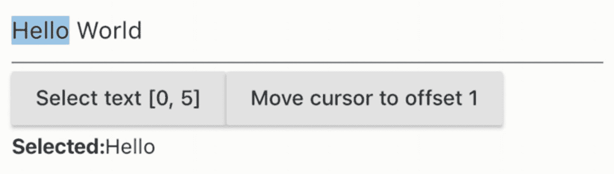

Figure 6-8

文本选择

## 6.6 格式化文本

### 问题

您想要格式化文本。

### 解决方案

结合 `EditableText` 使用 `TextInputFormatter`。

### 讨论

当用户在文本输入中键入时，您可能希望验证和格式化输入的文本。一个常见的要求是移除黑名单中的字符。这可以通过将 `TextInputFormatter` 实例列表作为 `TextField` 和 `CupertinoTextField` 的 `inputFormatters` 参数提供来实现。

`TextInputFormatter` 是一个抽象类，只有 `formatEditUpdate(TextEditingValue oldValue, TextEditingValue newValue)` 方法需要实现。`oldValue` 和 `newValue` 参数分别代表之前的文本和新文本。返回值是另一个代表格式化文本的 `TextEditingValue` 实例。`TextInputFormatter` 实例可以链式使用。当链式使用时，调用 `formatEditUpdate` 方法的 `oldValue` 始终是之前的文本，但 `newValue` 的值是链中前一个 `TextInputFormatter` 实例调用 `formatEditUpdate` 方法的返回值。

表 6-5 中显示了 `TextInputFormatter` 已有的三个内置实现类。这些类用于 `TextField` 和 `CupertinoTextField` 的实现。例如，当 `maxLines` 参数值为 1 时，`BlacklistingTextInputFormatter.singleLineFormatter` 会被添加到 `TextInputFormatter` 实例列表中，以过滤掉“\n”字符。

Table 6-5

TextInputFormatter 的实现

| 名称 | 描述 |
| --- | --- |
| `LengthLimitingTextInputFormatter` | 限制可以输入的字符数量。 |
| `BlacklistingTextInputFormatter` | 用给定的字符串替换与正则表达式模式匹配的字符。 |
| `WhitelistingTextInputFormatter` | 只允许与给定正则表达式模式匹配的字符。 |

除了声明新的 `TextInputFormatter` 子类之外，更简单的方法是使用 `TextInputFormatter.withFunction()` 方法，并传入一个与 `formatEditUpdate()` 方法类型匹配的函数。

在清单 6-10 中，输入文本被格式化为大写。

```
TextField(
inputFormatters: [
TextInputFormatter.withFunction((oldValue, newValue) {
return newValue.copyWith(text: newValue.text?.toUpperCase());
}),
],
)
Listing 6-10
格式化文本
```

## 6.7 选择单个值

### 问题

您想要从值列表中选择单个值。

### 解决方案

使用一组 `Radio` 小部件。

### 讨论

单选按钮通常用于需要单选场景。在一个组中，只能选择一个单选按钮。`Radio` 类有一个类型参数 `T`，代表值的类型。创建 `Radio` 实例时，您需要提供必需的参数，包括 `value`、`groupValue` 和 `onChanged`。`Radio` 小部件不维护任何状态。其外观完全由 `value` 和 `groupValue` 参数决定。当单选按钮组的选择发生变化时，会使用所选值调用 `onChanged` 监听器。表 6-6 显示了 `Radio` 构造函数的命名参数。

Table 6-6

Radio 的命名参数

| 名称 | 类型 | 描述 |
| --- | --- | --- |
| `value` | `T` | 此单选按钮的值。 |
| `groupValue` | `T` | 此组单选按钮的选定值。`groupValue` 对应的单选按钮处于选中状态。 |
| `onChanged` | `ValueChanged<T>` | 选择变化时的监听器函数。 |
| `activeColor` | `Color` | 此单选按钮被选中时的颜色。 |

在清单 6-11 中，`Fruit.allFruits` 变量是所有 `Fruit` 实例的列表。`_selectedFruit` 是当前选定的 `Fruit` 实例。对于每个 `Fruit` 实例，都会创建一个 `Radio<Fruit>` 小部件，其 `groupValue` 设置为 `_selectedFruit`。

```
class FruitChooser extends StatefulWidget {
@override
_FruitChooserState createState() => _FruitChooserState();
}
class _FruitChooserState extends State {
Fruit _selectedFruit;
@override
Widget build(BuildContext context) {
return Column(
crossAxisAlignment: CrossAxisAlignment.start,
children: [
Column(
children: Fruit.allFruits.map((fruit) {
return Row(
children: [
Radio(
value: fruit,
groupValue: _selectedFruit,
onChanged: (value) {
setState(() {
_selectedFruit = value;
});
},
),
Expanded(
child: Text(fruit.name),
),
],
);
}).toList(),
),
Text(_selectedFruit != null ? _selectedFruit.name : ")
],
);
}
}
Listing 6-11
使用 Radio 的示例
```

图 6-9 显示了清单 6-11 中示例的截图。

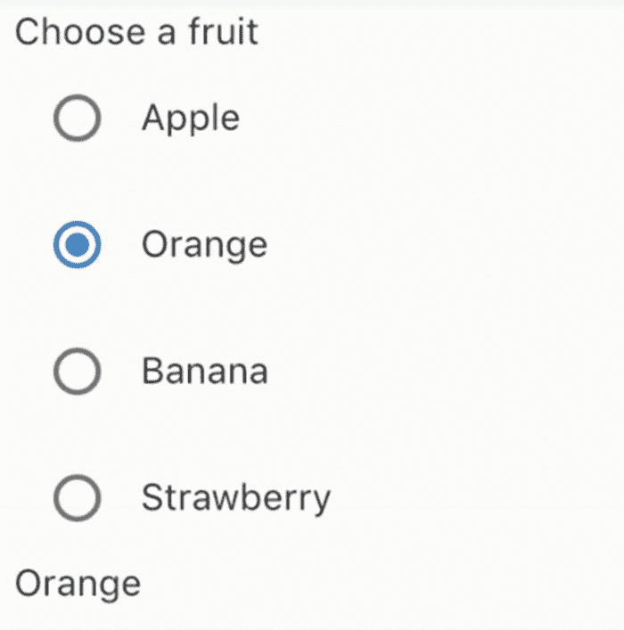

Figure 6-9

Radio 小部件

## 6.8 从下拉列表中选择单个值

### 问题

您想要从下拉列表中选择单个值。

### 解决方案

使用 `DropdownButton`。


### Discussion

一个`DropdownButton`小部件在被点击时会显示一个项目列表。 `DropdownButton`类是泛型类，其类型参数代表值的类型。 项目列表通过`items`参数指定，其类型为`List<DropdownMenuItem<T>>`。 `DropdownMenuItem`小部件是一个简单的封装器，包含`value`和一个`child`小部件。 当选择发生变化时，`onChanged`回调会被调用，并传入所选项目的值。 所选项目的值作为`value`参数传递。 如果`value`为`null`，则会显示`hint`小部件。

在清单 6-12 中，每个`Fruit`实例都被映射到一个`DropdownMenuItem`小部件。

```dart
class FruitChooser extends StatefulWidget {
  @override
  _FruitChooserState createState() => _FruitChooserState();
}
class _FruitChooserState extends State {
  Fruit _selectedFruit;
  @override
  Widget build(BuildContext context) {
    return Column(
      crossAxisAlignment: CrossAxisAlignment.start,
      children: [
        DropdownButton(
          value: _selectedFruit,
          items: Fruit.allFruits.map((fruit) {
            return DropdownMenuItem(
              value: fruit,
              child: Text(fruit.name),
            );
          }).toList(),
          onChanged: (fruit) {
            setState(() {
              _selectedFruit = fruit;
            });
          },
          hint: Text('Select a fruit'),
        ),
      ],
    );
  }
}
```
*清单 6-12 DropdownButton 示例*

图 6-10 展示了展开后的`DropdownButton`截图。

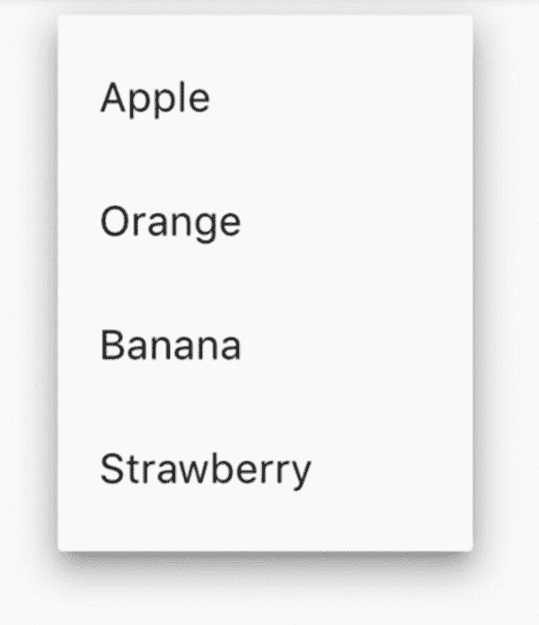

*图 6-10 展开后的 DropdownButton*

## 6.9 选择多个值

### 问题

你想要选择多个值。

### 解决方案

使用`Checkbox`小部件。

### 讨论

复选框通常用于允许多项选择。 如果复选框创建时将参数`tristate`设置为`true`，它可以显示三个值：`true`、`false`和`null`。 否则，只允许`true`和`false`两个值。 如果值为`null`，则显示一个破折号。 复选框本身不维护任何状态。 它的外观完全由`value`参数决定。 当复选框的值改变时，`onChanged`回调会被调用，并传入新的状态值。

在清单 6-13 中，选中的水果被维护在一个`List<Fruit>`实例中。 每个`Fruit`实例都被映射到一个`Checkbox`小部件。 `Checkbox`的值取决于对应的`Fruit`实例是否在`_selectedFruits`列表中。

```dart
class FruitSelector extends StatefulWidget {
  @override
  _FruitSelectorState createState() => _FruitSelectorState();
}
class _FruitSelectorState extends State {
  List _selectedFruits = List();
  @override
  Widget build(BuildContext context) {
    return Column(
      crossAxisAlignment: CrossAxisAlignment.start,
      children: [
        Column(
          children: Fruit.allFruits.map((fruit) {
            return Row(
              children: [
                Checkbox(
                  value: _selectedFruits.contains(fruit),
                  onChanged: (selected) {
                    setState(() {
                      if (selected) {
                        _selectedFruits.add(fruit);
                      } else {
                        _selectedFruits.remove(fruit);
                      }
                    });
                  },
                ),
                Expanded(
                  child: Text(fruit.name),
                )
              ],
            );
          }).toList(),
        ),
        Text(_selectedFruits.join(', ')),
      ],
    );
  }
}
```
*清单 6-13 Checkbox 示例*

图 6-10 展示了清单 6-13 中示例的截图。

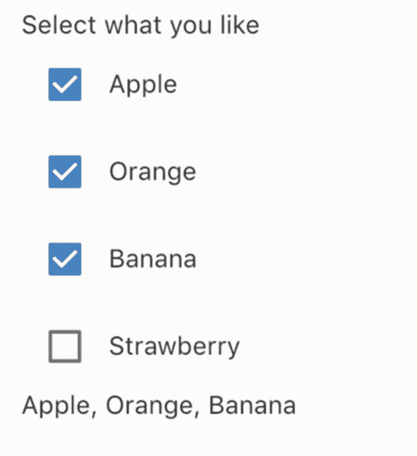

*图 6-11 Checkbox*

## 6.10 切换开/关状态

### 问题

你想要切换开/关状态。

### 解决方案

Material Design 使用`Switch`，iOS 风格使用`CupertinoSwitch`。

### 讨论

`Switch`是一个常用的 UI 控件，用于切换设置的开启/关闭状态。 `Switch`小部件用于 Material Design。 一个`Switch`小部件可以处于两种状态：激活和非激活。 `Switch`小部件本身不维护任何状态。 它的行为和外观完全由构造函数参数的值决定。 如果`value`参数为`true`，则`Switch`小部件处于激活状态；否则，它处于非激活状态。 当`Switch`小部件的开/关状态改变时，`onChanged`回调会被调用，并传入新的状态。 你可以使用参数`activeColor`、`activeThumbImage`、`activeTrackColor`、`inactiveThumbColor`、`inactiveThumbImage`和`inactiveTrackColor`来自定义`Switch`小部件在不同状态下的外观。

在清单 6-14 中，`Switch`小部件被用来控制另一个`TextField`小部件的状态。

```dart
class NameInput extends StatefulWidget {
  @override
  _NameInputState createState() => _NameInputState();
}
class _NameInputState extends State {
  bool _useCustomName = false;
  _buildNameInput() {
    return TextField(
      decoration: InputDecoration(labelText: 'Name'),
    );
  }
  _buildToggle() {
    return Row(
      children: [
        Switch(
          value: _useCustomName,
          onChanged: (value) {
            setState(() {
              _useCustomName = value;
            });
          },
          activeColor: Colors.green,
          inactiveThumbColor: Colors.grey.shade200,
        ),
        Expanded(
          child: Text('Use custom name'),
        ),
      ],
    );
  }
  @override
  Widget build(BuildContext context) {
    return Column(
      crossAxisAlignment: CrossAxisAlignment.start,
      children: _useCustomName
          ? [_buildToggle(), _buildNameInput()]
          : [_buildToggle()],
    );
  }
}
```
*清单 6-14 Switch 示例*

图 6-12 展示了清单 6-14 中示例的截图。

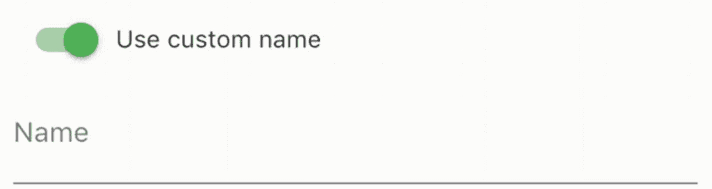

*图 6-12 Switch*

`CupertinoSwitch`小部件创建了一个 iOS 风格的开关，其工作方式与`Switch`相同，但仅支持自定义激活颜色。 `Switch`小部件拥有构造函数`Switch.adaptive()`，它会根据目标平台创建一个`Switch`小部件或`CupertinoSwitch`小部件。 当使用`Switch.adaptive()`创建`CupertinoSwitch`小部件时，仅使用`CupertinoSwitch()`接受的构造函数参数；其他参数将被忽略。

清单 6-15 展示了使用`CupertinoSwitch`和`Switch.adaptive()`的示例。

```dart
CupertinoSwitch(
  value: true,
  onChanged: (value) => {},
  activeColor: Colors.red.shade300,
)
Switch.adaptive(
  value: true,
  onChanged: (value) => {},
)
```
*清单 6-15 CupertinoSwitch 示例*

## 6.11 从范围中选择值

### 问题

你想从一个连续或离散的值范围中进行选择。

### 解决方案

Material Design 使用`Slider`，iOS 风格使用`CupertinoSlider`。


### 讨论

滑块通常用于从连续或离散的值范围中进行选择。你可以使用适用于 Material Design 的 `Slider` 组件，或适用于 iOS 风格的 `CupertinoSlider`。这两个组件行为相同，但视觉外观不同。创建滑块时，你需要使用 `min` 和 `max` 参数提供一个有效的值范围。如果 `divisions` 参数使用了非空值，则选择项将是一组离散的值。否则，选择项将是一个连续的值范围。例如，如果 `min` 的值为 `0.0`，`max` 的值为 `10.0`，并且 `divisions` 设置为 `5`，那么可选值就是 `0.0`、`2.0`、`4.0`、`6.0`、`8.0` 和 `10.0`。`Slider` 组件不维护任何状态。其行为和外观完全由构造函数参数决定。当滑块的值改变时，会使用选中的值调用 `onChanged` 回调。你也可以使用 `onChangeStart` 和 `onChangeEnd` 回调来分别获取值开始改变和改变完成的通知。你可以使用 `label`、`activeColor` 和 `inactiveColor` 进一步自定义滑块的外观。`CupertinoSlider` 仅支持 `activeColor` 参数。如果 `onChanged` 为 null 或范围为空，则该滑块组件将被禁用。

在代码清单 6-16 中，创建了一个带有 `divisions` 参数给定值的 `Slider` 组件，并显示了当前值。

```
class SliderValue extends StatefulWidget {
SliderValue({Key key, this.divisions}) : super(key: key);
final int divisions;
@override
_SliderValueState createState() => _SliderValueState(divisions);
}
class _SliderValueState extends State {
_SliderValueState(this.divisions);
final int divisions;
double _value = 0.0;
@override
Widget build(BuildContext context) {
return Row(
children: [
Expanded(
child: Slider(
value: _value,
min: 0.0,
max: 10.0,
divisions: divisions,
onChanged: (value) {
setState(() {
_value = value;
});
},
),
),
Text(_value.toStringAsFixed(2)),
],
);
}
}
```

*代码清单 6-16 — 滑块示例*

`CupertinoSlider` 的用法与 `Slider` 类似。你可以在代码清单 6-16 中简单地将 `Slider` 替换为 `CupertinoSlider`。图 6-13 展示了 `Slider` 和 `CupertinoSlider` 的截图。

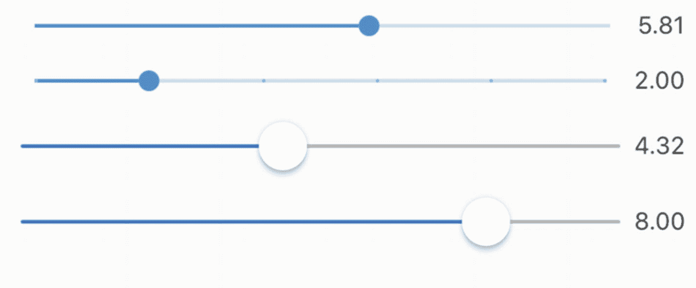

*图 6-13 — Slider 和 CupertinoSlider*

## 6.12 使用 Chips

### 问题

你想要使用紧凑的替代方案来表示不同类型的实体。

### 解决方案

使用不同类型的 `Chips`。

### 讨论

当空间有限时，像按钮、单选按钮和复选框这样的传统组件可能不适合。在这种情况下，可以使用 Material Design 中的 Chips 来表示相同的语义，但占用更少的空间。

`Chip` 组件是通用的 chip 实现，它有一个必需的 `label` 和一个可选的 `avatar`。当设置一个非空的 `onDeleted` 回调时，它还可以包含一个删除按钮。

`InputChip` 组件比 `Chip` 组件更强大。`InputChip` 组件可以通过设置 `onSelected` 回调变为可选中的，通过设置 `onPressed` 回调变为可点击的。但是，你不能同时为 `onSelected` 和 `onPressed` 回调设置非空值。当使用 `onSelected` 时，`InputChip` 组件的行为类似于复选框。你可以使用 `selected` 参数来设置状态。当使用 `onPressed` 时，`InputChip` 组件的行为类似于按钮。

`ChoiceChip` 组件的行为类似于单选按钮，它使用 `selected` 参数设置状态，并使用 `onSelected` 回调通知状态变化。但是，`ChoiceChip` 组件没有类似于 `Radio` 组件中 `groupValue` 的参数，因此你必须手动设置 `selected` 状态。

`FilterChip` 组件的行为类似于复选框。`FilterChip` 构造函数的参数与 `ChoiceChip` 构造函数相同。

`ActionChip` 组件的行为类似于带有 `onPressed` 参数的按钮。动作 chip 和按钮之间的区别在于，动作 chip 不能通过将 `onPressed` 参数设置为 null 来禁用。如果动作 chip 的动作不适用，则应将其移除。此行为与使用 chip 减少空间的目标一致。

事实上，所有这些 chip 组件都通过只使用 `RawChip` 构造函数支持的部分参数来包装 `RawChip`。

在代码清单 6-17 中，使用了 `ChoiceChip` 组件来实现单选。

```
class FruitChooser extends StatefulWidget {
@override
_FruitChooserState createState() => _FruitChooserState();
}
class _FruitChooserState extends State {
Fruit _selectedFruit;
@override
Widget build(BuildContext context) {
return Column(
crossAxisAlignment: CrossAxisAlignment.start,
children: [
Wrap(
spacing: 5,
children: Fruit.allFruits.map((fruit) {
return ChoiceChip(
label: Text(fruit.name),
selected: _selectedFruit == fruit,
onSelected: (selected) {
setState(() {
_selectedFruit = selected ? fruit : null;
});
},
selectedColor: Colors.red.shade200,
);
}).toList(),
),
Text(_selectedFruit != null ? _selectedFruit.name : ")
],
);
}
}
```

*代码清单 6-17 — ChoiceChip 示例*

在代码清单 6-18 中，使用了 `FilterChip` 组件来实现多选。

```
class FruitSelector extends StatefulWidget {
@override
_FruitSelectorState createState() => _FruitSelectorState();
}
class _FruitSelectorState extends State {
List _selectedFruits = List();
@override
Widget build(BuildContext context) {
return Column(
crossAxisAlignment: CrossAxisAlignment.start,
children: [
Wrap(
spacing: 5,
children: Fruit.allFruits.map((fruit) {
return FilterChip(
label: Text(fruit.name),
selected: _selectedFruits.contains(fruit),
onSelected: (selected) {
setState(() {
if (selected) {
_selectedFruits.add(fruit);
} else {
_selectedFruits.remove(fruit);
}
});
},
selectedColor: Colors.blue.shade200,
);
}).toList(),
),
Text(_selectedFruits.join(', ')),
],
);
}
}
```

*代码清单 6-18 — FilterChip 示例*

图 6-14 展示了代码清单 6-17 和 6-18 中示例的截图。

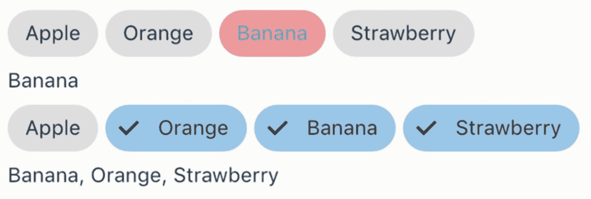

*Figure 6-14 — ChoiceChip 和 FilterChip*

## 6.13 选择日期和时间

### 问题

你想要选择日期和时间。

### 解决方案

使用 Material Design 的 `showDatePicker()` 和 `showTimePicker()` 函数，或使用 iOS 风格的 `CupertinoDatePicker` 和 `CupertinoTimerPicker`。


### 讨论

对于 Material Design，你可以使用诸如 `YearPicker`、`MonthPicker` 和 `DayPicker` 这类小部件，或者使用 `showDatePicker()` 函数来让用户选择日期。`showTimePicker()` 函数用于选择时间。小部件很少用于选择日期，大多数情况下会使用 `showDatePicker()` 和 `showTimePicker()` 函数来显示对话框。

`YearPicker` 小部件显示一个年份列表供用户选择。创建 `YearPicker` 小部件时，你需要通过 `selectedDate`、`firstDate` 和 `lastDate` 参数分别提供选中的日期、最早日期和最晚日期的 `DateTime` 实例。当选择发生变更时，`onChanged` 回调会被调用，并传入选中的 `DateTime` 实例。

`MonthPicker` 小部件显示一个月份列表供用户选择。`MonthPicker` 的构造函数拥有与 `YearPicker` 相同的 `selectedDate`、`firstDate`、`lastDate` 和 `onChanged` 参数。它还包含一个谓词函数 `selectableDayPredicate`，用于自定义哪些日子是可选择的。

`DayPicker` 小部件显示指定月份的天数供用户选择。`DayPicker` 的构造函数拥有 `MonthPicker` 的所有参数，另外还有 `displayedMonth` 参数，用于设置要选择日期的月份。

如果你希望显示一个对话框让用户选择日期，使用 `showDatePicker()` 函数比自己创建对话框更容易。你需要为 `initialDate`、`firstDate` 和 `lastDate` 参数传入 `DateTime` 实例。类型为 `BuildContext` 的 `context` 参数也是必需的。该函数可以工作在由 `DatePickerMode` 枚举定义的两种模式下：`DatePickerMode.day` 表示选择月份和日期，而 `DatePickerMode.year` 表示选择年份。`showDatePicker()` 函数的返回值是一个 `Future<DateTime>`，代表选中的日期。

在清单 6-19 中，`TextField` 小部件将 `IconButton` 作为后缀。当按钮被按下时，`showDatePicker()` 函数被调用以显示日期选择对话框。选中的日期会显示在 `TextField` 小部件中。

```
class PickDate extends StatefulWidget {
@override
_PickDateState createState() => _PickDateState();
}
class _PickDateState extends State {
DateTime _selectedDate = DateTime.now();
TextEditingController _controller = TextEditingController();
@override
Widget build(BuildContext context) {
return TextField(
controller: _controller,
decoration: InputDecoration(
labelText: 'Date',
suffix: IconButton(
icon: Icon(Icons.date_range),
onPressed: () {
showDatePicker(
context: context,
initialDate: _selectedDate,
firstDate: DateTime.now().subtract(Duration(days: 30)),
lastDate: DateTime.now().add(Duration(days: 30)),)
.then((selectedDate) {
if (selectedDate != null) {
_selectedDate = selectedDate;
_controller.text = DateFormat.yMd().format(_selectedDate);
}
});
},
),
),
);
}
}
Listing 6-19
Pick date
```

`showTimePicker()` 函数显示一个用于选择时间的对话框。你需要传入类型为 `TimeOfDay` 的 `initialTime` 参数作为初始显示时间。返回值是一个 `Future<TimeOfDay>` 实例，代表选中的时间。清单 6-20 中的代码使用了与清单 6-19 类似的模式来显示时间选择对话框。

```
class PickTime extends StatefulWidget {
@override
_PickTimeState createState() => _PickTimeState();
}
class _PickTimeState extends State {
TimeOfDay _selectedTime = TimeOfDay.now();
TextEditingController _controller = TextEditingController();
@override
Widget build(BuildContext context) {
return TextField(
controller: _controller,
decoration: InputDecoration(
labelText: 'Time',
suffix: IconButton(
icon: Icon(Icons.access_time),
onPressed: () {
showTimePicker(
context: context,
initialTime: _selectedTime,
).then((selectedTime) {
if (selectedTime != null) {
_selectedTime = selectedTime;
_controller.text = _selectedTime.format(context);
}
});
},
)),
);
}
}
Listing 6-20
Pick time
```

在 iOS 风格下，你可以分别使用 `CupertinoDatePicker` 和 `CupertinoTimerPicker` 小部件来选择日期和时间。`CupertinoDatePicker` 可以根据 `CupertinoDatePickerMode` 枚举的 `mode` 参数有不同的模式，包括 `date`、`time` 和 `dateAndTime`。与 Material Design 的小部件类似，`CupertinoDatePicker` 构造函数拥有 `initialDateTime`、`minimumDate`、`maximumDate` 和 `onDateTimeChanged` 参数。`CupertinoTimerPicker` 也可以根据 `CupertinoTimerPickerMode` 枚举的 `mode` 参数有不同的模式，包括 `hm`、`ms` 和 `hms`。区别在于 `CupertinoTimerPicker` 使用 `Duration` 实例来设置初始值，并作为 `onTimerDurationChanged` 回调中的值。

## 6.14 包装表单字段

### 问题

你希望将表单小部件包装为表单字段。

### 解决方案

使用 `FormField` 或 `TextFormField`。


### 讨论

表单小部件可用作普通小部件。然而，这些表单小部件不维护任何状态；你需要始终将它们包裹在有状态小部件中以保持状态。一种典型的使用模式是利用 `onChanged` 回调来更新状态并触发表单小部件的重建。由于这是表单小部件的常见模式，Flutter 内置了一个 `FormField` 小部件来维护表单小部件的当前状态，它负责处理状态更新和验证错误。

`FormField` 类是泛型的，其类型参数 `T` 表示值的类型。`FormField` 可以作为独立的小部件使用，也可以作为 `Form` 小部件的一部分。本示例仅讨论独立使用方式。表 6-7 列出了 `FormField` 构造函数的命名参数。

**表 6-7** `FormField` 的命名参数

| 名称 | 类型 | 描述 |
| --- | --- | --- |
| `builder` | `FormFieldBuilder<T>` | 构建表示此表单项的小部件。 |
| `onSaved` | `FormFieldSetter<T>` | 表单保存时的回调。 |
| `validator` | `FormFieldValidator<T>` | 表单项的验证器。 |
| `initialValue` | `T` | 初始值。 |
| `autovalidate` | `boolean` | 是否在每次更改后自动验证。 |
| `enabled` | `boolean` | 此表单项是否启用。 |

`FormFieldBuilder<T>` 类型是一个 typedef，形式为 `Widget (FormFieldState<T> field)`。`FormFieldState<T>` 类继承自 `State` 类，表示表单项的当前状态。`FormFieldBuilder` 负责根据状态构建小部件。通过 `FormFieldState`，你可以获取表单项的当前值和错误文本。你还可以使用表 6-8 中 `FormFieldState` 的方法。`FormFieldValidator<T>` 同样是一个 typedef，形式为 `String(T value)`。它接收当前值作为输入，如果验证失败则返回一个非空字符串作为错误消息。`FormFieldSetter<T>` 类型是一个 typedef，形式为 `void(T newValue)`。

**表 6-8** `FormFieldState` 的方法

| 名称 | 描述 |
| --- | --- |
| `save()` | 使用当前值调用 `onSaved()` 方法。 |
| `validate()` | 调用 `validator` 并在验证失败时设置 `errorText`。 |
| `didChange(T value)` | 将字段的状态更新为新值。 |
| `reset()` | 将字段重置为初始值。 |

当在 `FormFields` 中包裹 `TextFields` 时，最好使用内置的 `TextFormField`。`TextFormField` 小部件已经处理了使用 `TextEditingController` 设置文本，以及使用 `FormFieldValidator` 返回的错误文本来更新输入装饰。`TextFormField` 构造函数支持来自 `TextField` 和 `FormField` 构造函数的参数。清单 6-21 中的 `TextFormField` 有一个验证器用于验证文本长度。

```
class NameInput extends StatelessWidget {
@override
Widget build(BuildContext context) {
return TextFormField(
decoration: InputDecoration(
labelText: 'Name',
),
validator: (value) {
if (value == null || value.isEmpty) {
return 'Name is required.';
} else if (value.length < 6) {
return 'Minimum length is 6.';
} else {
return null;
}
},
autovalidate: true,
);
}
}
清单 6-21
TextFormField
```

图 6-15 展示了清单 6-21 中代码的截图。

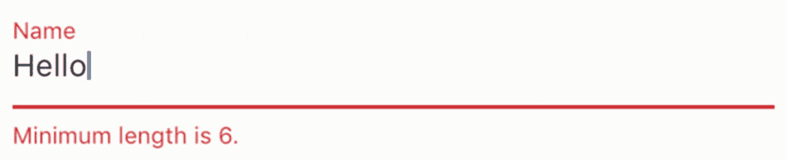

**图 6-15** `TextFormField`

`FormFieldState` 实例仅在 `FormField` 的构建器函数中可访问。如果你需要从其他位置访问状态，可以将一个 `GlobalKey` 作为 `FormField` 的 key 参数传递，然后使用 `currentState` 属性访问当前状态。

在清单 6-22 中，`FormField` 的状态是一个 `List<PizzaTopping>` 实例。借助 `GlobalKey`，可以在按下按钮时检索当前值。

```
class PizzaToppingsSelector extends StatelessWidget {
final GlobalKey>> _formFieldKey =
GlobalKey();
@override
Widget build(BuildContext context) {
return Column(
children: [
FormField>(
key: _formFieldKey,
initialValue: List(),
builder: (state) {
return Wrap(
spacing: 5,
children: PizzaTopping.allPizzaToppings.map((topping) {
return ChoiceChip(
label: Text(topping.name),
selected: state.value.contains(topping),
onSelected: state.value.length  newValue = List.of(state.value);
if (selected) {
newValue.add(topping);
} else {
newValue.remove(topping);
}
state.didChange(newValue);
}
: null,
);
}).toList(),
);
},
),
RaisedButton(
child: Text('Get toppings'),
onPressed: () => print(_formFieldKey.currentState?.value),
),
],
);
}
}
清单 6-22
FormField
```

## 6.15 创建表单

### 问题

你想要创建一个包含多个表单项的表单。

### 解决方案

使用 `Form`。

### 讨论

在使用表单项时，你通常试图构建一个包含多个表单项的表单。当处理多个表单项时，单独管理它们是繁琐的任务。`Form` 是一个便捷的包装器，用于管理多个表单项。你需要将所有表单项包裹在 `FormField` 小部件中，并使用 `Form` 小部件作为所有这些 `FormField` 小部件的共同祖先。`Form` 小部件是一个有状态小部件，其状态由关联的 `FormState` 实例管理。`FormState` 类包含 `save()`、`validate()` 和 `reset()` 方法。这些方法会调用后代 `FormField` 小部件的所有 `FormFieldState` 实例上对应的函数。

根据需要使用 `FormState` 的小部件的位置，有两种方式可以获取 `FormState` 实例。如果小部件是 `Form` 小部件的后代，使用 `Form.of(BuildContext context)` 是获取最近 `FormState` 实例的简便方法。第二种方式是在创建 `Form` 小部件时使用 `GlobalKey` 实例，然后使用 `GlobalKey.currentState` 获取 `FormState`。

清单 6-23 展示了一个登录表单的代码。两个 `TextFormField` 小部件都使用 `GlobalKey` 实例创建。

```
class LoginForm extends StatefulWidget {
@override
_LoginFormState createState() => _LoginFormState();
}
class _LoginFormState extends State {
final GlobalKey> _usernameFormFieldKey = GlobalKey();
final GlobalKey> _passwordFormFieldKey = GlobalKey();
_notEmpty(String value) => value != null && value.isNotEmpty;
get _value => ({
'username': _usernameFormFieldKey.currentState?.value,
'password': _passwordFormFieldKey.currentState?.value
});
@override
Widget build(BuildContext context) {
return Form(
child: Column(
children: [
TextFormField(
key: _usernameFormFieldKey,
decoration: InputDecoration(
labelText: 'Username',
),
validator: (value) =>
!_notEmpty(value) ? 'Username is required' : null,
),
TextFormField(
key: _passwordFormFieldKey,
obscureText: true,
decoration: InputDecoration(
labelText: 'Password',
),
validator: (value) =>
!_notEmpty(value) ? 'Password is required' : null,
),
Builder(builder: (context) {
return Row(
mainAxisAlignment: MainAxisAlignment.end,
children: [
RaisedButton(
child: Text('Log In'),
onPressed: () {
if (Form.of(context).validate()) {
print(_value);
}
},
),
FlatButton(
child: Text('Reset'),
onPressed: () => Form.of(context).reset(),
)
],
);
}),
],
),
);
}
}
清单 6-23
登录表单
```

图 6-16 展示了登录表单的截图。

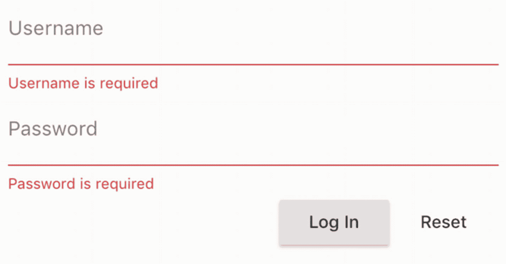

**图 6-16** 登录表单


## 6.16 小结

表单控件对于与用户交互至关重要。本章涵盖了 Material Design 和 iOS 风格的表单控件，包括文本输入、单选按钮、复选框、下拉菜单、开关、纸片和滑块。在下一章中，我们将讨论用于应用脚手架（Scaffolding）的控件。

