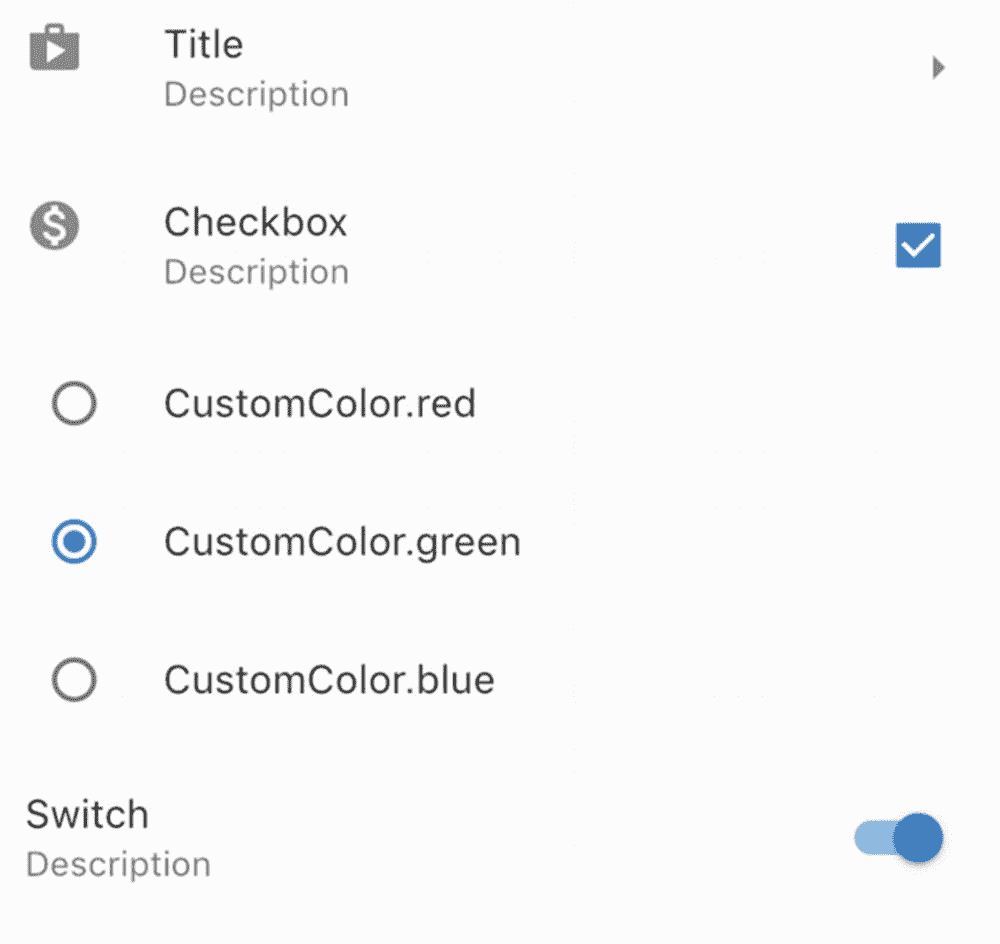
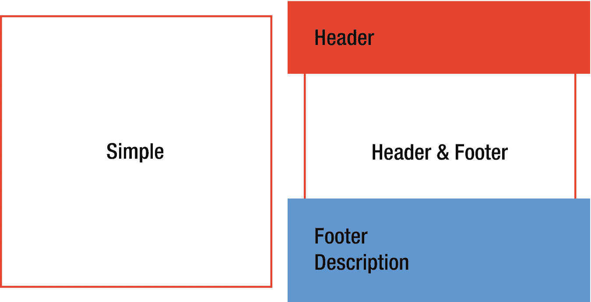
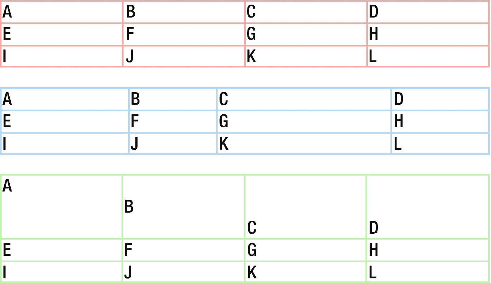

# 7. 常用控件

在 Flutter 应用中，一些控件因用途广泛而被频繁使用。本章将讨论一些常用控件。

## 7.1 显示项目列表

### 问题

你想要显示一个可滚动的项目列表。

### 解决方案

使用 `ListView` 控件作为项目的容器。

### 讨论

像 `Flex`、`Row` 和 `Column` 这样的 Flutter 布局控件不支持滚动，并且这些控件并非设计用于在需要滚动时显示项目。如果你想显示大量项目，应该使用 `ListView` 控件。你可以将 `ListView` 视为 `Flex` 控件的可滚动对应物。

有三种不同的方式可以通过不同的构造函数创建 `ListView` 控件：

*   从一个静态的子控件列表创建。
*   根据滚动位置按需构建子控件来创建。
*   创建自定义实现。

本方案重点介绍前两种方式。

#### 带有静态子控件的 ListView

如果你有一个静态的子控件列表，其大小可能超过父控件的大小，你可以将它们包裹在 `ListView` 控件中以启用滚动。这是通过调用 `ListView()` 构造函数并传入类型为 `Widget[]` 的 `children` 参数来实现的。滚动方向由类型为 `Axis` 的 `scrollDirection` 参数决定。默认的滚动方向是 `Axis.vertical`。如果你想以相反的顺序显示子控件，可以将 `reverse` 参数设置为 `true`。清单 7-1 展示了一个包含三个子控件的 `ListView` 控件。

```
ListView(
  children: [
    ExampleWidget(name: 'Box 1'),
    ExampleWidget(name: 'Box 2'),
    ExampleWidget(name: 'Box 3'),
  ],
)
```

默认的 `ListView()` 构造函数只应在子控件数量较少时使用。所有子控件都会被创建，即使其中一些在视口中不可见。这可能会影响性能。

#### 带有项目构建器的 ListView

如果你有大量项目或需要动态创建项目，可以使用 `ListView.builder()` 和 `ListView.separated()` 构造函数。你需要提供类型为 `IndexedWidgetBuilder` 的构建器函数来按需构建项目，而不是提供一个静态的控件列表。`IndexedWidgetBuilder` 是 `Widget (BuildContext context, int index)` 的 typedef。`index` 参数是要构建的项目的索引。`ListView` 控件确定视口中项目的索引，并调用构建器函数来构建要渲染的项目。如果项目总数已知，你应将此数字作为 `itemCount` 参数传入。如果 `itemCount` 非空，构建器函数将仅使用大于等于零且小于 `itemCount` 的索引被调用。如果 `itemCount` 为 `null`，则构建器函数需要返回 `null` 以指示没有更多项目可用。

当使用 `ListView.builder()` 构造函数时，你只需要提供类型为 `IndexedWidgetBuilder` 的 `itemBuilder` 参数。对于 `ListView.separated()` 构造函数，除了 `itemBuilder` 参数外，你还需要提供类型为 `IndexedWidgetBuilder` 的 `separatorBuilder` 参数来构建项目之间的分隔符。使用 `ListView.separated()` 时，`itemCount` 参数是必需的。清单 7-2 展示了使用 `ListView.builder()` 和 `ListView.separated()` 的示例。

```
ListView.builder(
  itemCount: 20,
  itemBuilder: (context, index) {
    return ExampleWidget(name: 'Dynamic Box ${index + 1}');
  },
);

ListView.separated(
  itemBuilder: (context, index) {
    return ExampleWidget(name: 'Separated Box ${index + 1}');
  },
  separatorBuilder: (context, index) {
    return Divider(
      height: 8,
    );
  },
  itemCount: 20,
);
```

如果项目在滚动方向上的尺寸已知，你应该将此值作为 `itemExtent` 参数传入。非空的 `itemExtent` 参数值可以使滚动更加高效。


#### ListTile

你可以使用任何 widget 作为 `ListView` 的子项。如果你希望列表项包含文本、图标和其他控件，可以使用 `ListTile` 及其子类。一个列表磁贴可以包含一到三行文本，以及位于文本前后的 leading 和 trailing widget。表 7-1 展示了

**表 7-2** `CheckboxListTile` 的参数

| 名称 | 类型 | 描述 |
| --- | --- | --- |
| `secondary` | `Widget` | 显示在磁贴另一侧的 widget。 |
| `controlAffinity` | `ListTileControlAffinity` | 控件在磁贴中的放置位置。 |

**表 7-1** `ListTile` 的参数

| 名称 | 类型 | 描述 |
| --- | --- | --- |
| `title` | `Widget` | 列表磁贴的标题。 |
| `subtitle` | `Widget` | 显示在标题下方的可选内容。 |
| `isThreeLine` | `bool` | 列表磁贴是否可以有*三行*文本。 |
| `leading` | `Widget` | 显示在标题之前的 widget。 |
| `trailing` | `Widget` | 显示在标题之后的 widget。 |
| `enabled` | `bool` | 列表磁贴是否启用。 |
| `selected` | `bool` | 列表磁贴是否被选中。选中时，图标和文本将以相同颜色渲染。 |
| `onTap` | `GestureTapCallback` | 点击标题时的回调。 |
| `onLongPress` | `GestureLongPressCallback` | 长按标题时的回调。 |
| `dense` | `bool` | 当为 true 时，磁贴的尺寸会减小。 |
| `contentPadding` | `EdgeInsetsGeometry` | 磁贴内部的填充。 |

清单 7-3 展示了使用 `ListTile` 的示例。

```
ListTile(
title: Text('标题'),
subtitle: Text('描述'),
leading: Icon(Icons.shop),
trailing: Icon(Icons.arrow_right),
)
清单 7-3
ListTile 示例
```

如果你希望在列表磁贴中添加复选框，可以使用 `CheckboxListTile` widget，它结合了 `ListTile` 和 `Checkbox`。`CheckboxListTile` 构造函数的参数 `title`、`subtitle`、`isThreeLine`、`selected` 和 `dense` 与 `ListTile` 构造函数相同。它还包含 `value`、`onChanged` 和 `activeColor` 参数，这些参数用于 `Checkbox` 构造函数。

`ListTileControlAffinity` 枚举定义了控件在列表磁贴中的位置。它有三个值：`leading`、`trailing` 和 `platform`。当指定了控件的位置后，`secondary` widget 总是被放置在另一侧。

```
class CheckboxInListTile extends StatefulWidget {
@override
_CheckboxInListTileState createState() => _CheckboxInListTileState();
}
class _CheckboxInListTileState extends State {
bool _value = false;
@override
Widget build(BuildContext context) {
return CheckboxListTile(
title: Text('复选框'),
subtitle: Text('描述'),
value: _value,
onChanged: (value) {
setState(() {
_value = value;
});
},
secondary: Icon(_value ? Icons.monetization_on : Icons.money_off),
);
}
}
清单 7-4
CheckboxListTile 示例
```

如果你希望在列表磁贴中添加单选按钮，可以使用 `RadioListTile<T>` widget。对于 `RadioListTile` 构造函数的参数，`value`、`groupValue`、`onChanged` 和 `activeColor` 的含义与 `Radio` 构造函数相同；`title`、`subtitle`、`isThreeLine`、`dense`、`secondary`、`selected` 和 `controlAffinity` 的含义与 `CheckboxListTile` 构造函数相同。清单 7-5 展示了使用 `RadioListTile` 的示例。

```
enum CustomColor { red, green, blue }
class RadioInListTile extends StatefulWidget {
@override
_RadioInListTileState createState() => _RadioInListTileState();
}
class _RadioInListTileState extends State {
CustomColor _selectedColor;
@override
Widget build(BuildContext context) {
return Column(
children: CustomColor.values.map((color) {
return RadioListTile(
title: Text(color.toString()),
value: color,
groupValue: _selectedColor,
onChanged: (value) {
setState(() {
_selectedColor = value;
});
},
);
}).toList(),
);
}
}
清单 7-5
RadioListTile 示例
```

如果你希望在列表磁贴中添加开关，可以使用 `SwitchListTile`。`SwitchListTile` 构造函数的部分参数来自 `Switch` 构造函数，其他参数则来自 `ListTile` 构造函数。清单 7-6 展示了使用 `SwitchListTile` 的示例。

```
class SwitchInListTile extends StatefulWidget {
@override
_SwitchInListTileState createState() => _SwitchInListTileState();
}
class _SwitchInListTileState extends State {
bool _value = false;
@override
Widget build(BuildContext context) {
return SwitchListTile(
title: Text('开关'),
subtitle: Text('描述'),
value: _value,
onChanged: (value) {
setState(() {
_value = value;
});
},
);
}
}
清单 7-6
SwitchListTile 示例
```

图 7-1 展示了不同 ListTile 的截图。



图 7-1 ListTile 示例

## 7.2 在网格中显示项目

### 问题

你想在网格中显示项目。

### 解决方案

使用 `GridView`。


### 讨论

`ListView` 组件以线性数组形式展示列表项。如需以二维数组形式展示组件，可使用 `GridView`。`GridView` 子组件的实际布局由 `SliverGridDelegate` 的实现类负责。Flutter 提供了两个内置的 `SliverGridDelegate` 实现：`SliverGridDelegateWithFixedCrossAxisCount` 和 `SliverGridDelegateWithMaxCrossAxisExtent`。您也可以自行创建 `SliverGridDelegate` 的实现。

为 `GridView` 提供子组件有三种方式：您可以提供一个静态的组件列表，或使用 `IndexedWidgetBuilder` 类型的构建器函数，或提供一个 `SliverChildDelegate` 的实现。

根据所选择的 `SliverGridDelegate` 和提供子组件的方式，您可以使用不同的 `GridView` 构造函数。表 7-3 展示了不同构造函数的用法。

**表 7-3** `GridView` 构造函数

| 名称 | 委托 | 子组件 |
| --- | --- | --- |
| `GridView()` | `SliverGridDelegate` | `Widget[]` |
| `GridView.builder()` | `SliverGridDelegate` | `IndexedWidgetBuilder` |
| `GridView.count()` | `SliverGridDelegateWithFixedCrossAxisCount` | `Widget[]` |
| `GridView.extent()` | `SliverGridDelegateWithMaxCrossAxisExtent` | `Widget[]` |
| `GridView.custom()` | `SliverGridDelegate` | `SliverChildDelegate` |

`SliverGridDelegateWithFixedCrossAxisCount` 类使用 `crossAxisCount` 参数来指定交叉轴上固定的瓦片数量。例如，如果 `GridView` 的滚动方向是垂直的，那么 `crossAxisCount` 参数指定了列数。清单 7-7 展示了一个使用 `GridView.count()` 创建三列网格的示例。

```
GridView.count(
crossAxisCount: 3,
children: List.generate(10, (index) {
return ExampleWidget(
name: 'Fixed Count ${index + 1}',
);
}),
);
```
**清单 7-7** 使用 `GridView.count()` 的示例

`SliverGridDelegateWithMaxCrossAxisExtent` 类使用 `maxCrossAxisExtent` 参数来指定交叉轴上的最大范围。瓦片实际的交叉轴范围将尽可能大，以便均匀划分 `GridView` 的交叉轴范围，并且不会超过指定的最大值。例如，如果 `GridView` 的交叉轴范围是 400，`maxCrossAxisExtent` 的值是 120，那么瓦片的交叉轴范围就是 100。如果 `GridView` 的滚动方向是垂直的，它将有四列。清单 7-8 展示了一个使用 `GridView.extent()` 的示例。

```
GridView.extent(
maxCrossAxisExtent: 250,
children: List.generate(10, (index) {
return ExampleWidget(
name: 'Max Extent ${index + 1}',
);
}),
);
```
**清单 7-8** 使用 `GridView.extent()` 的示例

要使用构建器函数创建子组件，您需要使用 `GridView.builder()` 构造函数搭配一个 `SliverGridDelegate` 实现。清单 7-9 展示了一个将 `GridView.builder()` 与 `SliverGridDelegateWithFixedCrossAxisCount` 结合使用的示例。

```
GridView.builder(
itemCount: 32,
gridDelegate:
SliverGridDelegateWithFixedCrossAxisCount(crossAxisCount: 3),
itemBuilder: (context, index) {
return ExampleWidget(
name: 'Builder ${index + 1}',
);
},
);
```
**清单 7-9** 使用 `GridView.builder()` 的示例

`SliverGridDelegateWithFixedCrossAxisCount` 和 `SliverGridDelegateWithMaxCrossAxisExtent` 这两个类都有其他命名参数来配置布局；请参见表 7-4。

**表 7-4** 内置 `SliverGridDelegate` 实现的参数

| 名称 | 类型 | 描述 |
| --- | --- | --- |
| `mainAxisSpacing` | `double` | 沿主轴方向的瓦片间距。 |
| `crossAxisSpacing` | `double` | 沿交叉轴方向的瓦片间距。 |
| `childAspectRatio` | `double` | 瓦片的交叉轴范围与主轴范围的比率。 |

使用这两个 `SliverGridDelegate` 实现时，会先确定每个瓦片的交叉轴范围，然后通过 `childAspectRatio` 参数确定主轴范围。如果 `GridView` 用于显示具有所需宽高比的图像，您可以使用相同的比率作为 `childAspectRatio` 参数的值。`GridView.count()` 和 `GridView.extent()` 构造函数都具有表 7-4 中相同的命名参数，以将这些参数传递给底层的 `SliverGridDelegate` 实现。清单 7-10 展示了在显示图像时使用 `childAspectRatio` 参数的示例。

```
GridView.count(
crossAxisCount: 3,
childAspectRatio: 4 / 3,
children: List.generate(10, (index) {
return Image.network('https://picsum.photos/400/300');
}),
);
```
**清单 7-10** 使用 `childAspectRatio` 参数

就像在 `ListView` 中使用 `ListTile` 一样，您也可以在 `GridView` 中使用 `GridTile`。一个网格瓦片包含一个必需的子组件，以及可选的页眉和页脚组件。对于网格瓦片的页眉和页脚，通常使用 `GridTileBar` 组件。`GridTileBar` 与 `ListTile` 类似。`GridTileBar` 构造函数包含 `title`（标题）、`subtitle`（副标题）、`leading`（前置图标）、`trailing`（后置图标）和 `backgroundColor`（背景色）参数。

```
GridView.count(
crossAxisCount: 2,
children: [
GridTile(
child: ExampleWidget(name: 'Simple'),
),
GridTile(
child: ExampleWidget(name: 'Header & Footer'),
header: GridTileBar(
title: Text('Header'),
backgroundColor: Colors.red,
),
footer: GridTileBar(
title: Text('Footer'),
subtitle: Text('Description'),
backgroundColor: Colors.blue,
),
)
],
);
```
**清单 7-11** `GridTile` 和 `GridTileBar` 示例

图 7-2 展示了清单 7-11 中代码的截图。



**图 7-2** `GridTile` 和 `GridTileBar`

## 7.3 显示表格数据

### 问题

您希望显示表格数据或对子组件使用表格布局。

### 解决方案

使用 `Table` 组件。


### 讨论

若要显示表格数据，使用数据表是自然之选。表格也可用于布局目的，以组织子组件。针对这两种使用场景，你可以使用 `Table` 组件。

一个 `Table` 组件可以包含多行。表格行由 `TableRow` 组件表示。`Table` 组件的构造函数拥有类型为 `List<TableRow>` 的 `children` 参数，用于提供行列表。`TableRow` 的构造函数也拥有类型为 `List<Widget>` 的 `children` 参数，用于提供该行中的单元格列表。表格中的每一行必须拥有相同数量的子组件。

表格的边框使用 `TableBorder` 类定义。`TableBorder` 与 `Border` 类似，但 `TableBorder` 有两个额外的边：

- `horizontalInside` – 行之间的内部水平边框
- `verticalInside` – 列之间的内部垂直边框

清单 7-12 展示了一个包含三行四列的简单表格示例。

```
Table(
  border: TableBorder.all(color: Colors.red.shade200),
  children: [
    TableRow(children: [Text('A'), Text('B'), Text('C'), Text('D')]),
    TableRow(children: [Text('E'), Text('F'), Text('G'), Text('H')]),
    TableRow(children: [Text('I'), Text('J'), Text('K'), Text('L')]),
  ],
);
```

表格的列宽通过 `TableColumnWidth` 的实现来配置。`columnWidths` 参数（类型为 `Map<int, TableColumnWidth>`）定义了列索引与其 `TableColumnWidth` 实现之间的映射关系。表 7-5 展示了内置的 `TableColumnWidth` 实现。`MinColumnWidth` 和 `MaxColumnWidth` 类组合了其他的 `TableColumnWidth` 实现。如果某列未找到 `TableColumnWidth` 实现，则使用 `defaultColumnWidth` 参数来获取默认的 `TableColumnWidth` 实现。`defaultColumnWidth` 的默认值是 `FlexColumnWidth(1.0)`，这意味着所有列的宽度相同。

**表 7-5** `TableColumnWidth` 实现

| 名称 | 性能 | 描述 |
| --- | --- | --- |
| `FixedColumnWidth` | 高 | 使用固定的像素数作为列宽。 |
| `FlexColumnWidth` | 中 | 在其他所有非弹性列尺寸确定后，使用弹性因子分配剩余空间。 |
| `FractionColumnWidth` | 中 | 使用表格最大宽度的一个比例作为列宽。 |
| `IntrinsicColumnWidth` | 低 | 使用列中所有单元格的固有尺寸来确定列宽。 |
| `MinColumnWidth` | | 两个 `TableColumnWidth` 对象中的较小值。 |
| `MaxColumnWidth` | | 两个 `TableColumnWidth` 对象中的较大值。 |

清单 7-13 展示了一个具有不同列宽的表格示例。

```
Table(
  border: TableBorder.all(color: Colors.blue.shade200),
  columnWidths: {
    0: FixedColumnWidth(100),
    1: FlexColumnWidth(1),
    2: FlexColumnWidth(2),
    3: FractionColumnWidth(0.2),
  },
  children: [
    TableRow(children: [Text('A'), Text('B'), Text('C'), Text('D')]),
    TableRow(children: [Text('E'), Text('F'), Text('G'), Text('H')]),
    TableRow(children: [Text('I'), Text('J'), Text('K'), Text('L')]),
  ],
);
```

单元格的垂直对齐方式通过 `TableCellVerticalAlignment` 枚举的值来配置。`TableCellVerticalAlignment` 枚举包含值 `top`、`middle`、`bottom`、`baseline` 和 `fill`。`Table` 构造函数的 `defaultVerticalAlignment` 参数指定了默认的 `TableCellVerticalAlignment` 值。如果你想自定义单个单元格的垂直对齐方式，可以将该单元格组件包裹在 `TableCell` 组件内，并指定 `verticalAlignment` 参数。清单 7-14 展示了一个为单元格指定垂直对齐方式的示例。

```
class VerticalAlignmentTable extends StatelessWidget {
  @override
  Widget build(BuildContext context) {
    return Table(
      border: TableBorder.all(color: Colors.green.shade200),
      defaultVerticalAlignment: TableCellVerticalAlignment.bottom,
      children: [
        TableRow(children: [
          TextCell('A'),
          TableCell(
            verticalAlignment: TableCellVerticalAlignment.middle,
            child: Text('B'),
          ),
          Text('C'),
          Text('D'),
        ]),
        TableRow(children: [Text('E'), Text('F'), Text('G'), Text('H')]),
        TableRow(children: [Text('I'), Text('J'), Text('K'), Text('L')]),
      ],
    );
  }
}

class TextCell extends StatelessWidget {
  TextCell(this.text, {this.height = 50});
  final String text;
  final double height;

  @override
  Widget build(BuildContext context) {
    return ConstrainedBox(
      constraints: BoxConstraints(
        minHeight: height,
      ),
      child: Text(text),
    );
  }
}
```

图 7-3 展示了不同表格的截图。



## 7.4 构建 Material Design 页面框架

### 问题

你想要构建 Material Design 页面的框架。

### 解决方案

使用 `Scaffold` 及其他相关组件。

### 讨论

Material Design 应用具有通用的布局结构。`Scaffold` 组件将其他通用组件组合在一起，以创建基本的页面结构。表 7-6 展示了可以包含在 `Scaffold` 组件中的元素。指定为 `drawer` 和 `endDrawer` 的组件初始时隐藏，可通过滑动来显示。滑动方向取决于文本方向。`drawer` 组件使用与文本方向相同的方向，而 `endDrawer` 组件则使用相反的方向。例如，如果文本方向是从左到右，则 `drawer` 组件通过从左向右滑动来打开，而 `endDrawer` 组件通过从右向左滑动来打开。

**表 7-6** `Scaffold` 元素

| 参数 | 组件 | 描述 |
| --- | --- | --- |
| `appBar` | `AppBar` | 显示在顶部的应用栏。 |
| `floatingActionButton` | `FloatingActionButton` | 浮动在底部主体右上角的按钮。 |
| `drawer` | `Drawer` | 显示在主体侧面的隐藏面板。 |
| `endDrawer` | `Drawer` | 显示在主体侧面的隐藏面板。 |
| `bottomNavigationBar` | `BottomAppBar` / `BottomNavigationBar` | 显示在底部的导航栏。 |
| `bottomSheet` | `BottomSheet` | 持久的底部工作表。 |
| `persistentFooterButtons` | `List<Widget>` | 显示在底部的一组按钮。 |
| `body` | `Widget` | 主要内容。 |

表 7-6 中的第二列仅列出了这些元素的首选组件类型。`Scaffold` 构造函数实际上接受任何类型的组件。例如，你可以使用 `ListView` 组件作为 `drawer`。然而，这些首选组件更为合适。


#### 应用栏

`AppBar` 小部件用于显示当前屏幕的基本信息。它由一个工具栏和其他小部件组成。表 7-7 展示了 `AppBar` 小部件的构成元素。这些元素也是 `AppBar` 构造器的具名参数。

**表 7-7** `AppBar` 的参数

| 名称 | 描述 |
| --- | --- |
| `title` | 工具栏中的主要小部件。 |
| `leading` | 在 `title` 之前显示的小部件。 |
| `actions` | 在 `title` 之后显示的小部件列表。 |
| `bottom` | 显示在底部的小部件。 |
| `flexibleSpace` | 堆叠在工具栏和 `bottom` 之后的小部件。 |

如果 `leading` 小部件为 null 且 `automaticallyImplyLeading` 参数为 true，则实际的 `leading` 小部件会从当前状态推断得出。如果 `Scaffold` 包含一个抽屉，则 `leading` 小部件是一个用于打开抽屉的按钮。如果最近的 `Navigator` 有上一个路由记录，则 `leading` 小部件是一个用于返回上一个路由的 `BackButton`。

`actions` 列表中的小部件通常是 `IconButtons`。如果没有足够的空间放置这些 `IconButtons`，可以将 `PopupMenuButton` 作为最后一个操作项，并将其他操作放入弹出菜单中。`TabBar` 小部件通常用作 `bottom` 小部件。清单 7-15 展示了一个使用 `AppBar` 的示例。

```
AppBar(
  title: Text('Scaffold'),
  actions: [
    IconButton(
      icon: Icon(Icons.search),
      onPressed: () {},
    ),
  ],
);
```

#### 浮动操作按钮

`FloatingActionButton` 小部件是一种特殊类型的按钮，用于提供对主要操作的快速访问。浮动操作按钮是一个圆形图标，通常显示在屏幕的右下角。在 Gmail 应用中，邮件列表屏幕有一个用于撰写新邮件的浮动操作按钮。

`FloatingActionButton` 有两种类型。当使用 `FloatingActionButton()` 构造器时，只需提供 `child` 小部件和 `onPressed` 回调即可。当使用 `FloatingActionButton.extend()` 构造器时，需要提供 `icon` 和 `label` 小部件以及 `onPressed` 回调。对于这两种构造器，都可以使用 `foregroundColor` 和 `backgroundColor` 参数来自定义颜色。清单 7-16 展示了一个使用 `FloatingActionButton` 的示例。

```
FloatingActionButton(
  child: Icon(Icons.create),
  onPressed: () {},
);
```

#### 抽屉

`Drawer` 小部件是一个便捷的封装器，用于在滑动时显示在 `Scaffold` 小部件边缘的面板。虽然你可以使用 `Drawer` 来包裹任何小部件，但通常的做法是在抽屉中展示应用徽标、当前用户信息以及指向应用页面的链接。`ListView` 小部件常用作 `Drawer` 小部件的子项，以便在抽屉中启用滚动功能。

要显示应用徽标和当前用户信息，可以使用提供的 `DrawerHeader` 小部件及其子类 `UserAccountsDrawerHeader`。`DrawerHeader` 小部件包裹一个子小部件，并具有预定义的样式。`UserAccountsDrawerHeader` 是一个用于显示用户详细信息的专用小部件。表 7-8 展示了可以在 `UserAccountsDrawerHeader` 小部件中添加的部分。你还可以使用 `onDetailsPressed` 参数为点击包含账户名和电子邮件的区域添加一个回调。

**表 7-8** `UserAccountsDrawerHeader` 中的部分

| 名称 | 描述 |
| --- | --- |
| `currentAccountPicture` | 当前用户账户的头像。 |
| `otherAccountsPictures` | 当前用户其他账户的头像列表。最多只能有三个头像。 |
| `accountName` | 当前用户账户的名称。 |
| `accountEmail` | 当前用户账户的电子邮件。 |

清单 7-17 展示了一个将 `Drawer` 与 `UserAccountsDrawerHeader` 结合使用的示例。

```
Drawer(
  child: ListView(
    children: [
      UserAccountsDrawerHeader(
        currentAccountPicture: CircleAvatar(
          child: Text('JD'),
        ),
        accountName: Text('John Doe'),
        accountEmail: Text('john.doe@example.com'),
      ),
      ListTile(
        leading: Icon(Icons.search),
        title: Text('Search'),
      ),
      ListTile(
        leading: Icon(Icons.history),
        title: Text('History'),
      ),
    ],
  ),
);
```

#### 底部应用栏

`BottomAppBar` 小部件是 `AppBar` 的一个简化版本，显示在 `Scaffold` 的底部。通常只在底部应用栏中添加图标按钮。如果脚手架也包含一个浮动操作按钮，底部应用栏会为该按钮创建一个凹口以便对接。清单 7-18 展示了一个使用 `BottomAppBar` 的示例。

```
BottomAppBar(
  child: Text('Bottom'),
  color: Colors.red,
);
```

#### 底部导航栏

`BottomNavigationBar` 小部件提供了额外的链接，用于在不同视图之间导航。表 7-9 展示了 `BottomNavigationBar` 构造器的参数。

**表 7-9** `BottomNavigationBar` 的参数

| 名称 | 类型 | 描述 |
| --- | --- | --- |
| `items` | `List<BottomNavigationBarItem>` | 项目列表。 |
| `currentIndex` | `int` | 当前选中项目的索引。 |
| `onTap` | `ValueChanged<int>` | 选中项目改变时的回调。 |
| `type` | `BottomNavigationBarType` | 导航栏的类型。 |
| `fixedColor` | `Color` | 当类型为 `BottomNavigationBarType.fixed` 时，选中项目的颜色。 |
| `iconSize` | `double` | 图标的大小。 |

当点击某个项目时，会调用 `onTap` 回调，并传入被点击项目的索引。根据项目的数量，可以有多种方式来显示这些项目。项目的布局由 `BottomNavigationBarType` 枚举的值定义。如果值为 `fixed`，这些项目具有固定宽度，并且始终显示文本标签。如果值为 `shifting`，项目的位置可能会根据选中的项目而变化，并且只显示选中项目的文本标签。`BottomNavigationBar` 有一个默认的策略来选择类型。当项目少于四个时，使用 `BottomNavigationBarType.fixed`；否则，使用 `BottomNavigationBarType.shifting`。你可以使用 `type` 参数来覆盖默认行为。

表 7-10 展示了 `BottomNavigationBarItem` 构造器的参数。`icon` 和 `title` 参数都是必需的。如果 `BottomNavigationBar` 的类型是 `BottomNavigationBarType.shifting`，那么导航栏的背景颜色由选中项目的背景颜色决定。你应该指定 `backgroundColor` 参数来区分不同的项目。

**表 7-10** `BottomNavigationBarItem` 的参数

| 名称 | 类型 | 描述 |
| --- | --- | --- |
| `icon` | `Widget` | 项目的图标。 |
| `title` | `Widget` | 项目的标题。 |
| `activeIcon` | `Widget` | 项目被选中时显示的图标。 |
| `backgroundColor` | `Color` | 项目的背景颜色。 |

清单 7-19 展示了一个使用 `BottomNavigationBar` 和 `BottomNavigationBarItem` 的示例。

```
BottomNavigationBar(
  currentIndex: 1,
  type: BottomNavigationBarType.shifting,
  items: [
    BottomNavigationBarItem(
      icon: Icon(Icons.cake),
      title: Text('Cake'),
      backgroundColor: Colors.red.shade100,
    ),
    BottomNavigationBarItem(
      icon: Icon(Icons.map),
      title: Text('Map'),
      backgroundColor: Colors.green.shade100,
    ),
    BottomNavigationBarItem(
      icon: Icon(Icons.alarm),
      title: Text('Alarm'),
      backgroundColor: Colors.blue.shade100,
    ),
  ],
);
```


#### 底部抽屉面板

`BottomSheet` widget 显示在应用程序底部，用于提供额外信息。系统的分享面板就是底部抽屉面板的一个典型示例。底部抽屉面板有两种类型：

* 持久性底部抽屉面板始终可见。持久性底部抽屉面板可以使用 `ScaffoldState.showBottomSheet` 函数和 `Scaffold` 构造函数的 `bottomSheet` 参数来创建。
* 模态底部抽屉面板的行为类似模态对话框。模态底部抽屉面板可以使用 `showModalBottomSheet` 函数来创建。

`BottomSheet` 构造函数使用一个 `WidgetBuilder` 函数来创建实际内容。你还需要提供一个 `onClosing` 回调函数，该回调在底部抽屉面板开始关闭时被调用。清单 7-20 展示了一个使用 `BottomSheet` 的示例。

```
BottomSheet(
onClosing: () {},
builder: (context) {
return Text('Bottom');
},
);
Listing 7-20
BottomSheet 示例
```

#### Scaffold 状态

`Scaffold` 是一个有状态 widget。你可以使用 `Scaffold.of()` 方法从构建上下文中获取最近 `Scaffold` widget 的 `ScaffoldState` 对象。`ScaffoldState` 有不同的方法来与其他组件交互；请参见表 7-11。

**表 7-11** `ScaffoldState` 的方法

| 名称 | 描述 |
| --- | --- |
| `openDrawer()` | 打开抽屉。 |
| `openEndDrawer()` | 打开末端侧的抽屉。 |
| `showSnackBar(SnackBar snackbar)` | 显示 `SnackBar`。 |
| `hideCurrentSnackBar()` | 隐藏当前的 `SnackBar`。 |
| `removeCurrentSnackBar()` | 移除当前的 `SnackBar`。 |
| `showBottomSheet()` | 显示一个持久性底部抽屉面板。 |

#### SnackBar

`SnackBar` widget 在屏幕底部显示一条消息，并可附带一个可选操作。要创建一个 `SnackBar` widget，构造函数需要 `content` 参数来指定内容。`duration` 参数控制消息栏的显示时长。要向消息栏添加操作，你可以使用类型为 `SnackBarAction` 的 `action` 参数。当提供操作时，按下操作按钮会关闭消息栏。

要创建 `SnackBarAction` 实例，你需要提供 `label` 和 `onPressed` 回调。你可以使用 `textColor` 参数自定义按钮标签的颜色。消息栏操作的按钮只能被按下一次。

`ScaffoldState` 的 `showSnackBar()` 方法用于显示一个 `SnackBar` widget。一次最多只能显示一个消息栏。如果在另一个消息栏仍然可见时调用 `ScaffoldState()` 方法，则给定的消息栏会被添加到一个队列中，并在其他消息栏关闭后显示。`showSnackBar()` 方法的返回类型是 `ScaffoldFeatureController<SnackBar, SnackBarClosedReason>`。`SnackBarClosedReason` 是一个枚举，定义了消息栏可能被关闭的原因。

清单 7-21 展示了一个打开消息栏的示例。

```
Scaffold.of(context).showSnackBar(SnackBar(
content: Text('This is a message.'),
action: SnackBarAction(label: 'OK', onPressed: () {}),
));
Listing 7-21
SnackBar 示例
```

## 7.5 构建 iOS 页面框架

### 问题

你想要构建 iOS 页面框架。

### 解决方案

使用 `CupertinoPageScaffold`。

### 讨论

对于 iOS 应用，你可以使用 `CupertinoPageScaffold` widget 来创建页面的基本布局。与 Material Design 中的 `Scaffold` 相比，`CupertinoPageScaffold` 提供的自定义选项有限。你只能指定导航栏、子部件和背景颜色。

`CupertinoNavigationBar` widget 与 Material Design 中的 `AppBar` 类似，但 `CupertinoNavigationBar` 只能拥有 `leading`、`middle` 和 `trailing` 部件。`middle` 部件位于 `leading` 和 `trailing` 部件之间。当 `automaticallyImplyLeading` 参数为 `true` 时，`leading` 部件可以根据导航状态自动推断。当 `automaticallyImplyMiddle` 参数为 `true` 时，`middle` 部件也可以自动推断。

清单 7-22 展示了一个使用 `CupertinoPageScaffold` 和 `CupertinoNavigationBar` 的示例。

```
CupertinoPageScaffold(
navigationBar: CupertinoNavigationBar(
middle: Text('App'),
trailing: CupertinoButton(
child: Icon(CupertinoIcons.search),
onPressed: () {},
),
),
child: Container(),
);
Listing 7-22
CupertinoPageScaffold 示例
```

## 7.6 在 Material Design 中创建标签布局

### 问题

你想要创建标签栏和标签。

### 解决方案

使用 `TabBar`、`Tab` 和 `TabController`。

### 讨论

标签布局在移动应用中广泛使用，用于在一个页面中组织多个部分。要在 Material Design 中实现标签布局，你需要使用多个 widget 协同工作。`TabBar` widget 是 `Tab` widget 的容器。`TabController` widget 负责协调 `TabBar` 和 `TabView`。

一个 `Tab` widget 必须至少包含一些文本、一个图标或一个子 widget，但不能同时包含文本和子 widget。要创建一个 `TabBar`，你需要提供一个标签列表。你可以选择使用显式创建的 `TabController` 实例，或者使用共享的 `DefaultTabController` 实例。`DefaultTabController` 是一个继承型 widget。如果没有提供 `TabController`，`TabBar` 将尝试查找祖先级的 `DefaultTabController` 实例。

你可以选择提供一个 `TabController` 实例，或者使用继承的 `DefaultTabController`。要创建一个 `TabController`，你需要提供标签数量和一个 `TickerProvider` 实例。

在清单 7-23 中，`_TabPageState` 的混入 `SingleTickerProviderStateMixin` 是 `TickerProvider` 的一个实现，因此 `_TabPageState` 的当前实例被作为 `TabController` 构造函数的 `vsync` 参数传递。`TabController` 实例由 `TabBar` 和 `TabBarView` 共享。

```
class TabPage extends StatefulWidget {
@override
_TabPageState createState() => _TabPageState();
}
class _TabPageState extends State with SingleTickerProviderStateMixin {
final List _tabs = [
Tab(text: 'List', icon: Icon(Icons.list)),
Tab(text: 'Map', icon: Icon(Icons.map)),
];
TabController _tabController;
@override
void initState() {
super.initState();
_tabController = TabController(length: _tabs.length, vsync: this);
}
@override
void dispose() {
_tabController.dispose();
super.dispose();
}
@override
Widget build(BuildContext context) {
return Scaffold(
appBar: AppBar(
title: Text('Tab'),
bottom: TabBar(
tabs: _tabs,
controller: _tabController,
),
),
body: TabBarView(
children: _tabs.map((tab) {
return Center(
child: Text(tab.text),
);
}).toList(),
controller: _tabController,
),
);
}
}
Listing 7-23
使用提供的 TabController 的 TabBar
```

如果你不需要与 `TabController` 交互，使用 `DefaultTabController` 是更好的选择。清单 7-24 中的代码使用 `DefaultTabController` 实现了与清单 7-23 代码相同的功能。

```
class DefaultTabControllerPage extends StatelessWidget {
final List _tabs = [
Tab(text: 'List', icon: Icon(Icons.list)),
Tab(text: 'Map', icon: Icon(Icons.map))
];
@override
Widget build(BuildContext context) {
return DefaultTabController(
length: _tabs.length,
child: Scaffold(
appBar: AppBar(
bottom: TabBar(tabs: _tabs),
),
body: TabBarView(
children: _tabs.map((tab) {
return Center(
child: Text(tab.text),
);
}).toList(),
),
),
);
}
}
Listing 7-24
DefaultTabController
```

## 7.7 在 iOS 中实现标签布局

### 问题

你想要在 iOS 应用中实现标签布局。

### 解决方案

使用 `CupertinoTabScaffold`、`CupertinoTabBar` 和 `CupertinoTabView`。


### 讨论

在 iOS 应用中，也可以通过 `CupertinoTabScaffold`、`CupertinoTabBar` 和 `CupertinoTabView` 这些组件来实现标签布局。创建 `CupertinoTabScaffold` 时，应使用 `CupertinoTabBar` 作为 `tabBar` 参数的值。`CupertinoTabBar` 中的标签以 `BottomNavigationBarItem` 组件的形式呈现。`tabBuilder` 参数则指定了用于构建每个标签视图的构建器函数。清单 7-25/#479501_1_En_7_Chapter.xhtml#PC25) 展示了实现标签布局的一个示例。

```
class CupertinoTabPage extends StatelessWidget {
@override
Widget build(BuildContext context) {
return CupertinoTabScaffold(
tabBar: CupertinoTabBar(items: [
BottomNavigationBarItem(icon: Icon(CupertinoIcons.settings)),
BottomNavigationBarItem(icon: Icon(CupertinoIcons.info)),
]),
tabBuilder: (context, index) {
return CupertinoTabView(
builder: (context) {
return Center(
child: Text('Tab $index'),
);
},
);
},
);
}
}
清单 7-25
iOS 风格的标签布局
```

## 7.8 总结

本章讨论了 Flutter 中的常用组件，包括列表视图、网格视图、表格布局、页面脚手架和标签布局。这些组件构成了 Flutter 中页面的基本结构。在下一章中，我们将探讨 Flutter 应用中的页面导航。

